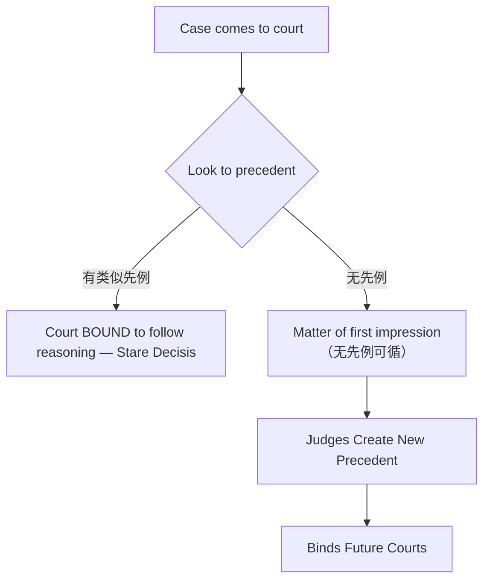

# Unit 1: Legal System

## 一、法律体系概述

- **Legal system**（法律体系）：a community uses to interpret and enforce its laws；对管辖区内所有法律争议具有约束力
- 三大基本法律体系：**common law**（普通法）、**civil law**（大陆法系）、**religious law**（宗教法）

---

## 二、普通法 Common Law

### （一）定义与核心特征

- 普通法 = **case law**（判例法）= **precedent**（先例）
- 由法官通过法院裁判发展而成，又称 **judge-made law**（法官造法）
- 对比：**legislative statutes**（成文法，立法机关制定）、**executive action**（行政行为）

### （二）Precedent（先例）

- 含义：a court decision considered authority for deciding subsequent cases involving identical or similar facts
- 分类：
  - **Binding precedent**（约束性先例）：来自上级法院
  - **Persuasive precedent**（说服性先例）：来自其他管辖区或下级法院

### （三）Stare Decisis（遵循先例原则）

- 拉丁语含义："to stand by things decided"
- 要求法院在审理类似案件时遵循历史先例，确保 **stability, certainty, predictability**
- **Vertical stare decisis**（纵向遵循先例）：下级法院必须严格遵循同一管辖区内上级法院的裁判
- **Horizontal stare decisis**（横向遵循先例）：法院遵循自身先前的裁判

### （四）普通法运作机制

### （五）普通法的历史起源

- **Henry II**（亨利二世，1153-1189）：制度化普通法
  - 整合并提升地方习惯为全国统一法律
  - 恢复陪审团制度（verdict based on local common knowledge）
  - 从中央法院派出法官巡回审判 → 讨论、记录、归档裁判 → 形成先例（stare decisis）
- "common" 的含义：shared, general, uniformly applied（通行全国，区别于地方法）

---

## 三、大陆法 Civil Law

### （一）概念辨析

| 含义 | 说明 |
|------|------|
| civil law（部门法） | 调整个人之间非刑事法律关系的法律分支，对比 criminal law / administrative law |
| civil law（法律体系） | 起源于西欧，在晚期罗马法框架中理论化，核心原则被编纂为可供查阅的体系 |
| jus civile | 拉丁语"市民法"，古罗马治理公民权利义务的法律体系 |
| jus gentium | "万民法"，law of nations / law of peoples |

### （二）大陆法体系特征

| 维度 | 大陆法 Civil Law | 普通法 Common Law |
|------|-----------------|-------------------|
| 主要法律渊源 | Codified laws（法典化法律） | Judicial decisions / precedents |
| 法官角色 | Interprets and applies the law | Creates and interprets the law |
| 法律程序 | Inquisitorial system（纠问制），no jury | Adversarial system（对抗制），jury system |
| 核心原则 | Codification（法典编纂） | Stare decisis（遵循先例） |
| 先例效力 | Persuasive authority（说服力） | Binding authority（约束力） |

### （三）大陆法的基本特征

- **Codification**（法典编纂）：核心法律原则被编纂成体系
- 抽象一般原则，区分实体规则与程序规则
- 判例法从属于成文法（statutory law）
- 推理方式：General Principle → Specific Case
- 纠问制审判模式（inquisitorial court system），法官受过法律训练，解释权有限
- 无陪审团，但可能有非职业法官（lay judges）

### （四）法典编纂的核心概念

- **Statute**（成文法）：an individual, formal law enacted by a legislative body
- **Code**（法典）：systematic, subject-organized compilation of statutes

### （五）大陆法的历史发展

- 源头：**Code of Justinian**（查士丁尼法典）——包括人法、家庭、继承、财产、侵权等
- 其他影响：日耳曼法、教会法（canon law）、封建制度、地方实践
- 叠加的法学思想：natural law（自然法）、codification（法典编纂）、legal positivism（法律实证主义）

### （六）历史相似性

> [!tip] 两大法系的历史对比
> 大陆法和普通法在历史演进上有相似之处：都以习惯法为基础，经判例法和立法发展。关键差异：①罗马法已通过《查士丁尼法典》将原则和机制固定化；②大陆法系中判例仅有说服力，不具约束力。

---

## 四、衡平法 Equity Law

### （一）定义

- 在遵循英国普通法传统的管辖区中，衡平法是补充严格法律规则的一套法律原则，适用于法律规则的适用会造成苛刻结果的情形
- 目的："mitigate the rigor of common law"（缓和普通法的严苛），允许法院运用自由裁量权（discretion）依照正义裁判
- 大陆法中的对应机制：宽泛的"一般条款"（general clauses）赋予法官类似的灵活空间

### （二）衡平法的指导原则

- 受实体规则和程序规则限制
- **Maxims of Equity**（衡平法格言）：12条核心格言 + 5条补充
  - "Equity will not suffer a wrong to be without a remedy." — 有权利必有救济
  - "He who seeks equity must do equity." — 寻求衡平者须自身公正
  - "Equity looks to intent, not form." — 重实质而非形式
- 衡平法被视为法律体系的"conscience"（良心）

### （三）衡平法的历史演变

**关键时间节点：**

| 时间 | 事件 |
|------|------|
| 比普通法晚200-300年 | 衡平法开始出现 |
| 15世纪 | 大法官法院的司法权得到承认 |
| 1529年 | Sir Thomas More，首位律师出身的大法官 |
| 约1557年 | 开始保存诉讼记录，推动衡平法原则发展 |
| 17世纪 | 大法官均由律师担任；衡平法被整合为先例体系 |

### （四）令状制度 The Writ System

- **Writ**（令状）：a formal written order issued by a court commanding a person to perform or refrain from a specific act
- "No Writ, No Remedy"：必须选择与法律投诉匹配的特定令状类型
- **Writ of Entry**（进入令状）：用于收回被非法占有的土地
- 1253年改革：以"诉讼形式"（form of action）的方式逐项签发令状，导致有时无法找到匹配的诉讼形式 → 不公正结果 → 向国王请愿

> [!caution] John Selden 的批评
> "衡平法就像以大法官的脚作为'英尺'的标准——一个大法官脚长，另一个脚短，第三个又不长不短。这样的尺度何其不确定。" —— 17世纪法学家 John Selden

### （五）衡平法与普通法的冲突

- **管辖权选择**（Jurisdiction Shopping）：诉讼当事人选择有利的法院
- 衡平法上的 **equitable injunction**（禁令）：禁止执行普通法法院的命令
- 违反禁令的惩罚：**监禁**（imprisonment）
- 反击：**Sir Edward Coke** 签发 **habeas corpus**（人身保护令）释放被监禁者

**关键案件：Earl of Oxford's Case (1615)**

- 大法官埃尔斯米尔签发普通禁令，禁止执行普通法命令 → 两法院陷入僵局
- 首席检察官 **Sir Francis Bacon** 裁定：**衡平法在冲突时优先**（Equity prevails in case of conflict）

### （六）1870年代《法院组织法》Judicature Acts

- 统一衡平法院与普通法法院为一个法院体系
- 同一法院中可同时寻求衡平法救济和普通法救济
- 两套规则仍然独立存在，衡平法作为普通法的补充
- **核心规则：冲突时衡平法仍优先**（Equity still prevails）

---

## 五、对抗制 vs. 纠问制

| 维度 | Adversarial System（对抗制） | Inquisitorial System（纠问制） |
|------|------------------------------|-------------------------------|
| 适用法系 | 普通法系 | 大陆法系 |
| 法官角色 | 中立裁判者（umpire） | 主动调查者 |
| 事实发现 | 由双方律师主导 | 由法官主导 |
| 陪审团 | 有 | 一般无（可能有非职业法官） |
