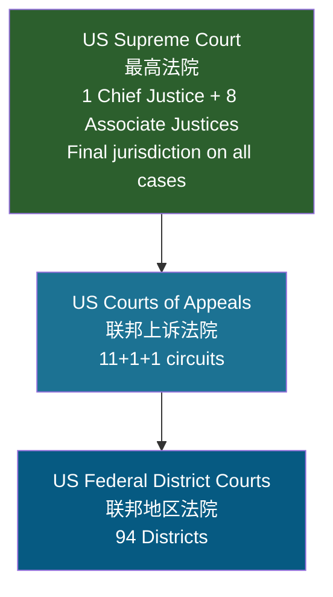
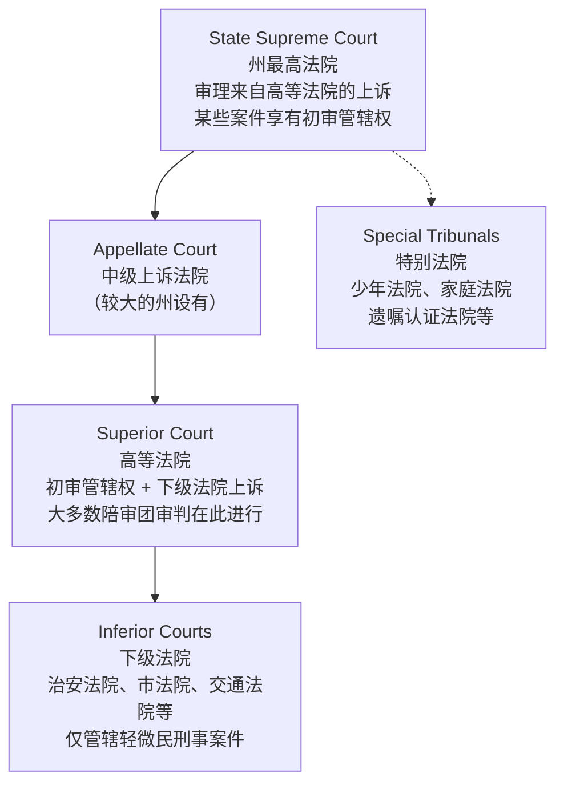

# Unit 4: Judicial System

## 一、联邦法院体系 The Federal Court System

### （一）宪法依据

> [!quote] Article III, Section 1
> "The judicial Power of the United States, shall be vested in one supreme Court, and in such inferior Courts as the Congress may from time to time ordain and establish."

- **judiciary**（司法系统）：a system of courts of law
- 联邦法院由宪法设立最高法院，国会设立下级法院

### （二）三级联邦法院结构

### （三）Federal District Courts（联邦地区法院）

- 定位：federal trial courts（联邦初审法院）
- 管辖权：**original jurisdiction**（初审管辖权）in most cases of federal law
- 受理案件类型：
  - 涉及宪法或联邦法律的案件
  - **Diversity of citizenship**（不同州公民之间的管辖）：争议金额超过 $75,000 的跨州案件
- 全国94个地区法院，每州1至4个
- 法官由总统任命，**serve for life**（终身任职）

### （四）US Courts of Appeals（联邦上诉法院）

- 别称：appellate courts / circuit courts
- 职能：审查初审法院的程序是否公正、法律适用是否正确
- 对联邦监管机构命令的挑战案件享有初审管辖权
- 结构：
  - 12个区域巡回区：11个按地理划分 + 1个哥伦比亚特区巡回区
  - 每个巡回区6至29名法官
- **US Court of Appeals for the Federal Circuit**（联邦巡回上诉法院）：全国范围管辖特定专业案件（专利法、国际贸易法院和联邦索赔法院的案件）

### （五）US Supreme Court（美国最高法院）

- 唯一由宪法明确设立的联邦法院
- **Final jurisdiction**（最终管辖权）on all cases
- 审查联邦上诉法院裁判；如涉及宪法或联邦问题，也可审查州上诉法院裁判
- **Original jurisdiction**（初审管辖权）in limited cases：涉及外国高级外交官的案件、两州之间的案件
- 自1869年以来：1名 Chief Justice + 8名 Associate Justices

### （六）特别联邦法院

| 类型 | 说明 |
|------|------|
| Article III courts | 一般联邦法院及法官（终身任职） |
| Article I courts | Bankruptcy Courts, Tax Court, Court of International Trade 等 |
| 其他 | Court of Military Appeals, Court of Veterans Appeals, FISA Court |

---

## 二、州法院体系 State Court Systems

### （一）基本结构

> [!caution] 各州法院结构差异很大，几乎没有两个州的司法系统完全相同。

### （二）各层级职能

| 法院层级 | 管辖权 |
|----------|--------|
| State Supreme Court | 审查州高等法院的上诉；对特别重要案件的初审管辖权 |
| Appellate Court（中级上诉法院） | 审查初审法院的裁判 |
| Superior Court（高等法院） | 下级法院的上诉 + 重大民刑事案件的初审管辖权；大多数陪审团审判 |
| Inferior Courts（下级法院） | 有限管辖权：仅处理轻微民事和刑事案件 |

### （三）州特别法院

- juvenile court（少年法院）、divorce court（离婚法院）、probate court（遗嘱认证法院）
- family court（家庭法院）、housing court（住房法院）、small claims court（小额索赔法院）
- 州法官可以由 **election**（选举）或 **appointment**（任命）产生

### （四）州法院命名示例

| 层级 | California | New York |
|------|-----------|----------|
| 最高法院 | California Supreme Court | New York Court of Appeals |
| 中级上诉法院 | Court of Appeal | Appellate Division |
| 初审法院 | Superior Court | Supreme Court |

> [!caution] New York 的特殊命名
> New York 的 "Supreme Court" 实际上是初审法院（trial court），并非最高法院。"Superior Court" 仅表示它是最高级别的初审法院，并不意味着它高于其他法院。

---

## 三、联邦法院 vs. 州法院

| 维度 | 联邦法院体系 | 州法院体系 |
|------|------------|-----------|
| 最高法院 | US Supreme Court | State Supreme Court |
| 上诉法院 | Circuit Courts of Appeals | State Appellate Courts |
| 初审法院 | District Courts | Superior Courts / Inferior Courts |
| 法官任命 | 总统任命，终身任职 | 选举或任命 |
| 管辖权 | 宪法和联邦法律案件 | 大多数日常案件 |

---

## 四、核心术语速查

| 术语 | 含义 |
|------|------|
| original jurisdiction | 初审管辖权，案件可直接向该法院提起 |
| appellate jurisdiction | 上诉管辖权，审查下级法院裁判 |
| diversity of citizenship | 不同州公民之间的管辖 |
| serve for life | 终身任职 |
| Chief Justice | 首席大法官 |
| Associate Justice | 大法官 |
| circuit court | 巡回法院（联邦上诉法院的别称） |
