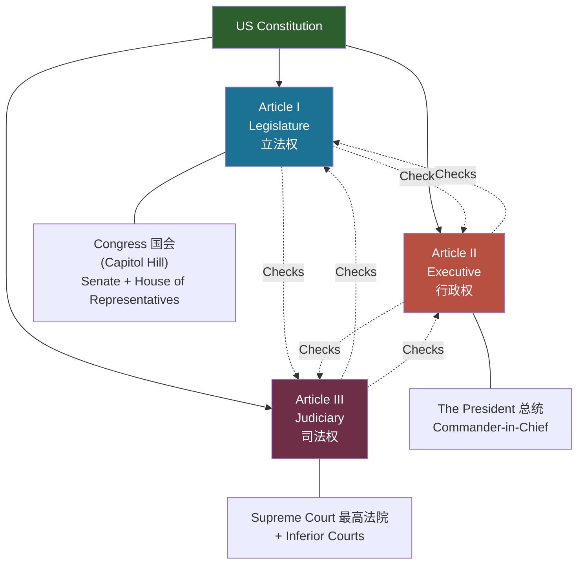

# Unit 5: Constitution

## 一、美国宪法概述

### （一）历史背景

- 世界现存最古老的成文宪法
- 1776年7月4日：13个殖民地独立
- 第一部宪法：**Articles of Confederation**（邦联条例，1781-89），创建了软弱的中央政府
- 1787年9月17日：**Constitutional Convention**（制宪会议）在费城通过《美利坚合众国宪法》
- 1788年6月：9个州批准（ratified）
- 1789年3月4日：正式生效
- 制宪者称谓：the Framers / the "Founding Fathers"

### （二）宪法结构

| 部分 | 内容 |
|------|------|
| The Preamble（序言） | 阐述政府的目标和宗旨 |
| Articles 1-3（第1-3条） | 确立联邦政府三权分立的规则和权力 |
| Articles 4-7（第4-7条） | 构建联邦制原则 |
| 27 Amendments（27条修正案） | 宪法修正，前10条为《权利法案》 |

---

## 二、三权分立 Separation of Powers

---

## 三、Article I — 立法部门 The Legislative Branch

> [!quote] Article I, Section 1
> "All legislative Powers herein granted shall be vested in a Congress of the United States, which shall consist of a Senate and House of Representatives."

- **Bicameral Congress**（两院制国会）：
  - **House of Representatives**（众议院）：每州按人口分配席位，议员每两年选举一次
  - **Senate**（参议院）：每州2名参议员，任期六年
- **Section 8**：列举国会的具体权力，包括 **Commerce Clause**（商业条款）——规制州际和对外商业活动的权力

---

## 四、Article II — 行政部门 The Executive Branch

> [!quote] Article II, Section 1
> "The executive Power shall be vested in a President of the United States of America."

| 条款 | 内容 |
|------|------|
| Section 2 | 总统权力：三军总司令（Commander-in-Chief）、赦免权（grant pardons）、缔结条约（须参议院批准）、任命大使和法官 |
| Section 3 | 总统职责：召集国会、接见外国使节、任命联邦官员 |
| Section 4 | 弹劾和免职的理由 |

**Presidential Impeachment**（总统弹劾）：
- 事由："Treason, Bribery, High crimes and misdemeanors"（叛国、贿赂、重罪和轻罪）

---

## 五、Article III — 司法部门 The Judicial Branch

- Section 1：司法权属于最高法院及国会设立的下级法院
- Section 2：界定联邦司法权范围
- Section 3：叛国罪（treason）

**Concurrent jurisdiction**（并行管辖权）：
- 两个或多个法院（联邦和州，或不同级别的州法院）对同一类型案件都有审理权
- 原告可选择认为最有利的法院 → **forum shopping**（法院选择）

---

## 六、Articles IV–VII

| 条款 | 核心内容 |
|------|---------|
| Article IV | 州际关系；**Full Faith and Credit Clause**（完全信赖与尊重条款）：各州须承认和尊重彼此的法律和裁判 |
| Article V | 修宪程序：国会两院三分之二投票提出修正案，四分之三的州（38/50）批准 |
| Article VI | **Supremacy Clause**（宪法至上条款）：宪法、联邦法律和条约为"全国最高法律" |
| Article VII | 宪法生效需9个州的制宪会议批准 |

---

## 七、权利法案 Bill of Rights

- 前10条修正案，1789年9月25日提出，1791年12月15日批准
- 保障个人的公民权利和自由
- 设定正当程序（due process of law）规则
- 未授予联邦政府的权力保留给各州或人民

> [!caution] 易错点
> 权利法案最初仅约束联邦政府，不约束州政府。通过第十四修正案的正当程序条款（Due Process Clause），最高法院逐步将大部分权利保障"合并"（incorporate）适用于各州。

---

## 八、Marbury v. Madison（1803）

### （一）核心意义

确立了 **judicial review**（司法审查）原则：联邦法院有权宣告与宪法相冲突的国会立法无效。使最高法院成为与国会和行政部门并列的独立政府部门。

### （二）案件背景

| 角色 | 人物 | 身份 |
|------|------|------|
| 联邦党人 | John Adams | 第2任总统，即将卸任（lame duck） |
| 联邦党人 | John Marshall | 前国务卿，新任首席大法官 |
| 联邦党人 | William Marbury | 被任命为哥伦比亚特区治安法官 |
| 民主共和党 | Thomas Jefferson | 第3任总统，新上任 |
| 民主共和党 | James Madison | 新任国务卿 |

- 1800年大选：Jefferson 击败 Adams
- Adams 在任期最后任命大量治安法官（"Midnight Judges" 午夜法官）
- 任命状已签署盖章但未送达
- Jefferson 命令 Madison 不得送达剩余任命状

### （三）案件事实

- Marbury 依据 **Judiciary Act of 1789, Section 13** 向最高法院申请 **writ of mandamus**（强制令），要求 Madison 交付任命状

### （四）争点 Issues

1. Marbury 是否有权获得任命状？
2. 法律是否允许法院授予该强制令？
3. 最高法院能否合法签发该强制令？

### （五）裁判 Holdings

| 争点 | 结论 | 理由 |
|------|------|------|
| Marbury 有权获得任命状？ | **Yes** | 任命状已正确签署和盖章；交付仅为惯例，非任命的必要条件 |
| 法律允许法院授予救济？ | **Yes** | 保护个人权利是法院的特殊责任——even against the President |
| 最高法院能签发强制令？ | **No** | Section 13 违宪：它将此类案件纳入最高法院初审管辖权，与 Article III 冲突 |

> [!quote] 关键推理
> "When an act of Congress is in conflict with the Constitution, it is the obligation of the court to uphold the Constitution." —— 依据 Supremacy Clause（宪法至上条款）

### （六）Significance（意义）

- 确立了 **judicial review**（司法审查）原则，成为美国宪法 law 的基石
- 为司法部门制衡其他政府部门树立了先例，维护了宪法至上和三权分立/制衡体制
