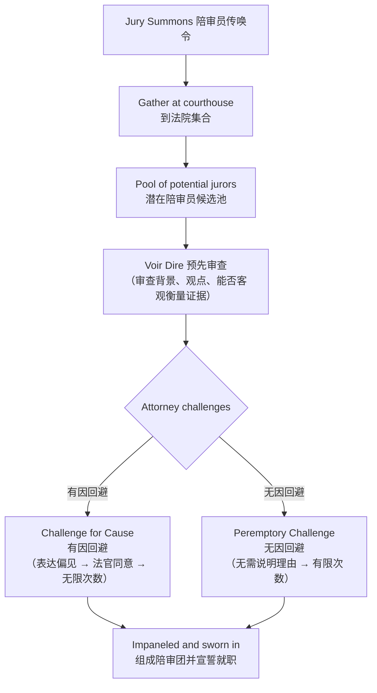

# Unit 6: Jury

## 一、陪审团概述

- **Jury**（陪审团）：a group of citizens summoned to hear evidence and render verdicts in criminal and civil cases
- **Juror**（陪审员）：陪审团的成员
- 核心问题：为何美国人信任12名未经法律训练的普通人（laymen）在法庭上作出法律裁判？

---

## 二、陪审团的五大特征

| 特征 | 说明 |
|------|------|
| **Selection** | 从最广泛的人群中随机选出12名普通人 |
| **Purpose** | 为某一特定审判而召集 |
| **Power** | 被赋予重大的正式裁判权（to determine facts） |
| **Deliberation** | 允许秘密评议（secret deliberation），无须说明理由 |
| **Disbandment** | 完成短暂服务后解散，回归私人生活 |

---

## 三、陪审团的三种类型

| 类型 | 职能 | 结果 | 宪法依据 | 人数 |
|------|------|------|----------|------|
| **Grand Jury**（大陪审团） | 调查刑事案件，判断是否存在 probable cause | 发出 indictment（起诉书） | 第五修正案（联邦犯罪） | 16-23人 |
| **Criminal Petit Jury**（刑事小陪审团） | 听取证词，判断被告是否有罪 | 裁决 Guilty / Not Guilty | Article III + 第六修正案 | 通常12人 |
| **Civil Petit Jury**（民事小陪审团） | 听取证词，判断民事纠纷中的 liability 和 damages | 裁决 Liable / Not Liable；可判 damages | 第七修正案（标的超过$20） | 6-12人 |

---

## 四、陪审团审判权与放弃

| 维度 | Criminal Jury（刑事） | Civil Jury（民事） |
|------|----------------------|-------------------|
| 法律权利 | 被告享有宪法赋予的陪审团审判权（Sixth Amendment） | 无自动的宪法权利；一方及时请求即可 |
| 权利放弃 | 被告可放弃，选择 **bench trial**（法官审判） | 双方同意即可放弃 |

---

## 五、第六修正案 The Sixth Amendment

> [!quote] 第六修正案
> "In all criminal prosecutions, the accused shall enjoy the right to a speedy and public trial, by an impartial jury of the State and district wherein the crime shall have been committed."

- 例外：**petty offenses**（轻微犯罪）
- 1968年通过第十四修正案的 **Due Process Clause** 合并适用于州法院（Duncan v. Louisiana）

> [!caution] 易错点
> "All criminal cases must have a jury." — **F**（并非所有刑事案件都必须有陪审团，轻微犯罪除外）

---

## 六、陪审员遴选程序 Jury Selection Process

### （一）Voir Dire（预先审查）

- 源自盎格鲁-法语，意为"to speak the truth"
- 双方律师和/或法官询问候选陪审员的背景、经历和观点
- 目的：判断能否公平、客观地衡量证据

### （二）两种回避方式

| 类型 | Challenge for Cause（有因回避） | Peremptory Challenge（无因回避） |
|------|-------------------------------|--------------------------------|
| 理由 | 候选陪审员表达或显露出偏见 | 基于"直觉"（gut feeling） |
| 数量 | 无限 | 严格限制 |
| 例外 | — | 不得基于 race, ethnicity, or sex |

### （三）Batson Rule

> [!tip] Batson v. Kentucky (1986)
> **Batson Rule** 禁止仅基于种族、民族或性别使用无因回避排除潜在陪审员。目的是使陪审团更准确地反映社区构成，防止滥用回避权。

---

## 七、秘密评议 Secret Deliberation

- "absolutely secret"（绝对保密）
- 无规定程序（no prescribed procedures）
- 在法院看守的上锁房间中进行
- 裁决仅基于对已提交证据的判断，无须也不得说明理由
