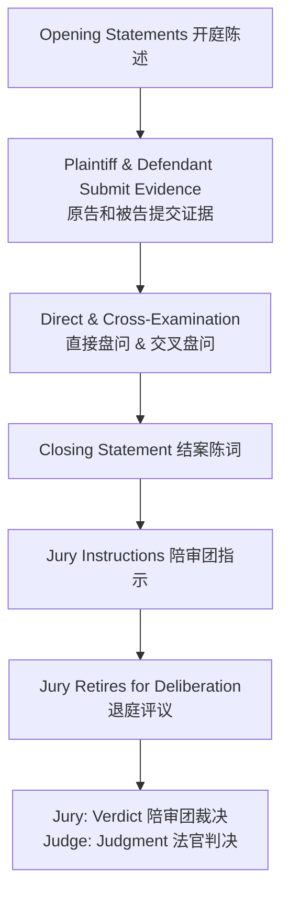

# Unit 7: Trial Stages

## 一、审判概览

- 大多数民事案件在审判前通过和解（settlement）、自愿撤诉或实体裁判终结
- 审判的三项基本功能：
  1. 确定诉讼中有争议事实的真相 → 以陪审团裁决（verdict）或法官事实认定（findings of fact）告终
  2. 根据适用法律作出案件处理 → 由法官完成
  3. 构成公开仪式："day in court"（在法庭上陈述自己案件的一天）

> [!caution] 美国 vs. 大陆法系
> 在美国法律制度中，审判是核心事件（focal event）。大陆法系中没有功能完全相当的对应制度——事实认定在一系列较小、渐进的阶段中完成。

---

## 二、审判的正确顺序

```
C (Pretrial Proceedings) → B (Opening Statements) → E (Evidence & Witnesses) → F (Closing Arguments) → D (Jury Instructions) → A (Verdict / Judgment)
```

---

## 三、管辖权问题 Issue of Jurisdiction

### （一）Personal Jurisdiction（属人管辖权）

- 法院对当事人作出裁判的权力
- 法院对被告享有属人管辖权的情形：
  - 被告是法院所在州的居民
  - 在该州被发现并接受送达（service of process）
  - 同意在该州接受送达
  - 法院所在地与被告存在 **minimum contacts**（最低限度联系）

### （二）Minimum Contacts Test（最低限度联系测试）

| 类型 | 说明 |
|------|------|
| **Specific Jurisdiction**（特定管辖权） | 被告的活动与争议相关 → 满足测试；管辖权仅针对该特定案件 |
| **General Jurisdiction**（全面管辖权） | 被告的任何活动均与争议无关 → 需证明被告面向法院地有更广泛的活动；基于与该州的整体联系 |

### （三）Subject Matter Jurisdiction（事务管辖权）

- 法院审理某一类案件的资格或权力
- 州法院：很少成为问题
- 联邦法院：是主要关注点（有限管辖法院），须同时符合宪法第三条授权和制定法授权

---

## 四、事实认定 Factual Determinations

- 美国不允许法官单独认定事实
- 由陪审团或在无陪审团时由法官认定
- **第七修正案**：几乎所有联邦法院的损害赔偿案件中，当事人都有权请求陪审团审判
- 法官职责：裁定 **admissibility**（可采性）of evidence；将陪审团事实认定的适用限制在法律允许范围内

---

## 五、陪审团审判流程 Jury Trial



- 证据类型：tangible things（实物证据）+ oral witness testimony（证人证言）
- 美国程序对口头证言的重视，与大陆法系对口头证言的不信任形成鲜明对比

---

## 六、三种救济方式 Three Types of Remedies

| 救济类型 | 说明 |
|----------|------|
| **Damages**（损害赔偿金） | 金钱赔偿 |
| **Equitable Relief**（衡平法救济） | 禁令等非金钱救济 |
| **Declaratory Judgments**（确认判决） | 宣告当事人权利义务 |

---

## 七、审前步骤 Pretrial Steps

### （一）诉讼文书 Pleadings

**1. Complaint（起诉状）**

- 原告以 complaint 启动民事诉讼
- 附有 **summons**（传票）：指定收件人为被告，要求其在一定期限内到庭回应
- 目的：通知被告原告对其提出的请求性质
- 须陈述足以确立 **cause of action**（诉因）的事实

**2. Cause of Action（诉因）**

- 由 **substantive law**（实体法）创设的法律公式
- 原告的事实陈述必须符合该公式的构成要件
- eg. 殴击（battery）：须主张被告未经原告同意而故意接触其身体
- 如起诉状未陈述可获救济的请求 → 被告可 **move to dismiss**（申请驳回）

**3. Answer（答辩状）**

- 被告对 complaint 的回应，承认或否认事实主张
- 包含内容：
  - **Affirmative Defenses**（积极抗辩）：提出进一步事实以使原告请求无效，如 self-defense（正当防卫）
  - **Counterclaims**（反诉）：被告反向针对原告的请求
  - **Cross-claims**（交叉诉讼）：针对共同当事人的请求
  - **Third-party complaint**（第三方诉状）：针对非当事人请求补偿

### （二）当事人与请求合并

| 概念 | 说明 |
|------|------|
| **Joinder of Claims**（诉讼请求合并） | 请求人将针对同一对方的若干请求合并提出 |
| **Joinder of Parties**（当事人合并） | 多人作为共同原告或共同被告加入 |
| **Class Action**（集体诉讼） | 集团中人数可达数百万，损害赔偿规模巨大 |

### （三）Discovery（证据披露）

- 律师通过正式证据开示请求获取掌握在对方或第三人手中的信息

| 工具 | 说明 |
|------|------|
| **Oral Deposition**（庭外口头质证） | 在法庭外取得的现场证言 |
| **Interrogatories**（书面质询） | 向相关人员提出的书面问题 |
| **Requests**（请求书） | 要求提交文件或其他物品 |

- 如对方拒绝 → 律师申请法院命令（court order）→ 除非信息享有特权或不重要，法官将 **compel discovery**（强制披露）
- 特权保护：attorney-client, marital, doctor-patient

### （四）案件不经审判终结

| 方式 | 说明 |
|------|------|
| **Default Judgment**（缺席判决） | 被告未作回应 |
| **Settlement**（和解） | 双方同意终结诉讼 |
| **Dismissed for procedural defect** | 因程序瑕疵被驳回 |
| **Without prejudice** | 不影响实体权利，可重新起诉 |
| **With prejudice** | 影响实体权利，不得再诉 |
| **Summary Judgment**（简易判决） | 不存在需要庭审解决的争议问题 |

### （五）Pretrial Conference（审前会议）

- 促进和解或协调案件进入庭审前的最后准备
- 目标：explore settlement, ascertain matter to be tried, rule on trial issues, set evidence agenda
- 最小化庭审中的 **mystery and surprise**（不确定和意外）

---

## 八、核心术语速查

| 术语 | 含义 |
|------|------|
| proceeding | 诉讼程序 |
| service / service of process | 送达 / 送达程序 |
| pleading | 诉讼文书 |
| complaint | 起诉状 |
| answer | 答辩状 |
| discovery | 证据披露 |
| deposition | 庭外口头质证 |
| interrogatories | 书面质询 |
| verdict | 陪审团裁决 |
| judgment | 法官判决 |
| summary judgment | 简易判决 |
| cause of action | 诉因 |
| personal jurisdiction | 属人管辖权 |
| subject matter jurisdiction | 事务管辖权 |
| minimum contacts | 最低限度联系 |
