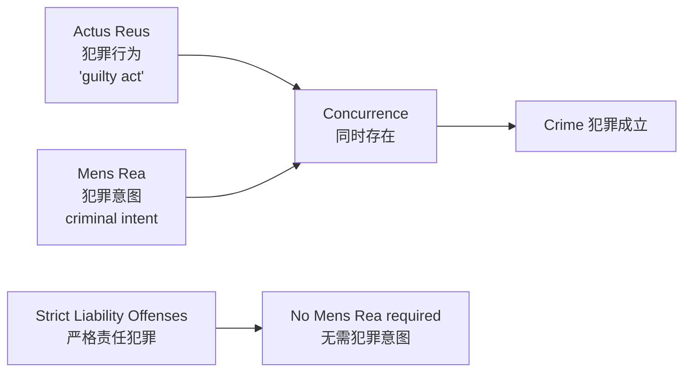

# Unit 12: Criminal Law

## 一、美国法律体系概览

- 两个基本层级：**federal law**（联邦法）和 **state law**（州法）
- 四种法律类型：constitutional law（宪法）、statutory law（制定法）、administrative law（行政法）、case law（判例法）
- 法律分支：criminal law（刑法）、civil law（民法）及其他更小部门

---

## 二、刑法与民法的对比

| 维度 | Criminal Law（刑法） | Civil Law（民法） |
|------|---------------------|-------------------|
| **不法行为性质** | Wrongs against the public authority | Wrongs against individuals |
| **案件发起** | Federal or state government (prosecutor) | A private party |
| **证明标准** | **Beyond a reasonable doubt**（排除合理怀疑） | **Preponderance of the evidence**（优势证据） |
| **结果** | Punishment: incarceration, fine, execution | Damages, injunctions |

---

## 三、刑罚 Punishments

| 类型 | 英文 | 说明 |
|------|------|------|
| 监禁 | incarceration / imprisonment | 关押在看守所或监狱 |
| 罚金 | fine | 向政府缴纳 |
| 死刑 | death penalty | 例外情况 |
| 免除公职 | removal from public office | — |
| 取消任职资格 | disqualification from holding office | — |
| 缓刑 | probation | — |
| 返还/赔偿 | restitution | 恢复原状 |
| 拘留 | detention | — |

---

## 四、刑罚的目的 Purpose of Punishment

| 目的 | 英文 | 说明 |
|------|------|------|
| 剥夺能力 | **Incapacitation** | 关押或执行死刑使罪犯无法再犯罪 |
| 威慑 | **Deterrence** | 以惩罚的威胁阻止违法行为 |
| 恢复/赔偿 | **Restitution** | 使被害人恢复到事前状态 |
| 报应 | **Retribution** | 罪犯伤害了社会，社会有权以伤害回应 |
| 改造 | **Rehabilitation** | 通过惩罚改变罪犯，使其成为更好的公民 |

---

## 五、实体法 vs. 程序法

| 维度 | Substantive Criminal Law（实体刑法） | Criminal Procedural Law（刑事程序法） |
|------|--------------------------------------|---------------------------------------|
| 内容 | 界定犯罪 + 规定刑罚 | 刑事诉讼中的规则和程序 |
| 目的 | 告知社会何种行为不可接受及违反后果 | 确保公正合法的法律程序 |
| 示例 | crimes + punishments | 宪法权利、搜查令程序、指控、证据交换、审判、上诉 |

---

## 六、联邦与州刑事管辖

| 维度 | Federal Criminal Jurisdiction | State Criminal Jurisdiction |
|------|------------------------------|----------------------------|
| 范围 | 涉及联邦法律的案件 | 大多数犯罪：murder, DUIs, rape |
| 典型案件 | 联邦所得税逃税、邮件盗窃、攻击联邦官员 | 谋杀、酒驾、强奸 |
| 跨州犯罪 | 毒品贩运、电信诈骗 | — |
| 联邦财产上的犯罪 | 纵火、破坏 | — |
| 交叉 | 有些犯罪既可是联邦犯罪也可是州犯罪 | — |

> [!example] 抢劫的管辖
> 普通抢劫（robbery）→ 州犯罪；抢劫银行（robbery of a bank）→ 联邦犯罪（因为多数银行由联邦承保）

---

## 七、犯罪分类 Classification of Crimes

### （一）按法律来源

| 类型 | 说明 |
|------|------|
| **Common law crimes** | 普通法犯罪，现已基本被制定法取代 |
| **Statutory crimes** | 制定法犯罪，由各级政府规定 |

- 各州刑法差异很大
- **Model Penal Code (MPC)**（模范刑法典）：由 American Legal Institute 于1962年完成，为各州提供标准化参考
- 多数州采用 MPC 与普通法、制定法的混合体

### （二）按严重程度

| 类型 | 英文 | 说明 |
|------|------|------|
| 重罪 | **Felony** | 最严重的犯罪；可处死刑或一年以上监禁。eg. murder, rape, robbery, drug trafficking |
| 轻罪 | **Misdemeanor** | 较轻犯罪；可处一年以下监禁。eg. petty theft, public intoxication, DUIs |
| 违规 | **Infraction** | 最轻的违法行为；一般仅处罚金，无监禁。eg. traffic offenses, jaywalking, speeding |

### （三）按管辖权

- Federal crimes（联邦犯罪）vs. State crimes（州犯罪）

### （四）按主题

- Crimes against the person（对人身的犯罪）
- Crimes against the property（对财产的犯罪）

---

## 八、犯罪构成要素 Elements of Crimes

### （一）Actus Reus（犯罪行为）

- "guilty act"：unlawful act or omission
- 必须是 **voluntary**（自愿的）

### （二）Mens Rea（犯罪意图）

- 某种程度的犯罪意图（criminal intent）
- 四个层次：

| 层次 | 英文 | 说明 |
|------|------|------|
| 蓄意 | Purposely | 有意识地追求犯罪结果 |
| 故意 | Knowingly | 明知行为的性质和后果 |
| 轻率 | Recklessly | 明知风险但漠不关心 |
| 过失/疏忽 | Negligently | 应当预见但未预见 |

### （三）Concurrence（同时性）

- Actus reus & mens rea 必须在同一精确时刻同时存在
- 仅先后在不同时间出现，不足够

### （四）Strict Liability Offenses（严格责任犯罪）

- 无需 mens rea
- eg. 交通违章（traffic violations）、驾驶时酒精浓度超标

---

## 九、Motive vs. Intent

| 维度 | Motive（动机） | Intent（意图） |
|------|---------------|---------------|
| 含义 | 促使人采取某种行为的原因 | 实施犯罪行为时的心理状态或目的 |
| 是否犯罪要素 | **不是**任何犯罪的构成要件 | 大多数犯罪的**关键要素** |
| 作用 | 可以用来使被告的犯罪理由更可信 | 用于确立 guilt（罪责） |

---

## 十、People v. Goetz（1984）

### （一）案件背景

- 被告：**Bernhard Hugo Goetz**，又称 "Subway Vigilante"（地铁义警）
- 纽约人，身材瘦小；1981年曾遭抢劫，此后开始携带无许可的手枪
- 1984年12月22日，在纽约市地铁车厢中向4名据称意图抢劫的黑人青年各开一枪
- 又向 Darryl Cabey 开第二枪，导致 Cabey 脊髓被打断，终身瘫痪

> [!quote] Goetz 的供述
> "My intention was to murder them, to hurt them, to make them suffer as much as possible." "If I had more bullets, I would have shot them all again and again. My problem was I ran out of bullets."

### （二）法律程序

**1. Grand Jury Indictments（大陪审团起诉）**

| 阶段 | 结果 |
|------|------|
| 第一次大陪审团 | 仅起诉非法持有武器（3项），拒绝起诉谋杀未遂和鲁莽危害 |
| 第二次大陪审团（补充证人后） | 起诉10项指控：4项谋杀未遂、4项袭击、1项鲁莽危害、1项武器持有 |

**2. Trial（审判）**

- 辩护律师 Barry Slotnick 主张：Goetz 的行为属于纽约正当防卫法范围
- 核心法条：**Section 35.15(2)** — "A person may not use deadly physical force upon another person… unless… He reasonably believes that such other person is using or about to use deadly physical force… or… is committing or attempting to commit… robbery"
- 陪审团构成：10名白人，2名黑人，其中6人曾是街头犯罪受害者

**3. Verdict（裁决）**

- 谋杀未遂和一级袭击罪：**Not Guilty**
- 三级非法持有武器罪：**Guilty**（在公共场所携带已上膛、未获许可的武器）
- 量刑：6个月监禁 + 1年精神治疗 + 5年缓刑 + 200小时社区服务 + $5,000罚金
- 上诉后改判：1年监禁，不适用缓刑

### （三）Reasonable Person Standard（理性人标准）

- 陪审团以"理性人"在当时情境下会如何行动为标准
- 陪审团认为 Goetz 的行为合理，尤其是考虑到他过去曾遭抢劫
- 全国许多公民认为无法依靠警察和法院有效保护自己 → 自力救济的正当性讨论

### （四）Civil Litigation（民事诉讼）

- **Cabey v. Goetz**（1996年审理）
- 陪审团主要由非裔美国人组成，全部来自布朗克斯
- 认定 Goetz 的行为具有 **recklessness**（鲁莽性），并故意造成 **emotional distress**（精神痛苦）
- 判赔 **$43 million**：$18M 疼痛和痛苦赔偿 + $25M 惩罚性赔偿（punitive damages）
