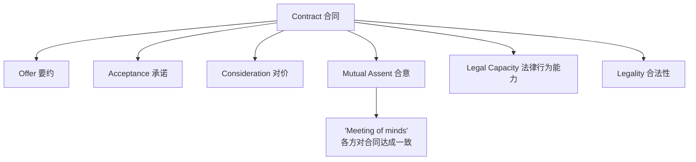

# Unit 13: Contract Law

## 一、合同的定义

- **Contract**（合同）：a legally enforceable obligation one person owes another as the result of a formal act or an informal agreement that satisfies the conditions of contractual validity
- 合同类型举例：sales, lease, employment, service, non-disclosure, licensing, construction contracts

---

## 二、待履行与已履行

| 类型 | 英文 | 说明 |
|------|------|------|
| 已履行协议 | **Executed agreement** | 已经完全履行 |
| 待履行协议 | **Executory agreement** | 尚未履行完毕 |
| 混合状态 | Partly Executed and Partly Executory | 许多协议在任一特定时点同时包含两部分 |

---

## 三、合同的基本要素 Basic Elements

---

## 四、Offer（要约）

- 定义：a manifestation of willingness to enter into a contract, effective when received
- 当事人：**offeror**（要约人）vs. **offeree**（受要约人）

### 要约的要件

| 要件 | 说明 |
|------|------|
| **Intent to contract** | 具有订立合同的意图 |
| **Definite and Certain Terms** | 条款确定且明确 |
| **Communication to the Offeree** | 向受要约人传达 |

### 相关概念

| 概念 | 说明 |
|------|------|
| **Counter-offer**（反要约） | 对原要约的回应，原要约被拒绝并被新要约取代。eg. iPhone $800 → 还价 $500 → 构成反要约 |
| **Advertisements**（广告） | 一般视为 **invitation to treat**（要约邀请）而非要约 |

---

## 五、Acceptance（承诺）

- 定义：a manifestation of assent to the terms made by the offeree in the manner invited or required by the offer

### 承诺规则

| 规则 | 说明 |
|------|------|
| **Mirror Image Rule**（镜像规则） | 承诺必须与要约内容完全一致 |
| **Communication of Acceptance** | 承诺须传达给要约人 |
| **Period of Acceptance** | 承诺须在要约有效期内作出 |

### 承诺失效的情形

- **Lapse**：超过要约期限
- **Rejection** by the offeree：受要约人拒绝
- **Revocation** by the offeror：要约人撤回
- **Death or incapacity** of the offeror：要约人死亡或丧失行为能力

---

## 六、Consideration（对价）

- 定义：a promise of something of value given by a promisor in exchange for something of value given by a promisee
- 两种视角：**benefit**（利益）/ **detriment**（损害）
- 核心："bargained-for exchange"（议价交换）
- 任何一方承诺的有价值之物均可作为对价

> [!example] 对价示例
> A 同意以 $5,000 向 B 购买一辆汽车 → $5,000 和汽车互为对价

### 例外

- **Promise to give a gift**（赠与承诺）：不构成对价，因为缺乏议价交换

---

## 七、合同的分类 Classification

### （一）正式合同与非正式合同

| 类型 | 英文 | 说明 |
|------|------|------|
| 要式合同 | **Formal Contract** | 符合正式法律要求（Under Seal / Written and Signed），满足形式要求即可执行 |
| 非要式合同 | **Informal Contract** | 执行取决于实质内容：offer, acceptance, consideration, mutual assent |

### （二）明示合同与默示合同

| 类型 | 英文 | 说明 |
|------|------|------|
| 明示合同 | **Express Contract** | 当事人以语言文字（口头或书面）表达合意 |
| 事实上的默示合同 | **Implied-in-fact Contract** | 合意通过行为表现而非语言文字。eg. 请求医生提供服务 |
| 法律上的默示合同 | **Implied-in-law Contract**（准合同 quasi-contract） | 无合意，由法律强加合同式义务。基于返还法和不当得利原则 |

> [!caution] 概念辨析
> "Implied-in-law contract" 严格说来不是合同，因为责任基础不在于当事人之间的合意，而在于法律施加的义务（restitution / unjust enrichment）。

### （三）可执行性分类

| 类型 | 英文 | 说明 |
|------|------|------|
| 可执行合同 | **Enforceable Contract** | 法律提供合同性救济 |
| 不可执行合同 | **Unenforceable Contract** | 法律不提供救济 |
| 可撤销合同 | **Voidable Contract** | 一方有权解除法律义务，使合同无效 |
| 无效合同 | **Void Contract** | 无法律效力，实质上不存在合同 |

### 不可执行的常见理由

- Public policy（公共政策）
- 未满足 **Statute of Frauds**（防止欺诈法）的书面要求
- **Statute of Limitations**（诉讼时效）届满

### 可撤销的常见理由

- **Lack of capacity**（缺乏行为能力）：minors（未成年人）, mental incapacity
- **Fraud**（欺诈）
- **Duress**（胁迫）
- **Mistake**（错误）
- **Undue influence**（不当影响）：一方利用权力或信任地位施压

### 需书面形式的合同（Statute of Frauds）

- 一年内无法完成履行的合同
- 土地权益买卖合同
- 以婚姻为对价的合同/承诺
- 标的 $500 以上的货物买卖合同
- **Suretyship**（保证/担保）合同

---

## 八、合同法的渊源 Sources

| 渊源 | 说明 |
|------|------|
| **State common law**（州普通法） | 大多数合同受州法调整；大部分内容存在于判例中 |
| **Legislation**（立法） | 修改一般合同法的个别规则；针对特定事项的制定法 |
| **UCC**（统一商法典） | 多数州通过的第2条，调整货物买卖合同 |
| **The Restatements**（法律重述） | 黑体字规则 + 评论 + 示例；由 ALI 编写 |
| **Treatises**（专著） | Williston 和 Corbin 的多卷本著作 |
