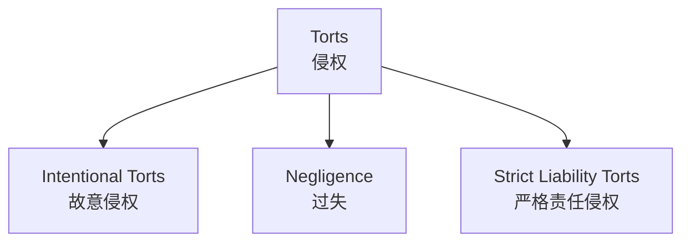
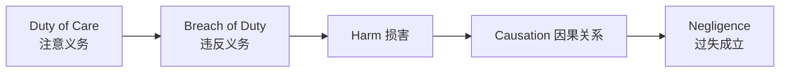

# Unit 14: Tort Law

## 一、侵权概述

- **Tort**（侵权）：a civil wrong；an act or omission that infringes upon the rights of individuals, allowing the aggrieved individual to seek a legal remedy
- 源自拉丁语 *tortum*，意为"错误"
- 定义因管辖区而异，新的侵权类型不断出现
- **Tortfeasor**（侵权行为人）：the person who occasions a wrong
- 侵权诉因（cause of action）可独立于违约之诉或违反衡平义务之诉而提出

---

## 二、侵权法的渊源

| 渊源 | 说明 |
|------|------|
| **Common law** | 法官在案件中发展的法律原则，具有先例分量 |
| **Statute** | 民事责任立法，确立普通法中的原则并作出变化或限制 |

---

## 三、侵权的三大类型

### （一）Intentional Torts（故意侵权）

- 侵权行为人对个人法律权利的 **故意** 侵犯
- 核心要素：**intent, act, causation**
- 特殊例外：故意可通过证明未尽注意来成立（eg. negligent driving 构成殴打）
- **Actionable per se**（本身即可起诉）：原告无须证明损失即可提起诉讼

#### 故意侵权的子类型

| 类型 | 英文 | 说明 |
|------|------|------|
| 对人身的非法侵害 | Trespass to the person | **Assault**（威胁）、**Battery**（殴打）、**False imprisonment**（非法拘禁） |
| 对动产的非法侵害 | Trespass to chattels | Trespass to goods（侵害货物）、**Conversion**（非法侵占）、**Detinue**（非法占有） |
| 非法侵入土地 | Trespass to land | — |
| 妨害 | Nuisance | 故意侵权 + 过失的混合 |

### （二）Negligence（过失）

- 不要求故意行为；诉因产生于被告就其作为或不作为未尽合理注意
- 在法院中适用 **reasonable person standard**（理性人标准）

#### 过失的四要素

| 要素 | 说明 |
|------|------|
| **Duty of Care**（注意义务） | 被告对原告负有法律义务，须以一定水平的谨慎行事 |
| **Breach of Duty**（违反义务） | 未达到合理人标准 |
| **Harm**（损害） | 原告遭受实际损失 |
| **Causation**（因果关系） | 违反义务与损害之间存在因果联系 |

> [!example] Medical Negligence（医疗过失）
> 医务人员在提供医疗治疗或告知医疗程序相关风险时，对患者负有注意义务。

> [!caution] 同一事实可产生多个诉因
> 殴打（battery）和过失（negligence）等两个诉因可能产生于同一组事实。

### （三）Strict Liability Torts（严格责任侵权）

- 法律不考虑侵权行为人的故意或过失而强加法律责任
- 典型例子：
  - **Vicarious liability**（替代责任）：雇主对雇员行为承担责任
  - **Defamation**（诽谤）：发表降低他人名誉的陈述 → 一旦发表即承担责任

---

## 四、侵权法的主要目的

| 目的 | 说明 |
|------|------|
| **Provide a remedy**（提供救济） | 损害赔偿金（damages）、禁令（injunction） |
| **Compensation**（补偿） | 使原告恢复到不法行为发生前的原状 |
| **Deterrence**（威慑） | 惩罚被告，震慑潜在侵权行为人 |
| **Retribution**（报应） | 保护身体完整，惩罚无视原告权利的行为 |

### 损害赔偿类型

| 类型 | 英文 | 说明 |
|------|------|------|
| 补偿性损害赔偿 | Compensatory damages | 补偿人身伤害、财产损害、经济损失 |
| 加重损害赔偿 | **Aggravated damages** | 因被告对人身的非法侵害而判给 |
| 惩罚性赔偿 | **Exemplary / Punitive damages** | 额外赔偿，发挥道德报应或威慑作用 |

> [!caution] 惩罚性赔偿的限制
> 在某些州，过失案件中禁止判给加重赔偿和惩罚性赔偿。

---

## 五、Donoghue v Stevenson（1932）

### （一）案件背景

| 信息 | 内容 |
|------|------|
| 年份 | 1932 |
| 法院 | House of Lords（英国上议院） |
| 上诉人 | May Donoghue（消费者） |
| 被告 | David Stevenson（姜汁啤酒制造商） |

### （二）案件事实

- Donoghue 的朋友在 Paisley 的 Minchella 咖啡馆为她购买了一瓶姜汁啤酒
- 啤酒装在不透明玻璃瓶中
- Donoghue 喝了一些后，剩余啤酒倒入杯中时发现一个看似腐烂蜗牛的残骸
- 因此患上胃肠炎和神经性休克
- Donoghue 与制造商之间 **没有合同关系**
- 案件进入上议院

### （三）法律争点

- 即使上诉人与制造商之间没有合同，是否仍存在过失侵权之诉？
- 制造商是否对消费者负有注意义务（duty of care）？
- 如何界定谁属于应被考虑的"邻人"（neighbour）？

### （四）裁判理由

**少数意见 — Lord Buckmaster：**
- 制造商对最终消费者不负有无合同关系下的注意义务
- 经济考量：如果支持上诉人，商业活动将难以进行

**多数意见 — Lord Atkin：**

- 强调当事人之间需要"**proximity**"（邻近性）
- 提出著名的 **Neighbour Principle**（邻人原则）：

> [!quote] Lord Atkin 的邻人原则
> "You must take reasonable care to avoid acts or omissions which you can reasonably foresee would be likely to injure your neighbour. Who, then, in law, is my neighbour? The answer seems to be persons who are so closely and directly affected by my act that I ought reasonably to have them in contemplation as being so affected when directing my mind to the acts or omissions which are called in question."

### （五）裁判结果

- 上议院以 3:2 多数支持上诉人（Donoghue）
- **首次由权威法院确立过失作为一种独立侵权的存在**
- 案件最终以庭外和解解决，金额为 £100

### （六）五大要点

1. **过失是一种独立的侵权**（negligence is a separate tort in its own right）
2. 无论当事人之间是否存在合同，都可以成立过失之诉
3. 过失之诉成功的条件：(1) duty of care (2) breach of duty (3) resulting damage not too remote
4. 确立注意义务须适用以合理预见为基础的"邻人原则"——这是最低要求
5. 饮料制造商对消费者负有注意义务，不得因过失允许异物污染产品

> [!tip] 历史影响
> Lord Atkin 的"邻人原则"本意是限制过失侵权的范围，但讽刺的是，它后来成为扩张过失侵权范围的工具，从制造商-消费者扩展到影响许多生活领域的广泛事实情境。制造商也开始系统地为产品投保，把补偿成本分散到整个消费者群体中，并改进质量控制机制。
