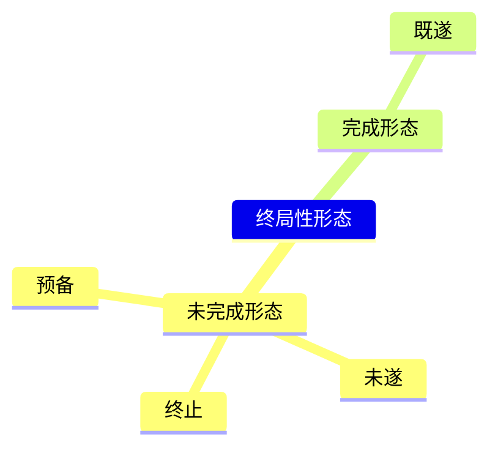
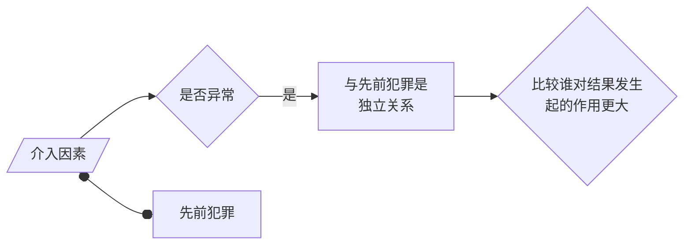

# Executive Summary

本笔记系统梳理了故意犯罪过程中的特殊形态，即犯罪的未完成形态，包括犯罪预备、犯罪未遂和犯罪中止。内容依据《中华人民共和国刑法》第22、23、24条及相关刑法理论，详细阐述了这三种形态的概念、成立条件、区分关键（如“着手”、“意志以外的原因”、“自动性”、“有效性”），并通过案例分析了实践中的认定难点，如不能犯未遂、中止的自动性判断等。最后，总结了对这三种犯罪形态的法定处罚原则。

# 关键要点 (Key Concepts / Takeaways)

* **犯罪形态**: 指故意犯罪过程中基于主客观因素而呈现出的不同状态，包括预备、未遂、中止（未完成形态）和既遂（完成形态）。
* **区分标准**: 区分不同犯罪形态的关键在于行为是否“着手”实行犯罪，以及未能完成犯罪是出于“行为人意志以外的原因”还是“自动放弃”。
* **犯罪预备**: 为了犯罪，准备工具、制造条件，但因意志以外原因未能着手实行。需具备犯罪目的、预备行为且未着手。A --o B

* **犯罪未遂**: 已经着手实行犯罪，但因意志以外原因未得逞（未达到既遂状态）。关键在于“着手”和“未得逞”。
* **犯罪中止**: 在犯罪过程中（预备或实行阶段），自动放弃犯罪或自动有效防止犯罪结果发生。关键在于“自动性”和“有效性”。
* **着手**: 指行为对法益造成了现实、紧迫、直接的危险，是区分预备与未遂的界限，需结合具体犯罪判断。
* **意志以外的原因**: 指行为人想继续犯罪但因客观障碍（如被害人反抗、第三人阻止、能力不足、自然力）或主观认识错误（如对象/工具错误）而被迫停止。
* **自动性 (中止)**: 指行为人能继续犯罪而不愿继续，是基于自身意志（如悔悟、害怕、怜悯、不忍）主动放弃，而非被迫放弃。需结合当时情境和社会一般人看法判断。
* **有效性 (中止)**: 未实行终了的中止，只要放弃即可；实行终了的中止，需积极采取有效措施防止结果发生。
* **处罚原则**: 预备犯，可以从轻、减轻或免除；未遂犯，可以从轻或减轻；中止犯，未造成损害的应当免除，造成损害的应当减轻。
* **适用范围**: 犯罪的未完成形态仅存在于故意犯罪中，过失犯罪不存在这些形态。
* **互斥性**: 一人一罪只能认定为一种最终的犯罪形态（预备、未遂、中止或既遂）。

# 第一节 犯罪的特殊形态（未完成形态）概述

## 一、概说

* **故意犯罪形态**: 犯罪预备、犯罪未遂、犯罪中止、犯罪既遂。
* **犯罪的特殊形态 (未完成形态)**: 指犯罪预备、犯罪未遂、犯罪中止。
* **犯罪的完成形态**: 指犯罪既遂。
* **构成要件类型**:
    * **基本的构成要件**: 刑法分则条文针对具体犯罪的**既遂犯**所规定的构成要件。
    * **修正的构成要件**: 根据刑法总则（如关于预备、未遂、中止、共犯的规定）对基本构成要件进行修正后形成的构成要件。

## 二、犯罪形态与犯罪阶段




* **犯罪阶段**: 主要分为**预备阶段**和**实行阶段**。
    * **预备阶段**: 从产生犯意到**着手**实行犯罪之前。
    * **实行阶段**: 从**着手**实行犯罪到犯罪结果发生或行为终了。
* **阶段与形态的关系**:
    * **预备阶段停止**:
        * 因**意志以外的原因**停止 → **犯罪预备**。
        * **自动**放弃 → **犯罪中止** (预备阶段的中止)。
    * **实行阶段停止**:
        * 因**意志以外的原因**停止且未达既遂 → **犯罪未遂**。
        * **自动**放弃或有效防止结果发生 → **犯罪中止** (实行阶段的中止)。
        * 犯罪完成 → **犯罪既遂**。

```mermaid
graph LR
    A(起意) --> B(危害行为);
    B -- 预备阶段 --> C(着手);
    C -- 实行阶段 --> D(实行终了);
    D -.-> E(结果发生);

    subgraph 预备阶段
        B -- 因意志以外原因放弃 --> PREP[犯罪预备];
        B -- 自动（自己主动）放弃 --> STOP1[犯罪中止];
    end

    subgraph 实行阶段
        C -- 因意志以外原因<br>未达既遂 --> ATTEMPT[犯罪未遂];
        C -- 自动放弃 --> STOP2[犯罪中止];
        D-.有效防止结果.-> STOP2
        E --> COMPLETE[犯罪既遂];
    end

    style PREP fill:#f9f,stroke:#333,stroke-width:2px;
    style ATTEMPT fill:#f9f,stroke:#333,stroke-width:2px;
    style STOP1 fill:#ccf,stroke:#333,stroke-width:2px;
    style STOP2 fill:#ccf,stroke:#333,stroke-width:2px;
    style COMPLETE fill:#cfc,stroke:#333,stroke-width:2px;
````

## 注意

1. **形态的终局性与互斥性**: 犯罪形态是犯罪过程的最终停止状态，一个犯罪行为最终只能被认定为一种形态（预备、未遂、中止或既遂之一）。
	- *例：张三抢劫李四，抢劫完之后发现李四是其小学同学，归还财物。张三犯罪既遂之后归还不能被认定为中止，因为既遂是终局性形态*
    
2. **仅适用于故意犯罪**: 犯罪的特殊形态（预备、未遂、中止）只存在于故意犯罪中。
    
3. **过失犯罪**: 没有预备、未遂、中止形态，只存在犯罪成立与否的问题（即是否符合过失犯罪的构成要件）。
    
---
# 第二节 犯罪预备

>[!cite] 《中华人民共和国刑法》
> 
> 第二十二条 为了犯罪，准备工具、制造条件的，是犯罪预备。
> 
> 对于预备犯，可以比照既遂犯从轻、减轻处罚或者免除处罚。

## 一、概念

**犯罪预备**：为了实行犯罪，准备工具、制造条件，但由于行为人**意志以外的原因**而**未能着手**实行犯罪的情形。

## 二、成立条件

1. **主观条件**: 主观上为了**着手实行犯罪

>[!caution] 为了预备犯罪而做的准备，不是犯罪预备行为
>「为了犯罪」=为了**着手**犯罪
>>[!example] 例如
>>为了实行抢劫而购买凶器的行为，是预备行为；
>>为了购买凶器打出租车前往五金商店的行为，不是犯罪的预备行为。

2. **客观条件**: 客观上实施了**犯罪预备行为**。
    
    - **预备行为**: 指准备工具、制造条件的行为，这些行为本身必须对法益**已经造成一定的危险（但不紧迫）**。
        
        - _例：为了杀人而购买刀具、勘察现场、制定计划、联络同伙_。
            
>[!note] 犯罪预备 vs. 犯意表示
>关键在于行为**是否对法益造成了危险**。
> - **犯意表示**: 仅仅是流露犯罪意图（如口头扬言要杀人），对法益没有危险，不可罚。
> 	
> - **预备行为**: 具有客观危险性。
> 	
> 	- _例：张三为杀人而写信、发消息联络他人共谋，商定计划——属于有危险的预备行为_。
> 		
> 	- _例：张三威胁李四“不给钱就公布隐私照片”——直接是敲诈勒索罪的实行行为，不是预备_。

>[!note] 区分：预备犯、犯罪预备和预备行为
>- **预备犯是罪犯**：预备犯是指构成犯罪预备的罪犯
>- **犯罪预备是阶段**：犯罪预备就是在预备阶段因意志以外原因未能着手实行的犯罪形态
>- **预备行为是行为**：预备行为是指实施了为实行犯罪而做的准备行为

2. **阶段条件**: 处于预备阶段，事实上**未能着手**实行犯罪。如果已经着手，则可能构成[[VII 犯罪的特殊形态#第三节 犯罪未遂|未遂]]或[[VII 犯罪的特殊形态#第四节 犯罪中止|中止]]。
    
3. **原因条件**: 未能着手实行犯罪是**因为行为人意志以外的原因**。
    - 如果是自动放弃预备行为，则构成预备阶段的[[VII 犯罪的特殊形态#第四节 犯罪中止|犯罪中止]]。

## 三、处罚

- 《刑法》[[刑法#第二十二条-第2款|第22条第2款]]规定：对于预备犯，**可以**比照既遂犯**从轻、减轻处罚或者免除处罚**。
	- 在实务中，往往不予处罚，因为一些预备行为往往被认为是生活行为，对此严加处罚会限制公民自由
		- *例：买刀*

---
# 第三节 犯罪未遂

>[!cite] 《中华人民共和国刑法》
> 
> 第二十三条 已经着手实行犯罪，由于犯罪分子意志以外的原因而未得逞的，是犯罪未遂。
> 
> 对于未遂犯，可以比照既遂犯从轻或者减轻处罚。

## 一、犯罪未遂的成立条件及处罚

犯罪未遂处于实行阶段，这个终局形态从后往前看，与犯罪预备的区别是所处阶段的不同，也就是：二者之间的区别是**着手与否**

## （一）成立条件
	着手意外未得逞

1. **已经着手实行犯罪**：
    
    - **着手**：是区分犯罪预备与犯罪未遂的关键标志，指行为**开始实施刑法分则规定的具体犯罪构成要件的行为**，使法益面临**现实、紧迫、直接**的危险。
        
    - **着手的判断标准**: 理论学说多样，实践中需根据不同犯罪类型和具体案情综合判断。
		- （多数说）==**实质客观结果说/危险结果说**==: 强调行为对法益造成**紧迫危险**时才算着手。
		- （少数说）
			- 主观说、形式客观说、实质客观行为说
            
    - **特殊类型犯罪的着手**:
			
        - **隔离犯** (行为与结果间有较长时空距离)：着手时间的判断需关注危险的**紧迫性**。
            
            - _例：邮寄毒酒案，何时算着手？——寄出时（形式客观说）？到达时？被害人准备饮用时（危险紧迫）？需具体分析。邮寄爆炸物因其本身危险性，寄出时即可视为着手_。
                
        - **间接正犯** (利用他人实施犯罪)：通常以**被利用者开始实行犯罪行为**时为着手点。
            
        - **原因自由行为**: 着手时间点存在争议，可能在导致自己丧失能力的行为时，也可能在无能力状态下实施实行行为时。
	        - 一般认为在实施行为时着手，哪怕失去责任能力。
            
        - **不作为犯**: 在**不履行作为义务导致法益遭受现实、紧迫、直接危险**时为着手。
            
    - **案例辨析（着手判断练习）**:
        
        - _案例1：抢劫出租车，上车后未实施暴力即被查获——属于预备（未着手实施抢劫核心行为）。
            
        - _案例2：准备凶器等候仇人，因对方未出现而未动手——属于预备_。
            
        - _案例3：投毒后，在被害人未接触毒物前反悔倒掉——属于预备阶段的中止_。
            
        - _案例4：将有毒饭菜端到被害人面前，在其即将食用时反悔夺下——属于实行阶段的中止_。
        
2. **犯罪未得逞**：
    
    - 指犯罪**没有达到既遂状态**。
        
    - 判断标准因犯罪类型而异：
        
        - **结果犯**: 法定的危害结果（与行为有因果关系的结果）**没有发生**。
	        
            - _例：抢劫时未抢到财物；敲诈勒索时对方未给钱；诈骗时对方识破_。
            
        - **危险犯 (具体危险犯)**: 法定的**具体危险状态没有形成**。
            
        - **行为犯**: 法定的**构成要件行为没有实施完毕**。
            
            - 注意：行为犯也有未遂和中止。从着手到行为完成有一个过程。 
	            - _例：正在伪造货币过程中被抓获_。
                
3. **因意志以外的原因而未得逞**：
    
    - 指犯罪未能既遂是**被迫**的，而非行为人自愿放弃。
        
    - **常见意志以外的原因**:
        
        - 被害人的反抗。
            
        - 第三人的阻止、抓获。
            
        - 行为人自身能力不足（如晕血、技术不够）。
            
        - 自然力的阻碍（如下雨灭火）。
            
        - 认识错误（对象不能犯、工具不能犯）。
            
            - _例：误将白糖当砒霜投毒；误将男人当女人强奸；使用的枪支是坏的_。
                

## （二）未遂犯的处罚

- 《刑法》第23条第2款规定：对于未遂犯，**可以**比照既遂犯**从轻或者减轻处罚**。
    

## 二、犯罪未遂的种类 (理论分类)

1. **实行终了的未遂 vs. 未实行终了的未遂**：
    
    - 区分标准：以**行为人主观**上是否认为已完成所有必要的实行行为为准。
        
    - **实行终了的未遂**: 行为人自认为已做完所有该做的，但结果未发生。
	    - _例：开枪射击，自认为击中要害，但实际未打中或未致死_。
        
    - **未实行终了的未遂**： 行为人尚未完成其计划的全部实行行为即被迫停止。
	    - _例：正要开枪时被警察制服_。
        
2. **能犯未遂 vs. 不能犯未遂**:
    
    - 传统观点：
        
        - **能犯未遂**: 行为本身可能既遂，因意外未遂。
            
        - **不能犯未遂**（主观有犯意，客观无法益侵害性）: 行为在当时情况下根本不可能既遂。

## 三、不能犯与未遂犯

### （一）不能犯

>[!note] 不能犯是什么？
>不能犯，是指行为人虽然主观有犯意，但是客观行为不具有任何法益侵害危险。
>
>（张明楷）不能犯（=不可罚的不能犯）：没有造成法益侵害危险，作无罪处理。
>在这里，不能犯无罪处理是针对**不能犯的行为举止**而言的，行为人的其他预备行为如果对法益造成侵害能构成犯罪预备。
>>[!example] 例如
>>甲欲杀仇人乙，拿枪四下寻找乙，把稻草人当乙开枪。
>>甲对稻草人开枪是不能犯。但甲拿枪寻找乙的行为是犯罪预备。
>>题中无特别交代，不考虑犯罪预备。

>[!tip] 提醒
>传统观点主张：不能犯还应该根据是否可罚，分为可罚/不可罚的不能犯。而实际上，可罚的不能犯就是以未遂处理（也因此未遂犯反过来也分为能犯/不能犯未遂），因此张明楷教授主张直接将不能犯界定为不可罚的不能犯。
>
>此处只有概念界定之争，不重要。

 **不能犯的分类**
- **对象不能犯**
	- 因为不存在犯罪对象，导致不可能构成犯罪
- **手段不能犯**
	- 因为手段不可能产生任何危险，导致不可能构成犯罪。

>[!example] 迷信犯
> 手段不能犯的一种。采用迷信方法（如诅咒）意图加害他人，客观上无任何危险，不可罚。

>[!note] 区分：[[V. 主观构成要件#二、根据构成要件要素划分|对象错误]] vs. 对象不能犯
>相同点：行为人主观上都存在对象认识错误
>区别：
>①对象错误：行为具有危险性，构成犯罪。已经通过构成要件该当性阶层，到了主观阶层；
>②对象不能犯：不构成犯罪。是不可罚的不能犯的一种。
>>[!example] 举例（来自柏浪涛）
>>1. 甲看到前方有个人，误以为是仇人李四，实际是王五，向其开枪，没有击中。这种行为对王五有危险，甲构成故意杀人罪未遂。这属于对象错误。
>>2. 甲在四下无人的沙漠里，误将稻草人当作仇人而开枪。这种行为对他人生命没有任何危险，甲无罪。这属于对象不能犯，

>[!note] 区分：[[V. 主观构成要件#二、根据构成要件要素划分|打击错误]] vs. 手段不能犯
>相同点：行为客观上都出现了方法错误
>区别：
>①打击错误：手段具有危险性，属于危害行为
>②手段不能犯：不具有危险性、不属于危害行为、不构成犯罪
>>[!example] 举例（来自柏浪涛）
>>1. 甲举枪射杀乙，因为没有瞄准，打死了乙身边的丙。甲的行为具有危险性，构成犯罪。这属于打击错误
>>2. 甲举枪射杀乙，发现枪原来是一把早已生锈的坏枪，根本无法射击。甲的行为不具有危险性，不构成犯罪。这属于手段不能犯

### （二）不能犯与未遂犯的区分

区分**未遂犯**与**不可罚的不能犯**：关键在于行为**是否具有法益侵害的危险**。
有则未遂犯，无则不能犯

| 阶层与种类 |       不能犯       |      未遂犯       |
| :---: | :-------------: | :------------: |
| 客观阶层  | 危害行为❌，因为对法益没有危险 | 危害行为✅，因为对法益有危险 |
| 主观阶层  |      犯罪故意✅      |     犯罪故意✅      |
|  结论   |       无罪        |     有罪，未遂      |
|  blt  |                 |                |

>[!caution] 注意
>如果行为在**通常情况**下可能导致结果发生，仅因**偶然**原因（对象特殊、工具失效）未遂，一般认定为**未遂犯**（具有抽象危险/具体危险）。
>- _例：朝空床铺开枪、朝穿防弹衣的人开枪_。

1. **区分标准**：如何判断法益是否有侵害危险（高光是多数说）
	1. **主观说**：行为有无危险，以行为人的主观认识为准。行为人主观上认为有危险，那么行为就有危险。
		- **纯粹主观说** (已摒弃): 有犯意有行为即未遂。
			- 行为人主观认为有危险$\Rightarrow$ 行为有危险
			
		- **==抽象危险说== (==主观危险说==)**: 以**行为人认识到的事实**为基础，判断一般人是否认为有危险。
			- _例：误用保健品“投毒”、误认野猪为仇人开枪、误毁假印章——可能有危险，构成未遂_。
		
	2. **==客观说==**：行为有无危险，是一种客观判断，以客观现实情况为准。
		- **客观危险说**: 以**行为时存在的一切客观情况**为基础，以行为时存在的一切客观情况为基础
			- 评价：扩大不能犯，缩小未遂犯，少数说
		
		- **==具体危险说==**: 以**行为时主客观事实**（行为人所特别认识到的事实以及一般人可能认识到的事实为基础）为基础，判断一般人是否认为有危险。

>[!example] 例析：客观危险说 vs. 主观危险说
>甲欲杀乙，向乙投放1毫克毒药，乙服用后未死。事后，专家鉴定查明，该毒药1毫克不会致人死亡，没有致命危险。
>- **客观危险说**认为，基于此，甲的行为没有危险，不构成故意杀人罪，属于手段不能犯。
>- **具体危险说**认为，从行为时一般人的角度看，1毫克毒药也是毒药，万一甲在行为时投放量大一点，就有致命危险。因此，甲构成故意杀人罪，属于犯罪未遂。

>[!tldr] 对行为危险性的判断公式（柏浪涛，具体危险说）
>从客观角度$\to$ 行为时一般人的角度（联系、发展、全面的眼光）$\to$行为有无危险

>[!example] 多数说应用举例（柏浪涛）
>甲欲杀乙，向躺在床上的乙开枪。
>- 情形一，实际上，开枪前，乙已经死了有二十分钟。甲的行为没有侵害乙的生命的危险性，属于对象不能犯，不构成故意杀人罪。
>- 情形二，实际上，开枪前两分钟，乙刚死。从联系、发展的眼光看，人咽气有个过程，有可能早死几分钟或晚死几分钟，而甲对此又不知道，甲有可能早几分钟开枪。因此，甲的行为具有侵害乙的生命的危险性、可能性，所以构成故意杀人罪未遂。(2003年第4题)

---
# 第四节 犯罪中止

>[!cite] 《中华人民共和国刑法》
> 
> 第二十四条 在犯罪过程中，自动放弃犯罪或者自动有效地防止犯罪结果发生的，是犯罪中止。
> 
> 对于中止犯，没有造成损害的，应当免除处罚；造成损害的，应当减轻处罚。

## 一、概念

**犯罪中止**：在**犯罪过程中**，行为人**自动**放弃犯罪或者**自动有效地防止**犯罪结果发生的犯罪形态。

## 二、成立条件

### （一）时间性

必须发生在**犯罪过程中**，即犯罪预备阶段或实行阶段，**犯罪既遂之前**。之所以既遂、未遂后都不能成立中止，是因为它们都是[[VII 犯罪的特殊形态#二、犯罪形态与犯罪阶段|犯罪终局形态]]。

- **既遂后不能成立中止**
	- _例：盗窃得手后反悔归还，不影响盗窃既遂，可作为量刑情节_。
	
- [[VII 犯罪的特殊形态#第三节 犯罪未遂|未遂]]后不能成立中止
	- _例：杀人未遂（如被阻止）后，出于悔悟救助被害人，救助行为是独立评价的，不改变未遂性质，可作为量刑情节_。
	
- **可重复加害行为的中止**：在一个持续的或可分阶段的实行行为中，自动放弃后续加害行为，可以成立中止。
	- _例：甲把乙骗进山洞里打算用石头把乙砸死，砸了几下没有砸中，乙苦苦哀求，甲放弃继续加害。

### （二）自动性

行为人必须是**基于自己的意志**主动放弃犯罪，而非因外界障碍被迫停止。

#### 1. 犯罪中止 vs. 犯罪未遂

>[!cite] 区分标准：弗兰克公式
>- **能**达目的而**不欲**：==中止==
>	- 有继续犯罪可能性（外在条件），但自愿放弃（内在条件）
>- **欲**达目的而**不能**：==未遂==
>	- 无法继续犯罪的前提下，被迫放弃

>[!note] 做题思路
>- 先：判断是否有继续犯罪可能性
>- 再：判断是否自愿
>>[!example] 例子（柏浪涛）
>>男生甲追求乙，未果，对室友说：“长那么丑、不想追了。”
>>
>> 孤立地看，甲是自动放弃（中止？）。但是前提是甲追不到所以属于被迫放弃，是**未遂**。

1. **前提条件**：具有继续犯罪的可能性（采折中说/客观说）
	- **学理争议**：
		- 纯粹主观说：根据犯罪人主观看法判断能否继续犯罪（犯罪人：我觉得能就能）。
		- 纯粹客观说：根据客观的、物理的条件判断能不能继续犯罪（客观角度能就能）
		- ==客观说==（多数说）：依据<u>社会一般人</u>的看法，看在当时情景下能否犯罪。

>[!example] 例子
>- 例1：见血害怕放弃杀人——中止（一般人认为还能砍）。
> 			
> - 例2：抢劫紧张被嘲笑而放弃——中止（一般人认为还能抢）。
> 	
> - 例3 & 4：发现强奸/抢劫对象是亲属而放弃——未遂（伦理障碍来自内心）。
> 	
> - 例5：准备强奸时遇夜跑人群而放弃——未遂（外界障碍导致被迫放弃）。

2. **主观条件**：具有放弃犯罪的自动性，而非被迫性
	- **学理争议**
		1. **==主观说==**：主观心理的判定是推定的，即能够继续犯罪的前提下放弃，则推定自动放弃；无法继续犯罪的前提下放弃，则推定自动放弃。
		2. **限定主观说**：在主观说的前提下加上限定条件（必须出于真诚悔过的动机）
			- 评价：不当缩小了中止的成立范围

>[!tip] 中止与未遂的常考情形 1
>```mermaid
>graph LR
>A[计划侵害陌生人<br>却遇到熟人]-->B{关系亲疏}--遇到普通熟人放弃-->中止
>B--遇到近亲属放弃-->未遂
>```
>
>

>[!tip] 中止与未遂常考情形 2
>```mermaid
>graph LR
> 
>		C{处罚紧迫性}--害怕当场被抓而放弃-->未遂
>		C--害怕日后被抓而放弃-->中止
>	
>```


####  2. 认识错误

>[!tldr] 结论
>行为人在认知错误下，将错就错。
>
>**主观怎么想，就怎么定**（采主观说），不考虑客观能否继续。

- 认为不能继续而放弃（实际能继续）
	- → **未遂** (_例：误以为警笛声是警察来了而放弃强奸_)。
    
- 认为能继续而主动放弃（实际不能继续）
	- → **中止** (_例：投毒后误以为剂量足以致命，出于怜悯送医抢救，实际剂量不足_)。

>[!faq] 受欺骗产生的认识错误，怎么办？
>- 核心：是否对「能否继续犯罪」产生认识错误？
>	- 是，则此认识错误是重要的认识错误，此时主观怎么想就怎么判。
>	- 不是，则此认识错误不是重要的认识错误，对此错误不予考虑。
>	
>>[!example] 例子
>>- 因对方**虚构伦理障碍**（如“我是你妹妹”）而放弃 → **中止**（放弃仍基于行为人内心伦理认知）。
>>- 因对方**虚构客观障碍**（如“我来例假了”、“你先洗澡我等你”）而放弃，若行为人信以为真认为是**暂时**不能或不便实施，打算稍后再来 → **未遂**（受骗放弃，非真正自愿）。

#### 3. 特定对象不存在

行为人的目标是特定对象，该特定对象在客观上不存在，行为人主观上认为**只能被迫**放弃犯罪，定未遂。

- **特定物不存在而未遂**
	- 因**客观上犯罪目标不存在**而未能得逞 → **未遂** 
		- _例：入室盗窃保险柜为只有 2 元而转身离开（小偷特定的盗窃对象是巨额财物）；杀手举枪瞄到一半发现认错目标而收手（不能因为杀手没开枪而定中止，因为他的收手是被迫的，是因为人没找到）_。

>[!example] 认识错误
> - 甲抓住杀父仇人乙，举刀要砍杀。
> 	- 情形 1：乙欺骗甲：”我只是执行者，主犯是丙，你去找他。“甲相信，放过乙，去找丙。
> 		- 甲对于前提乙是否是杀父仇人未产生认识错误，认为能继续杀乙，在此前提下放弃杀乙，属于主动放弃，定中止。
> 	- 情形 2：乙欺骗甲：”不是我杀的，是丙杀的，你去找他。“甲相信，放掉乙，去找丙。
> 		- 甲对于前提乙是否是杀父仇人产生了认识错误，认为不能继续杀乙，在此前提下放弃杀乙，属于被迫放弃，定未遂。

### （三）中止行为

要求**在客观上**行为人实施了中止行为，通常表现为停止正在进行的预备或实行行为。

[[VII 犯罪的特殊形态#二、犯罪形态与犯罪阶段|按照时间分类]]，中止行为可以分为：

```mermaid
graph LR
A{{中止的成立条件}}--> B1[未实行终了的中止] & B2[实行终了的中止]
B1--> G([自动放弃])
B2--> G([自动放弃]) & E([有效中止])
E -->  P([可能的有效性]) & R([实际的有效性])
```
#### 1. 行为实行终了的犯罪中止

必须**积极采取有效措施**，**成功阻止**了犯罪既遂结果的发生。这里的有效性分为两重含义：
- 可能的有效性：防止措施要有防止结果发生的可能性。
- **实际的有效性**：防止措施实际真的防止了结果发生。
- 并且，还需要真诚努力地完成该防止措施。

>[!example] 例子
>- 例1：送医抢救但途中死亡——未遂（未有效阻止）。
>- 例2：放火后呼救他人灭火成功——未遂（不真诚）。

##### 实际的有效性

1. **没有发生危害结果**
	- 指的是没有发生行为人追求/放任的、行为性质决定的危害结果，而非指没有发生任何结果
	- 由此，犯罪中止还可分为：（没有）造成危害结果的犯罪中止，二者处罚力度不一。
	- 多数说不要求结果未发生是中止行为的功劳。


2. **发生了危害结果**
	- 如果犯罪行为与危害结果之间没有因果关系，则行为人不构成犯罪既遂，而构成犯罪中止。
	- **介入因素**：如果行为人真诚努力阻止结果，但因**无法预见或控制的介入因素**导致结果发生，可能仍成立中止，对结果承担过失责任（或意外事件）。
	





>[!example] 例子
>例1：甲投毒杀女友乙，见乙中毒后痛苦挣扎，甲心生悔意，送女友去医院，路上遭遇堵车，导致无法及时送往医院而死亡。——故意杀人的既遂
> 
> 例2：甲投毒杀女友乙，见乙中毒后痛苦挣扎，甲心生悔意，送其去医院，路上甲酿成车祸，导致女友被撞死。——故意杀人罪中止，交通肇事罪，数罪并罚。
> 
> 例3：甲投毒杀女友乙，投完毒后离开，然后隔壁邻居将女友送往医院，结果在路上出了车祸被撞死。——故意杀人罪的未遂
#### 2. 行为未实行终了的犯罪中止

只要**彻底停止**实行行为即可。

| 可能有效性 | 实际有效性     | 结论  | 范例                  |
| ----- | --------- | --- | ------------------- |
| ✅     | ✅         | 中止  | 甲刀乙，甲将乙送医救活         |
| ❌     | ✅         | 未遂  | 甲刀乙，丢包卫生纸离去。乙被邻居救活  |
| ✅     | ❌         | 既遂  | 甲刀乙，甲将乙送医，抢救无效死亡    |
| ✅     | （⬇️介入因素）❌ | 中止  | 甲刀乙，甲送医途中遭车祸，车祸致乙身亡 |


## 三、处罚

- 《刑法》第24条第2款规定：对于中止犯：
    
    - **没有造成损害的** → **应当免除处罚**。
        
    - **造成损害的** → **应当减轻处罚**。
        
- **“损害”的认定**:
    
    - **损害**：不是指既遂结果（否则构成犯罪既遂），是指刑罚要处罚的危害结果、先前犯罪行为造成的损害结果。
        
    - 如果造成的损害未达到犯罪程度（如轻微伤、一般强制猥亵、未达数额较大的盗窃准备行为），视为“没有造成损害”。
        
        - _例1：故意伤害中止，仅造成轻微伤——无损害，免除处罚_。
            
        - _例2：强奸中止，仅剥光衣服——强制猥亵（减轻处罚），强奸罪的中止。
            
        - _例3：强奸中止，改为猥亵——猥亵罪既遂（造成了损害），强奸中止。对强奸行为应当减轻处罚，与猥亵罪数罪并罚或择一重处_。
            
        - _例4：入户盗窃中止，未窃得财物——无损害，免除处罚_。
            
        - _例5：抢劫中止，仅造成轻微伤——无损害（暴力未达伤害罪程度，财物未取），免除处罚_。（未核实）
            
- **造成损害的行为主体**: 必须是**中止前的犯罪行为**造成的损害，**中止行为本身**造成的损害需**单独评价**。
    
    - _例1：杀人中止，送医途中过失致重伤——杀人中止免罚，另构成过失致人重伤罪_。
        
    - _例2：盗窃中止，归还物品时不慎砸死人——盗窃中止免罚，另构成过失致人死亡罪_。
        
    - _例3：杀人中止，收枪时走火致死——杀人中止免罚，另构成过失致人死亡罪_。
        

# 法条与条号

- **《中华人民共和国刑法》**
    
    - 第二十二条 (犯罪预备的概念与处罚)
        
    - 第二十三条 (犯罪未遂的概念与处罚)
        
    - 第二十四条 (犯罪中止的概念与处罚)
        

# Mermaid 可视化

代码段

```mermaid
graph TD
    A[产生犯意] --> B(准备工具<br>制造条件);
    B -- "未着手<br>因意志以外原因停止" --> C[犯罪预备];
    B -- "未着手<br>自动放弃" --> D[犯罪中止<br>(预备阶段)];
    B --> E(着手实行);
    E -- "实行中<br>因意志以外原因停止<br>未达既遂" --> F[犯罪未遂];
    E -- "实行中<br>自动放弃<br>或有效防止结果" --> G["犯罪中止<br>(实行阶段)"];
    E --> H(实行终了);
    H -- 结果发生 --> I[犯罪既遂];
    H -- "结果未发生<br>因意志以外原因" --> F;
    H -- "自动有效<br>防止结果发生" --> G;

    style C fill:#f9f,stroke:#333,stroke-width:2px;
    style F fill:#f9f,stroke:#333,stroke-width:2px;
    style D fill:#ccf,stroke:#333,stroke-width:2px;
    style G fill:#ccf,stroke:#333,stroke-width:2px;
    style I fill:#cfc,stroke:#333,stroke-width:2px;
```
