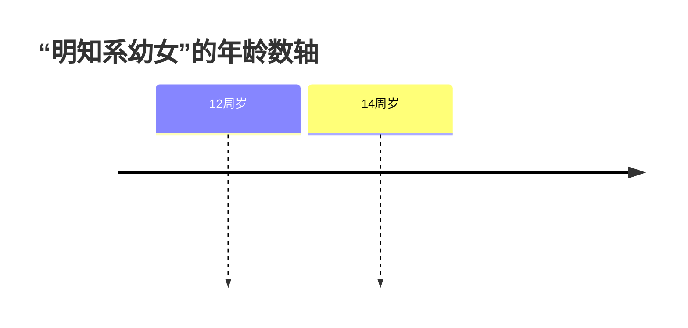

## 一、章节框架

本段位于“侵犯性自主权的犯罪”之下，按讲义页序主要包括四个罪名：

1. 强奸罪。
2. 负有照护职责人员性侵罪。
3. 强制猥亵、侮辱罪。
4. 猥亵儿童罪（本次页段仅覆盖开头）。

复习抓手优先抓住四条判断轴线：

1. 保护法益是性自主决定权、身心健康，还是未成年人的健全发展利益。
2. 被害人的“同意”是否有效，尤其是在受骗、无反抗能力、系幼女或系儿童时。
3. 行为是性交型侵害还是猥亵型侵害。
4. 与邻近犯罪之间是特别关系、想象竞合还是数罪并罚。

## 二、强奸罪

> [!cite] [[刑法#第二百三十六条]]
> 以暴力、胁迫或者其他手段强奸妇女的，处三年以上十年以下有期徒刑。
> 
> 奸淫不满十四周岁的幼女的，以强奸论，从重处罚。
> 
> 强奸妇女、奸淫幼女，有下列情形之一的，处十年以上有期徒刑、无期徒刑或者死刑： 
（一）强奸妇女、奸淫幼女情节恶劣的；  
（二）强奸妇女、奸淫幼女多人的；  
（三）在公共场所当众强奸妇女、奸淫幼女的；  
（四）二人以上轮奸的；  
（五）奸淫不满十周岁的幼女或者造成幼女伤害的；  
（六）致使被害人重伤、死亡或者造成其他严重后果的。

### （一）保护法益

- **普通强奸罪**保护的是妇女的`性自主决定权`。
	-  性自主权不仅包括`是否发生性交`的决定权，也包括对`性交对象、时间、地点`等具体条件的决定权。
	- 不宜把本罪法益理解为人格尊严、性羞耻心、名誉，更不能理解为夫权或财产权。
- **奸淫幼女型强奸**同时保护`幼女的身心健康`。

这一定义直接影响后面两个高频问题：

1. “骗奸”是否成立犯罪，本质上要看被害人对性行为的同意是否因为错误而失效。
2. 婚内强奸是否成立，本质上仍要回到妻子的性自主决定权是否应受刑法保护。

### （二）行为主体

- 不限于男子。
- 除`单独的直接正犯`以外，女子可以任何形式实施或参与本罪:
	- 共同正犯、间接正犯、共犯

> [!caution] 强奸罪不是亲手犯，也不是身份犯。

#### 婚内强奸

讲义列出否定说、肯定说、限制肯定说，并重点展开限制肯定说。复习时宜掌握其具体边界：

> [!note] 限制肯定说
> 1. 在婚姻关系正常持续期间，丈夫强行与妻子性交，一般不宜直接认定为强奸罪。
> 2. 在离婚诉讼期间[^1]、因纠纷分居期间、或妻子长期遭受丈夫虐待期间，丈夫强行性交的，可以认定为强奸罪。
> 3. 即使婚姻关系形式上正常存续，只要丈夫违背妻子意志并使用暴力、胁迫等强制手段实施性交，原则上仍可能成立强奸罪。
> 4. 丈夫教唆、帮助他人强奸自己妻子，或者与他人共同轮奸自己妻子的，应认定为强奸罪。

### （三）行为对象
#### （1）普通强奸罪的对象

- 对象是**妇女**
	- 包括两性人。
	- 与女精神病患者、痴呆女性发生性关系
		- 不论其是否“同意”，都可构成强奸；
		- 但若行为人确实不知道对方有精神病或痴呆，并在其同意下性交，则不成立本罪。
- **男子不是**本罪的行为对象；相应侵害通常转向强制猥亵、侮辱罪或猥亵儿童罪评价。
- **尸体不是**本罪对象，错把女尸当活体或错把活体当女尸，属于典型错误论题。

#### （2）奸淫幼女型强奸的对象

- 对象是幼女，即**不满 14 周岁的女性**。
- 奸淫幼女实行“**以强奸论，从重处罚**”的特别保护。

关于“明知幼女”的认定， 2023 年《关于办理性侵害未成年人刑事案件的意见》强调：

1. 行为人**知道或者应当知道**对方是不满 14 周岁的幼女，应认定为“**明知**”。
2. **对不满 12 周岁的被害人**，应当**强行认定**行为人明知其系幼女。
3. **对已满 12 周岁不满 14 周岁的被害人**，可结合`身体发育、言谈举止、衣着特征、作息规律`等判断行为人是否“应当知道”。

> [!note] 举例
> 1. 误以为幼女已满 14 周岁而强行性交，仍按普通强奸分析。
> 2. 明知系幼女，即使征得其同意性交，也按奸淫幼女型强奸处理。
> 3. 确实不知其为幼女，且在其同意下性交的，不认定本罪。
> 4. 已满 14 周岁不满 16 周岁的人，在幼女同意下偶尔发生性行为、情节轻微且未造成严重后果的，适用“**两小无猜条款**”，可不作为犯罪处理。

### （三）行为方式

#### （1）普通强奸罪

普通强奸罪：以暴力、胁迫或其他违反妇女意愿的方式，足以或者可能压制被害人的反抗，使之不能反抗、不敢反抗或不知反抗，强行与之性交。

##### 暴力

- 暴力是对被害妇女**直接实施的不法有形力**，使其不能反抗或难以反抗。
	1. 既可以是**故意致人重伤**的暴力，也可以是**致人死亡**的暴力。
	2. 暴力必须**直接**针对`被强奸的妇女本人`实施 
		- 对妇女以外的人实施暴力的，可能构成对妇女的胁迫

> [!example] 举例
>- 行为人为了强奸，以杀人的故意对妇女实施足以致人死亡的暴力，在妇女死亡后（行为人误以为妇女没死）奸尸，如何处理？
>	- 强奸致人死亡+侮辱尸体罪
> - 行为人为了强奸，以杀人的故意对妇女实施足以致人死亡的暴力，在妇女昏迷期间奸淫妇女，如何处理？
> 	- 强奸罪
> - 行为人为了奸尸，故意杀死妇女，然后奸尸的，如何处理？
> 	- 故意杀人罪+侮辱尸体罪

##### 胁迫

- 胁迫是**以恶害相通告**，使被害妇女产生恐惧心理。

> [!tip] 柏浪涛
> 强奸罪中的“胁迫”范围大于抢劫罪中的胁迫：抢劫通常要求`足以压制反抗`的**暴力恶害**，强奸则可包括`足以使性自主决定失效`的**非暴力恶害**。
> - 单纯“以加害自己相通告”一般不属于胁迫；
> - 但若行为人对自己的加害必然导致对被害人的加害，仍可构成胁迫。

- 强奸罪保护**消极的自由**（free from）

> [!example] 胁迫 vs. 提案
> 【初试学霸下岸案】胁迫不发生关系就刷人
> 【初试学渣下岸案】好处的落空不是胁迫，是提案（offer）

##### 其他手段

应当作同质性解释，与暴力、胁迫基本相当

1. **利用醉酒、麻醉、昏迷、熟睡、重病等状态奸淫妇女。**
2. 麻醉型准强奸。
3. **欺骗型准强奸**。
4. 趁机型准强奸。

> [!note] 「骗奸」要重点掌握
> - 同意有效性的学说：**动机错误说**、**法益关系错误说**、全面无效说
> - 只有妇女因受骗而对**其所放弃的法益**之<u>种类、范围或者危险性</u>产生错误，而非`仅仅对法益处分的对待给付`产生错误，其所作出的同意才无效。
> 	- 即，妇女不能意识到自己在**处分性法益**
> - 举例来说：误认为在治病

【冒充贝克汉姆案】
【冒充大款】
【冒充丈夫案】
【冒充男友案】

> [!tip] 总结
>从对“其他手段”的分析可以看出，“强制”并非强奸罪行为方式的核心，强奸罪行为方式的核心应当是“**违背妇女意志**”，**强制手段只不过是认定“违背妇女意志”的证据和素材。**

#### （2） 奸淫幼女型强奸：与之性交。

采最狭义的奸淫概念：狭义性交行为。目的是区分强奸和猥亵。

### （五）责任

#### （1）责任形式

- 本罪为**故意**犯罪，不要求另有“奸淫目的”。【传宗强奸罪】

#### （2）六类加重情形

>无需单独背诵，考试会给出提醒，高亮为重点

1. 强奸妇女、奸淫幼女情节恶劣。
2. 强奸妇女、奸淫幼女多人。
3. ==在公共场所当众强奸妇女、奸淫幼女。==
4. ==二人以上轮奸==。
5. 奸淫不满十周岁的幼女或者造成幼女伤害。
	 - 奸淫不满十周岁的幼女或者造成幼女伤害后，已进入升格法定刑，不再另以“奸淫幼女”从重处罚。
6. 致使被害人重伤、死亡或者造成其他严重后果。
	- “因”是**强奸罪的实行行为**（目的行为/手段行为导致被害人重伤死亡均成立）
	- “其他严重后果”包括自杀、精神失常、分娩、堕胎等严重危害身心健康的后果；感染艾滋病病毒也可能被评价为重伤。

> [!tip] 功能性的公共场所
> 公共场所指`不特定或多数人能够随时自由进出的场所`，**强调公共空间**，而不是使用权限。
> - 车厢算、公共厕所算、火车/飞机上的厕所/试衣间不算
> - 不包括网络空间
> - “当众”中的“众”不包括行为人本人；
> - 只要**可能**被不特定人或众人`看到、感觉到`，即可成立。
> - 公共场所和当众，缺一不可

> [!note] 轮奸（共同正犯类型的强奸）
> - “轮奸”要求二人以上在同一时间段内共同对同一被害人轮流或同时实施强奸或奸淫
> 	- 并且各行为人的行为**都达到实行犯程度**。
> - 轮奸属于加重犯罪构成，存在未完成形态，因此轮奸未遂、部分既遂部分未遂，均是独立考点。

> [!example] 轮奸是共同正犯类型的强奸
> - 【后来居上案**1**】甲强奸妇女完成，离开现场后，与甲没有通谋的乙立即强行奸淫该妇女。
> 	- 甲对乙的强奸行为**既无主观认知，也无物理/心理的因果贡献**，二人不成立任何共犯关系，更不成立轮奸。
> 	- **两人各自独立构成普通强奸罪，不成立轮奸。**
> - 【唆使后来者案**1**】甲强奸妇女之后，让没有参与前行为的乙强奸已丧失反抗能力的妇女。
> 	- 甲使用暴力使丙女丧失反抗能力并奸淫丙女，随后**让**没有参与前行为的乙强奸没有反抗能力的丙女。不管乙是否知情，乙都不能对甲的强奸负责，但甲应当对乙的强奸承担**共同正犯**的责任。
> 	- 所以，对甲应适用**轮奸**的规定，对乙仅适用**普通强奸罪**的规定。
> - 【唆使后来者案**2**】甲乘丙女熟睡强奸丙女，在丙女睡醒后，甲又唆使乙强奸丙女，乙接受教唆，使用暴力强奸了丙女。
> 	- 本案中，甲趁人熟睡强奸，妇女醒后甲的先行行为已无法为乙创造便利条件，乙需另施暴力才能完成强奸。甲对乙的强奸仅有**教唆的心理因果性**，而非共同正犯的物理+心理双重因果性。
> 	- 甲虽然要对乙的强奸行为负**教唆犯**的责任，但**不承担轮奸**的责任。
> - 【后来居上案 2】乙得知甲将要强奸丙女，便提前给丙投放了安眠药，并暗中观察甲的奸淫行为，但甲并不知情。在甲离开现场后，乙又奸淫了丙。
> 	- **甲**：普通强奸罪既遂（3-10年有期徒刑），对乙的行为无认知，不承担任何共犯责任。
> 	- **乙**：投放安眠药属于强奸罪"其他手段"的核心实行行为，乙对甲的强奸承担**片面共同正犯**责任；乙自己又实施了强奸，对两次强奸均承担正犯级责任 → **乙成立片面轮奸**，适用10年以上有期徒刑、无期徒刑或死刑的加重法定刑。甲不成立轮奸。

> [!example] 轮奸存在未完成形态
> - 【两人轮奸案1】A、B企图共同轮奸C（女），共同对C实施了猛烈的暴行，但因为意志外的原因两人均未得逞。 
> 	- 全案**轮奸未遂 + 强奸未遂**，想象竞合，适用轮奸法定刑并依未遂从宽。
> - 【两人轮奸案2】A、B企图共同轮奸C（女），共同对C实施了猛烈的暴行，在压制C的反抗后，A成功实施了奸淫行为，但后来B却因意志以外的原因而没能得逞。 
> 	- A、B均构成**强奸既遂**；同时构成**轮奸未遂**（仅一人既遂），二者想象竞合。
> - ==【三人轮奸案】==A、B、C企图共同轮奸D（女），共同对D实施了猛烈的暴行，在压制D的反抗后，A和B成功实施了奸淫行为，但C却因意志以外的原因而没能得逞。
> 	- 已有两人既遂 → 全案**轮奸既遂**，适用轮奸加重法定刑。C个人未得逞仅作为量刑酌定从宽情节。

### （六）其他问题：既未遂与罪数

- 着手：被害人的性自主决定权面临现实紧迫危险时
- 普通强奸罪既遂标准：讲义采“结合说”。
- 奸淫幼女型强奸既遂标准：讲义介绍“接触说”，并提示张明楷主张也可采结合说。

罪数上，讲义区分“被包容”与“不被包容”：

1. **强奸被包容的情形**：
	1. 拐卖+强奸=拐卖（结果加重犯）。
	2. 拐骗+出卖目的+强奸=拐卖（结果加重犯）。

2. **强奸不被包容的情形**：
	- 收买+强奸=数罪并罚
	- 组织/运送他人偷越国边境+强奸=数罪并罚

## 三、负有照护职责人员性侵罪

> [!cite] [[刑法#第二百三十六条-之一]]

### （一）保护法益

- 课堂展示“性自决权说”与“性健全发展权说”的争论，背后涉及法律家长主义。
- 本罪保护已满 14 周岁不满 16 周岁女性在照护、教育、医疗等依赖关系中的性自主与健全发展。

### （二）行为对象

- 不满 16 周岁的未成年女性。
- 对象范围不同于幼女型强奸，也不同于一般成年妇女的性自主保护。

### （三）行为方式

与不满16周岁的青少年女性发生性关系。
1. 多数观点认为，这里的性关系**限于奸淫行为**，单纯猥亵行为不构成本罪。
	-  少数观点：奸淫行为、猥亵行为均属于这里的“发生性关系”。
2. **不论是否采取强制手段**；同时构成强奸罪的，以强奸罪论处。
3. **无需行为人积极滥用特殊职责以对被害人施压**；
	- 对已满十四周岁的未成年女性负有特殊职责的人员，**利用优势地位或者被害人孤立无援的境地**，迫使被害人与其发生性关系的，以强奸罪定罪处罚。（2023年两高《强奸、猥亵未成年人解释》第6条） 。

### （四）行为主体

- **真正身份犯**：行为人须对被害人负有监护、收养、看护、教育、医疗等特殊职责。
- 特殊职责不限于法条明列领域；只要形成较稳定的依赖关系或人格培育关系，也可能成立。

### （五）责任

- 故意；行为人须认识到特殊职责关系、被害人年龄层次与性关系事实。
- 不要求另有强制目的或奸淫目的。

### （六）其他问题：与强奸罪的关系

- 本罪不要求另行采用暴力、胁迫等强制手段；若同时符合强奸罪构成，依处罚较重的规定定罪处罚。
- 区分路径：先看特殊职责关系，再看只是发生性关系，还是已达到强制性交程度。

## 四、强制猥亵、侮辱罪

### （一）保护法益

- 课堂展示“性自主决定权说”与“性羞耻心说”的对立。

### （二）行为对象

- 他人；不限于女性。
- 婚姻关系不当然排除对象适格性，仍需结合行为严重性、强制性和关系状态判断。

### （三）行为方式

以暴力、胁迫或者其他使他人不能反抗、不敢反抗或不知反抗的方法实施猥亵、侮辱。

- 猥亵表现形式多样，但必须具有“性的含义”；不包括单纯公然猥亵或窥私。
- 猥亵行为可以包含性交行为，因此强制猥亵罪与强奸罪原则上属于特别关系；强奸未遂而猥亵既遂等场景下，可能出现想象竞合。

### （四）行为主体

- 一般主体；主体不限于男性，女性也可以成为直接正犯。

### （五）责任

- 故意；理论争点在于猥亵、侮辱是否必须具有主观上的性动机。

### （六）其他问题：加重与罪数

- 致人重伤、死亡的，讲义认为与故意伤害罪成立想象竞合。
- 聚众实施、在公共场所当众实施，或者有其他恶劣情节的，属于本罪加重情节。
- 对利用职业便利猥亵未成年人的，应注意从业禁止这一后续法律效果。

## 五、猥亵儿童罪

### （一）保护法益

- 儿童的身心健康与性发育安全。

### （二）行为对象

- 儿童；儿童同意不影响犯罪成立。

### （三）行为方式

- 猥亵儿童即可成立，不要求暴力、胁迫等强制性。
- 使用强制手段猥亵儿童的，也按猥亵儿童罪处理，而不是强制猥亵罪。
- 儿童主动猥亵，被猥亵者有阻止义务，如果不阻止就成立猥亵儿童罪。
- 要求儿童发送裸照、裸露视频，可能纳入本罪评价。

### （四）行为主体

- 一般主体。
- 儿童主动实施猥亵时，被猥亵者如负有阻止义务而放任不阻止，可能成立不作为形态。

### （五）责任

- 故意；行为人须认识到行为对象为儿童或至少存在相应年龄认识问题。

### （六）其他问题

- 本次页段只覆盖猥亵儿童罪的开头，后续加重情形与罪数问题仍以原讲义后续内容为准。

---

## 本讲复习抓手

- 普通强奸围绕性自主决定权，幼女、儿童场景则强化身心健康和健全发展保护。
- 骗奸、准强奸、照护职责性侵的共同问题，是同意是否真实、有效、可归责。
- 强奸、强制猥亵、猥亵儿童的分界要同时看对象年龄、行为类型和是否要求强制。

[^1]: 包括诉讼离婚、也包括协议离婚，因此也包括结婚冷静期内
