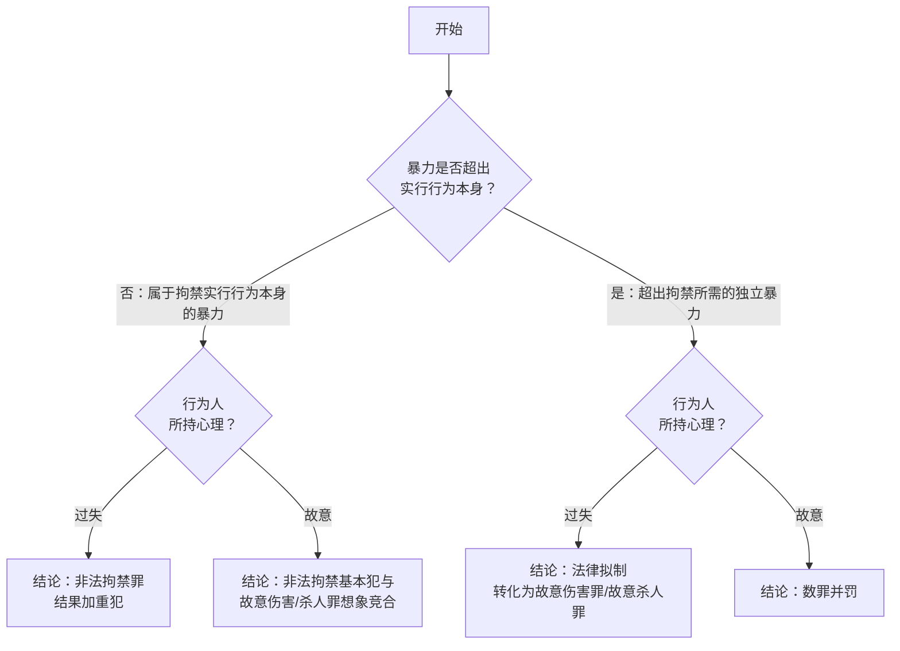

# File Overview

- File name: IV 侵犯自由的犯罪.md
- File type: Obsidian review note
- Coverage: 以第五周录音稿实际讲到的内容为主
- This note focuses on: `非法拘禁罪`、`绑架罪`、`拐卖妇女儿童罪（前半）`
- Not covered in this recording: `收买被拐卖的妇女儿童`、`诬告陷害`、`非法侵入住宅`、`刑讯逼供`、`虐待罪`

# Executive Summary

这次录音不是把整章“侵犯自由的犯罪”全部讲完，而是集中把最难、最核心的三块先讲透：`非法拘禁罪`、`绑架罪`、`拐卖妇女儿童罪`。老师的处理方法非常统一，不是让你死记法条，而是一直围绕三步走：先看法益，再看行为结构，最后看加重、转化与罪数。  
这份笔记因此不再按整章罗列全部罪名，而是改成与第五周录音一致的复习版。真正要背熟的，是几个会反复出题的判断轴：`现实的自由说`、`欺骗导致的同意是否有效`、`索债型非法拘禁与绑架的边界`、`绑架罪的短缩二行为犯结构`、`人质合格性`、`绑架罪没有过失结果加重犯`、`绑架型拐卖与贩卖型拐卖`、`出卖子女与送养的区分`。

# Key Takeaways

- 非法拘禁罪保护的是`身体活动自由`，而不只是“能不能移动到别处”。
- 课堂采`现实的自由说`：被害人必须现实地意识到自由被剥夺，醉酒者、熟睡者、婴儿在未意识到前通常不成立非法拘禁。
- 欺骗只有在使被害人`误以为自己不能移动身体`时，才会导致同意无效；若只是对“不移动能换来什么”发生误认，属于动机错误或对价错误，不成立非法拘禁。
- 索债型非法拘禁是高频重点：司法解释和通说认为“债务”包括高利贷、赌债等自然债务。
- 绑架罪的关键不是“有没有勒索到钱”，而是`是否以向第三人提出不法要求为目的而实力控制人质`。
- 绑架罪是`短缩的二行为犯`：只要出于目的二实施了行为一并完成实力控制，通常即为既遂。
- 绑架罪要求`合格人质`，即足以使特定第三人产生现实忧虑；绑错对象时要区分未遂与预备。
- 2015 年修法后，绑架罪`没有过失致人重伤、死亡的结果加重犯`，这点很容易和非法拘禁混淆。
- 拐卖妇女、儿童罪本周主要讲了前半：对象范围、同意问题、绑架型拐卖、贩卖型拐卖，以及`出卖亲生子女与送养`的区分。

---
# Detailed Notes

## 一、本次录音的复习框架

这一讲虽然名义上属于“侵犯自由的犯罪”，但实际重心很集中：

1. 先用`非法拘禁罪`打基础，建立“法益是什么、何为剥夺、何为有效同意”的判断框架。
2. 再用`绑架罪`做升级，理解短缩二行为犯、主观超过要素和人质合格性。
3. 最后把`拐卖妇女儿童罪`先讲到最核心的前半，即行为方式与主观目的。

> [!tip]
> 这三罪最好不要孤立记忆，而要连起来看：
> `非法拘禁`解决“单纯剥夺自由”的基础结构，
> `绑架`是在此基础上加入“向第三人提出不法要求”的目的要素，
> `拐卖`则是在控制他人的基础上进一步加入“出卖目的”。

## 二、总论上的三个共通原理

### 1. 法秩序统一性的相对性

- 刑法对“非法”的判断有独立性，不能机械搬用民法结论。
- 民法不充分保护的自然债务，如赌债、高利贷，在刑法上仍可能成为索债型非法拘禁中的“债务”。
- 所以这里不是“刑法在替民法兜底”，而是刑法按自身的保护范围重新筛选。

### 2. 共同犯罪不要求所有人同罪名

- 在`部分犯罪共同说`下，只要共同行为在某个较轻罪的范围内重合，就可能在该范围内成立共同犯罪。
- 典型例子：甲以绑架故意、乙丙以索债拘禁故意共同扣押人质。
- 结论上可以是：甲成立绑架罪，乙丙成立非法拘禁罪，同时三人在非法拘禁范围内成立共同犯罪。

### 3. 结果加重犯的一般原理

- 加重结果必须由基本犯罪行为本身直接造成。
- 中间不能有异常介入因素，必须具有`直接性关联`。
- 主观上对加重结果至少是过失。

## 三、非法拘禁罪

>[!cite] [[刑法#第二百三十八条]]
>- 非法拘禁他人或者以其他方法非法剥夺他人人身自由的，处三年以下有期徒刑、拘役、管制或者剥夺政治权利。具有殴打、侮辱情节的，从重处罚。
>- 犯前款罪，致人重伤的，处三年以上十年以下有期徒刑；致人死亡的，处十年以上有期徒刑。使用暴力致人伤残、死亡的，依照本法第二百三十四条、第二百三十二条的规定定罪处罚。

### 1. 法益：身体活动自由

- 法益是`身体活动自由`，不是单纯的空间位移自由。
- 所以即使一个人“还能到处走”，只要其身体活动方式被严重剥夺，仍可能成立非法拘禁。
- 老师的例子很典型：给人上手铐、脚镣后让他“随意玩耍”，照样可能侵犯身体活动自由。
 
>[!note] 多数说：现实自由说
>- 即非法拘禁需侵犯现实的自由而不是可能的自由，因为此罪为实害犯而非危险犯
>- 因此被害人通常需要意识到自己的自由被剥夺。
>	- `睡眠锁门案`：熟睡期间锁门又在醒前打开，通常不构成。
> 	- `醉汉锁门案`：醉酒至无意识状态下被锁，通常不构成。
> 	- `婴儿锁屋案`：婴儿对自由被剥夺没有意识，通常不构成。
> 	- `宅男锁屋案`：若其现实上并无离开意思，按现实自由说也可能不构成。
> 	- `知道出不去后躺平睡觉`：构成，因为已经现实意识到自由被剥夺。

>[!tip] 欺骗与同意
> - 如果欺骗使被害人`误以为自己不能移动身体`，同意无效，可能构成非法拘禁。
> - 如果欺骗只是使被害人对“不移动能换来什么”发生误认，同意有效，不构成非法拘禁。
> 	- 简单来说：若欺骗取得的同意之基础针对的是失去身体活动自由这一现实情况本身而非其对价（乘坐小汽车会失去一部分行动自由，对价是能够到达目的地）
> >[!example] 
>> - `电梯断电案`、`飞机故障案`：属于前者，构成拘禁。
>> - `带你去环球影城案`、`宅男大奖案`、`骗女进村案（只评价进村阶段）`：属于后者，不构成拘禁。

### 2. 行为方式

>拘禁他人或者以其他方式非法**剥夺**他人自由

老师反复提醒：法条要求的是`剥夺`而非单纯`限制`。

常见样态包括：

1. `监禁型`：把人关在一定场所。
2. `控制移动型`：强令被害人跟着自己走。
3. `其他剥夺自由型`：只要足以让一般人无法现实活动即可。

>[!example]
> - 【沐浴夺衣案】拿走洗澡者全部衣物，使其一般情况下不敢离开，也可构成拘禁。
> - 【高速跳车案】在高速行驶的汽车上让对方“想走就跳”，对一般人而言仍属拘禁。
> - 【上楼取梯案】把人骗上楼后撤走梯子，也属于拘禁。
> - 【超期羁押案】故意超期羁押，也可成立非法拘禁。

- 我跟着被害人走，而不是控制被害人跟我走，不构成非法拘禁。
- 老师顺带指出，这类极端跟踪骚扰在我国刑法上目前仍存在规制空白，可类比域外的 `stalking` 

### 3. 索债型非法拘禁

- 为`索取债务`而非法扣押、拘禁他人的，定非法拘禁罪。
	1. 这里的“债务”按司法解释和课堂立场，包括合法债务，也包括高利贷、赌债等非法债务或自然债务。张明楷对此持否定观点。
	2. 这里的“他人”不限于债务人本人，也可包括与债务人有共同财产关系、抚养关系的人。

>[!tip] 与绑架罪的区分：
> - 真正为索债而扣押、拘禁，走非法拘禁。
> - 如果只是以“索债”为幌子，实质是向第三人提出不法要求，走绑架。
> - 索要明显超出债务范围的财物，也应警惕向绑架评价转换。

### 4. 结果加重犯、转化犯

这部分必须拆开记，不能混。

#### （1）非法拘禁罪的结果加重犯

>犯前款罪，致人重伤的，处三年以上十年以下有期徒刑；致人死亡的，处十年以上有期徒刑。

1. 必须是**非法拘禁的实行行为**致人重伤、死亡
2. 拘禁行为与伤亡结果见要有直接性关联
	1. 实施本罪后，被害人自杀、自残的，一般不属于本罪的结果加重犯。【跳楼自救案】【阳台失足案】
	2. 被害人为了摆脱**单纯的拘禁**而选择**高度危险的摆脱方式**导致身亡的，不宜认定结果加重犯。【攀爬水管案】
	3. 正常的解救行为造成被害人死伤的，属于本罪的结果加重犯。因警方失误造成的，不属于本罪的结果加重犯。
3. 主观上对加重结果持==过失心理==（*不能是故意，否则直接同故意伤害罪想象竞合*）。【反扭胳膊

#### （2）转化犯

>使用暴力致人伤残、死亡的，依照[[刑法#第二百三十四条|本法第二百三十四条]]、[[刑法#第二百三十二条|第二百三十二条]]的规定定罪处罚。

1. 这是法律拟制：只要求具有**致人伤亡的预见可能性**即可
2. 所使用的暴力必须是**超出非法拘禁实行行为以外的暴力**。
	- 否则属于“[[IV 侵犯自由的犯罪#（1）非法拘禁罪的结果加重犯|非法拘禁致人重伤、死亡]]”的情形（**238**条**2**款**1**句），不定故意杀人罪或故意伤害罪。【拘禁耳光案】
3. **数罪并罚**：非法拘禁过程中故意杀害被害人的，按本罪与故意杀人罪并罚。故意伤害被害人致其伤残的，按本罪与故意伤害罪并罚。
	- 非法拘禁+故意杀人=两罪并罚
	- 非法拘禁+故意重伤=两罪并罚

| 情形    | 暴力性质                | 心理  | 结论                   | 行为  | 罪数  |
| :---- | :------------------ | :-- | :------------------- | --- | --- |
| 结果加重犯 | 拘禁的实行行为本身的暴力【五花大绑案】 | 过失  | 非法拘禁罪结果加重犯           | 1 个 | 1 个 |
| 想象竞合  | 拘禁行为本身的暴力【阳台失足案】    | 故意  | 非法拘禁基本犯与故意伤害/杀人罪想象竞合 | 1 个 | 1 个 |
| 转化犯   | 超出拘禁所需的独立暴力【拘禁耳光案】  | 过失  | 法律拟制转化为故意伤害罪/故意杀人罪   | 2 个 | 1 个 |
| 数罪并罚  | 超出拘禁所需的独立暴力【八口浓痰案】  | 故意  | 数罪并罚                 | 2 个 | 2 个 |

### 5. 从重处罚与禁止重复评价

>具有殴打、侮辱情节的，从重处罚（**238**条**1**款后段）。（另外，国家机关工作人员利用职权犯前三款罪的，从重处罚）

这是针对第 2、3 款的情况，但应当注意「不重复评价」
1. 在**结果加重犯**中：如果行为人具有殴打、侮辱情节，应当在非法拘禁的`加重量刑幅度内`从重处罚。
2. 在**转化犯**中：但若该殴打、侮辱已经被评价为“超出拘禁行为的独立暴力”，从而适用了转化犯条款，就不能再次作为从重情节使用（不重复评价）。
3. 行为人非法拘禁他人，使用暴力致人伤残、死亡的情况下，是否适用“具有侮辱情节，从重处罚”的规定，应具体分析。
	1. 如果侮辱表现为**暴力侮辱**，原则上不再适用“具有侮辱情节，从重处罚”的规定，否则违反了禁止重复评价的原则。
	2. 如果侮辱行为表现为**暴力以外的方式**，则应适用”具有侮辱情节，从重处罚”的规定。

| 致死情形                | 致死原因 | 符合情形                   | 适用法条                             |
| ------------------- | ---- | ---------------------- | -------------------------------- |
| 未在拘禁行之外另使用暴力        | 拘禁行为 | 非法拘禁罪的结果加重犯            | 第238条第2款第1句                      |
| 在拘禁行之外另使用暴力         | 拘禁行为 | 非法拘禁罪的结果加重犯＋殴打情节       | 第238条第2款第1句＋第238 条第1款第2句   |
| 在拘禁行为之外实施了故意杀人行为    | 杀人行为 | 非法拘禁罪+故意杀人罪数罪并罚        | 第238条第1款＋第232条                   |
| 在拘禁行为之外另使用暴力，但无杀人故意 | 暴力行为 | 故意杀人罪（法律拟制）第238条第2款第2句 | 238条第1款第2句                       |
| 在拘禁行之外，故意伤害致人死亡     | 伤害行为 | 故意杀人罪（法律拟制）第238条第2款第2句 | 238条第1款第2句                       |

---
## 四、绑架罪

>[!cite] [[刑法#第二百三十九条]]
>- 以勒索财物为目的绑架他人的，或者绑架他人作为人质的，处十年以上有期徒刑或者无期徒刑，并处罚金或者没收财产；情节较轻的，处五年以上十年以下有期徒刑，并处罚金。
>- 犯前款罪，杀害被绑架人的，或者故意伤害被绑架人，致人重伤、死亡的，处无期徒刑或者死刑，并处没收财产。
>- 以勒索财物为目的偷盗婴幼儿的，依照前两款的规定处罚。

### 1. 绑架罪的法益

- 被绑架人在本来生活状态下的行动自由以及生命安全。
	- 与财产无关【车臣案】
	- 与亲权无关【父亲绑子案】

### 2. 行为方式

- 使用暴力、胁迫或者麻醉方法劫持或者以实力控制他人。

>[!tip] 缩短的二行为犯
>只要行为人以目的**2**实施了行为**1**，就以本罪既遂论处，不要求行为人客观上实施了行为**2**。如果行为人没有目的**2**，即使客观上实施了行为**1**，也不成立本罪。
>- 实际上将复行为犯缩短为一行为犯或单行为犯。【绑完被抓案】
>- 目的**2**无需客观实现，因而被称为“主观的超过要素”

| 项目  | 以向第三人提出不法请求为目的，实力控制人质 | 向第三人提出不法请求                        |
| --- | --------------------- | --------------------------------- |
| 目的  | 【目的 1】拘禁目的            | 【**目的 2】向第三人勒索财物的目的**^[所谓主观的超过要素] |
| 行为  | **【行为 1】拘禁行为**        | 【行为 2】向第三人勒索财物的行为                 |

### 2. 人质的合格性

不是任何被控制的人都当然能成为绑架罪中的“合格人质”。

- 人质必须足以让特定第三人产生`现实忧虑`。

典型区分：

- `绑错孩子案`：误绑乙，却向甲父索财，因为乙不足以让甲父产生现实忧虑，构成绑架未遂。
- `单身无子案`：客观上根本不存在能忧虑的第三人，缺乏既遂可能，构成绑架预备。

### 3. 与非法拘禁、抢劫的关系

- 绑架罪的前半段本来就包含非法拘禁的内容。
- 因此已满 14 周岁不满 16 周岁的行为人实施绑架，不直接定绑架，但可在非法拘禁框架下评价。
- 如果并未利用家属对人质安危的忧虑，而是以其他方式骗取家属付款，老师提示应警惕评价为`抢劫罪`而非绑架罪。

### 4. 与索债型非法拘禁的衔接

这一块很爱考综合题：

- 甲以勒索财物为目的控制他人，自己构成绑架。
- 乙丙误以为是在帮助索债而实施拘禁，可能成立非法拘禁。
- 三人之间仍可能在非法拘禁的重合范围内成立共同犯罪。

同时要记住：

- `未能实施勒索行为`，不当然意味着绑架未遂。
- 因为绑架既遂不以行为二的实现为要件。

### 5. 绑架杀人、绑架伤害

录音中老师把这里讲得很细，但复习时先抓稳定结论：

- `绑架 + 故意杀人既遂 = 绑架罪（适用加重条款）`
- 若绑架过程中故意杀人但未遂，通常按数罪并罚处理。
- `故意伤害被绑架人致人重伤、死亡`也适用法条第 2 款，但必须满足相应结果要求。

并且注意时间范围：

- 老师强调相关伤害、杀害行为通常应发生在`着手控制人质后至释放人质前`的全过程中。
- 释放人质后另起犯意追杀，通常就不再属于“杀害被绑架人”的规范意义范围。

### 6. 绑架罪没有过失结果加重犯

这是和非法拘禁最容易串线的地方。

- 2015 年修法后，绑架罪没有“过失致人重伤、死亡”的结果加重犯。
- 如果绑架行为本身或者其间的暴力过失致人重伤、死亡，应按`绑架基本犯`与`过失致人重伤/死亡罪`的想象竞合处理。

> [!question]
> 看到“控制人质过程中堵嘴、捆绑、失手致死”这类题，不要顺手套“绑架致死”的旧印象，先反应过来：
> 现行法下这里首先要排查的是“绑架基本犯 + 过失致死/重伤”的想象竞合。

## 五、拐卖妇女、儿童罪

> [!note]
> 本次录音只讲到了本罪前半，尤其是对象范围、同意问题、既遂结构和送养区分；后面的法定刑升格、与收买罪的系统区分还要等下次课补。

### 1. 基本特征

- 大量案件中，行为人拐卖的就是自己的亲生子女，所以不能因为存在亲权、监护关系就排除本罪。
- 被害对象包括外国妇女、儿童。
- 已满 14 周岁的男性不是本罪保护对象，相关行为一般转向非法拘禁等罪名评价。
- 录音还提到，两性人或间性人问题上，司法实践仍倾向于按是否具备女性要素来处理。

### 2. 同意问题

课堂结论要这样记：

- `儿童没有同意能力`。
- 对于`已满 18 周岁的女性`，是否可以同意自己被卖，理论上有争议。
- 老师采取通说和司法实践主流立场：即便成年女性同意，仍可能成立拐卖妇女罪，因为“人无自愿为奴的自由，人无把自己商品化的自由”。

### 3. 六种行为方式与两类重点结构

法条列出的行为方式有六种：

1. 拐卖
2. 绑架
3. 收买
4. 贩卖
5. 接送
6. 中转

其中本周重点是两种：

#### （1）绑架型拐卖

- 结构和绑架罪很像，都是短缩的二行为犯。
- 只要`以出卖为目的`去控制妇女、儿童，就已经进入实行并可能既遂。
- 不要求最终真的卖出去。

记忆方式：

- `开始控制 = 着手`
- `完成控制 = 既遂`

#### （2）贩卖型拐卖

- 这里前面没有“实力控制”作为前提。
- 贩卖在刑法里接近“出卖”，不要求先买进后卖出。
- 着手点在于开始实施出卖行为，比如实际联系、寻找买家等。

>[!faq] 代孕妈妈构成拐卖儿童罪吗？
>关键问题在于「孩子」究竟是谁的，有两个标准
>- 实质标准：卵子提供者为母
>- 形式标准：子宫孕育者为母
>实务中往往采实质标准，但一般只惩罚组织者

### 4. 出卖亲生子女与送养的区分

这是本罪最易混的实务题型。

核心标准不是单看收了多少钱，而是看行为人是否具有`非法获利目的`。

综合判断因素包括：

- 收取财物是否明显超出感谢费、营养费的通常范围。
- 是否完全不考察对方的抚养条件。
- 是否根本不关心孩子后续生活。
- 是否把孩子当作需要尽快脱手的“交易对象”。

老师特别强调：

- 不能唯数额论。
- 即便只收了不算特别高的金额，只要综合情节显示其主观上是在“卖孩子”，仍可能构成拐卖。
- 若系出卖自己的亲生子女，通常还会牵连到`遗弃罪`评价问题。

### 责任形式

故意加出卖目的

### 法定刑升格（重要）

1. 集团首要分子
2. 拐卖妇女儿童三人以上
3. 奸淫被拐卖妇女（结合犯）
	1. 奸淫=强奸，不包括猥亵，不需要既遂
	2. 包括奸淫幼女的情形
4. 

# Assumptions and Notes

- 这份笔记以 `/Users/chillychili/Library/Containers/com.tencent.xinWeChat/Data/Documents/xwechat_files/wxid_yagu0ox24y3122_9bd6/msg/file/2026-04/汪润刑分逐字稿+重点 第五周.docx` 为主要补强来源，并参考了原有 `侵犯自由的犯罪` 笔记的章节框架。
- 逐字稿结尾明确说明“拐卖妇女儿童后面下次课再讲”，因此本笔记有意不再展开 `收买被拐卖的妇女儿童`、`诬告陷害`、`非法侵入住宅`、`刑讯逼供`、`虐待罪` 等后续部分。
- PDF 在本次整理中主要用于确认章节归属；由于本机缺少直接提取该 PDF 文本的命令，具体论证内容以录音稿与原笔记交叉校正后重写。
