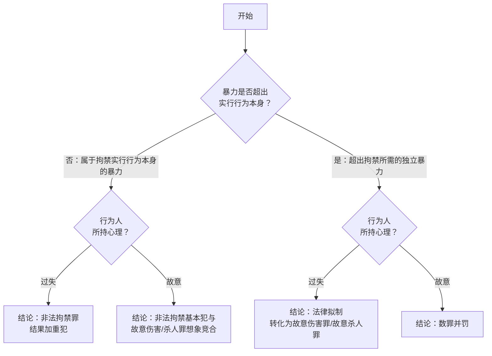

## 一、本次录音的复习框架

这一讲虽然名义上属于“侵犯自由的犯罪”，但实际重心很集中：

1. 先用`非法拘禁罪`打基础，建立“法益是什么、何为剥夺、何为有效同意”的判断框架。
2. 再用`绑架罪`做升级，理解短缩二行为犯、主观超过要素和人质合格性。
3. 最后把`拐卖妇女儿童罪`先讲到最核心的前半，即行为方式与主观目的。

> [!tip]
> 这三罪最好不要孤立记忆，而要连起来看：
> `非法拘禁`解决“单纯剥夺自由”的基础结构，
> `绑架`是在此基础上加入“向第三人提出不法要求”的目的要素，
> `拐卖`则是在控制他人的基础上进一步加入“出卖目的”。

## 二、总论上的三个共通原理

### 1. 法秩序统一性的相对性

- 刑法对“非法”的判断有独立性，不能机械搬用民法结论。
- 民法不充分保护的自然债务，如赌债、高利贷，在刑法上仍可能成为索债型非法拘禁中的“债务”。
- 所以这里不是“刑法在替民法兜底”，而是刑法按自身的保护范围重新筛选。

### 2. 共同犯罪不要求所有人同罪名

- 在`部分犯罪共同说`下，只要共同行为在某个较轻罪的范围内重合，就可能在该范围内成立共同犯罪。
- 典型例子：甲以绑架故意、乙丙以索债拘禁故意共同扣押人质。
- 结论上可以是：甲成立绑架罪，乙丙成立非法拘禁罪，同时三人在非法拘禁范围内成立共同犯罪。

### 3. 结果加重犯的一般原理

- 加重结果必须由基本犯罪行为本身直接造成。
- 中间不能有异常介入因素，必须具有`直接性关联`。
- 主观上对加重结果至少是过失。

## 三、非法拘禁罪

> [!quote] [[刑法#第二百三十八条]]
>- 非法拘禁他人或者以其他方法非法剥夺他人人身自由的，处三年以下有期徒刑、拘役、管制或者剥夺政治权利。具有殴打、侮辱情节的，从重处罚。
>- 犯前款罪，致人重伤的，处三年以上十年以下有期徒刑；致人死亡的，处十年以上有期徒刑。使用暴力致人伤残、死亡的，依照本法第二百三十四条、第二百三十二条的规定定罪处罚。

### （一）保护法益：身体活动自由

- 法益是`身体活动自由`，不是单纯的空间位移自由。
- 所以即使一个人“还能到处走”，只要其身体活动方式被严重剥夺，仍可能成立非法拘禁。
- 老师的例子很典型：给人上手铐、脚镣后让他“随意玩耍”，照样可能侵犯身体活动自由。
 
> [!note] 多数说：现实自由说
>- 即非法拘禁需侵犯现实的自由而不是可能的自由，因为此罪为实害犯而非危险犯
>- 因此被害人通常需要意识到自己的自由被剥夺。
>	- `睡眠锁门案`：熟睡期间锁门又在醒前打开，通常不构成。
> 	- `醉汉锁门案`：醉酒至无意识状态下被锁，通常不构成。
> 	- `婴儿锁屋案`：婴儿对自由被剥夺没有意识，通常不构成。
> 	- `宅男锁屋案`：若其现实上并无离开意思，按现实自由说也可能不构成。
> 	- `知道出不去后躺平睡觉`：构成，因为已经现实意识到自由被剥夺。

>[!tip] 欺骗与同意
> - 如果欺骗使被害人`误以为自己不能移动身体`，同意无效，可能构成非法拘禁。
> - 如果欺骗只是使被害人对“不移动能换来什么”发生误认，同意有效，不构成非法拘禁。
> 	- 简单来说：若欺骗取得的同意之基础针对的是失去身体活动自由这一现实情况本身而非其对价（乘坐小汽车会失去一部分行动自由，对价是能够到达目的地）
> >[!example] 
>> - `电梯断电案`、`飞机故障案`：属于前者，构成拘禁。
>> - `带你去环球影城案`、`宅男大奖案`、`骗女进村案（只评价进村阶段）`：属于后者，不构成拘禁。

### （二）行为对象

- 行为对象是自然人的现实身体活动自由；重点不在被害人身份，而在其是否现实意识到自由被剥夺。
- 醉酒、熟睡、婴儿等无法意识自由被剥夺者，通常难以成为现实自由说下的既遂对象。

### （三）行为方式

>拘禁他人或者以其他方式非法**剥夺**他人自由

课堂反复强调：法条要求的是`剥夺`而非单纯`限制`。

常见样态包括：

1. `监禁型`：把人关在一定场所。
2. `控制移动型`：强令被害人跟着自己走。
3. `其他剥夺自由型`：只要足以让一般人无法现实活动即可。

>[!example]
> - 【沐浴夺衣案】拿走洗澡者全部衣物，使其一般情况下不敢离开，也可构成拘禁。
> - 【高速跳车案】在高速行驶的汽车上让对方“想走就跳”，对一般人而言仍属拘禁。
> - 【上楼取梯案】把人骗上楼后撤走梯子，也属于拘禁。
> - 【超期羁押案】故意超期羁押，也可成立非法拘禁。

- 我跟着被害人走，而不是控制被害人跟我走，不构成非法拘禁。
- 课堂补充指出，这类极端跟踪骚扰在我国刑法上目前仍存在规制空白，可类比域外的 `stalking` 

### （四）行为主体

- 一般主体；国家机关工作人员利用职权实施的，从重处罚。

### （五）责任

- 故意；索债型非法拘禁还要求行为人主观上以索取债务为目的。

### （六）其他问题：索债型非法拘禁

- 为`索取债务`而非法扣押、拘禁他人的，定非法拘禁罪。
	1. 这里的“债务”按司法解释和课堂立场，包括合法债务，也包括高利贷、赌债等非法债务或自然债务。张明楷对此持否定观点。
	2. 这里的“他人”不限于债务人本人，也可包括与债务人有共同财产关系、抚养关系的人。

>[!tip] 与绑架罪的区分：
> - 真正为索债而扣押、拘禁，走非法拘禁。
> - 如果只是以“索债”为幌子，实质是向第三人提出不法要求，走绑架。
> - 索要明显超出债务范围的财物，也应警惕向绑架评价转换。

### （六）其他问题：结果加重犯与转化犯

这部分必须拆开记，不能混。

#### （1）非法拘禁罪的结果加重犯

>犯前款罪，致人重伤的，处三年以上十年以下有期徒刑；致人死亡的，处十年以上有期徒刑。

1. 必须是**非法拘禁的实行行为**致人重伤、死亡
2. 拘禁行为与伤亡结果见要有直接性关联
	1. 实施本罪后，被害人自杀、自残的，一般不属于本罪的结果加重犯。【跳楼自救案】【阳台失足案】
	2. 被害人为了摆脱**单纯的拘禁**而选择**高度危险的摆脱方式**导致身亡的，不宜认定结果加重犯。【攀爬水管案】
	3. 正常的解救行为造成被害人死伤的，属于本罪的结果加重犯。因警方失误造成的，不属于本罪的结果加重犯。
3. 主观上对加重结果持==过失心理==（*不能是故意，否则直接同故意伤害罪想象竞合*）。【反扭胳膊

#### （2）转化犯

>使用暴力致人伤残、死亡的，依照[[刑法#第二百三十四条|本法第二百三十四条]]、[[刑法#第二百三十二条|第二百三十二条]]的规定定罪处罚。

1. 这是法律拟制：只要求具有**致人伤亡的预见可能性**即可
2. 所使用的暴力必须是**超出非法拘禁实行行为以外的暴力**。
	- 否则属于“[[IV 侵犯自由的犯罪#（1）非法拘禁罪的结果加重犯|非法拘禁致人重伤、死亡]]”的情形（**238**条**2**款**1**句），不定故意杀人罪或故意伤害罪。【拘禁耳光案】
3. **数罪并罚**：非法拘禁过程中故意杀害被害人的，按本罪与故意杀人罪并罚。故意伤害被害人致其伤残的，按本罪与故意伤害罪并罚。
	- 非法拘禁+故意杀人=两罪并罚
	- 非法拘禁+故意重伤=两罪并罚

| 情形    | 暴力性质                | 心理  | 结论                   | 行为  | 罪数  |
| :---- | :------------------ | :-- | :------------------- | --- | --- |
| 结果加重犯 | 拘禁的实行行为本身的暴力【五花大绑案】 | 过失  | 非法拘禁罪结果加重犯           | 1 个 | 1 个 |
| 想象竞合  | 拘禁行为本身的暴力【阳台失足案】    | 故意  | 非法拘禁基本犯与故意伤害/杀人罪想象竞合 | 1 个 | 1 个 |
| 转化犯   | 超出拘禁所需的独立暴力【拘禁耳光案】  | 过失  | 法律拟制转化为故意伤害罪/故意杀人罪   | 2 个 | 1 个 |
| 数罪并罚  | 超出拘禁所需的独立暴力【八口浓痰案】  | 故意  | 数罪并罚                 | 2 个 | 2 个 |

### （六）其他问题：从重处罚与禁止重复评价

>具有殴打、侮辱情节的，从重处罚（**238**条**1**款后段）。（另外，国家机关工作人员利用职权犯前三款罪的，从重处罚）

这是针对第 2、3 款的情况，但应当注意「不重复评价」
1. 在**结果加重犯**中：如果行为人具有殴打、侮辱情节，应当在非法拘禁的`加重量刑幅度内`从重处罚。
2. 在**转化犯**中：但若该殴打、侮辱已经被评价为“超出拘禁行为的独立暴力”，从而适用了转化犯条款，就不能再次作为从重情节使用（不重复评价）。
3. 行为人非法拘禁他人，使用暴力致人伤残、死亡的情况下，是否适用“具有侮辱情节，从重处罚”的规定，应具体分析。
	1. 如果侮辱表现为**暴力侮辱**，原则上不再适用“具有侮辱情节，从重处罚”的规定，否则违反了禁止重复评价的原则。
	2. 如果侮辱行为表现为**暴力以外的方式**，则应适用”具有侮辱情节，从重处罚”的规定。

| 致死情形                | 致死原因 | 符合情形                   | 适用法条                             |
| ------------------- | ---- | ---------------------- | -------------------------------- |
| 未在拘禁行之外另使用暴力        | 拘禁行为 | 非法拘禁罪的结果加重犯            | 第238条第2款第1句                      |
| 在拘禁行之外另使用暴力         | 拘禁行为 | 非法拘禁罪的结果加重犯＋殴打情节       | 第238条第2款第1句＋第238 条第1款第2句   |
| 在拘禁行为之外实施了故意杀人行为    | 杀人行为 | 非法拘禁罪+故意杀人罪数罪并罚        | 第238条第1款＋第232条                   |
| 在拘禁行为之外另使用暴力，但无杀人故意 | 暴力行为 | 故意杀人罪（法律拟制）第238条第2款第2句 | 238条第1款第2句                       |
| 在拘禁行之外，故意伤害致人死亡     | 伤害行为 | 故意杀人罪（法律拟制）第238条第2款第2句 | 238条第1款第2句                       |

---
## 四、绑架罪

> [!quote] [[刑法#第二百三十九条]]
>- 以勒索财物为目的绑架他人的，或者绑架他人作为人质的，处十年以上有期徒刑或者无期徒刑，并处罚金或者没收财产；情节较轻的，处五年以上十年以下有期徒刑，并处罚金。
>- 犯前款罪，杀害被绑架人的，或者故意伤害被绑架人，致人重伤、死亡的，处无期徒刑或者死刑，并处没收财产。
>- 以勒索财物为目的偷盗婴幼儿的，依照前两款的规定处罚。

### （一）保护法益

- 被绑架人在本来生活状态下的行动自由以及生命安全。
	- 与财产无关【车臣案】
	- 与亲权无关【父亲绑子案】

### （二）行为对象：合格人质

不是任何被控制的人都当然能成为绑架罪中的“合格人质”。

- 人质必须足以让特定第三人产生`现实忧虑`。

典型区分：

- `绑错孩子案`：误绑乙，却向甲父索财，因为乙不足以让甲父产生现实忧虑，构成绑架未遂。
- `单身无子案`：客观上根本不存在能忧虑的第三人，缺乏既遂可能，构成绑架预备。

### （三）行为方式

- 使用暴力、胁迫或者麻醉方法劫持或者以实力控制他人。

>[!tip] 缩短的二行为犯
>只要行为人以目的**2**实施了行为**1**，就以本罪既遂论处，不要求行为人客观上实施了行为**2**。如果行为人没有目的**2**，即使客观上实施了行为**1**，也不成立本罪。
>- 实际上将复行为犯缩短为一行为犯或单行为犯。【绑完被抓案】
>- 目的**2**无需客观实现，因而被称为“主观的超过要素”

| 项目  | 以向第三人提出不法请求为目的，实力控制人质 | 向第三人提出不法请求                        |
| --- | --------------------- | --------------------------------- |
| 目的  | 【目的 1】拘禁目的            | 【**目的 2】向第三人勒索财物的目的**^[所谓主观的超过要素] |
| 行为  | **【行为 1】拘禁行为**        | 【行为 2】向第三人勒索财物的行为                 |

### （四）行为主体

- 一般主体；已满 14 周岁不满 16 周岁者实施绑架的，通常不能直接以绑架罪定罪，但可在非法拘禁等已负责任年龄罪名中评价。

### （五）责任

- 故意，并具有向第三人提出不法要求的目的；勒索财物只是典型目的，不限于财产要求。

### （六）其他问题：相邻罪名

- 绑架罪的前半段本来就包含非法拘禁的内容。
- 因此已满 14 周岁不满 16 周岁的行为人实施绑架，不直接定绑架，但可在非法拘禁框架下评价。
- 如果并未利用家属对人质安危的忧虑，而是以其他方式骗取家属付款，课堂提示应警惕评价为`抢劫罪`而非绑架罪。

### （六）其他问题：索债型拘禁

这一块很爱考综合题：

- 甲以勒索财物为目的控制他人，自己构成绑架。
- 乙丙误以为是在帮助索债而实施拘禁，可能成立非法拘禁。
- 三人之间仍可能在非法拘禁的重合范围内成立共同犯罪。

同时要记住：

- `未能实施勒索行为`，不当然意味着绑架未遂。
- 因为绑架既遂不以行为二的实现为要件。

### （六）其他问题：绑架杀伤

录音中老师把这里讲得很细，但复习时先抓稳定结论：

- `绑架 + 故意杀人既遂 = 绑架罪（适用加重条款）`
- 若绑架过程中故意杀人但未遂，通常按数罪并罚处理。
- `故意伤害被绑架人致人重伤、死亡`也适用法条第 2 款，但必须满足相应结果要求。

并且注意时间范围：

- 课堂强调相关伤害、杀害行为通常应发生在`着手控制人质后至释放人质前`的全过程中。
- 释放人质后另起犯意追杀，通常就不再属于“杀害被绑架人”的规范意义范围。

### （六）其他问题：过失伤亡

这是和非法拘禁最容易串线的地方。

- 2015 年修法后，绑架罪没有“过失致人重伤、死亡”的结果加重犯。
- 如果绑架行为本身或者其间的暴力过失致人重伤、死亡，应按`绑架基本犯`与`过失致人重伤/死亡罪`的想象竞合处理。

> [!question]
> 看到“控制人质过程中堵嘴、捆绑、失手致死”这类题，不要顺手套“绑架致死”的旧印象，先反应过来：
> 现行法下这里首先要排查的是“绑架基本犯 + 过失致死/重伤”的想象竞合。

## 五、拐卖妇女、儿童罪

> [!note]
> 本次录音只讲到本罪前半，尤其是对象范围、同意问题、既遂结构和送养区分；后续法定刑升格、收买罪系统区分仍待后续课程补足。

### （一）保护法益

- 妇女、儿童的人身自由与人格不得商品化的利益。
- 亲权、监护关系不当然排除本罪；大量案件中，行为人拐卖的正是亲生子女。

### （二）行为对象

- 妇女、儿童；包括外国妇女、儿童。
- 已满 14 周岁的男性不是本罪对象，相关行为通常转向非法拘禁等罪名评价。
- 两性人或间性人场景，司法实践倾向结合女性要素处理。

### （三）行为方式

法条列出的行为方式包括拐骗、绑架、收买、贩卖、接送、中转。重点掌握两类结构：

#### 1. 绑架型拐卖

- 结构类似绑架罪，属于短缩的二行为犯。
- 以出卖为目的控制妇女、儿童，即进入实行并可能既遂；不要求最终卖出。
- 记忆：`开始控制 = 着手`；`完成控制 = 既遂`。

#### 2. 贩卖型拐卖

- 前面没有实力控制行为时，贩卖行为本身成为实行行为。
- 贩卖接近“出卖”，不要求先买进后卖出；着手点在于实际联系、寻找买家等出卖行为。

> [!question] 代孕妈妈构成拐卖儿童罪吗？
> 关键在于“孩子”归属标准：实质标准以卵子提供者为母，形式标准以子宫孕育者为母。实务往往采实质标准，并通常重点处罚组织者。

### （四）行为主体

- 一般主体；父母、监护人也可能成为本罪主体。

### （五）责任

- 故意，并具有出卖目的。
- 儿童没有同意能力；成年女性能否同意自己被卖存在争议，课堂采通说与司法实践主流立场，倾向否定“自愿为奴、商品化自身”的有效性。

### （六）其他问题：出卖亲生子女与送养

- 核心标准不是单看收取金额，而是看是否具有非法获利目的。
- 综合判断因素：收取财物是否明显超出感谢费、营养费；是否考察抚养条件；是否关心孩子后续生活；是否把孩子作为交易对象。
- 出卖亲生子女通常还会牵连遗弃罪评价问题。

### （七）其他问题：法定刑升格

1. 拐卖妇女、儿童集团的首要分子。
2. 拐卖妇女、儿童三人以上。
3. 奸淫被拐卖妇女：结合犯；奸淫按强奸理解，不包括猥亵，并包括奸淫幼女情形。

---

## 本讲复习抓手

- 非法拘禁重在现实身体活动自由，欺骗是否导致“以为不能出去”是同意有效性的关键。
- 绑架是短缩二行为犯：控制合格人质即既遂，不要求实际勒索或取得财物。
- 拐卖妇女、儿童的行为结构与绑架相似，但主观超过要素是出卖目的。
