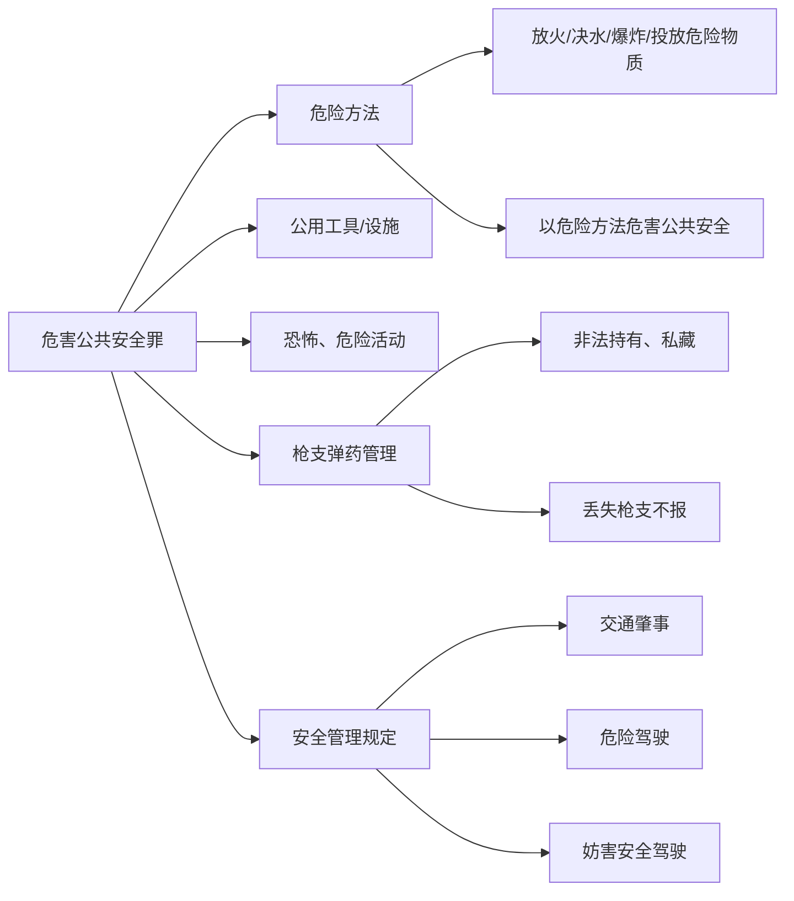
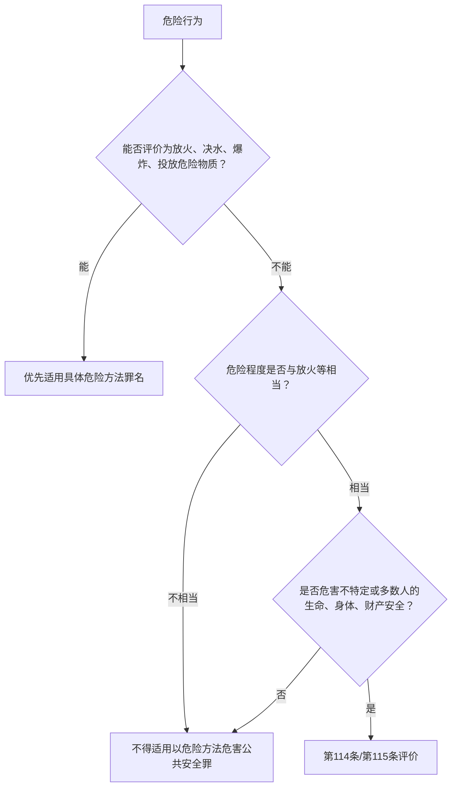

## 一、危害公共安全罪的体系位置

### （一）保护法益

危害公共安全罪保护的是**不特定或多数人的生命、身体或者财产安全**。判断重点不在行为发生地点是否“公共”，而在危险是否具有向不特定或多数人扩张的性质。

> 不特定$\lor$多数人

| 要素  | 含义                                                       | 反面排除                         | 案例                   |
| --- | -------------------------------------------------------- | ---------------------------- | -------------------- |
| 不特定 | 犯罪行为`可能侵犯的对象`和`可能造成的结果`**事先无法确定**，`危险或侵害结果`可能随时==扩大或增加== | ≠“对象随机、谁碰到谁倒霉”               | 【白斩鸡案[^1]】【毒丝瓜案[^2]】 |
| 多数  | 难以用固定数字表达，行为使**较多人**的生命、健康受到威胁即可                         | 单纯针对特定少数人且危险不会扩张，通常不进入公共安全评价 |                      |
| 安全  | 人身伤亡和财产损失等**物质性损害**                                      | 不包括精神损害、心理恐慌等非物质损害           | 【肖永灵案[^3]】           |

> [!tip] 法益抓手
> “公共安全”不是抽象社会秩序，而是可还原为不特定或多数人的生命、身体、财产安全。个罪解释应先判断危险能否扩张，再判断条文和法定刑。

### （二）本章罪名谱系

| 类型 | 代表罪名 | 核心评价对象 |
| --- | --- | --- |
| 以危险方法危害公共安全的犯罪 | 放火罪、决水罪、爆炸罪、投放危险物质罪、以危险方法危害公共安全罪及相应过失犯罪 | 与火、水、爆炸、危险物质或同等危险方法相关的公共危险 |
| 破坏公用工具、设施危害公共安全的犯罪 | 破坏交通工具罪、破坏交通设施罪、破坏电力设备罪等 | 公用工具、设施的安全运行 |
| 实施恐怖、危险活动危害公共安全的犯罪 | 组织、领导、参加恐怖活动组织罪、劫持航空器罪等 | 恐怖活动、劫持活动、飞行安全 |
| 违反枪支、弹药管理规定危害公共安全的犯罪 | 非法持有、私藏枪支、弹药罪，丢失枪支不报罪等 | 枪支弹药脱离国家管控后的抽象或具体危险 |
| 违反安全管理规定危害公共安全的犯罪 | 交通肇事罪、危险驾驶罪、妨害安全驾驶罪、重大责任事故罪等 | 交通、生产、运输等领域的安全管理风险 |



### （三）第114条与第115条的基本结构

> [!quote] [[刑法#第一百一十四条]]
> 放火、决水、爆炸以及投放毒害性、放射性、传染病病原体等物质或者以其他危险方法危害公共安全，尚未造成严重后果的，处三年以上十年以下有期徒刑。

> [!quote] [[刑法#第一百一十五条-第1款]]
> 放火、决水、爆炸以及投放毒害性、放射性、传染病病原体等物质或者以其他危险方法致人重伤、死亡或者使公私财产遭受重大损失的，处十年以上有期徒刑、无期徒刑或者死刑。

> [!quote] [[刑法#第一百一十五条-第2款]]
> 过失犯前款罪的，处三年以上七年以下有期徒刑；情节较轻的，处三年以下有期徒刑或者拘役。

| 条文 | 基本功能 | 结果要求 | 法定刑 |
| --- | --- | --- | --- |
| 第114条 | 具体危险犯 | 危害公共安全，尚未造成严重实害结果 | 3-10年 |
| 第115条第1款 | 实害犯/结果加重结构 | 致人重伤、死亡或者使公私财产遭受重大损失 | 10年以上、无期、死刑 |
| 第115条第2款 | 过失危险方法犯罪 | 过失造成前款严重后果 | 3-7年；情节较轻3年以下或拘役 |

> [!caution] “尚未造成严重后果”
> “尚未造成严重后果”只是表面的构成要件要素。放火等行为已经造成公共危险，但不能证明严重后果由行为导致时，至少可以适用第114条，而不是直接以事实不清作无罪处理。

---

## 二、放火罪

### （一）行为方式

放火罪的实行行为是**故意使对象物燃烧、引起火灾的行为**。

1. 对象**物不限于财物**；
	- 自焚行为足以危害公共安全的，也可成立放火罪。
2. 114 条放火罪是**具体危险犯**：
	- 只要发生危害公共安全的具体危险，不要求造成实害结果。
	- `对象物燃烧`是否属于放火行为，关键在于是否危害公共安全。

> [!example] 小火苗案
> 小火苗、轻微点燃等事实不能机械等同于放火罪。若危险没有扩张至不特定或多数人的生命、身体、财产安全，通常不宜认定为放火罪。

### （二）责任形式与责任年龄

* 责任形式为**故意**；
	* 结果加重场合（115），只要求对`加重结果`**至少具有过失**。
* 责任年龄：
	* 放火罪、爆炸罪、投放危险物质罪属于已满14周岁即可承担刑责的范围；决水罪、以危险方法危害公共安全罪仍以16周岁为一般起点。

### （三）第114条与第115条的适用

- 如果认为 115 条是基本犯，则 114 条是`未遂犯`
	- 后者被单独地类型化规定了，无需按照总则处理。

| 情形                  | 处理          |
| ------------------- | ----------- |
| 未造成任何实害后果           | 第114条放火罪    |
| 造成一定实害后果但不严重        | 第114条放火罪    |
| 客观上有严重后果，但不能证明由放火导致 | 第114条放火罪    |
| 造成他人重伤、死亡或者公私财产重大损失 | 第115条第1款放火罪 |

> [!tip] 「尚未造成严重后果」是表面的构成要件要素
> 只是为了区分 114/115，而不是增加行为的不法性。因此，存疑

### （四）既遂标准争议

| 学说        | 标准                    | 复习评价                 |
| --------- | --------------------- | -------------------- |
| ==独立燃烧说== | 对象物离开媒介物后能够独立燃烧       | 课堂强调应结合“独立燃烧+难以扑救”理解 |
| 丧失效用说     | 对象物重要部分因燃烧而失去效用       | 更接近财产毁损评价            |
| 重要部分燃烧说   | 对象物重要部分开始燃烧           | 强调燃烧部位重要性            |
| 毁弃说       | 火力使对象物达到故意毁坏财物罪中的损坏程度 | 容易把公共危险犯罪拉向财产犯罪标准    |

### （五）罪数

| 场景                          | 处理                          | 案例      |
| --------------------------- | --------------------------- | ------- |
| 放火时对死亡、重伤结果持过失，同时危害公共安全     | 第115条第1款放火罪，作为结果加重犯处理       | 【仓库失火案】 |
| 放火时对死亡、重伤结果持故意，同时危害公共安全     | 第115条第1款放火罪与故意杀人罪、故意伤害罪想象竞合 | 【公交纵火案】 |
| 放火时对死亡、重伤结果持故意，但不足以危害公共安全   | 故意杀人罪或故意伤害罪                 | 【孤宅纵火案】 |
| 实施其他犯罪后为销毁罪证而放火，且放火足以危及公共安全 | 前罪与放火罪数罪并罚                  |         |
| 为骗取保险金而放火且已着手骗保，放火足以危及公共安全  | 保险诈骗相关犯罪与放火罪数罪并罚            |         |

> [!tip] 放火杀人的竞合判断
> 放火罪与故意杀人罪并非当然法条竞合。放火不必然构成故意杀人，故意杀人也不必然构成放火；同一行为同时评价为放火和杀人时，更适合按想象竞合处理，从一重罪处罚。

---

## 三、以危险方法危害公共安全罪

### （一）基本构造

以危险方法危害公共安全罪，是指使用`与放火、爆炸、决水、投放危险物质方法`的**危险性相当**的其他危险方法，危害公共安全的行为。

1. “其他危险方法”应作限制解释（同类解释），限于`与放火、决水、爆炸、投放危险物质`**相当**的方法。【昆明暴恐案❌】【高空抛物案🤔】【高空扔狗案❌】
2. 本罪只是第114条、第115条的兜底规定，**不是刑法分则第二章整体的兜底条款**。
3. 本罪是==具体罪名==（个罪），不是类罪名。

> [!caution] 口袋罪风险
> 不能因为行为危害公共安全、难以放入其他罪名，就直接适用本罪。法定刑从3年以上起跳，决定其只能容纳与放火、爆炸等危险程度相当的行为。

### （二）司法适用中的典型情形

| 类型 | 规范或案例线索 | 评价重点 |
| --- | --- | --- |
| 民航飞行安全 | 违规开启舱门、释放应急撤离滑梯等 | 是否足以发生火灾、爆炸等重大危险 |
| 醉驾后冲撞 | 酒后/醉酒驾车肇事后继续驾车冲撞，造成重大伤亡 | 驾驶行为是否升级为与放火相当的公共危险 |
| 高空抛物 | 足以危害公共安全或造成重伤、死亡、重大财产损失 | 与高空抛物罪、故意伤害/杀人罪区分 |
| 盗窃、破坏窨井盖 | 人员密集往来场所，足以危害公共安全 | 场所公共性与危险现实性 |
| 驾车冲撞、拖拽、剐蹭民警 | 危害公共安全或民警生命健康 | 与袭警、故意伤害、故意杀人竞合 |
| 驾车任意冲闯公共场所 | 制造社会影响、发泄不满、实现个人诉求 | 公共场所中不特定多数人的现实危险 |
| 易燃易爆危险物品运输 | 明知重大事故隐患而不排除 | 危险物品运输活动与公共危险 |
| 危险方法传播病原体 | 艾滋病病毒、新冠肺炎病原体等 | 病原体属性、传播危险与条文分流 |
| 其他 | 私拉电网、破坏消防器材、破坏矿井通风设备、高速逆行等 | 是否达到同类危险程度 |

### （三）课堂强调的限缩规则

1. **毒驾不当然构成本罪。**吸毒后驾驶不能纳入危险驾驶罪的醉驾类型，但也不能因此一概转入以危险方法危害公共安全罪。关键仍是驾驶行为本身是否达到横冲直撞、逆行、蛇形行驶、连续超车等足以与放火相当的危险程度。
2. **突发性传染病病原体具有特殊分流意义。**若病原体已经属于投放危险物质罪中的“传染病病原体”，原则上直接考虑投放危险物质罪；突发性病原体因科学和行政认定滞后，才可能进入以危险方法危害公共安全罪评价。
3. **能评价为放火、爆炸等具体危险方法时，优先使用具体罪名。**燃放烟花爆竹、释放燃气后点火等案件，不能因放火/爆炸界限难判而简单转入本罪。若同时具有放火和爆炸特征，更适合按放火罪、爆炸罪想象竞合处理。



---

## 四、枪支、弹药管理类犯罪

### （一）非法持有、私藏枪支、弹药罪

> [!quote] [[刑法#第一百二十八条-第1款]]
> 违反枪支管理规定，非法持有、私藏枪支、弹药的，处三年以下有期徒刑、拘役或者管制；情节严重的，处三年以上七年以下有期徒刑。

| 行为类型 | 含义 | 重点 |
| --- | --- | --- |
| 非法持有 | 不符合配备、配置枪支、弹药条件的人员，擅自持有枪支、弹药 | 从未具有合法权限 |
| 私藏 | 依法配备、配置枪支、弹药的人员，在条件消除后私自藏匿且拒不交出 | 曾经合法，后来失去权限 |

* 本罪为抽象危险犯；枪支弹药脱离国家管控即形成类型化公共危险。
* 单位不能构成本罪。
* “持有/私藏”的区分更多是立法文字层面的选择性罪名差异，法定刑和处罚逻辑基本相同。

> [!tip] 柏浪涛考点：持有型犯罪
> 持有型犯罪通常按作为犯罪理解，评价对象是“维持非法持有状态”，而不是“不上缴”的不作为。发现违禁品后立即丢弃、交出或以其他方式不再维持非法持有状态的，不宜机械认定为非法持有。

### （二）持有型犯罪的罪数规则

持有型犯罪是违禁品犯罪的兜底评价。行为已经构成非法制造、买卖、运输、盗窃、抢夺枪支弹药等犯罪时，后续持有一般被吸收，不再并罚。

| 场景 | 处理 |
| --- | --- |
| 非法制造后又持有、私藏 | 以非法制造枪支、弹药罪论处 |
| 购买枪支后持有 | 以非法买卖枪支罪一罪论处 |
| 盗窃、抢劫枪支后又持有 | 以盗窃枪支罪或抢劫枪支罪论处 |
| 前行为已过追诉时效，但继续持有仍在追诉期内 | 后续持有仍可独立评价 |

> [!caution] 吸收不等于不构成
> 后续持有行为并非当然“不构成犯罪”，而是在前后行为围绕同一枪支、形成一次公共安全危险时，罪数上不并罚。继续犯和追诉时效问题仍需保留持有行为的独立评价可能。

> [!note] 非法出租、出借枪支的扩张解释
> 依法配备公务用枪人员将枪支赠与他人，或将公务用枪用作借债质押物，使枪支处于非法持枪人控制、使用之下，通常可解释为非法出借枪支；接受者构成犯罪的，另按非法持有枪支罪评价。

### （三）丢失枪支不报罪

> [!quote] [[刑法#第一百二十九条]]
> 依法配备公务用枪的人员，丢失枪支不及时报告，造成严重后果的，处三年以下有期徒刑或者拘役。

| 要素   | 内容                         |
| ---- | -------------------------- |
| 主体   | 依法配备公务用枪的人员                |
| 实行行为 | 丢失枪支后**不及时报告**             |
| 犯罪类型 | 真正不作为犯                     |
| 结果要求 | 造成严重后果（客观的超过要素）；丢失本身不是严重后果 |
| 丢失范围 | 包括遗失、被盗、被抢等脱离自己控制的情形       |

责任形式存在**故意说**、过失说、过失与间接故意说等分歧。

* 对“不及时报告”行为本身，行为人通常具有故意。
* “造成严重后果”可理解为客观的超过要素或类似结果加重结构，不要求对严重后果具有故意。
* 采故意说的实益在于可以解释共同犯罪，例如他人教唆依法配枪人员不报告。

> [!example] 一枪两用案 / 同事劝阻报告
> 枪支丢失后，依法配备公务用枪人员本欲报告，旁人劝其隐瞒，后来枪支被他人用于严重犯罪。若采故意说，劝阻者可能成立丢失枪支不报罪的教唆犯；若采过失说，共犯路径会明显受限。

---

## 五、交通肇事罪

### （一）条文结构与主体

> [!quote] [[刑法#第一百三十三条]]
> 违反交通运输管理法规，因而发生重大事故，致人重伤、死亡或者使公私财产遭受重大损失的，处三年以下有期徒刑或者拘役；交通运输肇事后逃逸或者有其他特别恶劣情节的，处三年以上七年以下有期徒刑；因逃逸致人死亡的，处七年以上有期徒刑。

| 档次 | 条件 | 法定刑 |
| --- | --- | --- |
| 基本犯 | 违反交通运输管理法规，发生重大事故，致重伤、死亡或重大财产损失 | 3年以下有期徒刑或者拘役 |
| 交通肇事后逃逸/其他特别恶劣情节 | 基本犯成立后，为逃避法律追究而逃跑等 | 3-7年 |
| 因逃逸致人死亡 | 逃逸导致被害人因得不到救助而死亡 | 7年以上有期徒刑 |

1. 本罪不是身份犯。**非交通运输人员也可以成为主体**；

2. 单位主管人员、机动车所有人或承包人**指使、强令**他人违章驾驶造成重大事故的，也可以成立本罪，但==不构成共同犯罪==（过失罪不成立共同犯罪）

### （二）行为方式与场域

1. 违反交通运输管理法规，因而发生重大交通事故。【违章三轮案】
2. 利用`非机动交通工具`从事交通运输违章造成重大事故的，若在公共交通领域内且具有危害公共安全性质，也可认定本罪。
	- 只包括开车/开船：公共交通领域主要包括`公路交通`、`水上交通`；
	- 不包括铁路交通和空中交通，后者分别可能进入铁路运营安全事故罪、重大飞行事故罪。
3. 厂矿区内机动车作业事故：【工地挖机撞人案】
	* 在公共交通管理范围内，违反交通运输管理法规造成重大事故，定交通肇事罪。
	* 违反安全生产规章制度造成重大伤亡事故，定重大责任事故罪。
	* 在公共交通管理范围外发生重大事故，原则上定重大责任事故罪。

> [!caution] 规范保护目的
> 交通肇事罪要求结果由`违反规范保护目的`的行为引起。行政违法与死伤结果之间**仅有事实条件关系**，不足以当然完成归责。【弹飞井盖案】【吓死老太案】【高速200公里撞人案】

### （三）责任形式

交通肇事罪是过失犯罪。行为人可以有意识地违反交通运输管理法规，但对重大事故结果仍然轻信能够避免，因此仍属过失。

> [!tip] 行政违法故意 != 刑法故意
> 故意闯红灯、酒后驾驶等行政违法故意，不当然转化为对死亡、重伤结果的刑法故意。

本罪与过失致人死亡罪、过失致人重伤罪通常是交通运输领域特别法条与一般过失犯罪的关系。

### （四）基本犯的认定

> 重要★，必须能背住高亮文字

| 类型                                                                                      | 责任要求       |
| --------------------------------------------------------------------------------------- | ---------- |
| ==死亡1人==或重伤3人以上                                                                         | 负事故全部或主要责任 |
| 死亡3人以上                                                                                  | 负事故同等责任    |
| 造成公共财产或他人财产直接损失，无能力赔偿30万元以上                                                             | 负事故全部或主要责任 |
| ==致1人以上重伤==，并具有**酒后/毒驾**、`无证驾驶`、`驾驶安全装置不全或机件失灵车辆`、`驾驶无牌证或报废车辆`、`严重超载`、**为逃避法律追究逃离现场**之一 | 负事故全部或主要责任 |


> [!caution] 重复评价
> “1人重伤+为逃避法律追究逃离现场”刚好用逃逸情节入罪时，不能再把同一逃逸情节用于“交通肇事后逃逸”的3-7年法定刑。

### （五）交通肇事后逃逸

> 很重要★★

司法解释第3条将逃逸界定为：行为人在发生构成交通肇事罪的交通事故后，为逃避法律追究而逃跑。

1. 逃逸前的`肇事行为`必须**达到交通肇事罪基本犯**程度。
2. 逃逸**目的**在于`逃避法律追究`。
	- 司法解释认定：逃逸是逃避`报案义务`
	- 【酒驾顶包案】交通肇事后主动报警、救治被害人但指使他人顶包的，仍属于逃逸。
	- 【害怕被打案】暂时离开现场但没有逃避法律追究目的的，不属于逃逸。
	- 【不知撞人案】认定逃逸以行为人明知自己的行为造成交通事故为前提。

### （六）因逃逸致人死亡

> 特别重要★★★

司法解释第5条第1款：行为人在交通肇事后`为逃避法律追究`而逃跑，致使被害人`因得不到救助`而死亡。

这里的逃逸逃避的是两个义务：报案义务 $\land$ 救助义务

争议集中在：逃逸前`肇事行为`是否**必须已经构成交通肇事罪**？

| 观点 | 结论 | 理由 |
| --- | --- | --- |
| 否定说 | 不以逃逸前构成交通肇事罪为必要 | 司法解释第5条未像第3条那样明示“构成交通肇事罪” |
| 肯定说 | 必须以前行为构成交通肇事罪为前提 | 第二档逃逸尚且要求基本犯成立，第三档不宜反而放宽 |

因逃逸致人死亡还要求：

* 逃逸不作为与死亡之间有因果关系和归责关联。
* 行为人对死亡结果通常持**过失心态**。
	* 若交通肇事后为逃避法律追究，**故意**将被害人带离事故现场后隐藏或遗弃，致死或严重残疾，应按故意杀人罪或故意伤害罪处理。

> [!example] 逃逸致死案件组
> | 案件 | 关键事实 | 处理抓手 | 处断 |
> | --- | --- | --- | --- |
> | 大雪冻死案 | 肇事后误以为被害人已死，逃离后被害人冻死 | 客观判断逃逸与死亡因果关系 |
> | 老眼昏花案 | 被害人当场死亡，行为人误以为只是受伤而逃逸 | 无逃逸致死因果关系 |
> | 水库溺死案 | 肇事后为毁证将重伤昏迷者丢入水库致死 | 转向故意杀人评价 |
> | 颠簸一下案 | 

【无证驾驶案】


### （七）共犯与相邻犯罪

> 重要★★ 它是过失犯罪不成立共同犯罪的唯一例外

| 问题                                            | 处理                |
| --------------------------------------------- | ----------------- |
| 单位主管人员、车主、承包人指使违章驾驶造成基本犯                      | 各自成立交通肇事罪，但不是共同犯罪 |
| 单位主管人员、车主、承包人或乘车人指使肇事人逃逸，致被害人因得不到救助而死亡【女友劝溜案】 | 司法解释例外承认交通肇事罪的共犯  |

| 问题                      | 处理                                  |
| ----------------------- | ----------------------------------- |
| 交通肇事后继续驾驶离去并连环肇事，导致他人死亡 | 可构成以危险方法危害公共安全罪；第一次肇事已构成交通肇事罪的，数罪并罚 |
| 先实施以危险方法危害公共安全行为，后又交通肇事 | 以危险方法危害公共安全罪吸收交通肇事罪                 |
| 驾驶偷开的机动车肇事构成犯罪          | 盗窃罪与交通肇事罪数罪并罚                       |


```
		         __________
		        |逃逸致人死亡
	   _________
	   |肇事逃逸
————————
|基本犯
```


---

## 六、危险驾驶罪

### （一）行为类型

> [!quote] [[刑法#第一百三十三条-之一]]
> 在道路上驾驶机动车，有追逐竞驶情节恶劣、醉酒驾驶、校车或旅客运输严重超员超速、违规运输危险化学品危及公共安全等情形的，处拘役，并处罚金。

“道路”包括公路、城市道路，以及虽在单位管辖范围但允许社会机动车通行的地方。
- 机关、企事业单位、厂矿、校园、居民小区等内部路段是否属于道路，关键看是否具有公共性、是否允许社会机动车通行。

| 类型               | 犯罪形态  | 重点                                                 |
| ---------------- | ----- | -------------------------------------------------- |
| 追逐竞驶，==情节恶劣==    | 抽象危险犯 | 一人也可构成【抢绿灯】；<br>无抽象危险的不成立【沙漠飙车案】                   |
| 醉酒驾驶机动车          | 抽象危险犯 | 血液酒精含量通常以80mg/100ml + 情节显著轻微可出罪；150 mg/100ml 不要求情节 |
| 校车或旅客运输严重超员、超速   | 抽象危险犯 | 包括合法与非法运输车辆；机动车所有人、管理人可因直接责任成立本罪                   |
| 违规运输危险化学品，危及公共安全 | 具体危险犯 | 须认识到违规运输的是危险化学品，不必认识具体种类                           |

### （二）责任形式与出罪

本罪属于**故意犯罪**，不要求特殊目的。醉酒驾驶时，要求对醉酒状态具有大体认识。

| 场景 | 处理 |
| --- | --- |
| 急救伤病人员等紧急情况，不得已驾驶 | 可成立紧急避险，不构成犯罪 |
| 血液酒精含量80-150mg/100ml且情节较轻 | 可认定情节显著轻微、危害不大 |
| 居民小区、停车场等场所短距离挪车、停车入位 | 在无从重情节时，可作出罪或不起诉处理 |

> [!caution] 柏浪涛考点：醉驾故意与帮助犯
> 吃荔枝、喝藿香正气水等导致检测数值异常，若行为人没有饮酒致醉及驾驶的故意，不宜认定醉酒驾驶型危险驾驶罪。醉酒者仅在车内开空调用于取暖、没有驾驶意图的，也不成立本罪。明知他人已经醉酒仍交付车辆并让其驾驶的，可成立危险驾驶罪帮助犯；单纯在酒会前出借车辆，尚不能当然评价为帮助醉驾。

### （三）罪数关系

刑法第133条之一第3款规定：有前两款行为，同时构成其他犯罪的，依照处罚较重的规定定罪处罚。

| 关系 | 处理 |
| --- | --- |
| 同一危险驾驶行为导致交通事故 | 与交通肇事罪想象竞合，从一重罪 |
| 危险驾驶已经明显既遂后，另因其他违章行为导致事故 | 危险驾驶罪与交通肇事罪数罪并罚 |
| 同一危险驾驶行为达到与放火相当的公共危险 | 与以危险方法危害公共安全罪想象竞合，从一重罪 |
| 危险驾驶既遂后，另以逃跑撞人等行为危害公共安全 | 可能数罪并罚 |
| 醉驾同时暴力、威胁阻碍公安机关检查 | 与妨害公务罪、袭警罪等数罪并罚 |

> [!caution] 附加罚金的轻罪封锁效果
> 重罪没有罚金刑时，仍应考虑危险驾驶罪“并处罚金”的规定。醉驾构成交通肇事罪等重罪时，定重罪并不当然排除轻罪罚金评价。

---

## 七、妨害安全驾驶罪

> [!quote] [[刑法#第一百三十三条-之二]]
> 对行驶中的公共交通工具的驾驶人员使用暴力或者抢控驾驶操纵装置，干扰公共交通工具正常行驶，危及公共安全的，处一年以下有期徒刑、拘役或者管制，并处或者单处罚金。

### （一）行为类型

| 类型 | 构成要求 | 犯罪形态 |
| --- | --- | --- |
| 乘客侧妨害 | 对行驶中的公共交通工具驾驶人员使用暴力，或者抢控驾驶操纵装置，干扰正常行驶，危及公共安全 | 具体危险犯 |
| 驾驶人员侧妨害 | 驾驶人员擅离职守，与他人互殴或殴打他人，危及公共安全 | 具体危险犯 |

### （二）罪数

故意实施妨害安全驾驶行为，同时符合交通肇事罪或以危险方法危害公共安全罪的，属于想象竞合，从一重罪。

| 场景 | 处理抓手 |
| --- | --- |
| 抢夺方向盘并长时间不松手，公交车在高速路左右摇晃 | 可能达到以危险方法危害公共安全罪程度 |
| 突然抢夺方向盘后迅速松开，公交车失控轧死行人 | 妨害安全驾驶罪与交通肇事/危险方法类犯罪竞合判断 |
| 恶劣天气、山路、高速路等高风险场景下抢控装置 | 更容易评价为与放火等相当的公共危险 |

> [!tip] 柏浪涛考点：2021年后的罪名分流
> 《刑法修正案（十一）》增设妨害安全驾驶罪后，一般抢夺方向盘、殴打公交司机等妨害公共交通工具安全驾驶行为，优先进入第133条之二评价。只有行为严重危害公共安全、危险程度达到放火、爆炸等同等程度时，才进一步考虑以危险方法危害公共安全罪；若仅定故意杀人罪而遗漏公共安全法益，也可能评价不足。

---

## 八、本章复习抓手

### （一）危险程度与法定刑校准

| 罪名 | 危险类型 | 法定刑提示 | 限缩抓手 |
| --- | --- | --- | --- |
| 放火罪 | 具体危险/严重实害 | 3-10年；10年以上、无期、死刑 | 必须危害公共安全 |
| 以危险方法危害公共安全罪 | 与放火等相当的具体危险/严重实害 | 3-10年；10年以上、无期、死刑 | 不是第二章兜底，不评价轻危险 |
| 非法持有、私藏枪支、弹药罪 | 抽象危险 | 3年以下；情节严重3-7年 | 违禁品脱离管控 |
| 丢失枪支不报罪 | 不作为+严重后果 | 3年以下 | 行为是不报告，丢失不是实行行为 |
| 交通肇事罪 | 过失实害 | 3年以下；3-7年；7年以上 | 行政违法故意不等于结果故意 |
| 危险驾驶罪 | 多数为抽象危险 | 拘役并处罚金 | 类型封闭，毒驾不当然入罪 |
| 妨害安全驾驶罪 | 具体危险 | 1年以下并处或单处罚金 | 危及公共安全才成立 |

### （二）高频区分

| 区分 | 分界线 |
| --- | --- |
| 放火罪 vs. 故意杀人罪 | 是否同时危害不特定或多数人的生命、身体、财产安全 |
| 放火罪/爆炸罪 vs. 以危险方法危害公共安全罪 | 能否归入具体危险方法；能归入时优先具体罪名 |
| 危险驾驶罪 vs. 以危险方法危害公共安全罪 | 危险是否达到与放火等相当程度；不能只因危险驾驶罪类型封闭而转入重罪 |
| 交通肇事罪 vs. 过失致人死亡罪 | 是否发生在公共交通领域 |
| 交通肇事后逃逸 vs. 因逃逸致人死亡 | 后者要求逃逸不作为与死亡之间有因果关系和归责关联 |
| 丢失枪支不报罪 vs. 枪支被他人犯罪利用的共犯 | 对严重后果具有故意且有制止义务时，可能转向后罪共犯评价 |

### （三）案例涵摄顺序

1. 先确定公共安全法益是否被现实危及：不特定、多数、生命身体财产安全。
2. 再判断条文类型：具体危险犯、抽象危险犯、过失实害犯、真正不作为犯。
3. 遇到第114条/第115条，先判断是否属于放火、决水、爆炸、投放危险物质等具体方法，再考虑“其他危险方法”。
4. 遇到交通类犯罪，先区分公共交通领域、道路公共性、规范保护目的和结果归属。
5. 遇到罪数，先判断行为个数，再处理法条竞合、想象竞合、吸收犯或数罪并罚。

[^1]: 故意杀人罪，不定本罪。

[^2]: 定投放危险物质罪，因为毒丝瓜可能延及外人

[^3]: 炭疽--谎称-->石灰粉：投放虚假危险物质罪（第六章：社会秩序）
