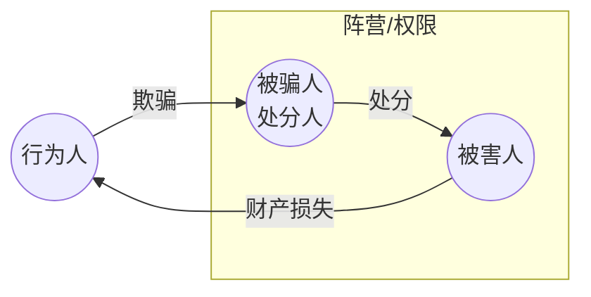

## 一、抢劫罪

### （一）法益

通说认为，抢劫罪保护：

- 财产法益
- 人身安全

少数说强调财产法益加意思活动自由，即抢劫彻底剥夺被害人就财产转移进行利益衡量的意思决定自由。

> [!tip] 债务索取
> 为索取到期合法债务而使用暴力，没有侵犯财产法益，不成立抢劫罪；可能成立故意伤害罪、非法拘禁罪等。

### （二）行为构造

抢劫罪的基本构造：

> 当场使用暴力、胁迫或其他强制方法，强取公私财物。

#### 1. 强制方法的对象

对象可以是：

- 财物占有者。
- 其他具有保护占有意思的人，如保安。

若被打的人既不是占有者，也没有保护占有意识，通常不能以其作为抢劫手段对象。

#### 2. 强制方法的程度

抢劫罪要求足以压制被害人反抗。压制反抗是抢劫罪的中间结果，用以区分盗窃、抢夺、敲诈勒索。

判断基准：被害人的感受，通说采主观说。

| 情形 | 结论 |
| --- | --- |
| 以抢劫目的预谋杀人后取财 | 杀人是终极性压制反抗手段，成立抢劫罪一罪 |
| 单纯利用被害人既有的不能反抗状态取财 | 盗窃，不是抢劫 |
| 亲自灌醉、麻醉被害人后取财 | 可成立抢劫 |
| 暴力、胁迫不足以压制反抗 | 通常转向敲诈勒索等 |

> [!caution] 与强奸罪的差异
> 利用他人醉酒、昏迷状态实施性侵可成立强奸；但单纯利用醉汉取财，只成立盗窃。抢劫的“其他方法”要求行为人主动制造压制反抗状态。

#### 3. 暴力

抢劫意义上的暴力原则上是足以压制反抗的对人暴力。

- 单纯对物暴力通常只是抢夺。
- 但物与人有深刻情感或功能连接时，对物暴力可评价为对人的胁迫。

例：以毁坏骨灰盒、伤害关系极深的宠物相威胁，可能构成抢劫意义上的胁迫。

#### 4. 胁迫

胁迫是足以压制反抗的恶害通告。

| 内容 | 抢劫评价 |
| --- | --- |
| 加害生命、身体、自由、性自主等高阶法益 | 可成立抢劫胁迫 |
| 加害名誉、普通财产 | 通常不足以成立抢劫，可能成立敲诈勒索 |
| 假炸药包等客观不能实现但足以使被害人相信 | 可成立抢劫胁迫 |
| “天打雷劈”等行为人无法左右的恶害 | 不属于抢劫胁迫 |

#### 5. 强取财物的因果关系

压制反抗与取得财物之间必须存在因果关系。

| 案型 | 结论 |
| --- | --- |
| 逃跑落财案 | 被害人逃跑时钱包偶然掉落，暴力与取财通常无因果关系；抢劫未遂，另看后续取财评价 |
| 逃跑留财案 | 被害人因恐惧主动丢下财物，有因果关系；可既遂 |
| 趁机取财案 | 暴力使被害人逃离，行为人返回取走财物，有因果关系；可既遂 |

---

### （三）责任要素

抢劫罪要求：

- 故意
- 非法占有目的

#### 1. 抢劫故意与压制反抗

| 主观认识                | 客观事实    | 处理                                   |
| ------------------- | ------- | ------------------------------------ |
| 自以为**实施**足以压制反抗的暴力  | 实际未压制反抗 | 具备抢劫故意，但中间结果未发生，成立抢劫未遂               |
| 自以为**未实施**足以压制反抗的暴力 | 意外压制反抗  | 若不明知特殊事由，通常只成立敲诈勒索； 若明知特殊认知，可肯定抢劫 |

#### 2. 目的与行为同时存在原则

抢劫故意与非法占有目的必须存在于实施暴力、胁迫等行为前，或至少存在于出于其他目的实施暴力等行为的过程中。

> [!note] 
> 若行为人基于伤害、强奸、杀人等目的压制反抗后才临时起意取财，需要区分：
> 
> - 被害人**未失去知觉**，利用其`不能反抗、不敢反抗`**取财**：司法解释倾向认定`抢劫并与前罪并罚`；理论上应要求新的压制反抗行为。
> - 被害人**失去知觉**或**没有发觉后取财**：成立`盗窃`。
> - **故意杀人后**临时起意**取财**：司法解释认定`故意杀人罪与盗窃罪并罚`；该结论以死者占有肯定说为基础。

### （四）事后抢劫 / 转化型抢劫

> [!quote] [[刑法#第二百六十九条]]
刑法第269条：犯盗窃、诈骗、抢夺罪，为窝藏赃物、抗拒抓捕或者毁灭罪证而当场使用暴力或者以暴力相威胁的，定抢劫罪。

#### 1. 前提犯罪

- 前提犯罪不要求既遂，达到犯罪未遂程度即可。
- 只要前行为能被评价为`盗窃、诈骗、抢夺行为`，即可成为基础。

#### 2. 14-16周岁行为人

| 立场 | 内容 |
| --- | --- |
| 否定说 | 最高法司法解释与入库案例倾向：14-16周岁对盗窃、诈骗、抢夺不负刑责，不具备转化型抢劫基础 |
| 肯定说 | 最高检答复倾向：实施第269条行为的，可按抢劫罪追责 |

课堂材料中新近入库案例采否定方向：14-16周岁未成年人不能成为转化型抢劫罪主体。

#### 3. 行为属性：“当场”与暴力程度

- **当场**：盗窃、诈骗、抢夺现场，以及刚离开现场即被发现并抓捕的情形。要求具有==时空上的紧密性。==
	- 现场滞留型∈  当场
	- **现场回归型∉   当场**
	- 不停追赶型∈ 当场
- **暴力**
	- 暴力或威胁必须==足以压制反抗==。
	- 单纯摆脱、暴力强度较小且未造成轻伤以上后果的，可不认定为使用暴力。
	- 暴力或威胁的对象不要求是被害人或抓捕人，也不要求对象认识到前犯罪事实。
		- 只要暴力、威胁在客观上对实现[[VII 财产犯罪之二#4. 法定目的|三个目的]]有帮助即可

#### 4. 法定目的

目的限于：

1. 窝藏赃物
2. 抗拒抓捕
3. 毁灭罪证

取财过程中被人发现，为继续非法取财而使用暴力或威胁的，直接适用普通抢劫罪，而不是[[刑法#第二百六十九条|第269条]]。

#### 5. 共犯抓手

处理转化型抢劫共犯时，先问：

1. 共同犯罪人是否知道前提盗骗抢事实。
2. 是否知道或参与后续暴力、威胁。
3. 暴力结果能否归属于其共同实行或共同故意。
4. 后加入者是否只参与暴力，还是同时继受前提行为的不法状态。

  （1）甲乙共谋盗窃，甲在盗窃时被发现而实施暴力行为，望风的乙不知情。如何处理？
	  

  （2）甲乙共谋盗窃，盗得财物准备离开时被发现，望风的乙被抓后实施暴力行为，甲不知情。如何处理？

  （3）甲盗窃既遂后，在逃离的过程中被发现，知道真相的乙与甲共同实施暴力行为。如何处理？
	  甲乙：事后抢劫范围内成立共犯

  （4）甲盗窃被发现，朝被害人猛踢一脚；路过的乙知情后与甲共同实施暴力行为，乙也踢了被害人一脚；查明被害人死于脾脏破裂，但查不明是哪个行为所致的。如何处理？
	  甲乙构成事后抢劫的共犯（甲抢劫致人死亡）；由于暴力行为不是同时，所以甲需要对死亡结果负责、乙不需负责（存疑有利被告）

  （5）甲盗窃既遂后被发现于是逃离，乙知情后对抓捕者实施暴力，甲不知情。如何处理？

---

### （五）犯罪形态

抢劫罪既遂标准：

- 取得财物，或
- 造成轻伤以上后果。

>[!tip] 可见：财产犯罪的法益既保护财产又保护人身

着手时点：开始实施暴力、胁迫等行为。事后抢劫中，盗窃等前提犯罪的着手不是事后抢劫的着手。

取得财物必须与先前的暴力、胁迫等手段有因果关系；事后抢劫的既未遂，结合前提盗骗抢的既未遂判断。

### （六）法定刑升格

| 升格情节            | 要点                                                                                                                                                    |
| --------------- | ----------------------------------------------------------------------------------------------------------------------------------------------------- |
| 入户抢劫            | “户”是供家庭生活、与外界相对隔离的住所^[什么是“户”？对于前店后家的，采时间区分说、空间区分说的双重标准 ]；强制行为须发生在户内，取财不必发生在户内；进入时须认识到“户”，是加重的构成情节（提升了不法性）^[对于入户的目的与方式：以侵害户内人员的人身、财产为目的；暴力强制行为必须发生在户内] |
| 在公共交通工具上抢劫      | 大中型客运交通工具（滴滴，的士不算。关键在于额外地侵犯公共秩序）；要求处于运营状态；人在车外胁迫车内乘客也可成立。                                                                                             |
| 抢劫银行或其他金融机构     | 限于经营资金、有价证券、客户资金等；正在使用中的运钞车视同金融机构                                                                                                                     |
| 多次抢劫            | 三次以上，且每次均构成抢劫；不同于多次盗窃（2 年内三次）                                                                                                                         |
| 抢劫数额巨大          | 以实际抢得财物为基础；以数额巨大财物为明确目标未得逞的，司法解释可同时认定巨大与未遂                                                                                                            |
| 【重要】抢劫致人重伤、死亡   | 结果须由抢劫中的暴力、取财等行为引起【强盗踩婴案】；可故意或过失                                                                                                                      |
| 冒充军警人员抢劫        | 足以使常人误认为军警；真军警利用真实身份，司法解释不认定冒充但从重                                                                                                                     |
| 持枪抢劫            | 不是单纯携带，需使用或显示枪支；不包括假枪；携带枪支抢夺拟制为抢劫时不再重复评价为持枪抢劫                                                                                                         |
| 抢劫军用、抢险、救灾、救济物资 | 行为人须明知；同类物资间认识错误不影响适用                                                                                                                                 |

### （七）与其他犯罪的关系

| 关系    | 处理                                             |
| ----- | ---------------------------------------------- |
| 故意杀人罪 | 抢劫后灭口，数罪并罚；出于非法占有目的杀人后取财，抢劫罪结果加重犯              |
| 绑架罪   | 向被害人本人勒索，抢劫；向不在同一时空状态的第三人勒索，绑架；同一时空第三人，可能想象竞合  |
| 强迫交易罪 | 正常交易中强迫交出与合理价钱差距不大的财物，偏强迫交易；以交易为幌子强取差距悬殊财物，偏抢劫 |
| 敲诈勒索罪 | 冒充联防队员抓赌抓嫖没收、罚款，偏敲诈；使用暴力或暴力威胁的，抢劫              |
| 故意伤害罪 | 为索取债务使用暴力，一般不以抢劫论（没有非法占有目的），可成立故意伤害等           |
| 寻衅滋事罪 | 未成年人轻微暴力强拿少量财物，符合寻衅滋事特征的，可不按抢劫处理               |

### （八）处罚中的特别问题

- 抢劫信用卡后使用、消费：以实际使用、消费数额为抢劫数额；未使用的不计数额，但可作为情节。
- 为抢劫其他财物劫取机动车作为工具或逃跑工具：机动车价值计入抢劫数额。
- 抢劫违禁品：定抢劫罪，数量作为量刑情节；后续再实施其他犯罪的，数罪并罚。
- 仅以所输赌资或所赢赌债为对象，一般不以抢劫罪定罪。
- 为个人使用，以暴力、胁迫取得家庭成员或近亲属财产，一般不以抢劫罪定罪；教唆、伙同他人劫取的，可以抢劫罪处理。

---

## 二、抢夺罪

### （一）法益

抢夺罪保护财产法益，并兼有人身危险性考量。

### （二）行为方式

抢夺罪是当场直接夺取他人紧密占有的财物，数额较大或多次抢夺。

成立抢夺行为通常要求：

1. 所夺取的是被害人紧密占有的财物。
2. 对财物使用非平和手段，即迅速、严重、强力的对物暴力。
3. 行为具有致人伤亡的一般危险性。

抢夺与盗窃不是完全对立关系。不满足紧密占有或对物暴力条件的，仍可能成立盗窃。

>[!tip] 盗窃：秘密与公开
>- 若认为盗窃必须是秘密的，则为避免处罚空隙，还应当承认公开且平和的转移占有成立抢夺
>- 若认为盗窃可以是公开的，则公开且平和的转移占有仍然成立盗窃

### （三）与抢劫的区分

| 维度 | 抢夺 | 抢劫 |
| --- | --- | --- |
| 暴力方向 | 主要是对物暴力 | 主要是对人暴力 |
| 反抗状态 | 使被害人来不及抗拒 | 足以压制被害人反抗 |
| 人身危险 | 有一般致伤危险即可 | 强制方法达到压制反抗程度 |

### （四）飞车抢夺

驾驶机动车、非机动车夺取财物，一般以抢夺罪从重处罚。但有下列情形之一，按抢劫罪：

1. 驾车逼挤、撞击或强行逼倒他人以排除反抗后取财。
2. 被害人不放手，行为人采取强拉硬拽方法夺取财物。
3. 明知强行夺取手段会造成伤亡，仍放任造成财物持有人轻伤以上后果。

### （五）携带凶器抢夺

携带凶器抢夺，依刑法第267条第2款拟制为抢劫罪。

成立要点：

- 凶器：性质上或用法上足以杀伤他人的器物。
- 携带：现实支配，具有随时使用可能。
- 不要求显示、暗示或实际对人使用凶器。
- 若已经对人使用凶器，直接适用普通抢劫罪。
- 要求具有准备使用的意识；既非为违法犯罪携带，抢夺时也无准备使用意识的，只认定抢夺罪。

| 情形     | 是否要求显示/暗示/实际使用？ |
| ------ | --------------- |
| 携带凶器抢劫 | 不               |
| 携带凶器盗窃 | 不               |
| 持枪抢劫   | 要求              |

---

>[!tip] 自损型的财产犯罪
>**自损行为**，是指自己损害自己法益的行为，如自伤、自己毁损自己所有的财物等。
>
>诈骗罪、敲诈勒索罪都是典型的自损行为。

## 三、诈骗罪

### （一）法益与构造

诈骗罪保护财产法益，并涉及意思决定自由。

基本构造：

> 欺骗行为 -> 错误认识 -> 处分财产 -> 取得财产 -> 遭受损失

缺少任何一环，都不能成立诈骗罪既遂。

着手时点：开始实施欺骗行为。为诈骗而伪造证件等，通常只是预备；若另成立伪造国家机关证件等犯罪，再按竞合关系处理。

遭受损失

1. 诈骗不法原因给付物的，定本罪
2. 骗免无效请求权，骗免非法债务的
3. 骗回对方自己所有的财务时
4. 使用欺骗的方法

### （二）欺骗行为

欺骗行为是虚构事实或隐瞒真相，使对方陷入处分财产的认识错误。

- 一般夸张表述、价值夸大判断，不当然是欺骗。【SKII 案】
	- 对商品或者服务的性质的虚假陈述，则属于欺骗行为【伪劣 SKII 案】
- 必须是实质性欺骗，即捏造重要事实，并高概率导致处分财产。
- 必须使对方产生、维持或强化认识错误：采被骗人标准【秦始皇 v50 案】
	- 区分一般人/具体被骗人的意义在于：在未遂时，判断该行为是否属于欺诈。
- 欺骗行为的手段、方法没有限制。

特殊形态：

- [[III 犯罪的客观构成要件#（1） 应为：存在作为义务|不作为]]欺骗：明知对方陷入错误而不告知，且行为人有法律上的告知义务。【古董鉴定案】【潘家园淘宝案】【柜台项链案】【多找零钱案】
- 举动诈骗：以行为举止传递虚假事实。【霸王餐案 1】[^1]，【霸王餐案 2】[^2]， 【霸王餐案3】[^3]，【霸王餐案 4】[^4]
	- 1 是举动诈骗，对象是饭菜本身；2、3 都按民事案件处理；4 是诈骗罪，对象是债权。

### （三）错误认识与处分行为

受骗人必须具有一定行为能力。幼儿、严重精神病患者缺少辨别判断能力，不能成为诈骗罪中的受骗者。单位也不能被骗，但可成为受害人。

处分行为要求：

- 受骗人基于错误认识处分财产。【调虎离山案】
- 处分可以是交付财物、转移债权、免除债务等。
- 若对方并未陷入错误，而因怜悯等其他理由交付财物，诈骗因果进程被切断，通常止于未遂。

> [!question] 机器能否被骗？
>- ==否定说==：只有人可以产生错误认知，因为只有人才有正确认知。
>- 肯定说：两高《信用卡解释》冒用他人信用卡构成信用卡诈骗。

### （四）处分意识与三角诈骗

> 多数说：处分意识必要说（理由：诈骗是「自损型」犯罪）

诈骗与盗窃的核心区别在于是否存在处分财产的意思行为。

三角诈骗中，受骗人与被害人不同，需要判断受骗人是否具有处分被害人财产的权限或地位。

- 有处分权限或足以代表被害人处分财产：可成立诈骗。
- 仅将财物交给毫无关系的第三者：不构成诈骗既遂。
- 基于错误认识放弃占有，行为人马上拾取：可成立诈骗。

### （五）诈骗与盗窃

| 观点         | 内容              |
| ---------- | --------------- |
| 对立关系说（通说）  | 是诈骗则非盗窃，是盗窃则非诈骗 |
| 包含关系说（少数说） | 诈骗可理解为盗窃的间接正犯形式 |

网络场景：

- 诱骗点击虚假链接，实际通过预先植入程序窃取财物：盗窃。
- 虚构商品或服务，诱骗点击付款链接而骗取财物：诈骗。

### （六）合同诈骗等关联

合同诈骗与普通诈骗的区分，重点不是合同外观，而是欺骗行为是否发生在合同签订、履行的交易结构内，并与非法占有目的相结合。

前后两个欺骗行为通常不可能同时构成合同诈骗罪；若都成立诈骗类犯罪，按牵连犯从一重处理。

---

## 四、敲诈勒索罪

### （一）构造

敲诈勒索罪的构造：

> 恐吓行为 -> 恐惧心理 -> 处分财产 -> 取得财产 -> 遭受损失

开始实施恐吓行为时着手。缺少任何一环，不能成立既遂。

### （二）恐吓行为

恐吓是以将来或现实恶害相威胁，使被害人基于恐惧处分财产。

与抢劫相比：

- 抢劫的胁迫足以压制反抗，通常指向生命、身体、自由等高阶法益，并强调当场强取。
- 敲诈勒索的胁迫不必达到压制反抗程度，可以包括名誉、财产等恶害。

### （三）高频案型

| 案型                                                                                    | 处理                                                                                                                                          |
| ------------------------------------------------------------------------------------- | ------------------------------------------------------------------------------------------------------------------------------------------- |
| 碰瓷，被害人知道对方碰瓷但因人多势众等恐吓而赔钱                                                              | 敲诈勒索                                                                                                                                        |
| 碰瓷，被害人误以为自己违章而赔钱                                                                      | 诈骗                                                                                                                                          |
| 有合理补偿、赔偿请求权而向政府主张                                                                     | 原则上不宜认定敲诈勒索                                                                                                                                 |
| 无合理诉求的：政府不可能成为被恐吓者（政府工作人员可以），却可以成为被害人                                                 | 可以成立三角诈骗                                                                                                                                    |
| 捡到普通物后索钱，否则不归还                                                                        | 通常是侵占，不是敲诈                                                                                                                                  |
| 捡到护照、重要证件、合同，威胁不给钱就销毁                                                                 | 可能成立敲诈勒索                                                                                                                                    |
| 损害赔偿请求权行使                                                                             | 原则上不成立；若损害由行为人捏造，则可能成立                                                                                                                      |
| 因情感纠纷索要财务： 1. “分手费”等因情人关系产生的于法无据的债务，在满足成立某种事实债务的前提下 2.成立事实债务的前提 3.索要分手费的数额限制 | 1. 可以作为司法解释中的“等法律不保护的债务” 2. 个案中存在同居等情形，足以认定双方基于感情和生活的基础,建立了一种“类婚姻”的非婚姻关系，而且在这种关系中，一方不对等地接受了另一方的照顾或付出。 3. 在同等情形下，不应该超过在一个合法婚姻中应得的财产份额。 |

### （四）权利行使

1. 权利的范围：法律权利+部分事实权利
	1. 【物权】以恐吓手段取得对方不法占有的自己具有本权的财物的，不成立本罪。[^5]
	2. 【债权】债权人为了实现到期债权，对债务人实施胁迫的：没有超出权利的范围，具有使用实力的必要性，且手段行为本身不构成其他犯罪的，不认定为犯罪。
		- 但是，债务人一方具有期限的利益、清算的利益等值得保护的利益，或者债权的内容未确定，债务人在民事诉讼中存在请求的正当利益的，可能构成本罪。
	3. 【侵权损害】损害赔偿请求权的行使，原则上不成立敲诈勒索罪。但损害是行为人自己捏造出来的，不属于行使损害赔偿请求权，可成立敲诈勒索罪。
	4. 行为人向有关部门反映权利受到侵害的事实，有关部门主动提出给予赔偿或者补偿，行为人接受赔偿或者补偿的，不成立任何犯罪。

> [!question] 天价赔偿构成「敲诈勒索」吗？
>【郭利案】[^6]、【黄静案】[^7]

> [!question] 【事实/道德权利问题】原配向第三者索要赔偿的，是否成立敲诈勒索罪？
>【勒索奸夫案】[^8]

### （五）与相关犯罪

- **与诈骗**：关键看处分财产是基于错误认识，还是基于恐惧。
- **与抢劫**：关键看胁迫是否足以压制反抗、是否当场强取。
	- 手段行为达到压制被害人反抗的程度，即使仅迫使日后交付财务，也构成**抢劫罪**
	- 胁迫被害人当场交付财物，否则日后加害被害人的，定**敲诈勒索罪**。
- **与绑架**：
	- 未实际绑架而谎称绑架索财，可能是敲诈勒索与诈骗的想象竞合；
	- 实际绑架后索财，可能与绑架罪形成牵连关系。
- **与招摇撞骗**
	- 冒充警察、治安联防队员抓赌抓嫖的
		- 冒充人民警察的，按招摇撞骗罪从重处罚；
		- 在实施上述行为中使用暴力或者暴力威胁的，以抢劫罪定罪处罚
		- 行为人冒充治安联防队员的，按敲诈勒索罪处罚；
		- 在实施上述行为中使用暴力或者暴力威胁的，以抢劫罪定罪处罚

---

## 五、职务侵占罪

### （一）法益与主体

职务侵占罪是真正身份犯。主体是公司、企业或者其他单位的工作人员。

- 不具有身份者与有身份者共同实施，可成立本罪共犯。
- 临时工、委托外包工利用职务便利非法占有本单位财物，也可能成立本罪。
- 国家工作人员实施相同行为，通常转入贪污罪。
- 基层组织人员协助人民政府从事行政管理工作时，可能属于[[VIII 贪污贿赂与渎职犯罪#（二）国家工作人员的认定|国家工作人员]]。

### （二）行为方式争议

| 观点    | 内容                                               |
| ----- | ------------------------------------------------ |
| 狭义侵占说 | 只有将基于职务或业务占有的本单位财物非法据为己有，才成立本罪；窃取、骗取本单位财物另定盗窃、诈骗 |
| 广义取得说 | 职务侵占相当于单位人员的贪污，窃取、骗取本单位财物也成立本罪                   |

复习时重点看“[[VIII 贪污贿赂与渎职犯罪#1. 利用职务上的便利|利用职务便利]]”是否与取得本单位财物之间有实质关联。

### （三）责任要素

> 故意+非法占有目的

- 行为时不具有归还意思，成立职务侵占罪。
- 行为时具有归还意思，可能成立挪用资金罪。
- 挪出资金后产生非法占有目的并不归还的，可能转化为职务侵占罪。

### （四）特殊问题

- 行为人对公司享有债权时侵吞公司财物，不构成职务侵占
- 职务侵占 v. 诈骗罪 【东方明珠伪造门票案】

---

## 六、挪用资金罪

### （一）主体与对象

挪用资金罪也是真正身份犯。主体为公司、企业或其他单位工作人员；国家工作人员相应行为通常成立挪用公款罪。

对象是本单位资金。

### （二）行为类型

挪用资金归个人使用：

 >1. 将公款供本人、亲友或其他自然人使用。
> 2. 以个人名义将公款供其他单位使用。
> 3. 个人决定以单位名义将公款供其他单位使用，谋取个人利益。

通常包括：

1. 进行非法活动。
2. 进行营利活动。
3. 超过三个月未还。

对于超期未还型，不要求行为人已经使用。该类型具有兜底性质：只要未用于非法活动或营利活动，就可能落入超期未还。

挪用时的想法与后来的用途不一致的，按照后来的用途认定；同时满足多个类型的，适用较重类型。

### （三）与职务侵占罪

| 维度 | 挪用资金罪 | 职务侵占罪 |
| --- | --- | --- |
| 主观目的 | 暂时使用，有归还意思 | 非法占有，无归还意思 |
| 行为对象 | 本单位资金 | 本单位财物 |
| 后续变化 | 客观不能归还仍可能是挪用 | 主观不愿归还，可转化为职务侵占 |

“未还”仅限于客观不能归还。挪用后主观上不愿归还的，应考虑转化为职务侵占。

---

## 七、故意毁坏财物罪

故意毁坏财物罪保护财产价值的存续。

成立要点：

- 故意毁坏公私财物。
- 数额较大或有其他严重情节。
- 行为目的通常不是取得、利用财物，而是毁损财物价值。

> [!note] 效用损害说
>混合行为、外观改变、消耗物品、心理损坏等均可以包括在内
>【燃油混合案】【纽扣混合案】【盗窃井盖案】【抛售股票案】【水杯撒尿案】【防走鸟儿案】【戒指掷海案】【藏匿银镯案】都成立故意毁坏财产罪

责任要素：不具有利用意思。

与取得型财产犯罪的区分：

- 行为人有非法占有目的并取财后毁坏的，通常以后续毁坏作为共罚事后行为处理。
- 行为人一开始只是毁坏、隐藏，没有利用意思的，更接近故意毁坏财物罪。

---

## 八、本讲复习抓手

1. 抢劫罪的核心是“足以压制反抗”的强制取财。
2. 单纯利用既有不能反抗状态取财是盗窃；主动制造昏醉等状态后取财才可能是抢劫。
3. 抢劫与敲诈勒索的分界在强制程度与恶害内容。
4. 抢夺是对物暴力，抢劫是对人暴力；飞车抢夺若排除反抗或放任轻伤以上结果，可转为抢劫。
5. 诈骗必须走完“欺骗-错误-处分-取得-损失”链条。
6. 敲诈勒索看恐惧处分，诈骗看错误处分。
7. 职务侵占与挪用资金的核心区分是行为时有无归还意思。

[^1]: 霸王餐案1：甲没有付款能力。却在饭店正常点菜吃饭，然后陈服务员不注意溜走。诈骗对象是饭菜。

[^2]: 甲有付款能力，在饭店点才吃饭之后，产生不想付款的意思，跟服务员说出去打个电话，结果跑了

[^3]: 甲有付款能力，在饭店点菜吃饭之后产生不想付钱的意思，趁服务员不注意溜走

[^4]: “我是老板的哥们”，服务员于是免单，实则不然。

[^5]: 本权>非法占有

[^6]: 【郭利案】“三聚氰胺奶粉受害儿童父亲郭利维权被控敲诈勒索案”。
	
	案情大致是：2008 年三聚氰胺奶粉事件发生后，郭利发现其女儿曾食用的“施恩”牌奶粉存在问题，并带女儿检查，结果显示肾部异常。随后，郭利将相关奶粉送检，发现部分批次三聚氰胺含量较高。郭利于是多次向销售商和施恩公司索赔，并向媒体反映、曝光奶粉质量问题。 
	
	2009 年 6 月，施恩公司与郭利达成和解，向郭利补偿 40 万元，郭利出具书面材料表示不再追诉并放弃赔偿要求。之后，北京电视台播出关于郭利维权的报道。施恩公司及其控股股东雅士利公司又主动与郭利联系，双方继续沟通时，郭利提出再赔偿 300 万元。雅士利公司认为郭利是在以曝光相威胁进行敲诈，遂报警。 
	
	此后，郭利被广东潮安法院一审认定构成**敲诈勒索罪**，判处有期徒刑五年；潮州中院二审及再审均维持原判。后来郭利父母申诉，广东省高级人民法院启动审判监督程序并提审。2017 年 4 月 7 日，广东高院再审宣判，撤销原判，改判郭利无罪。 
	
	这个案件的核心争议在于：郭利提出高额索赔并表示可能继续曝光企业问题，究竟是**消费者依法维权、舆论监督和协商索赔**，还是构成刑法上的**敲诈勒索**。再审改判的意义在于，法院最终否定了将其维权行为犯罪化的原判逻辑。

[^7]: **黄静诉华硕案**，核心也是“消费者高额索赔是否构成敲诈勒索”的问题。
	
	案情大致是：2006 年 2 月，北京女大学生黄静购买了一台华硕 V6800V 型笔记本电脑，价格约 2 万元。之后电脑出现问题并送修。黄静一方称，在维修或检测过程中发现该电脑 CPU 存在异常，疑似使用了英特尔禁止销售的工程测试版 CPU；华硕方面则否认该 CPU 是原厂安装，并认为电脑曾被更换过部件。 
	
	随后，黄静及其朋友周成宇与华硕交涉，提出以华硕年营业额 0.05% 为计算标准，要求约 500 万美元，并称拟成立“中国反欺诈基金会”等。华硕认为其行为具有威胁性质，遂报警。2006 年 3 月，黄静、周成宇被警方带走，后因涉嫌敲诈勒索被刑事拘留、逮捕。 
	
	案件后来并未进入有罪判决阶段。2006 年 12 月，黄静因证据不足获准取保；2007 年 11 月，北京市海淀区检察院以事实不清、证据不足为由作出不起诉决定。之后，黄静获得国家赔偿，金额约为 29197.14 元。 
	
	这个案件的争议焦点在于：消费者在发现产品问题后提出远高于商品价格的索赔，并以曝光、投诉等方式向企业施压，究竟属于**合法维权和协商谈判**，还是已经越界构成**敲诈勒索**。与郭利案类似，它常被用来讨论消费者维权刑事化、企业报警介入民事纠纷、惩罚性赔偿制度不足等问题。

[^8]: “路某勒索奸夫案”通常指山东淄博的**路某某捉奸后收取妻子情夫补偿款，被控敲诈勒索，后再审改判无罪案**。
	
	案情大致是：路某某发现其妻张某与刘某某存在不正当男女关系，并在酒店等场合“捉奸”。事发后，刘某某为平息事端、弥补过错，与路某某协商，分次向路某某支付约 **2.5 万元补偿款**。后来刘某某报警，称路某某以拍摄裸体视频、言语威胁、殴打等方式强行索要财物。路某某则主张，钱款是刘某某主动提出的补偿，并非自己非法勒索。 
	
	一审法院认定路某某构成**敲诈勒索罪**，判处有期徒刑 6 个月，并处罚金 5000 元；二审维持原判。路某某服刑后持续申诉。后来山东省高级人民法院决定再审，并指令淄博中院重新审理。2024 年 10 月，淄博中院再审改判路某某无罪。 
	
	再审法院的关键判断是：刘某某明知张某已婚仍与其发生不正当关系，违背公序良俗、伦理道德，对事件发生存在重大过错；涉案 2.5 万元系双方多次协商后的补偿款。虽然路某某在协商中有一定言语施压，但不能据此认定其具有**非法占有目的**，因此不构成敲诈勒索罪。 
	
	这个案子的争议焦点是：配偶一方发现婚外不正当关系后，向第三者索要“补偿费”，究竟是基于道德损害、家庭破裂等事实进行的民间协商，还是以曝光、威胁为手段非法索财。它常被用于讨论**敲诈勒索罪中的非法占有目的、权利行使边界、道德过错与刑法介入限度**。

---

## 九、参考书补强抓手

- 抢劫、抢夺、盗窃的区分不以公开/秘密为核心，而以对人暴力、对物暴力、平和转移占有为核心。
- 诈骗罪按“欺骗行为 - 错误认识 - 处分行为 - 财产损失”链条审查，三角诈骗另查处分权限。
- 敲诈勒索与权利行使的界限，重点在请求权基础是否真实、请求范围是否正当、手段是否越界。
