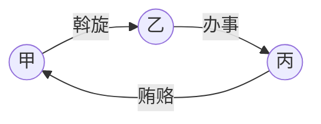

## 一、贪污贿赂与渎职犯罪的共同结构

### （一）保护法益的基本分层

| 犯罪群 | 核心法益 | 判断功能 |
| --- | --- | --- |
| 贪污、挪用公款 | 公共财产、公款安全 + 职务行为廉洁性 | 区分非法占有、暂时挪用、单纯毁坏 |
| 受贿、行贿、影响力交易 | 职务行为不可收买性、职务行为公正性 | 判断财物与职务行为之间是否形成对价关系 |
| 巨额财产来源不明 | 国家工作人员职务行为廉洁性 | 在来源无法查明时提供补充性评价 |
| 渎职犯罪 | 国家机关公务的合法、公正、有效执行 | 判断职权行使或不履职是否造成重大损失 |

> [!tip] 复习抓手
> - 贪污贿赂犯罪先看“身份 + 职务便利 + 财物归属/对价关系”；
> - 渎职犯罪先看“国家机关工作人员 + 职责范围 + 损失结果”。

### （二）国家工作人员的认定

> [!tip] [[刑法#第九十三条]]
> 国家工作人员包括国家机关中从事公务的人员，以及以国家工作人员论的三类人员。

国家工作人员的四类来源：采**实际行为说**，而非编制说、身份说

1. **国家机关工作人员**。
	- 包括立法、行政、司法、监察、军事机关中从事公务的人员。
	- 乡镇以上中国共产党机关、人民政协机关中从事公务的人员，亦纳入国家机关工作人员。
	- 在依法行使国家行政管理职权的组织中从事公务，或受国家机关委托代表国家行使职权，或虽无编制但在国家机关中从事公务的人员，视为国家机关工作人员。
2. **国有公司、企业、事业单位、人民团体中从事公务的人员。**
	- 国有公司、企业原则上指==国家独资的==公司、企业。
	- 国有资本控股、参股公司中的管理人员，不能一律认定为国家工作人员；若系受国家委派==从事公务==，则可认定。
3. **国家机关、国有单位委派到非国有单位从事公务的人员。**
	- “从事公务”指`组织、领导、监督、管理等公共事务性`工作。
4. **其他依照法律从事公务的人员。**
	- 标准：实质上是否从事公务，是否具备公务活动所赋予的职权。
	- 典型包括==依法履职==的`人大代表`、`人民陪审员`，以及==协助（至少乡镇一级的）政府从事行政管理工作==的`村委会、居委会等基层组织人员`。

> [!caution] 公司企业场景
> - 国有企业中从事公务的人员、国有企业委派到非国有单位从事公务的人员，属于第93条意义上的国家工作人员。
> - 经国有公司提名或批准，代表国有公司在国有控股、参股公司中从事管理工作的人员，可按司法解释认定为国家工作人员。
> - 受国家单位委托管理、经营国有财产的人员，**仅在贪污罪中**因[[刑法#第三百八十二条|第382条第2款]]拟制进入贪污罪主体范围。

### （三）职务便利的宽窄差异

| 罪名                                | “利用职务便利”的范围                                              | 重点                     |
| --------------------------------- | -------------------------------------------------------- | ---------------------- |
| [[VIII 贪污贿赂与渎职犯罪#二、贪污罪\|贪污罪]]     | 利用本人主管、管理、经营、经手公共财物的权力及方便条件；<br>也包括利用有隶属关系的其他国家工作人员的职务便利 | 范围较窄，要求现实支配、决定或支配具体支配人 |
| [[VIII 贪污贿赂与渎职犯罪#三、挪用公款罪\|挪用公款罪]] | 利用职务便利实施挪用公款行为                                           | “使用”不是构成要件要素           |
| [[VIII 贪污贿赂与渎职犯罪#六、受贿罪\|受贿罪]]     | 利用本人主管、负责、承办公共事务的职权；<br>也包括利用有隶属、制约关系的其他国家工作人员职权         | 范围较宽，制约关系也可纳入          |
| 斡旋受贿                              | 利用本人职权或者地位形成的便利条件                                        | 不是直接职务便利，而是影响力与工作联系    |

> [!caution] 贪污与受贿的职务便利
> 贪污罪的职务便利围绕公共财物支配展开；受贿罪的职务便利围绕为请托人谋取利益的职权影响展开，因而包含隶属、制约关系。

---

## 二、贪污罪

> [!quote] [[刑法#第三百八十二条]]
> 贪污罪的基本结构是：国家工作人员利用职务上的便利，侵吞、窃取、骗取或者以其他手段非法占有公共财物。

> [!quote] [[刑法#第三百八十三条]]
> 贪污罪处罚按数额、情节分档，并规定多次贪污未经处理的累计处罚、提起公诉前供述退赃的从宽、终身监禁等制度。

### （一）保护法益

- 公共财产。
- 职务行为的廉洁性。

### （二）行为主体

1. 国家工作人员。
2. 受国家机关、国有公司、企业、事业单位、人民团体委托管理、经营国有财产的人员。
	- [[刑法#第三百八十二条|第382条第2款]]属于法律拟制。
	- 这类委托人员不能当然成为挪用公款罪、受贿罪主体。
3. 通过伪造国家机关公文、证件担任国家工作人员的人。
4. 与贪污罪主体勾结、伙同贪污的无身份者，以共犯论处。

### （三）行为方式

贪污罪的实行行为是：[[VIII 贪污贿赂与渎职犯罪#（三）职务便利的宽窄差异|利用职务上的便利]]，侵吞、窃取、骗取或者以其他手段非法占有公共财物。

#### 1. 利用职务上的便利

- **正面**：必须利用`主管、管理、经营、经手`（控制）公共财物的权力及方便条件。
	- **反面**：单纯熟悉单位情况、容易接近作案目标、获取内部消息，**不属于**贪污罪意义上的职务便利。
- 只有现实地对公共财物享有支配权、决定权，或对具体支配财物的人员处于领导、指示、支配地位，才可认定利用职务便利。

> [!example] 保洁窃金案
> 仅因工作机会接近财物，而未利用主管、管理、经营、经手公共财物的职权，不宜认定为贪污罪。

#### 2. 侵吞、窃取、骗取或者其他非法占有手段

| 方式   | 含义                        | 案例        |
| ---- | ------------------------- | --------- |
| 侵吞   | 将单位所有、自己依职权占有的财物变成自己所有    | 检疫割肉案     |
| 窃取   | 将自己没有单独占有的公共财物转移为自己占有     | 分管虎符案[^2] |
| 骗取   | 通过欺骗使有处分权者陷入错误并处分公共财物     | 经理做账案     |
| 其他手段 | 其他非法占有公共财物的手段，不包括单纯毁坏公共财物 |           |

国家工作人员在国内公务活动或对外交往中接受礼物，依规定应交公而不交公、数额较大的，依[[刑法#第三百九十四条|第394条]]按贪污罪处罚；该条属于注意规定。

#### 3. 公共财物

> [!tip] [[刑法#第九十一条]]
> 公共财产包括国有财产、劳动群众集体所有财产、用于扶贫和其他公益事业的社会捐助或者专项基金财产；国家机关、国有公司、企业、集体企业和人民团体管理、使用或者运输中的私人财产，以公共财产论。

- 不要求单位对公共财物的占有具有合法性。【贪污回扣案[^3]】
- 应收账款等财产性利益可以成为贪污对象。【经理平账案[^4]】

### （四）责任要素

- 故意。
- 非法占有目的。

区分重点：

| 情形 | 处理 |
| --- | --- |
| 有归还意愿，缺乏排除意思 | 可能成立挪用公款罪 |
| 单纯毁坏公共财物，缺乏利用意思 | 可能成立故意毁坏财物罪 |
| 挪出时有归还意思，后产生非法占有目的 | 转化为贪污罪处理 |

### （五）罪名关系

> [!tip] 贪污的构造
>贪污=利用职务便利+侵占/盗窃/诈骗

1. 贪污罪与侵占罪、盗窃罪、诈骗罪、职务侵占罪是特别关系。
	- 未达到贪污罪数额起点，但达到相应财产犯罪数额起点的，可转向普通财产犯罪评价。
2. 贪污罪与私分国有资产罪的界限：

| 维度 | 贪污罪 | 私分国有资产罪 |
| --- | --- | --- |
| 决定方式 | 私自侵吞或少数人共同侵吞 | 经单位集体研究决定 |
| 分配对象 | 少数人或个人 | 单位全体成员或多数成员 |
| 行为方式 | 通常秘密 | 通常公开 |
| 财务处理 | 不做账或做假账 | 一般如实做账 |

### （六）共同犯罪

公司、企业或者其他单位人员与国家工作人员共同非法占有单位财物时，先看利用了谁的职务便利：

| 情形                             | 定性                           |
| ------------------------------ | ---------------------------- |
| 利用国家工作人员职务便利，共同非法占有公共财物        | 贪污罪共犯                        |
| 利用公司、企业或其他单位人员职务便利，共同非法占有本单位财物 | 职务侵占罪共犯                      |
| 双方分别利用各自职务便利，共同非法占有本单位财物       | 司法解释采主犯性质定罪；不能分清主从犯的，可按贪污罪追究 |

> [!tip] 有力见解
> 对无国家工作人员身份者，可理解为贪污罪共犯与职务侵占罪正犯的想象竞合；对国家工作人员则以贪污罪正犯论处。

### （七）处罚提示

- 贪污数额按个人应承担责任的数额计算，而非分赃数额。
- 多次贪污未经处理的，按照累计贪污数额处罚。
	- “未经处理”指既未受刑罚处罚，也未受行政处理。
- 提起公诉前如实供述、真诚悔罪、积极退赃并避免、减少损害结果的，可以从宽。
- 数额特别巨大并使国家和人民利益遭受特别重大损失的，可能适用无期徒刑、死刑；死缓减为无期徒刑后可同时决定终身监禁。

---

## 三、挪用公款罪

> [!tip] [[刑法#第三百八十四条]]
> 挪用公款罪处罚国家工作人员利用职务便利，挪用公款归个人使用，进行非法活动、营利活动，或数额较大超过三个月未还的行为。

### （一）保护法益

- 公款的安全。
- 职务行为的廉洁性。

### （二）行为主体

- 国家工作人员。
- 包括协助人民政府从事行政管理工作时的基层组织人员。
- 与主体勾结、伙同挪用公款的，以共犯论处。
- 不包括[[刑法#第三百八十二条|第382条第2款]]的委托类人员；此类人员可转向[[VII 财产犯罪之二#六、挪用资金罪|挪用资金罪]]。

### （三）行为对象：公款

- 公款不限于现金，也包括金融凭证、有价证券等。
- 单位固定资产等其他公物一般不属于公款。
- 挪用救灾、抢险、防汛、优抚、扶贫、移民、救济款物归个人使用的，从重处罚。
	- 法律拟制（针对「物」的部分）+注意规定（针对「款」的部分）

> [!question] 特定款物的规范位置
> [[刑法#第三百八十四条|第384条第2款]]规定“从重处罚”的特定款物场景，与[[刑法#第二百七十三条|挪用特定款物罪]]存在衔接：国家工作人员作为直接责任人员挪用特定款物但非归个人使用时，可成立挪用特定款物罪。

### （四）行为内容

> 非营超期 355

| 类型    | 构成结构                        | 数额提示       |
| ----- | --------------------------- | ---------- |
| 非法活动型 | 挪用公款归个人使用，进行非法活动            | 司法解释提示：3万元 |
| 营利活动型 | 挪用公款数额较大，进行营利活动             | 司法解释提示：5万元 |
| 超期未还型 | 挪用公款进行其他活动，数额较大，**超过3个月未还** | 司法解释提示：5万元 |

#### 1. 挪而未用

- “使用”不是本罪构成要件要素。
	- 挪而未用，也可成立挪用。
	- 仅参与使用的，不成立承继的共犯。
- 挪用后使用行为另构成犯罪的，可能数罪并罚。
- 公款未脱离单位控制的，不宜认定为挪用。

> [!example] 公账互转案
> 公款仍处于单位控制体系内，未脱离单位，不宜直接认定为挪用公款。

#### 2. 归个人使用

> [!danger] 重要
> “公款归个人使用”的情形包括：
> 
> 1. 将公款供本人、亲友或其他自然人使用。
> 2. 以个人名义将公款供其他单位使用。
> 3. 个人决定`以单位名义`将公款供其他单位使用，**谋取个人利益**。

判断规则：

- 使用人、名义人、谋利人其中任何一个是自然人的，属于“归个人使用”。
- “个人”相对于单位、集体而言，少数人利益也可评价为个人利益。
- 个人利益包括正当利益、不正当利益、财产性利益与具体实际的非财产性利益。【违规决议案】
- 2026年《贪污贿赂司法解释（二）》第9条提示：通过虚构付款事由、单位应收账款不入账等逃避监管方式，将公款提供给其他单位使用的，属于“以个人名义将公款供其他单位使用”。

### （五）责任形式

- **故意**。
- “不退还”指因客观原因不能退还。
- 若主观上不想还，具有非法占有目的，转向贪污罪。
- 挪出时有归还意思，之后产生非法占有目的不想归还的，转化为贪污。
- 查不清是否具有归还意思时，存疑有利被告：不能成立贪污罪，但可成立挪用公款罪。

> [!note] 数额巨大不退还
> 2026年《贪污贿赂司法解释（二）》第10条将“数额巨大不退还”限定为因客观原因在提起公诉前不能退还；办案机关依职权追回的，可以不认定为“不退还”，但量刑时区分其与自行退还。

### （六）认定与罪数

1. 公款用途按客观使用性质认定。
2. 非法活动具有营利性质时，可评价为营利活动数额；非法活动或营利活动数额，也可评价为其他活动数额。
3. 3个月内归还的数额，不计入“超过3个月未还”的挪用数额。
4. 使用人与挪用人共谋、指使或参与策划取得挪用款的，以挪用公款罪共犯论处。
5. 行为人受骗挪用公款的，不影响挪用公款罪认定。
	1. 识破骗局后仍然挪用公款并出街的。行为人成立贪污罪，收款人成立诈骗罪未遂。
6. 因挪用公款索取、收受贿赂构成犯罪的，数罪并罚。
7. 挪用公款进行非法活动构成其他犯罪的：
   - 若挪用行为与非法活动是独立两个行为，数罪并罚。
   - 若只有一个行为，按想象竞合处理。

> [!example] 挪款行贿案、挪款贩毒案
> 明知他人使用公款进行非法活动仍挪用给他人使用的，独立两个行为时数罪并罚；单一行为同时触犯两罪时按想象竞合处理。

### （七）挪用公款罪与挪用资金罪

| 维度 | 挪用公款罪 | 挪用资金罪 |
| --- | --- | --- |
| 主体 | 国家工作人员 | 公司、企业或者其他单位工作人员 |
| 对象 | 公款 | 本单位资金 |
| 行为结构 | 利用职务便利，挪用公款归个人使用，进行非法活动、营利活动或超期未还 | 利用职务便利，挪用本单位资金归个人使用或借贷给他人 |
| 从宽规则 | 无对应提起公诉前退还减免规则 | 提起公诉前退还的，可以从轻或减轻；犯罪较轻的，可减轻或免除 |

---

## 四、巨额财产来源不明罪与隐瞒境外存款罪

> [!quote] [[刑法#第三百九十五条]]
> 国家工作人员财产、支出明显超过合法收入，差额巨大，经责令说明来源而不能说明的，差额部分以非法所得论；国家工作人员境外存款应申报而隐瞒不报、数额较大的，另构成隐瞒境外存款罪。

### （一）保护法益与主体

- **保护法益**：国家工作人员职务行为的廉洁性。
- **主体**：国家工作人员。
- 必须是在职的国家工作人员；离职后发现巨额财产来源不明的，不能追究本罪刑事责任。
- 其他人员没有说明巨额财产来源的义务。

### （二）行为内容

本罪是**纯正不作为犯**，结构为：

1. 财产、支出明显超过合法收入。
2. 差额巨大。
3. 有关机关责令说明来源。
4. 行为人不能说明其来源。
	- “不能说明来源”包括：
		- 拒不说明财产来源。
		- 无法说明财产具体来源。
		- 所称来源经查证不属实。
		- 所称来源因线索不具体等原因无法查实，但能排除来源合法的可能性和合理性。

> [!caution] “不能说明来源”的限制解释
> 若行为人说明财产来源于一般违法行为，并按一般违法行为证明标准查证属实，不能认定本罪；若说明来源于犯罪行为，但按犯罪证明标准不能查证属实，仍可认定本罪。
> - 此处更准确地说，是“不能说明合法来源”。

### （三）补充性与溯及力

- **本罪是补充性罪行**；只有在没有证据证明巨额财产来源于其他犯罪时，才以本罪处罚。
- 查明来源是贪污、受贿所得的，按贪污罪、受贿罪追究。
- 部分来源查明为贪污、受贿，部分来源不明且数额巨大的，应数罪并罚。
- 构成本罪并判决后，事后查明来源的，原判决仍维持；来源于犯罪的，再按非法来源性质定罪。
- 差额部分以非法所得论并追缴；后续查明来源于犯罪行为时，对违法所得不能重复追缴。

---

## 五、贿赂犯罪图谱

### （一）对向关系

| 行贿方 | 受领或影响对象 | 对应罪名 |
| --- | --- | --- |
| 自然人 | 国家工作人员 | 行贿罪 - 受贿罪 |
| 单位 | 国家工作人员 | 单位行贿罪 - 受贿罪 |
| 自然人 | 国家机关等单位 | 对单位行贿罪 - 单位受贿罪 |
| 单位 | 国家机关等单位 | 对单位行贿罪 - 单位受贿罪 |
| 自然人或单位 | 特定关系人、离职国家工作人员等 | 对有影响力的人行贿罪 - 利用影响力受贿罪 |
| 中介撮合 | 国家工作人员与请托人 | 介绍贿赂罪 |

### （二）贿赂犯罪的核心问题

1. 财物是否属于贿赂。
2. 财物与职务行为之间是否形成对价关系。
3. 索取与收受在“为他人谋取利益”上的要求是否不同。
4. 特定关系人、离职人员、介绍人是否进入单独罪名或共同犯罪。
5. 贿赂与渎职、枉法裁判等其他犯罪发生牵连时，适用数罪并罚还是从一重罪。

---

## 六、受贿罪

> [!quote] [[刑法#第三百八十五条]]
> 受贿罪包括国家工作人员利用职务便利索取他人财物，或者非法收受他人财物、为他人谋取利益。

> [!quote] [[刑法#第三百八十六条]]
> 受贿罪处罚依照贪污罪处罚规定；索贿从重处罚。

### （一）保护法益

课堂列示的主要学说：

- 公正性说。
- ==信赖保护说==。
- 职务行为不可收买性说。
- 职务的不可谋私利说。

复习上以“职务行为不可收买性 + 职务行为公正性”把握对价关系最稳妥。

> [!tip] 场景中具体把握学说差异
> - 正当职务场景：沪上阿姨原本就中标了，仍然向招标主任行贿请求中标-->公正性说❌
> - 慈善活动场景：要求投标商捐给慈善基金但不用给招标主任-->不可谋私说❌
> - 虚假许诺场景：拿钱不办事-->不可收买性说❌
> - 信息差场景：职务行为没有被收买，本该向校长行贿却向教务处行贿，而校长早已合规按流程办好

### （二）行为主体

- 国家工作人员。
	- 包括国有公司、企业或其他国有单位中从事公务的人员，以及国有单位委派到非国有单位从事公务的人员。
	- 包括国有金融机构工作人员及其委派到非国有金融机构从事公务的人员。
	- 不包括[[刑法#第三百八十二条|第382条第2款]]委托类主体；此类主体可成立非国家工作人员受贿罪。
- 无身份者与有身份者伙同受贿的，以受贿罪共犯论处。

### （三）事后受贿

重要

2007年《办理受贿刑事案件适用法律若干问题的意见》第10条确立两类事后受贿：

1. 利用职务便利为请托人谋取利益之前或之后，约定离职后收受财物，并在离职后实际收受的，以受贿论处。
2. 利用职务便利为请托人谋取利益，离职前后连续收受财物的，离职前后收受部分均计入受贿数额。

区分：

| 情形                       | 定性     |
| ------------------------ | ------ |
| 在职或离退休前约定，离退休后收受         | 受贿罪    |
| 履职时未被请托，在职时事后基于该履职事由收受财物 | 受贿罪    |
| 履职时未被请托，退休或离职后偶然给钱[^6]   | 不成立受贿罪 |

### （四）行为方式

利用职务上的便利，索取他人财物的，或者非法收他人财物的，为他人谋取利益的。

#### 1. 贿赂

贿赂是国家工作人员`职务行为`的`不正当报酬`。

- 包括具有价值且可以管理的有体物、无体物以及财产性利益。
- 包括可用金钱计量的物质性利益。
- 不包括：
	- 提升职务、迁移户口、升学就业、提供女色等非物质性利益。
	- 提供服务本身不属于贿赂。

> [!example] 案例辨析
>【精装房屋案❌】【报团旅游案✅】【嫖娼请客案✅】【洗脚充卡案✅】【代写论文案❌】【58 同城案[^7]❌】【赠送毒品案✅】【海淘簧漫案✅】
>- 关键：看是否进入市场，可否被市场价格评价

#### 2. 利用职务上的便利

受贿罪的职务便利包括：

1. 利用本人`主管、负责、承办`**公共事务**的职权。
2. 利用有`隶属、制约关系`的**其他国家工作人员**职权。
3. 单位领导通过`不属自己主管的下级部门国家工作人员`为他人谋利的，也可认定。
4. **财物与职务行为**有关（形成`对价关系`），即可认定利用职务便利。
5. **职务行为**包括合法职务行为，也包括与职务有关的超越、滥用职务行为。

受贿罪利用职务便利的界定宽于[[VIII 贪污贿赂与渎职犯罪#1. 利用职务上的便利|贪污罪]]，因为职务便利

> [!note] 制约关系
> 制约关系**不要求**`直接上下级或主管关系`，可结合任职单位性质、职能、职务、制度安排、政策影响、实践惯例等判断。【中国人民银行分行——商业银行行长】【主管对外交流的副校长——教务处处长】

> [!caution] 非公共事务
>1. **医疗机构的医务人员**利用`开处方的职务便利`，以各种名义非法收收药代财物，为医药产品销售方谋取利益。成立非国家工作人员受贿罪
>2. 学校及其他教育机构中的**教师**利用`教学活动的职务便利`，以各种名义非法收受教材、教具、校服或者其他物品销售方财物，为上述物品销售方谋取利益，成立非国家工作人员受贿罪。

#### 3. 受贿行为

| 类型   | 构成要求                     | 重点                     |
| ---- | ------------------------ | ---------------------- |
| 索取贿赂 | 主动索取财物                   | **不要求**实际为他人谋利[^8]     |
| 收受贿赂 | 被动收受财物 + 为他人谋取利益         | 谋利**只要有**`许诺`即可        |
| 单纯受贿 | 经济往来中违反国家规定收受回扣、手续费归个人所有 | [[刑法#第三百八十五条第385条第2款]] |

> [!tip] 为他人谋取利益的阶段、认定：只要有许诺即可
> “为他人谋取利益”包括**承诺**、**实施**、**实现**三个阶段，具有其中之一即可。司法解释提示以下情形应认定为为他人谋取**利益**：
> 
> - 【明示许诺】实际或承诺为他人谋取利益。
> - 【默示许诺】明知他人有具体请托事项。
> - 【事后受财】履职时未被请托，但事后基于该履职事由收受财物。
> - 【感情投资】国家工作人员索取收受`具有上下级关系的下属`（下级）或者`具有行政管理关系的被管理人员`（老百姓）的财务价值三万元以上，可能影响职权行使的，视为承诺为他人谋取利益
>>[!note] 利益可以是不正当利益，当然也可以是==正当利益==
>>【行贿求款案】工程队通过行贿向校长请求拖欠的工程款，是正当利益

> [!caution] 足以入罪的「许诺」可以是虚假的
> 许诺可以真实，也可以虚假。虚假许诺成立受贿罪的关键，是**许诺内容与国家工作人员职务行为相关联**，并导致财物与许诺职务行为之间形成对价关系。

#### 4. 第三人、特定关系人与变相受贿

索取或收受贿赂**不限于**`本人直接占有`，也包括使请托人`向第三人提供财物`。第三人典型为**特定关系人**，即与国家工作人员有`近亲属`、`情妇（夫）`以及**其他共同利益关系**的人。

常见变相受贿：

| 类型       | 对象或利益           | 数额认定                       |
| -------- | --------------- | -------------------------- |
| 挂名领薪     | 特定关系人不实际工作而领取薪酬 | 行贿人支付的个人所得税不计入             |
| 交易型受贿    | 不合理低买高卖的差价      | 市场价格-实际支付价格                |
| 干股型受贿    | 未出资而获得股份        | 已转让按股份价值；未转让按实际获利          |
| 合作投资型受贿  | 请托人出资或虚假合作利润    | 出资额或无实际出资参与管理下的利润          |
| 理财型受贿    | 委托投资收益          | 未出资按收益额；出资但收益畸高按$\Delta$差额 |
| 赌博型受贿    | 通过赌博方式输送财物      | 结合背景、场合、次数、赌资来源、通谋与输赢情况    |
| 借款、借用型受贿 | 以借为名索取或收受       | 综合借款事由、去向、关系、归还意思、能力、原因    |

### （五）主观故意与及时退还

- [[VIII 贪污贿赂与渎职犯罪#4. 第三人、特定关系人与变相受贿|特定关系人]]索取、收受他人财物，`国家工作人员`**知道**后未退还或上交的，应认定==具有受贿故意==。
- **收受请托人财物**后及时`退还`或`上交`的，==不是受贿==。
	- 例外：因本人或关联人、事被查处，为掩饰犯罪而退还或上交的，不影响受贿罪认定。
- **索取贿赂后**退还或上交，仍成立受贿罪。

### （六）斡旋受贿

极端重要

> [!quote] [[刑法#第三百八十八条]]
> 国家工作人员利用本人职权或者地位形成的便利条件，通过其他国家工作人员职务上的行为，为请托人==谋取不正当利益==[^9]，索取或收受财物的，以受贿论处。




斡旋受贿**不是独立罪名**，仍定**受贿罪**。

成立条件：

1. **主体条件**：双方均为==国家工作人员==。
2. **行为条件**：行为人利用本人职权或者地位形成的便利条件。
3. **结果条件**：无论索贿还是收受财物，均必须为请托人谋取==不正当利益==。

与普通受贿的区别：

| 类型   | 利用基础                            | 谋利要求               | 其他                 |
| ---- | ------------------------------- | ------------------ | ------------------ |
| 普通受贿 | **本人**职务便利，或**隶属、制约关系**下的职权     | 索贿不要求谋利；<br>收受要求谋利 |                    |
| 斡旋受贿 | **本人**`职权或地位`形成的`便利条件、影响力、工作联系` | 必须谋取**不正当利益**      | 不要求斡旋相对人认识到行为人索贿受贿 |

> [!note] 仅要求行为人「承诺」实施斡旋行为
> 收受财物并向请托人承诺通过其他国家工作人员职务行为谋取不正当利益的，适用斡旋受贿；明知有不正当具体请托事项而收受财物的，视为承诺。是否向其他国家工作人员转达请托事项，不影响认定。

### （七）既遂、罪数与共同犯罪

- **既遂标准**：国家工作人员或其指定对象**实际取得**对贿赂的==支配==时。【尚未过户案❌】【定期存折案❌】【活期存折案✅】
	- 是否`实际使用贿赂`、是否`已经着手谋利`、是否`实际谋得利益`，均**不影响既遂认定**。【投身慈善案】【回赠巨款案】
- **原则**：因受贿而实施的为他人谋取利益行为构成其他犯罪的，除特别规定外，数罪并罚。
	- `受贿+其他犯罪=数罪并罚`
	- **例外**：徇私枉法罪、民事行政枉法裁判罪、执行判决裁定失职罪、执行判决裁定滥用职权罪与受贿罪，依[[刑法#第三百九十九条|第399条第4款]]==从一重罪处罚==。

共同犯罪判断：

| 参与者                                         | 成立受贿罪共犯的条件                                             |
| ------------------------------------------- | ------------------------------------------------------ |
| [[VIII 贪污贿赂与渎职犯罪#4. 第三人、特定关系人与变相受贿\|特定关系人]] | 与国家工作人员通谋 + 共同实施受贿罪实行行为                                |
| 非特定关系人                                      | 通谋 + 共同实施实行行为 + 共同占有财物                                 |
| 公司、企业人员                                     | 若利用国家工作人员职务便利为他人谋利，以受贿罪追究；若利用非国家工作人员职务便利，以非国家工作人员受贿罪追究 |

### （八）处罚

1. 受贿数额是指**个人应当承担责任的数额**，而**不是分赃数额**
2. 在提起公诉前如实供述自己罪行、真诚悔罪、积极退赃，避免、减少损害结果的发生的。可以从亲处罚
3. 索贿的从重处罚
4. 单位名义、个人占有的，单位犯罪

---

## 七、利用影响力受贿罪

> [!quote] 《刑法》第388条之一
> 利用影响力受贿罪针对`国家工作人员近亲属`、`关系密切人`、`离职国家工作人员`及其`关系密切人`，利用影响力为请托人谋取==不正当利益==并索取、收受财物的行为。

### （一）行为主体与行为方式

|   类别   |         主体          |                      行为方式                      |
| :----: | :-----------------: | :--------------------------------------------: |
|  领导家属  |  国家工作人员近亲属或其他关系密切人  |           通过该国家工作人员职务行为，<br>或通过其斡旋行为           |
|  退休干部  |      离职国家工作人员       | **直接利用**`原职权或地位`形成的便利条件（靠山吃山）<br>或通过其他国家工作人员斡旋 |
| 退休干部家属 | 离职国家工作人员近亲属或其他关系密切人 |          利用离职国家工作人员原职权或地位，<br>或通过其斡旋           |

共同要求：为请托人谋取**不正当利益**[^10]，索取或收受财物。

### （二）影响力与关系密切

- 只要存在密切关系，均可认定为利用影响力。
- 关系密切，指与国家工作人员或离职国家工作人员具有共同利益关系。

> [!example] **退休老干案**  
> - **案情推敲**：退休老干部甲收受丙的贿赂，声称“现任市长乙是我一手提拔上来的，我当然能把事办了”。后甲通过乙的职务行为，为丙谋取了不正当利益。  
> - **定性判断**：甲构成**利用影响力受贿罪**。  
> - **理由**：甲属于“离职的国家工作人员”，其利用原职权或地位形成的便利条件，通过现任市长乙（国家工作人员）的职务行为，为请托人谋取不正当利益并收受财物，符合《刑法》第三百八十八条之一第二款之规定。

> [!example] **退休教授案**  
> - **案情推敲**：退休教授甲的学生是某市法院院长。丙因亲友涉案，请托甲帮忙“捞人”。甲通过其学生（法院院长）的职务行为，使丙的亲友获得不正当的从宽处理。  
> - **定性判断**：甲构成**利用影响力受贿罪**。  
> - **理由**：甲属于“与国家工作人员关系密切的人”（师生关系）。其利用原职权、地位形成的便利条件或密切关系，通过其学生（国家工作人员）的职务行为谋取不正当利益，符合《刑法》第三百八十八条之一第一款或第二款之规定。

> [!example] **远洋捞人案**  
>-  **案情推敲**：北京教育局长甲受丙请托，前往海口“捞人”。甲请求其大学同学——海口公安局长帮忙。海口公安局长基于同学情谊，利用职权为丙的亲友办理了取保候审。  
> - **定性判断**：甲构成**利用影响力受贿罪**。  
>-  **理由**：甲虽为国家工作人员，但其与海口公安局长系同学关系，属于“关系密切的人”。甲未利用本人职权或地位形成的便利条件（北京教育局长的职权对海口公安事务无直接影响），而是利用私人密切关系产生的影响力，通过其他国家工作人员的职务行为谋取不正当利益。当行为人主要利用的是非职务性的密切关系时，应认定为利用影响力受贿罪（《刑法》第三百八十八条之一第一款）。

> [!example] **索要工程款案**  
> - **案情推敲**：丙的工程款被A市长期拖欠，请托A市教育局局长甲帮忙要回。甲利用其在A市的职务影响，协调A市财政局等相关部门，最终为丙要回了工程款。丙为表感谢，送给甲财物。  
> - **定性判断**：甲无罪。  
> - **理由**：甲作为A市教育局局长，属于国家工作人员。其利用本人职权或地位形成的便利条件（同属A市党政系统，存在工作联系与影响力），通过其他国家工作人员（如财政局）的职务行为，为请托人谋取利益并收受财物，符合《刑法》第三百八十八条关于斡旋受贿的规定。但是，**请托人谋取的是正当利益**。因此甲无罪

---

## 八、行贿犯罪

### （一）行贿罪

> [!quote] [[刑法#第三百八十九条]]
> 为==谋取不正当利益==，给予国家工作人员以财物的，是行贿罪；因被勒索给予财物，没有获得不正当利益的，不是行贿。

#### 1. 行为方式

- 为谋取**不正当利益**，给予国家工作人员财物。
	- **不正当利益**：包括任何性质、任何形式的不正当利益，也包括`机会上的不正当利益`。
- 行贿人实际上是否取得不正当利益，不影响本罪成立。

#### 2. 出罪事由

因被**勒索**[^11]给予国家工作人员财物，且**没有获得不正当利益**的，==不是行贿==。

| 要素        | 含义                              |
| --------- | ------------------------------- |
| 勒索        | 受贿罪中的索取                         |
| 没有获得不正当利益 | 没有获得由勒索者利用职务谋取的不正当利益，而非没有获得任何利益 |

> [!caution] 对向犯不必然同时成立
> 行贿罪与受贿罪是对向犯，但并不意味着两罪必然同时成立
> 
> 行贿人反复要求国家工作人员接受财物的，不同时成立受贿罪教唆犯。

#### 3. 商业行贿

- 经济往来中违反国家规定给予国家工作人员财物，数额较大，或给予各种名义的回扣、手续费的，以行贿论处；该规定属于注意规定。

#### 4. 既遂与罪数

- 构成行贿罪仍以“**为谋取不正当利益**”为前提。
- **既遂标准**：国家工作人员`客观上接收、占有财物`时。
	- 国家工作人员事后退回财物或及时上交，不影响行贿罪既遂。
- **罪数**：
	- 行贿人谋取不正当利益的行为构成犯罪的，与行贿罪数罪并罚。
	- 国家工作人员不以个人占有为目的，利用职务便利，用公共财物向他人行贿，同时构成行贿罪和渎职犯罪的，数罪并罚。

#### 4. 处罚

- 多次行贿未经处理的，累计行贿数额。
- 被追诉前主动交代行贿行为的，可以从轻或减轻；犯罪较轻、对侦破重大案件起关键作用或有重大立功表现的，可以减轻或免除。
- 《刑法修正案（十二）》增加七类从重处罚情形：多次或向多人行贿、国家工作人员行贿、重点工程重大项目行贿、为职务职级晋升调整行贿、向监察行政执法司法工作人员行贿、在生态环境等重点领域行贿并实施违法犯罪、将违法所得用于行贿。

### （二）对有影响力的人行贿罪

> [!quote] 《刑法》第390条之一
> 对有影响力的人行贿罪处罚为谋取不正当利益，向国家工作人员近亲属、关系密切人、离职国家工作人员及其关系密切人行贿的行为。

行为对象：

1. 国家工作人员近亲属或其他关系密切人。
2. 离职国家工作人员。
3. 离职国家工作人员近亲属或其他关系密切人。

与行贿罪的关系：

| 财物交付对象与认识 | 行贿人定性 |
| --- | --- |
| 交付特定关系人，特定关系人仅成立利用影响力受贿罪，国家工作人员不成立受贿罪 | 对有影响力的人行贿罪 |
| 特定关系人与国家工作人员构成受贿罪共犯，但行贿人不认识该共犯事实 | 对有影响力的人行贿罪 |
| 特定关系人与国家工作人员构成受贿罪共犯，行贿人明知该事实 | 行贿罪 |

### （三）介绍贿赂罪

> [!quote] [[刑法#第三百九十二条]]
> 介绍贿赂罪处罚向国家工作人员介绍贿赂，情节严重的行为。

“介绍贿赂”是指在请托人和国家工作人员之间`沟通关系、撮合条件`，使贿赂行为得以实现。

与斡旋受贿的关系：

- 行为人**未收受财物**，仅单纯向其他国家工作人员介绍请托人。
- **未参与**其他国家工作人员与请托人之间`具体权钱交易过程`。


2026年《贪污贿赂司法解释（二）》第17条提示：

| 情形 | 处理 |
| --- | --- |
| 介绍贿赂，又与请托人或国家工作人员共同实施行贿、受贿 | 同时构成介绍贿赂罪与行贿或受贿共犯的，按处罚较重规定定罪 |
| 介绍过程中，在国家工作人员不知情下收受请托人财物占为己有 | 符合条件的，定利用影响力受贿罪 |
| 在国家工作人员不知情下截留部分财物占为己有，同时构成其他犯罪 | 利用影响力受贿罪与其他犯罪数罪并罚 |
| 虚构与国家工作人员关系密切事实，骗取请托人财物 | 诈骗罪 |

---

## 九、渎职犯罪概述

### （一）共同法益

国家机关公务的合法、公正、有效执行。

### （二）行为主体

国家机关工作人员。

> [!quote] [[刑法#第九十四条]]
> 司法工作人员，是指有侦查、检察、审判、监管职责的工作人员。

渎职犯罪主体要点：

1. 真正身份犯：国家机关工作人员
	1. 例外：
2. 自然人犯罪。
3. 国家机关工作人员包括依法行使行政管理职权的组织中从事公务的人员、受国家机关委托代表国家机关行使职权的人员、虽未列入编制但在国家机关中从事公务的人员。
4. 是否以合法途径获得国家机关工作人员身份，不影响认定。
5. 单位以“集体决策”形式实施渎职犯罪时，追究相关自然人刑事责任。

### （三）罪数关系

- [[刑法#第三百九十七条|第397条]]滥用职权罪、玩忽职守罪是渎职犯罪一般规定。
- [[刑法#第三百九十八条|第398条]]至[[刑法#第四百一十九条|第419条]]为渎职犯罪特别规定。
- `渎职`并`收受贿赂`的，原则上以`渎职犯罪`和`受贿罪`**数罪并罚**。
	- 例外：`徇私枉法罪`、`民事行政枉法裁判罪`、`执行判决裁定失职罪`、`执行判决裁定滥用职权罪`与`受贿罪`，按[[刑法#第三百九十九条|第399条第4款]]从一重罪处罚。

---

## 十、滥用职权罪与玩忽职守罪

> [!quote] [[刑法#第三百九十七条]]
> 国家机关工作人员滥用职权或者玩忽职守，致使公共财产、国家和人民利益遭受重大损失的，成立本组犯罪；徇私舞弊的，法定刑升格。

### （一）行为方式

| 罪名    | 行为方式                                        | 判断重点                    |
| ----- | ------------------------------------------- | ----------------------- |
| 滥用职权罪 | 就属于国家机关工作人员一般职务权限的事项，以行使职权外观实施实质、具体的违法或不当行为 | 越权、擅权、弃权：有职权外观，但行使违法或不当 |
| 玩忽职守罪 | 国家机关工作人员严重不负责任，不履行职责或不正确履行职责                | 严重不负责任：不履职或错误履职         |

> [!caution] 职务权限关联
> 若行为与一般职务权限或职责没有任何关系，不属于滥用职权或玩忽职守。

### （二）责任形式

- **滥用职权罪**：故意犯罪。
- **玩忽职守罪**：过失犯罪。
- **客观的超过要素**：“`致使公共财产、国家和人民利益遭受重大损失`”属于客观的超过要素，不要求行为人对重大损失有主观认识。

```
客观的超过要素：
主观: ～～～|···?···|
客观: -------------|
主客观不需要完全统一，客观部分凸出来了一截是主观上不要求认识到的
```

### （三）罪数

- 徇私舞弊犯滥用职权罪、玩忽职守罪的，适用[[刑法#第三百九十七条|第397条第2款]]法定刑升格。
- 本法另有特别规定的，依特别规定处理。

---

## 十一、徇私枉法罪

> [!quote] [[刑法#第三百九十九条]]
> 司法工作人员徇私枉法、徇情枉法，对明知无罪的人使其受追诉、对明知有罪的人故意包庇不使其受追诉，或者在刑事审判活动中故意违背事实和法律作枉法裁判的，成立徇私枉法罪。

### （一）法益

- 刑事追诉活动的正当性。
- 公民自由与权利。

### （二）行为主体

司法工作人员，是真正身份犯。

- 具有`侦查`、`检察`、`审判`、`监管`职责的工作人员。
- 只有具体承办案件和指示、指挥承办案件的司法工作人员，才能成为本罪直接正犯或间接正犯。
- 有国家机关工作人员身份但不具备本罪身份者，可在成立滥用职权罪正犯的同时，构成本罪共犯。

> [!example] 县长指示案
> 不具有司法工作人员身份的国家机关工作人员指示司法工作人员枉法处理案件时，可能同时涉及滥用职权罪正犯与徇私枉法罪共犯的评价。

### （三）行为方式

1. 对明知是无罪的人而使其受追诉。
	- “追诉”指以追究刑事责任为目的进行`立案`、`侦查`、`起诉`、`审判`活动。
2. 对明知是有罪的人而故意包庇不使其受追诉。
3. 在**刑事审判活动**中故意违背事实和法律，作出枉法裁判或决定。
	- 包括附带民事诉讼

### （四）责任形式

- 故意。
- 徇私、徇情动机。

> [!question] 过失枉法
> 过失导致枉法结果时，不成立徇私枉法罪；应转向玩忽职守、执行判决裁定失职等可能罪名分析。

### （五）罪数

司法工作人员收受贿赂，有[[刑法#第三百九十九条|第399条]]前3款行为，同时又构成受贿罪的，依第399条第4款**从一重罪处罚**。

1. 先徇私枉法等，后收受财物的，应数罪并罚。
2. 索取贿赂后有徇私枉法等行为的，应数罪并罚。
3. 收受贿赂后实施其他犯罪的，应数罪并罚。

> [!caution] 第399条第4款的适用范围
> 从一重罪处理的前提，是收受贿赂与第399条前3款行为之间具有规范所要求的牵连关系；并非所有“受贿 + 其他犯罪”都从一重。

---

## 十二、复习对照表

### （一）贪污、挪用、受贿的核心差异

| 罪名 | 保护重点 | 行为对象 | 职务便利 | 主观核心 | 易混界限 |
| --- | --- | --- | --- | --- | --- |
| 贪污罪 | 公共财产 + 廉洁性 | 公共财物 | 公共财物支配便利 | 非法占有目的 | 挪用公款、职务侵占、普通财产犯罪 |
| 挪用公款罪 | 公款安全 + 廉洁性 | 公款 | 挪用公款便利 | 暂时挪用故意 | 贪污罪、挪用资金罪、挪用特定款物罪 |
| 受贿罪 | 职务不可收买性 | 贿赂 | 职务行为或隶属、制约关系 | 权钱交易故意 | 非国家工作人员受贿、利用影响力受贿、借款借用 |

### （二）贿赂类犯罪速判

| 事实结构                       | 优先考虑                        |
| -------------------------- | --------------------------- |
| 国家工作人员直接收钱办事               | 受贿罪                         |
| 国家工作人员亲属收钱，通过国家工作人员或其影响力办事 | 利用影响力受贿罪；若与国家工作人员通谋，可能转受贿共犯 |
| 离职国家工作人员收钱，利用原职权影响办事       | 利用影响力受贿罪                    |
| 行为人向国家工作人员送钱谋取不正当利益        | 行贿罪                         |
| 行为人向特定关系人、离职人员送钱谋取不正当利益    | 对有影响力的人行贿罪                  |
| 中介撮合权钱交易，未共同实施行贿或受贿        | 介绍贿赂罪                       |

### （三）渎职犯罪速判

| 问题 | 判断 |
| --- | --- |
| 主体是否为国家机关工作人员 | 决定能否进入第397条一般渎职犯罪 |
| 行为是否与一般职务权限或职责有关 | 无关则排除滥用职权、玩忽职守 |
| 行为是违法行使还是不履职、错误履职 | 前者偏滥用职权，后者偏玩忽职守 |
| 是否有特别渎职罪名 | 特别规定优先 |
| 是否同时收受贿赂 | 原则数罪并罚；第399条第4款等特别规则例外 |

### （四）注意规定与法律拟制

| 条文或规则 | 类型 | 处理意义 |
| --- | --- | --- |
| [[刑法#第三百八十二条|第382条第2款]]受委托管理、经营国有财产人员以贪污论 | 法律拟制 | 仅在贪污罪中扩张主体，不能推到挪用公款罪、受贿罪 |
| [[刑法#第三百九十四条|第394条]]应交公礼物不交公按贪污处罚 | 注意规定 | 即使无该条，符合贪污构造时仍可按贪污评价 |
| [[刑法#第三百八十四条|第384条第2款]]挪用特定款物归个人使用从重 | 注意规定倾向 | 强调特定款物场景的从重评价，与挪用特定款物罪衔接 |
| [[刑法#第三百九十九条|第399条第4款]]特定枉法类犯罪与受贿从一重罪 | 法律拟制 | 改变通常“受贿 + 其他犯罪”数罪并罚的处理 |

> [!tip] 案例涵摄顺序
> 先定身份，再定职务便利；先看财物、款项或贿赂的规范性质，再看非法占有、暂时挪用或权钱交易；最后处理共同犯罪、罪数和特别规定。

[^1]: 保洁由于易于接近作案目标，窃听财务所悉知的密码，盗窃公司保险柜中的金条。

[^2]: 会计和出纳分别持有两把保险柜的钥匙，必须同时使用才能打开。

[^3]: 张三贪污单位通过贪污形成的资金池，以贪污论处

[^4]: 张三欠国有公司 100 万元，李四作为公司老总，告诉张三”给我 50 万，免除你欠款“，张三欣然接受。
	李四犯贪污罪，手段是侵占，侵占公司 100 万应收账款的债权。50 万以受贿罪评价。

[^5]:

---

## 九、本讲复习抓手

- 贪污、挪用公款、受贿先查国家工作人员身份，再查职务便利与财物关系。
- 受贿罪原则上不要求实际办成事；收钱后的渎职行为通常与受贿罪数罪并罚，第 399 条第 4 款是重要例外。
- 斡旋受贿与利用影响力受贿的分界在于行为人是否具有国家工作人员身份及其影响力来源。

[^6]: 为什么：没有事先约定，隔隙无法被弥补，且欠缺法定身份-->无罪

[^7]: 灵岛，我帮你儿子找个大厂的工作。

[^8]: 注意：非国家工作人员受贿罪针对索贿行为方式的，要求实际为他人谋取利益，这点严格于受贿罪

[^9]: 为什么这里要求是「不正当利益」而普通受贿只要求「利益」（包括正当）：因为针对国家工作人员之间的关系时，还额外侵犯国家机关工作人员的公正性

[^10]: 为什么这里又要求不正当利益：因为这里是三方关系

[^11]: =索取≠敲诈勒索罪的勒索
