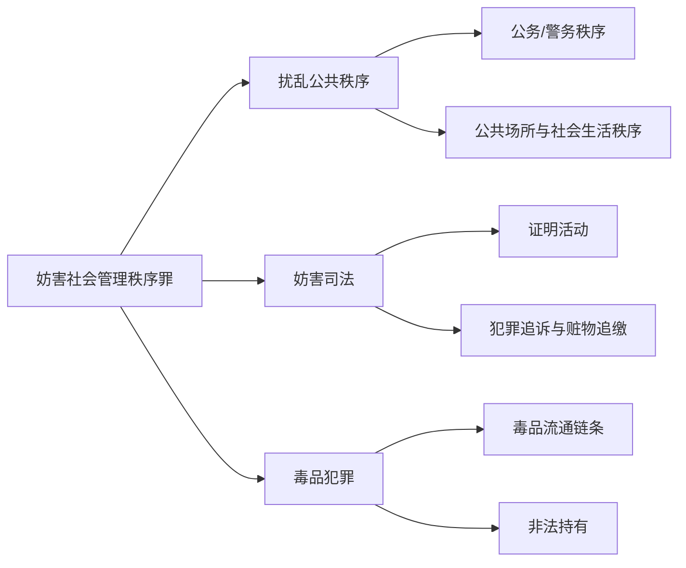

# 一、第六章的体系位置

妨害社会管理秩序罪位于刑法分则第六章，法条范围为第277条至第367条。PPT列明本章共有九节，但本讲重点集中在扰乱公共秩序罪、妨害司法罪以及毒品犯罪中的高频罪名。

| 讲义板块 | PPT重点罪名 | 核心秩序/法益 | 复习重心 |
| --- | --- | --- | --- |
| 扰乱公共秩序罪 | 妨害公务罪、袭警罪、招摇撞骗罪、高空抛物罪、聚众斗殴罪、寻衅滋事罪、组织领导参加黑社会性质组织罪 | 公务活动、公共场所秩序、社会生活秩序 | 行为对象、行为方式、法条竞合、法律拟制 |
| 妨害司法罪 | 伪证罪、辩护人/诉讼代理人毁灭证据等罪、妨害作证罪、帮助毁灭伪造证据罪、窝藏包庇罪、掩饰隐瞒犯罪所得罪 | 司法活动的客观公正性、刑事追诉秩序 | 主体身份、诉讼阶段、期待可能性、事前通谋 |
| 毒品犯罪 | 走私贩卖运输制造毒品罪、非法持有毒品罪 | 国家毒品管制秩序 | 行为类型、代购/居间介绍、运输范围、制造未遂与不能犯 |

> [!tip] 本章解释抓手
> 先确定被保护的秩序类型，再判断行为是否具有足以扰乱该秩序的现实危险或实害。多个罪名交叉时，优先检查法条竞合、想象竞合、法律拟制与注意规定。

---

# 二、扰乱公共秩序罪

## （一）妨害公务罪

### 1. 条文结构

第277条第1至4款规定妨害公务罪，基本结构为：

| 行为对象 | 行为方式 | 结果/危险要求 |
| --- | --- | --- |
| 国家机关工作人员依法执行职务 | 暴力、威胁方法阻碍 | 足以阻碍即可，属于具体危险犯 |
| 人大代表依法执行代表职务 | 暴力、威胁方法阻碍 | 同上 |
| 自然灾害、突发事件中的红十字会工作人员依法履责 | 暴力、威胁方法阻碍 | 同上 |
| 国家安全机关、公安机关执行国家安全工作任务 | 故意阻碍；可以未使用暴力、威胁 | 造成严重后果 |

### 2. 行为对象

* “国家机关工作人员”不包括军人执行职务场景；阻碍军人执行职务的，适用第368条阻碍军人执行职务罪。
* 聚众阻碍国家机关工作人员解救被收买的妇女、儿童的，首要分子适用第242条聚众阻碍解救被收买的妇女、儿童罪；其他参与者使用暴力、威胁方法的，可以成立妨害公务罪。
* “正在”包括正在执行或即将执行职务；“即将”要求无需额外准备即可执行职务，公务执行完毕后的打击报复不成立本罪。
* “依法”要求实体合法与程序合法：实体上须有执行该职务的具体权限，程序上须满足法定手续。职务行为合法性的判断采行为时客观说；若行为时具备先行拘留等法定条件，即使事后证明抓错人，通常仍不否定职务行为合法性。

### 3. 行为方式

* 暴力为广义暴力，包括对人、对物行使不法有形力；但法条只列“暴力、威胁”，没有“等方法”。
* 设置路障、撕毁封条、挪走警戒标志、以自杀自残相对抗，PPT均列为不构成妨害公务罪的例子。
* 不要求公务客观上已经被阻碍，足以阻碍依法执行职务即可。
* 针对国家安全机关、公安机关执行国家安全工作任务的第二类情形，未使用暴力、威胁方法时须造成严重后果；使用暴力、威胁但没有造成严重后果的，仍可回到第一类构造评价。

### 4. 责任形式与期待可能性

* 本罪为故意犯罪，要求明知国家机关工作人员正在依法执行职务。
* 误以为国家机关工作人员违法执行公务而阻碍的，欠缺本罪故意。
* 职务行为相对方的一般摆脱、挣脱等轻微抗拒行为，因缺乏期待可能性，不成立妨害公务罪。

### 5. 罪数

| 场景 | 处理 |
| --- | --- |
| 先前行为已构成犯罪，国家机关工作人员依法查处时又以暴力、威胁妨害公务 | 原则上数罪并罚 |
| 妨害公务所用暴力致人伤亡 | 与故意伤害罪等想象竞合，从一重罪 |
| 抢夺依法执行职务的司法工作人员枪支 | 妨害公务罪与抢夺枪支罪想象竞合 |
| 走私、贩卖、运输、制造毒品中以暴力抗拒检查、拘留、逮捕且情节严重 | 属第347条加重情节，属于毒品犯罪与暴力型妨害公务的结合犯，不再并罚妨害公务罪 |
| 走私、贩卖、运输、制造毒品中仅以威胁方法抗拒检查 | 法条没有特别结合规定，回到一般罪数规则，原则上数罪并罚 |
| 组织、运送他人偷越国（边）境中以暴力、威胁方法抗拒检查 | 属相应罪名加重情节；若杀害、伤害检查人员，则数罪并罚 |

---

## （二）袭警罪

袭警罪规定于第277条第5款，是妨害公务罪的特别法条；成立袭警罪以行为符合妨害公务罪的基本构造为前提。

### 1. 行为对象：正在依法执行职务的人民警察

* 人民警察包括公安机关、国家安全机关、监狱等部门的人民警察，以及法院、检察院司法警察。
* 辅警单独不能成为袭警罪对象。2025年《袭警解释》第8条区分两种情形：
  * 暴力袭击正在依法配合人民警察执行职务的警务辅助人员，不构成袭警罪；符合第277条第1款的，以妨害公务罪处理。
  * 同时暴力袭击正在依法执行职务的人民警察和配合执行职务的辅警，符合第277条第5款的，以袭警罪从重处罚。
* 非工作时间遇有紧急情况依法履职的人民警察，可以成为袭警罪对象；对非执行职务的人民警察实施报复性暴力袭击，不构成袭警罪，而应按故意伤害罪、故意杀人罪等处理。
* “正在”包括与警察职务执行具有紧迫性、紧密性、连续性的准备活动和收尾活动，例如出警途中、执行完毕归队途中。

### 2. 行为方式

| 类型 | 构成要求 | 反面排除 |
| --- | --- | --- |
| 基本犯 | 暴力袭击正在依法执行职务的人民警察 | 威胁手段阻碍警察依法执行职务，成立妨害公务罪 |
| 加重犯 | 使用枪支、管制刀具，或以驾驶机动车撞击等手段，严重危及警察人身安全 | 不能仅以是否实际受伤或伤害程度判断 |

暴力袭击包括：

* 直接针对警察身体的对人暴力，如撕咬、掌掴、踢打、抱摔、投掷物品，造成轻微伤以上后果的。
* 以物为媒介的对人暴力，如打砸、毁坏、抢夺人民警察乘坐车辆、使用警械，且该对物行为一经实现便足以危及警察人身安全。
* 单纯对物暴力不属于袭警罪行为方式；例如只砸毁停放路边的警车、警械，未通过该物作用于警察身体的，应回到妨害公务、故意毁坏财物等罪名判断。
* 与人民警察发生轻微肢体冲突，为摆脱抓捕、约束实施甩手、挣脱、蹬腿等一般抗拒，危害不大的，不属于“暴力袭击”。

> [!caution] 依法执行职务与执法过错
> 2025年《袭警解释》第4条第2款提示：人民警察执法活动存在严重过错的，对行为人一般不作为犯罪处理；执法过错较大且袭击暴力程度较轻、危害不大的，可以不作为犯罪处理；造成严重后果确需追责的，应依法从宽。

### 3. 罪数

* 袭警罪与妨害公务罪为法条竞合关系，成立袭警罪即排斥妨害公务罪。
* “袭警+轻伤”按袭警罪从重处罚，可理解为袭警与轻伤结果的结合评价，不另定故意伤害罪。
* 暴力袭警同时构成故意伤害罪（重伤）、故意杀人罪、过失致人重伤/死亡罪的，想象竞合，从一重罪。
* 以驾驶机动车撞击方式危及多数人或不特定人人身安全的，与以危险方法危害公共安全罪想象竞合，从一重罪。

---

## （三）招摇撞骗罪

### 1. 行为方式

招摇撞骗罪的行为结构为“冒充国家机关工作人员 + 招摇撞骗”。

* 冒充包括：
  * 非国家机关工作人员冒充国家机关工作人员。
  * 离职人员冒充在职国家机关工作人员。
  * 此种国家机关工作人员冒充彼种国家机关工作人员。
  * 职务低者冒充职务高者，或者职务高者冒充职务低者。
  * 冒充已被撤销国家机关的工作人员，但足以使一般人信以为真。
* 招摇，是以假冒身份对不特定人炫耀、引人注意。
* 撞骗，是找机会行骗，骗取财物、荣誉、地位、待遇、感情等，不要求实际骗得利益。

> [!caution] 不属于“招摇撞骗”的情形
> 假冒国家机关工作人员给他人好处、单纯声称自己是国家机关工作人员、为恋爱或结婚仅向对方声称自己是国家机关工作人员，通常不属于“招摇”。冒充国家机关工作人员实施其他违法犯罪但未通过身份骗取财物、荣誉、待遇等利益的，不当然成立本罪。冒充国家机关工作人员近亲属，不属于冒充国家机关工作人员，骗取财物时通常按诈骗罪处理。

### 2. 罪数

* 冒充人民警察招摇撞骗的，依第279条从重处罚。
* 冒充军人招摇撞骗的，适用第372条冒充军人招摇撞骗罪。
* 冒充国家机关工作人员骗取数额较大、巨大或特别巨大财物的，成立招摇撞骗罪与诈骗罪的想象竞合，从一重罪。

---

## （四）高空抛物罪

### 1. 保护法益与行为方式

* 保护法益为高空管理秩序，而非公共安全或卫生环境；法定最高刑较低，决定其不能被解释成公共安全犯罪的替代条款。
* 高空管理秩序可还原为对生命、身体法益的保护；熄灭烟头、纸屑等不足以扰乱该管理秩序的轻微抛掷，不宜入罪。
* 行为方式争点为“向高空抛物”还是“在高空抛物”。PPT倾向从法条文字“从建筑物或者其他高空”采“在高空抛物”；从一楼向五楼、从山脚向半山腰抛物，不宜解释为本罪。

### 2. 与相关犯罪的关系

第291条之二第2款规定：“有前款行为，同时构成其他犯罪的，依照处罚较重的规定定罪处罚。”

| 行为后果/危险 | 罪名处理 |
| --- | --- |
| 达到与放火、爆炸等同等程度，严重危及公共安全 | 以危险方法危害公共安全罪；未造成严重后果适用第114条，造成重伤、死亡或重大财产损失适用第115条第1款 |
| 造成死亡、重伤 | 按主观内容定故意杀人罪、故意伤害罪、过失致人死亡罪或过失致人重伤罪 |
| 未造成死亡、重伤，但具有致人死伤具体危险且有杀伤故意 | 故意杀人罪未遂或故意伤害罪未遂 |
| 仅违反禁止高空抛物的社会管理秩序 | 高空抛物罪 |

---

## （五）聚众斗殴罪

### 1. 性质

* 必要的共犯，但不要求斗殴各方均为3人以上；3打2时，3人一方可成立聚众斗殴，2打2双方原则上均不成立。若双方事前约定斗殴，即使人数呈3比1、2比2，也可从整体上评价为聚集多人斗殴。
* “众”包括未达责任年龄、不具有责任能力的人；是否处罚另行判断。
* 单一行为犯：“聚众”只是“斗殴”的方式。若约定多人斗殴但尚在赴约途中即被查获，按单一行为犯观点，只能评价为聚众斗殴罪的预备。
* 本罪为故意犯罪，不要求各方均有斗殴故意；对有斗殴故意的一方论处即可。

### 2. 处罚对象

本罪只处罚首要分子和其他积极参加者。首要分子是起组织、策划、指挥作用的犯罪分子。

### 3. 聚众斗殴致人重伤、死亡

第292条第2款规定，聚众斗殴致人重伤、死亡的，依第234条、第232条定故意伤害罪、故意杀人罪。PPT明确其性质为法律拟制。

* 该拟制可将过失致重伤、死亡评价为故意伤害、故意杀人。
* 斗殴行为致本方成员重伤、死亡的，也适用本款，偶然防卫除外。
* PPT采部分转化说：只对首要分子和直接造成重伤、死亡的积极参加者适用；不能查明原因时，只能对首要分子适用。
* 一般参加者或旁观者致人重伤、死亡的，不适用本款。
* 参与斗殴者以杀人故意杀害他人的，直接适用第232条；杀人之外的斗殴行为构成聚众斗殴罪的，数罪并罚。首要分子是否对该杀人结果负责，取决于结果归属：其知情、放任、提供高强度杀伤工具或其他贡献时可归责；若超出斗殴计划且首要分子不知情、无贡献，则不当然负责。

### 4. 法定刑升格条件

| 升格条件 | 解释 |
| --- | --- |
| 多次聚众斗殴 | 次数型加重 |
| 聚众斗殴人数多、规模大、社会影响恶劣 | 规模与社会影响加重 |
| 在公共场所或交通要道聚众斗殴，造成社会秩序严重混乱 | 场所与结果加重 |
| 持械聚众斗殴 | 只对持械一方中对持械有认识者适用；“持械”指使用或显示凶器殴斗，不是单纯携带；斗殴中夺取对方凶器后使用或显示的，夺取方也可构成持械聚众斗殴 |

> [!caution] 聚众斗殴与正当防卫
> 聚众斗殴并非绝对排斥正当防卫。一般互殴可理解为双方放弃部分身体法益保护；但生命法益、重大身体法益不能放弃。斗殴即将结束或力量对比明显悬殊时，一方突然“武器升级”使用重大杀伤力工具的，弱势方仍可能成立正当防卫。

---

## （六）寻衅滋事罪

### 1. 四种行为类型

| 行为类型 | 成立要点 |
| --- | --- |
| 随意殴打他人，情节恶劣 | “随意”指理由、对象、方式明显异常，以犯罪人视角也难以接受其殴打行为 |
| 追逐、拦截、辱骂、恐吓他人，情节恶劣 | 注意与侮辱罪、故意伤害罪等想象竞合 |
| 强拿硬要或任意损毁、占用公私财物，情节严重 | 财物包括财产性利益，结果不限于财产损失 |
| 在公共场所起哄闹事，造成公共场所秩序严重混乱 | 公共场所为不特定人或多数人身体可自由出入的场所，是功能性概念；须结合场所用途、行为内容和秩序影响判断 |

“起哄闹事”要求具有煽动性、蔓延性、扩展性，单纯影响公共场所局部活动通常不足。公共场所的功能性判断具有入罪限制作用：广场跳舞、殡仪馆停放棺木通常符合场所功能；反向放置则可能扰乱场所秩序。缠访、滥访、越级上访认定为起哄闹事应极为审慎，尤其要区分公共场所中表达意见与扰乱公共场所秩序。

### 2. 信息网络空间争议

PPT指出，2013年“两高”诽谤案件解释将网络空间中的起哄闹事纳入寻衅滋事罪，受到刑法学界猛烈批判。理由是信息网络空间并非公共场所，公共秩序不等于公共场所秩序；将“公共场所”扩张为“公共空间”、将“公共场所秩序”扩张为“公共秩序”，都有类推解释风险。《刑法修正案（九）》增设编造、故意传播虚假信息罪后，可视情形适用第291条之一，而非继续扩张寻衅滋事罪；课堂倾向认为与新罪明显抵触的旧司法解释条款说服力极弱。

### 3. 责任形式与流氓动机

* 肯定说（通说/司法解释观点）：除故意外，要求寻求刺激、发泄情绪、逞强耍横等流氓动机。
* 否定说（张明楷教授）：不要求流氓动机。
* PPT引用车浩教授观点：流氓动机的必要性有助于限缩寻衅滋事罪。其核心不是保留“流氓”这种模糊标签，而是用主观动机把本罪限定在足以使公众产生恐惧或不安全感的滋扰性行为，避免把普通纠纷、权利表达或低危害行为装入本罪。

### 4. 罪数与升格

* 与故意伤害罪、侮辱罪、敲诈勒索罪、抢劫罪、故意毁坏财物罪、聚众哄抢罪、聚众扰乱公共场所秩序罪等可形成想象竞合。
* 纠集他人多次实施寻衅滋事行为，严重破坏社会秩序的，适用第293条第2款升格法定刑。

---

## （七）组织、领导、参加黑社会性质组织罪

黑社会性质组织应同时具备四项特征，PPT标注为“重点·牢记”。

| 特征 | 内容 |
| --- | --- |
| 组织特征 | 形成较稳定的犯罪组织，人数较多，有明确的组织者、领导者，骨干成员基本固定 |
| 经济特征 | 有组织地通过违法犯罪活动或者其他手段获取经济利益，具有一定经济实力，以支持组织活动 |
| 行为特征 | 以暴力、威胁或者其他手段，有组织地多次进行违法犯罪活动，为非作恶，欺压、残害群众 |
| 非法控制/危害性特征 | 通过违法犯罪活动，或利用国家工作人员包庇、纵容，称霸一方，在一定区域或行业内形成非法控制或重大影响，严重破坏经济、社会生活秩序 |

### 1. 与相邻概念

* 黑社会性质组织不同于黑社会组织；境外黑社会组织人员到境内发展组织成员的，成立入境发展黑社会组织罪。
* 黑社会性质组织不同于恶势力组织。恶势力组织尚未形成黑社会性质组织，但经常纠集在一起，多次实施违法犯罪活动，为非作恶、欺压群众，造成较恶劣社会影响。
* “软暴力”属于行为特征中的“其他手段”，表现为滋扰、纠缠、哄闹、聚众造势、摆场架势示威、拦路闹事、恶意举报、破坏生活设施等足以形成心理强制或影响正常生活经营的违法犯罪手段。
* “软暴力”本身是犯罪学概括，不是可直接涵摄的规范构成要件术语；案例分析时应还原为暴力、胁迫或者法条中的“其他手段”。

### 2. 罪数与处罚

* 组织、领导、参加本身即为犯罪；又实施其他犯罪的，依第294条第4款数罪并罚。
* 组织者、领导者按照其所组织、领导的黑社会性质组织所犯的全部罪行处罚。
* “组织所犯的全部罪行”不等于“成员所犯的全部罪行”：成员行为超出组织计划、共同决议或概括故意的，由成员个人负责，组织者、领导者不当然负责。
* 组织者、领导者是否在具体犯罪中承担主犯责任，应结合其在具体犯罪中的地位、作用判断；不能因其组织身份自动认定为每个具体犯罪的主犯。

---

# 三、妨害司法罪

## （一）伪证罪

### 1. 构成结构

| 要素 | 内容 |
| --- | --- |
| 诉讼阶段 | 广义刑事诉讼过程中，课堂以立案为刑事诉讼起点；立案前虚假告发或虚假鉴定意图使人受刑事追究的，原则上转向诬告陷害罪 |
| 行为主体 | 证人、鉴定人、记录人、翻译人；“证人”包括被害人 |
| 行为对象 | 与案件有重要关系的情节 |
| 行为方式 | 故意作虚假证明、鉴定、记录、翻译 |
| 责任要素 | 故意 + 陷害他人或隐匿罪证的意图 |

### 2. 主体与期待可能性

* 犯罪嫌疑人、被告人不构成本罪的直接正犯，也不成立本罪的间接正犯、教唆犯、帮助犯，理由为缺乏期待可能性。
* 同案犯供述违背事实，将责任推给其他同案犯的，因缺乏期待可能性，不构成伪证罪；违背事实将责任全部包揽给自己的，构成伪证罪。
* 近亲属以隐匿罪证意图作伪证的，因缺乏期待可能性不成立伪证罪；以陷害近亲属意图作伪证的，成立伪证罪。

### 3. “虚假”与重要关系

* 单纯保持沉默而拒不作证，不能认定为“作虚假证明”。
* “虚假”的含义采客观说倾向：证言违反证人记忆但符合客观事实的，不认定为本罪。
* 只要足以影响案件实体结论或程序结论即可，不要求实际上影响结论；对自首、立功等法定量刑情节作伪证，也可成立本罪。

### 4. 罪数

* 证人按照办案人员要求作伪证的，对证人一般不以伪证罪论处；办案人员构成伪证罪教唆犯与徇私枉法罪正犯的想象竞合。
* 【张氏叔侄案】^[课堂用作“狱侦耳目”例子：在侦查人员指使下由同监人员编造证据，推动错误定罪。复习功能在于说明公权力指使下证人作伪证的期待可能性与办案人员罪数。]
* 先诬告陷害、后作伪证，PPT采数行为数法益、数罪并罚；少数观点认为目的同一，成立牵连犯，按诬告陷害罪一罪论处。

---

## （二）辩护人、诉讼代理人毁灭证据、伪造证据、妨害作证罪

### 1. 主体

本罪为纯正身份犯，主体限于刑事诉讼中的辩护人、诉讼代理人。

### 2. 行为方式

* 毁灭、伪造证据：
  * 包括隐藏作为证据的物体、变造证据；这里的证据限于作为物的证据，隐藏证人本人不属于毁灭、伪造证据，应转向妨害作证罪等判断。
  * 证据包括当事人是否构成犯罪的证据，也包括自首、立功等法定量刑情节证据。
  * 伪造证据但未提交给公安、司法、监察机关的，只是本罪预备。
* 帮助当事人毁灭、伪造证据：
  * 不是共犯意义上的帮助，包括参与当事人的毁灭、伪造证据行为、为了当事人利益毁灭伪造证据、唆使当事人毁灭伪造证据。
* 威胁、引诱证人违背事实改变证言或者作伪证：
  * “证人”不限于狭义证人，包括被害人、鉴定人、翻译人。
  * 引诱犯罪嫌疑人、被告人违背事实改变供述的，不应以本罪论处；但其作为他人犯罪的证人时除外。

> [!caution] 失实证据
> 辩护人、诉讼代理人提供、出示、引用的证人证言或其他证据失实，但并非有意伪造的，不属于伪造证据。

---

## （三）妨害作证罪

### 1. 行为方式

* 以暴力、威胁、贿买等方法阻止证人作证，或者指使他人作伪证。
* 不限于刑事诉讼，民事、行政诉讼中实施也可成立本罪；限定说认为这会造成“作伪证者本身不犯罪、指使者反而犯罪”的体系不协调。
* “证人”不限于狭义证人，包括被害人、鉴定人、翻译人。
* 方法不限于暴力、威胁、贿买，也包括唆使、嘱托、请求、引诱等。本罪可理解为将伪证罪的部分教唆犯正犯化。
* 发生时间不限，可在终审判决前，也可在终审判决后为了启动审判监督程序而指使他人作伪证。

### 2. 犯罪嫌疑人、被告人与共犯人

| 场景 | 处理 |
| --- | --- |
| 犯罪嫌疑人、被告人以一般嘱托、请求、引诱等方法阻止证人作证或指使作伪证 | 部分肯定说认为缺乏期待可能性，不以本罪论处 |
| 犯罪嫌疑人、被告人以暴力、威胁、贿买等方法实施 | 不缺乏期待可能性，可认定本罪 |
| 共犯人阻止同案犯供述或指使虚假供述 | 同案犯供述对其他共犯而言属于证人证言，分析逻辑同上 |

### 3. 既未遂与罪数

* 本罪不是抽象危险犯；客观上确实阻止证人作证或使他人作伪证的，才成立既遂。证人仍作证或他人未作伪证的，属于未遂。
* 辩护人、诉讼代理人威胁、引诱证人作伪证的，成立第306条犯罪；证人作伪证的，成立伪证罪；二者在伪证罪范围内可成立共同犯罪。
* 辩护人、诉讼代理人的行为不构成第306条犯罪时，仍可能构成本罪。
* 司法工作人员犯本罪的，从重处罚。

---

## （四）帮助毁灭、伪造证据罪

### 1. 行为对象

对象为有关他人诉讼案件的证据。

* 毁灭、伪造自己作为当事人的案件证据，因缺乏期待可能性，不成立本罪。
* 当事人教唆第三者为自己毁灭、伪造证据，第三者单独成立帮助毁灭、伪造证据罪；当事人本人不成立本罪教唆犯。
* 自己作为被告的刑事案件证据同时也是共犯人的证据时，关键看主观上为了谁毁灭、伪造：专为自己不成立，专为其他共犯人成立；若同时为了自己和共犯人，则需结合主要目的与证据指向谨慎判断期待可能性。
* 通说认为证据不限于刑事案件证据，民事、行政诉讼证据也可成为对象。

### 2. 行为方式

* “帮助”是一种正犯实行行为，不是帮助犯意义上的帮助。
* 毁灭包括隐匿等妨害证据显现、使证明价值减少或消失的行为。
* 伪造包括变造，即对真证据加工改变其证明价值。
* 不要求当事人的行为构成犯罪，只要当事人行为有犯罪嫌疑即可。
* 藏匿证人、迫使证人改变证言、杀害证人的，不认定为本罪，而根据主体不同分别成立妨害作证罪或第306条犯罪。

> [!tip] 当事人同意的效力
> 经当事人同意帮助毁灭有利证据、伪造不利证据：刑事诉讼中不阻却违法性，因为公共法益不能承诺；民事、行政诉讼中可阻却违法性，因为处分原则允许当事人自愿承担举证失败后果。

### 3. 罪数

辩护人、诉讼代理人指使他人帮助毁灭、伪造证据，或与他人共同帮助当事人毁灭、伪造证据的，辩护人、诉讼代理人成立第306条犯罪；他人成立帮助毁灭、伪造证据罪。两者只在帮助毁灭、伪造证据罪范围内形成共同犯罪。

---

## （五）窝藏、包庇罪

### 1. 行为对象：犯罪的人

* 包括作为犯罪嫌疑人而被或将被列为侦查、起诉对象的人。
* 包括实施符合构成要件的不法行为但未达责任年龄、不具有责任能力的人。
* 被窝藏、包庇的人归案后被宣告无罪的，应依法宣告窝藏、包庇者无罪。
* 包庇毒品犯罪分子的，适用第349条包庇毒品犯罪分子罪。
* 国家机关工作人员包庇、纵容黑社会性质组织的，适用第294条第3款。

### 2. 主体与期待可能性

* 犯罪的人自己窝藏、逃匿，因缺乏期待可能性，不构成本罪；也不构成本罪教唆犯、帮助犯。
* 共同犯罪人之间互相实施窝藏、包庇行为，不以窝藏、包庇罪论处；但对共同犯罪以外的犯罪人实施窝藏、包庇的，应以所犯共同犯罪和窝藏、包庇罪并罚。
* 犯罪人的近亲属实施窝藏、包庇，虽符合主体要求，但因缺乏期待可能性，不以本罪论处。

### 3. 行为方式

| 类型 | 内容 |
| --- | --- |
| 窝藏 | 为犯罪的人提供隐藏处所、财物，帮助其逃匿；既可作为，也可不作为 |
| 包庇 | 向公安、司法机关提供虚假证明，使犯罪的人逃避刑事追诉；只能作为 |

窝藏可包括提供房屋、车辆、船只、航空器、手机等通讯工具、金钱。保证人在取保候审期间协助逃匿，或明知藏匿地点、联系方式而拒绝提供的，可构成不作为窝藏。窝藏不要求顺应犯罪人的意愿，违背犯罪人自首意愿而强行提供隐藏处所的，也可成立窝藏。

> [!caution] 物质窝藏与精神帮助
> 窝藏限于提供处所、财物、通讯工具等物质帮助。单纯安抚、承诺照顾家属、精神鼓励逃匿等“精神窝藏”，原则上不属于窝藏罪实行行为。

包庇与伪证的分界在于刑事诉讼是否开始：刑事诉讼之外作假证明包庇犯罪人的，成立包庇罪；刑事诉讼中证人等虚假陈述、意图隐匿罪证的，成立伪证罪。包庇只能以作为方式实施，单纯知情不报、不提供证言原则上不成立包庇罪；故意顶替、向司法机关作虚假陈述或提供虚假证明，才是典型包庇。

### 4. 责任形式与罪数

* 故意 + 明知他人有罪。误认犯罪种类不影响“明知”认定；例如误以为抢劫犯只是抢夺犯而提供逃匿帮助，仍具备“明知他人犯罪”。
* 为帮助同一犯罪的人逃避刑事处罚，同时实施窝藏、包庇、洗钱、掩饰隐瞒犯罪所得、帮助毁灭证据、伪证行为的，属于“一条龙”逃避追诉服务，依处罚较重的犯罪定罪并从重处罚，不实行数罪并罚。
* 第310条第2款“犯前款罪，事前通谋的，以共同犯罪论处”属于注意规定；即使无该款，事前通谋、事后窝藏包庇者也可评价为本犯所犯罪的共犯。不要误读为“事前通谋 + 实际实施窝藏包庇”两项缺一不可；事前承诺本身已可能提供心理帮助，足以成立前罪共犯。

---

## （六）掩饰、隐瞒犯罪所得、犯罪所得收益罪

### 1. 构成结构

| 要素 | 内容 |
| --- | --- |
| 主体 | 本犯以外的自然人或单位 |
| 对象 | 犯罪所得及其产生的收益；不包括犯罪工具、组成犯罪行为之物 |
| 行为方式 | 窝藏、转移、收购、代为销售或以其他方法掩饰、隐瞒 |
| 主观 | 故意 + 明知是犯罪所得及其收益 |

### 2. 行为对象

* 犯罪所得，是通过犯罪取得的赃款、赃物或其他财产性利益。
* 犯罪所得收益，是通过犯罪所得获取的孳息等财产性利益。
* 行贿财物、赌博赌资等组成犯罪行为之物，不属于本罪对象；为毒品犯罪窝藏、转移、隐瞒毒品或毒赃的，另有特别法条。
* 本犯行为未达到司法解释要求数额的，不属于犯罪所得。
* 未达责任年龄、无责任能力者实施符合构成要件且违法的不法行为所得，也可属于“犯罪所得”。
* 只要本犯存在查证属实即可，不要求已对本犯作出裁判；本犯死亡不影响犯罪所得性质。

### 3. 赃物交易

| 场景 | 处理 |
| --- | --- |
| 本犯隐瞒真相向第三人出售赃物 | 对第三人成立诈骗罪 |
| 代为销售赃物者隐瞒真相向第三人出售 | 本罪与诈骗罪想象竞合 |
| 第三人明知是赃物而购买 | 第三人成立本罪，出售方不成立诈骗罪 |

> [!tip] 赃物交易抓手
> 买卖赃物时，总有一方可能成立犯罪。判断顺序是：第三人是否明知、出售者是否隐瞒赃物性质、行为人是否为本犯或本犯以外的人。课堂以民法上盗赃物不能善意取得为前提说明第三人财产损失：遗失物尚且通常不能由善意受让人终局取得，盗赃物更不宜善意取得。

### 4. “其他方法”与罪数

2025年两高解释列举的“其他方法”包括居间介绍买卖、收受、持有、使用、加工、提供资金账户、将财产转换为现金/金融票据/有价证券、转账或其他支付结算方式转移资金、跨境转移资产等。核心在于使司法机关难以发现、追缴赃物或分辨财物性质。

* 事前与盗窃、抢劫、诈骗、抢夺等行为人通谋，事后掩饰、隐瞒犯罪所得的，分别以前罪共犯论处；事前承诺本身即可形成心理帮助，不以事后实际掩饰、隐瞒为必要。
* 对犯罪所得及其收益实施盗窃、抢劫、诈骗、抢夺等行为，构成犯罪的，分别按相应财产犯罪定罪；非法占有仍可成为财产犯罪的保护对象，避免“黑吃黑”失控。
* 明知是犯罪所得及其收益而掩饰、隐瞒，同时构成其他犯罪的，依处罚较重规定定罪。
* 掩饰、隐瞒第191条洗钱罪上游犯罪所得及收益，同时构成洗钱罪与本罪的，存在司法解释表述差异。课堂倾向：修正案十一承认“自洗钱”后，洗钱罪与掩隐罪不再是单纯特别法与普通法关系，而更接近交叉关系；依2025年解释按处罚较重规定处理，更符合想象竞合结构。

---

# 四、毒品犯罪

## （一）走私、贩卖、运输、制造毒品罪

第347条属于个罪罪名与类罪罪名同名的条文。走私、贩卖、运输、制造毒品，无论数量多少，都应追究刑事责任。

### 1. 行为对象

毒品包括鸦片、海洛因、甲基苯丙胺、氯胺酮、MDMA片剂、神仙水、吗啡、大麻、可卡因，以及国家规定管制的其他能够使人形成瘾癖的麻醉药品和精神药品。

### 2. 四类行为

| 行为 | 核心定义 | 重点问题 |
| --- | --- | --- |
| 走私毒品 | 非法运输、携带、邮寄毒品进出国（边）境 | 内海、领海、界河、界湖运输、收购、贩卖毒品，以及直接向走私毒品者购买，视为走私毒品 |
| 贩卖毒品 | 有偿转让毒品 | 不要求牟利；不要求先买入再卖出；捡得、继承或既有毒品后出售也可成立；出于贩卖目的非法购买毒品，权威判例认定为既遂 |
| 运输毒品 | 在我国领域内转移毒品 | 宜限于与走私、贩卖、制造具有关联性的运输；单纯为吸食从外地购毒带回，不宜认定运输毒品 |
| 制造毒品 | 从无到有生产毒品、毒品种类转化、精制提纯、分装等 | 以是否具有制造出毒品的具体危险区分未遂与不能犯 |

### 3. 贩卖毒品的细分

* 将毒品作为有偿服务的对价交付，认定为贩卖毒品；“有偿服务”不以合法服务为限。
* 吸食者相互交换毒品，不属于贩卖毒品，可认定为非法持有毒品；但为调剂数量与种类而相互交易、补差价或具有交易属性的，应认定贩卖毒品罪。

#### 代购毒品

| 代购情形 | 处理 |
| --- | --- |
| 明知他人实施毒品犯罪而为其代购，未牟利 | 不认定贩卖毒品罪，以相关毒品犯罪共犯论处 |
| 代购者加价或变相加价牟利 | 以贩卖毒品罪定罪；变相加价包括私自截留购毒款、毒品，或超出正常交通食宿费用收取介绍费、劳务费等 |
| 为仅用于吸食的托购者从其事先联系的贩毒者处购买，并收取/截留少量毒品自吸 | 一般不以贩卖毒品罪论处 |
| 无证据证明明知他人实施毒品犯罪，未牟利，数量达到第348条最低标准 | 购买、存储被查获的，以非法持有毒品罪；因运输被查获的，一般以运输毒品罪 |
| 购毒者无明确托购意思表示，行为人收取毒资并提供毒品 | 一般以贩卖毒品罪 |

#### 居间介绍买卖毒品

* 居间介绍买卖毒品不是居中倒卖毒品。
* 居间介绍者处于中间人地位，发挥介绍联络作用，通常与交易一方构成共同犯罪，不以牟利为要件。
* 居中倒卖者是毒品交易主体，与上下家直接联系，自主决定数量、价格并赚取差价。

| 委托来源/主观认识 | 处理 |
| --- | --- |
| 受贩毒者委托，介绍贩卖毒品 | 与贩毒者构成贩卖毒品共同犯罪 |
| 明知购毒者以贩卖为目的购买，受其委托介绍贩毒者 | 与购毒者构成贩卖毒品共同犯罪 |
| 受以吸食为目的的购毒者委托，提供购毒信息或介绍认识贩毒者，数量达到非法持有标准 | 一般与购毒者构成非法持有毒品共同犯罪 |
| 同时与贩毒者、购毒者共谋，促成交易 | 与贩毒者构成贩卖毒品共同犯罪 |

居间介绍者通常可认定为从犯；实际超出居间地位、对交易发起和达成起重要作用的，可认定为主犯。

### 4. 有治疗作用的麻醉药品、精神药品

* 确有证据证明出于治疗疾病等相关目的，违反药品管理法规生产、进口、销售国家管制的麻醉药品、精神药品，构成妨害药品管理罪的，依法定罪处罚。课堂以“铁马冰河案”类事实提示：具有医疗用途的麻精药品案件，关键在于证据能否证明治疗目的、自用合理数量或互助自救性质。
* 出于治疗目的，未经许可经营具有医疗等合法用途的麻醉药品、精神药品的，不以毒品犯罪论处；情节严重构成其他犯罪的，通常按非法经营罪等处理。
* 带有自救、互助性质的上述行为，一般可不作为犯罪处理；确需追责的，应体现从宽。
* 因治疗疾病需要，在自用、合理数量范围内携带、寄递国家管制且具有医疗合法用途的麻醉药品、精神药品进出境的，不构成犯罪。

### 5. 运输与制造

* 运输毒品只要使毒品空间位置发生一定距离转移，即成立既遂，不要求送达计划目的地。
* 同行运输毒品的共犯判断，应综合明知、犯意联络、配合或掩护行为。
* 受雇于同一雇主同行运输但无共同故意、行为相对独立、按各自运输数量取酬的，不认定共同犯罪，各自承担责任；即使知道他人也受雇运输，只要行为相互独立、没有配合掩护，也不当然合并数量。
* 分段运输中，受雇者之间没有共谋、只是按安排交接毒品的，彼此通常不成立共同犯罪；雇主和组织、指挥者对整体运输成立共同犯罪。
* 制造毒品包括从无到有、此种转化为彼种、精制提纯、分装。制造未遂与不能犯的区分，以行为是否具有制造出毒品的具体危险为核心。eg.`阿司匹林加榆树叶不可能生成甲基苯丙胺，属于不能犯；真实制毒原料比例偶然拿错，通常仍有具体危险，属于未遂。`
* 为欺骗购毒者或逃避查缉而掺杂使假，通过物理方法溶解、混合、吸附，或自用目的少量添加其他物质、改变形态的，不认定为制造毒品。

### 6. 责任形式与罪数

* 必须明知行为对象是毒品；对毒品种类认识错误不影响故意认定。
* 不要求营利目的；低价出售、以毒品作为对价等，不影响贩卖/制造等行为的成立。
* 犯本罪又以暴力抗拒检查、拘留、逮捕，情节严重的，适用第347条最高一档法定刑，不再并罚妨害公务罪；若仅以威胁抗拒检查，仍按一般罪数规则处理。
* 利用、教唆未成年人走私、贩卖、运输、制造毒品，或者向未成年人出售毒品的，从重处罚；前段是对第29条的重申，不能重复从重。
* 明知他人利用麻醉药品、精神药品实施抢劫、强奸等犯罪仍向其贩卖，同时构成贩卖毒品罪和抢劫罪、强奸罪等的，依处罚较重规定定罪；其他符合数罪并罚条件的，数罪并罚。

---

## （二）非法持有毒品罪

### 1. 持有

持有毒品是对毒品进行事实上的管理或支配。明知持有的是毒品即可，不要求明知毒品具体种类。

### 2. 与第347条的关系

* 为吸食而持有毒品数量大的，成立非法持有毒品罪。“吸毒不是犯罪”只说明单纯吸食不入罪；为吸食而持有达到法定数量标准的毒品，仍可成立本罪。
* 因走私、贩卖、运输、制造毒品而非法持有毒品的，认定为第347条之罪，非法持有行为被前行为吸收，不再并罚。

---

# 五、本章易混点总表

| 易混问题 | 区分抓手 |
| --- | --- |
| 妨害公务罪 vs. 袭警罪 | 袭警罪对象限于正在依法执行职务的人民警察，方式限于暴力袭击；威胁阻碍警察执行职务回到妨害公务罪 |
| 袭警罪 vs. 故意伤害/杀人 | 轻伤按袭警罪从重；重伤、死亡或杀人故意场景，想象竞合从一重罪 |
| 高空抛物罪 vs. 以危险方法危害公共安全罪 | 是否达到与放火、爆炸同等程度并危及公共安全 |
| 聚众斗殴转化 | 第292条第2款为法律拟制，PPT采部分转化说 |
| 寻衅滋事网络扩张 | 网络空间不是当然的公共场所；虚假信息类行为优先检查第291条之一 |
| 伪证罪 vs. 包庇罪 | 刑事诉讼是否已经开始；诉讼中证人虚假陈述偏伪证，诉讼外作假证明偏包庇 |
| 妨害作证罪 vs. 帮助毁灭伪造证据罪 | 前者针对证人作证/作伪证，后者针对诉讼证据 |
| 窝藏包庇 vs. 前罪共犯 | 事前通谋属于前罪共犯；第310条第2款为注意规定 |
| 掩饰隐瞒犯罪所得罪 vs. 洗钱罪 | 洗钱罪限第191条上游犯罪；修正案十一后两罪更接近交叉关系，同时构成时依处罚较重规定处理 |
| 代购毒品 vs. 贩卖毒品 | 关键看是否明知他人实施毒品犯罪、是否加价或变相牟利、购毒者是否有明确托购意思 |
| 运输毒品 vs. 吸食者带回 | 运输宜与走私、贩卖、制造具有关联；单纯为吸食带回不宜当然认定运输毒品 |

