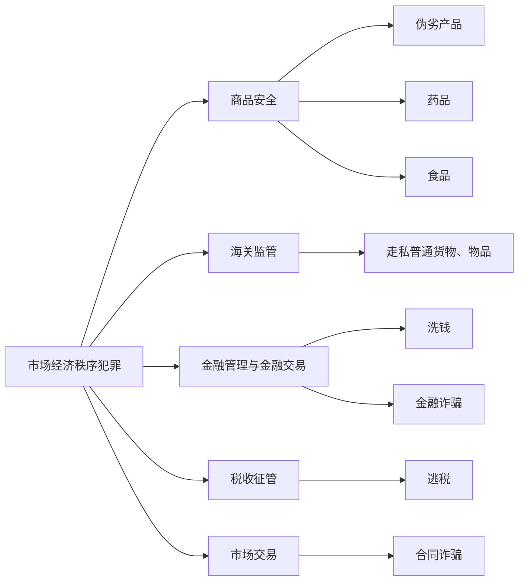

# 一、本章体系位置

破坏社会主义市场经济秩序罪位于刑法分则第三章。讲义展示八类犯罪，并重点讲授其中具有代表性的具体罪名。

| 类罪 | 讲义重点罪名 | 核心复习问题 |
| --- | --- | --- |
| 生产、销售伪劣商品罪 | 生产、销售伪劣产品罪；生产、销售、提供假药罪；妨害药品管理罪；生产、销售有毒、有害食品罪 | 对象实质判断、危险犯类型、罪量与竞合 |
| 走私罪 | 走私普通货物、物品罪 | 走私类型、兜底认定、罪数 |
| 妨害对公司、企业的管理秩序罪 | 讲义未展开 | 共17个罪名 |
| 破坏金融管理秩序罪 | 洗钱罪 | 上游犯罪、自洗钱、与上游犯罪帮助犯区分 |
| 金融诈骗罪 | 集资诈骗罪、贷款诈骗罪、信用卡诈骗罪、保险诈骗罪 | 诈骗构造、非法占有目的、特殊主体与罪数 |
| 危害税收征管罪 | 逃税罪 | 行为类型、处罚阻却事由 |
| 侵犯知识产权罪 | 讲义未展开 | 共8个罪名 |
| 扰乱市场秩序罪 | 合同诈骗罪 | 经济合同、民事欺诈、与普通诈骗/金融诈骗关系 |

> [!tip] 本章解释抓手
> 先确认条文保护的市场管理制度及相应个人法益，再审查行为对象、特殊行为方式、罪量门槛和非法占有目的；最后处理特别法、想象竞合、法律拟制与数罪并罚。

---

# 二、生产、销售伪劣商品罪

## （一）生产、销售伪劣产品罪

### 1. 罪名与行为方式

 > **生产、销售伪劣产品罪是具体罪名**；“生产、销售伪劣商品罪”是本节类罪名。

> 重要！简述行为方式

* **行为方式**：在产品中掺杂、掺假，以假充真，以次充好，或者以不合格产品冒充合格产品。
* 伪劣产品采**实质判断说**：根据产品质量、使用性能及性能高低判断。
* 仅伪造或冒用生产商、产地、认证标志，或者张贴虚假标签，但不影响产品性能与质量的，不属于本罪的伪劣产品。【伪造产地案】[^1]
* “销售”应缩小解释，要求具有将产品**推向市场**的性质。【假酒抵债案】[^2]

### 2. 罪量要求

* 既遂要求**销售金额达到5万元**。
	* “销售金额”是出售伪劣产品后`所得和应得的全部违法收入`，不是扣除成本后的纯利润。
* 尚未销售或销售金额不足5万元时，货值金额达到15万元以上，**可以处罚未遂**。

$$
（销售金额 \times 3）+货值金额 \geq 15万元
$$

eg.`销售金额为2万元，库存货值9万元：（2×3）+9=15万元，成立生产、销售伪劣产品罪未遂。`

### 3. 罪名关系

> ★，按简答题掌握

| 情形                                              | 处理                |
| ----------------------------------------------- | ----------------- |
| 生产、销售第141条至第148条的特定伪劣商品，不构成各具体犯罪，但销售金额达到5万元[^3] | 依第140条定生产、销售伪劣产品罪 |
| 同时构成特定伪劣商品犯罪与第140条之罪[^4]                        | 想象竞合，从一重罪         |
| 销售伪劣产品同时构成诈骗罪                                   | 想象竞合，从一重罪         |

---

## （二）生产、销售、提供假药罪

### 1. 法益与假药认定

> 抽象危险犯

* 法益存在**药品管理秩序说**与**公众生命健康法益说**之争。
	* 2019年《药品管理法》第98条删除了“未经批准生产、进口即按假药论处”等拟制假药规则。
* 现行假药判断采取**成分与疗效标准**，包括：
	1. 药品所含成分与国家药品标准规定的成分不符；
	2. 以非药品冒充药品，或者以他种药品冒充此种药品；
	3. 变质的药品；
	4. 所标明的适应症或者功能主治超出规定范围。
* 根据民间传统配方私自加工的药品，虽无批号**但具有疗效的**，**不当然属于假药**。

> [!example] 陆勇案
> 陆勇无偿帮助病友共同购买印度仿制抗癌药，不具有加价牟利或赚取代理费的行为，不符合“销售”构造；借记卡仅用于帮助病友支付购药款，危害显著轻微。检察机关于2015年作出不起诉决定。该案提示：药品管理秩序不能脱离生命健康法益与行为实质单独评价。

### 2. 行为方式与责任形式

| 行为  | 含义                                                                  | 主体限制           |
| --- | ------------------------------------------------------------------- | -------------- |
| 生产  | 以生产、销售、提供假药为目的，对药品原料进行合成、精制、提取、储存、加工炮制，或在制成成品过程中配料、混合、制剂、储存、包装（不用记） | 一般主体           |
| 销售  | 明知是假药而**有偿提供**给他人使用； **为出售**而`购买、储存`也属于销售                        | 一般主体           |
| 提供  | 明知是假药而**无偿提供**给他人使用                                                 | **仅限药品使用单位人员** |

* 责任形式为**故意**，==必须明知对象是假药==。→复习：[[III 侵犯性自主权#（2）奸淫幼女型强奸的对象|推定明知]]
* 明知根据从业经历、认知能力、药品质量、进货与销售渠道、价格及生产销售方式等综合判断。

### 3. 出罪规则

根据2022年药品安全刑事案件司法解释第18条，**下列情形不应认定为犯罪** ≠ 不处罚（有案底）：

* 根据民间传统配方私自加工或销售药品，数量不大，且未造成伤害后果或延误诊治；
* 不以营利为目的，实施带有自救、互助性质的生产、进口、销售药品行为。

---

## （三）妨害药品管理罪

> 具体危险犯

### 1. 行为方式

> 重要

> [!tip] 简答题：妨害药品管理罪的四种行为方式
> 1. 生产、销售国务院药品监督管理部门禁止使用的药品；
> 2. 未取得药品相关批准证明文件生产、进口药品，或者明知是上述药品而销售；
> 3. 药品申请注册中提供虚假的证明、数据、资料、样品，或者采取其他欺骗手段；
> 4. 编造生产、检验记录。

### 2. 行为性质

本罪是**具体危险犯**，要求行为**足以严重危害人体健康**。常见具体危险包括：

* 未获批准生产、销售的药品主要用于孕产妇、儿童、危重病人；
* 涉及麻醉药品、精神药品、医疗用毒性药品、放射性药品、生物制品、注射剂或急救药品；
* 药品适应症、功能主治或成分不明；
* 无国家药品标准和核准质量标准，但检出化学药成分；
* 未获批准进口、且在境外也未合法上市。

### 3. 药品犯罪性质对比与罪数

| 罪名 | 犯罪性质 | 对象提示 |
| --- | --- | --- |
| 生产、销售、提供假药罪 | 抽象危险犯 | 假药 |
| 生产、销售、提供劣药罪 | 实害犯 | 劣药 |
| 妨害药品管理罪 | 具体危险犯 | “黑药” |
| 药品监管渎职罪 | 实害犯 | 监管人员渎职 |

实施妨害药品管理行为，同时构成生产、销售、提供假药罪，生产、销售、提供劣药罪，提供虚假证明文件罪或其他犯罪的，想象竞合，从一重罪。

> [!question] 2023年法考题：无罪
> 未取得批准文件，从国外购入在境外属于合格药品、且对患者确有疗效的药品在国内销售：对象不属于假药；是否构成妨害药品管理罪，应继续判断行为是否足以严重危害人体健康。

---

## （四）生产、销售有毒、有害食品罪

### 1. 性质与竞合

* 本罪是**抽象危险犯**。
* 生产、销售不符合安全标准的食品罪是**具体危险犯**。
* `有毒、有害食品`必然可以评价为`不符合安全标准的食品`，二罪为**法条竞合关系**。
* 行为人在`有毒、有害食品`与`不符合安全标准食品`之间发生认识错误，属于**抽象事实认识错误**，在**重合范围内**认定为`生产、销售不符合安全标准的食品罪`。

### 2. 行为对象与行为方式

 食品包括`供人食用、饮用的成品和原料`，以及`按照传统既是食品又是中药材的物品`；
 不包括**以治疗为目的的物品**。
 
* **行为方式**：
	1. 在生产、销售的食品中掺入**有毒、有害**的`非食品原料`；
	2. 销售明知掺有**有毒、有害**的`非食品原料`的食品。
* ★“**销售明知掺有有毒、有害非食品原料的食品**”==不能简化为==“**销售有害食品**”。
	* 销售病死、死因不明或检验检疫不合格的动物肉类及制品，成立生产、销售不符合食品安全标准的食品罪。
	* ==食品添加剂不是食品==。
		* 生产、销售不符合安全标准的`食品添加剂、包装材料、容器、洗涤剂、消毒剂或食品生产工具设备`，符合第140条的，定[[X 破坏社会主义市场经济秩序罪#（一）生产、销售伪劣产品罪|生产、销售伪劣产品罪]]。

> [!example] 典型行为包括：
> 
> * 使用瘦肉精等禁止用于饲料、动物饮用水的药品养殖供人食用的动物，或者销售明知如此养殖的动物；
> * 明知动物使用瘦肉精等而提供屠宰加工服务，或者销售其制品；
> * 利用“地沟油”生产食用油，或者明知而销售；
> * 在减肥食品中非法添加西布曲明；
> * 在米粉生产中添加硼砂。
> * 在生产销售的腊肉上喷洒敌敌畏，防止腌制的腊肉生虫。

> [!danger] 做题抓手
> - **绝对不能吃**：生产销售、有毒有害食品罪
> - **相对不能吃**：生产销售伪劣产品罪

### 3. 责任形式

> 不用记 常识判断

责任形式为**故意**，要求**明知**生产、销售的是有毒、有害食品。

认定明知时综合从业经历、食品质量、进货与销售渠道、价格、既往处罚、禁令或安全预警等事实；存在相反证据并查证属实的除外。

> [!example] ABCE 都是，D 不是
> 下列情形成立生产、销售有毒、有害食品罪的有？（2013、2014、2016司考）
> A. 甲大量使用禁用农药种植大豆。
> B. 乙将纯净水掺入到工业酒精中，冒充白酒出售。
> C. 丙为提高猪肉的瘦肉率，在饲料中添加“瘦肉精”。
> D. 丁明知病死猪肉有害，仍将大量收购的病死猪肉冒充合格猪肉在市场上销售。
> E. 戊明知贮存的苹果上使用了禁用农药，仍将苹果批发给零售商。

---

# 三、走私普通货物、物品罪

## （一）走私罪名谱系

| 对象类型 | 代表罪名与提示 |
| --- | --- |
| 国家禁止进出口的特定物品 | 第151条走私武器、弹药、核材料、伪造货币等罪；文物、贵重金属、珍贵动物及其制品强调出境 |
| 特殊目的或方向的物品 | 第152条走私淫秽物品罪要求牟利或传播目的；走私废物罪强调进境 |
| 毒品、制毒物品 | 第347条走私毒品罪；第350条走私制毒物品罪 |
| 国家允许进出口的一般货物、物品 | 第153条走私普通货物、物品罪，规制重点是偷逃海关关税 |

![[截屏2026-06-12 14.42.09.png]]

## （二）行为主体与走私行为

自然人和单位均可构成本罪。

| 类型    | 构造                                                       | 特别提示                        |
| ----- | -------------------------------------------------------- | --------------------------- |
| 绕关、瞒关 | 违反海关监管，非法进出口                                             | 典型走私                        |
| 变相走私  | 未经海关许可且未补税，将保税货物或特定减免税货物在境内销售牟利                          | 发生在境内，无通关过程；须有牟利目的；与逃税罪想象竞合 |
| 间接走私  | 直接向走私人非法收购走私物品（数额较大）； 或在内海、领海、界河、界湖运输、收购、贩卖走私物品且无合法证明 | 适用于其他走私罪；不再定掩饰、隐瞒犯罪所得罪      |
| 通谋走私  | 与走私人通谋，为其提供贷款、资金、账号、发票、证明、运输、保管、邮寄等便利                    | 第156条为注意规定，以走私罪共犯论处         |

## （三）兜底认定与罪数

**走私普通货物、物品罪**可以兜底评价：

* 普通货物、物品；
* 走私文物、贵重金属进境；
* 不以牟利或传播为目的走私淫秽物品；
* 走私废物出境；
* 对走私制毒物品、废物进境、国家禁止进出口的其他货物物品，按本罪处理才能罪刑相适应的情形；
* 对走私对象发生事实认识错误的情形。

| 罪数场景                   | 处理                       |
| ---------------------- | ------------------------ |
| 多次走私未经处理               | 累计数额计算                   |
| 一次走私不同物品，分别构成不同走私罪     | 数罪并罚                     |
| ★不知夹藏其他种类走私物品          | ★按主观认识的走私对象定罪            |
| 以暴力、威胁抗拒缉私             | 除走私毒品罪外，与妨害公务罪数罪并罚       |
| 走私毒品时暴力抗拒检查、拘留、逮捕，情节严重 | 作为**走私毒品罪升格**情节，不另定妨害公务罪 |

---

# 四、洗钱罪

## （一）主体与自洗钱

* 主体包括自然人和单位，也包括上游犯罪人本人。
* 《刑法修正案（十一）》删除行为方式中的“协助”，使**自洗钱**可以成立洗钱罪。

> 对比：掩饰隐瞒犯罪所得罪（自己不能掩隐自己）

## （二）行为对象：上游犯罪所得及收益

> [!tip] 简答题：洗钱罪的七类上游犯罪（走私贪污黑恐毒，两金）
> 1. 毒品犯罪；【走私、贩卖、运输、制造、毒品】【非法持有毒品】
> 2. 黑社会性质的组织犯罪；[^5]
> 3. 恐怖活动犯罪；[^5]
> 4. 走私犯罪；
> 5. 贪污贿赂犯罪；[^6]
> 6. 破坏金融管理秩序犯罪；【高利转贷】【非法吸收公共存款罪】
> 7. 金融诈骗犯罪。[^7]
 
* 上游犯罪所得及其收益包括**实施上游犯罪取得的报酬**。
* 洗钱罪以**上游犯罪事实成立**为前提，
	* 下面情形不影响洗钱罪成立：
		* 上游犯罪尚未裁判、
		* 行为人逃匿或死亡、
		* **因罪数关系以其他罪名论处**、
		* 上游犯罪已过追诉时效。

## （三）行为方式与责任形式

行为本质是掩饰、隐瞒上游犯罪所得及收益的来源和性质，包括：

> [!tip] 简答题：洗钱罪的行为方式
> 1. 提供资金账户；
> 2. 将财产转换为现金、金融票据、有价证券；
> 3. 通过转账或其他支付结算方式转移资金；
> 4. 跨境转移资产；
> 5. 以其他方法掩饰、隐瞒来源和性质。

* 责任形式为故意，要求明知是七类上游犯罪所得及收益。
* 在七类上游犯罪之间发生认识错误，不影响洗钱故意成立。

> [!danger] 新法优于旧法：从法条竞合到想象竞合
> > [!cite] **2025**年两高《关于办理掩饰、隐瞒犯罪所得、犯罪所得收益刑事案件适用法律若干问题的解释》第**9**条
>>  明知是犯罪所得及其收益而予以掩饰、隐瞒，构成【`掩饰、隐瞒犯罪所得、犯罪所得收益罪`】，同时【`构成其他犯罪`】的，**依照处罚较重的规定定罪处罚**。

## （四）认定与罪数

| 问题             | 处理                              |
| -------------- | ------------------------------- |
| 洗钱罪与上游犯罪帮助犯    | 事先有通谋，成立上游犯罪帮助犯； 事先无通谋，考虑洗钱罪 |
| 先实施上游犯罪，后实施自洗钱 | 多数说数罪并罚；少数说按牵连犯择一重罪             |
| 同时实施上游犯罪与自洗钱   | 多数说想象竞合；少数说按牵连犯择一重罪             |

---

# 五、金融诈骗罪

金融诈骗罪均需符合诈骗罪基本构造。合同诈骗罪属于扰乱市场秩序罪，不属于金融诈骗罪。

| 罪名 | 单位能否构成 | 核心特别要素 |
| --- | --- | --- |
| 集资诈骗罪 | 可以 | 非法集资 + 非法占有目的 |
| 贷款诈骗罪 | 不可以 | 诈骗银行或其他金融机构贷款 |
| 信用卡诈骗罪 | 不可以 | 四类信用卡诈骗行为 |
| 保险诈骗罪 | 可以 | 特殊主体 + 五类骗保行为 |

![[截屏2026-06-12 15.19.32.png]]

## （一）集资诈骗罪

### 1. 行为方式

本罪要求以**非法占有为目的**，使用诈骗方法非法集资，数额较大。

* **非法集资**：
	* 单位或个人违反法律、法规，向社会公众募集资金；
	* 通常表现为虚假承诺回报，回报不必具有确定性。
* **社会公众**：社会不特定对象，包括单位和个人。
	* 未公开宣传，仅在亲友或单位内部针对特定对象吸收资金，不属于向社会公众集资。
	* 明知亲友或内部人员向不特定对象吸收资金而放任，或者为吸收资金将社会人员吸收为内部人员，仍属于向社会公众集资。

### 2. 非法占有目的

【集资诈骗罪】与【非法吸收公众存款罪】、【欺诈发行股票债券罪】的关键区分，**是行为人是否具有非法占有目的**。可推定非法占有目的的情形包括：

* 集资后不用于生产经营，或使用规模与筹资规模明显不成比例，致使不能返还；
* 肆意挥霍集资款；
* **携款逃匿**；
* **将集资款用于违法犯罪**；
* 抽逃、转移资金或隐匿财产，逃避返还；
* **隐匿、销毁账目**，或假破产、假倒闭；
* 拒不交代资金去向，逃避返还。

---

## （二）贷款诈骗罪

### 1. 主体与行为方式

* **主体**：仅限**自然人**。
	* 单位利用签订、履行借款合同诈骗金融机构贷款，符合合同诈骗罪构成要件的，以【合同诈骗罪】论处。
* **行为方式**：采用虚构事实、隐瞒真相的方法，**骗取银行或其他金融机构贷款**，数额较大。

具体欺骗方法包括编造引进资金、项目等虚假理由，使用虚假经济合同、虚假证明文件、虚假产权证明担保，超出抵押物价值重复担保，以及其他诈骗贷款的方法。

> [!tip] 简答题：行为方式
> （一）编造引进资金、项目等虚假理由的；
> 
> （二）使用虚假的经济合同的；
> 
> （三）使用虚假的证明文件的；
> 
> （四）使用虚假的产权证明作担保或者超出抵押物价值重复担保的；
> 
> （五）以其他方法诈骗贷款的。

> [!question] 冒名网贷
> 分析冒名网贷时，应区分账户用户是否已经开通贷款功能、资金提供者是金融机构还是贷款公司，以及欺骗行为使何人陷入认识错误并处分财产。

### 2. 非法占有目的与罪名关系

* **责任形式**：**故意**。必须在实施贷款行为时具有非法占有目的；
	* 否则可能成立骗取贷款罪或高利转贷罪。

> [!note] 必须在实施贷款行为时具有非法占有目的
> * **合法取得贷款后才产生非法占有目的**，仅拒不还本付息且未实施新欺骗的，属于民事纠纷。
> * **合法取得贷款后**，**通过欺骗使贷款人免除还款义务**，成立普通诈骗罪。
> * **合法取得贷款后因故不能还款**，隐藏、转移抵押物使贷款人无法行权，不成立贷款诈骗罪，可视情形成立侵占罪等。

| 特殊场景 | 处理 |
| --- | --- |
| 欺骗他人提供担保，进而骗取金融机构贷款 | 对担保人的（合同）诈骗罪与贷款诈骗罪数罪并罚 |
| 与金融机构贷款最终决定者串通套取贷款 | 成立贪污罪、职务侵占罪、违规发放贷款罪等共犯；因无受骗人，不成立贷款诈骗罪 |

---

## （三）信用卡诈骗罪

> ★★★★★★

### 1. 主体、对象与四类行为

* **主体**：**仅限自然人**。
	* 刑法上的“信用卡”包括可以透支的信用卡和**不能透支的借记**卡，属于扩大解释。

> [!tip] 简答题：信用卡诈骗罪的四种行为方式
> 1. 使用伪造的信用卡，或者使用以虚假身份证明骗领的信用卡；
> 2. 使用作废的信用卡（包括持卡人）；
> 3. 冒用他人信用卡；
> 4. 恶意透支。

* **使用伪造信用卡**：
	* 按信用卡通常用途，将伪造卡作为真实有效卡使用【信用卡开锁案】；
	* 使用“变造”的信用卡也按使用伪造信用卡处理。
	* ★【简答：冒用他人信用卡包括】：
		* 拾得、骗取他人信用卡后使用，
		* 以及非法获取他人信用卡信息资料后通过互联网、通讯终端使用。
	* ★【简答：恶意透支】：
		* **主体**：**合法持卡人**
		* 以非法占有为目的，超过规定限额或期限透支，经发卡银行两次催收后超过3个月仍不归还。
		* 恶意透支的非法占有目的须存在于透支时；
			* 透支时具有归还意思，后因客观原因无法归还的，不成立本罪。

### 2. 盗窃信用卡并使用

> ★★★

第196条第3款规定，盗窃信用卡并使用的，**以盗窃罪定罪处罚**。

盗窃 信用卡 使用

| 问题                 | 处理                                 |
| ------------------ | ---------------------------------- |
| 条款性质               | 通说为法律拟制；张明楷认为机器使用属注意规定、对自然人使用属法律拟制 |
| 拾得、骗取、抢夺、勒索信用卡但未使用 | 不成立信用卡诈骗罪；可能成立妨害信用卡管理罪等            |
| 拾得、骗取信用卡后在机器上使用    | 司法解释定冒用他人信用卡型信用卡诈骗罪；张明楷主张盗窃罪       |
| 拾得、骗取信用卡后对自然人使用    | 信用卡诈骗罪                             |
| 抢劫信用卡后使用、消费        | 实际使用、消费数额计入抢劫数额                    |

“盗窃信用卡并使用”中的信用卡，司法解释观点限于真实实体卡：

* 盗窃信用卡信息后通过网银、电话银行使用，或绑定本人支付宝、微信转走资金，按冒用他人信用卡型信用卡诈骗罪处理；
* 拾得手机后，直接转走被害人已绑定银行卡内存款，或转走支付宝、微信钱包余额，成立盗窃罪；
* ★明知是他人盗窃的信用卡而使用，成立盗窃罪共犯；不知情而冒用，成立信用卡诈骗罪；
* 盗窃并使用信用卡后，又对自然人透支使用，盗窃罪与信用卡诈骗罪数罪并罚。

关键在于：有没有窃取他人资料并使用

---

## （四）保险诈骗罪

### 1. 主体与五类行为

保险诈骗罪中的保险限于商业保险，不包括社会保险、医疗保险。

> 简答

| 行为方式 | 法定主体 | 提示 |
| --- | --- | --- |
| 故意虚构保险标的 | 投保人 | 仅投保人与保险公司商谈保险标的 |
| 对已发生保险事故编造虚假原因或夸大损失 | 投保人、被保险人、受益人 | 骗取保险金 |
| 编造未曾发生的保险事故 | 投保人、被保险人、受益人 | 骗取保险金 |
| 故意造成财产损失的保险事故 | 投保人、被保险人 | 财产险中无受益人 |
| 故意造成被保险人死亡、伤残或疾病 | 投保人、受益人 | 被保险人是受害人 |

* 着手：以行为具备侵犯保险人财产法益的现实危险为标准，**即到保险公司索赔或提出支付保险金请求**。
* 鉴定人、证明人、财产评估人故意提供虚假证明，为骗保提供条件的，以保险诈骗罪共犯论处；该规定属于注意规定。

### 2. 与其他犯罪的关系

| 场景 | 处理 |
| --- | --- |
| 保险公司工作人员利用职务虚假理赔并占有保险金 | 职务侵占罪；国有保险公司相应人员构成贪污罪 |
| 投保人等与保险公司工作人员勾结骗保 | 按贪污罪或职务侵占罪共犯处理；保险公司未受骗，不成立保险诈骗罪 |
| 为骗保实施放火、杀人等犯罪，后又着手骗保 | 准备行为所构成犯罪与保险诈骗罪数罪并罚 |
| 已实施放火、杀人等，但尚未着手索赔 | 至多成立保险诈骗罪预备犯 |
| 骗取财物未达保险诈骗数额标准，但达到（合同）诈骗标准 | 以（合同）诈骗罪论处 |
| 保险诈骗数额特别巨大或有其他特别严重情节，同时构成（合同）诈骗罪 | 想象竞合，从一重罪 |

---

# 六、逃税罪

## （一）三种行为类型

| 类型           | 构成要求                                   |
| ------------ | -------------------------------------- |
| 纳税人逃税        | 欺骗、隐瞒，虚假申报或不申报；逃税数额较大且占应纳税额10%以上       |
| 扣缴义务人逃税      | 欺骗、隐瞒，不缴或少缴已扣、已收税款，数额较大；不要求达到应缴税额10%以上 |
| 纳税人缴税后骗回已缴税款 | 假报出口或其他欺骗手段，骗取已缴税款；第204条第2款为法律拟制       |

责任形式为**故意**；过失漏税不成立本罪。

## （二）处罚阻却事由

> 简答：★★★

纳税人逃税后，经税务机关依法下达追缴通知，补缴应纳税款、缴纳滞纳金，已受行政处罚的，**不予追究刑事责任**（不是不处罚）；但五年内曾因逃税受刑事处罚，或被税务机关给予两次以上行政处罚的除外。

> [!caution] 适用边界
> 1. 处罚阻却事由仅适用于纳税人，不适用于扣缴义务人。
> 2. 讲义观点认为，即使税务机关未给予行政处罚，只要补缴税款并缴纳滞纳金，也不应追究刑责。
> 3. 该事由仅阻却逃税罪的刑罚权发动，不阻碍对同时构成的其他犯罪追责。

走私普通货物、物品罪与逃税罪可以形成想象竞合；逃税罪的处罚阻却事由不影响依走私罪追究责任。

---

# 七、合同诈骗罪

## （一）保护法益与欺骗手段

* 保护法益：市场秩序与合同相对方财产。
* 欺骗行为符合诈骗罪基本构造。

> [!tip] 简答题：合同诈骗罪的五种欺骗手段
> 1. 以虚构单位或者冒用他人名义签订合同；
> 2. 以伪造、变造、作废的票据或者其他虚假产权证明作担保；
> 3. 没有实际履行能力，以先履行小额合同或部分履行合同，诱骗对方继续签订、履行合同；
> 4. 收受对方给付的货物、货款、预付款或担保财产后逃匿；
> 5. 以其他方法骗取对方当事人财物。

## （二）责任要素

* 责任形式为故意，并具有非法占有目的，即排除意思与利用意思。
* 非法占有目的可产生于签订合同时，也可产生于履行合同过程中，**但必须存在于诈骗行为时**。

| 场景 | 处理 |
| --- | --- |
| 收受已经转移所有权的财物后才产生非法占有目的，仅据为己有 | 不以犯罪论处 |
| 收受上述财物后，以新欺骗使对方免除债务 | 成立新的（合同）诈骗，诈骗对象为免除债务这一财产性利益 |
| 收受未转移所有权的财物后逃匿 | 侵占罪 |

## （三）认定与罪名关系

* 合同诈骗行为与民事欺诈是包容关系，前者是后者的特殊情形；合同民事效力与犯罪成立是不同问题。
* 合同诈骗罪与普通诈骗罪是特别关系。
* 本罪中的合同限于经济合同，但包括口头合同；至少相对方应为从事经营活动的市场主体。
* 未达合同诈骗罪数额标准但达到普通诈骗罪标准的，定普通诈骗罪。
* 满足金融诈骗罪成立条件的，原则上定金融诈骗罪；明显罪刑不均衡时，可考虑合同诈骗罪。
* 签订合同、收取货款后提供伪劣商品，同时构成合同诈骗罪与生产、销售伪劣商品犯罪的，想象竞合。

---

# 八、本章复习抓手

## （一）危险犯类型

| 罪名 | 类型 |
| --- | --- |
| 生产、销售、提供假药罪 | 抽象危险犯 |
| 生产、销售不符合安全标准的食品罪 | 具体危险犯 |
| 生产、销售有毒、有害食品罪 | 抽象危险犯 |
| 妨害药品管理罪 | 具体危险犯 |
| 生产、销售、提供劣药罪 | 实害犯 |

## （二）高频罪名关系

| 关系 | 处理抓手 |
| --- | --- |
| 生产、销售伪劣产品罪 vs. 特定伪劣商品犯罪 | 第149条：不构成特定犯罪但销售额达5万元，适用第140条；同时构成则想象竞合从一重 |
| 有毒、有害食品罪 vs. 不符合安全标准食品罪 | 前者是特别法条；认识错误时在重合范围内定后罪 |
| 走私普通货物、物品罪 vs. 逃税罪 | 变相走私可想象竞合；逃税处罚阻却不阻却走私罪 |
| 洗钱罪 vs. 上游犯罪帮助犯 | 事先是否通谋 |
| 洗钱罪 vs. 掩饰、隐瞒犯罪所得罪 | 对七类上游犯罪所得进行掩饰、隐瞒，同时构成时依洗钱罪 |
| 集资诈骗罪 vs. 非法吸收公众存款罪 | 是否具有非法占有目的 |
| 贷款诈骗罪 vs. 骗取贷款罪 | 是否具有非法占有目的 |
| 合同诈骗罪 vs. 普通诈骗罪 | 特别关系；合同限经济合同 |
| 合同诈骗罪 vs. 金融诈骗罪 | 满足金融诈骗罪条件原则上适用金融诈骗罪 |

## （三）案例涵摄顺序

1. 确定行为所属市场领域：商品安全、海关、金融、税收或市场交易。
2. 确认行为对象与特殊主体：假药/黑药/食品、走私对象、上游犯罪所得、信用卡、保险关系等。
3. 审查特殊行为方式、罪量门槛与非法占有目的。
4. 判断犯罪类型：抽象危险犯、具体危险犯、实害犯、数额犯或目的犯。
5. 最后处理罪数：特别法、想象竞合、法律拟制、注意规定或数罪并罚。

[^1]: 仅虚假标示而产品质量、性能合格，不宜认定为伪劣产品。

[^2]: 以假酒抵债是否属于销售，应围绕行为是否具有推向市场的性质判断。

[^3]: 特别法优先于一般法的例外：适用不了特别法，适用一般法。

[^4]: 重法优于轻法，临时调整为想象竞合。

[^5]: 黑社会性质组织、恐怖活动组织及其成员实施的**财产犯罪**，也可能成为洗钱罪的上游犯罪。

[^6]:  贪污贿赂犯罪不限于刑法分则第八章，也包括非国家工作人员受贿罪、对非国家工作人员行贿罪等。
	 但是，**不包括职务侵占**

[^7]: 金融诈骗犯罪不包括合同诈骗罪。
