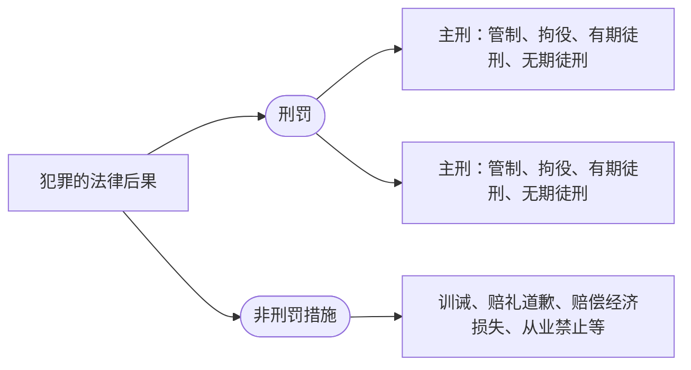

# 一、刑法的概念、渊源和分类
## （一）概念
- 刑法是规定犯罪及其法律后果（主要是刑罚）的法律规范。
> [!example] 例子
> 故意杀人的，处死刑、无期徒刑或者十年以上有期徒刑;情节较轻的，处三年以上十年以下有期徒刑。

 - criminal law vs. penal law

| 形容词/adj.                | 名词/n.                  | 动词/vt.                                             |
| ----------------------- | ---------------------- | -------------------------------------------------- |
| **criminal** 犯罪的，刑事的 | crime 罪行，犯罪         | criminalize （政府）宣布⋯.为不合法；犯罪化；把…•当罪犯对待；宣告（某人）有罪； |
| **penal** 有关刑罚的      | penalization 惩罚；处罚； | penalize 处罚；处刑；使不利                              |

$$犯罪论+刑罚论=刑法$$

## （二）刑法的渊源、分类

> [!note] 刑法的法源
> 1.  **刑法典**
> 2. **单行刑法**
> 	是国家以决定、规定、补充规定、条例等名称颁布的，规定某一类犯罪及其法律后果或者刑法的某一事项的法律。 
> 3. 附属刑法
> 	附带规定于民法、经济法、行政法等非刑事法律中的罪刑规范。**目前我国并没有真正的附属刑法。**
> 
> >[!caution] 注意
> >刑法修正案是刑法典的一部分。
> >^sourcesofcrimminallaw
 
> [!note] 刑法的分类：
狭义刑法——刑法典
广义刑法——刑法典、单行刑法和附属刑法

---
# 二、刑法的特点、机能
## （一）刑法的特点
1. 规制的内容特定。
2. 制裁手段严厉。
3. 法益保护广泛。
4. 处罚范围的不完整性。
	- 只处罚严重法益侵害性的行为
5. 对部门法律的补充性。
	- 刑法具有最后性

## （二）刑法的机能
> [!quote] 法条
>- [[刑法#第一条|第1条]]：为了惩罚犯罪，保护人民，根据宪法，结合我国同犯罪作斗争的具体经验及实际情况，制定本法。
> - [[刑法#第二条|第2条]]：中华人民共和国刑法的任务，是用刑罚同一切犯罪行为作斗争，以保卫国家安全，保卫人民民主专政的政权和社会主义制度，保护国有财产和劳动群众集体所有的财产，保护公民私人所有的财产，保护公民的人身权利、民主权利和其他权利，维护社会秩序、经济秩序，保障社会主义建设事业的顺利进行。
1. **法益保护机能**；
2. **人权保障机能**。
	- 无辜的人；犯罪的人；

---
# 三、体系与基本原则
>[[刑法]]

## （一）刑法的体系

刑法的体系：总则+分则（附则）
- 章、节、条、款、项

### 1. 刑法的条文结构
1. 总则条文：定义与规则。
2. 分则条文：
	- 前半部分规定该罪的构成要件，称“罪状”，定罪的法律根据；
	- 后半部分规定对该罪配置的刑罚，称“法定刑”，是量刑的法律根据。

## （二）刑法的基本原则

> [!quote] 
>第三条 【罪刑法定原则】法律明文规定为犯罪行为的，依照法律定罪处刑;法律没有明文规定为犯罪行为的，不得定罪处刑。
> 
> 第四条 【刑法适用平等原则】对任何人犯罪，在适用法律上一律平等。不允许任何人有超越法律的特权。
> 
> 第五条 【罪刑相当原则】刑罚的轻重，应当与犯罪分子所犯罪行和承担的刑事责任相适应。

### 罪行法定原则
>[[刑法#第三条]]，帝王原则

1. 制定法原则，规定犯罪及刑罚的法律必须是**立法机关制定的成文法律**。（民主主义、保护人权）
	1. 行政法规、规章、和习惯法都不得作为刑法的渊源。 
		- 虽然行政法规、规章不能直接规定犯罪与刑罚，但它可以对构成要件的某些方面进行填补。
		- 通说认为，**空白罪状是符合罪刑法定原则的。**
			- 所谓 **空白罪状**，是指刑法分则条文在规定某种犯罪时，没有完整地描述该犯罪的全部构成要件，只是作了一个比较抽象、概括的规定，需要援引其他法律、行政法规、部门规章，甚至地方性法规等加以补充，才能确定该罪名的具体内容。
	2. 判例也不应作为我国刑法的渊源
	
2. **禁止溯及既往**。
	- 目的：限制国家公权力
		- **对行为人有利的事后法可以溯及既往**

3. **禁止类推解释**。
	- 目的：使得国民可预测
		- **刑法不禁止有利于被告人的类推解释。**

> [!info] 类推解释
>**类推解释**，是指在法律没有明确规定某一事项时，借助与其最为相似的事项或规定，将该相似条款逻辑性地引申适用于该未规定事项的一种解释方法。它的核心在于通过“类似性”建立法律适用的桥梁，以填补法律空白。
^analogy

> [!example] 拐卖妇女儿童罪 vs. 拐卖人口罪
>**2025年2月**，广东一名19岁男子（以下简称“小黄”）被其17岁同居女友（以下简称“小周”）以人民币10万元价格出售至缅甸的一处电信网络诈骗园区。在园区内，小黄被剃发、关禁闭，并被强制参与诈骗活动，且如未完成绩效任务将遭受毒打，导致听力受损等身体伤害。**2025年6月**，在缅甸潮汕商会与其家属协调之下，小黄获释回国。小周在案后曾赴泰国旅行，返回中国后被警方控制，目前被控**诈骗罪**，案件预计于近期开庭审理。

4. **处罚的明确性**。
	1. 刑法关于犯罪与刑罚的规定应当尽量明确。   
		- 简单罪状不违反明确性要求。
			- [[刑法#第二百三十二条]]
	2. 禁止**绝对不定刑**和**绝对不定期刑**。
		1. **绝对不定刑**，是指刑法只规定「`犯······罪的，判处刑罚`」，不规定刑罚的种类。
		2. **绝对不定期刑**，是指刑法条文只规定「`犯······罪的，判处有期徒刑`」，不规定具体刑期。
		3. **相对不定期刑，是符合罪刑法定原则的。**
			- 「相对不定期刑」是刑罚制度中的一种类型，它指的是刑期并非完全固定，而是以一个幅度形式规定，具体执行的刑期最终要由司法或行政机关在幅度内裁量或根据行为人的表现加以决定。

5. **处罚的适正性**。
	1. 禁止处罚不当罚的行为。
	2. 禁止不均衡的、残虐的刑罚。

### 罪行相当
>第5条：刑罚的轻重，应当与犯罪分子所犯罪行和承担的刑事责任相适应。

罪刑相当原则包括客观相当和主观相当两个方面。
- **客观相当**，刑罚与犯罪行为的**社会危害性**相适应，社会危害性越大，刑罚也越重。
- **主观相当**，刑罚与犯罪人的**人身危险性**相适应，人身危险性越大的罪犯，其刑罚也越重。

### 刑法适用平等原则
>第4条：对任何人犯罪，在适用法律上一律平等。不允许任何人有超越法律的特权。

# 四、刑法的解释

> [!question] 思考 
> （一）[[刑法#第二百三十二条|232条]]：故意杀人的，处死刑、无期徒刑或者十年以上有期徒刑;情节较轻的，处三年以上十年以下有期徒刑。
> 1. 张三拿刀砍死仇人李四。
> 2. 张三拿刀捅死自己。
> 3. 张三明知第二天的航班要坠机，然后还极力劝说仇人李四去坐这趟飞机，然后李四就坐了这架飞机，果然发生了坠机事件，导致李四死亡。
> 4. 李四拿刀砍张三，张三随手捡起木棒还击，击中李四脑袋致其死亡，张三是否构成故意杀人罪呢？
> 5. 张三杀死还在李四老婆肚子里的胎儿。
> 
> （二）[[刑法#第二百六十七条-第2款|267条第二款]]规定，携带凶器抢夺的按照抢劫罪论处。
> - 什么是凶器？张三携带含有艾滋病毒的注射器抢夺他人财物，可以定性为“携带凶器抢夺吗”？
> 

## （一） 解释效力
>立法解释，司法解释和学理解释。
-  [[#^sourcesofcrimminallaw|刑法修正案属于立法，是刑法典的一部分，不属于立法解释。]]

## （二）解释方法
1. **文理解释**（或文义解释），根据刑法用语的通常使用方式来进行解释。——首选的解释方法。
	- [[刑法#第二百三十四条|234条]]故意伤害罪：`故意伤害他人身体的，······`
	- [[刑法#第二百三十二条|232条]]故意杀人罪：`故意杀人的，······`
2. **论理解释**，按照立法精神，联系有关情况，从逻辑上所做的解释。
	- 当文理解释导出不合理的结论时，选择论理解释

## （三） 解释技巧
>平义解释、扩张解释、限缩解释、反对解释、类推解释、补正解释等。

1. **平义解释**：字面解释 

2. **扩张解释**：扩大刑法条文的字面含义，使其符合刑法的真实含义（否则违反了可预测性）。
	- 是对刑法用语通常含义的扩张，不能超出刑法用语可能具有的含义
		- *eg. 使用中的运钞车也算金融机构，抢劫使用中的运钞车也算抢劫金融机构*
		- *eg.怀孕的妇女在审判时不受死刑，侦查阶段也算审判阶段*
	- 与[[#^analogy|类推解释]]的区分：
		- 是否在词语可能的含义范围之内（是否超出文义射程范围内）
		- 是否超过国民预测可能性。

3. **限缩解释**：缩小刑法条文字面的含义，使其符合刑法的真实含义。

4. **补正解释**：在刑法条文的用语发生明显错误时，统观刑法全文加以补正，以阐明刑法真实含义。
> [!example]
> 1. [[刑法#第九十九条]]：`本法所称以上、以下、以内，包括本数。`
> 2. [[刑法#第六十三条]]：`犯罪分子具有本法规定的减轻处罚情节的，应当在法定刑以下判处刑罚······`，在这里，以下不包括本数，否则违背减轻处罚的目的

5. **反对解释**：是指根据刑法条文的正面表述，推导出其反面含义。

## （四） 解释理由
>文理解释、体系解释、当然解释、历史解释、目的解释、比较解释等。

1. **体系解释**：具有相对性。
	- *eg. [[刑法#第一百一十四条]]：`其他危险方法`应当与前列行为危险性相当*

> [!info] 体系解释
>**体系解释**是一种在解释法律条文时，将其置于整个法律体系之中进行分析的方法。其核心在于通过考察所解释条文在法律体系中的位置、条文间的相互关系、制度结构以及法意的统一性，进而得出符合整体法律体系意旨的解释结论。

2. **当然解释**：出罪——举重以明轻；入罪——举轻以明重。
	- 当然解释不能超过文字上的极限
		- 举轻以明重：有上限
		- 举重以明轻：无下限

3. **历史解释**，是指根据制定刑法时的历史背景以及刑法发展的历史渊源来阐明刑法真实含义。
	- 不要将**历史解释**与探求立法原意的**主观解释**相混淆

4. **比较解释**（学理）
	- 参考国外立法，解释本国法律

5. **目的解释**

---
# 五、刑法的效力范围

## （一）刑法的空间效力

> [!question] 思考
>1. 美国人Tom在华留学期间与张三起争执将张三打成重伤。
> 
> 2. 中国人张三在缅甸实施电信诈骗犯罪活动。（骗中国人？骗外国人？）
> 
> 3. 泰国人Mike在泰国对我国公民实施电信诈骗，我国公安机关工作人员在Mike来中国旅游时将其抓捕。
> 
> 4. 阿丹·奈姆等抢劫案。
>   - 被告人阿丹·奈姆（印尼国籍）等人在马来西亚海域抢劫泰国邮轮后，被告人阿丹·奈姆指挥该油轮沿着马来西亚一菲律宾一中国台湾航线航行，进入中国领海与中国杂货轮“正阳一号”（另案处理）联系销赃该油轮上的柴油。当被抢劫来的油轮与“正阳一号”正在接驳柴油时，被中国警方现场查获。
>   - 被告人在马来西亚海域抢劫泰国邮轮的行为，属于国际犯罪中的海盗行为，根据我国参加签署的《联合国海洋法公约》和《制止危及海上航行安全非法行为公约》的有关规定，以及该规定确定的普遍管辖原则，我国可对阿丹·奈姆等人在我国领域外的海上抢劫犯罪行为行使刑事管辖权。

> [!tip] 目前在国际上通用的刑事管辖原则
>`属地属人，普遍保护`
> - 属地管辖：地域
> - 属人管辖：国籍（犯罪人或被告人）
> - 保护管辖：本国利益
> - 普遍管辖：各国的共同利益

> [!example]
>2017年，朝鲜领导人金正恩的哥哥，金正男，在马来西亚被两名女子刺杀，后来查明，这两名女子一个是越南人，一个是印度尼西亚人。
>  - 马来西亚：属地，
>  - 越南：属人，
>  - 印尼：属人，
>  -  朝鲜：保护

> [!note] 我国刑法的效力空间
>以[[I 刑法概况#1. 属地管辖|属地管辖]]为主，兼采[[I 刑法概况#2. 属人管辖|属人原则]]和[[I 刑法概况#3. 保护管辖|保护原则]]，并以普遍管辖原则为最后的补充。
> - 位阶关系：如果一个案件既像属地又像属人，那么他是**属地** 

### 1. 属地管辖

> [!cite] [[刑法#第六条]]
凡在[[#^PRCregion|中华人民共和国领域]]内[[#^crimeinPRC|犯罪]]的，除[[#^specialprivision|法律有特别规定]]的以外，都适用本法。
凡在中华人民共和国船舶或者航空器内犯罪的，也适用本法。
犯罪的行为或者结果有一项发生在中华人民共和国领域内的，就认为是在中华人民共和国领域内犯罪。

1.  ==中华人民共和国领域内==
	1. 领陆、领水和领空；
	2. **在我国登记的船舶或航空器**；
	3. **我国驻外使领馆**。
^PRCregion

2. ==犯罪==：**行为**或**结果**发生在我国领域内
	1. 行为
		1. 实行、**教唆**和**帮助**；
		2. **预备**和实行；
	2. 结果
		1. 整体和**部分**结果；
		2. 实害结果和**有可能发生的结果**。
^crimeinPRC

> [!caution] 注意
>eg.张三从美国飞到伊朗杀人，途径中国领空，中国无管辖权，因为没有法益实质损害

3. ==法律有特别规定==
	1. 有外交特权和豁免权的外国人；
	2. [[刑法#第九十条|民族自治地方]]；
	3. 港澳台。
^specialprivision

### 2. 属人管辖

> [!cite] [[刑法#第七条]]
中华人民共和国公民在中华人民共和国领域外犯本法规定之罪的，适用本法，但是按本法规定的最高刑为三年以下有期徒刑的，**可以**不予追究。
中华人民共和国国家工作人员和军人在中华人民共和国领域外犯本法规定之罪的，适用本法。

### 3. 保护管辖

> [!cite] [[刑法#第八条]]
>外国人在中华人民共和国领域外对中华人民共和国国家或者公民犯罪，而按本法规定的最低刑为三年以上有期徒刑的，可以适用本法，但是按照犯罪地的法律不受处罚的除外。

> [!cite] 我国对外国刑事判决的承认（[[刑法#第十条|第10条]]）
凡在中华人民共和国领域外犯罪，依照本法应当负刑事责任的，虽然经过外国审判，仍然可以依照本法追究，但是在外国已经受过刑罚处罚的，可以免除或者减轻处罚。

### 4. 普遍管辖

> [!cite] 普遍管辖（[[刑法#第9条]]）
对于中华人民共和国缔结或者参加的国际条约所规定的罪行，中华人民共和国在所承担条约义务的范围内行使刑事管辖权的，适用本法。

- 这些国际犯罪首先需要国内法加以确认；
- “或起诉或引渡”。

## （二）刑法的时间效力

> [!cite] [[刑法#第十四条]]
>中华人民共和国成立以后本法施行以前的行为，如果当时的法律不认为是犯罪的，适用当时的法律；如果当时的法律认为是犯罪的，依照本法总则第四章第八节的规定应当追诉的，按照当时的法律追究刑事责任，但是如果本法不认为是犯罪或者处刑较轻的，适用本法。
>
本法施行以前，依照当时的法律已经作出的生效判决，继续有效。

1. **从旧兼从轻**。仅适用于**未判决**的案件。
	- 从轻，意味着当从旧从新冲突时适用更**有利于被告人的**
	- 已经判决的，**尊重既判力**

2. 继续犯、连续犯跨越新旧法时：
	- 若新旧刑法都认为是犯罪，即便新法处罚更重，也要适用新法，但<u>量刑可酌定从轻处罚</u>。
	- 若旧法不认为是犯罪，但新法认为是犯罪，则<u>只追究新法生效后的这部分行为</u>。

> [!question] 跨越新旧司法解释，怎么办？
> [[1. 民法的法源#3.司法解释|司法解释]]不是立法，它是蕴含法律中的成文解释，它的效力由其解释的法律决定。
> 新旧司法解释竞合，从旧兼从轻。

3. 司法解释的时间效力：适用于法律的实行期间。
	- 对于同一行为有新旧两个以上司法解释发生竞合时，采取从旧兼从轻原则。

4. 修正案的时间效力：从旧兼从轻