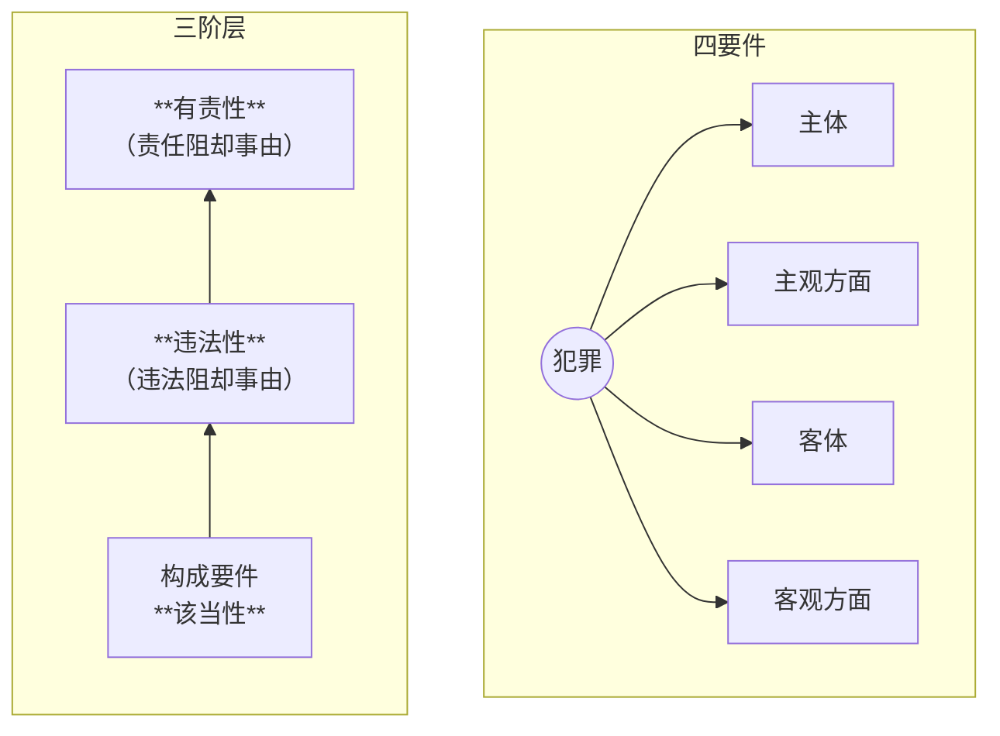

# 一、犯罪的概念、特征

> [!cite] [[刑法#第十三条]]
>一切危害国家主权、领土完整和安全，分裂国家、颠覆人民民主专政的政权和推翻社会主义制度，破坏社会秩序和经济秩序，侵犯国有财产或者劳动群众集体所有的财产，侵犯公民私人所有的财产，侵犯公民的人身权利、民主权利和其他权利，以及其他**危害社会**的行为，**依照法律**应当**受刑罚处罚的**，都是犯罪，但是情节显著轻微危害不大的，不认为是犯罪。

## （一）特征

1. **刑事违法性**
	- （行政违法VS 刑事违法）相比行政违法，刑事违法规定更严格，处罚更严重

2. **法益侵害性**（[[I 刑法概况#罪行相当|社会危害性]]）
	- 严格区分道德与法律
	- 不能惩罚思想犯
		- 「法不诛心，唯论言行」
		- eg.*隋文帝 “一文弃市法”：“命盗一钱以上皆弃市，或三人共盗一瓜，事发即死”*

3. **有责性**（应受惩罚性）

# 二、犯罪构成理论

## （一）三阶层 & 四要件

### 1. 四要件理论的问题

1. **没有区分违法与责任**
	- 主要体现在犯罪主体这一要件上
		- 责任年龄
			- 说明行为人是否具有可谴责性
		- 责任能力
		- 特殊身份
			- 表明行为是否具有法益侵害性
		- etc.

2. **很可能导致主观归罪**
	- “也就是根据行为人怎么想的来定罪，而不管他实际上实施了什么行为。”

3. “**四要件论认为社会危害性是客观危害和主观恶性相加**”

### 2. 阶层论

- **解释**
	- 违法阻却事由，可以阻却行为的违法性
	- 责任阻却事由，
- **特点**
	- 三阶层不要求主体适格
	- 从客观到主观，从不法到责任
- **优势**
	- 传统四要件无法理清主客观

![[图释三阶层.png]]
- 业务行为：例如执行死刑的工作人员

- 阶层论的特点：
	1. 表明了犯罪的实体是不法（即构成要件该当且违法）与责任；
	
	2. 行为是否违法、是否侵犯法益，不以责任为前提；（例：甲故意杀害乙，A过失导致B死亡；与张三意外导致李四死亡）
	
	3. 认定犯罪必须从客观到主观、从不法到责任，而不能是相反的顺序；
	
	4. 同时考虑了犯罪成立的一般条件与阻却事由；
	
	5. 区分了违法阻却事由与责任阻却事由，有利于在刑法与刑事政策上对两种犯罪阻却事由做不同处理；
	
	6. **对犯罪的阶层化理解，使犯罪概念保持相对性**；
	
	7. 犯罪论体系具有经济性。

> [!example] 例1
>张三以杀人的故意，而误将白糖当做砒霜给他人食用；李四以杀人的故意，误将空旷无人的田野中的稻草人当做是真人而开枪。
> - 三阶层分析：
> 	- 客观事实：白糖没杀人；开枪没死人。没有创设危险
> - 四要件分析：
> 	- 
> 	- 客观方面有完全沦为主观方面决定的风险，实务中导致口供定罪

> [!example] 例2
>张三想陷害李四，拿着面粉冒充海洛因对李四说：“我有海洛因，你帮我卖，卖完后赚来的钱咱俩对半分，你300我300，但是你要在什么时候、卖给谁一定要提前告诉我”。李四答应，遂联系买家，联系好之后就告诉了张三自己即将卖海洛因的时间、地点和买家。李四刚给张三打完电话，张三就报警说有人即将贩毒。警察按照张三的线索当场抓住了李四和买家。）
> - 四要件分析：李四构成贩毒未遂，张三复杂
> - 三阶层分析：张三是诈骗罪的间接正犯（把他人当做犯罪工具间接利用）

例子来自张明楷教材

## （二）构成要件的概念、机能

1. 构成要件是刑法规定的，行为成立犯罪所必须符合的违法类型。
	- 构成要件具有法定性；
	- 构成要件是违法类型；
	- 构成要件是成立犯罪所必须具备的条件。

2. 构成要件的机能
	- 自由保障机能
	- 犯罪个别化机能
	- 故意规制机能
	- 违法评价机能

## （三）构成要件的分类

1. 基本的构成要件与修正的构成要件
	- 未完成罪和共同犯罪

2. 封闭的构成要件与开放的构成要件

3. 单一的构成要件与复杂的构成要件

## （四）构成要件要素

1. 主观的构成要件要素与客观的构成要件要素

2. 记述的构成要件要素与规范的构成要件要素-----是否需要进行价值判断。

3. 成文的构成要件要素与不成文的构成要件要素

4. 积极的构成要件要素与消极的构成要件要素

# 三、 犯罪的分类

## （一）理论分类

1. 重罪与轻罪；
	- 法律最低刑在三年以上为重罪

2. ==自然犯与法定犯==；
	- 自然犯是指**违反人类基本伦理道德**的犯罪；
		- 不可能出现认识错误
	- 法定犯则是因为**被刑法规定为犯罪**而称其为犯罪，**不具有天然性**，
		- 可能会出现认识错误
		- 具有可变性，国别性强

3. 隔隙犯与非隔隙犯；
	- 隔隙犯：
		- 隔时犯，隔地犯
		- 对刑法时空效力规范具有重要性

## （二）法定分类

1. 自然人犯罪与单位犯罪

2. ==身份犯与非身份犯==
	- 身份犯又分为和非真正身份犯：
		- 真正身份犯，将特定身份作为定罪的主体要件，不具有此身份的人不能单独构成该罪。
		- 非真正身份犯，将特定身份作为量刑时从轻或从重处罚的条件。

3. 亲告罪与非亲告罪
	- 亲告罪，告诉才处理的犯罪。
	- 5个亲告罪：侮辱罪、诽谤罪、暴力干涉婚姻自由罪、虐待罪、侵占罪。

4. 基本犯、加重犯与减轻犯

[[刑法#第二百三十九条]]

