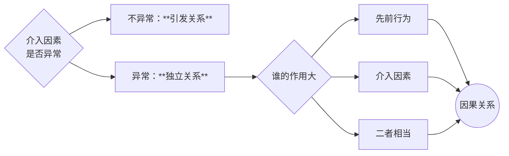
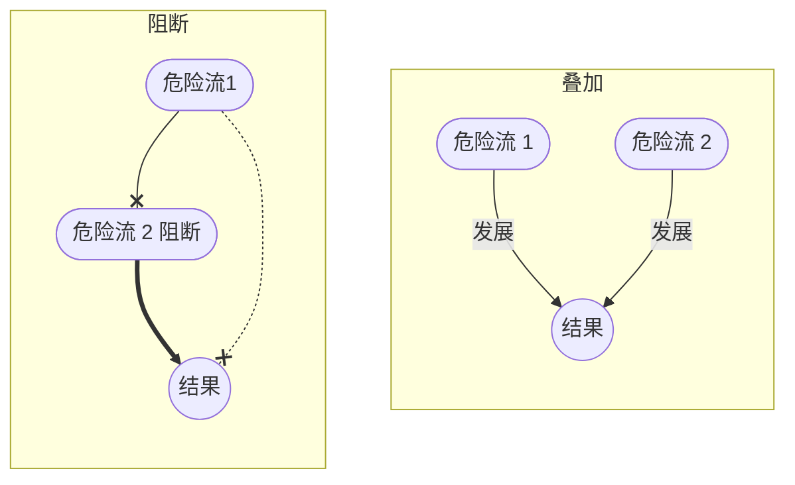

# 第一节：行为主体

>犯罪主体是实施危害行为并依法负刑事责任的自然人或单位。

## 一、自然人

1. **身份犯的分类**
    - **真正的身份犯**：特殊身份是定罪的必备要件。
	    - eg.*不具备此身份的人不能单独构成该罪。此身份必须在犯罪开始时就具备，且只针对实行犯（含[[VIII 共同犯罪#间接正犯|间接正犯]]）*。
    - **非真正的身份犯**：特定身份是量刑时从轻或从重的条件。
        
2. **国家工作人员的认定**
    - 核心标准：**是否从事公务**。
    - **四类国家工作人员**：
        1. 国家机关中从事公务的人员。
        2. 国有公司、企业、事业单位、人民团体中从事公务的人员。
        3. 国家机关、国有企事业单位委派到非国有单位从事公务的人员。
        4. 其他依照法律从事公务的人员（以国家工作人员论）。
    - **村基层组织人员的认定**：根据立法解释，村委会等人员协助人民政府从事救灾、扶贫、土地管理、征税、计划生育等行政管理工作时，属于“其他依照法律从事公务的人员”。

## 二、单位犯罪

> [!cite] 法条
>[[刑法#第三十条|第30条]] **公司、企业、事业单位、机关、团体**实施的危害社会的行为，法律规定为单位犯罪的，应当负刑事责任。
>
>[[刑法#第三十一条|第31条]] 单位犯罪的，对单位判处罚金，并对其直接负责的主管人员和其他直接责任人员判处刑罚。本法分则和其他法律另有规定的，依照规定。


### 1. **构成要件**：

1. **主体资格**：必须是公司、企业、事业单位、机关或团体。
	
	- **注意**：为犯罪设立或以犯罪为主要活动的单位、无法人资格的合伙企业和个人独资企业不属于单位犯罪主体。
		
	- 一人公司、单位分支机构或内设机构名义犯罪，且违法所得归该机构，可构成单位犯罪。
		
2. **主观要件**：必须有**单位的意志**。
	
	- 由**单位决策**机构形成，或单位领导/职员**为单位谋取利益**而决策。
		
	- 以下情况**不构成**单位犯罪：
		- 盗用、冒用单位名义实施犯罪，为个人谋取非法利益，违法所得归个人所有。
		- 单位内部成员未经单位决策机构同意、认可而实施犯罪，为单位或个人谋取非法利益。
		- 单位内部成员实施与其职务活动无关的犯罪行为

> [!caution] 注意
>单位犯罪可以是故意，也可以是过失

3. **谋取利益**：必须为**单位**谋取不正当利益。
	
4. **法定性**：法律必须明文规定该罪可由单位构成，才成立单位犯罪。
	- 传统的**自然犯**都没有单位犯罪，
	- **暴力犯罪**不可能由单位构成，
	- **货币犯罪**是没有单位犯罪的
		- 但是走私假币罪是有的；
	- **金融诈骗罪中有三种**犯罪没有单位犯罪，只能由自然人构成：贷款诈骗罪、信用卡诈骗罪、有价证券诈骗罪。

### 2. 分类

1. 纯正的单位犯罪
	- 只能由单位构成而不能由自然人构成的犯罪。

2. 不纯正的单位犯罪
	- 既可以由单位构成，也可以由自然人构成的犯罪。

### 3. 处罚规则
>[[刑法#第三十一条]]

- **一般原则**：**双罚制**，即同时处罚负责的主管人员和其他直接责任人员
	
- **特殊情况**：
	
	- **单罚制**：只处罚直接责任人，不处罚单位。
		
	- **单位被撤销、注销等**：追究直接责任人员的刑事责任，对单位不再追诉。
		
	- **单位被合并**：仍追究原犯罪单位责任，但罚金以其并入新单位的财产为限。
		
	- **单位实施纯正的自然人犯罪**：直接追究责任人的自然人犯罪。
            
> [!caution] 注意
>①个人为进行违法犯罪活动而设立的公司、企业、事业单位实施犯罪的；公司、企业、事业单位设立后，以实施犯罪为主要活动的，不属于单位犯罪，而是个人犯罪。
>②无法人资格的合伙企业和个人独资企业，不能成为单位犯罪的主体。 
>③单位的所有制不影响单位犯罪的成立。
>④依法成立的具有独立法人资格的一人公司也可以成立单位犯罪。
>⑤以单位的分支机构或者内设机构的名义实施犯罪，违法所得归该机构所有，可成为单位犯罪的主体。
>⑥外国公司、企业、事业单位在我国领域内犯罪，适用我国单位犯罪的规定。
 

# 第二节：危害行为
	对法益有侵害的行为，创设法律不允许的危险

## 一、危害行为的特征

1. 构成要件中的危害行为必须是**客观上危害社会的行为**
	
	- **有体性**：必须是客观上的行为，而非单纯思想。
	- **有意性**：行为出于人的意志支配。
		- eg. *排除「梦游」等情况*
	- **有害性**：对刑法保护的法益造成实际损害或危险。
		- eg.*排除没有法益侵害性的行为*
		- eg.*迷信行为不构成危害行为（扎小人），不产生法益侵害性*
	    
- **注意**：
	- （虽创设危险但）社会允许的行为
		- *蹦极*，*驾车*
	- 减少法益侵害的行为
		- *张三与李四一前一后走在路上，李四眼看落砖将砸到张三，本该造成重伤，李四用网球拍接下落砖，但缓冲后仍构成轻伤*
	- 危险替代行为均不属于危害行为
		- *李四推了张三一把致其摔伤，摔伤替代了落砖的危险*


## 二、作为与不作为

- **所违反的规范**： 
	- **作为**——禁止性规范；
	- **不作为**——义务性规范；

- **与法益状态的关系**：
	- **作为**——从无到有或从小到大地制造危险；
	- **不作为**——已有危险而不消除。
		- $\neq$没有积极的身体举动

- 刑法以处罚作为犯为原则，不作为犯为例外
- 作为与不作为的区分并不是绝对的，两者会产生竞合或者结合
	- 竞合时，优先考虑作为犯

### （一）不作为犯的分类成立条件

1. **真正不作为犯**：
	- 只能通过不作为形式构成，义务来源于刑法明文规定（如遗弃罪）。
    
2. **不真正不作为犯**：
	- 以不作为形式实施通常由作为构成的犯罪（如不救助而致人死亡的故意杀人罪）。
    
### （二）**不作为犯的成立条件**

####  1. 客观要件

##### （1） 应为：存在作为义务

1. **形式的法义务说**：（容易导致作为义务过宽过窄）
	-  形式上的义务来源主要有以下几个方面：
		1. 法律规定的义务；
		2. 行为人职务或业务产生的义务；
		3. 行为人的法律行为产生的义务，
		4. 先行行为引起的义务。

2. **实质的法义务说**：
	- 行为人处于阻止危险发生的支配地位


![[实质二分说体系架构.png]]
	实质二分说：具有阻断危险源对法益对象造成危害的危险流的义务

###### （1） **对危险源的监管义务**

1. **对危险物的管理义务**。
	- *矿山负责人对矿山，机动车驾驶人对机动车，宠物主人对宠物*
2. **对他人危险行为的监管义务**。
	- 父母对被监护人
3. **对自己先行行为的监管义务**——先行行为对法益创设了法律不允许的危险。
	- ==降低危险的行为，和被害人自陷风险的行为，不产生作为义务。==
		- *张三将荒郊野岭的弃婴放在民政局门口，结果第二天婴儿死亡*
		- *甲乙两人恋爱闹分手，甲以自杀相逼不分手，结果真的跳了*
	- ==被害人的法益对行为人形成依赖关系，产生作为义务==
		- *张三将弃婴拾走回家抚养，养了三天嫌烦放回原处*

- **几种特殊的先行行为**：==过失犯罪==，==故意犯罪==，[[IV 违法阻却事由#第二节：紧急避险|紧急避险]]都可以成为先行行为而产生作为义务。
> [!example] 案例
> - 张三擦枪走火打中李四，李四失血过多而死
> - 张三殴打李四，心生悔意欲救治，路人教唆张三逃跑，李四重伤死亡
> - 航标船案：

> [!faq] 正当防卫可以产生作为义务吗？
> - 案例1：甲欲杀乙，乙反击，乙将甲打成重伤，甲求乙救自己，乙没救，甲死亡。——乙的正当防卫不产生救助义务。
> - 案例2：甲欲伤害乙，乙反击，将甲打成重伤，乙不救助甲，致甲死亡。乙是否有救助甲的义务？
> 	- 多数说：乙有义务救助甲，乙防卫过当，乙**有防止过当结果发生的义务**，甲的死亡由于乙的作为由于不作为行为共同导致
> 	- 另一种观点：乙无义务救助甲，反击行为正当，正当行为不具有救助义务

- [[IV 违法阻却事由#第一节：正当防卫|正当防卫]]如何产生作为义务？
	- 防卫行为如果导致过当结果，防卫人有防止过当结果发生的义务。

###### （2）对法益对象的保护义务

1. **基于特定关系**：法益处于无助（脆弱）的状态，而行为人与其基于特定的关系而产生保护义务。
	1. 基于**法律规范**产生的保护义务。
		- 其他法律法规所规定的义务**必须经过刑法的确认**。
	2. 基于**职务、业务**等所产生的保护义务。
	3. 基于**合同契约**产生的保护义务。
		- 合同违约、超期不影响保护义务
	4. 基于**自愿承担**而产生的保护义务：依赖关系

2. **基于特定领域**
	- 行为人是特定领域的管理者（是特定领域的主人）
	- 行为人对特定领域内的危险具有排他的支配作用（只能依赖你来救）。

> [!example] 例子
> - 演出场所的管理者对他人表演淫秽节目具有管理义务
> - 嫖客在卖淫女家中嫖娼，突发心肌梗塞，卖淫女应当救助

##### （2）能为：行为人有履行该义务的能力

##### （3）不为：不履行义务

1. 履行该义务有**防止结果发生的可能性**
	- 结果避免的可能性

> [!example] 肇事逃逸
> 小芳开车撞伤行人狗蛋，狗蛋 5 分钟后必死无疑。小芳情急之下驾车离开，5 分钟后狗蛋死亡。 
> ——问：小芳构成因逃逸致人死亡吗？
> 
> 不构成。
> 刑法为行为人规定作为义务的意义在于：作为能够避免结果发生，或者有避免结果发生的可能性。此时如果不具有结果避免的可能性，作为与不作为之间没有实质区别。
> 本案中，小芳履行义务也不具有结果避免的可能性，她的不救助与受害者死亡之间不构成因果关系，因此不构成逃逸致人死亡。

#### 2. 主观要件

> [!tip] 
>不作为犯罪既可以是过失犯罪，又可以是故意犯罪

1. 主观上有故意或过失
	- 不作为犯罪可以由故意构成，也可以由过失构成

---
# 第三节：行为对象、危害结果和行为状态

## 一、行为对象

1. **什么是行为对象**
	-  行为对象是指行为所作用的人或物。
		- 选择性要素，而非必备要素。
		- 任何犯罪都会侵害法益，但不一定都存在犯罪对象

2. 行为对象与法益既有联系又有区别。
	- 侵害的行为对象相同$\neq$侵害法益相同
		- 都是盗窃机动车，警察偷和普通人偷都一样，但侵害的法益不同

## 二、危害结果

- **定义**：危害结果是指行为对**刑法所保护的法益**所造成的实际损害结果或现实危险。
	1. **实害结果**（侵害结果、危害结果），是指行为对法益造成的现实侵害事实（子弹正中眉心）。
	2. **危险**，是指行为对法益造成的现实危险状态（子弹擦耳而过）。

- **分类**：
    - **实害犯**：犯罪成立必须具备实害结果（如故意伤害致人死亡）。
	    - 过失犯均为实害犯/结果犯
        
    - **危险犯**：犯罪成立只需具备一定的危险。
        - **具体危险犯**：危险需司法认定（如非法捕捞水产品罪）。
	        - *放火罪是危害公共安全的罪，如果不足以对公共安全形成危险则不构成（比如火苗太小、扑灭太快）*
        - **抽象危险犯**：危险由立法推定，行为犯
	        - 不是现实紧迫的危险，是立法者推定的行为中蕴含的危险
		        - *酒精含量达标成立醉驾，即使「没醉」*

> [!note] 行为犯与结果犯
>- **行为犯**：不要求实害结果作为犯罪的成立条件（eg.*伪证罪、生产销售假药罪*）
>- **结果犯**（**实害犯**）：要求实害结果作为犯罪的成立条件（eg.*滥用职权罪、所有过失犯罪*）

> [!tip] 结果加重犯
>>[!example] 鲁智深拳打镇关西
>>鲁智深不具备杀死镇关西的主观意图，不能定故意杀人罪的既遂。鲁智深只有伤害镇关西的意图，因此成立故意伤害罪。然而，鲁智深过失致人死亡，因此定罪：
>>鲁智深——故意伤人罪过失致人死亡，加重处罚情节 10 年到死刑。
>
>上例是一个典型的结果加重犯。$$行为制造 [基本结果 \land 加重结果] \land 法律明确规定 [对加重结果加重处罚] \rightarrow 结果加重犯$$
>

1. **结果加重犯的分类**
	1. 对加重结果**只能持过失心理**
		eg. *故意伤害罪致人死亡、非法拘禁罪致人重伤死亡、暴力干涉婚姻自由罪致人死亡、虐待罪致人死亡、抢夺罪（共性：都有暴力性）*
	2. 对加重结果**既可以持过失、也可以持故意心理**
	 		eg. *抢劫、强奸、拐卖、放火致人重伤死亡*

2. **结果加重犯与想象竞合犯**

> [!note] 想象竞合犯
> `想象竞合，择一重罪论处`
> 一个行为同时触犯了数个不同罪名，最后在这些想象中的罪名中选择最重的罪名论处

- 结果加重犯，是想象竞合犯的一个特殊情况（或者说，是一个例外）
	- 结果加重犯同样是一个行为同时触犯了多个不同罪名，但是在择一重罪的基础上，附加其他罪名作为加重处罚情节

3. **结果加重犯的因果辨认**

> [!note] 行为与目的同时存在原则
>```mermaid
>graph LR
>暴力行为-->目的--> A & B & C
>A[伤害目的]-->故意伤害
>B[取财目的]-->抢劫
>C[奸淫目的]-->强奸
>```
>一个暴力行为可以成立众多罪的实行行为，而其定性由目的决定。

## 三、行为状态

- **定义**：成立构成要件中所规定之行为所需具备的时间、地点和方法等状态
    
- **功能**：
	1. 对某些犯罪而言，行为状态是必备要素。例如：[[刑法#第三百四十条|340条]]【非法捕捞水产品罪】
	2. 对某些犯罪而言，行为状态是法定刑升格的条件或从重处罚的情节。
	3. 对大部分犯罪而言，行为状态可以成为量刑的酌定情节。

---
# 第四节：因果关系与结果归属

> [!tip] 因果关系解决的是：
>- ==故意犯罪==：**既遂**与否。行为与结果的因果关系$\leftarrow$成立既遂。
>- ==结果加重犯==：**成立**与否。基本行为与加重结果的因果关系$\leftarrow$成立结果加重犯
>- ==过失犯罪==：**成立**与否。过失行为与实害结果的因果关系

## 〇、做题顺序

- [ ] 「因」是否符合要求
- [ ] 「果」是否符合要求
- [ ] 「因果之间」是否有关系

## 一、因果关系的传统理论

1. （必要）**条件说**——非A则非B。

2. **相当因果关系说**
	- 以条件说为基础，在有事实因果关系的基础上进行“相当性”判断。
		- **相当**：该行为产生该结果，在日常生活中是一般的而非**异常**的
	- 以行为时[[1. 法律行为的成立#客观主义|一般人的认识]]为标准

3. **客观归责说**

## 二、刑法上因果关系判断的前提
>调和相当因果关系说与客观规则说

1. 对**行为**（因）的要求
	- 必须是[[III 犯罪的客观构成要件#第二节：危害行为|危害行为]]，对法益创设了<u>法律所不允许的危险</u>。
	- 必须是**实行行为**（不包括预备行为）。

> [!caution] 注意
> 没有因果关系只是意味着该行为不成立某一犯罪的**既遂**，**并不意味着不构成犯罪**。
> - 妻子欲毒死丈夫，在茶水中下了毒，其闺蜜不知情喝下，死亡。
> - 妻子毒死闺蜜不具有因果关系

2. 对**结果**的要求
	1. 结果得是==**现实发生**==（实害结果，不包括危险）的结果，不讨论假设的因果关系。
		- *甲性命悬殊一裂绳，绳子还剩 1 分钟断开，乙剪断绳子。乙辩称：非 A 则非 B，反正绳子也得断。但是：不讨论没有发生的一分钟后的假设情况*
	2. 结果得是==**规范保护范围内**==的结果。
		- 结果得是所创设的**法所不允许的危险之发展**
		- 包括：
			- 具体罪名的罪状规范
			- 过失犯罪的注意义务规范
	3. 防止结果的发生==**属于他人的责任领域时**==，不能将结果归责于行为人。

## 三、因果关系的判断步骤

- **Step1**： 根据条件说得出**事实因果关系**
    - **特殊情况**：
        - **假定因果关系**：❌不认为是刑法上的因果关系。
	        - 虽然某行为导致结果发生，但如果没有此行为，其他情况也会导致结果发生。
            
        - **重叠因果关系**（多因一果）：✅各行为与结果均有因果关系。
            - 两个独立发生的行为，单独地都不会导致结果发生，但这两个行为重叠在一起共同导致了结果的发生。
            
        - **竞合因果关系**：✅各行为与结果均有因果关系。
	        - 两个行为，分别都能够单独地导致结果发生，但是行为人在没有意思联络的情况下，各自同时发生作用，竞合在一起导致了结果的发生。
            
        - **被害人特殊体质**：
	        - 危害行为引发疾病发作的，✅存在因果关系；
	        - 其他因素引发疾病的，❌无因果关系。
            
- **Step2**：**法律因果关系（相当性判断）**：在事实因果基础上，价值判断行为与结果之间的关联性是否具有“相当性”，是生活行为还是异常行为。

> [!caution] 注意
>- 因果关系具有客观性
>- 有因果关系不一定构成犯罪（因果关系在第一阶层，还有考虑其他阶层，link.[[II 犯罪概说#2. 阶层论|三阶层]]）
>- 没有因果关系，不意味着不构成犯罪，只意味着是否既遂未遂

## 四、介入因素与因果关系

介入因素两步走



- **判断原则**：从事后一般人的立场，判断介入因素与先前行为是否具有**高度关联性**。
    - **有高度关联性**：先前行为制造的危险蕴含了介入因素的危险。
	    - **不阻断**因果关系
    - **无高度关联性**：
        - **叠加**：介入因素与前行为共同导致结果，均有因果关系。
        - **阻断**：介入因素独立导致结果，仅与介入因素有因果关系。



- **介入因素种类**：
	- 自然事件
	- 被害人自身行为
	- 第三者行为
	- 介入行为人行为。

## 五、不作为犯的因果关系

- **核心**：判断不履行义务的行为是否是结果发生的原因，关键在于是否存在“[[III 犯罪的客观构成要件#（3）不为：不履行义务|结果避免的可能性]]”。


