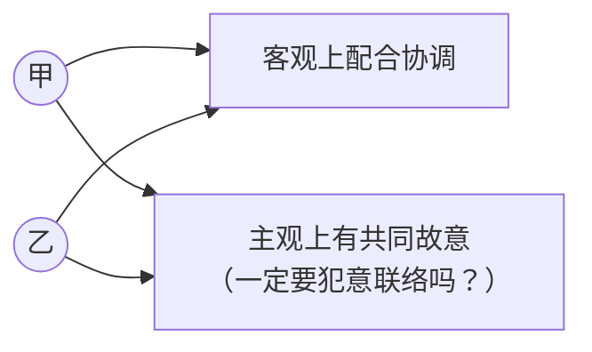
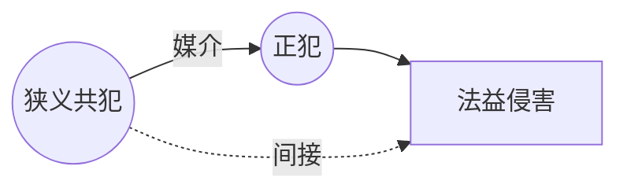
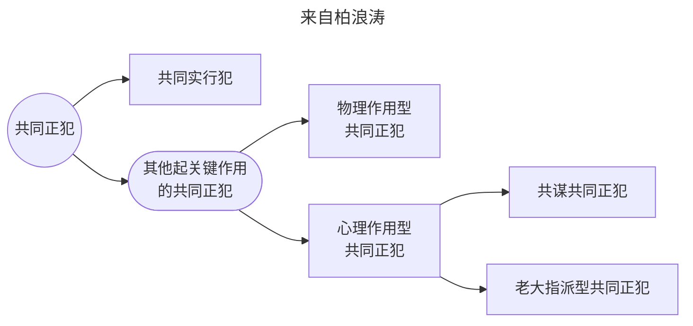
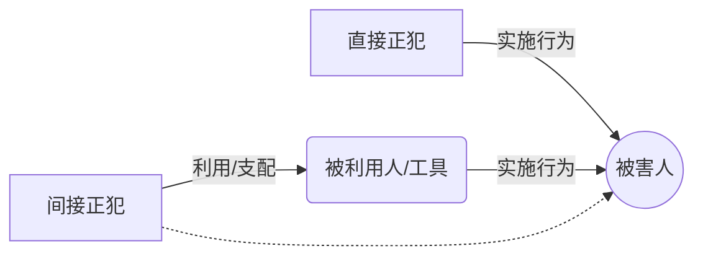
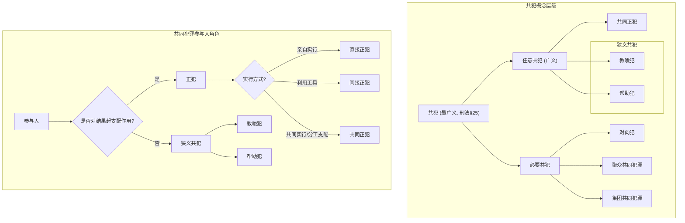

# 关键要点 (Key Concepts / Takeaways)

* **共同犯罪定义**: 指二人以上**共同故意**犯罪。共同过失不以共同犯罪论处。
* **共同犯罪本质**: 责任分担的根据，解决“部分行为，全部责任”的问题。
* **认定方法**: 以**不法为重心**（符合构成要件且违法）、**正犯为中心**、**因果性为核心**。
* **共同性要求**: 采**部分犯罪共同说**，不要求犯意完全相同或罪名相同，在重合范围内成立共犯。核心是**行为共同**，违法连带，责任个别。
* **共同犯罪分类**:
    * **任意共犯**: 单个人可构成的犯罪由二人以上实施。
    * **必要共犯**: 法律规定必须二人以上实施的犯罪（如对向犯、聚众犯、集团犯）。
* **参与人角色**:
    * **正犯**: 实现构成要件，对结果起支配作用（直接正犯、间接正犯、共同正犯）。
    * **（狭义）共犯**: 未实行构成要件行为，仅教唆或帮助（教唆犯、帮助犯）。
* **区分标准**: **犯罪事实支配说**是区分正犯与共犯的核心标准。
* **共犯从属性说**: 共犯的可罚性依赖于正犯的行为（至少达到着手实行），但责任认定是个别的。
* **共同正犯**: 二人以上共同实施实行行为，有共同犯意联络。特点是“部分实行，全部责任”。包括共同实行犯和共谋共同正犯。
* **间接正犯**: 利用无责任能力人、无故意者、有阻却违法事由者等作为工具实现犯罪。
* **教唆犯**: 使原本无犯意者产生犯意并实施犯罪。处罚根据其作用定，教唆未成年人从重。
* **帮助犯**: 为他人犯罪提供物质或精神帮助。处罚上通常为从犯。
* **特殊形态**：承继共犯（中途加入）、片面共犯（单方认识）、不作为共犯、实行过限（超出共同故意）。
* **处罚原则**: 根据在共同犯罪中的作用分为主犯、从犯、胁从犯分别处罚；教唆犯按其作用处罚。


# 第一节 共同犯罪的基本理论

> [!tip] 从[[II 犯罪概说#（一）三阶层 & 四要件|三阶层体系]]来看
>共同犯罪是**构成要件该当性阶层**的一种特殊现象：特殊在造成违法事实的有多个人（所谓违法是一起的）；而评价则是分别评价的（所谓责任是独立的）

## 一、共同犯罪的概念

> [!cite] 《中华人民共和国刑法》[[刑法#第二十五条|第二十五条]]
> 共同犯罪是指二人以上共同故意犯罪。
> 
> 二人以上共同过失犯罪，不以共同犯罪论处；应当负刑事责任的，按照他们所犯的罪分别处罚。



* **核心要素**
    1.  **二人以上**: 参与者需为两人或以上（含单位）。
    2.  **共同行为**: 客观上存在相互配合、协调的犯罪行为。
    3.  **共同故意**: 主观上各参与人认识到自己是在和他人共同实施犯罪，并希望或放任危害结果发生（**关键**）。
        * 不要求故意内容完全相同，可在重合范围内成立共同犯罪（部分犯罪共同说）。
* **共同过失**: 不成立共同犯罪，按个人责任分别处罚。

> [!faq] 共同犯罪解决什么问题？
共同犯罪理论旨在解决多人共同造成一个危害结果时，如何确定各参与人的刑事责任，特别是确立“**部分行为，全部（或部分）责任**”的依据。

## 二、共同犯罪的认定方法

* **以不法为重心**: 共同犯罪首先要求行为共同符合构成要件且具有违法性。**所有讨论都局限在不法阶层。**
* **以正犯为中心**: 共同犯罪的成立与发展围绕[[VIII 共同犯罪#第三节 正犯与（狭义）共犯|正犯]]（≈[[VIII 共同犯罪#]]实行犯）的行为展开。
* **以因果性为核心**: 各参与人的行为需对最终的危害结果具有因果关系（物理或心理上的）。

## 三、共同故意的程度要求

* **早期理论**: 完全犯罪共同说（要求犯意、行为、罪名完全相同），已被抛弃。
* **通说**: **部分犯罪共同说**。
    * 不要求各参与人故意内容完全一致或构成同一罪名。
    * 只要在某个犯罪构成要件的范围内存在共同故意和共同行为，即可在该范围内成立共同犯罪。
    * *例1：甲想杀人，乙想伤人，共同殴打丙致死。两人在故意伤害（至少轻伤）范围内有共同故意，成立故意伤害罪共犯。对死亡结果，甲成立故意杀人既遂，乙若无杀人故意则成立故意伤害（致人死亡）。*
* ==行为共同说==（多数说，但与我国刑法规定不符）: 强调客观行为的共同性，主观上不强求具体罪名的认识一致，也不要求定相同罪名。

## 四、共同犯罪的原理

* **违法是连带的**：共同犯罪行为作为一个整体评价其违法性。只要共同实施了违法行为，即可成立共同犯罪的基础。
* **责任是个别的**：各共同犯罪人承担刑事责任的大小，需根据其**各自的主观罪过、在共同犯罪中的地位和作用、具体行为情节**等单独评价。
    * 不要求责任相同。
    * *例1：18岁的乙为10岁的甲（无责任能力）放风盗窃。乙单独构成盗窃罪的帮助犯。*
    * *例2：甲（强奸故意）与乙（抢劫故意）共同对丙施暴致死。甲乙在暴力行为（可能构成故意伤害）上有共同故意，可成立故意伤害罪共犯。甲最终行为构成强奸致人死亡（或故意杀人），乙构成抢劫致人死亡。*

---
# 第二节 共同犯罪的分类

## 一、根据结构分类

1.  **任意共犯 (任意共同犯罪)**:
    * 指刑法分则规定**原本可由一人单独实施**的犯罪，实际上由二人以上共同实施的情况。
    * 这是刑法总则共犯理论主要调整的对象。
    * 包括：共同正犯、教唆犯、帮助犯。
2.  **必要共犯 (必要共同犯罪)**:
    * 指刑法分则**明文规定必须由二人以上**共同实施才能构成的犯罪。
    * 排除刑法总则关于共犯的适用
    * **类型**:
        * **对向犯 (对合犯)**: 需要二人以上相互对向的行为才能构成犯罪。
            * 罪名相同: 重婚罪、代替考试罪、非法买卖枪支罪。
            * 罪名不同: 受贿罪 vs 行贿罪；拐卖妇女罪 vs 收买被拐卖妇女罪。
            * 片面对向犯: 只处罚一方。如贩卖淫秽物品牟利罪（只罚卖方）。
        * **聚众共同犯罪**:
            * 注意区分“聚众犯罪”（不一定是共犯，如聚众扰乱公共场所秩序罪只罚首要分子）与“聚众共同犯罪”（如两个以上首要分子共同组织策划）。
        * **集团共同犯罪**: 三人以上有组织的犯罪集团成员共同实施犯罪。

```mermaid
graph LR
    A["共犯 (最广义)"] --> B[任意共犯];
    A --> C[必要共犯];
    C --> C1[对向犯];
    C --> C2[聚众共同犯罪];
    C --> C3[集团共同犯罪];

    B["任意共犯 (广义)"] --> D[共同正犯];
    B --> E[教唆犯];
    B --> F[帮助犯];

    subgraph 狭义共犯
        E;
        F;
    end

````

## 二、根据分工分类

这同时也是任意共犯内部的角色分类，具体见下节[[VIII 共同犯罪#第三节 正犯与（狭义）共犯]]

1. **正犯**:
    
    - **定义**: 实施符合刑法分则规定的构成要件行为，对法益侵害结果或危险**起支配作用**的人。
        
    - **分类**:
        
        - 按**方式**（见[[VIII 共同犯罪#第五节 间接正犯]]）
            
            - **直接正犯**: 亲自实行构成要件行为。
                
            - **间接正犯**: 利用他人（无责任能力、无故意、有阻却事由者等）作为工具实施犯罪。
                
        - 按**人数**:
            
            - **单独正犯**: 一人实行。
                
            - **共同正犯**: 二人以上共同实行，共同对犯罪起支配作用。
                
2. **（狭义）共犯**（见[[VIII 共同犯罪#第六节 狭义共犯：教唆犯，帮助犯]]）
    
    - **定义**: 未直接实施构成要件行为，也未对结果起支配作用，仅通过**诱导**（教唆）或**提供帮助**（帮助）参与犯罪的人。
        
    - **分类**:
        
        - **教唆犯**: 使他从无到有地产生犯意。
            
        - **帮助犯**: 为他人实行犯罪提供心理或物理上的支持。
            


```mermaid
graph LR
    A[共同犯罪参与人] --> B[正犯];
    A --> C[狭义共犯];

    B --> B1{按方式};
    B1 --> B1a[直接正犯];
    B1 --> B1b[间接正犯];

    B --> B2{按人数};
    B2 --> B2a[单独正犯];
    B2 --> B2b[共同正犯];

    C --> C1[教唆犯];
    C --> C2[帮助犯];

    style B fill:#pink
    style C fill:#lightgreen
    style B1b fill:#orange
```

## 三、按照作用分类

这是我国刑法所采用的，[[VIII 共同犯罪#一、处罚根据的分类方法|处罚根据的的分类方法]]

1. **主犯**：起主要作用
2. **从犯**：起次要作用
3. **胁从犯**：被胁迫参与犯罪

---
---
# 第三节 按分工：正犯与（狭义）共犯

## 一、区分标准：犯罪事实支配说

- **核心**: 判断行为人对最终法益侵害结果或危险的发生是否起到了**支配性作用**。
    
- **正犯的类型**:
    
    - **行为支配 (直接正犯)**: 亲自实施构成要件行为。
        
    - **意志支配 ([[VIII 共同犯罪#第五节 直接正犯与间接正犯|间接正犯]])**: 控制、利用他人实施。
        
    - **功能支配 ([[VIII 共同犯罪#第四节 共同正犯|共同正犯]])**: 通过分工合作，共同对整体犯罪起实质支配作用。
        
- **共犯**: 不具有支配作用，仅起促进或辅助作用。

## 二、共犯的处罚根据：因果共犯论

- 共犯通过**正犯的实行行为**作为媒介，间接引起法益侵害结果。



## 三、共犯与正犯的关系：共犯从属性说 (通说)

- **核心**： 共犯的成立与可罚性**依赖于**正犯的行为。**无正犯即无共犯**。
    
- **要求**: 正犯的行为必须**至少达到[[VII 犯罪的特殊形态#二、犯罪形态与犯罪阶段|着手实行]]犯罪**的阶段，使法益受到**具体的、紧迫的危险**，此时共犯（教唆、帮助）才具有可罚性。
    
    - _例1：甲教唆乙杀人，乙根本无意。乙不构成犯罪，甲的教唆行为不可罚。_
        
    - _例：甲提供毒药给乙杀丙，乙在路上扔掉毒药。乙构成故意杀人中止（预备阶段），甲构成故意杀人帮助（预备阶段）。_

> [!faq] 为什么这么要求？
>“共犯”判断是客观阶层的工作，狭义共犯以正犯的实行行为为媒介引起法益侵害结果，若无正犯的实行则不会引起法益侵害，因此没有构成要件该当性，不可罚

- **从属性范围**: 仅限于**违法性层面**。即，需要有正犯实施了符合构成要件的违法行为。
    
- **责任个别**: 共犯的**责任**（罪过形式、责任能力、责任阻却事由等）仍需**独立判断**。
    
    - _例：20岁的乙为13岁的甲（相对无责任能力）望风盗窃。甲的行为违法，乙的帮助行为从属于甲的违法行为，但责任上，甲可能不负刑责，乙仍需承担盗窃罪（帮助犯）的责任。_
        

# 第四节 共同正犯

## 一、违法性阶层

- **基础条件**
	1. **二人以上**: 指具有共同犯罪故意的参与者。不要求都具有完全责任能力。
	    
	2. **共同实行行为**: 各参与人实施了**构成要件**行为，或对构成要件的实现起到了关键作用的行为。可以是物理上的分工合作。
- **核心条件**
	1. **共同行为意思 (意思联络)**: 各参与人认识到自己是在**与他人共同**实施犯罪，并有共同追求或放任结果发生的意愿。
	    - **不要求故意内容（犯罪故意）完全相同。**
    
	- 关于犯意联络，有两种特殊情况
	    - **片面共犯**: 只有一方认识到共同犯罪，另一方不知情。理论上存在争议，如片面帮助（物理性）可能成立。（详见[[VIII 共同犯罪#二、片面的共同犯罪]]）
	        - _例：甲知乙欲杀丙，暗中将丙绑于乙必经之路，乙不知情杀死丙。甲可能成立故意杀人罪（帮助犯）。_
            
	    - **同时犯**: 二人以上无意思联络，各自独立实施犯罪侵害同一对象。不构成共同犯罪，分别定罪。
        
	        - _例：甲、乙互不知情，同时向丙开枪，甲击中致死，乙未击中。甲负既遂责任，乙负未遂责任。_
	            
	        - _例：商店失火，甲乙不约而同进去偷东西。分别构成盗窃罪。_

> [!note] 犯意联络（主观意思）为什么在构成要件该当性阶层（客观阶层）？ 
>因为这里考察主观的犯意联络不是为了考察有责性，而是为了在违法事实层面查明形成过程。

## 二、责任原则：“部分行为，全部责任”

- 在共同犯意范围内，每个共同正犯**对共同行为造成的全部结果**承担刑事责任（因为违法事实是一起干的），即使该结果并非由其直接造成。
    
    - _例1：甲乙共谋杀丙，同时开枪，仅甲击中致死。乙也对死亡结果承担故意杀人既遂责任。_
        
    - _例2：甲乙共同盗窃车辆后分赃，甲分得多乙分得少。但两人均对盗窃总额负责。_
        
    - _例3：甲乙共同强奸，甲未遂（couldn't perform），乙既遂。甲对乙的既遂行为承担共同正犯责任（强奸既遂）。_
        
- **因果关系不明时的处理**:
    
    - **共同正犯**: 若无法查明具体谁的行为导致结果（但确定是共犯之一所为），所有共犯对结果承担责任。
	    - _例4：甲乙共谋杀丙，同时开枪致死，无法确定致命一枪是谁打的。甲乙均负既遂责任。_
        
    - **同时犯**: 若无法查明谁的行为导致结果，可能导致无法追究结果责任（存疑时有利于被告）。
	    - _例5：甲乙无意思联络同时向丙开枪致死，无法查明致命枪。可能都只负未遂责任（分类讨论：①甲中的，乙未遂；②乙中的，甲未遂。存疑有利被告，分别都未遂）。
	    - 例6：过失的同时犯同理。_


## 三、共同正犯的类型

1. **共同实行犯**: 二人以上均实施或物理上分担了**构成要件行为**。
    
    - _例：甲乙共同殴打丙；甲控制被害人，乙实施奸淫。_
        
2. **（功能性）共同正犯**: 行为人未直接实施核心构成要件行为，但基于共同犯意和分工，其行为对犯罪的实现起到了**不可或缺的支配作用**。
    
    - _例：甲提供技术开锁，乙入室盗窃；甲望风，乙入室盗窃（望风行为对盗窃成功起关键作用）。_
        
    - 关键在于其行为是否构成整体犯罪计划中**功能性**的实行部分，是否**支配**了犯罪进程。
        
3. **共谋共同正犯**: 二人以上共谋犯罪，虽仅部分人实施实行行为，但未实行者基于其在共谋中的**核心作用**（如策划、指挥），仍被视为共同正犯。
    
    - _例：甲乙策划盗窃，仅甲去实施；甲提供详细诈骗方案，乙按方案成功诈骗。_


> [!caution] 注意
>正犯主要指实行犯，实行犯与[[VIII 共同犯罪#直接正犯（实行犯）|直接正犯]]可以等同使用
>>[!note] 实行犯
>>“实行犯”是指行为人**亲自实施了犯罪构成要件中所规定的“客观方面行为”（即犯罪的实行行为）**，从而完成或正向实施犯罪的那一位。也就是说：该行为人通过其自己的行为直接造成或促成了犯罪事实。
>>参考 https://www.criminallaw.com.cn/article/default.asp?id=13562


## 四、不构成共同正犯的情形

1. **共同过失犯罪**：缺乏共同故意。
    
2. （争议）**故意犯与过失犯结合**：缺乏共同故意。
	- 这是部分犯罪共同说的观点。
	- 至于行为共同说，由于区分“意思联络”与“犯罪故意”，认为共同正犯的判断是客观阶层的工作而对主观责任阶层的要件在所不问，赞同“过失的共同正犯”
    
3. **同时犯**：缺乏意思联络。
    
4. **实行过限**: 部分共犯实施了**超出共同犯意范围**的行为。超出部分由行为人单独负责。
    
    - _例：甲乙共谋拐卖妇女，后乙单独强奸被拐妇女。乙对强奸行为单独负责。_

![[无法查明的四种情形.jpg]]
来自柏浪涛讲义

# 第五节 间接正犯

## 一、概念

### 直接正犯（实行犯）
- 亲手实施犯罪行为，符合主客观构成要件。
    
### 间接正犯
- 利用他人作为**犯罪工具**，通过**支配**他人的行为来实现自己的犯罪目的。
	- 被利用者通常不负刑事责任或负较轻责任。
	- 需要注意：==被利用人==可以是==被害人==




## 二、间接正犯的认定条件

- 核心在于幕后者对被利用者是否具有**意志支配力**，至于[[VIII 共同犯罪#（一）客观阶层|意志支配力如何形成]]？
	- 对比[[VIII 共同犯罪#一、教唆犯]]：二者都引起他人制造违法事实（犯意从无到有），间接正犯在此基础上还对他人有支配力。


## 三、间接正犯的常见情形

### （一）客观阶层
如何对他人形成支配力？

1. 利用**被利用者欠缺构成要件要素**:
    
    - 利用他人**无意识**的身体活动。
        
    - 利用**无身份者**实施身份犯（利用者有身份）。_例：警察甲利用保洁员乙刑讯逼供。_
        
        - 反之，无身份者不能构成身份犯的间接正犯。
            
2. 利用**被利用者行为具有违法阻却事由**:
    
    - 利用他人的**合法行为**。_例：利用邮递员送炸弹；利用他人正当防卫杀人（设计陷阱）；利用他人紧急避险行为。_
        
    - 利用被害人的**自我损害行为**（基于错误认识）。_例：骗李四说狗疯了让其杀狗。_
        
3. **被利用者欠缺责任 (无罪过或责任能力)**:
    
    - 利用他人**无故意**的行为（认识错误）。_例：让不知情者运毒；医生骗护士注射毒药。_
        
    - 利用他人**过失**行为。
        
    - 利用他人有**其他犯罪故意**的行为（对象错误利用）。_例：甲知丙在屏风后，骗乙朝屏风开枪杀丙。_
        
    - 利用**无特定目的**者实施目的犯。_例：甲有牟利目的，骗无此目的的乙传播淫秽物品；骗李四“讨债”实为绑架。_
        
    - 利用**无责任能力人**（精神病人、幼儿）。
        
        - 注意：若被利用者虽未成年但有规范意识和独立作案能力（如惯犯），则利用者对其无支配力，成立**教唆犯**而非间接正犯。
            
    - 利用他人**缺乏违法性认识可能性**的行为。_例：司法人员骗李四捕杀麻雀合法。_
        
    - 利用他人**缺乏期待可能性**的行为。
        

# 第六节 狭义共犯：教唆犯，帮助犯

>[[VIII 共同犯罪#三、共犯与正犯的关系：共犯从属性说 (通说)]]

## 一、教唆犯

> [!cite] 《中华人民共和国刑法》第二十九条
> 
> 教唆他人犯罪的，应当按照他在共同犯罪中所起的作用处罚。教唆不满十八周岁的人犯罪的，应当从重处罚。
> 
> 如果被教唆的人没有犯被教唆的罪，对于教唆犯，可以从轻或者减轻处罚。

### （一）成立条件

1. **教唆对象 (被教唆者)**:
    
    - 原本**没有**实施该特定不法行为的**意思**。如果对方已有犯意，则不成立教唆（可能成立帮助）。
        
    - 具有**规范意识**和**独立作案能力**（通常指已达责任年龄且精神正常）。
        
        - 若被教唆者不具备，则教唆者可能构成**间接正犯**。
            
    - 教唆对象必须是**特定**的人。教唆不特定多数人，可能构成**煽动类犯罪**。
        
2. **客观行为**: 实施了**教唆行为**，即**唆使、引诱、劝说、怂恿**他人产生犯意。
    
    - **区分**:
        
        - 教唆犯轻罪 → 重罪：成立重罪教唆犯。
            
        - 教唆犯重罪 → 同性质轻罪：不成立教唆犯（或帮助犯）。
            
        - 教唆犯重罪 → 不同性质轻罪：成立轻罪教唆犯。
            
        - 教唆基本犯 → 情节加重犯：若是教唆实施加重构成要件的行为（如持枪抢劫），成立教唆犯；若是教唆追求量刑加重情节（如盗窃数额巨大），成立帮助犯。
            
        - 教唆立即犯罪（原计划将来犯）：成立教唆犯。
            
    - **不要求使被教唆者产生犯罪故意**: 只要使其产生实施客观不法行为的意思即可。
	    - _例：甲骗乙将“土药”（实为毒药）给丙喝治病，乙无杀人故意，但甲仍可能成立故意杀人罪的教唆犯（或间接正犯，视对乙的支配程度）。例2：张三骗国家工作人员李四挪用公款给自己“买房应急”，李四构成挪用公款罪，张三对挪用公款成立教唆犯（即使张三实际用于贩毒）。_
        
3. **主观故意**: 具有**教唆故意**，即明知自己的行为会唆使他人犯罪，并希望或放任这种结果发生。
    
    - **过失教唆**: 不成立教唆犯。
        
    - **教唆不能犯**: 教唆他人实施客观上不可能既遂的行为（如用空枪杀人），教唆犯不成立（或按未遂处罚存疑）。
        

### （二）教唆既遂

- 教唆行为**引起**了被教唆者的实行行为，并且该实行行为造成（或着手）了所教唆的犯罪结果（或危险），且二者间有**因果关系**。
    
    - _例：甲教唆乙杀丙，乙去找丙途中遇到门卫阻拦，杀了门卫。甲对杀丙成立教唆未遂，对杀门卫不负责。_
        

### （三）处罚

- **原则**: 按照教唆犯在**共同犯罪中所起的作用**处罚（可能主犯，可能从犯）。
    
- **从重**: 教唆**不满十八周岁**的人犯罪。
    
- **从宽**: 如果被教唆的人**没有犯**被教唆的罪（包括未着手、犯了其他罪等），可以**从轻或减轻**处罚。
    
    - **理论争议 (教唆未遂)**:
        
        - 教唆独立说：只要实施教唆，被教唆者未既遂即为教唆未遂。
            
        - 教唆从属说：实行犯至少**着手**但未既遂，才成立教唆未遂。
            
    - **共同点**: 若被教唆者**着手实行**但**未遂**，教唆犯成立教唆未遂，适用从宽处罚。若被教唆者实施了**其他罪**，教唆犯在重合范围内可能成立教唆既遂。
        

## 二、帮助犯

### （一）成立条件

1. **帮助对象**: 已经**决意**实行犯罪的人（正犯）。
    
2. **客观行为**: 实施了**帮助行为**，为正犯实行犯罪**创造便利条件**或**排除障碍**。
    
    - **物质性帮助**: 提供工具、场所、信息、资金等。
        
    - **精神性(心理)帮助**: 鼓励、壮胆、谋划、提供精神支持等。
        
3. **主观故意**: 具有**帮助故意**，明知自己的行为是在帮助他人犯罪，并希望或放任。
    
    - **过失帮助**: 不成立帮助犯。
        

### （二）帮助既遂

- 帮助行为与正犯的犯罪结果（或实行行为）之间存在**因果关系**（物理或心理上的促进作用）。
    
    - 如果帮助行为对正犯的实行或结果**完全没有**起到实际作用，则可能不成立帮助犯或仅成立帮助未遂（理论上有争议）。
        
        - _例1：提供无效钥匙，盗窃未遂。帮助行为无效，不成立帮助犯或为未遂。_
            
        - _例2：提供钥匙但正犯未使用，用其他方法既遂。若提供钥匙行为未起任何心理促进作用，则不成立。_
            
        - _例3：提供钥匙并被成功使用。帮助既遂。_
            
        - _例4：提供钥匙无效，正犯改用其他方法既遂。若提供钥匙行为对正犯起到了心理支持或使其着手，则可能成立帮助既遂（或未遂）。_
            

### （三）中立的帮助行为

- 指日常生活中、业务活动中客观上可能被用于犯罪，但行为本身是中立的行为（如卖刀、提供银行开户服务）。
    
- **判断是否构成帮助犯**:
    
    - **主观上**: 是否**明知**对方将利用该行为实施犯罪。
        
    - **客观上**: 该中立行为对犯罪的发生是否起到了**实质性的促进作用**。
        

## 三、非实行行为实行化

- 指刑法分则将某些典型的**预备行为**或**共犯行为**（教唆、帮助）**直接规定为独立的犯罪构成要件**，使其本身成为实行行为。
    
- **种类**:
    
    1. **预备行为实行化**: 组织、领导、参加恐怖组织/黑社会性质组织罪。
        
    2. **共犯行为实行化**: 煽动分裂国家罪、协助组织卖淫罪。
        
- **与总则关系**:
    
    - 一旦分则有规定，优先适用分则罪名，一般不再适用总则关于预备犯、教唆犯、帮助犯的规定。
        
    - 例外：若分则罪名是针对**非特定犯罪**的预备/帮助/教唆（如传授犯罪方法罪、帮助信息网络犯罪活动罪），则总则规定仍可能适用（如教唆他人传授犯罪方法）。
        

# 第七节 共同犯罪的特殊形式

## 一、承继的共犯

- **概念**: 在他人**已经开始实施**犯罪行为之后、**犯罪既遂之前**，基于新的犯意联络加入共同犯罪。
    
- **类型**: 承继的共同正犯、承继的帮助犯。
    
- **时间要求**: 必须在**犯罪既遂前**加入。
    
    - _例1：诈骗过程中，后加入者冒充面试官。若此时诈骗结果（被害人财产损失）尚未完全确定，李四可构成诈骗罪的承继共犯。若已既遂，则李四行为可能单独构成其他犯罪。_
        
- **例外**: **继续犯**中，即使状态已持续一段时间，仍可在既遂状态持续中加入。_例2：绑架过程中，丙加入并参与勒索。丙构成绑架罪的承继共犯。_
    
- **结合犯**: 后行为人仅参与后一阶段犯罪，不构成结合犯的共犯。
    
    - _例：甲绑架杀人后，乙（无绑架故意）与甲共同处理尸体或实施其他行为。乙不构成绑架罪共犯。_
        
    - _例：甲拐卖妇女后，乙（无拐卖故意）与甲共同强奸。乙仅构成强奸罪共犯。_
        
- **责任范围**: 承继者原则上只对自己**加入后**的共同行为及其结果负责，不负责加入前的行为及结果，除非有明确的概括性共同故意。
    
    - _例1：张三打倒王五，李四加入取财，后王五死亡（因张三打击）。李四对死亡结果不负责（除非其加入时明知并接受该风险）。_
        
    - _例2：同上，但王五反抗，李四也实施暴力致死。李四对死亡结果负责。_
        
    - _例3：同上，无法查明致命一脚是谁所为。若李四加入后有共同伤害故意，则两人均对死亡结果负责。_
        
    - _例4：甲暴打乙后，丙加入共同勒索，后乙因甲的打击死亡。丙对勒索负责，对死亡结果不负责。_
        

## 二、片面的共同犯罪

- **概念**: 只有一方认识到是共同犯罪，另一方不知情。
    
- **类型**:
    
    - **片面实行**: 利用不知情者的行为。
	    - _例：乙打晕丙，甲以为丙自己晕倒而强奸。甲单独构成强奸罪，乙可能构成故意伤害罪或强奸罪的帮助犯/间接正犯。_
        
    - **片面教唆**: 通过隐蔽方式引起他人犯意。
	    - _例：张三放照片和枪引导李四杀人。张三构成故意杀人罪教唆犯（或间接正犯）。_
        
    - **片面帮助**: 一方在实行犯不知情的情况下提供帮助。通说认为**仅限于物理性帮助**（*因为假如有心理帮助那就有犯意联络而不是片面帮助了*）且**实际起作用**时才可能成立。
        
        - _例3：李四暗中望风并成功拖延房主，使张三盗窃得手。李四成立盗窃罪的片面帮助犯。_
            
        - _例4：李四暗中望风但未遇情况，未起实际作用。李四不构成帮助犯。_
            

## 三、共同犯罪与不作为犯

- **不真正不作为犯的共犯**:
    
    - **实行犯**: 必须是负有**作为义务**的人才能构成不作为犯的实行犯。无义务者不能。
        
        - _例1：哥哥丙受母亲甲之托将外甥乙（甲的孩子）遗弃。甲是遗弃罪实行犯（不作为或作为），丙是遗弃罪帮助犯（或共同正犯，取决于其作用）。_
            
    - **教唆/帮助**: 可以教唆或帮助不作为犯。
        
- **作为义务的产生与共犯**:
    
    - 先行行为（包括共同犯罪行为）可以产生作为义务。
        
    - _例1：张三伤害妇女致昏迷。A. 对路人甲强奸不阻止，构成强奸罪（不作为）。B. 对路人乙盗窃不阻止，构成盗窃罪（不作为）。_
        
    - _例2：张三李四共同伤害妇女致昏迷。A. 李四欲强奸，张三不阻止，构成强奸罪共犯（不作为）。B. 李四欲盗窃，张三不阻止，构成盗窃罪共犯（不作为）。_
        
    - _例3&4：共同入户盗窃/抢劫中，一人欲强奸，另一人不阻止。因共同犯罪行为将被害人置于危险境地，不阻止者也可能成立强奸罪共犯（不作为）。_
        

## 四、共同犯罪与实行过限

- **概念**: 共同犯罪中，部分参与人实施了**超出共同犯罪故意范围**的行为。
    
- **责任承担**: 超出部分由实施者**单独承担**责任，其他未参与或无共同故意的共犯不负责。
    
    - _例1：共同盗窃中，乙单独强奸。甲对强奸不负责（除非不阻止构成不作为共犯）。_
        
    - _例2：共同盗窃，甲被发现后单独暴力抗捕转化为抢劫。乙仅对盗窃负责。_
        
    - _例3：同上，乙也加入暴力抗捕。甲乙均构成抢劫罪共犯。_
        
    - _例4：甲教唆乙盗窃，乙转化抢劫。甲仅对盗窃负责。_
        
    - _例5：甲乙共同杀丙，甲以为已死离开，乙发现未死补刀杀死。若甲离开时无杀人既遂故意，则甲对死亡结果可能仅负未遂责任（具体需分析因果关系和主观）。_
        

# 第八节 共犯与身份、犯罪形态

## 一、共犯与身份

- **身份犯**: 指主体必须具备特定身份才能构成的犯罪。
    
- **（一）真正身份犯 (构成身份/定罪身份)**: 身份是**犯罪成立**的必要条件。
    
    - **无身份者参与**:
        
        - **一般规律**: 看**实行犯**是谁。若实行犯有身份，无身份的教唆/帮助者从属于有身份者定罪（罪名可能不同，按其参与行为定性）。若实行犯无身份，则不能构成该身份犯。若共同实行，可能想象竞合。
            
            - _例1：外人张三与保安李四共谋盗窃公司财物，李四放行。李四构成职务侵占罪（利用职务便利），张三构成盗窃罪（普通主体）。可能成立想象竞合或按吸收犯处理。_
                
            - _例2：投保人张三与保险职员李四合谋骗保。李四构成保险诈骗罪（职务便利型），张三构成保险诈骗罪（普通型）。_
                
        - **例外（司法解释特殊规定）**:
            
            - 《关于审理贪污、职务侵占案件如何认定共同犯罪几个问题的解释》：非国家工作人员与国家工作人员勾结，分别利用各自职务便利，共同侵占**本单位**财物，**按主犯性质定罪**。
                
            - _例3：国企会计甲（非）与财务总监乙（是）共同侵吞本单位财物。若乙是主犯，则甲也按贪污罪处理。_
                
- **（二）不真正身份犯 (加减身份/量刑身份)**: 身份仅影响**法定刑**的轻重。
    
    - **无身份者参与**: 无身份者与有身份者共犯，对无身份者**不适用**因身份而加重或减轻的法定刑。
        

## 二、共犯与犯罪形态

- **（一）犯罪形态的从属性**: 共犯的犯罪形态（预备、未遂、中止、既遂）**从属于**实行犯的犯罪形态。
    
    - 实行犯处于预备阶段，共犯也是预备。
        
    - 实行犯进入实行阶段（着手），共犯也进入实行阶段。
        
        - _例1：乙提供毒药，甲带毒药回家路上放弃。甲是杀人预备中止，乙是杀人帮助（预备）。_
            
        - _例2：同上，甲投毒前倒掉。甲是杀人实行中止，乙是杀人帮助（未遂或中止）。_
            
        - _例：甲入户盗窃，乙望风。甲预备被抓，乙是预备；甲预备中止，乙是预备；甲实行未遂被抓，乙是未遂；甲实行中止，乙是未遂（帮助行为已完成）。_
            
- **（二）共犯关系的脱离**:
    
    - **概念**: 共犯在犯罪过程中切断自己与共同犯罪的因果联系，不再对后续行为负责。
        
    - **意义**: 是成立**犯罪中止**的前提。
        
    - **要求**: 必须**有效消除**自己先前行为对犯罪进程的物理或心理促进作用。
        
        - **教唆犯**: 需使被教唆者放弃犯意。
            
        - **帮助犯/共同正犯**: 需消除自己行为的物理和心理因果力。
            
            - _例1：甲乙共谋盗窃，甲反悔谎称生病不去。若甲的行为对乙无心理强制力，乙单独去偷。甲可能脱离成功（中止）。_
                
            - _例2：甲提供钥匙后索回，但乙已复制并盗窃成功。甲未能消除物理因果力，脱离失败（未遂）。_
                
            - _例3：甲教唆乙盗窃后反悔，积极报警并通知被害人，阻止了乙。甲脱离成功（中止）。_
                

# 第九节 共同犯罪人的处罚原则

## 一、处罚根据的分类方法

- **作用分类法 (我国刑法采用)**: 按在共同犯罪中的**作用大小**区分。
    
    - 主犯
        
    - 从犯
        
    - 胁从犯
        
- **分工分类法 (理论分类)**: 按在共同犯罪中的**角色分工**区分。
    
    - 正犯 (主要是实行犯)
        
    - 共犯 (教唆犯、帮助犯)
        
- **关系**:
    
    - 实行犯可能是主犯、从犯、胁从犯。
        
    - 帮助犯只能是从犯或胁从犯。
        
    - 教唆犯可能是主犯或从犯。
        

## 二、具体角色的认定与处罚

1. **主犯 (刑法§26)**
    
    - **认定**:
        
        - 组织、领导**犯罪集团**的首要分子。
            
        - 在共同犯罪中起**主要作用**的其他犯罪分子（包括策划、指挥或实行关键行为者）。
            
        - **聚众犯罪**的首要分子（通常视为起主要作用）。
            
    - **处罚**:
        
        - **集团首要分子**: 按集团所犯的**全部罪行**处罚（除非有成员实施了明显超出其概括故意的行为）。
            
        - **其他主犯**: 按其所**参与**或**组织、指挥**的**全部犯罪**处罚。
            
2. **从犯 (刑法§27)**
    
    - **认定**: 在共同犯罪中起**次要**（作用较小）或**辅助**（提供帮助）作用。
        
        - 包括：作用较小的实行犯；帮助犯。
            
    - **处罚**: **应当** 从轻、减轻处罚或者免除处罚。 (注意：不是比照主犯)
        
3. **胁从犯 (刑法§28)**
    
    - **认定**: 被**胁迫**参加犯罪的（区别于被引诱）。
        
    - **处罚**: **应当** 按照其犯罪情节**减轻处罚或者免除处罚**。
        
    - 注意：胁从犯也可能转化为其他角色。与间接正犯的工具有本质区别（胁从犯仍有一定选择自由）。
        
4. **教唆犯 (刑法§29)**
    
    - **处罚**:
        
        - 按其在共同犯罪中的**作用**处罚（可能主犯，可能从犯）。
            
        - 教唆不满18周岁的人犯罪的，**应当从重处罚**（包括间接正犯利用未成年人的情况）。
            
        - 若被教唆人未犯被教唆之罪，**可以从轻或者减轻处罚**。
            

# 法条与条号

- **《中华人民共和国刑法》**
    
    - 第二十二条 (犯罪预备)
        
    - 第二十三条 (犯罪未遂)
        
    - 第二十四条 (犯罪中止)
        
    - 第二十五条 (共同犯罪定义；共同过失)
        
    - 第二十六条 (主犯；犯罪集团；处罚原则)
        
    - 第二十七条 (从犯；处罚原则)
        
    - 第二十八条 (胁从犯；处罚原则)
        
    - 第二十九条 (教唆犯；处罚原则)
        

# Mermaid 可视化

代码段



# 假设与备注

- **内容来源**: 本笔记主要依据 `第八章.pptx` 幻灯片（编号 345-702）的内容和结构进行整理，并引用了 `中华人民共和国刑法.md` 中第25至29条的原文作为法律依据。
    
- **理论采纳**: 笔记采纳了PPT中介绍的主流刑法理论观点，如部分犯罪共同说、犯罪事实支配说、共犯从属性说等。对于理论争议点（如片面共犯、教唆未遂的界定），简要提及了不同观点。
    
- **案例应用**: PPT中的案例被用作解释和区分不同概念（如预备与实行、未遂与中止、正犯与共犯、承继共犯与实行过限等）的示例。
    
- **结构与格式**: 笔记结构遵循PPT章节安排，使用Markdown语法，包括标题、列表、引用块和Mermaid图表，力求清晰易懂。
    
- **引用**: 根据用户前一轮指令，本笔记未包含 `` 格式的内联引用。