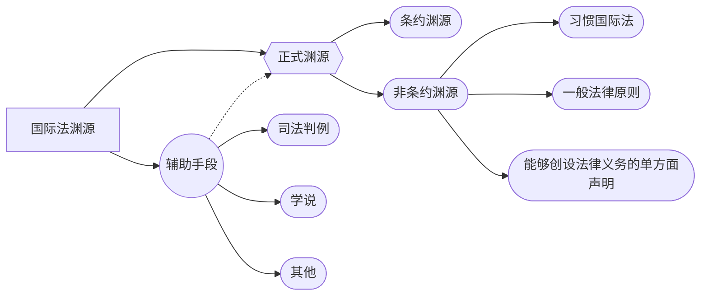

# 一、国际法的定义

> [!cite] 
> 1. “主要调整国家之间关系的有拘束力的法律原则、规则和制度的总称”
> [王铁崖主编：《国际法》，法律出版社，北京,1995]。
> 2. "International law is the body of rules binding on States in their relations with one another, and determining their mutual rights and obligations. Although the system of international law also includes non-State entities such as international organisations , that very system is owed to the existence of the community of independent sovereign States. The law governing relations between States is international law properly so-called (public international law), while aspects of a national legal system dealing with private law relations involving a foreign element are denoted as 'conflicts of laws'(private international law)".
> [Alexander Orakhelashvili, Akehurst's Modern Introduction to International Law, 9th ed., Routledge, London, 2022]

> [!note] 定义
>关于国际法，应当掌握几点：
> - 国际法是法律的一个分支（Law）；
> - 国际法的主体主要是国家（States）；
> - 国际法调整的对象主要是国家之间的关系（Law among Nations）；
> - 国际法的内容主要是国家的权利、义务和责任（Rights, Obligations, Responsibilities）等；
> - 国际法的形式主要是原则、规则和规范（Rules, Principals, Norms）。

# 二、国际法的性质

1. 国际法是“国际社会”的法，“国际社会”的架构与“国内社会”的架构存在本质区别。“国内社会”
是由最高权或的纵向社会（国家主权）；“国际社会”是没有最高权成的横向社会（无世界主权）。

|      | 国内社会架构       | 国际社会架构                         |
| ---- | ------------ | ------------------------------ |
| 最高权威 | 帝王；总统；主席；等   | 联合国秘书长；欧盟主席；等                  |
| 立法机构 | 议会；国会；大会；等   | 联大；欧盟议会；等                      |
| 执法机构 | 内阁；国务院；等.    | 安理会；欧盟委员会；等                    |
| 司法机构 | 法院；裁判所；检察院；等 | 国际法院；国际刑事法院；国际海洋法法庭；欧盟法<br>院；等 |
| 武装力量 | 国防军；人民军；等    | 联合国维和部队；盟军；等                   |

2. 否定国际法的法律性质
	1. 约翰•奥斯汀（John Austin，1790-1859），法的命令理论：强调主权(sovereignty）、命令（command）、制裁（sanction）三位一体：“法律是由主权所制定、并由强制力保证实施的行为规范。“The law obtaining between nations is not positive law: for every positive law is set by a given sovereign to a person or persons in a state of subjection to its author."
	2. 因此，国际法只能算是“positive international morality”（实在国际道德)(John Austin, The Province of Jurisprudence Determined, 1832)
	3. 奥斯汀的分析法学过于强调制裁对于法律定义的影响，规范的执行力大小不应成为规范的法律性质，而且，现代国际法早已不是19世纪的国际法，现代国际法的执行力在逐渐加大。实际上，国际法的遵守率实际上比许多国内法高。“实际上，绝大多数的国家在绝大多数的情况下遵守了绝大多数的国际法。”("`almost all nations observe almost all principles of international law and almost all of their obligations almost all of the time`", Louis Henkin, How Nations Behave: Law and Foreign Policy, Columbia University Press, 1979.)

3. 肯定国际法的法律边界
	1. 分析法学对法律的定义是狭窄的，是以国内法为标准的。学术界对法律的定义是多元的。
		1. 哈特（Hart）的新实证法学对法律的定义：不一定是主权者的命令，法律可以是赋权；法律可以是对主权者自我限制；法律还可以是习惯法。
		2. 凯尔森（Kelsen）的规范法学对法律的定义：法律是一套纯粹的规范体系。
		3. 马克思主义法学：法是由国家制定和认可的、体现国家意志的、以权利和义务为主要内容的、由国家以其强制力保证实施的社会行为规范。信春鹰：《法学理论的几个差本间题》，十届全国人大常委会法制讲座第七讲。
	2. 各国、各国际组织都将国际法视为法律。
		1. 没有国家否认国际法的法律性质。
		2. 绝大多数国家的宪法都会提及“国际法”，而且都会将其作为法律来对待。
		3. 
		4. 

4. 国际法之所以是法律，最根本的原因是因为，国际法的产生与国内法的产生是相同的，都是基于“社会契约”，都是社会成员合意的产物，只是其产生的过程、形态、效力等有所差异而已。

5. 承认国际法是法律，并不是说国际社会中的所有规范都是法律，都是国际法（international law）。国际社会中还存在不同于国际法的国际规范，例如国际道义（international morality）、国际礼让（international comity）、国际便利（international convenience）等。
6. “双方都认为，国家豁免受到国际法的规制，而不是仅仅是一个国际礼让问题。”（both Parties agree that immunity is governed by international law and is not a mere matter of comity.) ICJ, Jurisdictional Immunities of the State (Germany v. Italy: Greece intervening), Judgment of 3 February 2012, para. 53.
7. 区分国际法与非法律性质的国际规范的标准是：某一国际规范是否构成正式的国际法渊源。

# 四、国际法的效力依据

1. 国际法的效力依据旨在回答在一个没有世界主权的彼此独立的分权社会中，国际法何以得到遵守？国际法的拘束力来自哪里?
2. 按照国家是否有独立的“意志”，国际法的效力依据大致可分为“自然法学派”和“实在法学派”两种解释。前者否定国家有独立的意志，后者肯定国家有独立的意志。
	1. 自然法学派（naturalism）：16-19世纪，维多利亚(Francisco de Victória，1480-1546）、苏亚雷兹（Francisco Suárez，1548-1617）、普芬道夫（Samuel, Baron von Pufendorf, 1632-1649）。
		1. 主张任何法律的真正效力来自理性（reason），法律只能被发现，背离理性的制定法是无效的。
		2. 主张支配国家关系的规范的效力也来自理性，不是由任何谁制定出来的，而是一种自然状态，国际法是自然法的组成部分，否定国家有独立的意志，否定条约和习惯作为国际法的效力依据。否定国家实践，强调构建绝对普遍价值。
	2. 实在法学派（positivism）：17-20世纪，苏支(Richard Zouche,1590-1660）、宾客舒克（Cornelius van Bynkershoek,1673-1743）。
		1. 强调国家具有独立意志（will）、强调国家实践和经验研究，强调对实践的归纳，反对理论推理。
		2. 强调国际法的效力来自国家同意（consent）。条约的效力来自国家的明示同意，习惯固际法的效力来自国家的默示同意。
		3. "International law governs relations between independent States. The rules of law binding upon States therefore emanate from their own free will as expressed in conventions or by usages generally accepted as expressing principles of law and established in order to regulate the relations between these co-existing independent communities or with a view to the achievement of common aims. Restrictions upon the independence of States cannot therefore be presumed."[PCIJ, S. S. Lotus case, Turkey v. France, 1927, Judgment, p. 18]
	3. 折衷学派/格劳秀斯学派（Grotiunism）：17-20世纪，格劳秀斯（Hugo Grotius,1583-1645）、瓦特尔（Emer de Vattel, 1714-1767）。
		1. 强调国际法分为万国法（jus gentium）和自然法(natural law）两类。前者是意志法，来自所有国家的意志,后者是自然状态的法则，来自人类的理性。
	4. 一战后的学说
		1. 社会连带法学派（social solidarity school）：法国狄骥（Leon Duguit, 1859-1928），认为国际法的效力来自社会连带，属新自然法学；
		2. 规范法学派（pure theory of law)：美国汉斯·凯尔森（Hans Kelsen,1881-1973），认为国际法的效力来自原始规范（Grundnorm），属新实证法学；
		3. 政策定向学派（policy-oriented school）：美国麦克杜格尔（Myres Smith McDougal,1906-1998），认为国际法是一个权威和控制的政策决定过程，其效力来自国家制定对外政策的机构和个人的心态和决定，属新自然法学；
		4. 权力政治学派(power politics school）：美国摩根索(Hans Morgenthau,1904-1980），认为国际法的效力来自势力均衡，属新实证法学。

# 五、国际法的类型

1. 依照所适用的国际社会的范围不同，国际法可分为
	1. ==普遍国际法==（`universal international law`）
		- 对**所有**国际法主体都具有拘束力、得到世界公认的国际法
			- eg.*国家主权平等原则*；
	2. ==一般国际法==（`general international law`）
		- 对**大多数**国际法主体有拘束力、得到大多数国家认可的国际法，适用范围有例外
			- eg.*禁止战时严重破坏自然环境*
	3. ==区域国际法==（`regional international law`）：
		- 仅适用于世界特定区域的国际法
			- eg.*“拉美国际法”、“非洲国际法”*
	4. ==特殊国际法==（`particular international law`）
		- 仅适用于特定类型国家的国际法
			- eg.“*社会主义国际法”*

2. 遇有冲突，依“==强行法优于任意法==”（`Jus cogens derogate jus dispositiv`）、“==后法优于先法==”（`Lex posterior derogat legi prior`)，“==特别法优于一般法==”（`lex specialis derogat legi general`i)等原则解决
	- (`ILC, Report of Study Group on "Fragmentation of international law: difficulties arising from the diversification and expansion of international law, 2006`)。

# 六、国际法的历史

1. 依照国际法呈现的基本特征不同，国际法的历史可分为：
	1. ==古代国际法==（`ancient international law`）
		- 划分：AD 1648 之前（主权国家，威斯特伐利亚条约）
			1. 从范围来看：收到地理和文明的限制，局限于世界某个区域
				-  eg.*古希腊城邦过之间的国际法、中国春秋战国期间诸侯国之间的国际法*
			2. 从内容来看：局限于战争法、条约法和外交法等领域
			3. 从关系来看：不同区域发展出来自身的国际法，例如东亚的“朝贡体制”，但总体来看，要么缺乏国“际”性，要么缺乏“平等性”。
	2. ==传统国际法==（`traditional international law`）
		- 划分： ”近代国际法“，划分：1648-1919
			- 1648 年 5 月至 8 月，在威斯特伐利亚地区签订的”威斯特伐利亚合约“系列确立
		1. 从范围来看：从”欧洲国际法“变成”普遍国际法“，实现了普遍性
		2. 从内容来看：调整领域扩大到领土法、海洋法、和平解决国际争端法等领域
		3. 从关系来看：确立了以**国家主权平等原则**为核心的威斯特伐利亚体系（Westphalia system）
	3. ==现代国际法==（`moder international law`）
		- 划分：1919 至今
			 1. 从主体来看：主权国家数量剧增，同时，国际法的参加者从主权国家扩大到各种非国家主体（*国际组织、民间社会、跨国公司、个人等*）
			 2. 从内容来看：出现了新的国际法基本原则，例如民族自决原则、禁止猥亵或使用物理原则等，出现了新的国际法领域，例如人权法、空间法、环境法、组织法等
			 3. 从实施来看，国际法的实施机制得到了前所未有的发展

# 七、国际法的渊源

- 国际法的渊源定义
	 1. ==国际法的形式渊源==（`formal source`），是指国际法来自的地方，或者说，国际法规范的表现形式（技术层面）
	2. 国际法的实质渊源（`substantial source`），实质国际法规范的内容。
		- 也有学者认为国际法的实质原因实质国际法规范产生的渊源，例如理性、道德
	3. 国际法的功能渊源（`functional sources`），是指图书馆（`libraries`）、杂志（`journals`）等帮助确定国际法的资料

> [!cite] 1945年《国际法院规约》第38条
>（Article 38,Statute of International Court of Justice)
>
> 一、法院对于陈诉各项争端，应依国际法裁判之，裁判时应适用：
> (子)不论普通或特别国际协约（interational conventions），确立诉讼当事国明白承认之规条者。
> (丑）国际习惯（international custom），作为通例之证明而经接受为法律者。
> (寅）一般法律原则（general principles of law）为文明各国所承认者。
> (卯)在第59条规定之下，司法判例（judicial decisions）及各国权威最高之公法学家学说（teachings），作为确定法律原则之补助资料者。
> 二、前项规定不妨碍法院经当事国同意本“公允及善良”（ex aequo et bono）原则裁判案件之权。

## （一）条约

1. 条约是国际法最主要的渊源（primary source）
	1. 条约是指”国际法主体”之间所缔结、”以国际法为准“的”国际协定“，名称和形式在所不问
	2. 条约分类：依照缔约方数量、内容、有效期等因素的不同
		1. 造法性条约（law-making treaties）：抽象、笼统、无限期
		2. 契约性条约（contractual treaties）：合同
	3. 条约的效力相对，通常只拘束缔约国，对非缔约国无损益（《维也纳条约法公约》第 26 条、第 34 条）

## （二）国际习惯

1. 国际习惯是国际法的重要的渊源（important source），甚至被称为「真正的国际法」
2. 国际习惯是作为==惯例==经==接受为法律==（general practice accepted as law）的国际法
	1. 需要解释「为什么这么做」
	2. 法律确信（legal conviction）
3. 国际习惯的存在及内容须经查明，如何查明可参阅2018年联合国国际法委员会(ILC）起草委员会二读通过的题为《习惯国际法的识别结论草案》(Draft Conclusions on Identification of Customary International Law)。
4. 效力：
	- 对所有国际法主体具有法律约束力
	- 构成“一贯反对者”（persistent objector）的国家除外

> [!note] ”一贯反对者“的构成要件
> 1. 如果一国在一项习惯国际法规则的**形成过程中**对其表示反对，只要该国**坚持其反对立场**，则该规则**不可施用于该国**。
> 2. 反对立场必须**明确表示**，向其他国家**公开**，并**始终坚持**。
> 3. 本结论**不影响**任何关于一般国际法强制性规范（**强行法**）的问题。

> [!note] 习惯国际法的构成要件
> ```mermaid
> graph LR
> A[习惯国际法]
> B[一般惯例（客观要件）]
> C[法律确信（主观要件）]
> D[主体]
> E[形式]
> F[标准]
> A --> B & C
> B --> D & E & F 
> ```
> - 主体：主要是国家的管理
> - 形式：实际行为；言语行为；不作为；非常多样
> - 标准：一般性


5. 依照国际习惯的适用范围不同，国际习惯可分为
	- **一般国际习惯**（`general custiom`）
	- **特别国际习惯**（`special custom`）
		- 仅仅在**数量有限的国家**之间适用的习惯国际法规则
		- 要确定一项特别习惯国际法规则的存在及内容，必须查明有关国家之间是否存在一项在这些国家之间被接受为法律（法律确信）的一般惯例。
		- 确立：1960 年葡萄牙与印度之间的“通过权”案

## （三）一般国际原则

1. 一般国际原则（`general principles of law`）为文明各国所承认者（38.1.3）
2. ICL 二读通过《一般法律原则结论草案，2025》
	- 一般法律原则须为世界各国承认才会存在
	- 一般法律原则包括：
		- 源自国家法律体系的原则
		- 可在国际法体系内形成的原则
3. 一般法律原则的功能
	1. 当其他国际法规则不能全部或部分解决某一特定问题时，主要求助于一般法律原则。
	2. 一般法律原则有利于国际法律体系的一致性。一般法律原则尤其具有以下功能:
		1. 用以解释和补充其他国际法规则；
		2. 用作主要权利和义务的依据，以及用作次要和程序性规则的依据。

## （四）能够创设法律义务的国家单方面宣言
	unilateral declaration of states capable of creating legal obligations

1. 并没有规定在《国际法院规约》第38条第1款中，属于新的国际法渊源。

2. 国际法院在判例中确立其拘束力

3. 原则
	1. 原则一：公开作出、并且展现被拘束的意志的宣言具有创设法律义务的效力。当条件符合时，此种宣言的拘束力来自善意。有关国家可以考虑此种宣言，并信赖这种宣言。这种国家有权要求此种义务得到尊重。
	
	2. 原则二：任何国家具有通过单方面宣言承担法律义务的能力。
	
	3. 原则三：为了判断此种宣言的法律效力，有必要考虑其内容、作出此种宣言的所有事实情形、以及其所引发的反应。
	
	4. 原则四：只有当被授权这么做的国家当局发表的单方面宣言才对该国具有拘束力。鉴于其职责，国家元首、政府首脑和外交部长有权作出此种宣言。其他在特定领域代表该国的人员也可以在属于其职责范围内的领域通过宣言得到授权这么做。
	
	5. 原则五：单方面宣言可通过口头或书面形式作出。
	
	6. 原则六：单方面宣言可向国际社会作出，也可以向一个或若干个其他实体作出。
	7. 原则七：只有当单方面声明以清楚而具体的内容作出时才对作出国具有拘束力。当因宣言而引起的义务的范围发生疑问时，应当以严格的方式进行解释。在解释此种义务的内容时，首先应当考察的是宣言的内容，以及作出的背景和情形。

## （五）渊源？

1. 国际法的辅助手段（subsidiary means）
	1. 国际法的辅助手段不是国际法的渊源，辅助手段的作用是协助确定国际法规则的存在及内容。
2. ILC, Subsidiary means for the determination of rules of international law, 2021-;
3. 结论二：确定国际法规则的辅助手段包括：
	1. 法院和法庭的决定；
		- 某些情况下，国内法院的决定可用作确定国际法规则的存在及内容的辅助手段
	2. 学说；
		- 特别是那些普遍反映来自世界各个法律体系和各区域的具有国际法专业能力的人的一致观点的学说
	3. 一般用于协助确定国际法规则的任何其他手段
	4. 在国家或国际组织参与下独立组织的、由个人或个人所组成的集体撰写的产出
	5. 公共专家机构的声明
	6. 国际组织或政府间会议所通过的决议


| 国际法                         | 国际法依据             | 国际法渊源    | 国际法辅助渊源                                 |
| --------------------------- | ----------------- | -------- | --------------------------------------- |
| 各国主权平等。                     | 《联合国宪章》第 2 条第 1 款 | 条约       | 司法判例、公法学家学说可协助确定条约之存在、有效、解释等。           |
| 外国元首在本国法院享有司法管辖豁免权          |                   | 习惯国际法    | 司法判例、公法学家学说可协助确定习惯国际法之存在及内容等。           |
| 各国船舶在沿海国领海有权无害通过            | 《联合国海洋法公约》第7条     | 条约；习惯国际法 | 司法判例、公法学家学说可协助条约之存在、有效、解释及习惯国际法之存在、内容等。 |
| 有效的国际判决具有既判效力（res judicata） |                   | 一般法律原则   | 司法判例、公法学家学说可协助一般法律原则之存在及内容等。            |
| "公允及善良"原则                   |                   | 法外渊源？    |                                         |




# 八、国际法的编纂

1. 国际法编纂的含义
	1. 狭义：`codification of international law`
		- 不成文的国际法成文化，即对已经存在广泛国家事件、判例和学说的领域的国际法规则进行更加精确的表述和系统化工作
	2. 广义：`progressive development of international law`,
		- 即就尚未受到国际法调整或国家实践尚未得到充分发展的问题准备起草公约的工作

2. 国际法编纂的类型
	1. 官方编纂
		- 官方编纂（政府间）对于国际法的发展起了助推作用（一般认为这是真正意义上的国际法编纂）
	2. 学术编纂
		- 非官方的编纂（民间）在法律渊源上属于确定法律原则的辅助资料。

3. 国际法编纂的意义
	- 缩短或完成国际习惯的形成，形成相关规则
	- 使国际习惯法更加明确和具体
	- 促进国际法的成文化，保证国际法的实施

4. 联合国对国际法的编纂
    - 法律基础：《联合国宪章》第13条：“提倡国际法之逐渐发展与编纂。”
    - 专门机关：国际法委员会 ILC（International law commission）
    - 国际法委员会组成：“公认的国际法知名人士，代表世界各主要文化体系和主要法系。”
    - 国际法委员会主要职能：《国际法委员会章程》第15条
        - 国际法的逐渐发展
        - 国际法的编纂
    
5. 编纂一般流程
	
	- 确定编纂专题——请求各国政府发表意见——根据反馈研究修改形成草案——再送各国政府征求意见——反复修改形成草案——提交联合国大会——经法定程序形成国际公约
	
	- 将各国政府意志、成员国代表的要求和国际法专家的研究相组合，体现国际法“意志协调说”

# 九、国际法的主体

1. **定义**：拥有国际法上的权利和义务的法律人格者，拥有参加国际法律关系的能力和享受国际法上权利、履行国际法义务的能力。

2. 注意区分“国际法律权利能力”（capacity）和“国际法律行为能力”（competence）。


| 国际法主体   | 国际法权利能力 | 国际法行为能力           | 依据    |
| ------- | ------- | ----------------- | ----- |
| 国家      | ✅       | 基本不受限，全能✅         | 天然，固有 |
| 国际组织    | ✅       | 受限（创立国际组织的基本法律文件） | 条约    |
| 争取独立的民族 | ✅       | 受限                | 民族自决  |
| 交战团体    | ✅       | 受限                | 有效控制  |
| 个人      | ✅       | 受限                | 条约    |

# 十、国际法的基本原则

- 一、国际法基本原则的概念
    
    - 概念：是指各国公认的、具有普遍意义的、适用于国际法一切效力范围的、构成国际法的基础的法律原则
    - 地位：国际强行法
    
    - 国际法基本原则的特征：
        
        - 国际社会公认
        
        - 具有普遍意义
        
        - 构成国际法的基础
    
- 二、国际法基本原则的历史发展
    - （美国《独立宣言》、《门罗宣言》→《国际联盟盟约》《巴黎非战公约》→二战后：《联合国宪章》）
- 三、国际法基本原则与国际强行法
    
    - 国际强行法（jus cogens）
        - 《维也纳条约法公约》第53条:“国际社会全体接受并公认不许损抑且仅有以后具有同等性质一般国际法规律始得更改之规范。”“条约在缔结时与一般强制规律抵触者无效。”
    
    - 国际法基本原则和国际强行法的关系
        
        - “国际法基本原则都是国际强行法，但国际强行法并不都是国际法基本原则”
        
        - 举例: 禁止奴役、禁止种族灭绝、禁止酷刑、禁止种族隔离
	
- 四、和平共处五项原则与国际法基本原则
    
    - 内涵：相互尊重主权和领土完整、互不侵犯、互不干涉内政、平等互利、和平共处
    
    - 中国同印度、缅甸三国共同提出，最早见于1954年中印《关于中国西藏地方和印度之间的通商和交通协定》序言中。
    
    - 继中印、中缅联合声明后，中国分别同苏联、印度尼西亚、越南、尼泊尔、东德、柬埔寨、老挝签订联合声明，确定和平共处五项原则
    
    - 和平共处五项原则的国际法意义：
        
        - 反映了发展中国家对现代国际法的要求和希望，是发展中国家对国际法做出的贡献
        
        - 和平共处五项原则与《联合国宪章》宗旨和原则相一致
        
        - 和平共处五项原则是对国际法基本原则的继承和发展
        
        - 和平共处五项原则准确体现国际关系基本特征
- 五、国际法基本原则的内容
    
    - （一）国家主权平等原则
        
        - 国家主权指国家独立自主地处理其内外事务的权力，是每个国家所共有的，包括对内最高权和对外独立权。
        
        - 国家主权平等原则构成整个国际法体系的基础，是国际关系赖以存在的基本前提，是现代国际法原则体系的核心。
        
        - 国家主权平等原则的重要性由国际社会及国际法的基本特点决定
    
    - （二）不侵犯原则（禁止使用武力或使用武力相威胁）（历史文件不用记）
        
        - 1928《巴黎非战公约》首次在国际法文件中确定放弃战争作为实行国家政策的工具。
        
        - 1945《联合国宪章》第2条第4款明确规定
        
        - 1970《国际法原则宣言》重申，且做出了更为详细的规定。“侵略战争构成危害和平之罪行，使用威胁或武力构成违反国际法及联合国宪章的行为，永远不应作为解决国际争端的方式”。
        
        - 1987《加强在国际关系上不适用武力或进行武力威胁原则的效力宣言》例外：集体强制措施、自卫、殖民地半殖民地人民为摆脱殖民统治而进行的武装斗争。
        
        - 例外:集体强制措施、自卫、殖民地半殖民地人民为摆脱殖民统治而进行的武装斗争
    
    - （三）和平解决国际争端原则
        
        - （与不侵犯原则密切关联，也是不侵犯原则的合乎逻辑的结果）
        
        - （国家对于在国际交往中产生的任何争端，不论起因或性质如何，只能用政治或法律的方法或者在国际组织协助下求得解决，不得诉诸武力或武力威胁。）
    
    - （四）不干涉内政原则
        
        - 国家在相互交往中不得以任何理由或任何方式，直接或间接干涉他国主权管辖范围内的一切内外事务，同时也指国际组织不得干涉属于成员国国内管辖的事项。
        
        - 不干涉内政原则从国家主权原则中引申出来。
        
        - 法律基础（不用记）:1945《联合国宪章》、1965《关于各国内政不容干涉及其独立与主权之保护宣言》、1970《国际法原则宣言》、1981《不容干涉和干预别国内政宣言》
        
        - 干涉内政包括和直接和间接的各种方式
            
            - 直接干涉内政（1968布拉格之春）
            
            - 间接干涉内政（香港黑暴）
        
        - 不干涉内政不影响联合国维持和平与安全的职能，例:维和部队
    
    - （五）善意履行国际义务原则
        
        - 由条约必须信守(pact sunt servanda)延伸发展而来
        
        - 1945《联合国宪章》、1948《美洲国家组织宪章》、1969《维也纳条约法公约》、1970《国际法原则宣言》、1982《联合国海洋法公约》多个国际法文件中得到确认
        
        - 善意履行国际义务作为国际法基本原则，是由国际法本身特点决定的。
        
        - 相关国际义务只有依国家主权原则自愿承担的情况下才具备国际法约束力，例:朝鲜对核实验的处理
- 六、《联合国宪章》与国际法基本原则
    
    - （.《联合国宪章》确立的原则;会员国主权平等、善意履行宪章义务、和平解决国际争端、禁止使用武力或威胁使用武力、集体协作、确保非会员国遵守宪章原则、不干涉内政。）
    
    - （《联合国宪章》所确立原则成为现代国际法基本原则的核心）
        
        - 宪章是国际法文件中第一次系统全面地规定国际关系基本准则
        
        - 联合国是迄今为止拥有会员国最多的国际组织
        
        - 宪章是现代国际法原则体系趋于完善的重要标志。