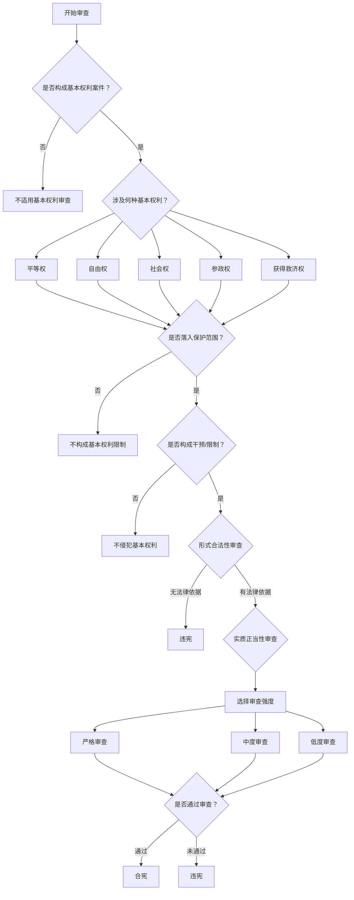
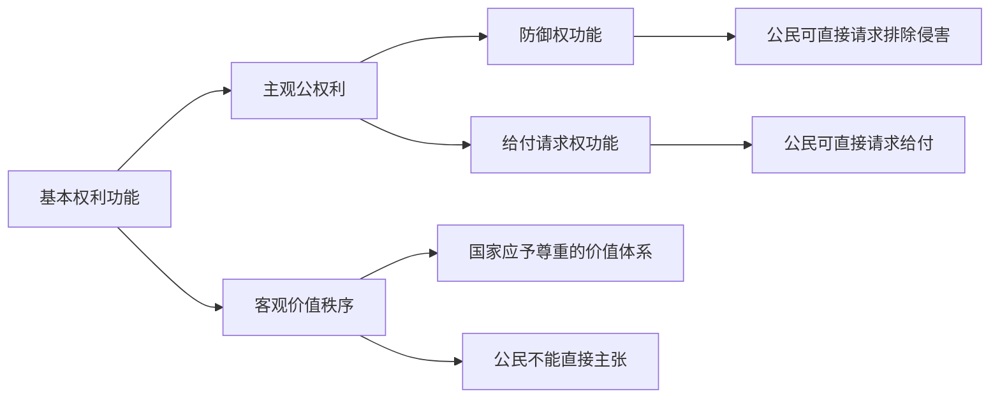
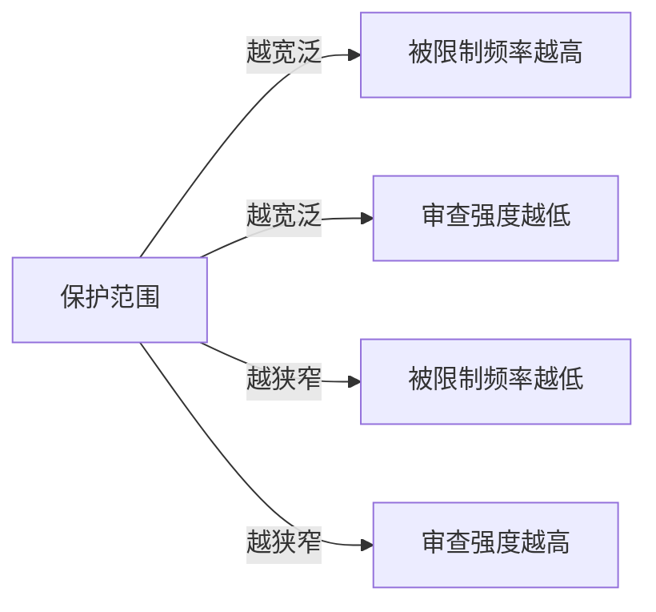
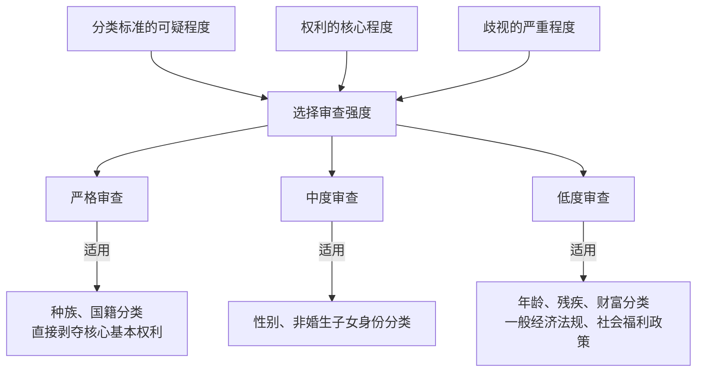
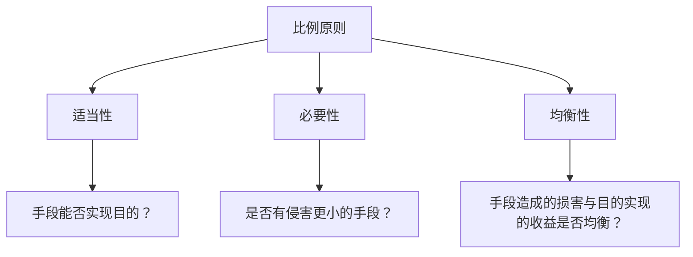
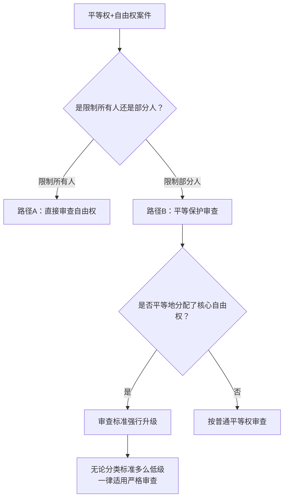

# 基本权利审查框架

> **来源**：朱铮课件《基本权利总论一/二/三》《基本权利分论一》综合整理  
> **整理时间**：2026年6月3日

---

## 一、审查流程总览

---

## 二、基本权利的分类

### （一）基本权利类型

| 权利类型 | 性质 | 国家义务 | 典型示例 |
|---------|------|---------|---------|
| **平等权** | 贯穿性权利（平等权+） | 不得歧视 | 就业平等、教育平等 |
| **自由权** | **消极权利** | 不作为的消极义务 | 言论自由、人身自由、宗教自由 |
| **社会权** | **积极权利** | 作为的积极义务 | 受教育权、劳动权、社会保障权 |
| **参政权** | 政治权利 | 保障参与 | 选举权、被选举权、批评建议权 |
| **获得救济权** | 程序性权利 | 提供救济途径 | 诉讼权、申诉权、控告权 |

> "自由权：排除国家干预，消极权利，国家主要承担不作为的消极义务。"  
> "社会权：要求国家干预，积极权利，国家主要承担作为的积极义务。"  

### （二）主观公权利 vs. 客观价值秩序

---

## 三、保护范围审查

### （一）判断标准

**核心问题**：涉案行为是否落入基本权利的保护范围？

| 审查要素 | 具体内容 |
|---------|---------|
| **权利定义** | 该基本权利的核心内涵是什么？ |
| **构成要件** | 涉案行为是否符合该权利的构成要件？ |
| **主体资格** | 谁可以主张该基本权利？ |

### （二）保护范围与审查强度的关系

---

## 四、干预/限制审查

### （一）干预的定义

**核心问题**：公权力行为是否构成对基本权利的干预？

> "所谓限制，是指国家得对基本权利的干预，即立法者基于宪法的授权对个人的特定权利予以干预。"  

### （二）干预的判断标准

| 判断要素 | 具体内容 |
|---------|---------|
| **行为主体** | 是否为公权力机关？ |
| **行为性质** | 是否具有强制性？ |
| **实际效果** | 是否使权利人不能、部分不能，或受到重大障碍地行使基本权利？ |

### （三）限制的目的

> "对基本权利加以限制，是为了保障一个行使自由而相冲突之法益，从而允许国家干预基本权利，限制的任务在于在相冲突的法益间取得平衡，因此基本权利的限制是为了配置不同主体的基本权利并调整各自的效力范围。"  

---

## 五、正当性审查

### （一）形式合法性审查

| 审查类型 | 含义 | 适用场景 | 审查标准 |
|---------|------|---------|---------|
| **合法性保留** | 限制基本权利必须有法律依据 | 一般情况 | 是否有法律授权？ |
| **宪法保留** | 限制基本权利必须有宪法依据 | 核心权利 | 是否有宪法授权？ |

> **课件原文**：  
> "有法律依据吗？若无，则违宪/违法；若有，则审查法律依据是否形式上和实体上合宪。"  
> ——《基本权利总论三》第36-37行

### （二）实质正当性审查：三级审查体系

#### 1. 审查强度选择标准

#### 2. 三级审查详细对比

| 审查强度 | 适用情形 | 目的要求 | 手段要求 | 举证责任 | 违宪风险 |
|---------|---------|---------|---------|---------|---------|
| **严格审查** (Strict Scrutiny) | ① 种族、国籍分类 ② 且直接剥夺核心基本权利 | 必须是为了实现**极其重大而迫切**的国家/公共利益 (Compelling State Interests) | 必须是实现该目的的**狭窄定制的/最小侵害的手段** (Narrowly tailored / Least restrictive means) | **政府举证** | 极高 |
| **中度审查** (Intermediate Scrutiny) | ① 性别分类 ② 非婚生子女身份分类 | 必须是为了实现**重要的政府利益** (Important government interest) 对于性别歧视，还需提供**极具说服力的理由** (Exceedingly persuasive justification) | 必须与该目的之间存在**实质性关联** (Substantially related) | **政府举证** | 中等 |
| **低度审查** (Rational Basis) | ① 年龄、残疾、财富阶层分类 ② 一般的经济法规 ③ 社会福利政策 | 只需证明是为了实现**正当/合法的政府利益** (Legitimate state interest) | 只需存在**合理关联** (Rationally related) | **原告举证** | 极低 |

> **课件原文**：  
> "审查机关根据分类标准的'可疑程度'和'敏感程度'，代入不同强度的审查标准。"  
> "1. 严格审查：种族、国籍，且分类直接剥夺核心基本权利。"  
> "2. 中度审查：性别和非婚生子女身份。"  
> "3. 低度审查/合理性审查：年龄、残疾、财富阶层，以及一般的经济法规和社会福利政策。"  
> ——《基本权利分论一》第165-171行

#### 3. 各审查强度详解

##### **严格审查 (Strict Scrutiny)**

**适用条件**：
- 分类标准：种族、国籍（最可疑分类）
- 附加条件：且分类直接剥夺核心基本权利

**审查标准**：
| 要素 | 具体要求 | 英文术语 |
|------|---------|---------|
| **目的** | 必须是为了实现极其重大而迫切的国家/公共利益 | Compelling State Interests |
| **手段** | 必须是实现该目的的狭窄定制的/最小侵害的手段 | Narrowly tailored / Least restrictive means |

**举证责任**：政府举证  
**违宪风险**：极高

> **课件原文**：  
> "严格审查：政府举证，政府必须证明该区别对待是为了实现'极其重大/迫切的政府利益(Compelling state interest)'，且所采用的手段是实现该目的的'狭窄量身定制/最小侵害手段(Narrowly tailored / Least restrictive means)'。"  
> ——《基本权利分论一》第177-179行

---

##### **中度审查 (Intermediate Scrutiny)**

**适用条件**：
- 分类标准：性别、非婚生子女身份（准可疑分类）

**审查标准**：
| 要素 | 具体要求 | 英文术语 |
|------|---------|---------|
| **目的** | 必须是为了实现重要的政府利益 | Important government interest |
| **额外要求**（性别歧视） | 必须提供极具说服力的理由 | Exceedingly persuasive justification |
| **手段** | 必须与该目的之间存在实质性关联 | Substantially related |

**举证责任**：政府举证  
**违宪风险**：中等

> **课件原文**：  
> "中度审查：政府举证，政府必须证明该区别对待是为了实现'重要的政府利益(Important government interest)'，且手段与目的之间存在'实质性关联(Substantially related)'。对于性别歧视，法院还额外要求政府提供'极具说服力的理由(Exceedingly persuasive justification)'。"  
> ——《基本权利分论一》第183-186行

---

##### **低度审查 (Rational Basis)**

**适用条件**：
- 分类标准：年龄、残疾、财富阶层（非可疑分类）
- 适用领域：一般的经济法规、社会福利政策

**审查标准**：
| 要素 | 具体要求 | 英文术语 |
|------|---------|---------|
| **目的** | 只需证明是为了实现正当/合法的政府利益 | Legitimate state interest |
| **手段** | 只需存在合理关联 | Rationally related |

**举证责任**：原告举证  
**违宪风险**：极低

> **课件原文**：  
> "低度审查：原告举证，原告必须证明，政府的这种分类与任何'正当/合法的政府利益(Legitimate state interest)'之间，都完全缺乏'合理的关联(Rationally related)'。政府极大概率胜诉，除非法院认定政府的分类纯粹是出于对某个特定群体的恶意(Animus)。"  
> ——《基本权利分论一》第190-192行

---

### （三）比例原则（严格审查的核心工具）

比例原则是严格审查中判断手段是否"最小侵害"的核心工具，包含三个子原则：

| 子原则 | 审查问题 | 审查标准 |
|--------|---------|---------|
| **适当性** (Suitability) | 手段能否实现目的？ | 手段必须有助于目的的实现 |
| **必要性** (Necessity) | 是否有侵害更小的手段？ | 必须选择同等有效但侵害更小的替代手段 |
| **均衡性** (Proportionality in the strict sense) | 手段造成的损害与目的实现的收益是否均衡？ | 手段造成的损害不能与目的实现的收益明显失衡 |

> **写作模式**：  
> "适当性方面，该措施能够通过……促进……目的的实现，故具有适当性。"  
> "必要性方面，关键在于是否存在同等有效而对基本权利限制更轻的替代措施。"  
> "均衡性方面，应在个人权利受损程度与公共利益实现程度之间进行权衡。"  
> ——《宪法案例分析技能·写作模式》

---

## 六、特殊情形：平等权+自由权

### （一）判断步骤

当平等权和自由权交织时，适用"**平等保护条款下的基本权利分支**"：

### （二）审查标准的强行升级

> **课件原文**：  
> "只要政府不平等地分配了一项核心自由权，无论政府使用的是什么分类标准（哪怕是财富这种最低级的分类），法院都会立刻启动严格审查(Strict Scrutiny)。"  
> ——《基本权利分论一》第201-203行

**典型案例**：人头税案（Harper v. Virginia, 1966）
- 分类标准：财富（低度审查）
- 涉及权利：投票权（核心自由权）
- 结果：启动严格审查，法律违宪

---

## 七、审查清单（Checklist）

### 基本权利审查清单

- [ ] **第一步：识别基本权利**
  - [ ] 是否构成基本权利案件？
  - [ ] 涉及何种基本权利？（平等权/自由权/社会权/参政权/获得救济权）
  - [ ] 是主观公权利还是客观价值秩序？

- [ ] **第二步：保护范围审查**
  - [ ] 涉案行为是否落入基本权利的保护范围？
  - [ ] 谁可以主张该基本权利？

- [ ] **第三步：干预/限制审查**
  - [ ] 公权力行为是否构成对基本权利的干预？
  - [ ] 干预的强度如何？

- [ ] **第四步：形式合法性审查**
  - [ ] 是否有法律依据？
  - [ ] 是否符合法律保留/宪法保留？

- [ ] **第五步：实质正当性审查**
  - [ ] 选择审查强度（严格/中度/低度）
  - [ ] 审查目的（Compelling/Important/Legitimate）
  - [ ] 审查手段（Narrowly tailored/Substantially related/Rationally related）
  - [ ] 如适用严格审查，进行比例原则分析
    - [ ] 适当性：手段能否实现目的？
    - [ ] 必要性：是否有侵害更小的手段？
    - [ ] 均衡性：手段造成的损害与目的实现的收益是否均衡？

- [ ] **第六步：得出结论**
  - [ ] 合宪/违宪

---

## 八、术语对照表

| 中文术语 | 英文术语 | 含义 |
|---------|---------|------|
| 基本权利 | Basic Rights / Fundamental Rights | 宪法保障的公民权利 |
| 保护范围 | Protection Scope | 基本权利所涵盖的领域 |
| 干预/限制 | Interference / Restriction | 公权力对基本权利的限制 |
| 正当化 | Justification | 限制基本权利的合法性基础 |
| 合法性保留 | Statutory Reservation | 限制必须有法律依据 |
| 宪法保留 | Constitutional Reservation | 限制必须有宪法依据 |
| 严格审查 | Strict Scrutiny | 最高强度的审查标准 |
| 中度审查 | Intermediate Scrutiny | 中等强度的审查标准 |
| 低度审查 | Rational Basis Review | 最低强度的审查标准 |
| 比例原则 | Proportionality Principle | 判断手段是否适当的原则 |
| 适当性 | Suitability / Adequacy | 手段能否实现目的 |
| 必要性 | Necessity | 是否有侵害更小的手段 |
| 均衡性 | Proportionality in the strict sense | 手段与目的的均衡 |
| 极其重大的政府利益 | Compelling State Interest | 严格审查的目的标准 |
| 重要的政府利益 | Important Government Interest | 中度审查的目的标准 |
| 正当的政府利益 | Legitimate State Interest | 低度审查的目的标准 |
| 狭窄定制的手段 | Narrowly Tailored | 严格审查的手段标准 |
| 实质性关联 | Substantially Related | 中度审查的手段标准 |
| 合理关联 | Rationally Related | 低度审查的手段标准 |

---

## 九、参考文献

1. 朱铮：《基本权利总论一》
2. 朱铮：《基本权利总论二》
3. 朱铮：《基本权利总论三》
4. 朱铮：《基本权利分论一》
5. 朱铮：《宪法第九讲》

---

> **笔记说明**：本笔记综合整理了朱铮老师课件中关于基本权利审查框架的核心内容，包括审查流程、基本权利分类、三级审查体系、比例原则等，并补充了详细的适用条件和英文术语对照。
