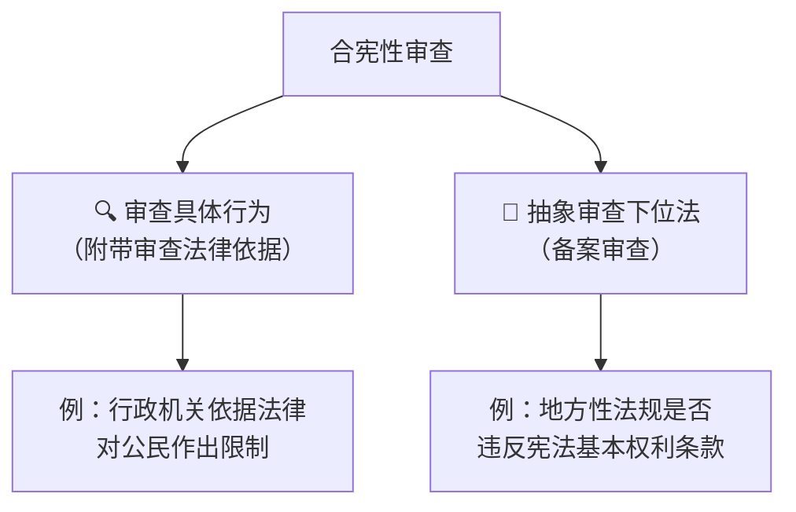
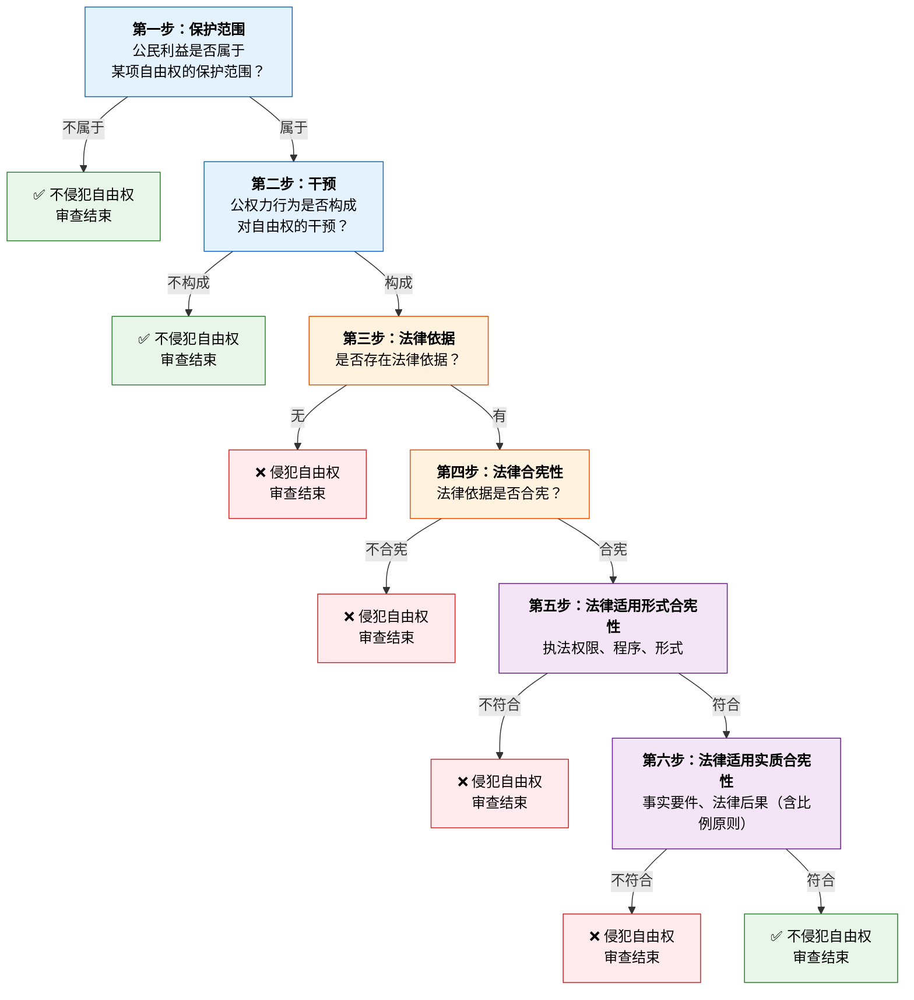
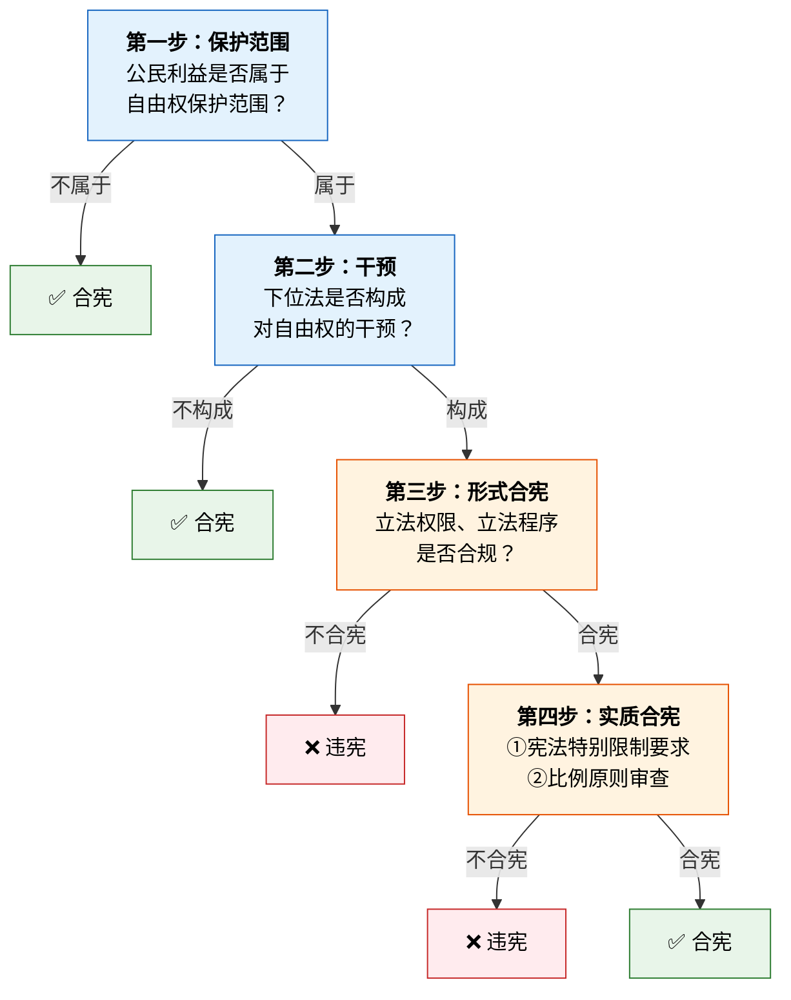
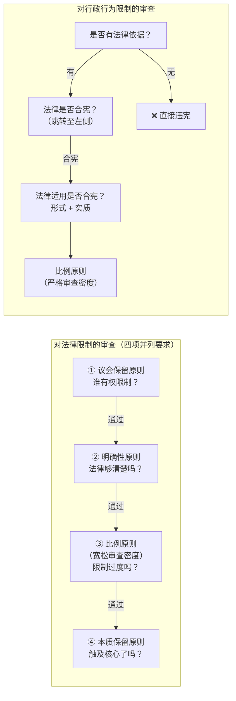
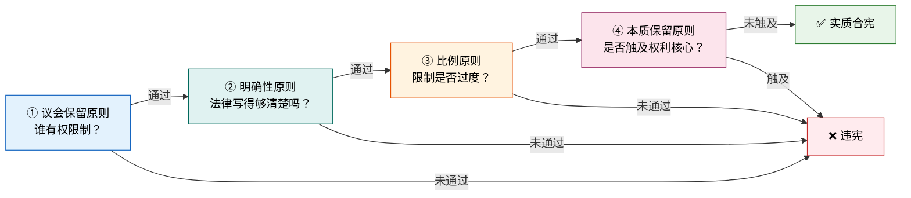
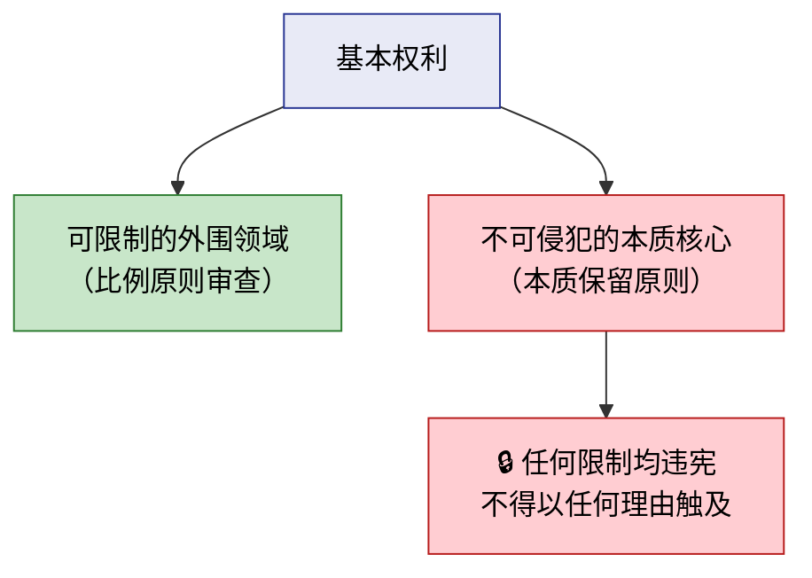
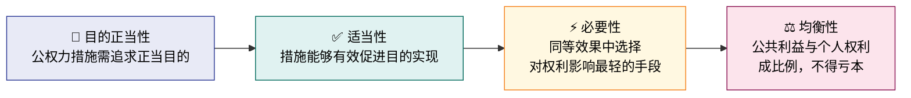
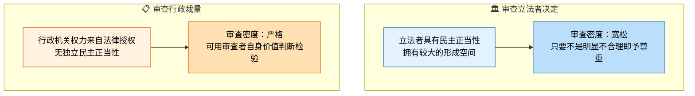
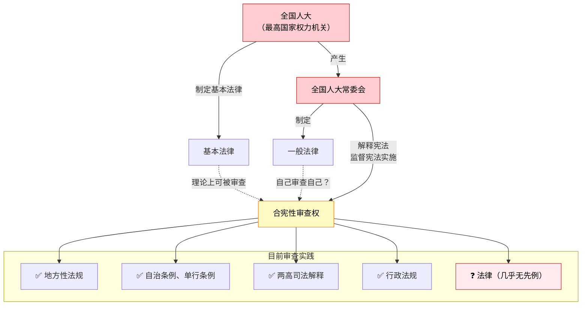
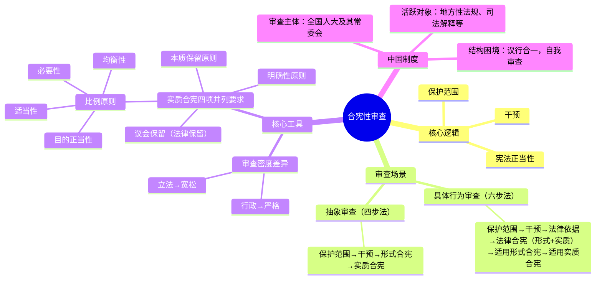

## 一、什么是合宪性审查

**合宪性审查**是指有权主体对公权力行为（包括立法、行政行为等）是否符合宪法进行审查并作出判断的活动。

### 核心逻辑：三段论

```
命题一：该行为触及了宪法基本权利的保护范围
命题二：该行为构成对基本权利的干预
命题三：该干预不具备宪法正当性
──────────────────────────────────
结论：该行为违宪
```

> 💡 **关键区分**：干预（Eingriff）≠ 侵害。干预是中性概念，只有**不具备宪法正当性**的干预才构成侵害。

---

## 二、自由权审查的完整框架

### 2.1 审查场景总览

合宪性审查主要分为两大场景：



### 2.2 场景一：审查具体行政行为（六步法）

这是**最完整**的审查流水线，适用于行政机关根据法律对公民作出具体行为、可能侵犯自由权的情形。



#### 各步骤详解

| 步骤 | 审查内容 | 关键要点 |
|:---:|----------|----------|
| ① 保护范围 | 公民利益是否属于自由权保护范围 | 应**宽泛界定**，涵盖积极行使、消极行使及兜底性基本权利 |
| ② 干预 | 公权力行为是否构成干预 | 干预包括直接损害、后果损害、附带损害；不要求主观过错 |
| ③ 法律依据 | 是否存在法律依据 | 无法律依据 → 直接违宪 |
| ④ 法律合宪性 | 法律本身是否合宪 | 分形式合宪与实质合宪（详见下文） |
| ⑤ 适用形式合宪性 | 行政机关是否正确适用法律 | 审查权限、程序、形式（如书面要求） |
| ⑥ 适用实质合宪性 | 案件事实与法律后果 | 事实要件是否满足；法律后果是否正确，裁量是否合比例 |

### 2.3 场景二：对下位法的抽象审查（四步法）

适用于不存在具体执法行为，直接审查下位法是否侵犯自由权的情形，典型如**备案审查**。



---

## 三、两条审查路径的关键差异



> 🔑 **核心区别**：行政机关不能"自我授权"限制基本权利，必须找到法律依据；而立法机关行使立法权本身就包含规定基本权利限制的权限。因此审查行政行为时，多出了"法律依据→法律合宪性→法律适用合法性"这一整条链条。

---

## 四、法律合宪性审查的展开

### 4.1 形式合宪

| 审查维度 | 具体内容 |
|----------|----------|
| 立法权限 | 是否由有权立法的机关制定？是否超越立法权限？ |
| 立法程序 | 是否经过法定程序通过？是否经过必要审议？ |
| 法律位阶 | 下位法是否与上位法相抵触？ |

### 4.2 实质合宪

法律对基本权利的限制，必须依次通过以下**四项并列的宪法要求**，方可具备实质正当性。它们不是上下位概念，而是四道独立的审查关卡，各自回答不同问题：



| 审查步骤 | 核心问题 | 回答的问题 |
|:---:|----------|------------|
| ① 议会保留 | 立法者是否亲自规定？ | **谁有权限制？** |
| ② 明确性 | 法律是否足够明确？ | **写得够清楚吗？** |
| ③ 比例原则 | 限制是否过度？ | **限制合理吗？** |
| ④ 本质保留 | 是否触及权利核心？ | **碰到底线了吗？** |

>[!caution]  四项原则是并列关系，不是上下位关系：
>议会保留原则（法律保留）不是其他三项的上位概念。它们各自源于不同的宪法要求，在审查中按从形式到实质、从外围到核心的位序递进适用。

#### ① 议会保留原则（法律保留）

>[!note] 法律保留原则
> 限制基本权利的问题，立法者不得简单授权行政机关，而必须**亲自规定**限制前提、限制情形、限制后果等。对基本权利限制强度越大，对立法者的要求越高。

| 类型 | 内容 | 典型应用 |
|------|------|----------|
| 绝对法律保留 | 犯罪与刑罚、剥夺政治权利、限制人身自由的强制措施和处罚、司法制度 → **只能制定法律** | 《立法法》第12条 |
| 相对法律保留 | 其他基本权利限制 → 可由法律授权行政法规规定，但须有明确授权 | 行政许可、行政征收等 |

> 💡 **议会保留是"门槛"**：如果连议会保留都没通过（如行政法规越权限制人身自由），则无需进入后续审查。

#### ② 明确性原则

> 法律对基本权利的限制必须**足够明确**，使公民能够预见其行为的法律后果。

| 维度 | 要求 | 违反示例 |
|------|------|----------|
| 限制条件的明确性 | 法律须清楚规定在何种情形下、何种条件下基本权利受到限制 | 法律仅规定"必要时可限制人身自由"，未界定何为"必要" |
| 限制后果的明确性 | 公民应能从法律规定中预见到限制的具体内容和程度 | 法律授权行政机关"采取适当措施"，未指明措施类型和强度 |
| 授权范围的明确性 | 法律授权行政机关时，必须明确授权的目的、范围和内容，不得作空白授权 | 法律仅规定"由主管部门另行规定"，未指明方向和边界 |

>[!tip] 法理基础
>明确性原则源于法治国原则中的**法的安定性**要求——如果法律不明确，公民就无法规划自己的行为，基本权利的保护就形同虚设。对基本权利限制强度越大，对立法者的明确性要求越高。

#### ③ 比例原则

> 法律对基本权利的限制不得超过**必要限度**，必须与所追求的公共利益成比例。

比例原则是实质合宪审查的**核心分析工具**，包含四个递进的子原则——详见第五节。

**在法律合宪性审查中的特殊要点：**

- 审查对象是**立法者的决定**，立法者享有较大的**形成空间（Gestaltungsspielraum）**
- 审查密度为**宽松**——只要立法者的选择不是明显不合理，即应予以尊重
- 对事实认定和预测决定，立法者享有更大的判断余地；对价值评判，审查者可以更深入地检验

#### ④ 本质保留原则（Wesensgehaltsgarantie）

> 法律对基本权利的限制，**不得触及基本权利的本质核心**，否则即便通过比例原则审查，也构成违宪。



| 维度 | 内容 |
|------|------|
| 核心要求 | 限制基本权利的法律，不得消灭基本权利的本质内容，使权利名存实亡 |
| 与比例原则的关系 | 比例原则审查"限制是否过度"；本质保留原则审查"限制是否消灭了权利本身"——两者互补，比例原则是"量"的控制，本质保留是"质"的底线 |
| 典型应用 | 言论自由可被合理限制，但不得完全剥夺表达可能；人身自由可被依法限制，但不得将人变为客体 |
| 判断标准 | 若限制后权利虽受压缩但仍保有"最低限度的核心行使可能性"→未触及本质；若限制后权利完全无法行使或丧失其制度性保障→触及本质，违宪 |

>[!caution]  本质保留原则 vs 比例原则中的均衡性
>均衡性要求"所得大于所失"——即便限制很重，只要公共利益足够大，仍可通过。但本质保留原则是一条**绝对红线**——无论公共利益多大，都不得越过。它是比例原则的"安全阀"。

---

## 五、比例原则：审查的核心工具

比例原则是所有实质正当性审查的核心工具，但**在不同环节的审查密度不同**。

### 5.1 四个子原则



| 子原则 | 核心问题 | 形象比喻 |
|--------|----------|----------|
| 目的正当性 | 国家追求的目标本身是否正当？ | 治病救人是正当的，无理由干预则不是 |
| 适当性 | 手段是否有助于实现目的？ | 治病方案有疗效则符合 |
| 必要性 | 有没有对权利损害更小的替代方案？ | 能吃药就不打针，能打针就不开刀 |
| 均衡性 | 实现的公共利益是否大于个人权利的损害？ | 不能"大炮打蚊子" |

### 5.2 审查密度的差异



> 💡 **形成空间越大 → 审查密度越低；形成空间越小 → 审查密度越高。**

---

## 六、合法性审查 vs 合宪性审查

| 维度 | 合法性审查 | 合宪性审查 |
|------|-----------|-----------|
| **审查依据** | 上位法律规范 | 宪法 |
| **审查对象** | 下位法是否符合上位法 | 规范性文件是否符合宪法 |
| **审查主体** | 各级有权机关 | 全国人大及其常委会 |
| **典型场景** | 行政法规是否违反法律 | 地方性法规是否违反宪法基本权利条款 |
| **效力后果** | 与上位法抵触的条款无效 | 违宪的条款无效 |

> 🔑 **二者关系**：行政法规越权限制基本权利，既违法又违宪，但通常**先做合法性审查**——因违法而无效的，不必再走违宪审查。合法性审查是合宪性审查的"前置过滤网"。

---

## 七、中国合宪性审查制度的结构性困境

### 7.1 制度现状



### 7.2 核心困境

| 问题 | 表现 |
|------|------|
| **审查者与被审查者同一** | 全国人大常委会既制定法律又审查法律，"既当运动员又当裁判员" |
| **审查动力不足** | 自己审查自己的法律，缺乏启动审查的内在激励 |
| **法律审查缺位** | 全国人大制定的基本法律，几乎不存在被审查的实践先例 |
| **缺乏专门机构** | 没有独立于全国人大的宪法法院或宪法委员会 |

### 7.3 可能的改革方向

- 完善备案审查制度的公开性与约束力
- 探索设立相对独立的宪法审查工作机构
- 强化合宪性审查建议的受理与反馈机制

---

## 八、全流程速查图



