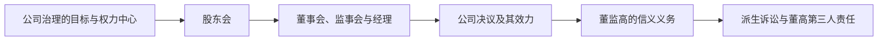
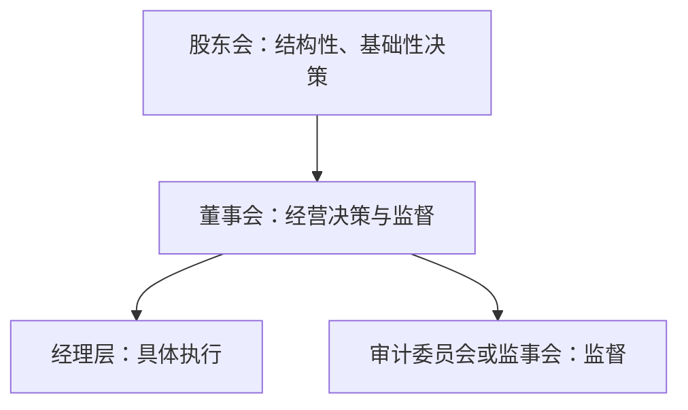
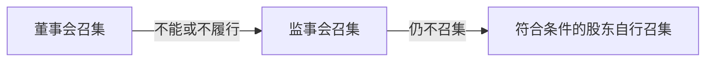
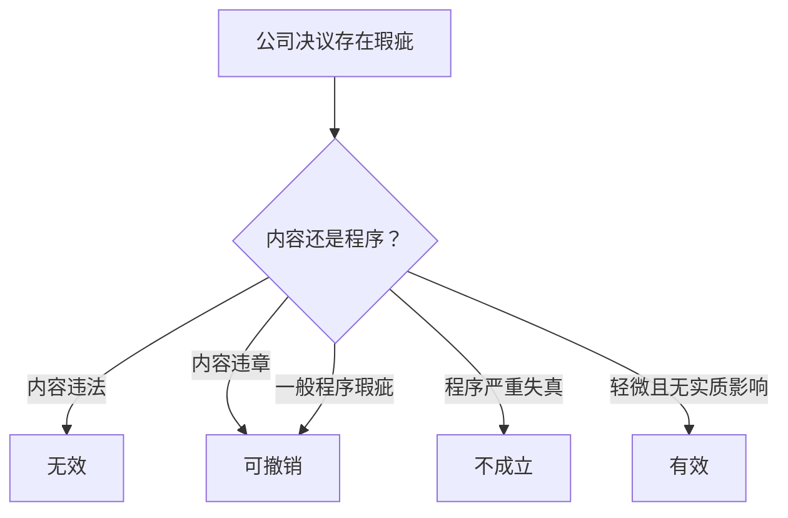
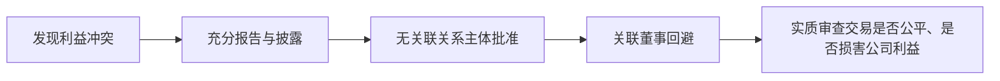
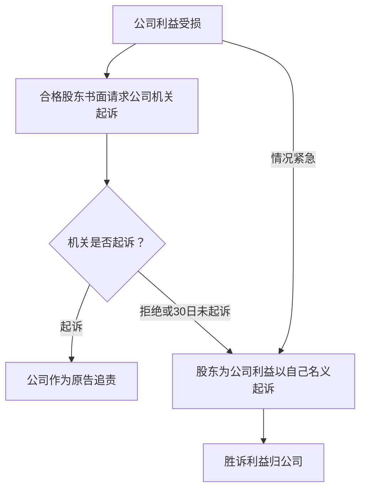

## 一、章节地图

> [!tip] 复习抓手
> 本章围绕两条主线展开：
> - `公司权力如何配置并形成有效决议`
> - `掌握公司权力的人如何被义务与诉讼机制约束`

---

## 二、11.1 公司治理

### 1. 公司治理的概念

- 公司治理是治理概念在公司制度中的延伸，关注公司内部不同参与者之间的权力、责任与利益配置。
- 法律上的公司治理尤其关注：
  - 谁拥有决策权、监督权与执行权；
  - 不同主体之间的利益冲突如何控制；
  - 权力行使失当时由谁承担责任。
- 公司治理不是单纯的组织架构图，而是`权力配置 + 程序控制 + 责任追究`的制度组合。

### 2. 公司治理模式的两个维度

| 维度   | 核心问题        | 主要立场              |
| ---- | ----------- | ----------------- |
| 公司目的 | 公司为谁的利益经营   | 股东利益主义 / 利益相关者主义  |
| 权力中心 | 谁掌握公司的剩余决策权 | 股东会中心主义 / 董事会中心主义 |

> [!caution] 易混点
> `股东利益主义`是一种价值取向，回答“为了谁”；`董事会中心主义`是一种权力配置方式，回答“谁掌权”。二者并不直接对立，公司可以实行股东利益导向的董事会中心主义。

### 3. 股东利益主义与利益相关者主义

#### （1）股东利益主义

> shareholder

- 基础理由：
  - 股东是剩余索取者，承担经营剩余风险；
  - 股东具有监督管理层的动力；
  - 股东通过选举董事、表决重大事项影响公司治理。
- 典型治理逻辑：股东授权董事会，董事会应以股东整体利益为主要导向。

#### （2）利益相关者主义

> stakeholder

- 利益相关者包括股东之外参与公司活动或受其影响的主体，如职工、债权人、消费者、社区与生态环境利益（CSR,ESG）。
- 支持理由：
  - 公司生产依赖多方参与；
  - 公司具有社会责任；
  - 经济民主与历史文化传统要求公司考虑多元利益。
- 反对理由：
  - 利益相关者通常可以通过合同和专门法律保护自己；
  - 多重目标可能扩大董事裁量权，削弱责任追究。

#### （3）我国法的体现

- 《公司法》第16、17条：职工权益、工会与民主管理。
- 《公司法》第19条：守法、商业道德、诚实守信并接受监督。
- 《公司法》第20条：充分考虑职工、消费者等利益相关者以及生态环境保护等社会公共利益，承担社会责任。
- 《公司法》第18条：公司中党的组织及其活动条件。

### 4. 股东会中心主义与董事会中心主义

- 股东会中心主义强调股东会作为权力机构，对结构性、基础性事项享有最终决策权。
- 董事会中心主义强调经营管理专业化与所有权、经营权分离，将较多决策权配置给董事会。
- 董事会中心主义的理由：
  - 股东人数众多，协调与信息成本较高；
  - 分散股东可能产生“理性冷漠”；
  - 董事会更适合连续、专业、快速的经营决策。

### 5. 2023年《公司法》迈向董事会中心主义

- 强化董事会在出资催缴、股东失权、清算义务等事项中的职责。
- 删除董事会“对股东会负责”的表述。
- 明确章程对董事会职权的限制不得对抗善意相对人。
- 允许不设监事会而在董事会中设置审计委员会，形成单层董事会模式。
- 允许章程或股东会在法定范围内向董事会授权。

---

## 三、11.2 股东会

### 1. 股东会的地位与职权

- 股东会由全体股东组成，是公司的权力机构。
- 只有一个股东的有限责任公司不设股东会，由股东以书面形式作出决定。

| 职权类型    | 主要事项                          |
| ------- | ----------------------------- |
| 人事与监督   | 选举、更换董事和监事并决定报酬；审议批准董事会、监事会报告 |
| 最终财权    | 利润分配与弥补亏损；增减资；发行公司债券          |
| 公司结构与存续 | 合并、分立、解散、清算、变更公司形式            |
| 自治规则    | 修改章程；章程规定的其他职权                |

> [!tip] 记忆结构
> `两类人事与两个报告 + 三项最终财权 + 章程与公司生死`。

### 2. 股东会的类型

- 首次股东会：
  - 有限公司由出资最多的股东召集和主持。
  - 股份公司设立时召开成立大会。
- 定期股东会：
  - 有限公司依章程规定召开。
  - 股份公司每年召开一次。
- 临时股东会：
  - 有限公司：代表1/10以上表决权的股东、1/3以上董事或监事会提议时，应当召开。
  - 股份公司：董事人数不足、未弥补亏损达股本总额1/3，或法定主体请求时，应在两个月内召开。

### 3. 股东会的召集与通知

#### （1）召集顺位

- **有限公司股东自行召集**：代表10%以上表决权。
- **股份公司股东自行召集**：连续90日以上单独或合计持有10%以上股份。
- 召集权同时包含通知、组织和主持功能，也是法定情形下的职责。

#### （2）会议通知

| 公司类型 | 通知期限 | 特别规则 |
| --- | --- | --- |
| 有限公司 | 会议召开15日前；章程或全体股东另有约定除外 | 法律未统一规定通知事项内容 |
| 股份公司定期会议 | 会议召开20日前 | 应通知时间、地点、审议事项 |
| 股份公司临时会议 | 会议召开15日前 | 不得对通知未列明事项作出决议 |

- 股份公司临时提案权：
  - 单独或合计持有1%以上股份的股东；
  - 在会议召开10日前书面提交董事会；
  - 董事会收到后2日内通知其他股东；
  - 提案须有明确议题和具体决议事项，合法合章且属于股东会职权范围。

### 4. 股东会的召开

#### （1）出席与主持

- 股东可以直接出席，也可以委托代理人出席。
- 股份公司代理人须提交授权委托书，并在授权范围内行使表决权。
- 我国《公司法》未规定股东会最低出席比例。
- 原则上谁召集谁主持；董事会召集时通常由董事长主持。

#### （2）表决权配置

| 公司类型 | 基本规则 |
| --- | --- |
| 有限公司 | 按出资比例行使表决权，章程另有规定除外 |
| 股份公司 | 每一股份一表决权，类别股除外；公司持有的本公司股份无表决权 |

- 表决权原则上统一行使，特定信托、托管、共有等情形可能例外。
- 表决权可能受到限制：
  - 无表决权类别股；
  - 公司持有的本公司股份；
  - 上市公司控股子公司持有母公司股份；
  - 关联股东依法回避。

#### （3）表决比例

| 决议类型 | 有限公司          | 股份公司              |
| ---- | ------------- | ----------------- |
| 普通决议 | 全体股东表决权的过半数   | 出席会议股东所持表决权的过半数   |
| 特别决议 | 全体股东表决权的2/3以上 | 出席会议股东所持表决权的2/3以上 |

- 特别决议事项：修改章程、增减资、合并、分立、解散、变更公司形式。
- 上市公司一年内购买、出售重大资产或向他人提供担保超过公司资产总额30%的，也须特别决议。

> [!caution] 分母陷阱
> 有限公司以`全体股东表决权`为分母；股份公司以`出席会议股东所持表决权`为分母。弃权票不进入同意票分子，效果通常与反对票相同。

#### （4）累积投票制

- 适用于股份公司选举董事、监事。
- 每一股份拥有与应选人数相同的表决权，股东可以集中使用。
- 其功能是提高少数股东选出代表的可能性。

$$
选出一名董事所需的最低股份数 \approx \frac{出席会议股份数}{应选董事人数+1}+1
$$

### 特别事项、一般事项

> [!danger] 特别事项 （2/3）
> - 合并分立解散变更、增资减资、修改公司章程

> [!note] 一般事项
> 50%

### 5. 其他决议形成方式

- 电子会议：《公司法》第24条允许股东会、董事会、监事会以电子通信方式召开和表决，章程另有规定除外。
- 书面一致决定：
  - **仅适用于有限公司股东会**；
  - **全体股东以书面形式一致同意时**，可不召开会议直接作出决定；
  - 与电子会议不同，其本质是`不开会而形成一致书面决定`。

---

## 四、11.3 董事、董事会、监事会与经理

### 1. 董事会的组成与定位

- 董事会原则上由三名以上董事组成。
- 董事可按不同标准分类：
  - 股东代表董事 / 职工代表董事；
  - 执行董事 / 非执行董事；
  - 独立董事 / 外部董事。
- 董事会职能可概括为：
  - 经营决策；
  - 监督经理层；
  - 为公司提供专业判断与资源。
- 规模较小或股东人数较少的有限公司、股份公司，可以不设董事会，只设一名董事。

### 2. 董事会职权及其边界

| 类型    | 主要内容                           |
| ----- | ------------------------------ |
| 服务股东会 | 召集股东会、报告工作、执行股东会决议             |
| 制订方案  | 利润分配、弥补亏损、增减资、发行债券、合并分立解散等方案   |
| 独立决定  | 经营计划、投资方案、内部机构、基本管理制度、经理层任免与报酬 |
| 自治扩展  | 章程规定或股东会授予的其他职权                |

- 章程可以限制董事会职权，但不得对抗善意相对人。
- 股东会能否直接行使董事会法定职权、董事会能否完全转授权，涉及固有职权与权力让渡边界。
- 结构性、基础性决策原则上应保留给股东会；专业、连续、需要快速反应的经营决策更适合董事会。

### 3. 董事会程序

- 股份公司董事会每年度至少召开两次会议。
- 代表1/10以上表决权的股东、1/3以上董事或监事会，可以提议召开临时董事会。
- 董事会会议：
  - 应有过半数董事出席；
  - 一人一票；
  - 一般决议须经全体董事过半数通过；
  - 关联董事依法回避。
- 股份公司董事可书面委托其他董事代为出席。
- 董事对违法、违章并给公司造成严重损失的董事会决议原则上承担责任；
- 表决时明确异议并记载于会议记录的，可以免责。

### 4. 监事会、审计委员会与经理

#### （1）监事会

- 原则上由三名以上监事组成，职工代表比例不得低于1/3。
- 董事、高管不得兼任监事。
- 主要职权：
  - 检查公司财务；
  - 监督董事、高管履职并提出解任建议；
  - 要求纠正损害公司利益的行为；
  - 提议、召集股东会并提出提案；
  - 对董事、高管提起诉讼。

#### （2）审计委员会与单层董事会

- 公司可依章程不设监事会或监事，在董事会中设置审计委员会，行使监事会职权。
- 股份公司审计委员会：
  - 三名以上成员；
  - 过半数为具有独立性的非执行董事；
  - 一人一票，决议须经成员过半数通过。
- 制度核心：将监督功能置于董事会内部，由相对独立的董事实施。

#### （3）经理

- 有限公司可以设经理，股份公司应设经理。
- 经理由董事会聘任或解聘，对董事会负责，依章程或董事会授权行使职权。

---

## 五、11.4 公司决议及其效力

### 1. 决议瑕疵的类型

| 瑕疵类型   | 判断标准              | 法律效果 |
| ------ | ----------------- | ---- |
| 内容违法   | 决议内容违反法律、行政法规     | 无效   |
| 内容违章   | 决议内容违反公司章程        | 可撤销  |
| 严重程序瑕疵 | 未开会、未表决、出席或通过比例不足 | 不成立  |
| 一般程序瑕疵 | 召集程序、表决方式违法或违章    | 可撤销  |
| 轻微程序瑕疵 | 瑕疵轻微且未产生实质影响      | 有效   |

### 2. 决议效力诉讼

- 被告：公司。
- 可撤销之诉原告：起诉时具有股东资格的股东。
- 无效、不成立之诉原告：股东、董事、监事等与决议具有利害关系的主体。
- 撤销权期间：
  - 一般自决议作出之日起60日；
  - 未被通知参加股东会的股东，自知道或应当知道之日起60日；
  - 但自决议作出之日起最长不得超过一年。

### 3. 决议被否定后的影响

- 对内：公司应申请撤销依据该决议办理的登记，并处理已执行或未执行事项。
- 对外：公司根据该决议与善意相对人形成的民事法律关系不受影响。

> [!caution] 易混点
> 决议被宣告无效、撤销或确认不成立，不等于公司与善意相对人之间的外部交易当然失效。

---

## 六、11.5 董监高及其信义义务

### 1. 董监高的范围与任职

- 董事：公司业务决策与事务管理的重要承担者；我国法上通常指董事会成员。
- 高级管理人员：经理、副经理、财务负责人、上市公司董事会秘书和章程规定的其他人员。
- 实质董事：
  - 控股股东、实际控制人虽不担任董事，但实际执行公司事务的，承担忠实与勤勉义务。
  - 控股股东、实际控制人指示董事、高管损害公司或股东利益的，与其承担连带责任。
- 董监高任职资格限制见《公司法》第178条，包括行为能力、特定犯罪、破产责任、吊销责任及失信被执行人等情形。
- 股东会可以解任董事；无正当理由在任期届满前解任的，董事可以请求赔偿。
- 董事辞任原则上自公司收到书面通知时生效；导致董事会低于法定人数的，应继续履职至新董事就任。

### 2. 信义义务的结构

| 义务 | 核心问题 | 基本要求 |
| --- | --- | --- |
| 忠实义务 | 克服利益冲突、贪婪与自利 | 避免自身利益与公司利益冲突，不利用职权牟取不正当利益 |
| 勤勉义务 | 克服懒惰、失察与不合理决策 | 为公司最大利益尽到管理者通常应有的合理注意 |

- 信义义务原则上指向公司。
- 忠实义务与勤勉义务边界可能交叉；判断重点在于行为究竟主要涉及利益冲突，还是注意水平不足。

### 3. 忠实义务

#### （1）规制模式

- 绝对禁止行为：《公司法》第181条列举侵占财产、挪用资金、私设账户、受贿、侵吞佣金、泄露秘密等行为。
- 相对禁止行为：
  - 关联交易；
  - 利用公司机会；
  - 经营同类业务；
  - 特定财务资助。

#### （2）利益冲突交易的控制

- 关联交易既包括董监高直接、间接与公司交易，也包括其近亲属、控制企业及其他关联人和公司交易。
- 董事会审议《公司法》第182至184条事项时：
  - 关联董事不得表决；
  - 其表决权不计入总数；
  - 无关联关系董事不足三人的，提交股东会审议。
- 程序批准并不当然排除实质审查，交易仍不得损害公司利益。

#### （3）公司机会与竞业禁止

- 公司机会规则：董监高不得利用职务便利为自己或他人谋取属于公司的商业机会。
- 判断公司机会可综合考虑：
  - 公司是否具有利用能力；
  - 是否处于公司经营范围或经营链；
  - 公司是否具有期待利益；
  - 机会取得是否源于职务与公司资源。
- 免责情形：
  - 经报告并由董事会或股东会批准；
  - 公司依法、依章程不能利用该机会。
- 竞业禁止：未经报告和批准，不得自营或为他人经营与任职公司同类的业务。

> [!caution] 公司机会与竞业禁止
> 公司机会规则偏向事后判断特定机会是否属于公司；竞业禁止偏向事前防止同业竞争。二者可能交叉，但判断对象不同。

#### （4）忠实义务责任

- 违反忠实义务所得收入归公司所有。
- 给公司造成损失的，应承担赔偿责任。
- 涉及第三人时，还需处理交易效力、善意保护与共同侵权问题。

### 4. 勤勉义务

#### （1）基本标准

- 《公司法》第180条第2款：执行职务应当为公司的最大利益尽到管理者通常应有的合理注意。
- 判断经营决策是否勤勉，可关注：
  - 决策前是否了解必要信息；
  - 是否具有合理理由相信决策符合公司最大利益；
  - 是否达到相似职位、相似情形下的合理管理者标准。

#### （2）消极不作为：督导责任

- 董事会不必处理全部日常经营事务，但应维护公司信息收集、决策与合规系统。
- 董事通常可以授权并合理信赖他人，但仍须保持对公司事务的基本了解。
- 出现违法线索、系统漏洞等“报警信号”后，董事负有调查并采取措施的义务。

#### （3）积极作为：商业判断规则

- 商业判断规则主要适用于董事作出的积极经营决策。
- 典型适用前提：
  - 存在真实的商业决策；
  - 董事无个人利益并保持独立；
  - 已获取合理必要信息；
  - 出于善意并相信决策符合公司最佳利益。
- 商业判断规则不适用于纯粹不作为、利益冲突交易或违法决策。

#### （4）其他免责机制

- 董事责任保险：《公司法》第193条允许公司为董事执行职务可能承担的赔偿责任投保，并要求董事会向股东会报告。
- 董事会会议记录中的明确异议，可构成特定决议责任的免责依据。

---

## 七、11.6 股东派生诉讼与董高第三人责任

### 1. 股东派生诉讼

- 股东派生诉讼又称股东代表诉讼：公司权益受损而公司怠于追责时，符合法定条件的股东为公司利益，以自己名义提起诉讼。
- 诉讼利益最终归公司，不归原告股东个人。
- 其功能是克服公司机关受被诉主体控制、拒绝追责的治理失灵。

### 2. 原告、被告与前置程序

| 要素 | 规则 |
| --- | --- |
| 原告资格 | 有限公司股东；股份公司连续180日以上单独或合计持有1%以上股份的股东 |
| 被告 | 违反职责的董事、监事、高管，或侵害公司合法权益的其他人 |
| 公司地位 | 通常作为第三人，胜诉利益归公司 |
| 前置请求 | 董事、高管违法时请求监事会起诉；监事违法或他人侵权时请求董事会起诉 |
| 等待期间 | 拒绝起诉或收到请求后30日内未起诉，股东可提起派生诉讼 |
| 紧急例外 | 不立即起诉将使公司利益受到难以弥补损害时，可直接起诉 |

- 双重派生诉讼：《公司法》第189条第4款允许股东就公司全资子公司利益受损依法提起诉讼。
- 合理费用：股东胜诉或部分胜诉时，公司应承担其参加诉讼支付的合理费用。
- 和解与调解应防止原告股东与被告合谋损害公司利益。

### 3. 派生诉讼与股东直接诉讼

| 类型 | 受损利益 | 胜诉利益归属 |
| --- | --- | --- |
| 派生诉讼 | 公司利益 | 公司 |
| 股东直接诉讼 | 股东个人利益 | 股东 |

### 4. 董事、高管对第三人的责任

- 《公司法》第191条：
  - 董事、高管执行职务给他人造成损害，原则上由公司承担赔偿责任；
  - 董事、高管存在故意或重大过失的，也应承担赔偿责任。
- 该规则突破了信义义务主要指向公司的内部结构，但其与法定代表人责任、一般侵权责任之间仍存在体系协调问题。

---

## 八、本章高频对比

| 对比 | 核心区别 |
| --- | --- |
| 股东利益主义 / 董事会中心主义 | 前者是公司目的，后者是权力配置 |
| 电子会议 / 书面一致决定 | 前者仍召开会议；后者不开会，仅限有限公司且须全体书面一致 |
| 有限公司 / 股份公司表决分母 | 全体股东表决权 / 出席会议股东所持表决权 |
| 决议无效 / 可撤销 / 不成立 | 内容违法 / 一般程序瑕疵或内容违章 / 严重程序瑕疵 |
| 忠实义务 / 勤勉义务 | 利益冲突与自利 / 注意水平与合理决策 |
| 公司机会 / 竞业禁止 | 特定机会归属 / 同类业务竞争 |
| 派生诉讼 / 直接诉讼 | 公司利益受损 / 股东个人利益受损 |

> [!tip] 本章掌握层级
> - 了解：股东会、董事会、监事会的种类、组成、职权与会议规则。
> - 掌握：公司决议瑕疵效力体系；董监高任免；忠实义务与勤勉义务；股东派生诉讼。
