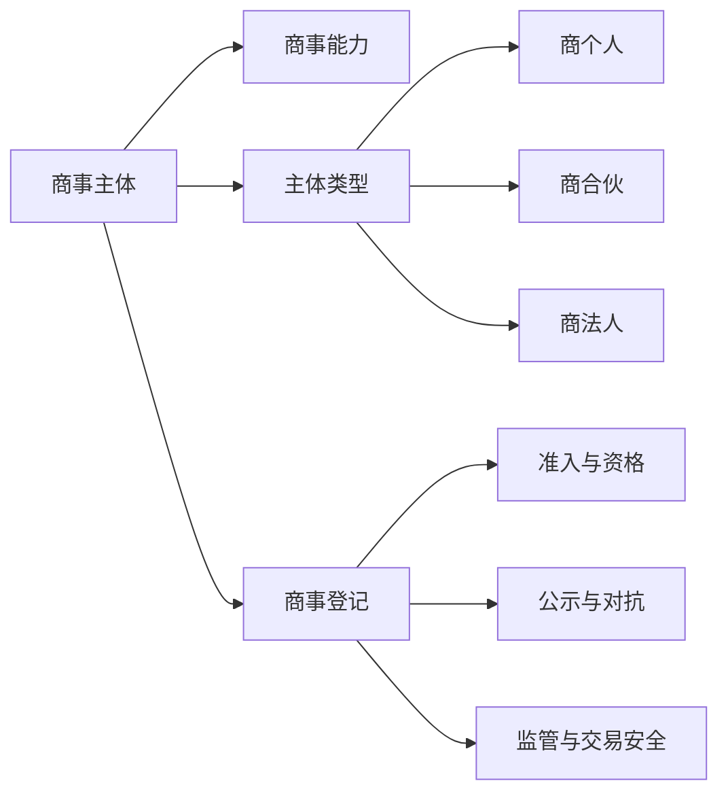

## 一、章节定位

商法总论进入具体制度时，首先要回答两个问题：谁能够作为商事法律关系的主体进入市场，以及国家、交易相对人和社会公众如何识别该主体。前者是商事主体制度，后者是商事登记制度。

本章的核心不是单纯背诵登记事项，而是把“主体资格—登记内容—审查方式—登记效力”连成一条线：商事主体通过一定的法律制度取得营业资格，登记制度则把该资格、组织状态和交易风险以可查询的方式固定下来。

## 二、商事主体与商事能力

### 1. 商事主体的概念

PPT 将商事主体界定为：依据商法规定，具有商事权利能力和商事行为能力，能够以自己名义独立从事商事行为，并在商事法律关系中享有权利、承担义务的个人和组织。传统商法常称“商人”，我国现行规范和政策语境中更多使用“市场主体”。

施天涛教材的表述更强调三个构成要素：以自己的名义实施商行为；能够独立享有权利并承担义务；所实施的是营业性、营利性的商行为。因此，商事主体不是所有民事主体的同义词，而是在民事主体资格基础上，经由商法规则进入市场经营领域的主体。

> [!note] 商事主体与市场主体
> “商事主体”是商法学上的分析概念，强调商行为和商事法律关系；“市场主体”是我国登记管理和市场监管中的法规范概念，强调依法登记、进入市场、接受监管。二者高度重合，但概念出发点不同。

《市场主体登记管理条例》第3条将市场主体包括公司、非公司企业法人及其分支机构，个人独资企业、合伙企业及其分支机构，农民专业合作社及其联合社，个体工商户，外国公司分支机构，以及法律、行政法规规定的其他市场主体。

### 2. 商事主体的特征

| 特征 | 含义 | 复习提示 |
| --- | --- | --- |
| 法定性 | 商事主体资格须由法律确认，通常通过登记取得或对外公示 | 市场准入从特许、核准逐渐转向准则主义，但并非完全无门槛 |
| 法律主体性 | 能够以自己名义享有权利、承担义务 | 代理人、雇员、辅助人通常不是独立商事主体 |
| 营业性 | 以营利为目的，持续、反复从事经营活动 | 偶发交易通常不构成商事主体意义上的营业 |

商事主体的“营业性”是本章与民法主体制度相区分的关键。自然人当然可以实施民事行为，但只有在其以营利为目的、持续性地从事经营活动，并达到法定或登记制度要求时，才进入商事主体讨论范围。

### 3. 商事主体的类型

| 类型 | 基本形态 | 组织与责任结构 | 典型例子 |
| --- | --- | --- | --- |
| 商个人 | 自然人或自然人投资形成的个人经营主体 | 人格与财产独立程度较弱，责任承担通常更接近投资人个人 | 个体工商户、个人独资企业 |
| 商合伙 | 两个以上主体共同经营 | 成员合意色彩强，责任承担与合伙类型相关 | 普通合伙企业、有限合伙企业 |
| 商法人 | 具有法人资格的营利性组织 | 有独立财产、独立人格，成员责任通常有限 | 有限责任公司、股份有限公司 |

教材常从成员、财产、责任、人格四个维度理解主体类型。商法人以独立财产和独立人格为中心；商合伙以成员之间的合意和责任安排为中心；商个人则在独立营业与个人责任之间展开。

### 4. 商事能力

商事能力是商事主体在核定或公示的经营范围内从事商事行为的资格。它不是一般民事权利能力的简单重复，而是建立在民事能力之上的附加能力。

商事能力具有三个特点：

1. 特指从事商事行为的能力，核心在营业资格。
2. 以一般民事能力为基础，但受商法和市场监管规则进一步限定。
3. 范围具有特定性，受主体类型、登记事项、许可事项和身份限制影响。

商事能力的限制主要来自三类规则：未成年人等民事能力限制；外国人、外国企业在特定行业的准入限制；国家工作人员等特定身份主体不得从事营利性经营活动的限制。

## 三、商事登记：概念、性质与特征

### 1. 商事登记的概念

商事登记是申请人向登记机关提出申请，登记机关依法审核并将主体资格、组织状态、营业事项记载于登记簿或公示系统的制度。它同时包括私主体的申请行为和公权力机关的审核登记行为。

商事登记不是单纯的技术性档案管理。它连接市场准入、主体识别、交易公示、行政监管和责任追究，是国家对商事活动进行法律调整与宏观调控的重要环节。

### 2. 商事登记的特征

| 特征 | 制度含义 | 对应问题 |
| --- | --- | --- |
| 创设性 | 登记可以创设、变更或终止某些主体资格和营业资格 | 未经登记能否以市场主体名义经营 |
| 要式性 | 登记事项、材料、程序、格式均由法律规定 | 申请材料是否齐备、真实、符合法定形式 |
| 复合性 | 既有申请人的私法行为，又有登记机关的公法审查 | 登记错误、虚假登记时如何分配风险 |

《市场主体登记管理条例》确立了设立登记、变更登记、注销登记的基本框架，并规定未经登记不得以市场主体名义从事经营活动，但法律、行政法规另有规定的除外。公司设立则受《公司法》第29条至第33条关于登记申请、材料提交、登记决定和营业执照的规则调整。

### 3. 商事登记的性质

商事登记兼具私法和公法属性。就私法而言，它影响主体资格、组织状态以及对第三人的效力；就公法而言，它是市场监管、税收管理、行政许可衔接和信用公示的基础。

登记制度还包含一个重要张力：登记越细，监管和交易识别越便利，但申请成本、合规成本和行政成本也越高；登记越宽松，市场进入更便利，但交易相对人和监管机关获取信息的成本上升。

## 四、为什么登记：功能与自然人网店争议

### 1. 登记功能的历史线索

商事登记的功能并非一开始就固定为现代企业登记。PPT 梳理的历史线索大致如下：

| 历史阶段 | 登记或类似制度的主要功能 |
| --- | --- |
| 古罗马 | 通过挂牌、牌号等方式表明经营项目、经营范围和营业状况 |
| 中世纪行会 | 通过商业组合名簿确认商人团体成员身份 |
| 法国商法传统 | 从公司登记、商人婚姻契约登记逐步发展出一般商事登记 |
| 德国商法传统 | 以商事登记簿和商人资格为核心，形成较完整的商事登记制度 |
| 英美公司法传统 | 公司登记与法人资格、特许和准入制度相结合 |

由此可以归纳出五项功能：表明经营状态，加入商人团体，获得商人资格，取得法人资格，获得可被社会识别的商人身份。

### 2. 现代登记功能

现代商事登记至少具有四层功能：

1. 准入功能：确认主体是否可以作为市场主体从事经营。
2. 公示功能：向交易相对人和社会公众展示名称、住所、资本、负责人、经营范围等信息。
3. 监管功能：为市场监管、税收征管、行政许可和信用惩戒提供入口。
4. 交易安全功能：降低交易相对人的识别成本，并通过登记对抗规则分配信赖风险。

### 3. 自然人网店应否登记

课堂讨论以自然人网店为切入点。平台内部登记能够掌握发货地址、银行卡号、IP 地址、交易流水等动态信息，但平台登记并不当然等同于国家市场主体登记。国家登记更强调主体资格、公示公信、统一监管和交易安全。

自然人网店是否必须登记，不能只从“线上经营也应监管”得出结论，还要比较登记收益与登记成本。小额、零星、便民的经营活动强制登记，可能增加进入门槛和行政成本，未必显著提升监管效果。

《电子商务法》第10条采取原则登记加例外豁免的结构：电子商务经营者原则上应依法办理市场主体登记，但个人销售自产农副产品、家庭手工业产品，个人利用技能从事依法无须许可的便民劳务活动，零星小额交易活动，以及依法不需要登记的情形除外。《网络交易监督管理办法》第8条进一步以年交易额累计不超过10万元等标准细化“零星小额”的判断，并要求多平台、多店铺交易合并计算；依法须取得许可的经营活动不适用该豁免。

> [!important] 小商人豁免的制度逻辑
> 小商人豁免不是否认经营行为的商业属性，而是在低风险、低规模场景中，通过成本收益衡量降低登记义务。其核心是市场进入便利与监管需求之间的平衡。

## 五、登记内容：登记什么

### 1. 法人登记与营业登记

法人登记解决的是主体是否取得法人资格的问题；营业登记解决的是主体是否取得经营资格以及以何种状态对外营业的问题。公司登记中，两者经常结合在一起：公司经依法登记成立，营业执照签发日期为公司成立日期。

| 类型 | 关注点 | 主要效果 |
| --- | --- | --- |
| 法人登记 | 是否形成独立法人主体 | 取得法人资格、独立财产和独立责任结构 |
| 营业登记 | 是否取得营业资格及营业状态 | 取得以市场主体名义经营并对外公示的资格 |

《公司法》第33条规定，依法设立的公司由公司登记机关发给营业执照，公司营业执照签发日期为公司成立日期。营业执照应载明公司名称、住所、注册资本、经营范围、法定代表人姓名等事项，电子营业执照与纸质营业执照具有同等法律效力。

### 2. 一般登记事项

《市场主体登记管理条例》第8条列举了一般登记事项，包括名称、主体类型、经营范围、住所或者主要经营场所、注册资本或者出资额、法定代表人、执行事务合伙人或者负责人姓名等。

《公司法》第32条对公司登记事项作出规定，主要包括名称、住所、注册资本、经营范围、法定代表人姓名，有限责任公司股东和股份有限公司发起人姓名或者名称，并要求公司登记机关将登记事项通过国家企业信用信息公示系统向社会公示。

### 3. 类型化登记事项

不同市场主体的登记事项并不完全相同。有限责任公司强调股东信息，股份有限公司强调发起人信息，个人独资企业强调投资人信息，合伙企业强调合伙人及其责任承担方式，个体工商户强调经营者信息。登记事项的差异，反映的是不同主体类型背后的责任结构和交易风险。

### 4. 名称与商号

商业名称是商事主体在营业活动中使用、用以表彰自己营业并与其他主体相区别的名称。教材将其特征概括为三点：由商事主体使用；在从事商业行为时使用；发挥识别营业和区分主体的功能。

我国企业名称通常由行政区划、字号、行业或者经营特点、组织形式构成。字号是商业名称中最具识别性的部分，也是商业名称权保护的重点。公司名称还必须标明有限责任公司或者股份有限公司字样，体现其组织形式和责任结构。

名称登记的意义不只是形式识别，还涉及商号权保护、市场混淆防止和交易相对人的信赖保护。登记后的名称具有排他使用和受保护的效果，但这种保护仍需与商标、反不正当竞争和企业名称管理规则衔接。

### 5. 住所与经营场所

公司住所通常为主要办事机构所在地。住所具有确定诉讼管辖、法律文书送达、登记和税收管理、合同履行地判断、涉外准据法连接点等功能。

经营场所则是市场主体从事具体业务活动的地点。住所与经营场所可能一致，也可能因“一址多照”“一照多址”等改革而发生分离。制度改革的方向是降低场地登记对创业和连锁经营的限制，但仍需维持可送达、可监管、可追责的最低识别功能。

### 6. 经营范围

经营范围是市场主体依法登记并对外公示的营业范围。《市场主体登记管理条例》第14条要求市场主体按照登记机关公布的经营项目分类标准办理经营范围登记。

经营范围可分为一般经营项目和许可经营项目。一般经营项目通常登记后即可经营；许可经营项目还须取得相关行政许可。“先照后证”“证照分离”等改革的基本方向，是将主体资格登记与具体经营许可适度分离，降低一般市场进入门槛。

超越经营范围实施的合同，并不当然无效。现代公司法和合同法思路更重视交易安全和相对人信赖，除违反法律、行政法规的强制性规定或者涉及许可准入限制外，不宜仅因超出经营范围否定合同效力。

### 7. 注册资本、出资额与备案事项

注册资本或出资额登记用于向交易相对人展示主体的资本基础、成员承诺和责任结构。公司资本制度改革后，注册资本登记不再等同于实缴资本审查，信用信息公示和出资期限、实缴情况披露的重要性随之上升。

备案事项不同于登记事项。登记事项通常直接影响主体资格、组织状态或对外对抗效力；备案事项更多是登记机关掌握和公示主体内部组织文件、分支机构、章程等信息的方式。章程备案而非登记，说明章程主要是公司内部自治文件，但其中部分事项一旦成为法定登记事项，仍需通过登记或公示产生对外效力。

《市场主体登记管理条例》第9条和实施细则关于备案事项的规定，体现了登记事项与备案事项的分层管理：对交易识别最关键的事项进入登记，对组织治理和监管辅助信息则通过备案、公示补充。

## 六、审查与虚假登记

### 1. 谁来登记

比较法上，登记机关并不完全相同。德国、日本传统上与法院登记关联较强；英美多由行政机关办理；法国兼具法院和行政机关因素。我国采取行政登记主义，市场监督管理机关是主要登记机关。

行政登记主义的优点是效率较高、便于统一监管；问题是如何在登记便利与材料真实性之间取得平衡。登记机关审查越深入，错误登记越少，但市场准入成本越高；审查越形式化，准入效率越高，但虚假登记风险转移到后续监管和责任追究。

### 2. 审查标准

登记审查大致有三种模式：

| 模式 | 审查重点 | 制度效果 |
| --- | --- | --- |
| 实质审查 | 审查材料真实性、合法性和实体条件 | 更能预防虚假登记，但成本高、周期长 |
| 形式审查 | 审查材料是否齐全、是否符合法定形式 | 效率高，但更依赖申请人真实性承诺和事后责任 |
| 折中审查 | 对部分事项实质审查，对部分事项形式审查 | 在准入效率和风险控制之间折中 |

我国登记制度总体从较强的实质审查逐渐转向形式审查和信用监管。《市场主体登记管理条例》第17条至第19条体现了材料齐全、符合法定形式即可登记的思路，并设置一般三日内登记、情形复杂可延长的办理期限。

### 3. 虚假登记

虚假登记包括提交虚假材料、隐瞒重要事实、冒用他人身份等情形。《市场主体登记管理条例》第40条规定，提交虚假材料或者采取其他欺诈手段隐瞒重要事实取得市场主体登记的，受虚假登记影响的自然人、法人和其他组织可以申请撤销登记，登记机关也可以依职权调查处理。

但虚假登记并非一律机械撤销。若撤销可能对社会公共利益造成重大损害，或者登记后形成的法律关系已经难以恢复到登记前状态，制度上会考虑交易安全、企业维持和公共利益。课堂强调的重点是：撤销登记要处理申请人过错、登记机关职责、善意第三人信赖和既有交易秩序之间的关系。

公司法上还应区分撤销登记与行政处罚。《公司法》第39条规定虚报注册资本、提交虚假材料或者采取其他欺诈手段隐瞒重要事实取得公司设立登记的，应依法撤销。《公司法》第250条则规定登记事项违法或虚假时的责令改正、罚款，以及情节严重时吊销营业执照等责任。

## 七、登记效力

商事登记效力可以从设权效力、公示效力和对抗效力三个层面把握。

### 1. 设权效力

设权效力是指登记使某种资格或法律状态发生。法人登记使组织取得法人资格，营业登记使主体取得以市场主体名义从事经营的资格。公司登记中，营业执照签发日期即为公司成立日期，说明登记对公司人格具有创设意义。

设权效力并不意味着所有登记事项一经登记才发生内部效力。部分事项在内部决议或事实发生时已经形成，只是未经登记不得对抗善意第三人；另一些事项则以登记作为生效条件。判断时要看具体法条将登记定位为“生效要件”还是“对抗要件”。

### 2. 公示效力

登记公示的基础功能是让社会公众能够查询市场主体的组织状态和信用信息。我国通过国家企业信用信息公示系统承担主要公示功能。市场主体登记、备案信息形成基础公示，公司还须依《公司法》第40条公示股东认缴和实缴出资额、股权或者股份变更、行政许可取得变更注销等事项，并保证信息真实、准确、完整。

商事公告和信用公示共同构成现代登记制度的外部信息层。登记簿或公示系统越稳定、可查询，交易相对人越容易以较低成本判断交易对象的身份、权限和风险。

### 3. 消极公开效力

消极公开效力是指应登记而未登记、应变更登记而未变更登记的事项，不得对抗善意第三人。《公司法》第34条规定，公司登记事项发生变更的，应依法办理变更登记；未经登记或者未经变更登记，不得对抗善意相对人。

典型例子是法定代表人、住所、股东或出资信息发生变化但未登记。公司内部可能已经作出变更决定，但若登记外观仍指向旧状态，公司原则上不得以内部变更对抗不知情且善意的交易相对人。

### 4. 积极公开效力与错误登记

积极公开效力是指已经登记并依法公示的事项，通常推定第三人可以知悉。它强化登记外观的交易安全功能，但在我国法上并非所有登记事项都当然产生绝对的“视为知悉”效果，仍需结合具体规范和相对人善意判断。

错误登记时，善意第三人的保护尤为重要。若公示系统显示的登记事实与真实状态不一致，第三人基于登记外观实施交易，原则上应得到保护，除非第三人明知登记错误或存在恶意。虚假登记、冒名登记等场景则需进一步处理真正权利人、登记名义人、申请人和交易相对人之间的风险分配。

| 效力类型 | 关键词 | 判断方法 |
| --- | --- | --- |
| 设权效力 | 登记才成立、登记才取得资格 | 法条是否将登记作为成立或生效要件 |
| 公示效力 | 对外展示主体状态 | 信息是否已经依法登记并通过系统公示 |
| 消极公开效力 | 未登记不得对抗善意第三人 | 是否属于应登记事项，第三人是否善意 |
| 积极公开效力 | 已登记事项能否推定知悉 | 具体规范是否承认，以及第三人是否明知错误 |

---

## 八、规范依据索引

| 规范 | 本章对应内容 |
| --- | --- |
| 《市场主体登记管理条例》第3条 | 市场主体范围 |
| 《市场主体登记管理条例》第8条、第9条 | 登记事项与备案事项 |
| 《市场主体登记管理条例》第14条 | 经营范围登记 |
| 《市场主体登记管理条例》第17条至第19条 | 登记审查与办理期限 |
| 《市场主体登记管理条例》第35条、第36条 | 登记信息公示和查询 |
| 《市场主体登记管理条例》第40条 | 虚假登记与撤销 |
| 《电子商务法》第10条 | 电子商务经营者登记义务及例外 |
| 《网络交易监督管理办法》第8条 | 零星小额交易等豁免登记情形 |
| 《公司法》第29条至第34条 | 公司设立登记、登记事项、营业执照、变更登记对抗效力 |
| 《公司法》第39条 | 虚假公司设立登记的撤销 |
| 《公司法》第40条 | 公司登记外事项的信息公示 |
| 《公司法》第250条 | 虚假登记等违法行为的行政责任 |

## 九、复习抓手

1. 商事主体与民事主体：民事主体强调一般人格和民事能力，商事主体强调营业性、营利性和商事能力。
2. 商事主体与市场主体：前者是商法学概念，后者是登记监管概念；考试中需要根据语境判断。
3. 法人登记与营业登记：法人登记解决人格取得，营业登记解决经营资格和外部识别。
4. 登记事项与备案事项：登记事项更直接影响对外识别和对抗效力，备案事项更多服务监管和信息补充。
5. 设权效力与对抗效力：前者关注“是否发生”，后者关注“能否对抗善意第三人”。
6. 形式审查与虚假登记：形式审查提高准入效率，但需要通过撤销、处罚、信用公示和第三人保护规则吸收风险。
7. 小商人豁免：登记制度并非越宽越好或越严越好，而是围绕交易安全、监管效果和市场进入成本进行制度衡量。

