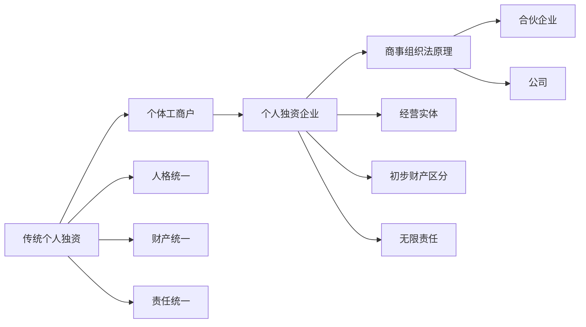

## 一、章节定位

本章以个人独资为商事组织的起点，逐步说明商个人为何不同于一般自然人、个人独资企业为何虽非法人却已呈现组织性，以及组织法为何不能被合同法完全替代。

核心线索可以压缩为一句话：传统个人独资是“自然人从事一项营业”，个人独资企业则是“营业开始实体化但尚未法人化”的过渡形态。由此引出组织法的三个观察维度：人格是否独立、财产是否切割、责任是否独立。

---

## 二、个人独资的一般原理

### （一）商个人：自然人之外多出的“营业”

商个人并非任何单一投资主体。国有独资公司、国有独资企业、一人公司、外商独资企业也可能只有一个投资者，但不当然属于商个人。商个人的关键是：投资者为自然人，且未采用公司等法人组织形式。

施天涛教材将商个人概括为以营利为目的从事商业活动的自然人，并指出我国法上的典型形态包括个体工商户、农村承包经营户和个人独资企业。课堂更强调商个人与民法上自然人的差异：自然人之外，多出一项持续性的经营、营业或投资活动。该营业在早期还不是主体，但已经不同于一般生活事务。

> [!tip] 商个人的识别
> “一个投资者”不是充分条件；“自然人 + 营业性经营 + 非公司组织形式”才进入商个人讨论。

### （二）传统个人独资的比较法图景

传统个人独资可以理解为一个自然人以个人活动从事营业。比较法材料将其表述为：一个所有者以个人活动经营业务，个人经营者与其营业之间具有完全同一性。

| 问题 | 传统个人独资的一般规则 | 组织法含义 |
| --- | --- | --- |
| 对外名义 | 通常以个人名义经营，也可使用字号或假名 | 字号只是经营外观，并非独立主体 |
| 登记 | 一般无须登记；使用假名或字号时可能登记 | 登记主要保护商号或公示外观 |
| 财产 | 个人生活财产与经营财产不分离 | 无正向财产切割 |
| 责任 | 经营债务由个人全部承担 | 无有限责任，也无责任隔离 |
| 转让 | 通过资产买卖转让营业 | 无股权或所有者权益可供转让 |
| 存续 | 原则上随经营者死亡或更换而终止 | 营业依附于投资人人格 |
| 税收 | 通常单层征税 | 营业所得归入个人层面 |

传统个人独资的三个统一，是后文理解个人独资企业、合伙和公司的坐标原点：

1. 人格统一：营业以经营者的民事人格为基础。
2. 财产统一：经营财产与个人其他财产没有法律上的强分离。
3. 责任统一：经营债务最终由经营者以全部财产承担。

> [!example] 课堂例子
> 流动摊贩卖糖葫芦或炒饭时，交易相对人通常是与经营者本人交易；若摊位后来有招牌、门店、雇员和固定顾客，营业开始从“某个人的行为”转向“可被识别的经营体”。

### （三）营业完整性的萌芽

传统规则认为投资人变化即主体变化。但商业实践中，交易相对人有时并不只认经营者本人，而是认招牌、口味、客户关系和整体业务。为了减少交易成本，遗嘱继承、营业转让、继续使用商号等制度会在一定程度上承认营业的持续性。

这一点为个人独资企业法埋下伏笔：营业不再只是自然人的一次次行为，而可能成为有名称、有财产、有员工、有商誉的经营实体。

---

## 三、我国法上的个体工商户

### （一）基本定位

《民法典》第54条规定，自然人从事工商业经营，经依法登记，为个体工商户。个体工商户可以起字号。它是我国最基础的商个人形态，也是传统个人独资在我国法上的重要表现。

个体工商户与传统个人独资高度接近：以自然人为核心，以个人或家庭经营为方式，组织规则较少，经营规模通常较小，并承担较强的个人化责任。

### （二）个人经营与家庭经营

《民法典》第56条第1款规定，个体工商户的债务，个人经营的，以个人财产承担；家庭经营的，以家庭财产承担；无法区分的，以家庭财产承担。

| 经营方式 | 责任财产 | 制度意义 |
| --- | --- | --- |
| 个人经营 | 经营者个人财产 | 接近传统个人独资 |
| 家庭经营 | 家庭财产 | 承认家庭共同劳动和共同受益 |
| 无法区分 | 家庭财产 | 对外保护债权人，避免责任财产不明 |

### （三）我国法上的两个便利化安排

《促进个体工商户发展条例》第13条规定，个体工商户可以自愿变更经营者或者转型为企业；变更经营者的，可以直接办理变更登记；变更经营者或转型为企业的，应结清税款、妥善处理原有债权债务，不得损害他人合法权益。

这类规则不是否认理论上的主体变更，而是在登记法和商事政策上承认营业的经济连续性。其功能在于降低注销后重设的交易成本，使既有合同、客户关系、行政许可衔接和市场声誉尽可能平稳延续。

---

## 四、个人独资企业：非法人但已组织化

### （一）概念与中心词

《个人独资企业法》第2条规定，个人独资企业是依照该法在中国境内设立，由一个自然人投资，财产为投资人个人所有，投资人以其个人财产对企业债务承担无限责任的经营实体。

该定义中的前三项仍延续传统个人独资：一个自然人投资、财产归投资人个人所有、投资人承担无限责任。真正的制度增量在“经营实体”。个人独资企业不是法人，但已经不只是自然人的一次经营行为，而是具备名称、住所、营业执照、从业人员、经营财产和事务管理结构的企业形态。

> [!caution] “经营实体”不是“法人”
> 个人独资企业可以以企业名义经营、申请贷款、取得土地使用权，并拥有相对独立的经营外观；但其财产仍归投资人所有，投资人仍承担无限责任，因此不能将其等同于公司法人。

### （二）设立与成立

《个人独资企业法》第8条列明设立条件：投资人为一个自然人，有合法企业名称，有投资人申报的出资，有固定生产经营场所和必要生产经营条件，有必要从业人员。

《个人独资企业法》第13条规定，营业执照签发日期为个人独资企业成立日期；领取营业执照前，投资人不得以个人独资企业名义从事经营活动。由此可见，个人独资企业虽然非法人，但仍以登记和营业执照作为取得企业名义的制度节点。

《个人独资企业法》第16条还排除法律、行政法规禁止从事营利性活动的人作为投资人。课堂举例包括法官、检察官、警察、公务员等受身份限制者。

### （三）不具有法人地位

教材将个人独资企业归入商个人，强调其成员单一、投资者具有自然属性、非法人、业主对企业债务承担无限责任。课堂则进一步指出，个人独资企业具有相对较弱的法律人格：有企业名称和经营外观，可以在一定程度上脱离投资人本人被识别，但没有完整独立的法人人格。

| 层面 | 传统个人独资 | 个人独资企业 | 公司 |
| --- | --- | --- | --- |
| 人格 | 依附自然人 | 相对弱人格，经营实体化 | 独立法人 |
| 财产 | 完全统一 | 初步区分企业财产与个人其他财产 | 公司财产独立 |
| 责任 | 个人全部承担 | 企业财产先清偿，不足时个人其他财产清偿 | 股东原则上有限责任 |
| 转让 | 资产买卖 | 营业转让问题突出 | 股权转让、合并、资产交易等 |

### （四）无限责任及其顺序

《个人独资企业法》第31条规定，个人独资企业财产不足以清偿债务的，投资人应当以其个人的其他财产予以清偿。这一规则至少包含两层含义：

1. 投资人最终仍承担无限责任。
2. 清偿顺序上，企业债权人原则上应先就企业财产受偿，企业财产不足时再追及投资人其他财产。

《个人独资企业法》第18条进一步规定，设立登记时明确以家庭共有财产作为个人出资的，应依法以家庭共有财产对企业债务承担无限责任。该规则将责任财产从投资人个人财产扩展到家庭共有财产，但前提是设立登记时明确以家庭共有财产出资。

### （五）解散后的五年责任消灭期限

《个人独资企业法》第28条规定，个人独资企业解散后，原投资人对企业存续期间的债务仍应承担偿还责任；但债权人在五年内未向债务人提出偿债请求的，该责任消灭。

该规则体现商法的特殊政策：一方面延续人格统一和无限责任，企业解散不当然消灭投资人的偿债责任；另一方面又以五年期间促使债权关系尽快了结，避免原投资人长期处于不确定的经营债务阴影中。

---

## 五、个人独资企业的运营

### （一）直接运营与委托运营

《个人独资企业法》第19条允许投资人自行管理企业事务，也允许委托或者聘用其他具有民事行为能力的人负责企业事务管理。委托或聘用他人管理时，应签订书面合同，明确委托内容和权利范围。

这说明个人独资企业已经出现经营权与所有权的初步分离。投资人仍是最终权利归属者和责任承担者，但日常经营可以交由受托人或被聘用人员执行。

### （二）职权限制的对抗效力

《个人独资企业法》第19条第4款规定，投资人对受托人或者被聘用人员职权的限制，不得对抗善意第三人。该规则与商事交易安全相连：内部授权限制不能轻易破坏外部交易相对人对经营外观的信赖。

> [!tip] 内外关系区分
> 对内，受托人超越权限可能违反委托合同并承担赔偿责任；对外，若第三人善意，投资人不得以内部职权限制否定交易效力。

### （三）诚信勤勉义务与禁止行为

《个人独资企业法》第19条第3款要求受托人或被聘用人员履行诚信、勤勉义务。第20条列举禁止行为，可分为两组：

| 类型 | 行为 | 规则目的 |
| --- | --- | --- |
| 绝对禁止 | 索取或收受贿赂，侵占企业财产，挪用企业资金，泄露商业秘密等 | 防止代理人直接损害企业财产和商业利益 |
| 相对禁止 | 擅自以企业财产担保，未经同意从事竞业、与企业交易、转让商标或知识产权使用等 | 防止利益冲突，但允许投资人同意 |

课堂将其与传统商事代理中的经理权、代办权作比较。我国个人独资企业法没有完整移植经理权或代办权制度，而是以委托/聘用合同、善意第三人保护和受托人义务构成简化版的商事管理规则。

---

## 六、转让、继承与营业转让

### （一）个人独资企业的转让与继承

《个人独资企业法》第17条规定，个人独资企业投资人对本企业财产依法享有所有权，其有关权利可以依法转让或继承。该条承认投资人可处分其在个人独资企业中的财产权利，但并未完整规定营业转让后的债务承担。

《个人独资企业法》第26条规定，投资人死亡或者被宣告死亡，无继承人或者继承人决定放弃继承时，个人独资企业应当解散。反面理解是：有继承人且继承人不放弃继承的，个人独资企业不因投资人死亡当然解散。

这一安排体现营业完整性的政策选择。传统个人独资严格依附经营者人格，投资人死亡本应导致主体变化；个人独资企业作为经营实体，已有名称、财产、雇员和交易关系，法律允许其在继承中维持连续性，以降低合同重签、权利重新取得和交易中断成本。

### （二）营业的概念

PPT 区分主观营业与客观营业：

| 类型 | 含义 |
| --- | --- |
| 主观营业 | 以营利为目的而进行的连续、有计划、同种类活动 |
| 客观营业 | 为营业活动组织起来的一切财产，以及营业中形成的有价值事实关系的总体 |

客观营业不只是财产清单。它包括动产、不动产、债权、知识产权、商号、商业秘密、客户关系、销售渠道、地理条件和商誉等积极财产，也可能包括与营业有关的债务。其价值往往高于各单项财产简单相加。

### （三）营业转让的效力

营业转让是保持客观意义上营业的整体性，将营业从一个主体转移到另一个主体。它可以全部转让，也可以部分转让。

对当事人之间，营业转让主要产生两类效果：

1. 组织化营业财产的移转：动产交付、不动产登记、工业产权登记、证券背书交付、客户关系和销售渠道移交等。
2. 转让人的竞业禁止义务：在一定期限、一定区域内，不得从事与所转让营业相同或类似的竞争性活动。

对第三人，核心争点是营业上的债权债务是否随营业转移。

### （四）个人独资企业转让后的债务承担争议

课堂以两个案例展示我国法缺少一般营业转让规则时的同案不同判：

| 案例 | 法院思路 | 背后理论 |
| --- | --- | --- |
| 程高峰与盱眙东方威尼斯休闲会所买卖合同纠纷 | 原会所与受让后新会所为两个独立独资企业，转让前债务不当然由新会所承担 | 强调个人独资企业与投资人人格同一，投资人变更意味着主体变化 |
| 彭孔梅与高远见、钟新学等民间借贷纠纷 | 投资人或名称变更属于变更登记，企业经营体继续延续，现企业及现投资人承担责任 | 强调经营实体和营业连续性 |

两个结论各有依据。若以传统个人独资为模型，债务依附于原投资人；若以经营实体为模型，债权人可能信赖的是持续存在的营业、商号、厂房、客户和业务本身。

### （五）营业转让债务承担的三种模式

| 模式 | 规则 | 对应组织图景 |
| --- | --- | --- |
| 法国式自由协商 | 债务不当然随营业转让，除非另有约定 | 传统个人独资：债务是经营者个人债务 |
| 德国/日韩式商号规则 | 继续使用商号时对原营业债务负责；不使用并公示时可排除 | 经营体已有商号、商誉和外观，但尚未完全法人化 |
| 意大利/澳门式概括转移 | 营业债务原则上作为营业组成部分一并转移 | 企业高度组织化，债务被视为营业整体的必要因素 |

我国《最高人民法院关于审理与企业改制相关的民事纠纷案件若干问题的规定》第24条至第27条在企业售出、资产入股、重新注册企业法人等场景中，较多采用债务随企业或资产整体转移的思路。但该司法解释主要服务企业改制背景，尚不能等同于一般营业转让法。

> [!caution] 营业转让规则的适用重心
> 对公司而言，控制企业通常可通过股权转让、合并、分立或重大资产交易完成；营业转让最能解释的是个人独资企业、个体工商户等尚未发展出独立人格和所有者权益的早期商事组织如何整体转让。

### （六）劳动债权的特别处理

营业转让中的劳动关系不能完全按普通债权债务处理。劳动合同既是营业事实关系的一部分，又涉及劳动者人格尊严和职业选择自由。

比较法上存在两种取向：一是强调就业保护，营业转让后劳动关系一并转移；二是强调劳动者选择自由，由劳动者与受让人协商是否继续劳动关系，并通过经济补偿保护劳动者利益。课堂评价中，后一种思路更能兼顾劳工保护、营业自由和人格尊严。

---

## 七、组织法原理：为什么需要组织

### （一）合同为何不够

组织不是合同的简单集合。单纯借款合同、委托合同、供货合同可以解决一次性交易，却难以低成本处理持续经营中的资本投入、控制权、剩余收益、代理成本、员工留用、客户关系和风险隔离。

PPT 中 Pamela 的故事说明：若企业需要额外资金，单纯借款会形成固定偿付义务，增加违约和破产风险；若引入投资人分享剩余收益，则投资人会要求参与控制，进而产生所有者之间的治理安排。组织由此成为资本、控制、收益和风险共同安排的制度工具。

### （二）经济学解释：交易成本与企业

科斯《企业的性质》的基本思路是：若没有交易成本，市场可以通过价格机制完成资源配置；正因为存在交易成本，企业才得以出现。在市场中，资源配置以价格为信号；在企业中，资源配置以权威为信号。

该解释说明了企业为何出现，但不足以说明不同企业组织形式之间的法结构差异。法学分析进一步追问：为什么有个人独资、合伙、公司、分公司、子公司等不同形态，它们在人格、财产和责任上如何不同。

### （三）人格分离与代理成本

商事组织的演化首先体现为人格逐渐分离：

1. 传统个人独资：经营活动依附投资人人格。
2. 使用字号或商号的个人经营：出现经营外观，但仍是经营者的名义工具。
3. 个人独资企业：形成经营实体，具有较弱独立人格。
4. 公司：取得完整法人人格，能以自己名义享有权利、承担义务。

当经营者不再亲自处理全部事务，而是委托经理人、受托人或职业管理者持续经营时，组织法开始处理代理成本：受托人有较大自由裁量权，因而需要诚信、勤勉、竞业限制、自我交易限制、外观保护等规则。

### （四）多重所有者问题

组织的进一步发展来自资本、技术、客户、劳动力等资源需求。单一投资者可能资金不足，也可能不愿独自承担全部风险；引入其他投资者、核心员工或资源提供者后，组织就必须安排控制权、剩余收益、退出机制和内部冲突解决。

这一问题在合伙和公司中更明显：合伙人之间的事务执行争议、财产份额转让、入伙退伙，以及公司中的大股东与小股东冲突，都是多重所有者结构带来的组织法问题。

---

## 八、资产切割理论

### （一）基本含义

Hansmann 与 Kraakman 的组织法理论认为，组织法的核心功能之一是资产切割。资产切割可以分为两个层面：

| 层面 | 含义 | 简化表达 |
| --- | --- | --- |
| 财产区分 | 为企业指定一组区别于所有者和管理者个人财产的资产池 | 企业可以以自己名义拥有或控制财产 |
| 责任区分 | 决定哪类债权人优先就哪组财产受偿 | 组织债权人与成员个人债权人排序 |

### （二）正向切割与反向切割

| 类型 | 含义 | 功能 |
| --- | --- | --- |
| 正向切割 | 组织债权人就组织财产具有优先性 | 使组织财产成为组织自己的财产 |
| 反向切割 | 所有者个人债权人就所有者个人财产具有优先性 | 保护成员个人财产不被组织债权人直接追及 |

正向切割回答的是“企业财产能否优先服务企业债权人”；反向切割回答的是“成员个人财产是否优先服务个人债权人”。有限责任是强反向切割的典型表现，但组织法更基础、更难被合同替代的功能是正向切割。

### （三）不同组织形态的切割强度

| 组织形态 | 人格强度 | 财产切割 | 责任结构 |
| --- | --- | --- | --- |
| 传统个人独资 | 无独立人格 | 无切割 | 个人全部责任 |
| 个体工商户 | 极弱独立外观 | 基本无切割，家庭经营另有责任财产规则 | 个人或家庭财产承担 |
| 个人独资企业 | 弱独立人格，经营实体 | 初步正向区分：企业财产先清偿 | 投资人无限责任 |
| 普通合伙企业 | 弱独立人格 | 弱正向切割 | 合伙人无限连带责任，通常先以合伙企业财产清偿 |
| 公司 | 强独立人格 | 强正向切割 | 股东原则上有限责任 |
| 信托 | 特殊财产独立 | 超强正向切割 | 信托财产独立于委托人、受托人、受益人 |

《公司法》第236条关于清算后剩余财产分配的规则，是强正向切割的典型表现：公司财产须先支付清算费用、职工工资、社保费用、法定补偿金、税款并清偿公司债务后，才可向股东分配剩余财产。

### （四）组织法不能被合同替代的部分

反向切割可以通过合同在一定程度上创设或破除。例如，公司债权人可以要求股东担保，合伙债权人也可以同意只以合伙财产为限受偿。

正向切割则难以通过合同完全实现。若要让成员个人债权人均不得追及组织财产，就必须与所有既有和未来个人债权人达成约定，交易成本极高。组织法通过强制性财产归属和清算保护规则，统一排除成员个人债权人对组织财产的随意追及，这正是组织法的基础功能。

---

## 九、组织形态与选择

组织形态选择并非越高级越好。不同形态是在设立成本、责任承担、退出机制和治理结构之间做取舍。

| 维度 | 个人独资 | 合伙 | 公司 |
| --- | --- | --- | --- |
| 设立成本 | 较低，起字号或登记即可 | 合伙协议、字号、登记 | 出资、名称、住所、机关设置、登记 |
| 责任承担 | 投资人全部责任 | 普通合伙人无限连带责任 | 股东原则上有限责任 |
| 退出与存续 | 不永续，投资人变化影响较大；主要依靠营业或资产转让 | 人合性强，退出和份额转让受限制 | 永续性较强，股权转让相对灵活 |
| 治理机制 | “暴君制”：投资人集中控制 | “直接民主制”：合伙人共同决策 | “代议制”：股东会、董事会等机关治理 |

课堂用这一对比为后续合伙企业法和公司法铺垫：个人独资展示人格、财产、责任尚未充分分离的原点；合伙展示弱独立人格与人合性治理；公司展示完整法人、强财产切割和有限责任。

---

## 十、规范依据索引

| 规范 | 本章用途 |
| --- | --- |
| 《民法典》第54条 | 个体工商户的定义与起字号 |
| 《民法典》第56条第1款 | 个体工商户个人经营、家庭经营的债务承担 |
| 《促进个体工商户发展条例》第13条 | 个体工商户变更经营者、转型为企业及债权债务处理 |
| 《个人独资企业法》第2条 | 个人独资企业定义：一个自然人投资、无限责任、经营实体 |
| 《个人独资企业法》第8条 | 个人独资企业设立条件 |
| 《个人独资企业法》第13条 | 营业执照签发日期为成立日期 |
| 《个人独资企业法》第16条 | 禁止从事营利活动者不得作为投资人 |
| 《个人独资企业法》第17条 | 企业财产权利可依法转让或继承 |
| 《个人独资企业法》第18条 | 家庭共有财产出资时的无限责任 |
| 《个人独资企业法》第19条 | 自行管理、委托或聘用管理，职权限制不得对抗善意第三人 |
| 《个人独资企业法》第20条 | 受托管理人员禁止行为 |
| 《个人独资企业法》第26条 | 投资人死亡后的解散规则 |
| 《个人独资企业法》第28条 | 解散后五年未请求的责任消灭 |
| 《个人独资企业法》第31条 | 企业财产不足清偿时投资人以个人其他财产清偿 |
| 《公司法》第236条 | 公司清算保护与强正向切割 |

## 十一、复习抓手

1. 传统个人独资的起点是“三统一”：人格统一、财产统一、责任统一。
2. 商个人不是单一投资者的同义词，而是自然人以非公司形式从事营业。
3. 个体工商户的重点是登记、个人/家庭经营、经营者变更和转型便利。
4. 个人独资企业的关键词是“经营实体”：非法人，但比传统个人独资更组织化。
5. 无限责任不等于无清偿顺序；个人独资企业债务原则上先以企业财产清偿，不足时再追及投资人其他财产。
6. 委托运营引入代理成本，因此需要书面授权、善意第三人保护和诚信勤勉义务。
7. 营业转让的核心是债务是否随营业转移；法国、德国、意大利模式对应不同组织化程度。
8. 组织法的核心工具是资产切割；正向切割比反向切割更难由合同替代。
9. 个人独资、合伙、公司是一条组织化光谱，不是价值高低序列。

