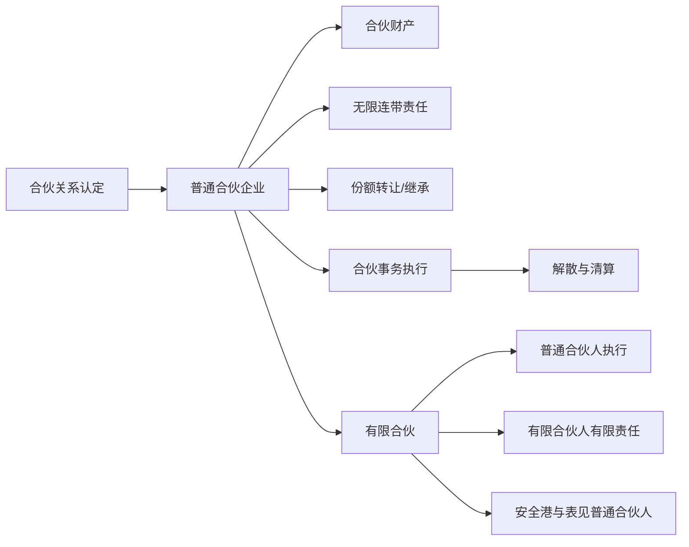

## 一、章节定位

合伙企业处在传统个人独资与公司之间。它比个人独资更具有组织性：有合伙协议、合伙名称、合伙财产、事务执行和清算规则；但它又不像公司那样具有完整法人人格和强有限责任。普通合伙的核心是“共同事业 + 人合信用 + 无限连带责任”，有限合伙则通过普通合伙人与有限合伙人的责任分层，把资金提供与经营控制分离。

本章的复习重心是四条线：合伙关系如何成立和被识别；合伙财产为何只有相对独立性；普通合伙人的无限连带责任如何发生、延续和内部追偿；有限合伙如何用“不得执行事务”换取有限责任。

---

## 二、合伙企业的概念与认定

### （一）形式概念

《合伙企业法》第2条第1款规定，合伙企业是自然人、法人和其他组织依照该法在中国境内设立的普通合伙企业和有限合伙企业。第2条第2款规定，普通合伙企业由普通合伙人组成，合伙人对合伙企业债务承担无限连带责任；第2条第3款规定，有限合伙企业由普通合伙人和有限合伙人组成，普通合伙人承担无限连带责任，有限合伙人以其认缴出资额为限承担责任。

有限合伙不是完全独立于普通合伙的制度。《合伙企业法》第60条规定，有限合伙企业及其合伙人适用有限合伙章规定；本章未作规定的，适用普通合伙企业及其合伙人的规定。因此，普通合伙是合伙企业法的基础形态。

### （二）学理概念：合同性与组织性

合伙是合伙人为实现共同目的而互相约定、实行共同经营的联合体。这里的“联合体”同时包含两层含义：

| 层面 | 含义 | 规则表现 |
| --- | --- | --- |
| 合同性 | 合伙人通过合伙协议联合，许多事项可由协议约定 | 合伙协议、利润分配、事务执行、入退伙、表决办法 |
| 组织性 | 合伙不是一次性交易，而是持续共同事业的组织 | 合伙名称、合伙财产、事务执行人、清算、对外代表 |

《民法典》第967条将合伙合同界定为两个以上合伙人为了共同事业目的，订立的共享利益、共担风险的协议。民事合伙强调合同关系；合伙企业在合同关系之上进一步固定为商事组织。

> [!tip] 合伙企业与合伙合同
> 合伙企业必须依法登记成立，并以营业执照签发日期为成立日期。未登记或缺少书面合伙协议，通常不能作为合伙企业对外活动，但仍可能根据共同目的、共享利益、共担风险等事实成立民事合伙关系。

### （三）合伙关系的实质认定

合伙关系不能只看名称、税务处理或口头标签。法院通常结合当事人的协议、交易性质、收益分配方式、风险承担方式和实际行为判断。

最核心的实质要素是：

1. 共同事业目的。
2. 共同经营或共同参与经营安排。
3. 共享收益。
4. 共担风险。

> [!example] Vohland v. Sweet
> Sweet 在 Vohland 的园艺业务中获得扣除费用后 20% 的收益。税务上未按合伙处理，Vohland 仍对外负责融资和账簿，Sweet 主要管理园艺实务。该案用于说明：利润分享是认定合伙的重要因素，但不是唯一因素；是否成立合伙要综合协议、交易性质和行为外观判断。

---

## 三、普通合伙企业的设立与地位

### （一）设立要件

《合伙企业法》第14条规定，设立合伙企业应具备：

| 要件 | 说明 |
| --- | --- |
| 两个以上合伙人 | 自然人合伙人应具有完全民事行为能力 |
| 书面合伙协议 | 第4条要求全体合伙人协商一致，以书面形式订立 |
| 出资 | 可以认缴或实际缴付 |
| 名称和生产经营场所 | 普通合伙企业名称中应标明“普通合伙”字样 |
| 其他法定条件 | 涉及前置审批事项的，应依法批准 |

《合伙企业法》第9条至第11条规定了设立登记：提交登记申请书、合伙协议书、合伙人身份证明等文件；材料齐全且符合法定形式的可当场登记，否则一般自受理之日起20日内决定；营业执照签发日期为合伙企业成立日期，领取营业执照前不得以合伙企业名义从事合伙业务。

### （二）普通合伙人的主体资格

普通合伙人可以是自然人、法人和其他组织，但存在限制。

自然人作为普通合伙人，应当具有完全民事行为能力。若后来被认定为无民事行为能力人或者限制民事行为能力人，经其他合伙人一致同意，可以依法转为有限合伙人，普通合伙企业相应转为有限合伙企业；未能一致同意的，该合伙人退伙。

《合伙企业法》第3条规定，国有独资公司、国有企业、上市公司以及公益性的事业单位、社会团体不得成为普通合伙人。其政策基础在于防止国有资产、公共利益或公众投资者因普通合伙人的无限连带责任而承受过度风险。普通公司原则上可以成为普通合伙人；《公司法》第14条第2款只是规定法律禁止公司成为对所投资企业债务承担连带责任的出资人的，从其规定。

### （三）合伙协议

合伙协议是合伙企业合同性的集中体现。《合伙企业法》第18条列明协议应载明企业名称、主要经营场所、合伙目的和经营范围、合伙人姓名或名称及住所、出资方式和期限、利润分配和亏损分担、事务执行、入伙退伙、争议解决、解散清算、违约责任等事项。

《合伙企业法》第19条规定，合伙协议经全体合伙人签名、盖章后生效；修改或补充协议应经全体合伙人一致同意，但协议另有约定的除外；未约定或约定不明的事项，先协商，协商不成再依合伙企业法及其他法律处理。

《合伙企业法》第33条第2款是少数强制性边界：合伙协议不得约定将全部利润分配给部分合伙人，或者由部分合伙人承担全部亏损。

---

## 四、合伙财产与责任结构

### （一）共同出资

普通合伙人可以用货币、实物、知识产权、土地使用权或者其他财产权利出资，也可以用劳务出资。非货币财产需要评估作价的，可由全体合伙人协商确定或委托评估机构评估；需要办理权利转移手续的，应依法办理。劳务出资的评估办法由全体合伙人协商确定并载入合伙协议。

有限合伙人不同。有限合伙人可以用货币、实物、知识产权、土地使用权或者其他财产权利出资，但不得以劳务出资。

### （二）合伙财产的范围与性质

《合伙企业法》第20条规定，合伙人的出资、以合伙企业名义取得的收益和依法取得的其他财产，均为合伙企业财产。《民法典》第969条也规定合伙人的出资、因合伙事务依法取得的收益和其他财产属于合伙财产，合伙合同终止前不得请求分割合伙财产。

合伙财产不等于公司法上的法人财产独立。教材强调，合伙财产在终极意义上仍属于合伙人，但在合伙存续期间具有一定独立性，由合伙人共同管理和使用，清算前原则上不得请求分割。

### （三）弱正向财产切割

合伙企业具有弱正向财产切割：合伙企业财产优先服务于合伙事业和合伙债务，但这种分割强度弱于公司。

| 规则 | 内容 | 含义 |
| --- | --- | --- |
| 第21条 | 清算前不得请求分割合伙企业财产，另有规定除外 | 合伙财产先维持合伙事业 |
| 第41条 | 合伙人个人债权人不得抵销其对合伙企业债务，也不得代位行使合伙人权利 | 防止个人债权人直接介入合伙组织 |
| 第42条 | 合伙人自有财产不足清偿个人债务时，可用分取收益清偿，也可强制执行其财产份额 | 保留例外，故为弱切割 |

> [!caution] 强制执行的细节
> 法院强制执行合伙人的财产份额时，应通知“全体合伙人”，而非仅通知“其他合伙人”。其他合伙人享有优先购买权；未购买且不同意转让给外人的，办理退伙结算或削减相应财产份额。

### （四）弱反向财产切割与无限连带责任

《合伙企业法》第38条规定，合伙企业对其债务，应先以其全部财产清偿。第39条规定，合伙企业不能清偿到期债务的，合伙人承担无限连带责任。

普通合伙人的责任应分两层理解：

1. 先以合伙企业全部财产清偿。
2. 不能清偿到期债务时，普通合伙人对不能清偿部分承担无限连带责任。

无限连带责任的“无限”是责任财产无限，即普通合伙人以个人全部财产负责；“连带”是债权人可向任一普通合伙人请求承担全部责任。该责任具有补充性和连带性。

《合伙企业法》第40条规定，合伙人因承担无限连带责任，清偿数额超过其亏损分担比例的，有权向其他合伙人追偿。内部追偿通常回到第33条第1款的亏损分担规则。

---

## 五、普通合伙人资格变动

### （一）入伙

入伙是在合伙企业成立后、解散前，非合伙人加入合伙企业并取得合伙人资格的法律行为。可区分为设立入伙、出资入伙和受让入伙。

《合伙企业法》第43条规定，新合伙人入伙，除合伙协议另有约定外，应经全体合伙人一致同意，并依法订立书面入伙协议；原合伙人应向新合伙人如实告知原合伙企业的经营状况和财务状况。

《合伙企业法》第44条规定，入伙的新合伙人与原合伙人享有同等权利、承担同等责任，入伙协议另有约定的从其约定；新合伙人对入伙前合伙企业债务承担无限连带责任。

> [!caution] 入伙前债务
> 新合伙人即使未参与过去经营，也要对入伙前合伙企业债务承担无限连带责任。其风险基础是普通合伙的人合信用和对外责任统一。

### （二）退伙类型

退伙是已取得合伙人资格的人在合伙企业存续期间退出合伙企业、丧失合伙人资格的事实或法律行为。

| 类型 | 主要事由 | 生效时间 |
| --- | --- | --- |
| 意定退伙 | 约定退伙事由出现、全体一致同意、难以继续参加、其他合伙人严重违约；无期限合伙可提前30日通知 | 依协议或通知规则 |
| 当然退伙 | 死亡或宣告死亡、丧失偿债能力、法人/组织被吊销/关闭/撤销/破产、丧失资格、全部份额被强制执行等 | 退伙事由实际发生之日 |
| 除名退伙 | 未履行出资义务，故意或重大过失造成损失，执行事务有不正当行为，发生协议约定事由 | 被除名人接到除名通知之日 |

被除名人对除名决议有异议的，可自接到除名通知之日起30日内向人民法院起诉。

### （三）退伙结算与债务承担

《合伙企业法》第51条规定，合伙人退伙，其他合伙人应按退伙时的合伙企业财产状况结算，退还其财产份额；退伙人给合伙企业造成损失的，相应扣减赔偿数额。退伙时有未了结事务的，待该事务了结后结算。第52条规定，退还办法由合伙协议约定或全体合伙人决定，可以退还货币或实物。

《合伙企业法》第53条规定，退伙人对基于其退伙前原因发生的合伙企业债务承担无限连带责任。第54条规定，退伙时合伙企业财产少于合伙企业债务的，退伙人依第33条第1款分担亏损。

普通合伙人的债务承担可用“三段债”记忆：

1. 入伙前债务：新合伙人承担无限连带责任。
2. 作为合伙人期间债务：当然承担无限连带责任。
3. 退伙后因退伙前原因发生的债务：退伙人仍承担无限连带责任。

### （四）继承

《合伙企业法》第50条规定，合伙人死亡或被宣告死亡，合法继承人按照合伙协议约定或者经全体合伙人一致同意，自继承开始之日起取得合伙人资格。

合伙企业应向继承人退还财产份额的情形包括：继承人不愿成为合伙人；继承人未取得法律或合伙协议要求的资格；合伙协议约定不能成为合伙人的其他情形。

继承人为无民事行为能力人或限制民事行为能力人的，经全体合伙人一致同意，可以依法成为有限合伙人，普通合伙企业依法转为有限合伙企业；未能一致同意的，应退还其财产份额。

---

## 六、合伙财产份额转让

### （一）转让限制的理由

合伙财产份额转让同时涉及财产法和团体法：

1. 财产法角度：合伙财产具有共有或共同管理色彩，处分会影响其他合伙人财产利益。
2. 团体法角度：普通合伙是人合组织，新合伙人的信用、能力和责任承担能力会影响全体合伙人。

因此，普通合伙份额对外转让远比公司股权转让严格。

### （二）对外约定转让的“三重大山”

合伙人向合伙人以外的人转让财产份额，通常要经过三道程序：

| 步骤 | 规则 | 依据 |
| --- | --- | --- |
| 其他合伙人一致同意 | 除协议另有约定外，对外转让全部或部分份额须经其他合伙人一致同意 | 第22条第1款 |
| 其他合伙人优先购买权 | 在同等条件下，其他合伙人有优先购买权，协议另有约定除外 | 第23条 |
| 修改合伙协议 | 受让人经修改合伙协议即成为合伙人 | 第24条 |

“同等条件”可参考公司股权转让中的数量、价格、支付方式、支付期限等因素综合判断。

> [!question] 修改合伙协议的争点
> 其他合伙人已同意对外转让并放弃优先购买权后，是否仍可拒绝修改合伙协议？课堂倾向认为，基于诚信原则和禁反言，修改合伙协议应更接近附随义务；但从法条文字看，是否能直接推出该义务仍有解释空间。

### （三）对内转让

《合伙企业法》第22条第2款规定，合伙人之间转让在合伙企业中的全部或者部分财产份额时，应当通知其他合伙人。对内转让未引入外人，通常不破坏人合性，因此仅要求通知。未通知通常属于行为义务违反，不当然影响转让效力。

### （四）质押与强制执行

合伙份额质押虽不是直接买卖，但质权实现时可能导致外人取得份额，因而属于实质性对外转让。《合伙企业法》第25条规定，合伙人以其在合伙企业中的财产份额出质，须经其他合伙人一致同意；未经一致同意的，行为无效，由此给善意第三人造成损失的，由行为人依法承担赔偿责任。

强制执行则兼顾个人债权人利益和合伙人合性。《合伙企业法》第42条允许债权人请求法院强制执行合伙人的财产份额，但须通知全体合伙人，其他合伙人享有优先购买权；若其他合伙人未购买又不同意转给外人，则进入退伙结算或削减份额结算。

---

## 七、普通合伙人的权利与义务

### （一）权利

普通合伙人的权利可分为共同权利和单独权利。

| 类型 | 内容 | 规则 |
| --- | --- | --- |
| 事务执行权 | 合伙人对执行合伙事务享有同等权利 | 第26条 |
| 表决权 | 未约定时，一人一票并经全体合伙人过半数通过；另有规定从其规定 | 第30条 |
| 利润分配请求权 | 先约定，后协商，再按实缴出资比例，无法确定则平均 | 第33条 |
| 追偿权 | 对外清偿超过亏损分担比例的，可向其他合伙人追偿 | 第40条 |
| 知情权 | 可查阅会计账簿等财务资料 | 第28条 |
| 监督权 | 不执行事务的合伙人有权监督执行事务合伙人 | 第27条 |

### （二）义务

《合伙企业法》第32条规定了普通合伙人的三项核心义务：

1. 竞业禁止：不得自营或者同他人合作经营与本合伙企业相竞争的业务。
2. 关联交易限制：除协议另有约定或者经全体合伙人一致同意外，不得同本合伙企业交易。
3. 不得损害合伙企业利益。

违反义务所得收益应归合伙企业所有；造成损失的，应依法承担赔偿责任。第96条还规定，合伙人执行事务或从业人员利用职务便利侵占合伙企业利益或财产的，应返还并赔偿损失。

---

## 八、合伙事务执行

### （一）共同执行原则

《民法典》第970条规定，合伙事务由全体合伙人共同执行；可按合同约定或全体决定委托一个或数个合伙人执行，其他合伙人不再执行事务，但有监督权。合伙人分别执行事务时，执行事务合伙人可以提出异议，异议后应暂停执行。

《合伙企业法》第26条、第30条亦确立共同执行和一人一票规则。民事合伙默认重大决定全体一致；合伙企业则更强调组织运行效率，未约定时一般按一人一票、过半数通过，但法定特别事项仍要求一致同意。

### （二）需要一致同意的特别事项

除合伙协议另有约定外，下列事项通常需要全体合伙人一致同意：

| 事项 | 依据 |
| --- | --- |
| 改变企业名称、经营范围、主要经营场所 | 第31条 |
| 处分不动产，转让或处分知识产权和其他财产权利 | 第31条 |
| 以合伙企业名义为他人提供担保 | 第31条 |
| 聘任合伙人以外的人担任经营管理人员 | 第31条 |
| 合伙人与本企业交易 | 第32条 |
| 新合伙人入伙 | 第43条 |
| 有期限合伙中经全体同意退伙 | 第45条 |
| 继承人取得合伙人资格 | 第50条 |
| 普通合伙人与有限合伙人相互转变 | 第82条 |

《合伙企业法》第37条规定，合伙企业对合伙人执行事务以及对外代表权的限制，不得对抗善意第三人。第97条规定，擅自处理须经一致同意事项并造成损失的，依法承担赔偿责任。由此区分内部责任与外部效力：内部越权可能赔偿，对外则保护善意第三人。

### （三）执行事务合伙人

全体合伙人可以按照协议约定或全体决定，委托一个或数个合伙人对外代表合伙企业、执行合伙事务。法人或其他组织作为合伙人执行事务的，由其委派代表执行。

执行事务合伙人的主要义务包括：

1. 定期报告事务执行情况、经营和财务状况。
2. 将执行事务收益归合伙企业，费用和亏损由合伙企业承担。
3. 履行信义义务，不得侵占合伙企业利益或财产。

不执行事务的合伙人有知情权、监督权；执行事务合伙人不按协议或全体决定执行事务的，其他合伙人可以决定撤销委托。多个执行事务合伙人分别执行时，其他执行人可提出异议，异议提出后应暂停该项事务执行。

### （四）聘用经营管理人员

合伙企业可以聘任合伙人以外的人担任经营管理人员，但除协议另有约定外，应经全体合伙人一致同意。被聘任人员应在授权范围内履职；超越授权范围或因故意、重大过失给合伙企业造成损失的，依法承担赔偿责任。

---

## 九、解散、清算与破产

### （一）解散事由

《合伙企业法》第85条规定的解散事由可分为意定解散与法定解散：

| 类型 | 事由 |
| --- | --- |
| 意定解散 | 合伙期限届满且决定不再经营；协议约定事由出现；全体决定解散；合伙目的实现或无法实现 |
| 法定解散 | 合伙人不具备法定人数满30日；被吊销营业执照、责令关闭或撤销；其他法定原因 |

### （二）清算

合伙企业解散后应清算。清算内容包括确定清算人，清理资产，通知并公告债权人，收取债权，清偿债务，退还出资和分配剩余财产。

《合伙企业法》第88条要求清算人自被确定之日起10日内通知债权人，并于60日内在报纸上公告；债权人接到通知书的，自接到之日起30日内申报，未接到通知书的，自公告之日起45日内申报。清算期间合伙企业存续，但不得开展与清算无关的经营活动。

合伙企业财产在支付清算费用、职工工资、社会保险费用、法定补偿金、税款并清偿债务后的剩余财产，依第33条第1款分配。

### （三）注销后与破产后的债务承担

《合伙企业法》第91条规定，合伙企业注销后，原普通合伙人对合伙企业存续期间债务仍承担无限连带责任。

《合伙企业法》第92条规定，合伙企业不能清偿到期债务的，债权人可以申请破产清算，也可以要求普通合伙人清偿；合伙企业依法被宣告破产的，普通合伙人对合伙企业债务仍承担无限连带责任。合伙企业破产不等于普通合伙人免责。

---

## 十、有限合伙

### （一）制度定位

有限合伙由普通合伙人和有限合伙人组成。普通合伙人负责经营管理并承担无限连带责任，有限合伙人主要提供资金并以认缴出资额为限承担责任。它将合伙的税收与协议灵活性、普通合伙人的信用责任、有限合伙人的有限责任结合起来，尤其适合投融资安排。

### （二）设立特别规则

| 事项 | 规则 |
| --- | --- |
| 人数 | 2个以上50个以下，法律另有规定除外 |
| 构成 | 至少有一个普通合伙人 |
| 名称 | 应标明“有限合伙”字样 |
| 协议特别内容 | 应载明普通/有限合伙人信息、执行事务合伙人条件和权限、除名更换程序、有限合伙人入退伙及普通/有限转变程序等 |
| 利润分配 | 可约定将全部利润分配给部分合伙人 |
| 出资 | 有限合伙人不得以劳务出资 |

### （三）有限合伙人的事务执行禁止

《合伙企业法》第67条规定，有限合伙企业由普通合伙人执行合伙事务。第68条第1款规定，有限合伙人不执行合伙事务，不得对外代表有限合伙企业。

该规则背后的交换关系是“控制与风险对应”：不执行事务、不对外代表，才能享受有限责任；若对外造成普通合伙人的外观，责任就可能上升。

### （四）安全港行为

《合伙企业法》第68条第2款、第3款列举若干不视为执行合伙事务的行为，包括：

1. 参与决定普通合伙人入伙、退伙。
2. 对企业经营管理提出建议。
3. 参与选择承办审计业务的会计师事务所。
4. 获取经审计的财务会计报告。
5. 查阅涉及自身利益的财务资料。
6. 自身利益受侵害时主张权利或起诉。
7. 执行事务合伙人怠于行权时，督促其行权或为本企业利益以自己名义起诉。
8. 依法为本企业提供担保。

这些行为体现有限合伙人的参与和监督，不等同于经营控制。

### （五）擅自执行事务的责任

《合伙企业法》第76条规定，第三人有理由相信有限合伙人为普通合伙人并与其交易的，该有限合伙人对该笔交易承担与普通合伙人同样的责任。这是“表见普通合伙人”规则。

有限合伙人未经授权以有限合伙企业名义与他人交易，给有限合伙企业或其他合伙人造成损失的，还应承担赔偿责任。

### （六）有限合伙人的特别权利与义务

| 事项 | 有限合伙人规则 | 与普通合伙人的差异 |
| --- | --- | --- |
| 责任 | 以认缴出资额为限承担责任 | 普通合伙人无限连带责任 |
| 入伙前债务 | 新入伙有限合伙人以认缴出资额为限承担 | 新入伙普通合伙人无限连带责任 |
| 丧失偿债能力 | 不当然退伙 | 普通合伙人个人丧失偿债能力当然退伙 |
| 丧失行为能力 | 不得因此要求退伙 | 普通合伙人可能转为有限或退伙 |
| 份额转让 | 可按协议约定对外转让，但提前30日通知其他合伙人 | 普通合伙人对外转让通常需一致同意和优先购买 |
| 继承 | 继承人或权利承受人可依法取得资格 | 普通合伙继承入伙通常依协议或一致同意 |
| 出质 | 可出质，协议另有约定除外 | 普通合伙人出质须一致同意 |
| 关联交易 | 可以交易，协议另有约定除外 | 普通合伙人原则上禁止，除协议另约或一致同意 |
| 竞业 | 可以竞争，协议另有约定除外 | 普通合伙人竞业禁止 |

### （七）普通合伙人与有限合伙人的转化

普通合伙人转为有限合伙人，或有限合伙人转为普通合伙人，除合伙协议另有约定外，应经全体合伙人一致同意。

责任后果：

1. 有限合伙人转为普通合伙人的，对其作为有限合伙人期间有限合伙企业发生的债务承担无限连带责任。
2. 普通合伙人转为有限合伙人的，对其作为普通合伙人期间合伙企业发生的债务承担无限连带责任。
3. 有限合伙企业仅剩有限合伙人的，应解散；仅剩普通合伙人的，转为普通合伙企业。

---

## 十一、特殊普通合伙与其他企业形态

### （一）特殊的普通合伙企业

特殊普通合伙企业主要适用于以专业知识和专门技能为客户提供有偿服务的专业服务机构。一般规则仍适用普通合伙，但责任承担有特别安排。

一个或数个合伙人在执业活动中因故意或者重大过失造成合伙企业债务的，该合伙人承担无限责任或者无限连带责任，其他合伙人以其在合伙企业中的财产份额为限承担责任。合伙企业对外以企业财产承担责任后，有故意或重大过失的合伙人还应按合伙协议对企业损失承担赔偿责任。

特殊普通合伙企业应办理执业保险，形成专业风险的外部缓冲。

### （二）LLP、LLLP、LLC 的比较意义

PPT 以 LLP、LLLP、LLC 说明现代组织形态的混合化趋势：

| 形态 | 核心功能 |
| --- | --- |
| LLP | 限制无过错合伙人对其他合伙人执业过错承担无限责任 |
| LLLP | 在有限合伙中进一步限制普通合伙人的责任 |
| LLC | 结合有限责任、单层征税和灵活治理 |

这些比较法形态不是本章的中国法主干，但有助于理解组织法创新方向：有限责任、税收待遇、控制权安排、外观公示和债权人保护之间不断重新组合。

---

## 十二、规范依据索引

| 规范 | 本章用途 |
| --- | --- |
| 《合伙企业法》第2条 | 合伙企业、普通合伙、有限合伙定义 |
| 《合伙企业法》第3条 | 不得成为普通合伙人的主体 |
| 《合伙企业法》第4条、第9条至第11条 | 书面合伙协议、登记与成立 |
| 《合伙企业法》第14条至第19条 | 普通合伙企业设立、出资、协议内容和修改 |
| 《合伙企业法》第20条至第25条 | 合伙财产、份额转让、优先购买、出质 |
| 《合伙企业法》第26条至第37条 | 合伙事务执行、表决、一致同意事项、对外代表限制 |
| 《合伙企业法》第38条至第42条 | 债务清偿、无限连带责任、个人债权人执行财产份额 |
| 《合伙企业法》第43条至第54条 | 入伙、退伙、除名、继承、结算和责任 |
| 《合伙企业法》第60条至第83条 | 有限合伙特别规则 |
| 《合伙企业法》第85条至第92条 | 解散、清算、注销后责任和破产 |
| 《民法典》第967条 | 合伙合同定义：共同目的、共享利益、共担风险 |
| 《民法典》第969条、第970条 | 合伙财产与合伙事务执行 |
| 《公司法》第14条第2款 | 公司转投资连带责任限制从其特别法 |
| 《公司法》第84条 | 同等条件下优先购买权的比较参照 |

## 十三、复习抓手

1. 合伙企业的本质是合同性与组织性的结合。
2. 合伙关系认定的核心不是名称，而是共同目的、共享利益、共担风险和实际行为。
3. 普通合伙财产具有相对独立性：有合伙财产，但不是公司式法人财产。
4. 普通合伙人的无限连带责任是补充性连带责任：先企业财产，后普通合伙人个人财产。
5. 入伙、退伙、退伙后债务共同构成动态责任链。
6. 普通合伙份额对外转让的三道关口：一致同意、优先购买、修改协议。
7. 强制执行财产份额要通知全体合伙人，其他合伙人有优先购买权。
8. 合伙事务执行要区分内部责任与外部善意第三人保护。
9. 有限合伙的核心交换是：有限合伙人不执行事务，换取有限责任。
10. 特殊普通合伙用责任分层保护无过错专业合伙人，但不免除有过错合伙人的无限责任。

