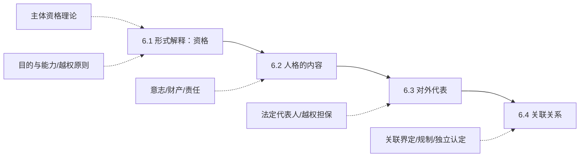

> [!notice] 范围说明
> 本讲分为四个板块：公司人格的形式解释（资格）、公司人格的内容（意志/财产/责任）、公司人格的对外代表、独立人格与关联关系。核心是理解公司人格从形式到实质的完整制度构造，并掌握法定代表人制度与越权担保规则。

## 一、章节地图

> [!tip] 复习抓手
> 本讲四条主线：`资格（公司凭什么有人格）→ 内容（人格意味着什么）→ 代表（人格如何对外行动）→ 关联（人格独立如何被挑战）`。重中之重是法定代表人制度与越权担保的分析框架。

---

## 二、6.1 公司人格的形式解释：资格

### （一）公司的三层法律定位

1. 公司是**法人**：法人是具有民事权利能力和民事行为能力，依法独立享有民事权利和承担民事义务的组织（《民法典》第 57 条）
2. 公司是**营利法人**：以取得利润并分配给股东等出资人为目的成立的法人（《民法典》第 76 条）
3. 公司是**依照公司法设立的营利法人**：依照公司法设立的有限责任公司和股份有限公司（《公司法》第 3 条）

这三层构成从一般到特殊的递进关系：法人 → 营利法人 → 公司法上的公司。

---

### （二）公司资格的内容：主体资格

围绕"公司何以成为主体"，存在两种基本理论：

| 理论 | 核心主张 | 制度功能 |
| --- | --- | --- |
| 拟制论 / 契约论 | 公司人格来自法律确认或有权机关授权；公司是合同的连接体 | 股东变更不影响合同继续履行，降低交易成本 |
| 实体理论 | 公司作为组织具有自己的名义和权利能力，是独立于成员的社会存在 | 公司以自己的名义从事民事活动，具有独立意志 |

拟制论下，公司人格的授权来源有二：法律的确认；章程的自治。两种理论并非非此即彼，而是分别解释公司人格的不同侧面。

---

### （三）公司资格的边界：目的和能力

拟制论下，对公司人格的限制传统上通过"公司目的"和"公司能力"两个维度展开。

#### 1. 公司目的与公司能力的区分

| | 公司目的 | 公司能力 |
| --- | --- | --- |
| 产生基础 | 基于拟制产生，与经营相联系 | 基于社团本身产生，与组织相联系 |
| 指向对象 | 营业类型、领域和范围 | 董事会、经理及其下属代理行为的控制 |
| 我国体现 | 经营范围 | 机关职权划分 |
| 限制来源 | 股东对公司的限制 | 法律、章程对管理机关的限制 |

在实证法中，国家基于主权的垄断是不需要目的的社团；公司是营利的私人社团，其目的的具体指向或活动的市场领域须加以限制。

#### 2. 越权原则及越权原则的衰落

##### （1）越权原则的内容

越权原则由 *Ashbury Railway Carriage & Iron Company v. Riche* 案确立，越权包括三种情形：

| 越权类型 | 性质 | 后果 | 现代法体现 |
| --- | --- | --- | --- |
| 公司欠缺目的 | 未在法律限制的营业领域获得授权 | 越权行为无效（公司不具备能力） | 市场准入规制：禁止进入、限制进入 |
| 公司欠缺能力 | 章程未赋予管理者具体权力 | 属于无权代理，股东会可追认；需考虑善意第三人保护 | 表见代理、善意第三人制度 |
| 下级机关或代理人越权 | 未获有权机关对特定事项的正当授权 | 依代理规则处理 | 内部授权体系 |

##### （2）越权原则的衰落与保留

- **公司章程的放松**：从列举式经营范围转向"anything lawful"
- **实体理论的影响**：公司能力不断扩展
  - *First National Bank of Boston v. Bellotti*：美国最高法院认为公司依据宪法第一修正案享有言论自由权，"公司作为国家的拟制物只能享有国家赋予的权利"的观点是极端的

越权原则并未完全消失，而是从"一律无效"转向"区分情形保护善意第三人"。

---

### （四）我国法上的公司能力

#### 1. 权利能力

公司享有权利和承担义务的资格。对权利能力范围的限制：

| 限制类型 | 内容 | 示例 |
| --- | --- | --- |
| 性质上的限制 | 基于自然人属性的权利公司不能享有 | 结婚自由（明确排除）；信仰自由、言论自由（存在争议） |
| 法律上的限制 | 法律、行政法规设定的准入限制 | 禁止或限制准入清单 |
| 目的上的限制 | 章程载明的经营范围 | 超越经营范围的经营行为效力另依合同编规则判断 |

#### 2. 行为能力

公司通过自己的意思表示构建法律关系的资格。

- 实体论下，公司通过其机构从事民事活动，在其权利能力范围内具有行为能力
- 公司机关的权限可能受到法律、目的（章程、股东会决议）的限制，超越限制的行为即为越权行为
- **章程对董事会职权的限制不能对抗善意第三人**（《公司法》第 67 条第 3 款）
- **章程或股东会对法定代表人职权的限制不得对抗善意第三人**（《公司法》第 11 条第 2 款）

---

## 三、6.2 公司人格的内容

### （一）公司与成员的区分

公司人格的首要内容是公司与成员（股东）的区分。公司是独立于股东的主体，股东变动不当然影响公司的存续和权利义务。

---

### （二）公司人格与公司意志

#### 1. 独立意志的内容

> [!quote]
> 社团的意志不同于股东的意志，社团的意志是**加总的股东的意志**，而不是**股东意志的加总**。

法人人格的突出后果：权利义务均由作为一个整体的团体承担，成员个人完全排除在外。"如果有什么东西应给付团体，它不应付给团体所属的个人，个人也不应偿还团体所欠之债。"个人作为团体成员有另一种身份，即使该团体只剩下他一人，该身份也不同其人格相混淆。

公司意志与成员意志分离的三个维度：

| 维度 | 内容 | 对意志独立性的影响 |
| --- | --- | --- |
| 股东人数 | 股份人数增加、股权分散 | 决策成本上升，个别意志与加总意志明显分离 |
| 股东的异质化 | 利益诉求、参与管理程度、投资分散化程度的差异 | 公司决策不能仅考虑某一种股东的利益 |
| 公司成员的多元化 | 除股东外还须考虑其他成员利益 | 意志更加复杂（如为长期战略采取收购防御措施） |

#### 2. 独立意志的程序

> [!quote]
> 不经凤阁鸾台，何名为敕。

- **决议必须开会的一般原则**：未召开股东会、董事会会议作出决议的，决议不成立（《公司法》第 27 条第 1 款）
- **可以不开会的例外**：
  - 有限公司股东可以书面一致同意，不开会作出决议（《公司法》第 59 条第 3 款）
  - 一人公司不设股东会，股东可以书面作出决定，签字盖章后置备于公司（《公司法》第 60 条）

> [!tip]
> 开会的本质是让不同意见经过讨论、交锋、表决，最终形成"团体的意志"而非某个人的意志。书面一致同意之所以可以替代开会，是因为此时不存在意见分歧，程序保障的目的已经实现。

---

### （三）公司人格、财产与责任

#### 1. 公司人格与财产

公司人格的含义之一在于公司具有独立的财产，股东财产和公司财产相互独立。

- **责任区分**：正向切割（公司财产与股东财产分离）与反向切割（股东财产与公司债务分离）

#### 2. 公司人格与责任承担

> [!caution] 核心辨析
> "独立承担民事责任" ≠ "有限责任"。股东的责任制度解决的是：当公司财产不足以偿还债务时，股东是否需要以自身财产为公司买单的问题。

更重要的区分在于**个人责任与团体责任**：
- 作为社团的公司，由于独立人格的存在，社团行为独立于股东行为，也独立于其他主体行为
- 但公司的行为毕竟要通过自然人实施——自然人行为结果何时归属于社团，是区分公司责任与个人责任的核心
- 侵权/刑事责任与合同责任的归属规则有所不同

---

## 四、6.3 公司人格的对外代表

### （一）公司对外民事活动的两种模式

| | 代表模式 | 代理模式 |
| --- | --- | --- |
| 理论基础 | 代表理论 | 代理理论 |
| 对外行为主体 | 法定代表机关 | 公司任何机关和个人（依内部权限） |
| 典型法域 | 我国 | 英美 |
| 核心特征 | 法定代表人是公司的代表机关，其行为即为公司的行为 | 公司对外行为通过代理规则实现，权限来自内部授权 |

---

### （二）代表理论与法定代表人

#### 1. 代表理论下代表人是代表机关

**法人机关**：法人是由一定功能或要件组合而成的组织体。构成法人实体的单位在理论上被称为机关或法人机关。

三个特征：
- 构成法人的组织单元
- 由自然人充任
- 对法人无人格，只具有**组织人格**

#### 2. 代表机关的组成模式

| 模式 | 内容 |
| --- | --- |
| 单独代表制 | 每一董事都可以对外代表公司 |
| 共同代表制 | 除非章程有相反规定，董事会成员应共同对第三人进行意思表示 |
| 独任代表制 | 法定代表人（我国采用） |

---

### （三）我国法定代表人的制度

#### 1. 法定代表人的选任

##### （1）谁可以做法定代表人

- 代表公司执行事务的**董事**
- **经理**
- 具体由章程确定

> [!question] 课堂追问
> - 公司在上述两个主体外选择其他主体担任，效力如何？
> - 违反章程规定选择法定代表人，效力如何？
> - 是否还存在对法定代表人的其他限制？

##### （2）谁是法定代表人——选任标准

- **选任标准：职位充任 + 当选生效**
  - 法定代表人是公司的机关，充任资格来自任职的职位而非个人
  - 只要被选举为担任法定代表人的董事，或被聘任为经理，即为法定代表人
  - 法定代表人自被选举任命时获得资格，但须登记（《公司法》第 32、34 条）
  - **不登记不影响法定代表人身份**，只是没有对抗效力
  - 法定代表人变更登记由新选任未登记的法定代表人签字（《公司法》第 35 条）

##### （3）法定代表人的变更与资格丧失

| 事项 | 规则 |
| --- | --- |
| 变更生效标准 | 变更担任法定代表人的董事或经理人选即可，未变更登记只是不存在对抗效力 |
| 资格丧失情形 | ① 董事、经理资格丧失（届满/丧失资格）；② 辞任（担任法定代表人的董事或经理辞任的，视为同时辞去法定代表人）；③ 公司修改章程 |
| 资格丧失时间 | 丧失资格之日 / 公司收到书面辞任通知之日起辞任（司法解释草案第 2 条）/ 修改章程之日 |
| 辞任后处理 | 公司应在法定代表人辞任之日起 **30 日内**确定新的法定代表人（《公司法》第 10 条） |

> [!question]
> 可否单独辞任法定代表人（而不辞任董事/经理）？

##### （4）法定代表人的登记

- **章程记载**：公司法仅要求章程记载法定代表人的产生、变更办法（第 46、95 条），除非章程记载了具体姓名，否则法定代表人变更无需修改章程
- **公司登记**：法定代表人姓名是公司登记事项（第 32、34 条），变更须完成登记事项变更
- 未变更登记不影响资格，只是不具有对抗效力
  - 司法解释草案第 2 条：公司办理变更登记或涤除信息公示前，法定代表人以公司名义从事民事活动，相对人请求公司承担法律后果的，人民法院应予支持，但公司证明相对人知道或应当知道法定代表人已经辞任的除外

##### （5）法定代表人的涤除诉讼

司法解释草案第 2 条：法定代表人以公司为被告，请求确认辞任生效且由公司向登记机关申请办理涤除信息公示，法院应予受理，并按以下情形处理：

| 情形 | 处理 |
| --- | --- |
| 公司在指定期间内确定了新的法定代表人 | 经释明后原告变更诉请为办理变更登记的，判令公司办理变更登记 |
| 公司未在指定期间内确定新的法定代表人，或未参加诉讼 | 判令公司向登记机关申请办理涤除信息公示 |
| 法律、行政法规对法定代表人离任、履职有特别规定，判令离任将违反该特别规定 | 判决驳回诉讼请求 |

---

#### 2. 法定代表人的代表行为

##### （1）代表行为的要件与效力

《公司法》第 11 条第 1 款：法定代表人以公司名义从事的民事活动，其法律后果由公司承受。

| 要件 | 内容 |
| --- | --- |
| 具有法定代表人资格 | 不具有资格的，可能构成无权代表 |
| 以公司名义 | 区分个人行为与代表行为的关键 |
| 在其代表的职权范围内 | 对代表权的限制来源：法律；章程、公司决议 |

具备全部要件的，为合法的代表行为，后果由公司承担；侵权行为由公司承担责任，公司可向有过错者追偿。

##### （2）越权代表与无权代表

**代表权的限制**：

| 限制来源 | 规则 | 条文 |
| --- | --- | --- |
| 章程或股东会决议的限制 | 可以限制，合法限制即有效，对外即为越权代表，但**不得对抗善意第三人** | 《公司法》第 11 条第 2 款 |
| 法律的限制 | 法律规定合同所涉事项应由权力机构或决策机构决议，或应由执行机构决定 | 合同编司法解释第 20 条第 1 款 |

**越权代表的效力**：

| 限制类型 | 相对人地位 | 效力规则 |
| --- | --- | --- |
| 法律的限制 | 相对人有知法守法义务 | 须尽到**合理审查义务**方可推定为善意，构成表见代表，合同有效；否则合同无效，但法人有过错的须赔偿 |
| 章程和股东会决议的限制 | 相对人无审查义务 | 直接推定为善意，相对人主张合同有效的，法院予以支持；但法人证明相对人知道或应当知道该限制的除外 |

**无权代表的效力**：
- 《公司法》第 34 条第 2 款：公司登记事项未经登记或未经变更登记，不得对抗善意相对人
- 《民法典》第 172 条：表见代理规则

> [!caution] 关键区别
> 法律限制 → 相对人须尽合理审查义务才能推定善意
> 章程/决议限制 → 直接推定相对人善意，公司反证

---

#### 3. 越权担保的处理

##### （1）法律依据

《公司法》第 15 条：
- 公司向其他企业投资或为他人提供担保，按照章程的规定，由董事会或股东会决议；章程对投资或担保总额及单项数额有限额规定的，不得超过
- 公司为公司股东或实际控制人提供担保的，应当经股东会决议
- 前述股东或受实际控制人支配的股东，不得参加表决；该项表决由出席会议的其他股东所持表决权的过半数通过

##### （2）司法立场的演变

| 阶段 | 立场 | 代表案例/文件 |
| --- | --- | --- |
| 传统做法 | 公司内部决议不得约束第三人；第 16 条非效力性强制性规定；认定担保无效不利于交易安全 | 中建材集团诉大地恒通案；招商银行诉振邦涂料案 |
| 九民纪要转向 | 不再讨论规范性质，第 16 条构成对法定代表人代表权限的限制；担保效力取决于相对人善意 | 《九民纪要》 |
| 现行规则 | 区分善意认定标准 | 《担保制度司法解释》第 7、8 条 |

##### （3）现行规则（《担保制度司法解释》第 7、8 条）

**担保类型**：

| 类型 | 决议要求 |
| --- | --- |
| 非关联担保（为他人担保） | 按章程规定，由董事会或股东会决议 |
| 关联担保（为股东/实控人担保） | 须经股东会决议 + 表决回避 |
| 准关联担保（有限公司为他人取得本公司股权提供担保） | 参照关联担保（司法解释草案第 2 条） |

**越权担保的效力**：取决于相对人的善意。

| 情形 | 善意标准 |
| --- | --- |
| **一般情形** | 相对人须履行**合理审查义务**（对有权机关决议的形式审查）方可推定善意 |
| **三种豁免情形** | 直接推定善意，豁免合理审查义务：① 金融机构开立保函或担保公司提供担保；② 公司为其全资子公司开展经营活动提供担保；③ 担保合同系由单独或共同持有公司 **2/3 以上**对担保事项有表决权的股东签字同意 |

**担保无效时的责任**：按过错承担。

##### （4）公司担保效力分析五步法

> [!tip] 答题框架
> **第一步**：判断公司为自己担保还是为他人担保
> - 为自己担保 → 无法定职权限制，章程/决议可限制但直接推定善意
> - 为他人担保 → 存在《公司法》第 15 条的职权限制
>
> **第二步**：针对为他人担保，区分限制类型
> - 对内担保（含为他人取得股权的担保）→ 须经股东会决议 + 表决回避
> - 对外担保 → 可由股东会或董事会决议
>
> **第三步**：判断是合法担保还是越权担保
> - 合法担保 → 有效
> - 越权担保 → 须进一步判断相对人善意
>
> **第四步**：选择善意判断标准
> - 一般：强标准（须尽合理审查义务）
> - 特别：三种情形豁免，直接推定善意
>
> **第五步**：根据善意情况确定效力
> - 符合善意标准 → 担保有效
> - 不符合 → 担保无效，但公司按过错赔偿

##### （5）特别规定

| 特殊主体     | 规则                                                                                                      |
| -------- | ------------------------------------------------------------------------------------------------------- |
| **上市公司** | ① 披露替代决议审查：相对人根据上市公司公开披露的担保决议信息订立合同，担保有效；② 披露不可豁免：相对人未根据公开披露信息订立合同，上市公司不承担担保责任或赔偿责任（含已公开披露的控股子公司）       |
| **分支机构** | 一般公司的分支机构未经决议以自己名义对外担保 → 担保无效，但相对人善意的有效； 金融机构分支机构在经营范围内或经授权开立保函 → 有效；担保公司分支机构未经授权对外担保 → 无效，但相对人善意的有效 |
| **一人公司** | 一人公司为其股东担保 → 公司不得以违反决议程序为由主张不承担担保责任； 但若因此无法清偿其他债务，股东不能证明财产独立的，其他债权人可请求该股东承担连带责任                      |

> [!question] 未解决问题
> - 仅规定了法定代表人越权担保，越权代理怎么办？
> - 超越限额的担保效力如何认定？
> - 章程可否授权法定代表人直接担保？
> - 越权投资是否应适用类似规则？

---

### （四）超越代表制度

#### 1. 法定代表人制度的反思

法定代表人制度是否真的简单易行？

- 债权人的应对：从审查法人到审查法定代表人
- 中国人民银行《关于进一步加强贷款管理有关问题的通知》（1998）：商业银行在发放贷款之前"对企业的法人代表及主要管理者的个人品质加强审查。对董事长、总经理、厂长、经理等主要管理人员有赌博、吸毒、嫖娼、包养情妇，经常出入歌舞厅、桑拿场所，大操大办婚丧红白喜事，购买与其经济实力不相称的高级轿车、经常租住高级宾馆等行为的，其企业贷款必须从严控制。"

#### 2. 代理理论下的公司对外关系

代理理论下，公司的任何机关和个人都可以对外代表公司做出行为，其权限来自公司内部的权限划分。

两个参考问题：
- 表见代理中"应当知道"的标准
- 下级机关或雇员是否可以对外签约

#### 3. "应当知道"与公司的授权体系

善意第三人的程度应当和交易之于双方的重要性相应：

| 规则 | 适用场景 |
| --- | --- |
| 规则一：一般对外授权 | 遵循商业惯例或该公司固有程式和通常行为（默示授权规则 + 越权规则） |
| 规则二：关联交易 | 内部交易不适用上述一般规则 |
| 规则三：重大资产交易 | 不适用一般规则（适用法定规制 + 公司实质变动标准） |

重大交易中，买方通常要求提供：经州官员证明的组织章程副本、存续和税收声誉证明、经秘书证明的内部规章副本、董事会批准决议副本及秘书证明书、签字有效性证明。

#### 4. 公司对外关系的理论框架

**一般通用规则：代理规则 + 越权**

| 授权类型 | 内容 | 抗辩规则 |
| --- | --- | --- |
| 明示授权 | 公司明确授予的权限 | — |
| 默示授权 | 表见代理、固有职权、推定知悉 | — |
| 越权：超越公司目的 | 超越经营范围 | 公司能力抗辩 |
| 越权：超越公司能力 | 超越章程对管理者的授权 | 善意第三人 |
| 越权：超越公司程式 | 超越章程、内部约定 | 善意第三人 |

**公司对外交易的审查层次**：

1. 是否属于内部交易
2. 是否属于重大资产交易（实质变动）
3. 是否涉及控制股东/大股东/发起股东重大资产交易（控股股东诚信义务 + 发起股东持股义务）
4. 是否涉及公司股权类证券（董事会发行权限 + 证监会登记披露规则）
5. 是否涉及公司总资产变动（有限责任和债权人保护规则）
6. 是否涉及内部劳动关系（劳动法）
7. 是否涉及公司职位出让（原有董事或控股股东诚信义务）
8. 是否涉及消费者保护（产品责任 + 企业同一性）

---

## 五、6.4 独立人格与关联关系

### （一）关联关系的界定

#### 1. 法律依据

- 《公司法》第 14 条第 1 款：公司可以向其他企业投资
- 《公司法》第 265 条第 4 项：关联关系，是指公司控股股东、实际控制人、董事、监事、高级管理人员与其直接或者间接控制的企业之间的关系，以及可能导致公司利益转移的其他关系。但是，国家控股的企业之间不仅因为同受国家控股而具有关联关系

#### 2. 关联关系的类型

两个形式上独立的企业，由于存在控制、共同控制关系，或受到同一主体的控制，产生社团意志不独立的情况。

| 类型 | 内容 | 结构示意 |
| --- | --- | --- |
| 纵向关联关系 | 控制、共同控制 | A → B（A 控制 B） |
| 横向关联关系 | 受到同一主体的控制 | A → B 且 A → C（B 与 C 受同一主体 A 控制） |

#### 3. 控制的认定

| 标准 | 内容 |
| --- | --- |
| **股权标准/客观标准** | 出资额占有限公司资本总额超过 50%，或持有股份占股份有限公司股本总额超过 50%；或比例虽低于 50%，但表决权已足以对股东会决议产生重大影响（《公司法》第 265 条第 2 项） |
| **实际标准/主观标准** | "实质重于形式"：在经营、人事、购销、筹资、盈利分配等方面实际拥有控制权。实际控制人是指通过投资关系、协议或其他安排，能够实际支配公司行为的人（《公司法》第 265 条第 3 项） |

> [!caution] 2023 年修订
> 2023 年《公司法》取消了"实际控制人不是股东"的要求。

控制方式包括：
- **投资关系**：股权的间接控制（乘法标准、连续标准）
- **协议**：控制权协议

---

### （二）法人人格丧失的弊端

法人人格的多元化（通过设立多个独立法人构建企业集团）带来的问题：

1. **法人创造主体的多元化**：人格多元化带来的理论困境
2. **资本的虚增**：同一笔资本在母子公司之间被重复计算
3. **破坏正常交易**，违背两个独立主体的假设：
   - 对公共利益的损害：税收规避
   - 对私人利益的损害：债权损害、损害弱势群体、破坏社会信任

---

### （三）关联关系的规制

| 规制手段 | 内容 | 法律工具 |
| --- | --- | --- |
| （1）限制控制程度 | 不得控制 | 限制交叉持股（《公司法》第 140 条：上市公司控股子公司不得取得该上市公司股份）、对上市公司收购的限制、限制董高兼任 |
| （2）直索责任 | 否认有限责任 | 刺破公司面纱（见第 7 章） |
| （3）信息披露 | 否认合同相对性 | 合并财务会计报告、变动报告、股东穿透（《公司法》第 140 条） |
| （4）非正常交易干预 | 否认合同自由 | 关联交易的规制、反垄断规制 |
| （5）特殊权利安排 | 否认独立人格 | 知情权的穿越行使、双重代表诉讼制度 |
| （6）破产时的合并计算 | 关联企业实质合并 | 关联企业存在不当控制时，破产中将形式上独立的企业视为整体，由各债权人就全部财产公平受偿 |
| （7）深石原则 | 衡平居次 | 控股股东存在不当控制时，其债权在公司破产/清算时次于普通债权人、优先股股东 |

> [!caution] 深石原则 vs 自动居次原则
> - **深石原则**（衡平居次）：控股股东存在不当控制时，其债权劣后受偿
> - **自动居次原则**：所有股东对公司享有的债权，自动劣后于普通债权人、优先股股东

**汉斯曼和斯奎尔的内外资产分割理论**：
- 外部资产分割：关联企业之间与外部股东之间的分割，往往被法院承认
- 内部资产分割：关联企业之间的资产分割，往往被法院忽视
- 忽视原因：企业集团内部相互同意承担对外部债权人债务的契约安排；内部资产分割没有外部分割的好处（降低监督需求、创造流动性、清算保护），且债务代理成本和会计成本高
- 结论：关联企业和企业集团更易被视为一体承担责任

---

### （四）独立企业的认定

#### 1. Douglas & Shanks（1929）四项标准

1. 每个企业具有分离的财务安排，出资充分
2. 商业记录、会计、财产、交易和雇员没有混同
3. 分离的、可见的公司形式
4. 不相互代表，不会误导公众认为两家公司是一体的

#### 2. Landers（1975）四项标准

1. 下属公司必须有充足的资本来开展其所追求的业务
2. 企业的组织和管理必须确保附属公司存在真实获利可能性
3. 附属公司不能过度依赖于母公司
4. 母公司必须将子公司作为一个独立实体来对待

#### 3. 公司独立于股东的三个层面

| 层面 | 内容 |
| --- | --- |
| 意志的独立 | 公司意志不是股东意志的加总，而是按法律、章程及内部规则所界定的意志形成等级和程序形成 |
| 利益的独立 | 公司追求的是自身利益，不能完全等同于股东尤其是部分股东的利益 |
| 形式的独立 | 作为层级组织，必须遵循特定的程式和程序（组织原则）：股东按股东会方式行动并遵循资本民主，董事按董事会方式决策并遵循人的民主 |

#### 4. 具体的认定要素

1. 各自的交易、会计账目、记录等没有混淆（**独立核算**）
2. 公司的合法程序得到遵守（**社团性**）
3. 每个公司的资本是充足的（**股东义务满足**）
4. 对外并不是一个公司的面目出现（**外部区别**）
5. 每个公司为各自的利益来经营，而不是其他或相互的利益（**独立控制与公司机会**）

---

## 六、高频易混点

1. "独立承担民事责任" ≠ "有限责任"：前者是公司以自己财产对外承担责任，后者是股东不对公司债务承担超出出资的责任
2. 法律限制 vs 章程限制：对法定代表人代表权的法律限制，相对人须尽合理审查义务；章程或决议的限制，直接推定相对人善意
3. 越权担保三步：为自己担保（无程序限制）→ 为他人非关联担保（董事会或股东会）→ 为他人关联担保（股东会 + 回避）
4. 善意标准区分：一般情形须形式审查决议 → 善意推定；三种豁免情形直接推定善意
5. 上市公司担保：公开披露信息方可作为相对人信赖基础，未披露则公司免责
6. 法定代表人资格 ≠ 登记：登记不是生效要件，是不对抗要件
7. 涤除诉讼：辞任后公司 30 日内不确定新人选 → 可诉请涤除登记
8. 一人公司担保：可以为股东担保，但若因此无法清偿其他债务且股东不能证明财产独立 → 连带责任
9. 深石原则是"衡平居次"（依个案判断），不是"自动居次"（一律劣后）
10. 关联企业的核心问题是意志不独立，规制手段从限制控制到否认人格形成梯度

---

## 七、简答题速记

### 1. 公司人格的形式解释（资格）

- 三层法律定位：法人（《民法典》第 57 条）→ 营利法人（《民法典》第 76 条）→ 依公司法设立的营利法人（《公司法》第 3 条）
- 主体资格理论：拟制论/契约论 vs 实体理论
- 资格边界：公司目的（经营范围）与公司能力（机关职权），越权原则（*Ashbury* 案）的三种情形及衰落

### 2. 公司人格的内容

- 公司与成员的区分
- 独立意志：内容（加总的意志 ≠ 意志的加总）+ 程序（决议须开会的一般原则与书面一致同意的例外）
- 独立财产：股东财产与公司财产相互独立
- 独立责任：公司责任 ≠ 股东有限责任；核心是区分个人责任与团体责任

### 3. 法定代表人的代表行为

- 要件：具有资格 + 以公司名义 + 在职权范围内
- 越权代表：法律限制（相对人须合理审查）vs 章程/决议限制（推定善意，公司反证）
- 无权代表：未登记不得对抗善意相对人；表见代理规则

### 4. 越权担保的分析框架

- 五步法：自己/他人 → 关联/非关联 → 合法/越权 → 一般/豁免善意标准 → 有效/无效
- 一般：合理审查义务（形式审查决议）
- 三种豁免：金融机构/担保公司、全资子公司、2/3 以上有表决权股东签字同意
- 上市公司：披露替代决议审查，未披露免责
- 一人公司：可为股东担保，但无法清偿时可能触发人格否认

### 5. 关联关系的规制手段（七种）

1. 限制控制程度（交叉持股禁止）
2. 直索责任（刺破公司面纱）
3. 信息披露（合并报表、股东穿透）
4. 非正常交易干预（关联交易规制、反垄断）
5. 特殊权利安排（知情权穿越、双重代表诉讼）
6. 破产合并计算（实质合并）
7. 深石原则（衡平居次）

### 6. 独立企业的认定要素

- 独立核算（账目、记录不混同）
- 社团性（合法程序得到遵守）
- 资本充足（股东义务满足）
- 外部区别（不以一个公司面目出现）
- 独立控制与公司机会（为各自利益经营）
