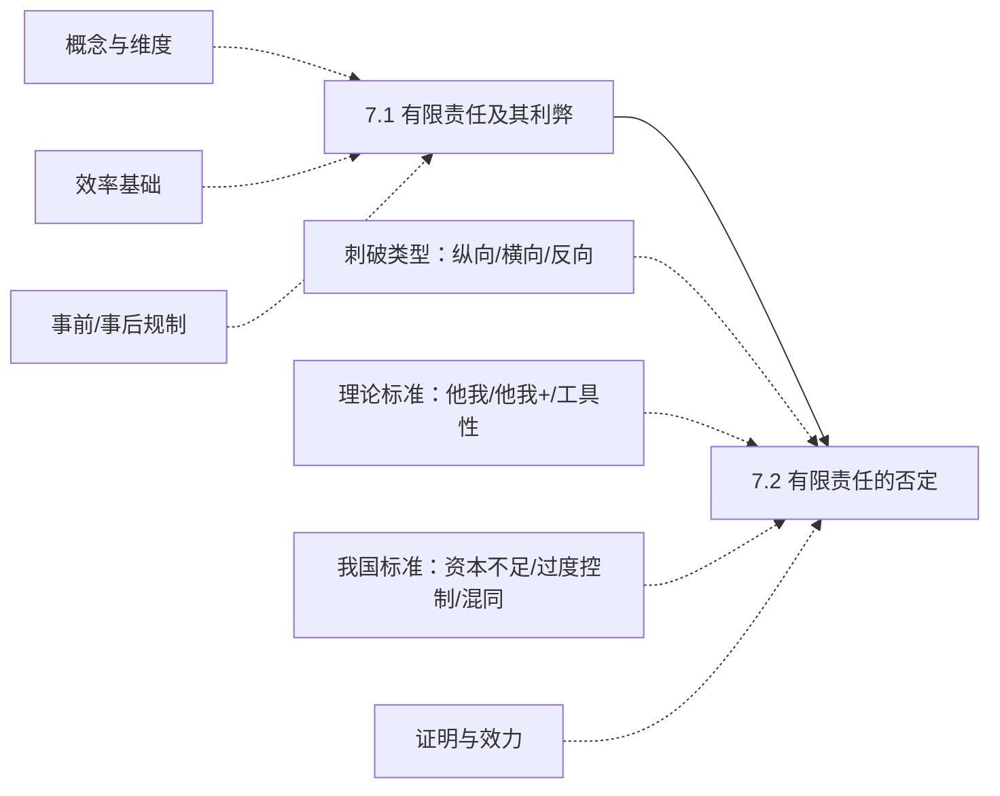

> [!notice] 范围说明
> 本讲分为两大板块：有限责任的制度原理（概念、效率基础、规制手段）与有限责任的否定（刺破公司面纱的概念、类型、理论标准、我国适用标准、证明与效力）。核心是理解有限责任作为公司法基石的功能逻辑，并掌握法人人格否认制度的适用要件与类型体系。

## 一、章节地图

> [!tip] 复习抓手
> 本讲两条主线：`有限责任为什么是公司法基石（效率逻辑）→ 什么情况下可以否定有限责任（刺破公司面纱）`。重中之重是刺破公司面纱的类型体系（纵向/横向/反向）、我国三种滥用标准的认定、以及一人公司的举证责任倒置。

---

## 二、7.1 有限责任及其利弊

### （一）什么是有限责任

#### 1. 公司法上的有限责任

**《公司法》第3条**：公司是企业法人，有独立的法人财产，享有法人财产权。公司以其全部财产对公司的债务承担责任。

**《公司法》第4条**：有限责任公司的股东以其认缴的出资额为限对公司承担责任；股份有限公司的股东以其认购的股份为限对公司承担责任。

> [!caution] 核心辨析
> "公司独立承担民事责任" ≠ "股东有限责任"。前者是公司以自己财产对外承担责任（团体责任吸收个人责任）；后者是股东不对公司债务承担超出出资的责任。两个概念相互关联但指向不同。

#### 2. 理解有限责任的两个维度

| 维度 | 内容 | 规范基础 |
| --- | --- | --- |
| **第一维度**：区分个人责任与公司责任 | 公司以其全部财产对公司的债务承担责任；股东不承担公司责任；董事、监事和高管也不承担公司债务 | 独立人格 → 个人责任被团体责任吸收 |
| **第二维度**：股东责任的上限 | 股东以其认缴的出资额/认购的股份为限承担责任；股东不承担对公司债务的补充责任 | 有限责任 |

"无限责任"在法律上也并非没有限制：第一，财产边界（债权人不能执行个人生活必需品）；第二，时间边界（诉讼时效）。

---

### （二）为什么要有限责任

> [!quote]
> "未来的经济史学家将会赋予那些将有限责任应用于贸易公司的无名的发明人，和瓦特、斯蒂芬森，以及其他的工业革命的先锋同样的荣誉地位。" ——《经济学人》，1926年12月18日

#### 1. 无限责任的弊端

1. 无限责任的联合要求高度的信任
2. 连带责任迫使相互承担责任
3. 无限责任的退出和转让成本高昂
4. 无限责任无法测量——外部投资者不能形成准确的"责任限额"预期，不可能出现统一的、大规模的资本市场（资本化、证券化、衍生证券、金融市场等均不能发展出来）

#### 2. 有限责任的效率

**（1）降低监督成本**

- 降低监督代理人的需求
- 降低股东之间的相互监督成本
- 有限责任使多样化投资和消极监督成为较理性的策略，从而潜在地降低公司运作成本

**（2）促进股份的自由转让**

- 有限责任使股票有了统一的市场价格，可以更好地反映企业价值（无限责任下价格依赖于股东的初始财富）
- 促进多元化投资、实现最优投资
- 降低监督其他成员的需求，降低成立企业的社会信任成本和人身依赖性，实现资本社会化

**（3）促进更有效率的投资决策**

- 通过股权的自由流动，形成对管理者的制约，促使管理者更有动力进行有效率的管理
- 允许企业从事变数很大的风险投资而不使投资者承担破产风险

#### 3. 为什么债权人会接受

| 论者 | 核心观点 |
| --- | --- |
| **波斯纳** | 有限责任下违约后逃避责任的可能性提高，但利率提高已将这种风险考虑在内，债权人事前已获得补偿 |
| **克拉克** | 合伙人可能愿意承担更高的利率；（1）债权人（如银行）承担风险的能力更强，具有更强的评估能力；（2）节约评估成本，不必向股东一一追索 |

**债权人类型与有限责任**：

| 类型 | 特征 |
| --- | --- |
| 自愿债权人 | 可以通过合同安排（利率、担保）事前补偿风险 |
| 一般债权人 | — |
| 侵权债权人 | 非自愿，无法事前议价——有限责任否定制度在此领域具有特殊的保护功能 |

> [!tip]
> 有限责任否定制度的发展，表明法律对权利的调整在技术上有了长足的进步，意味着有限责任的作用更专长于资本市场的塑造。

---

### （三）有限责任的规制

#### 1. 事前规制

**（1）公开性要求**

- **名称公示**（《公司法》第7条）：有限责任公司须标明"有限责任公司"或"有限公司"字样；股份有限公司须标明"股份有限公司"或"股份公司"字样
- **财务公开**（《公司法》第208条）：公司应在每一会计年度终了时编制财务会计报告，并依法经会计师事务所审计
- **财务报告送交**（《公司法》第209条）：有限公司按章程规定期限送交各股东；股份公司应在股东大会年会召开二十日前置备于本公司，供股东查阅；公开发行股票的股份有限公司必须公告
- **账簿规范**（《公司法》第217条）：除法定的会计账簿外，不得另立会计账簿；对公司资产，不得以任何个人名义开立账户存储

**（2）股东出资的义务**

- **《公司法》第28条**：股东应当按期足额缴纳公司章程中规定的各自所认缴的出资额
- 未按期足额缴纳出资的，除应当向公司足额缴纳外，还应当对给公司造成的损失承担赔偿责任

#### 2. 事后规制措施

有限责任的否定——刺破公司面纱（见7.2）。

---

## 三、7.2 有限责任的否定：刺破公司面纱

### （一）刺破公司面纱的概念

刺破公司面纱（piercing the corporate veil），最广义上是指股东、董事、高管人员甚至下属职员对公司责任的个人承担（连带、补充或共同），狭义上专指股东。在大陆法上被称为**法人人格否认**或**直索责任**。

> [!caution] 关键区分
> - 狭义的刺破公司面纱 = **有限责任的否定**（与有限责任相对）
> - 法人人格否认 = 与**法人制度**相对，未必完全是有限责任的否认
>
> 存不存在法人人格否认而非有限责任否认的情形？——横向人格否认即属此类：否认的是各公司的独立人格，而非直接否认股东的有限责任。

---

### （二）刺破的类型

**《公司法》第23条**（规范基础）：

> 公司股东滥用公司法人独立地位和股东有限责任，逃避债务，严重损害公司债权人利益的，应当对公司债务承担连带责任。
>
> 股东利用其控制的两个以上公司实施前款规定行为的，各公司应当对任一公司的债务承担连带责任。
>
> 只有一个股东的公司，股东不能证明公司财产独立于股东自己的财产的，应当对公司债务承担连带责任。

| | 类型 | 原告 | 被告 | 法理基础 |
| --- | --- | --- | --- | --- |
| **正向人格否认** | 纵向人格否认 | 公司的债权人 | 股东（实际控制人？） | 有限责任的否定 |
| | 横向人格否认 | 公司的债权人 | 同被控制的其他公司 | 法人人格的否定（否定独立财产和责任） |
| **反向人格否认** | 债权人提起的反向 | 股东的债权人 | 公司 | 法人人格的否定（否定正向资产分割） |
| | 股东提起的反向 | 股东 | 公司（非连带） | 法人人格的否定（否定独立地位） |

#### 1. 纵向法人人格否认（典型的刺破）

**《公司法》第23条第1款**：公司股东滥用公司法人独立地位和股东有限责任，逃避债务，严重损害公司债权人利益的，应当对公司债务承担连带责任。

要点：
- 狭义的法人人格否认 = 股东有限责任的否定
- 一般情况下，刺破的**发起人只能是公司的债权人**（公司股东和股东的个人债权人不能成为原告）
- 刺破的**被告只能是公司的股东**，且是实施了滥用行为的积极股东（董监高一般不能成为被告）

> [!question] 纵向关联关系中的实际控制人
> 实际控制人可否被要求承担连带责任？司法解释草案存在两种方案：
> - **方案一**：受同一股东、实际控制人过度控制且人格混同的，债权人可请求任一公司对其他公司债务承担连带责任，并可同时请求股东、实际控制人承担连带责任
> - **方案二**：区分处理——通过股权投资间接控制的实际控制人，参照第23条第1款承担连带责任；通过其他方式控制的实际控制人，依第180条第3款、第191条、第192条等承担损害赔偿责任

#### 2. 横向法人人格否认

**《公司法》第23条第2款**：股东利用其控制的两个以上公司实施滥用行为，各公司应当对任一公司的债务承担连带责任。

- 横向否认本质上是**人格的否认**——不再将同被控制的公司视为各自独立，因此一并偿债
- 被告是其他同被控制的公司（要求其连带），而非股东本人

> [!question]
> 同受实际控制人控制但股东不同的公司之间，是否适用横向人格否认？

#### 3. 反向法人人格否认

**（1）股东提起的反向法人人格否认**：股东主张公司人格不独立，以否定公司的独立地位。

**（2）股东的债权人提起的反向法人人格否认**：
- 一般不成立：执行股东的股权即可
- 特殊成立情形：集团公司；一人公司（但存在疑问）

> [!caution] 反向否认须特别谨慎
> 反向否认是对**正向资产分割**的否定，本质上否认了公司财产的独立性。一般仅限于一人公司和公司集团的情形。

---

### （三）"滥用"的理论标准

#### 1. "他我"理论（Alter Ego）

**Walkovszky v. Carlton 案**：原告被 Carlton 控制的 SeonCab 出租车公司车辆撞伤。Carlton 控制了10家出租车公司，每家公司仅拥有两辆出租车、只承担法定最低责任险（1万美元）。Seon 的资产远无法满足原告50万美元的赔偿请求。

核心命题：**公司是股东个人的傀儡**。关键问题是"控制"——但仅仅是控制尚不充分。

**Morris v. N.Y. State Dept. of Taxation and Finance**：上诉法院认为，刺破需要证明：（1）所有者对交易的完全控制权；（2）该控制被用来对原告进行欺诈或错误，导致原告受损。"仅依赖支配是不够的。"

#### 2. "他我+"理论（双叉测试）

| 叉 | 内容 |
| --- | --- |
| **第一叉** | 法院须发现个人和公司之间基本上没有差异（"他我"） |
| **第二叉** | 法院须发现维持公司面纱会制裁欺诈或不公正行为 |

**第一叉的考量因素清单**（法院将一长串因素与案件事实比较）：

- 资金和其他资产混同，未能将独立实体的资金分离，擅自将公司资金或资产转用于其他用途
- 个人将公司资产视为自己的资产对待
- 未取得发行股票或认购的权限
- 个人坚持他对公司的债务承担个人责任
- 未能保留会议记录或适当的公司记录，独立实体的记录混乱
- 两个实体的实质所有权相同
- 识别衡平法上的所有者具有对两个实体的支配和控制
- 识别两个实体负责监督和管理的董事和高级管理人员相同
- 个人或家庭成员对公司全部股份拥有唯一所有权
- 使用同一办公地点或营业地点
- 雇用同一雇员和/或律师
- 未能充分资本化公司（资本显著不足）
- 将公司仅仅用作单一企业、个人或其他公司业务的外壳、工具或渠道
- 隐瞒和歪曲责任归属、管理者和经济利益的同一性，或隐瞒个人经营活动
- 无视法定手续，未能维持相关实体之间的公平交易关系
- 使用公司实体为他人或实体购买劳务、服务或商品
- 向大股东或其他人转移公司资产损害债权人，或操纵实体之间的资产和负债将资产集中在一实体、负债集中在另一实体
- 与他人订立合约，意图避免使用公司实体作为个人责任的挡箭牌，或使用公司作为非法交易的借口
- 组建和使用公司，将其他人或实体现有的责任转让给该公司

> [!tip]
> 最常引用的刺破面纱的司法理由仅仅是结论性陈述，如"支配或控制"、"他我"等——这说明该领域的标准本身具有高度模糊性。

**第二叉**：如果公司"被组织或用来误导债权人或使欺诈行为永久化"，即可满足。在缺乏欺诈的情况下，原告证明"公司结构被用来使欺骗行为永久存在"，仍可满足。

**小结**：不当的控制 + 欺诈债权人。

#### 3. 工具性测试（Instrumentality Test）

三要件递进：

1. 被告对公司的控制完全控制了财务、政策和商业行为，使被控制的公司没有独立的思想、意志或存在
2. 被告利用这种控制进行欺骗行径或其他侵犯原告权利的行为
3. 被告的控制及其对信义义务的违反，是造成原告损害的**近因**

---

### （四）我国"滥用"的适用标准

#### 1. 资本显著不足

来源：*Minton v. Cavaney* 案。

一般很少单独适用，须结合其他因素。指设立后实际投入的资本数额与风险不匹配，没有从事经营的诚意，而是恶意将风险转嫁给债权人。

司法解释草案的表述——综合考量：
- 股东实际投入公司的资本是否与公司经营所隐含的风险**明显不相匹配**
- 股东是否存在使公司过度举债、恶意举债等方式，把投资风险**转嫁给债权人**的恶意

> [!caution]
> 资本显著不足须与公司"以小博大"的正常经营方式相区别。在合同交易中（合意交易），不充分的资本通常不单独构成刺破要件；在侵权案件中（非合意交易），资本不足是重要的考量因素。

#### 2. 过度控制

核心是滥用对公司的控制，利用公司的人格躯壳欺诈债权人，严重损害债权人的利益。

**典型情形**（母子公司之间）：
- 利益输送，严重损害债权人利益
- 关联交易，利益归一方、损失归另一方
- 逃废债：从原公司抽资，成立相同或相似公司
- 解散原公司后，以其财产另设相同相似公司
- 其他过度支配/控制，严重损害债权人利益的情形

司法解释草案的表述——综合考量：
- 数个公司都受同一控股股东的控制，相关公司自身**丧失独立意志**
- 数个公司之间进行**不当利益输送**
- 不当利益输送行为**意在逃避公司债务**

#### 3. 人格混同

包括**财产混同**、人员混同、业务混同。认定的**核心是财产混同**，其他只是补强内容（无财产混同仅业务或人员混同不构成）。

**财产混同的认定情形**：

| 情形 |
| --- |
| 股东无偿使用公司资金或者财产，不作财务记载 |
| 股东用公司的资金偿还股东的债务，不作财务记载 |
| 将公司的资金供关联公司无偿使用，不作财务记载 |
| 公司账簿与股东账簿不分，致使公司财产与股东财产无法区分 |
| 股东自身收益与公司盈利不加区分，致使双方利益不清 |
| 公司的财产记载于股东名下，由股东占有、使用 |
| 其他可能使财产混同无法区分的情形 |

司法解释草案的表述——综合考量：
- 股东财产能否与公司财产进行区分（主要看是否作了**财务记载**）
- 股东是否**无偿使用甚至侵占**了公司财产
- 是否存在人员混同、业务混同、住所混同等情形（补强因素）
- 必要时，法院可依申请通过**委托审计**等方式认定是否构成财产混同

---

### （五）刺破的证明

#### 1. 构成要件

| 要件 | 内容 |
| --- | --- |
| **滥用行为**（行为要件） | 原告须证明存在滥用法人独立地位和股东有限责任的行为 |
| **损害结果**（结果要件） | 原告须证明存在损害结果——逃避债务、严重损害公司债权人利益 |
| **因果关系** | 只要具备滥用行为，且依据社会共同经验可以判断其足以导致债权人的损害结果，即可认定因果关系成立 |

#### 2. 结果要件与诉讼程序

司法解释草案：
- 债权人对公司的债权**未经生效裁判确认**，仅请求股东、其他公司承担连带责任的 → 法院应释明告知追加公司为共同被告；债权人拒绝追加的 → **裁定驳回起诉**
- 债权人对公司的债权**已经生效裁判确认**，但直接申请变更、追加股东、其他公司为被执行人的 → 裁定**驳回变更、追加申请**，告知另行提起诉讼

> [!tip] 程序要点
> 正向否认必须**先告公司或列公司为共同被告**，不能绕开公司直接要求股东/关联公司承担连带责任。

#### 3. 举证责任倒置与一人公司

**《公司法》第23条第3款**：只有一个股东的公司，股东不能证明公司财产独立于股东自己的财产的，应当对公司债务承担连带责任。

> [!caution]
> 一人公司适用**举证责任倒置**：由股东证明财产独立，而非由债权人证明财产混同。

**司法实践的转向**（司法解释草案第8条）：

| 情形 | 处理 |
| --- | --- |
| 股东提供了符合法定形式要求的**相关年度财务会计报告** | 认定股东完成财产独立的**初步举证**；债权人主张报告不真实、不完整、不准确的，股东应作出合理说明并提供证据 |
| 股东不能提供年度财务会计报告，但提供了**完整、连续的公司会计账簿、会计凭证**并申请专项审计 | 法院可予准许，相关审计费用由该股东承担 |
| **股东为夫妻二人** | **不适用**公司法第23条第3款有关一人公司的规定 |

> [!question] 人格否认能否穿透
> 一人公司的股东也是一人公司，能否再穿透至该股东的股东？司法解释草案第9条：仅以"股东的股东不能证明财产独立"为由请求该股东的股东承担连带责任 → **不予支持**（除非符合过度控制等情形）。

---

### （六）刺破的效力

**连带责任**：公司股东滥用公司法人独立地位和股东有限责任，逃避债务，严重损害公司债权人利益的，应当对公司债务承担连带责任。

> [!caution] 个案否认
> 刺破公司面纱仅为**个案适用**。法院在某案中否认公司独立人格，仅适用于该案本身。股东在该案中承担连带责任后，并不影响公司作为独立法人继续存在，该股东在其他案件中依然承担有限责任。公司人格否认不是全面、彻底、永久地否定公司法人资格。

---

### （七）正向法人人格否认判断小结

| 步骤 | 判断内容 |
| --- | --- |
| **第一步** | 判断是否存在"关联关系"——核心是是否存在**控制**（控股股东、实际控制人的控制）；一次性交易/临时性控制/国家所有不能认定为控制 |
| **第二步** | 判断是否存在**滥用控制**的情形——核心是不当控制（利用人格欺诈债权人）或人格混同（核心是财产混同：不拿自己当外人）；辅助因素：资本显著不足、人员混同、业务混同 |
| **第三步** | 债权人权益受到损害，且滥用行为与损害结果之间存在**因果关系** |

---

### （八）理论探讨与其他替代机制

#### 1. 对刺破制度的理论批评

| 论者 | 核心观点 |
| --- | --- |
| **Easterbrook & Fischel** | "看上去如同闪电一样捉摸不定地发生，少见、苛刻以及毫无原则" |
| **Berkey v. Third Ave. Ry. Co.** | "包裹在隐喻的迷雾之中" |
| **Hansmann & Kraakman** | "不需要的"、"成本昂贵的" |
| **Robert B. Thompson** | 只能是"路线图"（road map），不可能是确定的规则 |
| **Robert C. Clark** | 欺诈交易法的功能不能通过刺破公司面纱替代；合同中的大多数刺破都可以通过欺诈交易法解决；刺破更多带有惩罚性，欺诈交易法则更多基于衡平原则（"真实、尊重和公平对待"） |
| **Stephen M. Bainbridge** | 功能紊乱的（dysfunctional）；主张废除刺破制度——代理法、合同法和侵权法上的规则已足以满足对欺诈、错误代理、转移资产等的保护；企业集团间的责任可通过企业间责任解决 |

#### 2. 其他机制的替代

- **欺诈产权转移机制**：以欺诈转移法处理债务人的不当资产转移
- **集团公司规制**：通过企业集团内部的统一责任规则替代个案刺破

---

## 四、高频易混点

1. "独立承担民事责任" ≠ "有限责任"：前者是团体责任吸收个人责任，后者是股东不对公司债务承担超出出资的责任
2. 狭义的刺破公司面纱 = 有限责任的否定；法人人格否认 = 与法人制度相对，范围更广
3. 纵向刺破（被告是滥权股东，法理是有限责任的否定）vs 横向刺破（被告是同被控制的其他公司，法理是人格的否定）
4. 正向否认（公司债权人发起）vs 反向否认（股东的债权人发起，一般仅限于一人公司和集团，须特别谨慎）
5. 实际控制人可否成为纵向刺破的被告——存在争议，司法解释草案方案一可、方案二区分处理
6. 三种滥用标准的核心：资本显著不足（风险与资本不匹配 + 恶意转嫁）、过度控制（丧失独立意志 + 不当利益输送 + 意在逃债）、人格混同（核心是财产混同 + 财务记载缺失）
7. 人格混同中，仅业务混同或人员混同而无财产混同，不构成刺破事由
8. 一人公司：举证责任倒置；夫妻二人公司不适用一人公司规则；人格否认的穿透一般不予支持
9. 刺破效力：个案否认，非永久性否定法人资格；须先告公司或列公司为共同被告
10. 刺破制度本身存在理论争议（捉摸不定、包裹在隐喻中、功能紊乱），有学者主张以欺诈交易法、代理法、企业间责任替代

---

## 五、简答题速记

### 1. 有限责任的概念与理解维度

- 规范基础：《公司法》第3条（公司独立责任）+ 第4条（股东有限责任）
- 第一维度：区分个人责任与公司责任（独立人格 → 团体责任吸收个人责任）
- 第二维度：股东责任上限（以认缴出资额/认购股份为限，不对公司债务承担补充责任）

### 2. 有限责任的效率基础

- 降低监督成本（监督代理人 + 股东相互监督）
- 促进股份自由转让（统一市场价格 + 多元化投资 + 资本社会化）
- 促进有效率投资决策（股权流动制约管理者 + 允许高风险投资而不使投资者承担破产风险）

### 3. 刺破公司面纱的类型体系

| 类型 | 原告 | 被告 | 法理 |
| --- | --- | --- | --- |
| 纵向否认 | 公司债权人 | 滥权股东（实控人？） | 有限责任的否定 |
| 横向否认 | 公司债权人 | 同被控制的其他公司 | 法人人格的否定 |
| 反向否认（债权人提起） | 股东的债权人 | 公司 | 否定正向资产分割 |
| 反向否认（股东提起） | 股东 | 公司 | 否定独立地位 |

### 4. 我国"滥用"的三种适用标准

- **资本显著不足**：实际投入资本与经营风险明显不匹配 + 恶意转嫁风险（很少单独适用）
- **过度控制**：丧失独立意志 + 不当利益输送 + 意在逃避债务
- **人格混同**：核心是财产混同（无偿使用不作记载、账簿不分、收益不分、财产记载于股东名下等），人员混同和业务混同仅为补强

### 5. 一人公司的人格否认

- 举证责任倒置（第23条第3款）
- 股东提供年度财务会计报告 → 完成初步举证
- 不能提供报告但提供完整账簿、凭证并申请专项审计 → 可准许
- 夫妻二人公司不适用一人公司规则
- 人格否认的穿透一般不予支持

### 6. 刺破的效力

- 连带责任
- 个案否认（非永久性否定法人资格）
- 须先告公司或列公司为共同被告
- 仅实施滥用行为的积极股东承担责任，不牵连其他股东
