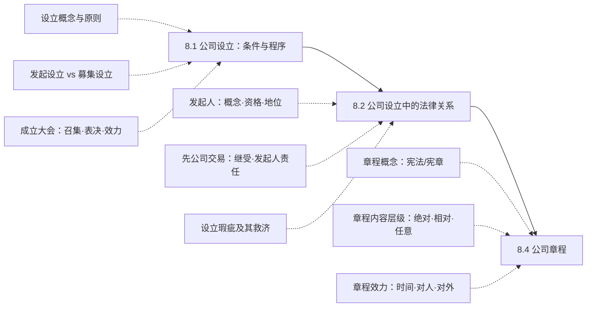

> [!notice] 范围说明
> 本讲分为三大板块：公司设立的条件与程序（发起设立与募集设立的区分、成立大会规则）、公司设立中的法律关系（发起人地位、先公司交易的继受与责任、设立瑕疵救济）、公司章程（概念性质、内容层级、制定与修改、对内对外效力）。核心是掌握募集设立的特别程序要件、发起人的责任体系（成立后/未成立/侵权/名义区分），以及章程作为公司宪法的自治规则属性。

## 一、章节地图

> [!tip] 复习抓手
> 本讲三条主线：`发起设立与募集设立的程序差异（特别是募集设立的特别要件）→ 发起人责任的三维框架（成立后 + 未成立 + 侵权）→ 公司章程的内容层级与效力范围`。重中之重是募集设立程序（发起人协议必须、35%认购底线、成立大会规则）、先公司交易的继受规则（第44条 + 同一体说）、以及章程绝对必要记载事项（第46条 vs 第95条）。

---

## 二、8.1 公司设立：条件与程序

### 一、公司设立的概念

公司设立，是指设立人依《公司法》规定在公司成立之前为组建公司进行的、目的在于取得公司主体资格的活动。

**公司设立的原则**：

| 原则 | 内容 |
| --- | --- |
| **特许设立** | 以国家元首命令或特别法令方式设立公司 |
| **准则设立** | 法律规定公司设立的必要条件，凡符合条件者经登记即可成立 |

---

### 二、公司设立的形式

#### （一）发起设立

发起人认缴/认购公司应全部注册资本或发行的股份而设立公司（全部卖给发起人）。

- 有限公司**均属**发起设立
- 股份公司**可以**发起设立

#### （二）募集设立

发起人认购公司应发行股份的**一部分**，其余股份向社会公开募集或者向特定对象募集而设立公司（只卖部分给发起人）。

- 仅适用于**股份公司**
- 区分为：**定向募集** / **公开募集**

---

### 三、发起设立的程序

1. **发起人发起行为**：可行性分析；筹备/签订发起人协议（**非必须**）
2. **制定公司章程**：经全体股东同意并签名盖章（从"填空题"到"选择题"）
3. **认缴出资**（有限公司可认缴）/ **出资**（股份公司须实缴）：货币出资；非货币出资
4. **建立公司组织**：有限公司由股东共同同意；股份公司通过成立大会

---

### 四、募集设立的程序

1. **发起行为**：签订发起人协议（**必须签订**）——以书面形式表达的共同设立公司、各自承担一定设立义务的意思表示一致的行为；筹办活动
2. **发起人制订公司章程**
3. **认购股份**：发起人认购法定数额的股份（**不少于35%**，须**实缴**）；募集股份（须**实缴**）
4. **建立公司组织**：成立大会

> [!caution] 发起设立 vs 募集设立关键差异
> | 要件 | 发起设立 | 募集设立 |
> | --- | --- | --- |
> | 发起人协议 | 非必须 | **必须** |
> | 发起人认购比例 | 全部 | **不少于35%** |
> | 出资要求 | 有限公司可认缴 | 发起人+募集人均须**实缴** |
> | 章程通过 | 全体股东签章 | 成立大会决议通过 |
> | 组织建立 | 股东同意或成立大会 | **必须**成立大会 |

---

#### 公开募集设立的特殊规定

| 制度 | 法条 | 内容 |
| --- | --- | --- |
| **招股说明书** | 第100条 | 发起人应公告招股说明书，制作认股书；认股书载明第154条第2款、第3款所列事项；认股人填写认购股份数、金额、住所，签名或盖章；按认购股份足额缴纳股款 |
| **承销协议** | 第155条 | 应由依法设立的**证券公司承销**，签订承销协议 |
| **代收股款协议** | 第156条 | 应同**银行**签订代收股款协议；银行按协议代收和保存股款，出具收款单据，并负有向有关部门出具收款证明的义务；募足股款后应予公告 |
| **强制验资** | 第101条 | 股款缴足后，应经依法设立的**验资机构验资**并出具证明 |

---

#### 成立大会

| 规则 | 内容 | 法条 |
| --- | --- | --- |
| **召集** | 发起人应自应发行股份的股款缴足之日起**三十日内**召开 | 第103条 |
| **通知** | 成立大会召开**十五日前**将会议日期通知各认股人或者予以公告 | 第103条 |
| **最低出席** | 应当有持有表决权**过半数的认股人**出席 | 第103条 |
| **表决比例** | 应当经出席会议的认股人所持表决权**过半数**通过 | 第104条 |

**成立大会的职权**（第104条）：

1. **审议筹备事项**：筹办报告、设立费用、发起人非货币财产出资的作价
2. **决议是否成立公司**：
   - **成立**：通过公司章程、选举董事、监事
   - **不成立**：发生不可抗力或者经营条件发生重大变化直接影响公司设立的，可以作出不设立公司的决议

**决议后的处理**：
- 决议设立 → 董事会应授权代表，于成立大会结束后**三十日内**向公司登记机关申请设立登记（第106条）
- 决议不设立 → 返还认股人所缴股款并加算**银行同期存款利息**

---

## 三、8.2 公司设立中的法律关系

### 一、发起人

#### （一）发起人的概念

| 概念 | 内容 |
| --- | --- |
| **形式上的发起人**（incorporators） | 在公司章程上签名的人 |
| **实质性的发起人**（promoter） | 承担组建公司、使其运转并采取必要步骤实现该目的的人 |

> [!quote]
> "One who undertakes to form a company with reference to a given project, and to set it going, and who takes the necessary steps to accomplish that purpose."

**我国法的规定**：

| 规范 | 内容 |
| --- | --- |
| 原《司法解释三》第1条 | 为设立公司而签署公司章程、向公司认购出资或者股份并履行公司设立职责的人（包括有限公司设立时的股东） |
| 《司法解释》（草案）第15条 | 引入"**设立人**"概念（来源《民法典》第75条）：包括有限公司设立时的股东 + 为设立公司而订立设立协议的人 + 股份公司的发起人 |

**人数限制**：
- 有限公司设立时的股东（第43条）：**1-50人**
- 股份公司承担筹办事务的股东（第93条）：**1-200人**

> [!tip]
> 我国采用的是**形式解释 + 实质解释**的结合。

---

#### （二）发起人的资格

| 问题 | 结论 |
| --- | --- |
| 限制行为能力人和无行为能力人能否担任？ | 应为具有**完全民事行为能力**的主体 |
| 非法人组织能否担任？ | 自然人、法人、非法人组织**均可**成为发起人 |
| 股份公司发起人的特别要求 | 应当有**半数以上**的发起人在中华人民共和国境内有住所（第92条） |

---

#### （三）发起人的法律地位

**1. 发起人与发起人之间：合伙关系**

发起人协议为合伙协议。发起人协议有限公司非必须、股份公司为必须。

**2. 发起人与公司之间的关系**（四种学说）：

| 学说 | 核心主张 | 问题 |
| --- | --- | --- |
| 无因管理说 | 发起人是公司的无因管理人 | 报酬请求权？ |
| 第三人利益契约说 | 发起人之间的协议是为第三人（公司）利益的契约 | 负担？ |
| 设立中的公司机关说 | 发起人是设立中公司的机关 | 不能设立时？ |
| 当然继承说 | 设立完成后公司当然继承发起人的权利义务 | 什么当然继承？ |

**3. 设立中的公司**

- **概念**：到注册登记获得法人资格之前的组织体
- **起点争议**：发起协议签订？订立章程？认购？
- **核心关切**：责任和利益归属
- **性质学说**：无权利能力社团说 / 合伙说 / 特殊法人团体
- **与已成立公司的关系**：**同一体说**

---

### 二、先公司交易

先公司交易（pre-incorporation contracts）的核心三问：

1. **公司继受问题**：公司成立后能否成为合同当事人？
2. **发起人责任问题**：公司成立后，若公司违约，发起人是否担责？
3. **设立失败问题**：公司未能设立，发起人是否对合同负责？

---

#### （一）公司继受问题

**1. 英美法的处理**

- 代理法原则：本人不受未经授权的代理人签订的合同约束；但本人可追认（ratify）
- 公司法原则：公司不能**追认**（ratify）成立前的行为，但可以**继受**（adopt）
- 继受时合同对公司产生效力，但需要批准

**2. 我国现行法**：《公司法》第44条第1款

> 为设立公司从事的民事活动，法律后果由公司承受。

**完全采用同一体说**：
- 包括发起人以**自己名义**签订的合同
- 包括以**设立中公司的名义**签订的合同
- 包括设立时发起人因履行设立职责造成**他人的损害**责任
- 公司成立后均应由公司承担
- 继受视为同一体，**无须通知债权人**

**公司的有限抗辩与追偿**：

| 情形 | 处理 |
| --- | --- |
| 以设立中公司名义签订、为发起人私利 | 公司**可以抗辩**，但不能对抗**善意第三人** |
| 侵权责任承担后 | 公司可向有过错的发起人**追偿**，但不能抗辩 |

**司法解释（草案）的细化**：

| 名义类型 | 规则 |
| --- | --- |
| 以设立中公司名义 | 相对人请求公司承担 → 应予支持；但公司能够证明该民事活动**与设立公司无关**的除外 |
| 以自己名义 | 第三人有权**选择**请求公司或者公司设立时的股东承担（第44条） |
| 侵权 | 设立时的股东因履行设立职责造成他人损害 → 公司或无过错的股东赔偿后，可向有过错的股东**追偿**（第44条） |

---

#### （二）公司成立后的发起人责任

**1. 英美法的分析框架**

| 因素 | 考量 |
| --- | --- |
| **签字形式** | 发起人以个人身份签字、还是以公司代理人身份签字？若明确表明代理人身份，可能表明仅由公司受约束 |
| **对方知悉与行为** | 对方是否知道业务将设立公司？对方是否有仅向公司求偿的意图？若有，可能表明免除发起人责任 |

**2. 我国的规则**

| 名义类型 | 发起人是否担责 |
| --- | --- |
| 发起人以**自己名义** | **可**选择发起人担责：合同相对人请求该发起人承担合同责任的，法院应予支持 |
| 发起人以**设立中公司名义** | **不可**要求发起人担责：公司成立后，合同相对人请求公司承担合同责任的，法院应予支持 |
| **侵权** | **不可**要求发起人担责：公司或无过错的股东赔偿后，可向有过错的股东追偿 |

---

#### （三）未成功设立的发起人责任

**1. 我国法**：《公司法》第44条第2款

> 公司未成立的，其法律后果由公司设立时的股东承受；设立时的股东为二人以上的，享有连带债权，承担连带债务。

**按合伙方式承担**：
- 对外：**无限连带责任**
- 对内：约定 → 出资比例 → 均分；发起人过错造成的可向该发起人追偿

**司法解释（草案）**：以设立中公司名义从事民事活动，公司未成立 → 相对人请求其他设立人承担连带责任，法院应予支持；但其他设立人能够证明该民事活动**与设立公司无关**的除外。

**2. 比较法的例外处理**

| 制度 | 内容 | 与发起人善意的关系 |
| --- | --- | --- |
| **事实公司**（de facto corporation） | 因设立程序中的技术缺陷未能形成合法公司，但法院仍将其视为公司对待 | **要求**发起人善意——善意努力设立 + 外观经营 |
| **禁反言公司**（corporation by estoppel） | 与公司交易的对方，事后不得否认公司的存在 | **不要求**发起人善意——禁止意外之财 |

**事实公司的认定标准**：

| 基本标准 | 替代标准 |
| --- | --- |
| （1）善意：善意努力设立公司 | （1）合法设立的可能：须有据以设立的法律 |
| （2）外观：推定股东将业务作为公司经营，尤其涉及系争交易 | （2）完成设立的努力：有表面上的设立尝试 |
| | （3）公司的外观与实践：实际使用或行使公司权力和特权 |

> [!question] 我国法的问题
> - 发起人以自己名义的合同继受？
> - 发起人以公司名义的合同当然成为主体？
> - 以设立中公司名义的合同——没有考虑第三人的问题？
> - 公司未能设立——如何理解"未成立"和"因故未能设立"？事实公司和禁反言公司是否可引入？

---

#### （四）先公司交易小结

**比较法框架**（发起人名义 + 相对人知悉状态）：

| | 相对人知道公司在设立中 | 相对人不知道公司在设立中 |
| --- | --- | --- |
| 发起人以个人名义 | — | — |
| 发起人以设立中公司的名义 | — | — |
| 发起人以公司的名义 | — | — |

**我国法规则汇总**：

| 情形 | 名义 | 责任规则 |
| --- | --- | --- |
| 公司成立 | 发起人自己名义 | 发起人**或**公司承担责任，**相对人选择** |
| 公司成立 | 设立中公司名义 | 公司承担责任；公司可以发起人为私利签订抗辩（但不得对抗善意第三人）/ 公司证明与设立无关（新法释） |
| 公司成立 | 侵权 | 公司承担；公司可向有过错的发起人追偿 |
| 公司未成立 | — | 发起人**连带**；其他设立人证明与设立无关的除外（新法释） |

---

### 三、设立瑕疵及其救济

#### （一）设立瑕疵的概念

公司虽然在形式上已经成立（已依法登记并获得营业执照），但实际上存在未能满足法定条件或程序、或其他违反强制性要求的情形，或者发起人/股东本身或其意思表示存在缺陷。

| 瑕疵类型 | 具体情形 |
| --- | --- |
| **设立主体瑕疵** | 行为能力问题；欺诈、胁迫；明知非法侵害债权人 |
| **设立行为瑕疵** | 认股不足；不符合法定条件；已决议不设立公司 |

#### （二）救济模式

| 模式 | 法域 | 内容 |
| --- | --- | --- |
| **瑕疵设立有效** | 英美法 | 设立条件越来越低，程序越来越简单，瑕疵设立的制度意义不大 |
| **瑕疵设立无效** | 德国法 | 股东或其他利害关系人可以提起无效诉讼 |
| **行政撤销** | **我国** | 撤销公司登记或者吊销营业执照 |

> [!quote]
> **法律上的公司（de jure corporation）**：指实质符合法定设立要件，仅存在极微小的技术性不合规的公司。无论州政府还是非州当事方，均不得质疑该公司的存在。

---

## 四、8.4 公司章程

### 一、公司章程的概念

#### （一）概念与性质

公司章程是由设立公司的股东制定并对公司、股东、公司经营管理人员具有约束力的调整公司内部的组织关系和经营行为的自治规则——公司的**宪法/宪章**（constitution）。

| 学说 | 内容 |
| --- | --- |
| **契约说** | 章程是股东之间的契约 |
| **自治说** | 章程是公司团体的自治规范 |

#### （二）三个概念的区分

**1. 章程 vs 发起人协议**

| | 章程 | 发起人协议 |
| --- | --- | --- |
| 性质 | 公司法定要件；**要式**法律文件 | 发起人之间的**合同** |
| 效力范围 | 公司成立后及于公司、股东、董监高 | 仅约束发起人 |
| 效力时间 | 公司成立后生效 | 协议签订后生效 |

**2. 章程 vs 股东会决议**

- 章程的绝对必要记载事项须章程规定
- 章程修改须**特别程序**决议

**3. 章程、股东会决议 vs 股东协议**

**股东协议是否具有约束公司的效力？**

| 立场 | 观点 |
| --- | --- |
| 支持说 | 基于合同的治理 |
| 反对说 | 公司诚实原则 |

**司法解释草案第14条**：部分或全体股东之间订立的协议不存在无效或可撤销情形，股东依据该协议请求其他股东承担责任的 → 应予支持；股东主张全体股东协议**对公司发生效力**的 → **不予支持**，但有以下除外：

1. 全体股东就股东会决议事项以书面形式**一致表示同意**，并在决定文件上签名或盖章
2. 法律规定全体股东的约定对公司发生效力
3. 公司以**股东会决议**形式予以认可，且不违反法律、行政法规强制性规定

---

### 二、章程的制定

#### （一）章程的内容层级

| 层级 | 性质 | 说明 |
| --- | --- | --- |
| **绝对必要记载事项** | 必须记载；不记载或记载违法 → 章程**无效** | 一般与公司设立或组织活动有重大关系（名称和住所、经营范围、资本数额、公司机构、法定代表人等） |
| **相对必要记载事项** | 可以记载也可以不记载；记载即产生约束力 | 授权性规范，如第65条：股东会会议通知十五日前——"公司章程另有规定或者全体股东另有约定的除外" |
| **任意记载事项** | 在不违反法律、行政法规和公共利益前提下，由章程制定者同意自愿记载 | 如股东会对股东的处罚权等；但不能损害股东的合法利益 |

**有限公司绝对必要记载事项**（第46条）：

> （一）公司名称和住所；（二）公司经营范围；（三）公司注册资本；（四）股东的姓名或者名称；（五）股东的出资额、出资方式和出资日期；（六）公司的机构及其产生办法、职权、议事规则；（七）公司法定代表人的产生、变更办法；（八）股东会认为需要规定的其他事项。股东应当在公司章程上签名或者盖章。

**股份公司绝对必要记载事项**（第95条）：

> （一）公司名称和住所；（二）公司经营范围；（三）公司设立方式；（四）公司注册资本、已发行的股份数和设立时发行的股份数，面额股的每股金额；（五）发行类别股的，每一类别股的股份数及其权利和义务；（六）发起人的姓名或者名称、认购的股份数、出资方式；（七）董事会的组成、职权和议事规则；（八）公司法定代表人的产生、变更办法；（九）监事会的组成、职权和议事规则；（十）公司利润分配办法；（十一）公司的解散事由与清算办法；（十二）公司的通知和公告办法；（十三）股东会认为需要规定的其他事项。

> [!caution] 有限公司 vs 股份公司绝对必要记载事项差异
> | 事项 | 有限公司 | 股份公司 |
> | --- | --- | --- |
> | 设立方式 | — | ✓ |
> | 已发行股份数/面额股金额 | — | ✓ |
> | 类别股 | — | ✓ |
> | 发起人认购情况 | — | ✓ |
> | 利润分配办法 | — | ✓ |
> | 解散事由与清算办法 | — | ✓ |
> | 通知和公告办法 | — | ✓ |
> | 监事会的组成、职权和议事规则 | — | ✓ |

**国外做法**：

| 法域 | 对外登记 | 内部细则 |
| --- | --- | --- |
| 美国 | **articles**：名称、目的、资本、住所、成员责任形式等；非经登记不产生效力 | **bylaws**：组织结构具体事项；登记后产生效力 |
| 英国 | **公司大纲** | **公司宪章**（articles） |

> [!question] 我国法是否管得太严格？

---

#### （二）章程内容的合法性

> [!quote]
> "The bylaws may contain any provision, not inconsistent with law or with the certificate of incorporation, relating to the business of the corporation, the conduct of its affairs, and its rights or powers or the rights or powers of its stockholders, directors, officers or employees."

**章程可否与法律规定不一致？** 如《公司法》规定持有1%以上股份股东可在股东大会召开十日前提出临时提案——章程可否改为5%、2%？十一日、九日？

审查标准：章程条款是否有**正当目的**（permissible purpose）。

---

#### （三）章程的制定与修改

**制定**：

| 设立方式 | 制定程序 |
| --- | --- |
| **发起设立** | 发起人共同制定章程；共同签字后章程**成立** |
| **募集设立** | 发起人制订章程**草案**；成立大会通过章程，决议通过后章程**成立** |

**修改**：
- 章程修改属于**股东会职权**范围，须以**特别程序**为之
- 例外（无需股东会决议）：有限公司股权转让等需变更股东信息；股份公司采用授权资本制授权董事会增资后的章程修改
- 章程修改以决议方式进行，一般决议通过章程即**生效**（而非备忘后生效）

---

### 三、章程的效力

#### （一）时间效力

| 节点 | 规则 |
| --- | --- |
| **生效** | 发起设立协议内容的，签字生效；章程部分：**成立时生效**（实质判断） |
| **失效** | 公司**终止时失效** |

> [!question]
> 非因解散生效？部分失效？

---

#### （二）对人效力

| 对象 | 效力 |
| --- | --- |
| **公司** | 内部约束力（内部治理）；外部约束力（公司权利能力和行为能力） |
| **股东** | 约束**全体股东**；章程可以限制股东的权利，但**不得侵犯股东的法定权利** |
| **董事、监事、高级管理人员** | 作为公司宪法，内部人员为公司作出的社团行为应以章程为行为准则；职权的**来源** |

> [!caution] 章程对股东的约束边界
> 章程可限制股东权利，但不能侵犯**法定权利**——即《公司法》赋予股东的固有权利（如知情权、表决权、利润分配请求权等）。

---

#### （三）章程的对外效力（公示力）

| 问题 | 结论 |
| --- | --- |
| 公司以外的人是否受章程约束？ | 章程**不能**影响到外部人 |
| 外部人能否依赖章程？ | 外部人**可以信赖**公司的章程（作为**事实的效力**） |
| 外部人是否负有审查章程的义务？ | 争议点 |

**特昆德原则（Turquand's Rule）**：

> 公司外部的第三方与公司的交易不受公司内部规则所影响（*Royal British Bank v. Turquand*, 1856）。

要点：
1. 任何**善意第三人**与公司的交易，不受章程限制（不包括公司管理者——内部人不能被视为第三人）
2. 必须是**交易**（而非馈赠、转移股份等无对价行为）
3. **善意**的边界：外部人知道实际权威的缺乏或非正常、应当但未对疑点作出查询、或欺诈 → 不被视为善意；但**不是因为章程公示这一理由就可以对抗第三人**

> [!caution]
> 英国1972年加入欧盟后该规则在立法上被废除，1989年公司法已采用新规则。但Turquand原则作为公司法经典原理仍具理论意义。

---

## 五、高频易混点

1. 发起设立 vs 募集设立：发起人协议（非必须 vs 必须）、发起人认购比例（全部 vs ≥35%）、出资要求（有限公司可认缴 vs 募集设立须全部实缴）
2. 成立大会的30日（股款缴足→召集）、15日（会前通知）、30日（决议设立→登记申请）三个期限易混
3. 发起人资格：有限公司1-50人 vs 股份公司1-200人；股份公司须半数以上在中国境内有住所
4. 设立中的公司与已成立公司：同一体说 → 继受无须通知债权人（第44条第1款）
5. 公司成立后发起人责任：以自己名义（相对人可选择发起人）vs 以设立中公司名义（仅公司）vs 侵权（仅公司+内部追偿）
6. 公司未成立：对外无限连带；对内约定 → 出资比例 → 均分；过错发起人可被追偿
7. 事实公司（要求善意）vs 禁反言公司（不要求善意）——核心区分
8. 章程 vs 发起人协议：法定要件、要式 vs 合同、非要式
9. 章程 vs 股东协议：股东协议原则上不对公司发生效力，除非全体一致、法律规定或公司决议认可
10. 三种章程记载事项层级：绝对必要（无效后果）→ 相对必要（授权性）→ 任意（不违法即可）
11. 有限公司 vs 股份公司绝对必要记载事项：股份公司多出设立方式、股份情况、类别股、发起人认购、利润分配、解散清算、通知公告、监事会议事规则
12. 章程修改：一般须股东会特别决议；但有限公司股份转让变更+股份公司授权资本制下董事会增资修改为例外
13. Turquand原则：善意第三人交易不受内部规则约束；但内部人、非交易行为、知悉不正常的第三人除外

---

## 六、简答题速记

### 1. 发起设立与募集设立的程序差异

- 发起设立：发起行为（协议非必须）→ 制定章程（全体签章）→ 认缴/实缴出资 → 建立组织
- 募集设立：发起行为（协议必须）→ 制订章程草案 → 发起人认购≥35%且实缴 + 募集股份实缴 → 成立大会通过章程、选举 → 30日内登记
- 公开募集额外要件：招股说明书（第100条）+ 承销协议（第155条）+ 代收股款协议（第156条）+ 强制验资（第101条）

### 2. 成立大会规则

- 召集：股款缴足之日起**30日**内
- 通知：**15日**前通知或公告
- 出席：持有表决权**过半数**认股人
- 表决：出席会议认股人所持表决权**过半数**通过
- 职权（第104条）：审议筹备事项 + 决议是否成立（通过章程、选举董监 / 不成立）
- 决议设立后：**30日**内申请设立登记（第106条）
- 决议不设立：返还股款 + 银行同期存款利息

### 3. 发起人的法律地位

- 发起人之间：合伙关系（发起人协议为合伙协议）
- 发起人与公司：四种学说——无因管理说、第三人利益契约说、设立中的公司机关说、当然继承说
- 设立中的公司：与已成立公司之间采同一体说
- 最低人数：有限公司1-50人（第43条），股份公司1-200人（第93条）
- 股份公司特别要求：半数以上发起人在中国境内有住所（第92条）

### 4. 先公司交易——公司成立时的规则（第44条第1款）

| 名义 | 规则 |
| --- | --- |
| 发起人自己名义 | 相对人**选择**发起人或公司承担 |
| 设立中公司名义 | **公司**承担；公司可证明与设立无关抗辩（不可对抗善意第三人） |
| 侵权 | **公司**承担；可向有过错发起人追偿 |

### 5. 先公司交易——公司未成立时的规则（第44条第2款）

- 设立时的股东承受法律后果
- 二人以上：**连带债权、连带债务**
- 按合伙承担：对外无限连带；对内约定 → 出资比例 → 均分；过错发起人可被追偿
- 新法释：其他设立人证明与设立无关的除外

### 6. 设立瑕疵的救济模式

- 英美法：瑕疵设立**有效**（设立条件低、程序简单）
- 德国法：瑕疵设立**无效**（利害关系人可提起无效诉讼）
- 我国：**行政撤销**（撤销登记或吊销营业执照）

### 7. 公司章程的内容层级

| 层级 | 性质 | 示例 |
| --- | --- | --- |
| 绝对必要 | 必须记载，否则章程无效 | 第46条（有限公司）、第95条（股份公司） |
| 相对必要 | 可记载可不记载，记载即有效 | 第65条（通知期限可另约定） |
| 任意记载 | 不违法+不损公益+章程制定者同意 | 股东会处罚权等 |

### 8. 股东协议对公司的效力（司法解释草案第14条）

- **原则**：股东协议不对公司发生效力
- **例外**：（1）全体股东书面一致同意并签章；（2）法律规定；（3）公司以股东会决议认可且不违反强制性规定

### 9. 章程的效力范围

- **时间效力**：成立时生效（实质判断），终止时失效
- **对人效力**：公司（内外约束力）、股东（全体，可限制但不得侵犯法定权利）、董监高（行为准则、职权来源）
- **对外效力**：章程不影响外部人；外部人可依赖章程；Turquand原则——善意第三人交易不受内部规则约束
