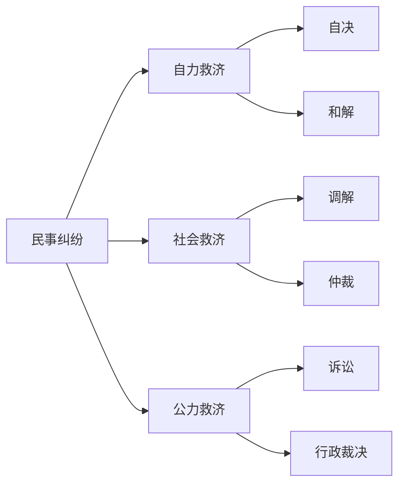

## 一、民事纠纷

### （一）民事纠纷的概念

- 又称：民事争议、民事冲突
- 定义：平等民事主体之间发生的，以民事权利义务为内容的社会纠纷
	- 种差
		- [ ]  发生主体：平等民事主体
		- [ ] 内容：民事权利义务
	- [ ] 属概念：社会纠纷

### （二）民事纠纷的判断标准

- [ ] **主体标准**：平等主体的自然人、法人非法人组织
- [ ] **客体标准**：民事权利义务（人身+财产关系）
- [ ] **可处分性**标准：纠纷要不要解决、怎么解决，原则上由当事人自己说了算
	- 具体体现：不告不理原则
	- 法秩序统一性：是「意思自治」原则在民诉法上的延伸
- [ ] **可诉性**标准：必须是法律上的纠纷

---
## 二、民事纠纷解决机制

### （一）民事纠纷解决机制的概念

- 缓解和消除民事纠纷的方法和制度

### （二）民事纠纷解决机制的分类

#### 标准 1：依靠力量不同

##### 1. 自力救济
依靠纠纷主体自身力量
- **和解**：（私了）双方当事人在自愿的基础上，通过协商达成合意，从而解决纠纷
	- 「合意」本身是合同，不具有国家强制执行力（为什么？因为没有国家力量介入，要执行就去起诉）
- **自决**：通过当事人自身的实力（甚至包括暴力）强制对方满足其要求
	- 仅以**正当防卫**等形式极少数地残留

##### 2. 社会救济
依靠中立的第三方或社会评价机制来处理民事纠纷
- **调解**：（诉讼外调解）由第三者*（如人民调解委员会、居委会、亲友等）*，依据道德和法律规范，通过摆事实、讲道理，促使双方在相互谅解和让步的基础上达成协议
	- 「协议」仍然没有国家强制执行力，但具有类似合同的法律效力
- **仲裁**：当事人根据协议将争议提交给合法的仲裁机构，由该机构作为第三方居中作出具有约束力的裁决

| 维度       | 调解 (Mediation) | 仲裁 (Arbitration) |
| -------- | -------------- | ---------------- |
| **性质**   | 社会救济（合意导向）     | 社会救济（裁判导向）       |
| **谁说了算** | 当事人            | 仲裁员              |
| **终局性**  | 非终局（协议可反悔/起诉）  | 一裁终局             |
| **适用范围** | 财产及身份关系纠纷      | 仅限财产及合同纠纷        |
| **强制执行** | 需司法确认或另行起诉     | 可直接向法院申请执行       |
| **公开性**  | 原则上不公开         | 原则上不公开           |
| **一句话**  | 有第三方介入下的双方交涉   | 在交涉基础上的第三方判断     |

##### 3. 公力救济
指依靠国家公权力的介入，强制性地解决民事纠纷
- [[I 民事纠纷及其解决机制#三、民事诉讼|民事诉讼]]：由国家审判机关（法院）在纠纷主体参加下，依照法定程序处理纠纷的最权威、最有效的机制
	- 有国家强制性，有严格程序
- **行政裁决**：国家行政机关依据法律授权，对与行政管理活动有关的特定民事纠纷进行审查并作出裁决
	- 主要存在于劳动仲裁（性质上属于行政力量延伸）或土地承包经营纠纷等特定领域

### 标准2：诉讼与非诉讼

ADR（Alternative Dispute Resolution） 涵盖了从非正式的协商到准司法性的仲裁等多种方式：
- **社会救济类**：
    - **调解**（如人民调解、行业调解）：由中立第三方介入，促使当事人达成合意。
    - **仲裁**：当事人协议将争议交给民间的仲裁机构进行裁判，具有“一裁终局”的效力。
- **自力救济类**：
    - **和解**：双方当事人自行协商解决，无需第三方介入。
- **现代衍生形式（如电商平台 ADR）**：
    - 大型互联网平台内部的纠纷解决机制，例如美团的“小美评审团”、淘宝或京东的内部投诉处理流程，这些被视为非常有前景的现代 ADR 实践

#### 各种民事纠纷解决机制之间的关系

| 比较维度       | 诉讼中心主义                                                                         | 并行主义（多元化纠纷解决）                                 |
| ---------- | ------------------------------------------------------------------------------ | --------------------------------------------- |
| 核心理念       | 司法至上，判决是纠纷解决的最优或唯一正当途径。                                                        | 功能互补，根据纠纷性质、当事人意愿等，多元途径各有其价值。                 |
| 程序地位       | 诉讼程序（审判）处于绝对中心地位，非诉程序边缘化。                                                      | 诉讼与非诉程序地位并重，共同构成纠纷解决体系的有机组成部分。                |
| 价值追求       | 强调形式公正、程序刚性、国家权威和裁判的既判                                                         | 兼顾公正、效率、成本、灵活性、当事人自主性及社会和谐。                   |
| 对调解等ADR的态度 | 相对冷落或轻视，认为其可能损害法律的统一性和权威性。                                                     | 积极倡导和整合，认为其能有效分流案件、降低对抗性、实现案结事了。              |
| 体系结构       | 单一、层级化的结构，诉讼是纠纷解决的终点和标准。                                                       | 多元、扁平化、网络状的结构，各种机制可供选择或衔接。                    |
| 在我国的语境     | 我国历来实行的是调解中心主义（优先调解），但市场经济建立后，诉讼一度更受重视。当前在构建和谐社会政策下，调解又重新被重视，但学界通说主张调审分离和适度规范。 | 我国当前司法政策与实践正朝向健全多元化纠纷解决机制发展，强调诉讼与调解、仲裁等的有机衔接。 |

---
## 三、民事诉讼

### （一）民事诉讼的概念
**民事诉讼**（Civil Litigation）是指在人民法院的主持下，当事人及其他诉讼参与人为解决民事纠纷，依照法定程序进行的**各种诉讼活动**，以及由这些活动所产生的**各种诉讼关系的总和**

### （二）民事诉讼程序
![[民事诉讼程序.png]]

#### 1. 民事审判程序
**审理和判断**当事人是否享有某项**民事权益**，或确认**民事法律事**实是否存在的的程序。

- **按争议性质分类**：
    - **争讼程序**：解决*有争议的案件*（如常见的债权、侵权、合同纠纷）
    - **非讼程序**：解决*无民事权益争议的案件*，目的在于确认某种法律事实或权利（如宣告失踪、认定财产无主等）。
- **按审级分类**：
    - **第一审程序**：包括**普通程序**（适用于重大、复杂案件）、**简易程序**（适用于简单案件）和**小额诉讼程序**（一审终审，适用于标的额较小的简单案件）。
    - **第二审程序**：上诉审程序，当事人不服一审裁判而在法定期限内提起的救济程序。
    - **审判监督程序**（再审程序）：对已经发生法律效力但确有错误的判决或裁定再次审理的特殊救济程序

#### 2. 民事执行程序
**民事执行程序**（也称强制执行程序）是指人民法院执行组织依照法定程序和方式，**运用国家强制力量**，在负有义务的一方当事人拒不履行义务时，强制其履行义务，从而实现生效法律文书内容的诉讼活动

#### 3. 临时救济程序
**临时性救济程序**（又称临时救济）是指在民事诉讼审理过程中或起诉前，为了使诉讼程序能顺畅进行、防止损失扩大或确保未来裁判能够实际实现，由法院采取的临时性保护措施
- **时间前提**：诉讼审理过程中或起诉前
- **目的**：旨在保障未来判决的执行或防止损害扩大
- **包括**：
	- **财产保全**：防止当事人转移财产。
	- **行为保全**：责令被告作出一定行为或禁止其作出一定行为（如停止生产侵权产品）
	- **先予执行**：在判决前先行满足受害人的基本生活、医疗等急需

### （三）民事诉讼的特征

1. **结构特征**：当事人对立，法院居中裁判的“等腰三角形”结构
2. **权力特征**：依靠国家强制力解决纠纷
3. **当事人主体性**：在涉及私益的案件中，当事人对程序的启动、终结及审判对象拥有主导权，即「[[I 民事纠纷及其解决机制#（二）民事纠纷的判断标准|处分原则]]」
4. **严格程序性**：诉讼必须严格按照法律预定的阶段、步骤和方式进行，具有较强的“刚性”
5. **终局性与权威性**：生效裁判具有法律权威，一旦作出即宣告纠纷终结，当事人不得再行争议或反悔

---
## 四、民事诉讼法

### （一）民事诉讼法的概念
国家制定或认可的，规范当事人与法院、其他诉讼参与人进行民事诉讼的法律。

### （二）民事诉讼法的分类

#### 1. 形式意义上的民事诉讼法
- 《民事诉讼法》

#### 2. 实质意义上的民事诉讼法

- 民法、公司法等法律法规以及我国参加的国家条约和国际公约中**有关民事诉讼的规定**。
- 最高院、最高检以及最高院与其他有关机关联合发布的**关于民事诉讼的司法解释**。

### （三）民事诉讼法的效力

#### 1. 对人效力
对人效力，是指民事诉讼法对哪些人适用。
- **基本原则**：根据《民事诉讼法》，凡在中华人民共和国**领域内**进行民事诉讼的人，都必须遵守本法。
- **适用范围**：
    1. **中国主体**：包括中国公民、法人和其他组织。
    2. **外国主体**：包括外国人、无国籍人、外国企业和组织。只要他们在我国领域内进行诉讼，就必须适用我国民事诉讼法（《民事诉讼法》第5条）。
- **对等原则**：如果外国法院对我国公民、法人和其他组织的民事诉讼权利加以限制，我国人民法院对该国公民、企业和组织实行对等原则（《民事诉讼法》第5条）。
- **核心要点**：我国民事诉讼法的对人效力，以**诉讼行为发生地**（在中国领域内）为标准，而非以当事人的国籍或住所为标准。这与某些实体法的属人管辖权不同。

#### 2. 对事效力
对事效力，是指审理的民事案件的范围
- 包括：民事纠纷案件、民事非讼案件、民事执行案件
#### 3. 时间效力
时间效力，是指民事诉讼法在什么时间范围内生效和具有约束力，核心是新法与旧法的衔接适用问题
- **生效时间**：现行《民事诉讼法》自2024年1月1日起施行（根据2023年修正文本）。法律明文规定其生效日期。
- **溯及力原则（核心特征）**：**民事诉讼法原则上具有溯及既往的效力**。这与实体法通常的“法不溯及既往”原则不同。
    - **“从新”原则**：新法生效后，无论是审理新法生效前受理的未结案件，还是审理新法生效后受理的新案件，人民法院都应适用新生效的民事诉讼法。
    - **法理基础**：程序法主要规范诉讼行为，一般不涉及既有的实体权利义务，更注重程序的统一和公正。
- **例外与衔接**：为了维护程序的稳定性和诉讼经济，对于新法生效前已经完成的特定程序行为（如合法送达、管辖确定），其效力通常仍予以维持，不因新法规定而否定。具体衔接规则由最高人民法院发布的相关司法解释规定

#### 4. 空间效力
空间效力，也称地域效力，是指民事诉讼法在什么样的空间范围或地域范围内有效。
- **基本原则**：根据《民事诉讼法》第4条，凡在中华人民共和国**领域内**（LAWS，Lands, Air, Water, Subsoil/Streches）进行民事诉讼，都必须遵守本法（港澳台除外）。
- **核心要点**：我国民事诉讼法的空间效力**一般不具有域外效力**。这与刑法、民法等实体法不同。
	- 例如，中国公民在外国进行民事诉讼，一般不强制适用我国民事诉讼法，而应适用法院地国的程序法。

## SUMMARY
![[民事诉讼法（张卫平）.png]]