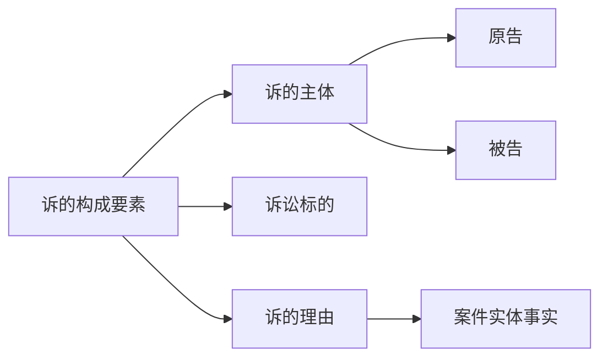
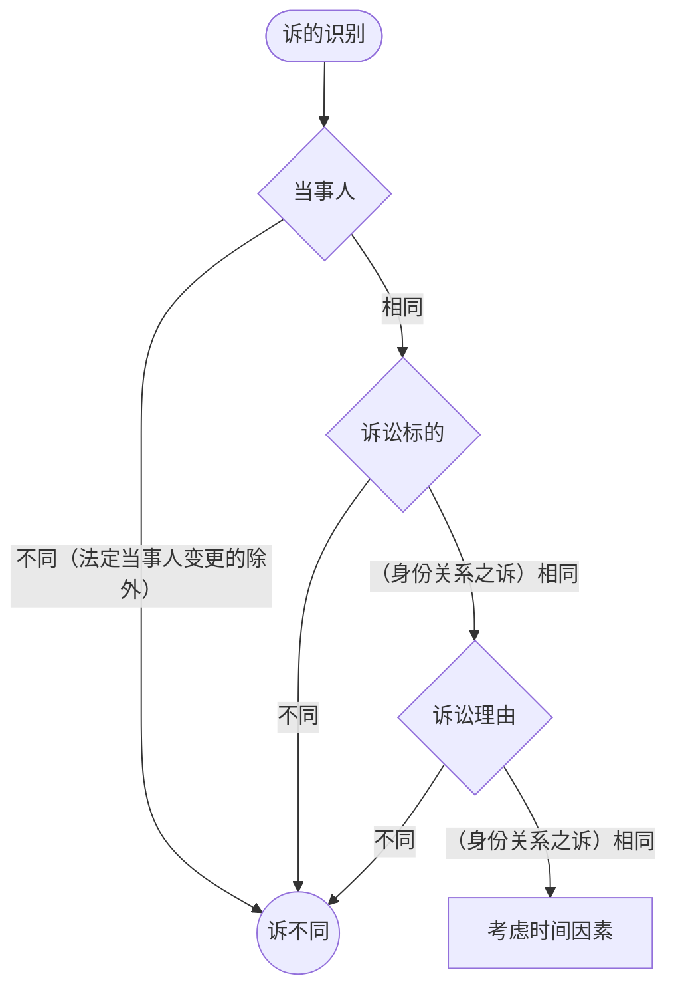
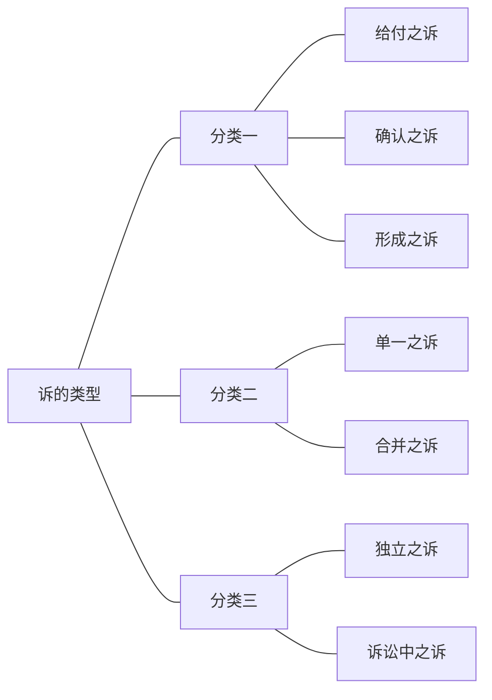
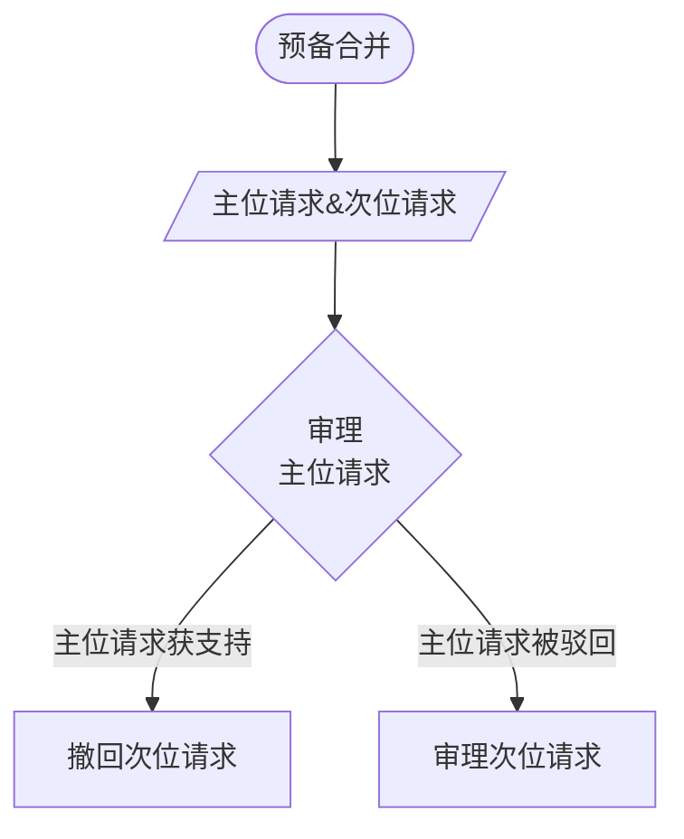
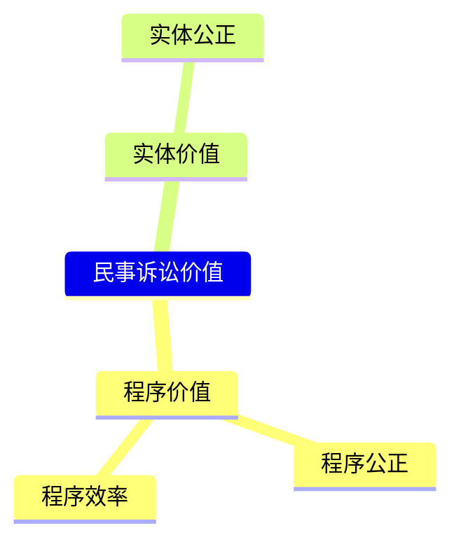
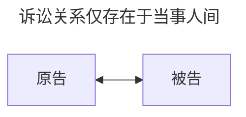
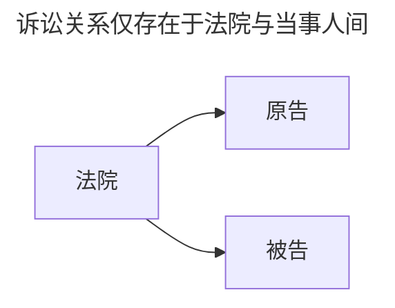

## 一、诉的概念

「诉」是指当事人**向法院**提出的，请求法院就特定的法律主张或权利主张进行裁判的请求

---
---
## 二、诉的构成要素

>[!note] 
>“`谁`”（主体）因为“`什么事`”（客体/标的）基于“`什么理由`”（原因）向法院请求“`如何解决`”（请求）

### （一）诉讼主体
【谁在告】诉讼主体是指直接发生民事纠纷的双方，即原告与被告
- 实务中必须有明确、对立的双方才能构成「诉」

### （二）诉的理由
【为什么告】当事人向法院请求保护其权益和进行诉讼的事实依据
- 实务面貌：
	- **起诉状的“事实与理由”部分**：原告在此部分需要叙述案件经过，并提供初步证据线索，说明“为什么告”

### （三）诉讼标的

#### 1. 诉讼标的之概念
【告什么】诉讼标的是指当事人之间争议的、请求法院审判的民事法律关系；以及引起该法律关系发生、变动、消灭的事实
- [ ] 当事人间存在争议：区别于「争讼程序」与「非讼程序」
- [ ] 请求法院审判：区别于「诉讼程序」与 [[I 民事纠纷及其解决机制#标准2：诉讼与非诉讼|ADR]]
- [ ] 民事实体法律关系

>[!tip] 诉讼标的识别之意义
> 诉讼标的是民事诉讼的“核心”和“最小审理单位”，它是：
> - **法院的审理对象**：法院审什么，不审什么，由诉讼标的规定。法院不能超越诉讼标的进行裁判（辩论原则的要求）。
> - **当事人攻防的中心**：双方的举证、质证、辩论都围绕诉讼标的展开。
> - **识别“诉”的关键**：判断前后两个诉讼是否为同一个“诉”，是否构成“重复起诉”（一事不再理），主要看诉讼标的是否同一。
> - **决定判决效力范围**：生效判决的既判力（禁止再诉的效力）原则上只及于本案的诉讼标的。
> - **诉的合并、变更、追加的依据**：判断是否构成多个诉的合并，或是否变更了诉，都以诉讼标的为基准。

>[!note] 区分：诉讼请求、诉讼标的物、诉讼标的
>- **诉讼请求**：原告提出的具体要求。例如：“判令被告赔偿10万元”。
> - **诉讼标的物**：权利所指向的具体物质对象。例如：争夺的那套“房子”或那台“电脑”。
> - **诉讼标的**：则是两者背后的“借贷法律关系”或“所有权法律关系” 
#### 2. 诉讼标的之识别

##### （1）旧实体法说
- **核心观点**：==诉讼标的 = 实体法上的请求权==
- **识别标准**：以实体法律关系的性质或实体请求权的个数为标准

>[!note] 优缺点
>- **优点**：与实体法连接紧密，审理对象明确，便于当事人攻击防御和法院适用法律。
> - **缺点**：在请求权竞合时，会导致一个纠纷多次诉讼，增加讼累，可能产生矛盾判决，违背诉讼经济原则。
> 	- *张三坐电车受伤，既可以告运输公司“违约”，也可以告“侵权”。按照旧说，这是两个诉讼标的，理论上可以打两次官司，这会导致重复受偿的不公平*

##### （2）诉讼法说
- **核心观点**：==诉讼标的是指原告向法院提出的“诉的声明”（要求法院裁判的结论）结合其所依据的“事实关系”==。它脱离具体的实体请求权，成为一个独立的诉讼法概念。
- **识别标准**：以“诉的声明”（如“要求赔偿损失”）和“自然事实”或“生活事实”为标准。

>[!note] 概念解析
>- 诉讼请求：原告通过法院对被告的要求
>- 案件事实：不以实体法评价的案件自然事实或者生活事实
>	- 它的作用是使诉讼请求“特定化”

###### A. 旧二分肢说
- **核心观点**：$诉讼标的=诉讼请求\land 案件事实$
>[!note] 优缺点
>- **优点**：克服了[[II 民事之诉基本理论#（1）旧实体法说|旧实体法说]]中的「请求权竞合问题」
>- **缺点**：*eg.如果原告以“分居”为由起诉离婚败诉后，再以“家暴”为由起诉，虽然诉讼请求都是“离婚”，但案件事实发生了改变。按照旧二分肢说，这属于不同的诉讼标的，法院必须受理，这可能导致同一段婚姻关系被反复缠讼，不利于社会关系的稳定*
>>[!faq] 疑问
>>所谓「案件事实」的颗粒度到底要有多细呢？真的能完全脱离实体法吗？疑惑的来源是：如果原告可以用「分居」和「家暴」分别作为案件事实来提出「离婚」，那么隐含的前提是这两个具体的案件事实足以支撑该诉讼请求，那么这个「足以」是用什么标准来判断呢？

###### B. 新二分肢说
- **核心观点**：$诉讼标的=(诉讼请求\lor案件事实)\land \lnot(诉讼请求\land 案件事实)$

>[!note] 优缺点
> - **优势**：解决了[[II 民事之诉基本理论#（1）旧实体法说|旧实体法说]]中的「请求权竞合问题」，解决了[[II 民事之诉基本理论#A. 旧二分肢说|旧二分肢说]]的问题，一次性解决纠纷。
> - **弊端**：*eg.如果原告以被告重婚为由请求解除婚姻关系败诉（法院不同意解除婚姻关系），再以受虐待等其他事实理由请求解除婚姻关系，按照新二分肢说，前诉与后诉的诉讼标的是单一的，根据一事不再理原则，法院不应当受理后诉，这样将不利于保护当事人的合法权益和解决纠纷。*
###### C. 新二分肢说
- **核心观点**：诉讼标的=诉讼请求
- 与[[II 民事之诉基本理论#（1）旧实体法说|旧实体法说]]的区别：诉讼请求仍然是脱离了实体法的

>[!note] 优缺点
> **优势**：解决了请求权竞合问题，解决了旧二分肢说的问题，一次性解决纠纷。
> **弊端**：（由于缺乏「案件事实」以将诉讼请求特定化而）不能合理识别金钱或种类物给付之诉的诉讼标的。 *eg.因同一当事人之间可能有几个事实关系而发生多次给付金钱或种类物，如果不结合案件事实，就不能识别各诉的诉讼标的。比如，被告拖欠原告货款1万元，另外被告又从原告处借款1万元，如果仅凭原告诉讼请求，显然无法判断是请求返还哪个1万元。*

##### （3）新实体法说
- **核心观点**：将一部分请求权竞合问题识别为了请求权基础的竞合
	- 凡基于同一事实关系发生的，以同一给付为目的的数个请求权存在时，实际上只存在一个请求权，因为发生请求权的事实关系是单一的，并非真正的竞合，不过是请求权基础的竞合。
- **识别标准**：以“同一事实关系”和“同一给付目的”来判断实体请求权的单复数，进而决定诉讼标的。

>[!note] 优缺点
> **优势**：解决了「请求权竞合」问题
> **弊端**：就不法行同时产生合同法请求权与侵权损害赔偿请求权来说，原告既可依据民法典合同编又可依据民法典侵权责任编提出请求，那么哪个优先？是由当事人选择其一，还是由法官依职权裁量？诉讼标的之确定，是根据权利者能够获得最大利益，还是根据义务人承担最大义务？

##### （4）折衷说

- **核心观点**：不追求统一的识别标准，而是==根据“诉”的不同类型，灵活确定诉讼标的==。^[参见张卫平：《民事诉讼法》，法律出版社2023 年版]
    - **给付之诉**：原则上采**修正的传统理论**。以实体请求权为识别标准，但在请求权竞合时，为避免不公，将竞合的请求权视为一个诉讼标的（吸收了新实体法说和新理论的思想）。
    - **确认之诉**：以**有争议的特定法律关系本身**为诉讼标的。
    - **形成之诉**：以**原告要求变动法律关系的具体请求**为诉讼标的（更接近新理论）。
- **优点**：务实、灵活，兼顾了理论的清晰性与解决实际问题的效率，被认为更适合中国的司法语境。

---
---
## 三、诉的识别 

### （一）理论方法

>[!cite] 什么叫「考虑时间因素」？
>判决不准离婚和调解和好的离婚案件，判决、调解维持收养关系的案件，没有新情况、新理由，原告在六个月内又起诉的，不予受理。

### （二）诉的识别之法律规定

>[!cite] 
>当事人就已经提起诉讼的事项在诉讼过程中或者裁判生效后再次起诉，同时符合下列条件的，构成重复起诉：
> （一）后诉与前诉的当事人相同；
> （二）后诉与前诉的诉讼标的相同；
> （三）后诉与前诉的诉讼请求相同，或者后诉的诉讼请求实质上否定前诉裁判结果。
> 当事人重复起诉的，裁定不予受理；已经受理的，裁定驳回起诉，但法律、司法解释另有规定的除外。

---
---
## 四、诉的类型

### （一）以原告诉讼请求的内容分类

#### 1. 给付之诉

![[给付之诉（庄诗岳）.png]]

- **概念**：原告请求法院判令被告**履行一定给付义务**的诉讼
- **给付之诉的成立基础**：原告对被告享有的给付请求权
	- 根据请求权的成熟度不同^[国内也有学者是按照「给付判决生效」这一时点来界分的，转引自张卫平：《民事诉讼法》，法律出版社 2023 年版]，可分为：
		- 现在给付之诉：在法庭辩论终结前，给付请求权已届履行期间
		- 将来给付之诉：在法庭辩论终结前，给付请求权尚未届履行期间
- **目的**：为了**实现**一项已经存在的（或原告主张存在的）实体权利，获得具体的履行。
	- **效力**：生效的判决具有==强制执行力==

>[!note] 与「确认之诉」的关系
>给付之诉的审理通常**隐含着一个确认之诉**。 
> - **逻辑**：法院要判决被告给付，必须先**确认**原告的给付请求权（背后的法律关系）是否存在。例如，判令还钱，必须先确认借贷关系成立且有效。
> - **区别**：确认之诉的判决没有执行力；给付之诉的判决有执行力。法院驳回给付请求的判决，实质上是一个“确认原告请求权不存在”的确认判决

#### 2. 确认之诉
![[确认之诉（庄诗岳）.png]]

- **概念**：原告请求法院**确认**其主张的「==民事权利==」或「==民事法律关系==」存在或不存在的诉
	- 不能确认「单纯的事实」（对确定法律关系有重大意义的**文书真伪**除外）
	- 必须是「**现在的**」法律关系
- **类型**：
	- 积极确认：主张存在（*eg.主张确认原告对登记于其名下的房屋享有所有权*）
	- 消极确认：主张不存在（*eg.主张确认原被告间合同不存在*）
- **效力**：生效的确认之诉的判决具有「确认力」（既判力），可以确认原告主张的「民事权利」或「民事法律关系」存在与否

>[!caution] 确认之诉的「补充性」
>只有**不能**提起「给付之诉」与「形成之诉」时，才能提起「确认之诉」。

#### 3. 形成之诉
![[形成之诉（庄诗岳）.png]]

- **概念**：**形成之诉**，又称**变更之诉**，是指原告请求法院运用判决来**变动（创设、变更或消灭）现存某种法律关系的诉讼**。
- **权利基础**：形成之诉建立在实体法上的**形成诉权**
	- 法定性：形成之诉的提起**必须有法律的明文规定**
- **效力**：形成之诉的胜诉判决具有**形成力**（变更力）。
	- 这意味着一旦判决生效，法律关系就会在判决生效的那一刻（或者溯及既往地）发生预期的变动
	- **对世效力**：形成判决的效力往往不仅约束诉讼双方，也及于一般第三人（具有绝对性）。*例如，公司决议被判决撤销，所有人都必须承认该决议无效。*

>[!tip] 区分：形成之诉与确认之诉
>- 看「法律关系」自始至终是否发生了变化
>	- **确认之诉**是确认在过去或现在某个时间点已经存在的法律状态
>	- **形成之诉**则是通过判决在未来（判决生效时）改变法律状态
>
>>[!example] 以合同为例
>>- **确认无效**：原告主张合同自始、当然、确定无效（如违反法律强制性规定）。法院判决只是**确认**了这一无效状态。这是**确认之诉（消极确认）**
>>- **撤销合同**：原告主张合同因欺诈可撤销。在撤销前，合同是有效的。法院判决**作出后**，合同才溯及地无效。这个“使有效合同变为无效”的**变动过程**，就是**形成之诉**。
>

>[!tip] 与给付之诉的关联
>- 形成之诉常常是给付之诉的“前奏”。因为法律关系变动后，往往会产生新的给付义务。
>- 在实务中，当事人往往在提起形成之诉的同时，附带提起给付之诉，以求“一揽子”解决纠纷
>>[!example] 例如
>>在离婚诉讼中，解除婚姻关系的请求属于**形成之诉**。一旦法院判决离婚，原有的夫妻共同财产关系随之消灭，此时当事人进一步请求分割财产、给付抚养费，则属于**给付之诉**

---
### （二）以当事人或诉讼标的数量分类
![[单一之诉与合并之诉.png]]

#### 1. 单一之诉
一个原告向一个被告提起一个诉讼标的（1:1:1）

#### 2. 合并之诉
合并之诉是指数个彼此牵连的单一之诉的合并，包括诉的主观合并和客观合并

>[!tip] 提示
>被合并的每一个部分，本身都必须构成一个独立的“诉”。合并只是程序的合并，并未改变各诉的独立性。

##### （1）主观合并
诉的主体之合并，即把数个当事人合并到同一诉讼程序中进行审理和裁判（仍然只有一个标的）。
- [ ] 同一原告对同一被告提出数项诉讼标的
- [ ] 法院对合并的数诉有管辖权（牵连管辖）
- [ ] 合并的数个诉讼标的或数诉需适用相同的诉讼程序

##### （2）客观合并
诉讼标的之合并，即同一原告对同一被告提起两个以上的诉。
###### A.单纯合并
- **概念**：同一诉讼程序中，同一原告对同一被告提出两个以上均需审判的诉讼标的或诉
- **条件**：原告提出的多个请求彼此可以并存，无矛盾或条件关系。

>[!example] 案例
>房东起诉租客，同时请求：（1）支付拖欠租金（给付之诉）；（2）确认租赁合同已解除（确认之诉）；（3）返还房屋（给付之诉）。这三个请求基于同一租赁关系，可以合并。

###### B.预备合并
- **概念**：又称顺位合并，原告提出两个具有先后顺位的请求，其中一个为“**主位请求**”，另一个为“**次位请求**”（预备性请求）。法院先审理主位请求，只有在主位请求被驳回时，才对次位请求进行审理和裁判；若主位请求获支持，则次位请求自动撤回

>[!example] 例如
>买方起诉卖方：
>- 主位请求：请求判令卖方交付货物并支付违约金（基于合同有效）；
>- 备位请求：若合同被认定无效，则请求判令卖方返还已付货款。

>[!faq] 观点
>理论上，主位请求与备位请求需存有一定法律关系，主要是二者在法律上有相同或一致的目的，这点在选择合并之诉的请求中也一样^[引自庄诗岳：《民事之诉基本理论》，2026 春季学期民诉讲义]。但是，由于我国法上对诉的合并制度的规定较为简略粗陋，事实上既没有肯定、也没有否定客观预备合并^[参见引注 1]，因此这里的「需要」不妨说是基于实务考量的诉讼策略选择。
###### C. 选择合并
- **概念**：原告向同一被告提出**诉讼目的相同或一致的**两个或多个请求，并允许从中选择其一履行。一旦其中一个请求得到满足，其他请求即不再存在

---

### （三）以请求是否独立分类
![[独立之诉与诉讼中之诉.png]]

#### 1. 独立之诉
新提起的，与其他诉讼没有关系的诉

#### 2. 诉讼中之诉
就已经开始审理而进行的诉，要求合并审理的诉讼。
- [ ] **时间性**：必须在原告起诉之后、裁判结束（通常指法庭辩论终结）之前提起。
- [ ] **复数性**：程序中同时存在两个或两个以上彼此独立的诉。
- [ ] **合并性**：这几个诉被合在一个程序中，由法院一并审理和裁判，本质上是一种诉的客观合并或主观合并
##### （1）诉的变更
- 狭义诉的变更仅仅包括「诉讼标的」变更
	- **概念**：在同一诉讼程序中，同一原告（包括反诉原告）对同一被告（包括反诉被告）以「新的诉讼标的」替换原诉的诉讼标的（诉讼标的替换变更），从而将原诉替换为新诉，请求法院审判新诉而不再审判原诉

##### （2）反诉
- **概念**：反诉是法院受理本诉之后，本诉的被告以本诉的原告为被告，向受理本诉的法院提起与本诉具有牵连关系的一种独立的反请求
- **反诉的特点**：
	- **它是一个独立的“诉”**：虽然反诉以本诉为前提，具备完整的诉的要素（当事人、诉讼标的、诉讼请求）。即使本诉被原告撤回，反诉依然独立存在，法院应继续审理。
	- **它是一种“诉讼中之诉”**：它的提起和审理，必须依附于一个已经存在的本诉程序。
	- **它是“[[II 民事之诉基本理论#（2）客观合并|诉的客观合并]]”的典型形式**：法院将本诉与反诉两个独立的诉，合并于同一程序中进行审理。
- **反诉的构成要件**：
	- [ ] **时间要件**：反诉在法庭受理本诉后、法庭辩论终结前^[包括适用一审程序和二审程序时法庭辩论结束前，本诉被告在本诉的一审、二审、再审程序中均可提出（见引注3）]提出
	- [ ] **主体要件**：反诉的当事人范围限于本诉的当事人范围
	- [ ] **客体要件**：反诉与本诉存在[[#^qianlianguanxi|牵连关系]]
	- [ ] **管辖要件**：反诉应向本诉法院提起，且不属于其他法院专属管辖^[本诉法院可以基于牵连管辖对本无管辖权的反诉取得管辖权，但这种扩张不突破其他法院的级别管辖、专属管辖、协议管辖]
	- [ ] **程序要件**：反诉能与本诉适用同一程序^[由于反诉本质上是诉的客观合并，如果两个诉所要求的审理规则、审限、组织形式完全不同，法院就无法在同一个程序中对它们一并进行法庭调查和辩论。在司法实践中，程序的适用遵循「**从严不从宽**」的逻辑：（本诉）普通程序可以涵盖（反诉）简易情形，反之（本诉）简易程序不能涵盖（反诉）普通程序]

 >[!note] 所谓「牵连关系」
 >指的是：反诉的诉讼请求与本诉的诉讼请求之间，必须在法律上或事实上存在内在的、紧密的联系，使得**将它们合并于同一程序审理具有合理性和必要性**（**诉讼经济**），表现为：
 >>[!cite]  根据民诉法解释 233 条
 >>- **基于相同的法律关系**：指本诉和反诉的争议都源于同一个法律行为或权利义务关系
>>	- *eg. （买卖合同）本诉中，卖方（原告）起诉买方（被告）支付货款，买方反诉卖方请求赔偿因货物质量不合格造成的损失。两诉都基于同一买卖合同关系。*
 >>-  **诉讼请求之间具有因果关系**：反诉的请求是本诉请求得以成立或实现的前提、障碍或直接结果，两者在逻辑上形成因果链条。
 >>	- *eg.（建设工程合同）纠纷中，原告（发包方）起诉施工方要求承担工期延误的违约金（本诉）；被告（施工方）反诉要求支付工程款，并主张是因为原告未按时拨款才导致延误（反诉）*
 >>-  **基于相同的事实**（同一原因事实）：本诉和反诉所依据的「基础性、自然性的生活事实或事件」是同一个。
 >>	- *eg.（互殴致伤案件）甲与乙打架，甲将乙的牙齿打掉，乙将甲的耳朵咬伤。甲向法院起诉乙赔偿医疗费10万元（本诉）；乙提出反诉，要求甲赔偿医疗费1万元（反诉）*
 >
 >其实，不妨反过来说。之所以设立这一要件，是为了保障以下两个**目的**：①诉讼经济（提高效率、节约资源）；②有效避免法院对相关联的纠纷作出相互矛盾的判决

^qianlianguanxi

>[!tip] 区分：反诉 vs. 抗辩
>- **民事诉讼实体抗辩**：当事人根据实体法规范提出的，旨在对抗对方当事人主张的反对性主张。是一种诉讼防御方法^[注意：抗辩的前提是**对方当事人承认当事人所主张的权利发生的事实**。A 主张 B 应偿还到期债务，B 主张 AB 间并无债之关系，这叫「**否认**」]，可分为：（[[2. 权利的分类#（三）抗辩权|复习：抗辩权]]）权利妨碍抗辩、权利阻却抗辩、权利排除抗辩。
>- **反诉**：是独立的「诉」，是发起一场新的「决斗」。
>>[!note] 诉讼法中的「主要事实」
>>在实体法中，我们关心的是作为法律推理三段论的「大前提」，即「法律规范」；在程序法中，我们更关心作为「小前提」的、能够触发请求权（抗辩）基础的「法律事实」
>>- **权利发生事实**，即导致某项民事实质权或民事救济权发生的事实。*eg.因合法买卖行为而取得所有权、受害人因侵权行受到损害而取得赔偿请求权。*
>>
>>下面的是主要事实中的「抗辩事实」：
>>
>>1. **权利妨碍事实**，即妨碍某项民事实质权或民事救济权发生的事实。被告此种事实抗辩，能够导致原告请求权自始不发生。*eg.原告要求被告履行合同义务，被告则可提出合同不成立事实、合同无效事实、免责事由（如不可抗力、原告过错、合法免责条款）等进行抗辩。*
>>2. **权利阻却事实**，即永久或暂时阻却某项民事实质权或民事救济权行使的事实，该事实使某项民事实质权或民事救济权的行使受到限制。*eg.此类事实主要存在于被告或债务人行使实体法上抗辩权的场合。*
>>3. **权利消灭事实**，是使既存的民事实质权或民事救济权消灭的事实。此种事实抗辩，能够导致业已存在的请求权消灭。*eg.履行、提存、抵消、免除、混同、撤销权行使（如撤销合同等）、合同解权利滥用、交易基础丧失等。*

>[!tip] 区分：反诉 vs. 诉讼抵消^[引自引注 3]
>抵销权既可以通知的方式行使，也可以提出抗辩或者提起反诉的方式行使。
> 
> 反诉与诉讼抵销存在如下主要区别：
> 
> 1. **在法律性质方面**，反诉是一个相对独立的诉；但是诉讼抵销并非一个相对独立的诉，并不改变本诉原被告的诉讼地位。
> 2. **在提起要件或申请要件方面**，反诉的提起应当符合起诉要件，同时还应当具备诉的合并要件和反诉的特殊要件；但是诉讼抵销无此要求。
> 3. **在审判方面**，即使本诉被撤回或终结，反诉也可继续审理下去，并应对本诉和反诉分别作出判决；但是诉讼抵销与原告之诉只得合并审理，并因原告之诉不存在而失效，且对诉讼抵销不得作出单独的判决。
> 4. **在既判力方面**，对反诉作出的判决，不论胜败，一旦确定，就有既判力；而本案判决对成功抵销的债权具有既判力，未抵销的债权不受既判力约東而可以提起诉讼。

---
---

## 五、民事之诉的基石理论

### （一）诉讼目的

#### 1. 规范出发型民事诉讼的目的

- 权利保护
- 私法秩序的维护

#### 2. 事实出发型的民事诉讼的目的

- 纠纷解决
- 程序保障

#### 3. 我国民事诉讼的程序设计与诉讼目的

- 权利判定程序：民事审判
- 权利实现程序：强制执行

---

### （二）诉讼价值

#### 1. 程序价值

![[程序公正的内容.png]]

![[程序效率的内容.png]]

>[!note] 程序公正与程序效率的关系
>二者既存在着一致性，也存在着冲突。但是：法律和诉讼的最高价值是公正，所以应当**在维护程序公正与实体公正的前提**下追求诉讼效率。

#### 2. 实体价值

**实体公正**
- 在「事实与规范」间流连往返
	- 法院判决认定**事实真实**
	- 法院判决**适用法律正确**
- 执行名义**得以执行**

>[!note] 程序价值与实体价值的关系
>程序价值与实体价值既关联又冲突，当二者冲突时，应当优先选择维护**程序价值**。

---
---

## 六、启动理论：民事诉权

### （一）诉权的概念

诉权，是指当事人请求人民法院对其财产权和人身权进行司法保护的权利。

### （二）诉权理论流变
>以下为大陆法系国家的理论流变

![[大陆法系国家诉权理论流变.png]]

#### 1. 私法诉权说

- **观点**：【萨维尼】**诉权**是**请求权**的`变形物或派生物`
- **产生背景**：私法至上与实体法一元时代，强调市民权利

#### 2. 公法诉权说

>[!cite] 产生背景
>产生背景：19 世纪中叶以后，随着社会和政治发展，人们注意到应当加强公共利益的保护；同时，国家权力逐渐强大并开始向私人领域和公共领域扩张，与之相伴的是公法及其观念和理论的发展。在此背景下，诞生了“公法诉讼观”或“诉讼法诉讼观”。

##### （1）抽象诉权说

- **观点**：**诉权**是**个人对国家的一种自由权**，是**启动诉讼程序的权利**，与讼争的私权或民事实体权利无关
- **评价**：缺乏现实意义。

##### （2）具体诉权说

- **观点**：诉权是在个案诉讼中原告向法院**请求**特定内容的**胜诉判决**（利己判决）的权利
	- 即：`诉权`=`胜诉权`=`作出利己判决的请求权`
- **评价**：`向法院请求`说明诉权是公权，而`利己`又说明是私权，二者矛盾。同时，要求胜诉意味着要求法院作出有利一方的判决，有违司法公正之嫌。

##### （3）权利保护请求说

- **观点**：凡是拥有`应该受到审判保护的民事权利`之人都享有**诉权**
	- `权利保护请求权说`与`保护私权的目的论`是一致的

#### 3. 司法行为请求权说/诉讼内诉权说

- **观点**：诉权是公民`请求国家司法机关`依实体法和诉讼法`审理和裁判`的权利，是诉讼开始后`实施诉讼`的权能。正是因为诉讼中诉权的行使，民事实体法律关系在诉讼中才得以形成
	- 又称诉讼内诉权说。

#### 4. 宪法诉权说

- **观点**：肯定人权为宪法基本权（包括：诉权/司法救济权），主张从宪法高度认识诉权或司法救济权
- **产生背景**：二战后国际社会开始重视维护和尊重人权，签订一系列重要人权公约；同时开始重视宪法的权威地位。

### 三、滥用诉权的规制

1. 禁止**虚假诉讼**与**恶意串通**
2. 禁止**单方捏造事实**

>[!cite] [[民事诉讼法#第一百一十五条]]
>- **当事人之间恶意串通**，企图通过诉讼、调解等方式侵害国家利益、社会公共利益或者他人合法权益的，人民法院应当`驳回其请求`，并根据情节轻重予以`罚款、拘留`；构成犯罪的，依法追究刑事责任。
>- **当事人单方捏造民事案件基本事实**，向人民法院提起诉讼，企图侵害国家利益、社会公共利益或者他人合法权益的，适用前款规定。

>[!cite] [[民事诉讼法#第一百一十六条]]
>**被执行人与他人恶意串通**，通过诉讼、仲裁、调解等方式逃避履行法律文书确定的义务的，人民法院应当根据情节轻重予以`罚款、拘留`；构成犯罪的，依法追究刑事责任。

---
---

## 七、过程理论

### （一）诉讼关系

#### 1. 一面关系说

#### 2. 二面关系说

#### 3. 三面关系说
![[三面关系说.png]]
通说认为，民事诉讼法律关系既可以存在于当事人之间，也可以存在于法院与当事人间。诉讼关系是诉权与审判权的结合。

#### 4. 多面关系说

![[多面关系说.png]]

相较于传统诉讼构造，多了检察院与诉讼参与人等主体。认为民事诉讼法律关系存在于法院、检察院、当事人、诉讼参与人之间。

>[!faq] 什么是「诉讼参与人」
>- **诉讼参与人**，是指**除人民法院之外**，所有参加到民事诉讼活动中来，享有诉讼权利、承担诉讼义务的人。
>- 分类
>	- **诉讼参加人**：包括**当事人**（原告、被告、共同诉讼人、第三人、诉讼代表人）和**诉讼代理人**（法定代理人、委托代理人）。
> 	- **其他诉讼参与人**：包括**证人、鉴定人、勘验人、翻译人员**。

| 类别      | 具体主体    | 参加方式         | 核心作用                     |
| ------- | ------- | ------------ | ------------------------ |
| 诉讼参加人   | 当事人     | 起诉、应诉、申请参加   | 发动诉讼、确定审理范围、承担裁判后果       |
|         | 诉讼代理人   | 法定代理、委托代理    | 补充/扩张诉讼能力，维护当事人权益        |
| 其他诉讼参与人 | 证人、鉴定人等 | 申请出庭、法院指派/通知 | 协助法院查明事实、解决专门问题、保障程序顺利进行 |

### （二）诉讼行为

#### 1. 法律事实、诉讼事件与诉讼行为的概念

- 民事诉讼中的**法律事实**：凡是能引起民事法律关系发生、变更、消灭的事实，都是民事诉讼中的法律事实，包括：
	- **诉讼事件**：==不以人的意志为转移的==能够引起民事诉讼法律关系发生、变更、消灭的客观情况
	- **诉讼行为**：民事诉讼主体==有目的实施==的能够产生民事诉讼==法律效果==的行为

#### 2. 诉讼行为的判断标准
- 本来效果说（主要效果说）：除民事诉讼法有效果规定的行为外，并且须以该行发生诉讼法上的效果为要件。
	- 发生诉讼法上的效果，是指诉讼主体行为中，直接或间接达到诉讼目的，或者对于诉讼的开始、进行、终了产生直接的影响。

#### 3. 诉讼行为的分类

![[诉讼行为的分类.png]]

#### 4. 阐明行为与诉讼指挥行为

##### （1）阐明

- 阐明（释明），是指当事人在`事实主张`和`证据提供`等方面出现**不明了、不完足或前后矛盾**等情况时，法官通过`发问、告知、说明`等方式，促使当事人**补正**，以弥补当事人在主张事实和提供证据的能力方面的不足，旨在实现真实和诉讼公证。
	- 如今，法官释明范围已经扩张到了诉讼请求和程序事项

##### （2）诉讼指挥行为
- 法院主持或维持审判程序和执行程序有序、及时进行的行为。
	- 法院行使`诉讼程序指挥权`或实施`诉讼指挥行为`属于**法院职权进行主义**的内容。

#### 5. 取效行为和与效诉讼行为

##### （1）取效诉讼行为
$$诉讼效果=当事人行为+法院行为$$

- **取效诉讼行为**，无法**单独直接**产生`行为人预期的诉讼效果`，必须借助`法院相应的行为`，才能产生行为人预期的诉讼效果。
- 取效诉讼行为主要有：
	- 其一，**请求**，包括当事人向法院提出的`实体方面的请求`（如原告的诉讼请求）和`程序方面的请求`（如申请回避、请求证据保全等）。
	- 其二，**主张事实**，包括原告提出`实体权利产生事实`；被告提出`抗辩事实`（实体权利阻却、妨碍、消灭的事实）。
	- 其三，**提供证据**，即举证。
##### （2）与效诉讼行为
$$诉讼效果=当事人行为（单方或双方）$$

- **与效诉讼行为**，只要`符合法定要件`或`法律规定`，**无须法院同意**，就可**直接**发生**行为人预期**的`诉讼效果`或`实体效果`，法院的裁判实际上只是**对其效果的确认**。
	- 与效诉讼行为中，有些可`由单方当事人决定`实施，*如原告变更诉讼请求等；*
	- 有些应`由双方当事人共同实施`，*如达成管辖协议等*；
	- 有些既可`由单方当事人决定`实施，又可`由双方当事人共同`实施，*如不上诉等*。