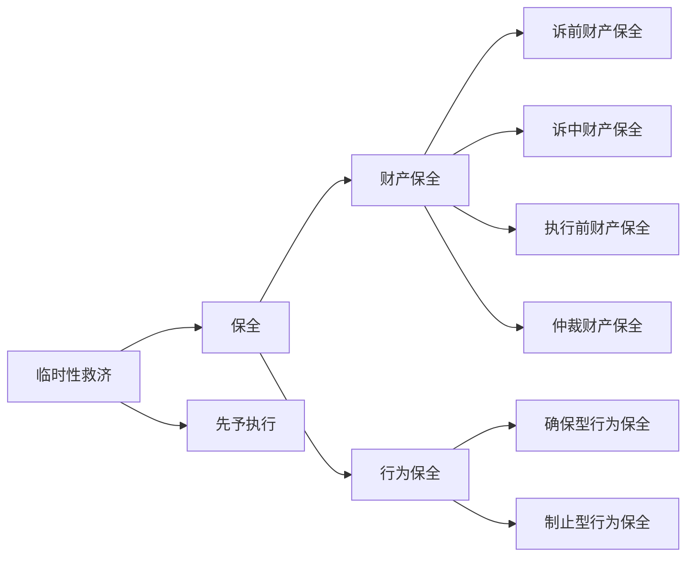
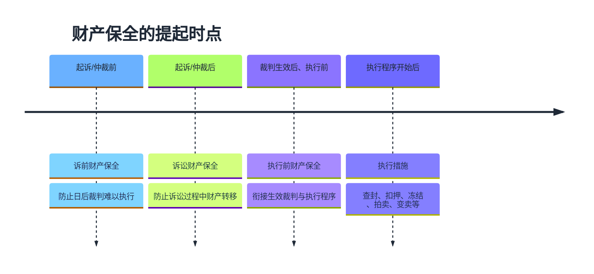
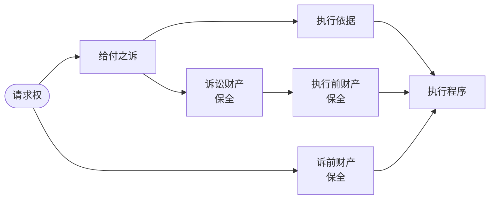
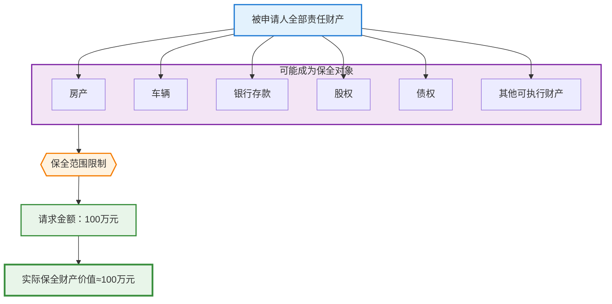
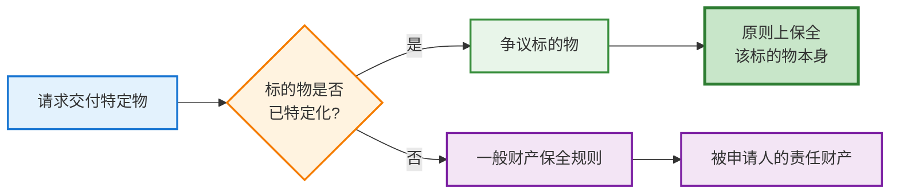
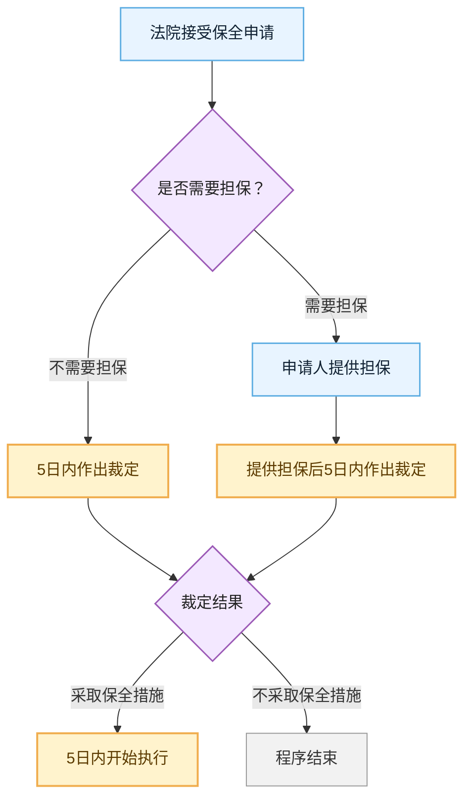
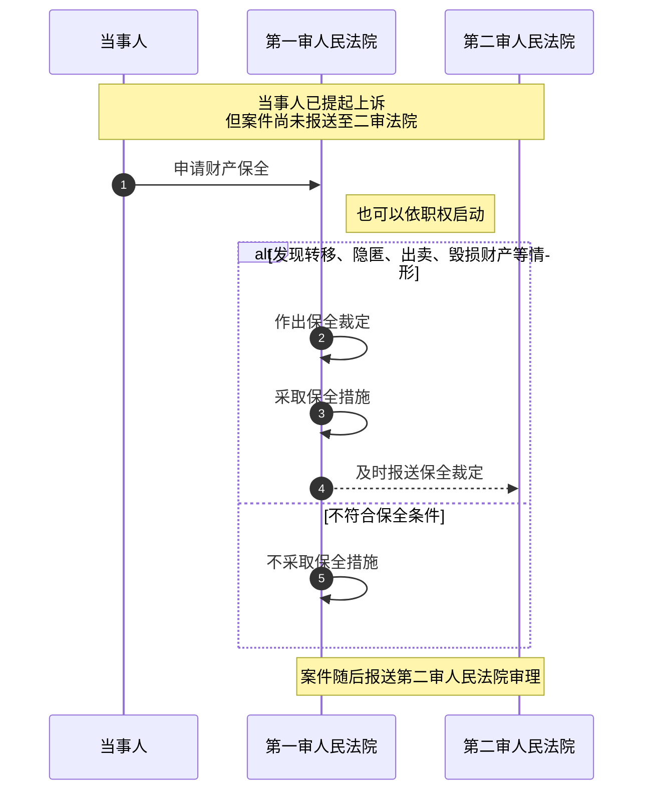
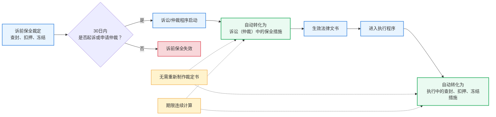
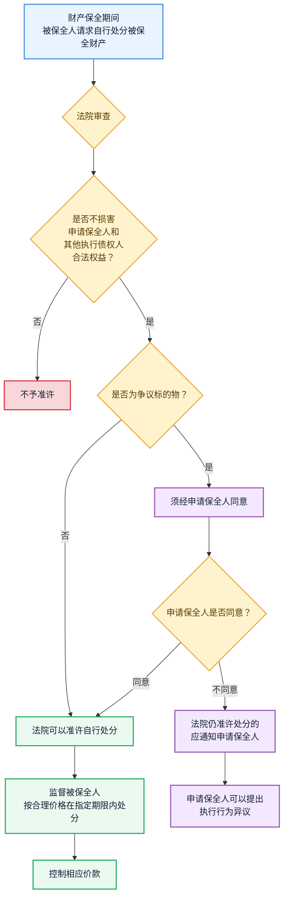
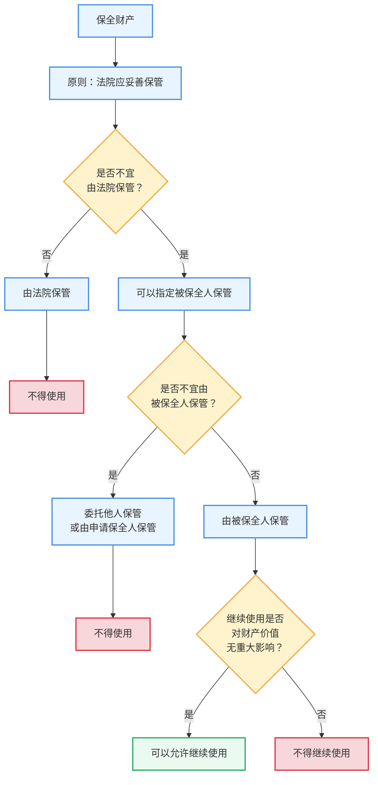

# IX 临时性救济

临时性救济是在本案诉讼提起前、确定判决作出前，或者确定判决作出后、执行开始前，为应对权利实现所面临的紧急危险而提供的暂时保护。

- `保全`：提前控制财产或行为状态，保障本案权利实现或防止难以弥补的损害。
- `先予执行`：终审判决前，提前实现申请人的部分给付或行为请求。

> [!tip] 核心区分
> `保全`原则上只提前控制，不提前满足实体请求；`先予执行`直接提前实现一定请求。

---

# 一、临时性救济总论

## （一）概念

- 相对于`本案诉讼救济`而言，临时性救济具有辅助性和暂时性。
- 适用阶段：
  - 本案诉讼提起前；
  - 本案确定判决作出前；
  - 本案确定判决作出后、执行开始前。
- 危险来源：对方行为或其他原因使权利、利益实现面临紧急损害，例如危及债权实现、造成重大威胁。

## （二）制度类型

| 制度 | 功能 | 典型措施或效果 |
| --- | --- | --- |
| 财产保全 | 保障将来生效裁判执行，避免财产损失 | 查封、扣押、冻结 |
| 行为保全 | 保障判决执行或防止难以弥补的损害 | 责令为一定行为或禁止一定行为 |
| 先予执行 | 解决生活、生产经营急需 | 提前给付金钱、财物，或者实施、停止行为 |

---

# 二、保全

## （一）保全概述

### 1. 概念

`保全程序`是以保障债权人在民事裁判中确认的权利能够实现，或者防止法律规定的权利遭受无法弥补的损害为目的的临时救济制度。

### 2. 特征

- `目的指向性`：为审判、执行或其他权利保护程序服务，以实现本案权利为依归。
- `紧急性`：不迅速裁定和执行，可能无法确保权利实现。
- `预防性与暂定性`：只暂定权利存在，不最终确定实体权利。

### 3. 类型

- 按保全对象：`财产保全`、`行为保全`。
- 财产保全：
  - `诉讼财产保全`：诉前、诉中、执行前财产保全。
  - `仲裁财产保全`。
- 行为保全：`确保型行为保全`、`制止型行为保全`。

---

## （二）财产保全

### 1. 概念与类型

`财产保全`是法院在利害关系人起诉、申请仲裁前，或者当事人起诉、申请仲裁后、执行前，为保障将来生效裁判得到执行或避免财产遭受损失，对当事人财产或争议标的物采取的限制处分措施。

> [!caution] 与执行的关系
> 财产保全只提前实施执行程序中的`控制性措施`，原则上不进入拍卖、变卖、分配等变价和清偿阶段。

### 2. 财产保全的适用范围

#### （1）金钱给付之诉

- 被申请人的**全部责任财产**均可能成为保全对象。
- **实际保全财产的价值**应限于`请求的范围`，==与保全请求或诉讼请求数额基本相当==。

#### （2）物的给付之诉

- 请求交付物已经特定化时，保全范围原则上限于双方争议的`标的物本身`。

#### （3）保全标的物的替换或变更

- 被保全人提供其他`等值担保财产`且有利于执行的，法院可以裁定**变更保全标的物**。
- **对申请保全人或他人提供的担保财产**，法院应依法办理查封、扣押、冻结等手续。

#### （4）诉前财产保全的豁免财产

主要包括：

- 被申请人及其所扶养、抚育家属**生活所必需**的`生活、教育、医疗`等物品和费用；
- **农民工工资**专用账户资金和工资保证金，但法定例外除外；
- **金融机构**交存人民银行的**存款准备金和备付金**；
- **信托财产**人民币专用存款账户、**社会保险基金**账户；
- 特定交易**保证金**、信用证开证**保证金**、独立保函**保证金**，但失去保证金用途的除外；
- **工会**等社团组织专项经费；
- 法院已裁定受理破产申请的债务人财产；
- 公益性非营利法人的教育、医疗卫生、养老服务等**公益设施**；
- 用于**防控、应急、救援**等任务的财产；
- 其他依法不得查封、扣押、冻结的财产。

> [!caution]
> 讲义将该清单置于`诉前财产保全`规则下，不宜直接概括为任何阶段均绝对不得保全的统一清单。

---

### 3. 诉前财产保全

#### （1）概念与条件

> 1+2+1+2

诉前财产保全是**在紧急情况**下，为避免利害关系人的合法权益受到难以弥补的损害，于`起诉`或`申请仲裁前`采取的财产保全。

- [ ] **内容要件**：本案请求具有**给付内容**（金钱给付请求或物的交付请求）。
- [ ] **情况紧急**：不立即保全可能使合法权益受到难以弥补的损害。
- [ ] **时间要件**：由`利害关系人`在**起诉或申请仲裁前**提出。
- [ ] **担保要件**：申请人**提供相应担保**。
- [ ] **申请对象**：向`被保全财产所在地`、`被申请人住所地`或`对案件有管辖权`的法院申请。
- [ ] **书面要件**：提交申请书和相关证据材料。

> [!caution] 可认定情况紧急的典型情形：
> - 转移、隐匿、变卖财产；
> - 抽逃资金等逃避债务履行行为；
> - 生产经营状况严重恶化；
> - 丧失商业信誉；
> - 被列为失信被执行人；
> - 其他导致或可能导致丧失债务履行能力的情形。

#### （2）担保

- **原则**：申请诉前财产保全，应当提供`相当于请求保全数额`的担保。
	- **例外**：情况特殊的，法院可以酌情处理。
		- 追索赡养费、抚养费、抚育费、抚恤金、医疗费用、劳动报酬、工伤赔偿；
		- 婚姻家庭纠纷中经济困难；
		- 因见义勇为遭受侵害请求损害赔偿；
		- 其他可以酌情确定的情形。
- **担保方式**：财产担保、保证担保、财产保全责任保险担保。
- **担保追加**：
	- 担保不足以赔偿可能损失时，法院可以责令追加；
	- 拒不追加的，可以解除或部分解除保全。

> [!caution] 易错表述
> 诉前财产保全并非任何情形均“必须等额担保”。准确表述是：原则上应提供相当于请求保全数额的担保，特殊情形可以酌情处理。

#### （3）诉前保全的处理

- **法院 48h 内裁定**
	- 法院接受申请后，必须在`48小时内`作出裁定。
		- 裁定采取保全措施的，应当`立即开始执行`。
	- **线下材料不符合要求的**，应当场`一次性告知补正`；补正后，自收到补正材料时起计算48小时。
	- **非工作时间线上提交的**，自收到申请后的`第一个工作日`开始时起计算期间。
- **当事人 30 日内起诉仲裁**
	- 采取保全措施后`30日内`不起诉、不申请仲裁的，法院应当解除保全。
- **当事人向采取诉前保全措施以外的其他法院起诉时**
	- 当事人向采取诉前保全措施以外的其他有管辖权法院起诉时，保全法院的保全手续移送受理法院；
	- 移送后，**诉前保全裁定视为受移送法院作出**。

---

### 4. 诉中财产保全

#### （1）诉中财产保全：条件

- **内容要件**：案件为具有财产给付内容的`给付之诉`。
- **难以执行**：存在判决将来难以执行的情形。
- **时间要件**：发生于民事案件受理后、生效判决作出前。
- **申请主体**：一般由当事人申请；必要时法院也可以依职权采取。
- **担保要件**：法院可以责令申请人提供担保。

#### （2）诉中财产保全：担保

- 法院依案件具体情况决定是否担保及担保数额。
	- **不超过 30%**：责令提供财产保全担保的，担保数额不超过请求保全数额或争议标的价值的`30%`。
	- **不要求提供担保**：
		- 对追索基本生活费用（赡养费、抚养费、抚育费、劳动报酬）、
		- 人身损害赔偿（医疗费用、工伤赔偿、交通事故），
		- 特定婚姻家庭纠纷（遭遇家暴且经济困难）、
		- 公益诉讼（因见义勇为遭受侵害请求损失赔偿），
		- 以及保全错误可能性较小（申请保全人为商业银行、保险公司）

#### （3）诉中财产保全：处理

- 法院接受申请后，应在`5日内`作出裁定；
- 需要担保的，在提供担保后`5日内`作出裁定；
- 裁定采取保全措施的，应在`5日内`开始执行。

---

### 5. 执行前财产保全

#### （1）执行前财产保全：条件

- **阶段**：法律文书生效后、执行程序开始前。
- **原因**：债务人转移财产等紧急情况可能导致生效法律文书**不能执行或难以执行**。
- **主体与法院**：债权人向`执行法院`申请。
- **申请材料**：提出**申请书**，写明生效法律文书的制作机关、文号和主要内容，并附生效法律文书副本。

#### （2）执行前财产保全：解除的特殊事由

债权人在法律文书**指定履行期间届满**后`5日内`不申请执行的，法院应解除保全。

> 和诉前保全的 30 日内起诉仲裁一样，法律不保护权利人躺在权利上睡大觉

### 6. 三类诉讼财产保全对比

| 类型      | 申请时间      | 申请人/启动         | 申请理由                | 担保                  | 特殊期限                            |
| ------- | --------- | -------------- | ------------------- | ------------------- | ------------------------------- |
| 诉前财产保全  | 起诉、申请仲裁前  | 利害关系人申请        | 情况紧急，不立即保全将造成难以弥补损害 | 原则上相当于请求保全数额；特殊情形酌定 | 48小时裁定并立即执行； 30日内不起诉/申请仲裁则解除 |
| 诉中财产保全  | 受理后、生效判决前 | 当事人申请；必要时法院依职权 | 判决可能难以执行            | 可以责令；一般不超过30%       | 一般5日内裁定、5日内开始执行                 |
| 执行前财产保全 | 生效文书后、执行前 | 债权人向执行法院申请     | 生效文书可能不能执行或难以执行     | 无需提供                | 履行期满后5日内不申请执行则解除                |

---

### 7. 财产保全命令程序

#### （1）申请与管辖

提交材料：申请书 + 相关证据材料

申请书应载明：

- 申请保全人与被保全人的身份、送达地址、联系方式；
- 请求事项及事实、理由；
- ==请求保全数额或争议标的；==
- ==明确的财产信息或具体财产线索；==
- 担保财产信息、资信证明，或无需担保的理由；
- 其他必要事项。

| 阶段 | 管辖法院 |
| --- | --- |
| 诉前 | 被保全财产所在地、被申请人住所地或对案件有管辖权的法院 |
| 诉中 | 本案管辖法院 |
| 二审 | 二审法院；也可委托一审法院实施 |
| 再审 | 再审法院；也可委托原审法院、执行法院实施 |
| 执行前 | 执行法院 |

#### （2）审查与裁定

- **程序性质**：我国大陆地区通常认为财产保全命令程序属于`非讼程序`。
- **举证责任**：申请人就`保全债权存在`和`保全原因存在`承担举证责任。
	- **证明要求**：以`疏明（自由证明）`为已足，即提出可供法院即时调查的证据。
- **审查原则**：对保全债权是否存在进行**形式审查**，不作最终实体判断。
- **审查方式**：**不开庭**、**不经言词辩论**为原则；紧急时可由`独任法官`处理。
- **审查结果**：裁定驳回申请[^1]，或者作出财产保全裁定。

#### （3）财产保全裁定的效力

- **自动转化效力**：
	- 诉前保全后30日内依法起诉或申请仲裁的，自动转为**诉讼或仲裁中**的保全措施；
	- **进入执行程序后**，自动转为**执行中**的查封、扣押、冻结措施；
	- **期限连续计算**，无需重新制作裁定书。

- **限制处分效力**：
	- 被保全人自行处分财产须**经法院审查许可**，并由法院控制相应价款；
	- 请求自行处分作为争议标的的被保全财产，还须**经申请保全人同意**。

#### （4）对裁定不服的救济

- 当事人对保全或先予执行裁定不服的，自收到裁定书之日起`5日内`向作出裁定的法院申请**复议**。
- 法院应在收到复议申请后`10日内`审查
	- 裁定正确：驳回
	- 裁定不当：变更/撤销原裁定
- ==复议期间不停止裁定执行==。

---

### 8. 财产保全执行程序

#### （1）依执行程序办理

- 财产保全措施依执行程序相关规定办理。
- 主要措施：查封、扣押、冻结等`控制性执行措施`。

#### （2）特殊措施

- 保管
	- 法院应妥善保管保全财产；
	- 不宜由法院保管的，可以指定被保全人保管；
	- 不宜由被保全人保管的，可以委托他人、申请保全人保管；
- 使用
	- 指定被保全人保管且继续使用对财产价值无重大影响的，可以允许继续使用。
		- 由法院、委托他人、申请保全人保管的，不得使用

- **特殊财产**：
	- 季节性、鲜活、易腐烂变质等宜长期保存的物品
		- 可及时责令当事人及时处理，由法院保存价款；
		- 必要时，法院可予以变卖并保存价款；
	- 抵押物、质押物、留置物可以保全，**但不得影响优先受偿权**；
	- 债务人到期应得收益可以保全，限制其支取
	- 债务人财产不足以满足保全请求，但对他人有到期债权的，可裁定该他人不得向债务人清偿（入库规则）。
		- 该他人要求偿付的，由法院提存财物或者价款

#### （3）比例原则

- `价值相当原则`：不得明显超标的、超范围保全；发现明显超标的，应及时解除超出部分，法定例外除外。
- `最小损害原则`：能够实现保全目的时，选择对被申请人生活、生产经营影响较小的财产。

#### （4）不服保全执行措施的救济

| 争议 | 救济方式 |
| --- | --- |
| 不服保全裁定本身 | 向作出裁定的法院申请复议 |
| 认为保全裁定实施中的执行行为违法 | 执行行为异议 |
| 案外人基于实体权利排除对财产的保全 | 案外人异议；不服裁定的，可在裁定送达后15日内提起执行异议之诉 |

> [!tip] 救济二分
> `裁定错`走复议；`实施行为错`走执行行为异议；`案外人实体权利`走案外人异议及执行异议之诉。

---

### 9. 财产保全的解除

#### （1）反担保解除

- 财产纠纷案件中，被保全人或第三人提供充分有效担保并请求解除保全的，法院应当准许。
- 请求对作为争议标的的财产解除保全，须经申请保全人同意。

#### （2）申请保全人应及时申请解除

主要包括：

- 诉前保全后30日内不起诉、不申请仲裁；
- 仲裁机构不予受理、准许撤回或按撤回处理；
- 仲裁申请或请求被驳回；
- 起诉不予受理、准许撤诉或按撤诉处理；
- 起诉或诉讼请求被生效裁判驳回；
- 其他依法应申请解除的情形。

#### （3）法院应作出解除裁定

- 保全错误；
- 申请人撤回保全申请；
- 申请人的起诉或诉讼请求被生效裁判驳回；
- 诉前财产保全的被申请人进入破产程序；
- 其他依法应解除的情形。

### 10. 财产保全错误的赔偿责任

| 错误类型 | 责任 |
| --- | --- |
| 法院违法实施保全、执行行为造成损害 | 可能发生国家赔偿责任 |
| 申请人不当申请保全造成损害 | 申请人承担侵权赔偿责任 |

- 申请错误造成案外人损失的，也应依法赔偿。
- 可能承担责任者包括申请人；保证人、保险人的责任依担保或保险关系判断。
- 诉前保全后未在法定期间起诉或申请仲裁引发损害赔偿诉讼的，由采取保全措施的法院管辖。

---

## （三）行为保全

### 1. 概念与分类

`行为保全`是指在给付请求、确认请求或形成请求案件中，因被申请人的行为或其他原因，可能使申请人的合法权益遭受难以弥补的损害，或者使判决不能执行、难以执行，由法院制止某种行为或要求作出某种行为的保全。

| 比较点 | 确保型行为保全 | 制止型行为保全 |
| --- | --- | --- |
| 基本功能 | 保证本案判决将来执行 | 防止本案诉讼请求保护法益以外的其他损害 |
| 适用范围 | 限于给付之诉 | 可适用于给付之诉、确认之诉、形成之诉 |
| 与本案诉讼关系 | 附属于本案诉讼 | 不附属于本案诉讼，具有一定独立性 |
| 识别方法 | 保全请求属于原告本案诉讼请求之一 | 保全请求保护本案请求以外的其他合法利益 |

- 确保型行为保全属于`给付型行为保全`，内容包括作为和不作为。
- 制止型行为保全适用范围呈扩大趋势，不以持续性法律关系、完成行为案件或财产关系争议为限。

### 2. 适用条件

#### （1）一般适用条件

- 有初步证据表明申请人的合法权益正在或将受到侵害；
- 不采取行为保全将给申请人造成损害或使损害扩大；
- 不采取行为保全给申请人造成的损害，大于采取保全可能给被申请人造成的损害；
- 采取行为保全会损害公共利益的，不得采取。

#### （2）诉前行为保全的综合考量因素

- 申请人的请求是否具有事实基础和法律依据；
- 不采取措施是否会使合法权益受到难以弥补的损害；
- 双方损害衡量；
- 对国家利益、社会公共利益可能产生的影响；
- 其他应当考量的因素。

### 3. 担保与反担保

- 行为保全的担保规则受不同领域特别规则影响。
- 申请诉前行为保全的，担保数额由法院根据具体情况决定。
- 婚姻家庭纠纷申请诉前行为保全、人格权正在或即将受到侵害等情形，法院可以酌情确定担保数额。
- 行为保全中，反担保未必能够解决权利保护问题；尤其对`制止型行为保全`，不得仅因被申请人提供担保而解除，但申请人同意的除外。

### 4. 裁定、执行与错误赔偿

- 行为保全措施具有多样性和复杂性，裁定主文应为具体执行保留必要空间。
- 行为保全的方法和措施依执行程序相关规定处理。
- 申请错误造成被申请人损失的，申请人应承担赔偿责任。

> [!caution]
> 《民事诉讼法》将财产保全和行为保全作捆绑式规定，不等于二者的适用条件和程序完全相同。行为保全尤其强调损害衡量与公共利益审查。

---

# 三、先予执行★★★

## （一）概念

`先予执行`是法院在受理案件后、作出终审判决前，根据一方当事人申请，裁定另一方先行给付一定金钱或其他财物，或者实施、停止某种行为的制度。

## （二）适用范围

依据《民事诉讼法》第一百零九条，主要包括：

- 追索赡养费、扶养费、抚养费、抚恤金、医疗费用；
- 追索劳动报酬；
- 因情况紧急需要先予执行的事项。

情况紧急的典型情形：

- 需要立即停止侵害、排除妨碍；
- 需要立即制止某项行为；
- 追索恢复生产、经营急需的保险理赔费；
- 需要立即返还社会保险金、社会救助资金；
- 不立即返还款项将严重影响权利人生活和生产经营。

## （三）适用条件

- [ ] 当事人之间所争之诉是`给付之诉`。
- [ ] 当事人之间权利义务关系明确。
- [ ] 申请人有生活或生产经营急需，不先予执行将产生严重影响。
- [ ] 被申请人有履行能力。
- [ ] 由申请人提出申请，法院不得依职权启动。
- [ ] 法院可以责令申请人提供担保。

## （四）程序与错误补救

- 申请一般以书面形式提出，时间在法院受理案件后、终审判决作出前。
- 申请书应写明请求、理由、根据及对方履行能力的具体情况。
- 请求范围限于诉讼请求范围，并以生活、生产经营急需为限。
- 法院决定责令担保后，提供有效担保成为先予执行的必要条件；不提供的，驳回申请。
- 对裁定不服，不得上诉，但可在收到裁定书后`5日内`申请复议一次；法院应在`10日内`审查；复议期间不停止执行。
- 生效判决确定申请人应返还先予执行取得的利益时，适用`执行回转`。

---

# 四、制度对比与应试提要

## （一）保全与先予执行

| 比较点 | 保全 | 先予执行 |
| --- | --- | --- |
| 核心功能 | 提前控制，保障实现或防止损害 | 提前实现部分请求 |
| 是否提前满足实体请求 | 原则上否 | 是 |
| 适用阶段 | 诉前、诉中、执行前均可能 | 受理案件后、终审判决前 |
| 启动方式 | 依申请；诉中财产保全必要时可依职权 | 必须依申请 |
| 典型条件 | 紧急危险、将来难以执行或难以弥补损害 | 权利义务明确、急需、被申请人有履行能力 |

## （二）高频期限

| 期限 | 适用事项 |
| --- | --- |
| 48小时 | 诉前财产保全裁定；采取措施的立即执行 |
| 30日 | 诉前保全后不起诉、不申请仲裁则解除 |
| 5日 | 诉中财产保全裁定、担保后裁定、裁定后开始执行；执行前保全后衔接执行；裁定复议申请期限 |
| 10日 | 法院审查保全、先予执行裁定复议 |
| 15日 | 不服案外人异议裁定提起执行异议之诉 |

## （三）命题提示

讲义标注的重点题型：

- `名词解释★★★★`：财产保全、行为保全、先予执行。
- `简答★★★`：诉讼保全的构成条件、诉前保全的构成条件、先予执行的构成条件。
- `简答★★`：先予执行的适用范围。
- `论述★★★`：民事诉讼财产保全制度。
- `论述★★`：先予执行。

> [!tip] 论述财产保全的展开顺序
> 概念与功能 -> 类型 -> 适用范围 -> 诉前/诉中/执行前条件 -> 命令程序 -> 执行程序 -> 救济与解除 -> 错误保全赔偿责任。

> [!caution] 高频易错点
> - 财产保全只提前控制，先予执行才提前满足请求。
> - 诉前财产保全担保原则上与请求保全数额相当，但存在酌定例外。
> - 诉中财产保全必要时可依职权采取；先予执行必须依申请。
> - 确保型行为保全附属于给付之诉；制止型行为保全不附属于本案诉讼。
> - 对裁定不服、对执行行为不服、案外人主张实体权利，救济路径不同。

[^1]: 申请人可能因为：欠缺【形式要件】当事人能力、法院管辖，或者【实质要件】保全债权不存在、保全原因不存在
