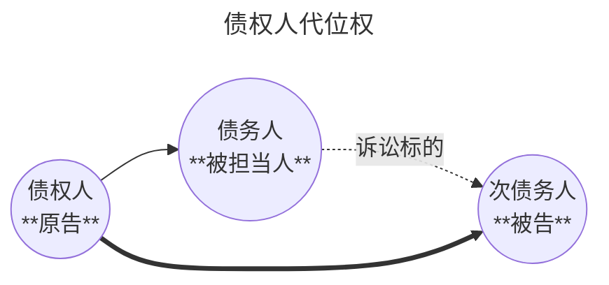
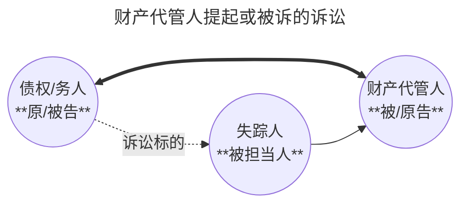
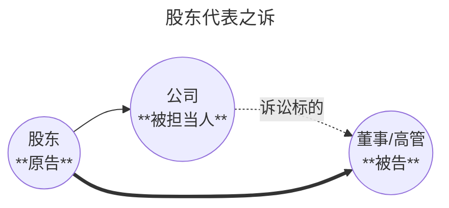
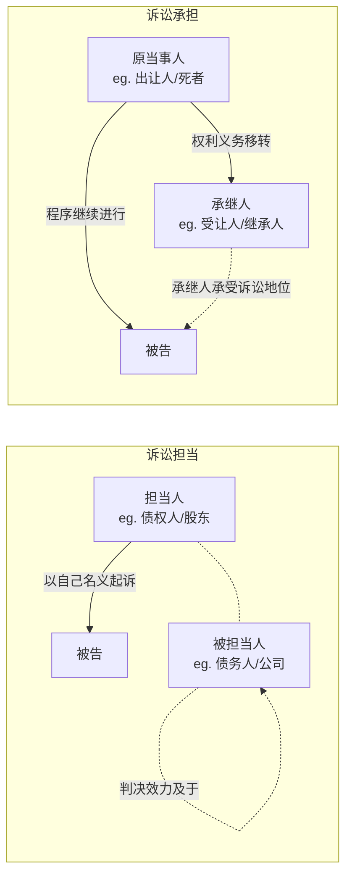
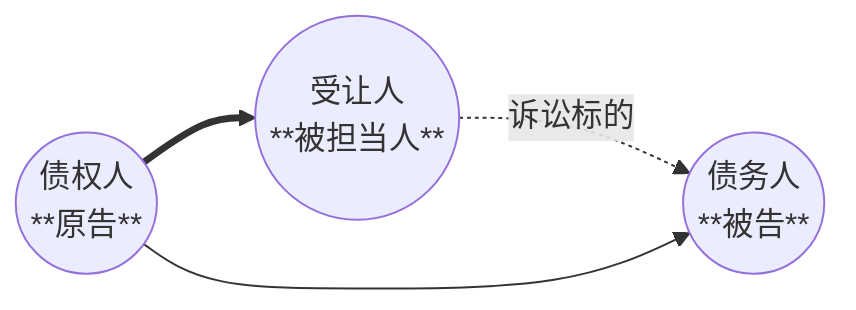
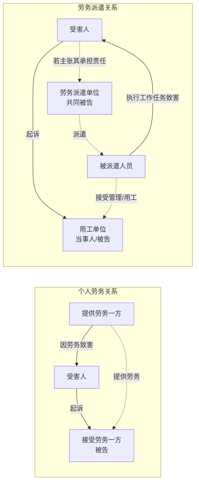

> [!summary] 
> 本章的核心是构建从“谁进入诉讼”到“谁能成为本案正当当事人”再到“谁能有效实施诉讼行为”的递进框架：首先以**表示说**确定程序当事人，再以**当事人能力**判断抽象资格，并以**当事人适格**（依托实体权利关系、诉讼担当、诉的利益）甄别具体案件的正当原被告，同时以**诉讼能力**和**诉讼代理人**保障程序的有效推进，最终形成一套从入口识别到实质正当性判断的完整当事人理论体系。

---

## 一、当事人的确定

### （一）当事人确定：概述

> [!faq] 当事人的确定是为了解决什么问题？
>在某一诉讼中，当事人为何人？谁是原告、谁是被告？

**当事人确定的标准**
- **实体当事人**
	- 「利害关系当事人」说：强调其与争议民事权利义务==有直接利害关系==。
	- 「权利保护当事人」说：强调其**以自己名义**==保护民事权益==，并能引起程序`发生`、`变更`或`消灭`。
- **程序当事人说**：凡==以自己名义==`起诉`、`应诉`的人，就是当事人。

> [!note] 什么是程序当事人的「自己的名义」？
>- **通说**： 表示说。起诉状写了谁，谁就是当事人。
>- **不问** ：是不是民事权利或法律关系的主体，以及对诉讼标的有无诉讼实施权，都是当事人。

### （二） 程序当事人的确定标准

| 学说      | 内容                             | 弊端                                                       |
| ------- | ------------------------------ | -------------------------------------------------------- |
| 意思说     | 原告内心所考虑之人是当事人                  | 原告内心的意思难以认定，会异化为法院的意思，违反[[III 民事诉讼法的基本原则#四、处分原则\|处分原则]]。 |
| 行动说     | 实际实施诉讼行为之人是当事人                 | 不能解释诉讼代理                                                 |
| **表示说** | 起诉状上所记载之人是当事人                  | 无法应对冒名诉讼、死者名义诉讼                                          |
| 并用说     | 原告适用行动说，被告按照意思说、当事人适格、表示说的顺序确定 | 兼有各种弊端                                                   |

> [!tip] 理解
> - 现代民诉实务和理论上，更强调`程序当事人`的识别价值。
> - 在诉状中明确列为原告、被告的人，即使其未必是真正的实体权利义务主体，也先作为程序意义上的当事人进入诉讼。
> 	- 这一点与后续“当事人适格”密切相关：能不能被列为当事人，不等于是否为正当当事人。
> - 复习时还要再多分一步：`程序当事人` 解决的是“谁先进入程序”，`实体当事人说` 或 `适格说` 解决的是“谁才是本案真正应受判决拘束的人”。
> - 因而实务上常见的路径是，先按照诉状确认`程序当事人`，再通过释明、追加、变更或最终裁判去修正实体上是否适格。

### （三） 禁止自我诉讼原则

- 民事诉讼采取**两造对立**结构，同一人不能在同一案件中同时站在原、被告两边。
	- 因此双方当事人为同一人时，不允许诉讼成立。

> [!example] 实务中
>如果公司的法定代表人要起诉公司，那么应诉的被告也是该法定代表人，显然荒谬。

### （四） 当事人确定与当事人适格

- `当事人的确定` 解决的是“名义上谁进诉讼”。
- `当事人适格` 解决的是“这个人有没有资格在该案中作为正当原告或被告”。

> [!tip] 当事人的称谓
> ![[当事人的称谓.png]]

---
## 二、当事人能力与诉讼能力

### （一） 当事人能力

- **它是什么**：当事人能力，又称`诉讼权利能力`，是指**可以作为民事诉讼当事人的资格**。
- **它对应的是**：“**抽象资格**”，并不意味着现实中已经成为具体案件的当事人。
- **不具有当事人能力会怎么样**：不能作为当事人参加诉讼。如果有人起诉了一个没有当事人能力的对象，法院会裁定驳回起诉（不予受理）。

### （二） 当事人能力与民事权利能力的关系

- 二者基本上具有一致性
	- 公民、法人、其他组织当然可以作为民事诉讼的当事人
		- 法人：法定代表人
		- 非法人组织：主要负责人

#### 当事人能力与民事权利能力的分离性 

> [!faq] 首先，为什么会不一样？
>原因在于两个法律的“出发点”不同：
> - **民法（实体法）**：讲究**“严谨”**。它要明确谁是权利主体，谁承担责任。它坚持“类型法定”，原则上只承认自然人和法人是主体。
> - **民事诉讼法（程序法）**：讲究**“便利”**。它的目的是解决纠纷。有些东西虽然民法不承认它是“人”，但如果不让它有打官司的资格，纠纷就没法解决，或者解决起来很麻烦。

| 民事权利能力                                                                                                            | 当事人能力                                                               |     |
| ----------------------------------------------------------------------------------------------------------------- | ------------------------------------------------------------------- | --- |
| 涉及遗产继承、接受赠与等==胎儿==利益保护的，胎儿视为具有[[1. 自然人#（二）自然人权利能力的取得\|民事权利能力]]。但是，胎儿娩出时为死体的，其民事权利能力自始不存在。                         | 无论胎儿的民事权利能力是否受到限制，==胎儿的当事人能力是完全的、不受限制的==，XXX（母亲的名字）的胎儿。             | 胎儿  |
| ==死者==的姓名、肖像、名誉、荣誉、隐私、遗体等受到侵害的，其`配偶、子女、父母`有权依法请求行为人承担民事责任； ==死者==没有配偶、子女且父母已经死亡的，`其他近亲属`有权依法请求行为人承担民事责任。       | 对侵害死者遗体、遗骨以及姓名、名誉、隐私等行为提起诉讼的，==死者近亲属为当事人==。                         | 死者  |
| ==自然人==的作品，其发表权、《著作权法》第十条第一款第五项至第十七 项规定的权利的保护期为作者终生及其死亡后五十年，截止于作者死亡后第五十年的12月31日；如果是合作作品，截止于最后死亡的作者死亡后第五十年的12月31日。 | 对侵害死者遗体、遗骨以及姓名、肖像、名誉、荣誉、隐私等行为提起诉讼的，==死者的近亲属为当事人==                   | 自然人 |
| ==法人==的民事权利能力与自然人相比，受到一定的限制，如法人不享有姓名权、肖像权，公司不得作为他公司的无限责任股东，公司受章程规定目标的限制等。                                         | 当事人能力只存在“有无”问题，而无应否受限制的问题。例如，法人因超越经营范围而发生纠纷进行诉讼时，==法人的当事人能力应当是存在的== | 法人  |

### （三） 欠缺当事人能力的后果

| 情形                | 后果                                                   |
| ----------------- | ---------------------------------------------------- |
| 整个诉讼期间一直欠缺当事人能力   | 诉讼要件欠缺，裁定**驳回起诉**                                    |
| 起诉时欠缺，但诉讼中取得当事人能力 | 起诉瑕疵自动治愈，可进入**实体审理**                                 |
| 起诉时有，诉讼中丧失（死亡、注销） | 欠缺诉讼要紧，可能裁定**驳回起诉**或**中止诉讼** 符合诉讼终结条件的，裁定**终结诉讼** |

---
## 三、诉讼能力

### （一） 诉讼能力的概念

- **诉讼能力**，又称**诉讼行为能力**，是指当事人能够以自己的行为实现诉讼权利、履行诉讼义务的能力。
- 欠缺诉讼能力的人，其实施的诉讼行为原则上无效。

### （二） 诉讼能力与民事行为能力

> [!note] 诉讼能力与民事行为能力的对应性
> ![[诉讼能力与民事行为能力的对应性.png]]

1. 法人与非法人组织，**谁来进行诉讼**？
	- 法人由==法定代表人==进行诉讼，其他组织由==主要负责人==进行诉讼。
2. **法定代表人的判断**：
	- **有登记的**，以==依法登记==为准。
	- **无须登记的**，以==正职负责人==为准；无正职的，以==主持工作的副职负责人==为准。
3. **诉讼中法定代表人发生变更的**：
	- 已变更、未登记： ==新法定代表人==**可以**参加诉讼。
		- ==原法定代表人==已实施的诉讼行为有效。
- 非法人组织适用上述规定。

### （三） 当事人的诉讼权利与义务

#### 诉讼权利

- **保障诉权类**：请求司法保护、[[VI 当事人和诉讼代理人#（三） 委托诉讼代理人|委托诉讼代理人]]、[[IV 民诉法的基本制度#四、回避制度|申请回避]]、使用本民族语言文字等。
- **维护实体权利类**：举证、[[X 第一审普通程序#（八）法庭辩论与合议庭评议|辩论]]、[[IX 临时性救济#（二）财产保全|申请财产保全]]、查阅复制材料等。
- **处分实体权利类**：调解、[[I 民事纠纷及其解决机制#1. 自力救济|和解]]、[[II 民事之诉基本理论#（2）反诉|反诉]]、[[XII 第二审程序#上诉|上诉]]、[[XIII 再审程序|再审]]等。
- **实现民事权益类**：申请执行。

#### 诉讼义务

- **依法**行使诉讼权利，不得滥用权利。
- **遵守**法庭秩序与程序规则。
- **履行**生效裁判与调解协议。

### （四） 欠缺诉讼能力的后果

| 情形                       | 后果                   |
| ------------------------ | -------------------- |
| 整个诉讼期间一直欠缺诉讼能力           | 诉讼要件欠缺，裁定**驳回起诉**    |
| 起诉时欠缺，诉讼中取得诉讼能力或经法定代理人同意 | 先前行为**可追溯有效**        |
| 起诉时有，诉讼中消失               | 不裁定驳回起诉，而应裁定**中止诉讼** |

### （五） 三个概念并排记忆

> 抽象地回答：谁能以当事人的身份进入诉讼程序；
> 不能回答：能否成为「本案」当事人

| 概念     | 核心问题        | 关键词    |
| ------ | ----------- | ------ |
| 当事人的确定 | 谁被列为原告/被告   | 名义进入程序 |
| 当事人能力  | 能不能成为当事人    | 诉讼权利能力 |
| 诉讼能力   | 能不能有效实施诉讼行为 | 诉讼行为能力 |

> [!tip] 辩论能力
> 辩论能力，是指在诉讼中实施辩论行为的资格。即当事人能够亲自在法庭上或通过书面形式，就案件的事实认定、法律适用及程序问题进行陈述、反驳和答辩的诉讼法上的能力。
> 
> 在我国本人诉讼主义下，辩论能力通常与诉讼能力同向理解，但它只针对“辩论”这一类行为，范围更窄。

---
---
## 三、当事人适格

### （一） 概念

- **当事人适格**，又称正当当事人，是指**就特定诉讼**，有资格以`自己的名义`成为**原告或被告**，并受本案判决**拘束**的当事人。
	- 它是**具体案件中的资格判断**，不是抽象能力判断。

| 概念        | 别称     | 核心定义                                  | 解决的问题                                                          |
| --------- | ------ | ------------------------------------- | -------------------------------------------------------------- |
| 当事人能力     | 诉讼权利能力 | 能够成为民事诉讼当事人，享有诉讼权利、承担诉讼义务的**一般资格**。   | **“能不能"做当事人？** 解决的是主体资格的有无问题（如：死人不能做当事人）。                   |
| 当事人适格  | 正当当事人  | 对于具体的诉讼，有作为本案当事人实施诉讼、要求本案判决的**具体资格**。 | **“配不配”做「本案」当事人？** 解决的是在特定案件中，谁应当是权利义务归属主体的问题（如：这钱是不是欠你的？）。 |
| 当事人确定     | 当事人特定  | 在具体的诉讼程序中，识别和认定究竟谁是原告、谁是被告。           | **“究竟是谁"在起诉/被诉？** 解决的是在诉状记载模糊或冒名诉讼等特殊情况下，如何锁定具体对象的问题。       |

### （二） 理论基础一：实体权利关系

- 原则上，**诉讼标的**所对应的`实体权利义务关系主体`，就是`正当当事人`。

---

### （三） 理论基础二：诉讼担当

#### 1. 诉讼担当的概念

- 本来不是`实体权利主体`或`法律关系主体`的**第三人**，因为`对他人权利`或`法律关系`**有管理权**，而以`当事人地位`，就`法律关系产生的纠纷`行使==诉讼实施权==，判决效力及于**原权利义务主体**。
	1. 诉讼担当者为`诉讼标的`以外的**第三人**
	2. **有权实施诉讼的原因**：对他人权利或法律关系有管理权
	3. **以何种地位参与诉讼**：当事人
	4. **诉讼判决之效力及于**：原权利义务主体

####  2. 诉讼担当的分类

- **法定诉讼担当**
	- 为`担当人`利益
	- 为`权利义务归属主体`利益
- **任意诉讼担当**
	- 为`担当人`利益
	- 为`权利义务归属主体利益`的任意诉讼担当

#### 3. 法定诉讼担当

- 第三人依照`法律规定`行使**诉讼实施权**。

##### （1）为担当人利益的法定诉讼担当

第三人基于`自己的利益`或者`自己代表方的利益`而对诉讼标的之权利义务享有**管理处分权**，并基于这一**管理处分权**进行诉讼担当的情形

- **代位权诉讼**：
	- 债务人怠于行使债权影响债权人到期债权实现时，债权人可对相对人提起代位权诉讼。
	- 债权人起诉时未列债务人为第三人的，法院应追加债务人为第三人。

##### （2）为权利义务归属主体利益的法定诉讼担当

当**诉讼标的之权利义务归属主体**`不可能也不适于进行诉讼`时，由法律规定的一般地应当`对归属主体负有保护职责之人`进行诉讼担当

- **财产代管人诉讼**：
	- 失踪人的财产代管人可作为原告或被告参加相关诉讼。

##### （3）其他法定诉讼担当的类型

- **其他例子**：
	- **实体权利义务人的近亲属**：死者近亲属、婚姻当事人近亲属、未成年人父母等。
	- **财产权利权人**：清算人、破产管理人、遗嘱执行人、遗产管理人等。
	- **诉讼中实体权利义务特定继受中的法定诉讼担当**
	- **公益诉讼中的公共利益担当主体**。
	- etc.

#### 4. 任意诉讼担当

- 依据**权利义务主体授权**发生。
	- 分类：
		- 为了担当人利益的/ 为了权利义务归属主体利益的
		- 法律规定的/ 扩大适用的[^1]

- **法律规定的任意诉讼担当**
	- 当事人推选的[[VII 多数人诉讼#二、诉讼代表人的资格与权限|诉讼代表人]]
	- 知产
		- 被许可使用人
		- 被授权的著作权或邻接权集体管理组织
	- 经全体合伙人授权的合伙负责人或执行人
	- 业主委员会

### （四） 诉讼承担与诉讼担当

> [!note] 区别
>- **诉讼担当**：不是权利义务真正归属者，但因法律规定或授权而代为诉讼。
>- **诉讼承担**：基于**实体权利义务发生移转**而**承受诉讼地位**。

#### 1. 一般继受人

- **自然人死亡**，由`继承人`承受
- **法人合并**、**分立**，由`合并或分立后的法人`承受。

 相关情形通常导致**中止诉讼**，等待权利义务承受人明确。

#### 2. 特定继受

> [!note] 当事人恒定
>**当事人恒定原则**，是指在诉讼系属中（即案件正在法院审理过程中），即使作为诉讼标的的==实体权利义务发生移转==*（如债权转让、债务承担）*，==转移给诉讼外的第三人==，**诉讼当事人也不会因此发生变更**，诉讼依然在原当事人之间进行。

- **原则**：`当事人恒定`
	- 诉讼中争议权利义务转移，不影响原当事人的诉讼地位。
	- 生效裁判对==受让人==**具有拘束力**。
- **受让人地位**：受让人可申请作为[[VII 多数人诉讼#三、无独立请求权第三人|无独立请求权第三人]]参加诉讼。
	- 【**例外：当事人继受**】经法院准许，`受让人`也可替代`原当事人`**承担诉讼**，此时发生**当事人变更**。

---

### （五） 理论基础三：诉的利益

#### 1. 诉的利益之概念

- **诉的利益**是判断`某一请求`是否有**必要**通过本案判决解决，且判决是否具有**现实效果**的要件。
	- 简言之：官司值不值得打（必要性、实效性）

#### 2. 各种诉的利益

##### （1）给付之诉
>[[II 民事之诉基本理论#1. 给付之诉]]

- **现在给付之诉**：原则上当然具有诉的利益。
- **将来给付之诉**：仅在原告有`预先请求给付`之必要时才有诉的利益[^2]。
	- **已争执**：义务人已争执义务之存在或状态。
		- 预期违约
	- **定期行为**：稍有迟延即无法实现履行目的之`定期行为`的履行请求。
	- **代偿请求**：代替本来给付的代偿请求等情形。
	- 抚养费请求

> [!faq] 如何理解「代偿请求」具有诉的利益
>> [!note] 何为「代偿请求权」？
>> 代偿请求权是指在**因不可归责于债务人的事由导致给付不能**时，债务人免除了原给付义务，但如果债务人因该给付不能的事由对第三人享有损害赔偿请求权或获得了赔偿物，债权人有权请求债务人让与该权利或交付该赔偿物。
>
>>[!example] 举例
>>- **案情**：甲出售特定名画给乙，交付前因不可抗力灭失，甲因此获得了对保险公司的保险金请求权。甲拒绝将保险金请求权让与给乙，并声称合同已终结。
>>- **分析**：虽然保险金尚未实际赔付（履行期未满），但乙对甲的代偿请求权（让与保险金请求权）已经产生。甲的拒绝行为构成了“对义务的争议”。乙提起将来给付之诉，请求法院判令甲在获得保险金后交付给乙，**具有诉的利益**。因为这能防止甲领取保险金后据为己有，避免乙陷入“赢了官司拿不到钱”的困境。

##### （2）确认之诉

> [!note] [[II 民事之诉基本理论#2. 确认之诉|确认之诉]]的利益
>只有当原告的权利（或法律上的地位）现实地处于「不安」之状态，而且作为消除这种「不安」之方法——即，对「确认之诉」的判决——对于纠纷解决而言是**有效且合适**的，这时，法律才认可确认的利益。

1. **确认之诉具有补充性**：若有更合适的其他救济手段，原则上不应优先提起。
2. **如何妥当选择确认对象**（诉讼标的）
	- [ ] **确认对象**：原则上确认对象应是==法律关系==，而非单纯事实。
		- **例外**：确认文书真伪之诉
	- [ ] **确认时间**：原则上确认==现在==的法律关系，而非过去的法律关系。
		- **例外**：过去法律关系系`当前纠纷之根源`时的确认 
			- *eg. 母亲请求确认死者为自己儿子*
	- [ ] **确认类型**：原则上必须是==积极确认==，而非消极确认
		- **例外**：知识产权不侵权确认之诉等消极确认例外
3. 还要求原告`权利或地位`存在**现实的**不安或危险，且须有**即时确定的必要**。

##### （3）形成之诉

- 形成之诉由实体法个别、具体设定，只要符合该类型的法定要件，原则上即具诉的利益。

### （六） 欠缺当事人适格的后果

- 存在两种理论处理路径：
	- **诉讼成立要件说**：裁定`驳回起诉`
	- **权利保护要件说**：判决`驳回诉讼请求`
- 复习时要注意：这是适格问题，不是单纯程序当事人识别问题。

| 项目 | 当事人能力 | 当事人适格 |
| --- | --- | --- |
| 性质 | 抽象资格 | 具体案件资格 |
| 关注点 | 能否作为诉讼主体 | 能否就本案成为正当原被告 |
| 关键词 | 诉讼权利能力 | 判决拘束力、诉讼担当、诉的利益 |

---
---

## 四、几类重要的当事人

### （一） 个体工商户

- **有字号**：以营业执照登记==字号为当事人==，并注明经营者基本信息。
- **无字号**：以登记==经营者为当事人==。
- **登记经营者与实际经营者不一致**：以==登记经营者==和==实际经营者==为==共同诉讼人==。

### （二） 提供劳务的人

- **提供劳务一方因劳务造成他人损害的**，受害人起诉时，以==接受劳务一方为被告==。
- **劳务派遣期间**，被派遣人员执行工作任务致人损害的，以==用工单位为当事人==。
	- 当事人主张劳务派遣单位承担责任的，==劳务派遣单位为共同被告==。

  

### （三） 法人

- **职务行为**
	- 工作人员**执行职务致人损害**的，以==法人或其他组织为当事人==。
- **清算与注销**
	- 企业法人解散后，**依法清算并注销前**，==以该企业法人为当事人==。
	- **未依法清算即被注销的**，以==股东、发起人或出资人为当事人==。
- **合并分立**
	- **合并**：企业法人合并前纠纷，以==合并后企业为当事人==。
	- **分立**：企业法人分立前纠纷，以==分立后企业为共同诉讼人==。

> [!caution] 特别提示
>清算期间法人尚未注销的，法人仍是当事人，清算组只是代表其参加诉讼[^3]。
>- 原因：清算组不具备独立的责任财产，若以清算组为当事人，在责任承担上会产生障碍。同时，以公司为当事人更能清晰体现法人资格的延续性。

### （四） 居民委员会、村民委员会、村民小组

![[村、居委会与村民小组作为当事人.png]]

### （五） 未依法登记领取营业执照的个人合伙

- **其全体合伙人**为==共同诉讼人==。
	- 如有依法核准登记**字号**，应在法律文书中**注明**。
	- 可推选**代表人**，但须由`全体合伙人`出具推选书。

### （六） 其他组织

> [!cite] [[民诉法解释#第五十二条]]
>- 民事诉讼法第五十一条规定的其他组织是指合法成立、有一定的组织机构和财产，但又不具备法人资格的组织，包括：
>	- (一)依法登记领取**营业执照**的**个人独资企业**；
> 	- (二)依法登记领取**营业执照**的**合伙企业**；
> 	- (三)依法登记领取我国**营业执照**的**中外合作经营企业**、**外资企业**；
> 	- (四)依法成立的==社会团体的分支机构、代表机构==；
> 	- (五)依法设立并领取**营业执照**的**法人的分支机构**；
> 	- (六)依法设立并领取**营业执照**的**商业银行、政策性银行和非银行金融机构的分支机构**；
> 	- (七)经依法登记领取**营业执照**的**乡镇企业、街道企业**；
> 	- (八)其他符合本条规定条件的组织。

- 特别提示：除**依法成立的社会团体分支机构、代表机构**外，其他大多数“其他组织”都要求==领取营业执照==。

---
## 五、诉讼代理人

### （一） 诉讼代理人概述

- **诉讼代理人**，是依据`法律规定`或`当事人委托`，为`当事人利益`进行诉讼活动的人。
- 其基本特征：
	- [ ] 须具有[[VI 当事人和诉讼代理人#三、诉讼能力|诉讼行为能力]]。
	- [ ] 须在代理权限范围内活动。
	- [ ] 须以`被代理人`名义活动。
		- [ ] 法律后果直接归属于被代理人。
	- [ ] 同一案件中只能代理一方。
	- [ ] 属于相对独立的诉讼参加人。

### （二） 法定诉讼代理人

#### 1. 法定诉讼代理人：概念与特点

- 法定诉讼代理人，是**依法律规定**代理`无诉讼行为能力`当事人参加诉讼的人。
- 特点：
	- 代理权直接来源于`法律`。
	- 代理对象仅限[[VI 当事人和诉讼代理人#三、诉讼能力|无诉讼行为能力人]]
	- 范围限于`享有亲权、监护权`的人。
	- 代理权**既是权利也是义务**。

> [!tip] 
>当监护人和无诉讼行为能力的被监护人成为共同被告时，监护人可能具有双重诉讼地位：
>- 一方面：监护人是被告
>- 另一方面：监护人同时充当被监护的法定诉讼代理人

#### 2. 法定诉讼代理人：权限与地位

- 法定诉讼代理属于**全权代理**。
	- 其**诉讼地位**与`当事人`相似，但并**不是实体权利义务主体**。

#### 3. 对法定诉讼代理人的指定

1. 无诉讼行为能力人由他的**监护人**作为**法定代理人**代为诉讼。法定代理人之间互相推诿代理责任的，==由人民法院指定其中一人代为诉讼==。
2. 在诉讼中，无民事行为能力人、限制民事行为能力人的**监护人**是**他的法定代理人**。
	1. 事先**没有确定监护人**的，可以由**有监护资格的人协商**确定；
		- 协商不成的，由人民法院在他们之中==指定诉讼中的法定代理人==。
	2. 当事人**没有**民法典[[民法典#第二十七条|第二十七条]]、[[民法典#第二十八条|第二十八条]]规定的**监护人**的，可以指定民法典[[民法典#第三十二条|第三十二条]]规定的**有关组织**担任**诉讼中的法定代理人**。

#### 4. 法定诉讼代理权的取得与消灭

- **取得**：源于实体法上的`亲权`、`监护权`，并须向法院提交相应`证明材料`。
- **消灭**：
	- **法定代理人**死亡或丧失`诉讼行为能力`
	- **被代理人**取得或恢复`诉讼行为能力`
	- **法定代理人**丧失`亲权`或`监护权`
	- **被代理人**`死亡`

> [!caution] 不得行使的特殊场景：利益冲突
> - 未成年人诉监护人`不作为损害赔偿`之诉
> - 未成年人诉监护人`侵权赔偿`之诉

### （三） 委托诉讼代理人

#### 1. 概念

- 接受当事人、法定代理人、诉讼代表人、法定代表人或其他组织负责人授权而代为诉讼的人。

#### 2. 范围

##### （1）可以被委托的人

- **专业的人**：律师、基层法律服务工作者
- **自己人**：当事人的近亲属[^4]或者工作人员
	- **近亲属**：
		- 能结婚的：夫妻
		- 不能结婚的：直系血亲、三代以内旁系血亲
		- 亲家：==近姻亲== = 配偶的血亲 + 血亲的配偶
		- 其他有抚养赡养关系的亲属
	- **工作人员**：与当事人有合法劳动人事关系的职工，可以当事人工作人员的名义参加诉讼
- **推荐的人**：当事人所在`社区`、`单位`以及`有关社会团体`推荐的公民
	- **专利代理人**：特殊情形下，**专利代理人**经推荐可在专利纠纷中担任诉讼代理人

> [!note] 有关社会团体推荐公民担任诉讼代理人的，应当符合下列条件：
> 1. **社团性质**：社会团体属于依法登记设立或者依法免予登记设立的==非营利性法人组织==；
> 2. **社团业务**：代理事务属于该社会团体==章程载明的业务==范围；
> 3. **当事人是社团的人**：被代理人==属于该社会团体的成员==，或者当事人一方==住所地位于该社会团体的活动地域==；
> 4. **代理人是社团的人**：被推荐的公民是该==社会团体的负责人==或者==与该社会团体有合法劳动人事关系的工作人员==。
> 
> 

##### （2）不能被委托的人

- 无民事行为能力人
- 限制民事行为能力人
- 其他依法不得担任诉讼代理人的人

#### 3. 委托诉讼代理人的代理权限

> [!summary]
>- 委托诉讼代理人只能在`当事人授权范围内`代理诉讼活动
>	- 其超越代理权限所实施的诉讼行为，**除非**得到被代理人的`事后追认`，否则便属于**无效诉讼行为**，由其**自行承担**==相应的法律后果==。

##### （1）一般授权

- 仅能实施一般程序性诉讼行为。
- 仅写“**全权代理**”而无具体授权的，不得实施以下行为：
	- 承认、放弃、变更诉讼请求
	- 和解
	- 提起反诉、上诉
- 一句话速记：`凡是直接碰实体利益的，都要特别授权`。

##### （2）特别授权

- 上述处分性行为必须经明确特别授权方可实施。
	- 承认、放弃、变更诉讼请求
	- 和解
	- 提起反诉、上诉

#### 4. 诉讼地位

- 委托诉讼代理人**不具有绝对独立性**，受被代理人控制：
	- 当事人与代理人陈述不一致时，以当事人陈述为准。
	- 当事人可变更、撤销代理人的相关陈述。
	- 当事人可随时变更代理权限或解除委托。
- 但其又具有**相对独立性**：
	- 在权限范围内可独立进行意思表示。
	- 可拒绝委托人的无理要求，必要时终止代理关系。
	- 享有调查取证、查阅材料等固有权利。
	- 法院应对委托诉讼代理人实施的诉讼行为不得通过对当事人实施替代[^5]

#### 5. 委托诉讼代理权：取得、变更与消灭

- **取得**：
	- 基于书面授权委托，原则上应在开庭前提交法院；
		- 法院审查通过后，代理人取得诉讼代理权
	- 简易程序中双方到庭可口头委托并记入笔录。
- **变更**：
	- 表现：代理权的扩大/缩小、代理事项的增减、代理时间的延长/缩短
	- 程序与效力：
		- 当事人应书面告知法院，并由法院通知对方当事人。
		- 代理人在变更前已为的代理行为仍然有效。
- **消灭**：
	- 代理人死亡或丧失诉讼行为能力
	- 委托人解除委托或代理人辞任
	- 委托期限届满
	- 诉讼终结

> [!note]  
> 诉讼代理权解除，当事人应当书面告知法院，并由法院通知对方当事人。在此之前的诉讼行为仍然有效 = 在诉讼进行过程中，代理权一旦发生变动，当事人有义务通知法院，以保证程序的合法性和稳定性。

#### 5. 特殊规则

- **离婚案件**：离婚案件有诉讼代理人的，**本人**除不能表达意思外，==原则上仍应出庭==；确因特殊情况不能出庭的，==须提交书面意见==。
- **涉外案件**：涉外案件中，外国人、无国籍人、外国企业和组织在中国法院委托律师代理诉讼的，==必须委托中国律师==。
- **境外形成的授权委托书效力**，原则上需经过所在国公证及中国使领馆认证，或依条约办理证明手续，法官见证下签署的予以认可。

---
## 六、诉讼辅佐人

### 1. 概念

- 诉讼辅佐人，又称专家辅助人，是受当事人聘请，就案件中的专门性问题向法庭说明、协助质证的人。

### 2. 意见效力

- 当事人可申请`一至二名`有专门知识的人出庭，就鉴定意见或专业问题提出意见。
	- 其意见视为当事人的陈述。
- 费用由申请方承担。
- 其活动范围限于专业问题，不得超出该范围参与法庭审理。

---

# 其他

| 容易混淆项           | 区分方法                             |
| --------------- | -------------------------------- |
| 当事人能力 vs 诉讼能力   | 前者看能否成为当事人，后者看能否亲自有效实施诉讼行为       |
| 当事人的确定 vs 当事人适格 | 前者看谁被列入程序，后者看谁是正当原被告             |
| 诉讼担当 vs 诉讼承担    | 前者非实体主体而代为诉讼，后者因权利义务移转而承受诉讼地位    |
| 法定代理 vs 委托代理    | 前者法定、全权、对象限于无诉讼行为能力人；后者基于授权、权限受限 |
| 一般授权 vs 特别授权    | 是否包含承认/放弃/变更请求、和解、反诉、上诉等处分性权限    |

### 1. 判断谁是当事人

1. 先看谁以自己名义起诉或应诉。
2. 再看其是否具有当事人能力。
3. 最后审查其是否对该案具备当事人适格。

### 2. 判断能否亲自实施诉讼行为

1. 看其是否具备诉讼能力。
2. 若不具备，是否存在法定诉讼代理人。
3. 若已由无行为能力人实施行为，看后续是否因成年或追认而治愈。

### 3. 判断代理人权限

1. 先分法定代理还是委托代理。
2. 委托代理再分一般授权还是特别授权。
3. 涉及承认、放弃、变更请求、和解、反诉、上诉的，一律追问有无明确特别授权。

[^1]: **“扩大适用的任意诉讼担当”** 是指，允许**尚未进入诉讼程序的第三人**，通过授权，使**已经参与诉讼的当事人**成为其诉讼担当人，从而将自己的诉讼请求并入该诉讼的制度。它是对传统任意诉讼担当的扩张，旨在更有效地集合分散的权利主张，解决群体性纠纷，体现了民事诉讼制度在便利诉讼、追求效率方面的演进。

[^2]: 张卫平认为：原则上履行期未满的请求没有诉的利益，**“只有在被告已经`对将来要履行的义务发生争议`即否定`存在将来履行的义务`时，原告的起诉才具有权利保护利益。**

[^3]: 这是我国法上所采纳的观点

[^4]: 民诉中的近亲属范围不能直接照搬民法。
	一是可以包括**其他具有抚养、赡养关系的亲属**；
	二是课堂上特别强调了**近姻亲**（配偶的血亲+血亲的配偶）在诉讼代理资格判断中的意义

[^5]: 法院不能因为觉得当事人本人可能“更好说话”，或有“更真实的想法”，就绕开诉讼代理人，直接向当事人本人施压，要求其作出与代理人不同、甚至冲突的陈述或决定。除非当事人本人当庭明确变更或撤销代理人的相关陈述（这是当事人的权利），否则法院必须将代理人的陈述视为当事人的正式意见，并以此为基础推进诉讼。
	如果法院能轻易“通过对当事人实施替代”，就相当于宣告代理人的独立判断和法律专业能力随时可以被法院绕过，这将彻底摧毁委托代理制度存在的价值，也使律师等专业代理人的工作失去意义。
