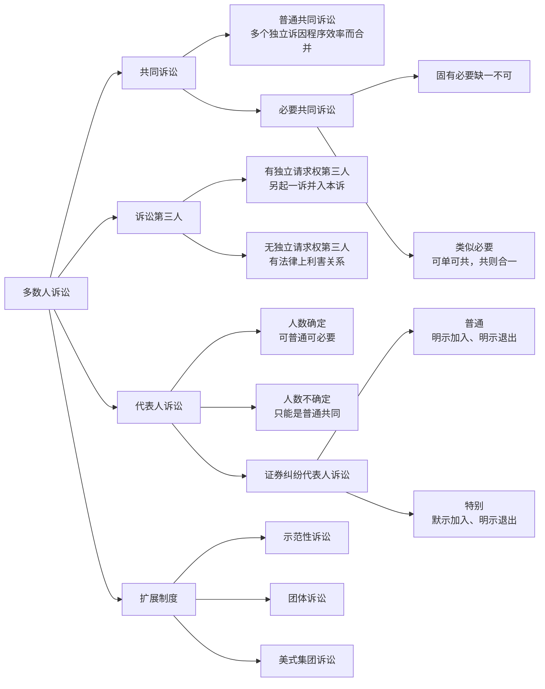
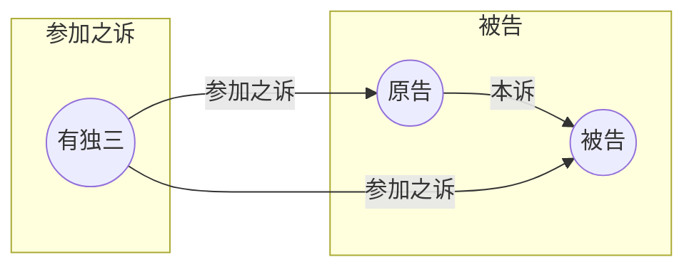
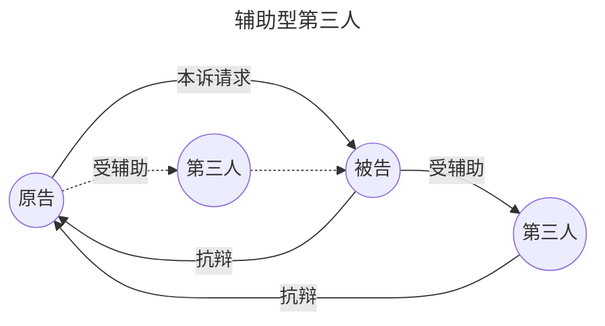
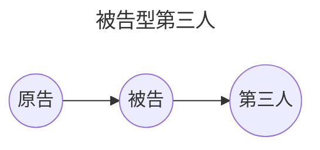

> [!abstract]
> 多数人诉讼，本质上是[[II 民事之诉基本理论#（1）主观合并]]在民诉中的展开：当事人一方或双方为二人以上，法院要处理的不再只是“一个原告对一个被告”的单线结构，而是复数主体如何进入同一程序、如何发生程序牵连、裁判效力又如何扩张的问题。本讲的主线可以压成四组判断：  
> `普通共同：各自为战；固有必要：缺一不可；类似必要：可单可共；代表人诉讼：十人以上选代表。`  
> 其中最容易混淆的点有三处：一是普通共同诉讼与必要共同诉讼的区分；二是有独三与必要共同诉讼人的区分；三是人数不确定代表人诉讼与证券特别代表人诉讼的加入退出模式。

---

## 一图总览

---

## 共同诉讼

### 一、总述

- **共同诉讼**是典型的多数人诉讼形态，指当事人一方或双方为二人以上的诉讼。
	- 理解钥匙不在“人数多”，而在：诉讼标的是几个、是否共同、程序能否拆分、裁判是否必须合一。
- **共同诉讼的类型**：
	- [[VII 多数人诉讼#二、普通共同诉讼|普通共同诉讼]]：多个独立诉，因程序效率合并。
	- **必要共同诉讼**
		- [[VII 多数人诉讼#2. 固有必要共同诉讼|固有必要共同诉讼]]：诉讼标的必须对全体一次性、统一处理。
		- [[VII 多数人诉讼#3. 类似必要共同诉讼|类似必要共同诉讼]]：起诉阶段可单可共，一旦共同起诉就必须合一裁判。

### 二、普通共同诉讼

#### 1. 概念与本质

- **普通共同诉讼**，是指当事人一方或双方为二人以上，诉讼标的是==同一种类==，且**法院**认为可以合并审理、**当事人**也同意合并审理的诉讼。
	- 其本质不是“一个共同的诉”，而是==多个独立诉因程序效率而合并==。
- **特征**：普通共同诉讼是多个`独立之诉`，因程序效率而合并，**故可分可合**、原则上**分别判决**。
	- 诉讼标的虽然不同，但是**同一种类**
		- 存在两个或两个以上互不关联但属于同一种类的法律关系争议
		- 基于同一/同类事实或法律上原因发生的法律关系争议
	- 数个诉讼标的**合并审理**
	- 可分之诉
		- 法院需分别判决

> [!example] 同一种类的诉讼标的
>1. **基于同类事实或法律上的同类原因形成的同种类诉讼标的**
>     
>     - **例子**：*数名业主因欠交物业管理费，被物业管理公司一并起诉。每个业主与物业公司之间的物业服务合同关系性质相同，因类似事实（欠费）而产生，诉讼标的为同一种类。*
>         
> 2. **基于同一事实或法律上的原因形成的同种类诉讼标的**
>     
>     - **例子**：*一辆公共汽车发生交通事故，导致多名乘客受伤。各受害乘客虽可单独起诉，但因其损害均源于**同一侵权行为**（同一事实），他们与公交公司之间的侵权损害赔偿法律关系为同一种类，可以形成普通共同诉讼。*
>         
> 3. **基于数人对同一权利义务的确认形成的同种类诉讼标的**
>     
>     - **例子**：*原告甲分别起诉乙、丙、丁，请求确认同一不动产所有权归自己所有。乙、丙、丁各自独立主张所有权，甲与乙、丙、丁之间的确认之诉，诉讼标的是同一种类。*
>     - **注意**：如果乙、丙、丁是共有权人，则诉讼标的是共同的，构成必要共同诉讼。

#### 2. 普通共同诉讼：构成要件

- [ ] **主体**：一方或双方为二人以上。
- [ ] **客体**：有两个以上[[II 民事之诉基本理论#1. 诉讼标的之概念|诉讼标的]]，且属于**同一种类**。
- [ ] **程序**：属于**同一法院管辖**，适用**同一诉讼程序**。
- [ ] **合并条件**：
	- [ ] 法院认为合并有利于效率、避免矛盾裁判
	- [ ] 当事人同意：
		- 共同起诉
		- 共同被诉，且多数人未提出异议
		- 法院欲合并，多数当事人同意合并同一法院受理的多个诉

#### 3. 普通共同诉讼人：独立性

>普通共同诉讼为可分之诉，各共同诉讼人具有独立的诉讼地位

1. **诉讼实施独立**
	- **诉讼行为独立生效**：
		- 每个人可以独立实施诉讼行为，如自认、和解、撤诉、上诉；其效力原则上不及于他人。
		- ==各个共同诉讼人可以分别委托诉讼代理人==
	- **对方对每一诉讼人之诉讼行为独立**
		- 共同诉讼人的对方当事人对于各个共同诉讼人可以采取不同的甚至是对立的诉讼行为。
	- **诉讼适格要件的判断独立**：
		- 对其中一人的[[VI 当事人和诉讼代理人#三、当事人适格|适格]]、程序障碍、诉讼中止等，也原则上分别判断。
	- **法院 按需 分开审理**：
		- 法院在认为合并审理**不再符合诉讼经济**时，**可以再分开审**。
2. **诉讼程序独立**
	- 一人发生诉讼中止、终结事由，不影响其他普通共同诉讼人

#### 4. 普通共同诉讼：牵连性

- **主张共通**：一人提出的有利主张，其他共同诉讼人不反对时，效力及于其他人。
- **证据共通**：一人提出的证据，可成为其他共同诉讼人的共同证据。
- **考虑有利抗辩**：一人的`有利抗辩`若足以否认**对方主张的权利**，可能被法院一并考虑到其他共同诉讼人。

### 三、必要共同诉讼

#### 1. 总体把握

> 合一确定的共同诉讼、特别的共同诉讼

- **实质**：一次性、划一地解决全体共同诉讼人的纠纷
- 根据是否需要选择**共同起诉**，必要共同诉讼又分为：
	- 固有必要共同诉讼
	- 类似必要共同诉讼

> [!note] （固有）必要共同诉讼的特征
>1. **主体**：当事人一方或双方为二人以上的多数当事人
>2. **客体**：[[II 民事之诉基本理论#（三）诉讼标的|诉讼标的]]共同（区分于普通共同诉讼仅仅要求「同类」诉讼标的）
>3. **有必要**：**合并审理、合一确定**

#### 2. 固有必要共同诉讼

- **含义**：因[[II 民事之诉基本理论#（三）诉讼标的|诉讼标的]]必须对全体共同诉讼人**合一确定**，全体必须**一同起诉或被诉**，否则当事人不[[VI 当事人和诉讼代理人#三、当事人适格|适格]]。
- **理论基础**：实体法上的法律关系不可拆分，必须一次性、划一性解决。
	- 理由：当事人对于`诉讼标的`不享有**单独处分的利益**

##### 固有必要共同诉讼的类型

- **共同关系**：使他人之间**法律关系发生变动**的`形成诉讼`或类似效力的`确认诉讼`。
	- eg. *村委会提起宣告婚姻无效之诉，夫妻须为共同被告。*
- **共同做事**：涉及**共同管理**、**处分**财产或**共同执行职务**的诉讼。
	- *eg1. [[VI 当事人和诉讼代理人#（五） 未依法登记领取营业执照的个人合伙|未依法登记领取营业执照的个人合伙]]的`全体合伙人`为共同诉讼人。*
	- *eg2.无/限制民事行为能力人造成他人损害，其[[VI 当事人和诉讼代理人#1. 法定诉讼代理人：概念与特点|监护人为共同被告]]。*
- **共同财产**：有关**共有财产**的纠纷，`全体共有人`为固有必要共同诉讼人
	- *eg1. 【遗产继承诉讼】部分继承人起诉，其他继承人为共同原告。*
	- *eg2. 【共有产权侵权】部分共有人起诉，其他共有权人为共同诉讼人。*
- 【争议】涉及实体法上按份责任的诉讼
	- *eg. 【按份侵权】无意思联络的数人侵权*

##### 固有必要共同诉讼人不适格的处理

>什么叫这里的「不适格」？见[[VII 多数人诉讼#2. 固有必要共同诉讼]]。简言之：当事人缺一不可，有当事人缺席则不适格

- **一审**：
	- **谁追加**：法院应依职权通知追加；当事人也可申请追加。
	- **通知谁**：追加共同诉讼当事人应当通知`其他当事人`。
	- **非弃权不缺席**：应当追加的原告**除非已明确表示放弃**实体权利（处分原则），否则仍应当**追加**为`共同原告`（缺席不影响审判）
- **二审**：
	- 必须参加诉讼的当事人**未参加一审的**，二审法院可以
		- （根据当事人自愿）先[[VIII 法院调解与诉讼和解#一、法院调解|调解]]
		- 调解不成，发回重审。
- **再审**：
	- **限时申请**：共同诉讼当事人（因不能归责于本人或其诉讼代理人的事由）未参加诉讼的，可以（根据民诉法规定）==六个月内==（自知道或者应当知道之日起）申请再审
	- **按一审程序**：追加其为当事人，重新判决裁定
	- **按二审程序**：（调解不成的）撤销原判决裁定，在重审时追加其为当事人

#### 3. 类似必要共同诉讼

- **含义**：
	- 数人对同一诉讼标的，**既可以**选择单独起诉，**也可以**选择共同起诉；
		- 一旦共同起诉，法院就**必须合一裁判**，不得分而判之。
- **可单可共，共则合一。**

> [!tip] 理解：类似必要共同诉讼的制度目的
>类似必要共同诉讼的制度目的在于折衷“**处分原则**”与“**诉讼统一**”之间的矛盾：
>
>一方面，它打破了固有必要共同诉讼的绝对刚性，保障了当事人单独实施诉讼的权利；
>
>另一方面，它通过“合一确定”的规则，防止了因判决效力扩张可能带来的矛盾判决，维护了法律关系的安定性和判决的权威性。

##### 类似必要共同诉讼：特征

- 原告具有**程序选择权**。
- **二阶性**：
	- 【前半段】遵循[[VII 多数人诉讼#二、普通共同诉讼|普通共同诉讼]]逻辑，可选择单独起诉或共同起诉。
	- 【后半段】一旦进入共同诉讼，就转入[[VII 多数人诉讼#三、必要共同诉讼|必要共同诉讼]]逻辑：**必须合一裁判**。
- **合一裁判**：共同起诉后不得分别裁判。
- **[[X 第一审普通程序#3. 既判力|既判力]]扩张**：即使仅由一名共同诉讼人单独起诉，裁判效力也会扩张到`其他共同诉讼人`与`对方当事人`之间。

##### 类似必要共同诉讼的类型

- **明示的类似必要共同诉讼：
	- **涉及补充责任的诉讼**
		- *如在劳务派遣期间，被派遣的工作人员因执行工作任务造成他人损害的，以接受劳务派遣的用工单位为当事人。当事人**主张劳务派遣单位承担责任**的，该**劳务派遣单位为共同被告**。*
	- **涉及一般保证的诉讼**。
		- 保证合同约定为**一般保证**，债权人仅起诉保证人的，人民法院应当通知被保证人作为共同被告参加诉讼（先诉抗辩权）；债权人仅起诉被保证人的，可以只列被保证人为被告。
	- **涉及连带保证中一并主张权利的诉讼**。
		- 因保证合同纠纷提起的诉讼，债权人向保证人和被保证人一并主张权利的，人民法院应当将保证人和被保证人列共同被告。
	- **公司未依法清算即被注销后**，对股东、发起人、出资人的起诉。
	- **公益诉讼中其他机关、组织在开庭前申请参加**的情形。
		- 人民法院受理公益诉讼案件后，依法可以提起诉讼的其他机关和有关组织，可以在开庭前向人民法院申请参加诉讼。人民法院准许参加诉讼的，列共同原告。
	- 即使共同诉讼人中的**一人单独起诉**，该判决的**效力也扩张**到其他共同诉讼人与对方当事人之间的情形。
		- 债权人代位权、撤销权、股东会决议不成立/无效/撤销之诉、公司解散之诉等既判力扩张的情形。
- **暗含型典型情形**：
	- **挂靠关系诉讼**。
		- 挂靠/被挂靠人
	- **借用**业务介绍信、合同专用章、空白合同书或银行账户的诉讼。
		- 出借单位/借用人
	- **代理**人与被代理人、代理人与相对人被一并主张承担连带责任的诉讼。
	- 营业执照**登记经营者与实际经营者不一致**的诉讼。
		- 营业登记者/实际经营者
	- **企业法人分立**后因分立前民事活动发生纠纷的诉讼。
		- 以分立后的企业（>=2 家）为共同诉讼人

#### 4. 必要共同诉讼人的内部关系

> 同进同退

- **程序统一**：
	- **事项**：一人中止、中断，原则上对全体发生效力。
	- **期间**：一人遵守期间[^3]，对全体发生效力。
	- **确定**：不允许分开辩论（辩论原则），不允许部分先判。
- **资料统一**：
	- 一人的诉讼行为，经其他共同诉讼人**承认**后，对全体发生效力。
- **有限独立性**：
	- 是否具备[[余论：民事诉讼之要件#二、起诉要件|成立要件]]、是否[[VI 当事人和诉讼代理人#三、当事人适格|适格]]，仍可分别审查。
	- `与实体无关`的部分**诉讼行为**，可独立实施。
- **撤诉上的差别**：
	- **固有必要**：一人撤诉会破坏整体适格，原则上不允许。
	- **类似必要**：通常允许一人撤诉或对一人撤诉，这是由于不存在共同诉讼的必要性。

### 四、三类共同诉讼之比较

|              | 有合一确定的必要                               | 无合一确定的必要                          |
| ------------ | -------------------------------------- | --------------------------------- |
| **有共同诉讼的必要** | **固有必要共同诉讼**（实体法、诉讼标的是共同的、既判力并无扩张）     | 无                                 |
| **无共同诉讼的必要** | **类似必要共同诉讼**（实体法、诉讼标的是单一或者复合的、既判力发生扩张） | **普通共同诉讼**（诉讼法、诉讼标的是同一种类、既判力并无扩张） |

| 比较项 | 普通共同诉讼 | 固有必要共同诉讼 | 类似必要共同诉讼 |
| --- | --- | --- | --- |
| 理论基础 | 程序效率、避免矛盾裁判 | 实体法关系不可拆分 | 实体法要求 + 尊重处分权 |
| 诉讼标的 | 多个，且同一种类 | 一个，共同的 | 一个，共同的 |
| 起诉方式 | 可合可分 | 必须一并起诉/应诉 | 可单独起诉，也可共同起诉 |
| 审理方式 | 法院认为可合并且当事人同意才合并 | 必须合并 | 单独起诉则单独审；共同起诉后必须合并 |
| 判决方式 | 原则上分别判决 | 合一裁判 | 单独起诉分别判，共同起诉合一判 |
| 内部关系 | 各自为战 | 同进同退 | 同进同退 |
| 裁判效力 | 原则上各自独立 | 统一及于全体 | 共同起诉时统一，且具有既判力扩张 |
| 速记 | 多个独立诉 | 缺一不可 | 可单可共 |

---

## 诉讼第三人

### 一、总述

- 第三人**不是原本两造中的一方**，但因为对本诉`有自己的权利主张`，或者因裁判结果会影响其法律地位（`有法律上的利害关系`），而进入已经开始的诉讼。
- 分为：
	- 有独立请求权第三人
	- 无独立请求权第三人
		- 辅助型无独三
		- 被告型无独三

### 二、有独立请求权第三人

#### 1. 概念

- 对他人之间的诉讼标的，主张独立请求权而参加诉讼的人。
	- **有独三：另起一诉并入本诉。**

#### 2. 有独立请求权第三人参加诉讼的条件

- [ ] **利益相关**：对本诉争议对象（诉讼标的）主张==独立请求权==。
	- **独立请求权**：第三人对本诉标的提出的主张不依附于原被告主张
	- **独立请求权的实体法基础**：
		1. 债权请求权
		2. 物权请求权
		3. **实体法上的形成权**：合同解除权、撤销权[^1]
	- 主张**诉讼结果使得权利受损**的第三人亦可独立参加诉讼
- [ ] **时间要件**：本诉正在进行 = 本诉已经开始，但尚未裁判终结
	- 一审中未参加诉讼的第三人，申请参加二审的，人民法院可以准许
	- 有独三未参加一审，二审法院可以调解，调解不成发回重审
- [ ] **如何参加**：以==起诉方式==主动参加（法院不得主动追加）
- [ ] **向谁提出**：向`审理本诉的法院`提出。

#### 3. 诉讼地位

- 其地位**相当于原告**。
	- 但其主动加入既有程序，视为接受该法院管辖，**不能提出**[[V 法院主管和管辖#十、管辖权异议|管辖权异议]]。
		- 如果不想接受：以原告身份向其他有管辖权的法院另行起诉
- 将本诉中原、被告置于==被告地位==
- 本诉与参加之诉之间是诉的[[II 民事之诉基本理论#2. 合并之诉|合并关系]]，因此：
	- 本诉撤回，不当然消灭参加之诉；
	- 参加之诉撤回，也不当然消灭本诉。

> 有独三：三方对抗；另起一诉并入本诉；地位像原告；不能提管辖异议。

### 三、无独立请求权第三人

#### 1. 无独三的概念

- 虽无独立请求权，但案件处理结果与其有法律上的利害关系的人。

#### 2. 无独三的类型

- **辅助型无独三**：辅助一方当事人（对抗另一方当事人）进行诉讼。
- **被告型无独三**：（我国法上特殊类型）可能被判决承担民事责任。

####  3. 无独三参加诉讼的条件

- [ ] **利益相关**：与案件处理有`法律上的利害关系`，受原告和被告诉讼结果的影响
- [ ] **时间要求**：本诉正在进行 = 法院受理诉讼后，作出裁判前
- [ ] **参加方式**：（不是以起诉）
	- （当事人为维护其权益）`申请参加`
	- `法院通知`参加[^2]

> 对比：[[VII 多数人诉讼#2. 有独立请求权第三人参加诉讼的条件]]

#### 4. 诉讼地位

- 诉讼地位：
	- 在一审中：
		- 不能提出管辖权异议；
		- 不能放弃、变更诉讼请求；
		- 不能申请撤诉。
	- 在判决后：
		- 如果**被判决承担民事责任**，则**有当事人的诉讼权利义务**，==可以上诉==。
		- 没有被判决的，可以成为被上诉人
	- 在法院调解中：
		- 若[[VIII 法院调解与诉讼和解#1. 自愿原则|调解书要求其承担责任]]，应经其同意；
		- 其在[[VIII 法院调解与诉讼和解#4. 反悔权|调解书送达前反悔]]，法院应及时裁判。

### 四、有独三 vs 必要共同诉讼人

| 项目      | [[VII 多数人诉讼#二、有独立请求权第三人\|有独立请求权第三人]] | [[VII 多数人诉讼#三、必要共同诉讼\|必要共同诉讼人]] |
| ------- | ------------------------------------ | ------------------------------- |
| 与诉讼标的关系 | 诉讼标的不一定同一：不具有共同权利义务，其主张与本诉当事人排斥      | 诉讼标的同一：在同一法律关系中共享权利、共担义务        |
| 审理方式    | 可分之诉                                 | 不可分之诉，合一确定/裁判                   |
| 诉讼结构    | 三方结构                                 | 两造对抗                            |
| 诉讼地位    | 仅处于原告地位                              | 原告/被告                           |
| 参加诉讼时间  | 以起诉方式在本诉进行中参加                        | 可以在起诉同时参加，也可在开始后追加              |
| 是否可另诉   | 可以另行起诉                               | 固有必要通常不行，必须纳入同一程序               |
| 裁判关系    | 合并审理但可分离                             | 必须合并、合一裁判                       |

---

## 代表人诉讼

### 一、制度定位

- 代表人诉讼是群体性纠纷的程序化处理方式。
	- **人数众多逾十人**：适用于一方或双方人数众多，一般要求十人以上。
	- **利益一致有代表**：通过推选2至5名代表人参加诉讼，以降低程序成本、提高处理效率。
	- **裁判效力可延伸**：法院裁判效力具有伸展性和预决性

> 它不是脱离共同诉讼另起炉灶，而是建立在共同诉讼基础上的一种“代表”机制。

### 二、诉讼代表人的资格与权限

#### 1. 资格
>此为代表人诉讼的成立要件

- **One Of Us**：必须是其所代表一方当事人中的一员。
- **适格**：具有相应诉讼行为能力。
- **有狠**：能够维护全体被代表人的利益。

#### 2. 权限结构

- **原则上**：**代表人**实施诉讼行为，**对全体被代表人发生效力**，==被代表人不再参加诉讼==。
	- **程序性事项**：由代表人实施，通常直接对全体发生效力。
	- 【**例外**】**实体处分事项**：如`变更`、`放弃诉讼请求`，`承认对方请求`，`和解`，`撤诉`等，必须取得被代表人的同意。
- 这说明代表人并不是“[[VI 当事人和诉讼代理人#3. 委托诉讼代理人的代理权限|全权代理人]]”，被代表人的实体处分权并未当然被吸收。

#### 3. 分类

根据诉讼当事人是否在起诉时确定，分为：
- 人数确定的代表人诉讼
- 人数不确定的代表人诉讼

### 三、人数确定的代表人诉讼

#### 1. 概念

- 起诉时人数已经确定，由众多`共同诉讼人`**推选代表人**代表全体共同诉讼人参加诉讼。

#### 2. 人数确定的代表人诉讼的构成要件

- [ ] **人数众多**：一般十人以上。
- [ ] **人数确定**：起诉时人数确定。
- [ ] **同种标的**：众多当事人之间具有`共同`的或`同一种类`的诉讼标的。
	- 对标的只要求到**同种**，说明：人数确定的代表人诉讼可能是[[VII 多数人诉讼#三、必要共同诉讼|必要共同诉讼]]、也可能是[[VII 多数人诉讼#二、普通共同诉讼|普通共同诉讼]]
- [ ] **推选代表**：可以由全体共同推选，也可以由部分人各自推选代表人。
	- 推选不出代表人：
		- 必要共同诉讼：可以自行参加诉讼
		- 普通共同诉讼：可以另行起诉

### 四、人数不确定的代表人诉讼

#### 1. 定位

- 由人数不确定的共同诉讼人通过推选等方式产生代表人，以全体共同诉讼人的名义代表他们进行诉讼。
	- **必须明确：人数不确定代表人诉讼只能是==普通共同诉讼==。**

> [!faq] 为什么只能是[[VII 多数人诉讼#二、普通共同诉讼|普通共同诉讼]]
> - 因为它依赖的是“部分权利人先起诉，其他权利人后登记加入”的结构。
> - 如果是必要共同诉讼，诉讼标的要求共同且原则上应一次性纳入全体，无法容许这种事后逐步加入的程序结构。
#### 2. 构成要件

- [ ] **人数众多**：当事人一方人数众多且在起诉时尚未确定
- [ ] **标的同种**：诉讼标的为同一种类
- [ ] **推选代表**：推选出诉讼代表人
	- 产生方式
		- **选定**：由`向法院登记的权利人`**选举**诉讼代表人
			- **商定**：推选不成，由`法院`与`参加登记的权利人`通过**协商**产生代表人
				- **指定**：协商不成，由法院在`参加登记的权利人`中**指定**代表人
	- 代表人人数为 2～5 人，每位代表人可以委托一至二人为`诉讼代理人`

#### 3. 特殊程序链条

![[截屏2026-04-20 21.19.11.png]]

- **公告**：法院公告尚未起诉的权利人，说明案件情况和诉讼请求，公告期限不少于 30 日
- **登记**：权利人以登记方式加入，属`opt in`加入制；不能证明自身与案件有利害关系的，不予登记。
	- 未登记或被拒绝登记的，实体权利不受影响，仍可单独起诉（普通共同诉讼）
- **裁判效力双重扩张**：
	- **对登记人**：裁判直接发生效力。
	- **对未登记人**：其实体权利不受影响，但在诉讼时效内另诉时，如法院认定请求成立，**应直接适用前案（代表人诉讼）已做出的裁判**。

### 五、人数确定 vs 人数不确定代表人诉讼

| 比较项 | 人数确定 | 人数不确定 |
| --- | --- | --- |
| 起诉时人数 | 已确定 | 未确定 |
| 共同诉讼基础 | 可普通，也可必要 | 只能是普通共同诉讼 |
| 代表人来源 | 已知当事人中推选 | 在登记权利人中选定、商定或指定 |
| 是否需要公告登记 | 原则上不需要 | 必须走公告、登记程序 |
| 裁判效力 | 主要及于已被代表者 | 对登记人直接生效，并对后续另诉者发生扩张适用 |

---

## 证券纠纷代表人诉讼

### 一、证券纠纷代表人诉讼的特殊之处

- 证券纠纷代表人诉讼是在一般代表人诉讼基础上的特别制度，兼具群体性、专业性与资本市场秩序维护功能。
- 它的特殊性主要体现在：代表主体、加入退出模式、集中管辖、特别授权与效力扩张。

### 二、普通代表人诉讼与特别代表人诉讼

#### 1. 证券普通代表人诉讼

- 投资者提起虚假陈述等证券民事赔偿诉讼，诉讼标的是同一种类、人数众多时，可以依法推选代表人。
- 可能存在其他同类受害投资者时，法院可以发公告，通知其登记。
- 其基本模式仍属登记加入。

#### 2. 证券特别代表人诉讼

- 投资者保护机构受五十名以上投资者委托，可以作为代表人参加诉讼。
- 代表人不再必须是一般意义上的普通当事人本人，而可以是法定的投资者保护机构。
- 这是证券特别代表人诉讼区别于一般代表人诉讼的第一重特殊性。

### 三、证券纠纷代表人诉讼的特点

#### 1. 加入退出模式

- **证券普通代表人诉讼：明示加入，明示退出。**
	- 普通模式下，不登记就不成为适格原告。
- **证券特别代表人诉讼：默示加入，明示退出。**
	- 特别模式下，只要落入权利人范围，原则上即被代表；若不想参加，必须明确退出。

#### 2. 优先机制

- **证券纠纷代表人诉讼优先于非证券纠纷代表人诉讼。**
- **证券特别代表人诉讼优先于证券普通代表人诉讼。**

#### 3. 集中管辖

- 证券纠纷代表人诉讼实行集中管辖。
	- 原则上由省、自治区、直辖市人民政府所在地市、计划单列市、经济特区的**中级人民法院**，或者**专门法院**管辖。
- 特别代表人诉讼则由涉诉证券集中交易的**证券交易所所在地中院或专门法院**管辖。

#### 4. 特别授权

- 证券纠纷代表人诉讼的权利登记公告具有双重功能：既通知登记，又提示授权内容。
	- 参加登记，视为对代表人的相关诉讼权限进行特别授权。
	- 这意味着在证券代表人诉讼中，代表人处分权限比一般代表人诉讼更强，程序推进更集中。

#### 5. 效力扩张

- 生效判决、裁定不仅对已参加登记的投资者发生直接效力；
- 对符合权利人范围但未登记、后续另诉的投资者，如果其主张与前案认定的基本事实和法律适用相同，法院可裁定适用已生效裁判。

### 四、证券普通 vs 特别代表人诉讼比较

| 比较项 | 证券普通代表人诉讼 | 证券特别代表人诉讼 |
| --- | --- | --- |
| 代表人 | 通常由投资者推选 | 可由投资者保护机构担任 |
| 启动 | 投资者提起并推选代表 | 投保机构受50名以上投资者委托后参加 |
| 加入模式 | 明示加入 | 默示加入 |
| 退出模式 | 明示退出 | 明示退出 |
| 管辖 | 中院或专门法院集中管辖 | 交易所所在地中院或专门法院集中管辖 |
| 授权结构 | 以登记加入为基础 | 登记/纳入范围即伴随更强特别授权效果 |
| 制度定位 | 一般证券群体赔偿 | 更强的集中救济与市场保护机制 |

---

## 相关扩展制度：示范性诉讼、团体诉讼、美式集团诉讼

### 一、示范性诉讼

- 选择一个具有代表性的案件先行审理、先行判决。
- 其他与之有共同事实争点、法律争点的“平行案件”，可参照该示范判决处理。
- 重点不在“全体都进同一诉”，而在“先用一个典型案件统一后续处理标准”。
- 在我国证券纠纷处理中，这种机制尤其常见。

### 二、团体诉讼

- 核心是赋予一定团体诉权，由团体代表成员利益起诉。
- 团体本身未必是直接受害人，但基于法定资格可以起诉。
- 我国可类比理解的制度实践包括：工会、业主委员会、著作权集体管理组织等。
- 它与代表人诉讼不同之处在于：代表人诉讼的代表人通常源自当事人一方，而团体诉讼的团体本身具有独立诉讼主体资格与处分权。

### 三、美式集团诉讼

- 典型特征是通过个别人起诉，形成一个“拟制原告集团”，判决原则上可以及于整个集团。
- 它更强调集体救济和小额分散损害的集中追偿。
- 与大陆法系传统相比，美式集团诉讼更依赖法官裁量、衡平传统和制度配套。
- 中国法目前没有全面引入美式集团诉讼，证券特别代表人诉讼只是形成了某种功能上的接近，而非照搬。

---

| 制度       | 口诀       | 一句话理解            |
| -------- | -------- | ---------------- |
| 普通共同诉讼   | 各自为战     | 多个独立诉，为程序效率而合并   |
| 固有必要共同诉讼 | 缺一不可     | 诉讼标的必须对全体一次性合一确定 |
| 类似必要共同诉讼 | 可单可共     | 单独可诉，共同起诉后必须合一裁判 |
| 有独三      | 另起一诉并入本诉 | 第三人有自己独立的诉       |

> [!warning] 辨析 1
> **类似必要共同诉讼不等于普通共同诉讼的“加强版”。**  
> 它的关键不是“人数多”或“关系密切”，而是：共同起诉后必须合一裁判，且具有既判力扩张。

[^1]: 可见，民诉法此处的「请求权」≠实体法上所谓请求权

[^2]: 由法院通知参加的第三人，一定是无独三。

[^3]: 指在**必要共同诉讼**中，关于上诉期间的计算，如果共同诉讼人中有一人的上诉期间尚未届满，则视为全体共同诉讼人的上诉期间也未届满。此时，任何一个共同诉讼人遵守此期间提起的上诉，其程序效力（如阻却一审判决生效、使案件移审至二审）及于全体共同诉讼人。
