# X 第一审普通程序

普通程序是第一审民事案件的基本审判程序。一审程序从`诉的成立`到`裁判效力`的连续结构：

`起诉受理` -> `审理前准备` -> `开庭审理` -> `判决/裁定`，并穿插处理`撤诉`、`延期审理`、`诉讼中止`、`诉讼终结`、`缺席判决`等特殊情形。

| 程序节点  | 核心问题        | 复习关键词                |
| ----- | ----------- | -------------------- |
| 起诉-受理 | 诉讼能否开始      | 起诉条件、不予受理、立案登记制、重复起诉 |
| 审理前准备 | 庭审如何被组织     | 答辩、举证期限、证据交换、争点整理    |
| 开庭审理  | 法院如何形成裁判基础  | 法庭调查、质证、法庭辩论、评议      |
| 特殊情形  | 程序能否继续或如何终结 | 撤诉、延期、中止、终结、审限       |
| 裁判    | 裁判如何发生效力    | 判决、裁定、决定、既判力         |

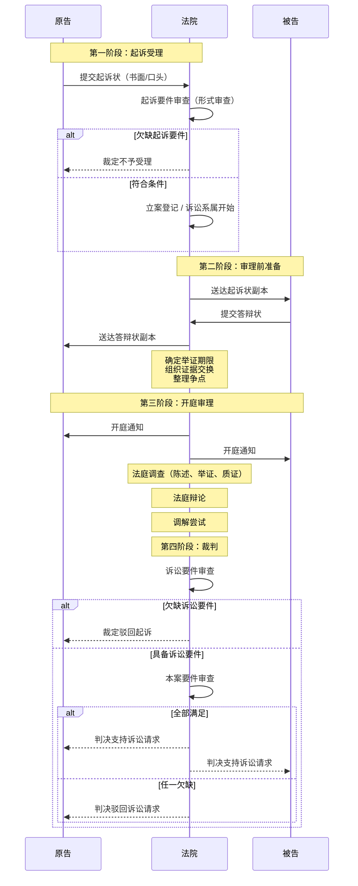

---

# 一、普通程序概述

## （一）概念

- `第一审普通程序`，简称普通程序，是法院审理第一审民事案件所适用的基本审判程序。
	- 第一审程序包括普通程序和简易程序；
	- 普通程序是相对于简易程序而言的完整程序形态。

## （二）特征

| 特征  | 含义                   | 内容                                       |
| --- | -------------------- | ---------------------------------------- |
| 完整性 | 具备完整程序阶段，并能处理多种特殊情形  | 起诉受理—审前准备—开庭审理—裁判 特殊：撤诉/延期/中止/终结/缺席裁判 |
| 基础性 | 其他程序没有规定时，适用普通程序相关规定 | 普通程序是其他程序的补充法                            |
| 广泛性 | 适用于各级法院              | 与简易程序、二审程序的适用范围相区分                       |

## （三）普通程序三个阶段

1. `起诉受理`：法院判断诉讼入口能否打开。
2. `审理前准备`：法院组织材料、证据和争点，保障庭审集中进行。
3. `开庭审理与裁判`：法院在庭审基础上作出判决、裁定等裁判。

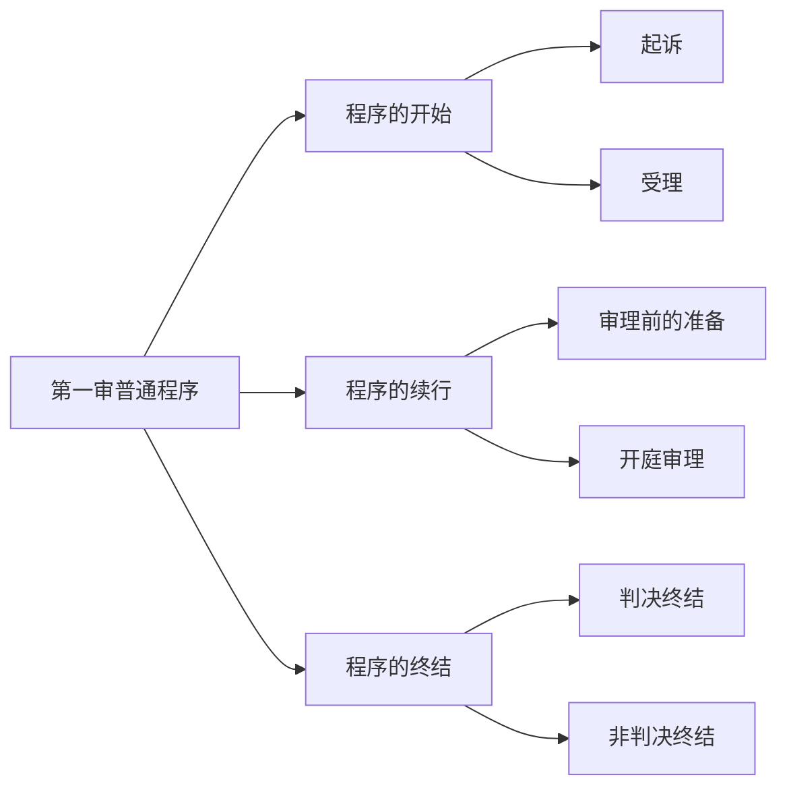

| 维度    | 起诉要件            | 诉讼要件           | 实体胜诉要件        |
| ----- | --------------- | -------------- | ------------- |
| 问题性质  | 程序入口条件          | 本案判决前提条件       | 实体请求成立条件      |
| 审查方式  | 形式审查为主          | 与本案并行审理        | 实体审理          |
| 审查阶段  | **立案受理前（起诉阶段）** | **受理后至口头辩论终结** | **实体审理阶段**    |
| 不满足后果 | 不予受理（裁定）        | 驳回起诉（裁定）       | 驳回诉讼请求（判决）    |
| 再起诉   | 符合条件可再诉         | 符合条件可再诉        | 受既判力限制，通常不得再诉 |

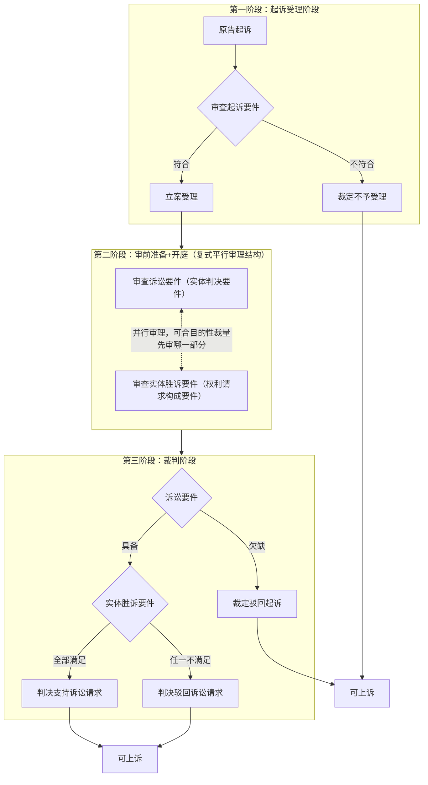

---

# 二、起诉与受理

## （一）起诉与受理的概念

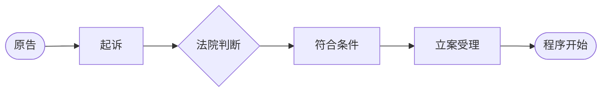

- **起诉**：公民、法人或者非法人组织认为`自己的`或者`自己依法管理支配的`**民事权益受到侵害**（给付之诉），或者**与他人发生争议**（形成/确认之诉），以`自己的名义`请求法院通过**审判**予以**司法保护**的诉讼行为。
	- 制度基础：`民事诉权`、`处分原则`、`不告不理`。
- **受理**：法院审查原告起诉后，认为符合法定条件，决定立案审理的诉讼行为。
- **起诉**与**受理**相结合，标志着==民事诉讼程序开始==。

## （二）起诉方式

| 方式 | 规则 |
| --- | --- |
| 书面起诉 | 原则方式。起诉应向法院递交起诉状，并按照被告人数提出副本。 |
| 口头起诉 | 例外方式。书写起诉状确有困难的，可以口头起诉，由法院记入笔录，并告知对方当事人。 |

## （三）起诉条件

> 也叫「[[余论：民事诉讼之要件#二、起诉要件|起诉要件]]」

起诉必须同时符合四项条件：
1. **原告**：原告是与本案有**直接利害关系**的公民、法人和其他组织。
2. **被告**：有**明确的被告**。
3. **具体**：有具体的`诉讼请求`和`事实`、`理由`（用于确定诉讼标的）
4. **范围**：属于`人民法院受理民事诉讼的范围`和`受诉人民法院管辖`。

> [!caution]
> 起诉条件是程序入口要件，不等于实体请求成立。起诉条件不足可能导致`不予受理`或`驳回起诉`；实体请求不能成立则通常表现为`驳回诉讼请求`。

## （四）不予受理的案件

| 类型                     | 处理                                                    |
| ---------------------- | ----------------------------------------------------- |
| 属于行政诉讼受案范围             | 告知原告提起行政诉讼                                            |
| 存在有效仲裁条款或仲裁协议          | 告知申请仲裁；坚持起诉的，裁定`不予受理`                                 |
| 法律规定应由其他机关处理           | 告知向有关机关申请解决                                           |
| 对本院没有管辖权               | 告知向有管辖权法院起诉；坚持起诉的，裁定`不予受理`                            |
| 生效判决、裁定、调解书已经处理，当事人又起诉 | 告知申请再审，但法院准许撤诉的裁定除外                                   |
| 法定期间内不得起诉              | 在不得起诉期间内起诉的，`不予受理`                                    |
| 特定身份关系案件六个月限制          | 判决不准离婚、调解和好离婚、判决/调解维持收养关系案件，无新情况新理由，原告六个月内又起诉的，`不予受理` |
| 被告信息不足以认定明确被告          | 可告知补正；补正后仍不能确定明确被告的，裁定`不予受理`                          |

> [!caution] 离婚/收养六个月规则
> - 限制的是`原告`在无新情况、新理由时六个月内再次起诉。
> - `被告`在六个月内起诉的，应予受理。
> - 有新情况、新理由，或者六个月期间届满后，`原告`再次起诉的，应予受理。

|  **比较内容**  | **不予受理**  | **驳回起诉**  |     **驳回诉讼请求**     |
| :--------: | :-------: | :-------: | :----------------: |
|   解决问题性质   |   程序问题    |   程序问题    |        实体问题        |
|   适用诉讼阶段   |  审查起诉阶段   |   受理案件后   |       受理案件后        |
|    适用条件    | 起诉不符合受理条件 | 起诉不符合受理条件 | 起诉符合条件，但诉讼请求不能获得支持 |
| 当事人针对文书的权利 | 可以上诉、申请再审 | 可以上诉、申请再审 |     可以上诉、申请再审      |
| 当事人针对案件的权利 |   可以再起诉   |   可以再起诉   |   不得再起诉，因为一事不再理    |
|    上诉期     |    10日    |    10日    |        15日         |
|    适用组织    |    立案庭    |   审判组织    |        审判组织        |
|    适用文书    |    裁定     |    裁定     |         判决         |

## （五）受理的特殊情形

- 原告`撤诉`或者`按撤诉处理`后，以`同一诉讼请求`**再次起诉**的，**应予受理**。
- 仲裁条款或者仲裁协议不成立、无效、失效、内容不明确无法执行的，不排除法院受理。
- 夫妻一方下落不明，另一方**只请求离婚**而**不申请宣告失踪或死亡**的，**应予受理**，并对下落不明人·`公告送达`。
- `赡养费、扶养费、抚养费案件`**裁判生效后**，因`新情况、新理由`**要求增加或减少费用**的，**作为新案受理**。
- 超过诉讼时效期间起诉的，应予受理；对方提出诉讼时效抗辩且成立的，**判决**`驳回诉讼请求`。

## （六）立案登记制

> [!tip] 起诉要件高阶化 
> **起诉要件高阶化**，是指我国《民事诉讼法》将本应在受理后与本案程序并行审理的**诉讼要件（实体判决要件）**，前置到起诉阶段进行实质审查的制度现象。这导致起诉的门槛被人为抬高，成为“起诉难”的制度根源。
> 
> 具体表现为：
> 1. **条件“植入”**：《民事诉讼法》第122条的起诉条件中，包含了“原告与本案有直接利害关系”（即当事人适格）等诉讼要件。 
> 2. **审查提前**：本应在审理阶段审查的程序合法性要件，被要求在立案阶段就具足。
> 3. **后果加重**：当事人若欠缺此类要件，在起诉阶段会被直接裁定不予受理，而非受理后驳回起诉。
> 4. **制度悖论**：使得程序入口审查与程序合法推进的审查混同，违背了三要件体系的递进逻辑。

### 1. 从立案审查制到立案登记制

- `立案审查制`：**起诉条件**中包含`诉讼要件`，**起诉阶段**对`诉讼要件`进行**实质审查**。
- `立案登记制`：将`诉讼要件`从`起诉条件`中剥离，**起诉阶段**原则上只作`形式审查`
	- 重点审查起诉状是否具备法定内容、是否按被告人数提交副本。

### 2. 制度内容

- **一律接受**：法院对`起诉、自诉`一律**接收诉状**，出具`书面凭证`并**注明**`收到日期`。
- **当场立案**：对`符合法律规定`的起诉，应当**当场登记立案**。
	- 当场**不能判断**是否符合法律规定的
		- `民事、行政起诉`一般在`收到起诉状之日`起`七日内`决定是否立案；
		- 三撤：30日；执行异议：15 日
		- 法定期间内不能判断是否符合的，**应先行立案**。
- **予以[[III 民事诉讼法的基本原则#（四）辩论原则的补充机制|释明]]**：
	- 诉状和材料不符合要求的，应**一次性书面告知**在`指定期限`内补正；
		- 当事人**在指定期间内补正的**：法院`决定立案期间`自`收到补正材料之日`起计算
			-  补正后仍不符合要求的，**裁定**或**决定**`不予受理`、`不予立案`。
		- 当事人**未补正的**：
			- **退回诉状**，**记录在册**
			- 坚持起诉、自诉的：**裁定**`不予受理`、`不予立案`
	- 人民法院对起诉、自诉`不予受理`、`不予立案`的
		- 应当出具**书面裁定或决定**，并载明理由

### 3. 利弊

| 优点                       | 风险                                                           |
| ------------------------ | ------------------------------------------------------------ |
| 保障诉权，回应起诉难，有利于发挥司法纠纷解决功能 | 立案门槛降低：可能增加被告无端卷入诉讼、原告滥诉缠诉、法院受理本不适于通过法院解决的案件、司法资源紧张（诉讼爆炸）等问题 |

> [!tip]
> 立案登记制的核心不是“无条件立案”，而是把起诉阶段压缩为形式审查，弱化立案庭对实体性诉讼要件的提前过滤。

## （七）民事起诉状

### 1. 必要内容

起诉状应当记明：

- **原告身份信息**：
	- **自然人**的`姓名`、`性别`、`年龄`、`民族`、`职业`、`工作单位`、`住所`、`联系方式`；
	- **法人或其他组织**的`名称`、`住所`和`法定代表人/主要负责人`的`姓名`、`职务`、`联系方式`。
- **被告身份信息**：[^2]
	- **自然人**的`姓名`、`性别`、`工作单位`、`住所`等；
	- **法人或其他组织**的`名称`、`住所`等。
- **诉讼标的**：
	- `诉讼请求`和所根据的`事实与理由`。
- **证据**：
	- 证据和证据来源
	- 证人姓名和住所

### 2. 明确的被告

- 原告提供**被告**的`姓名`或者`名称`、`住所`等信息**具体明确**，==足以使被告与他人相区别的==
	- 可以认定为**有明确被告**。
- 被告信息**不足以认定明确被告的**
	- 法院可以告知补正；
	- 补正后仍不能确定的，裁定`不予受理`。

### 3. 诉讼请求

- **质的方面**：
	- 必须明确请求法院保护的`具体形式`和`具体内容`
		- 即[[II 民事之诉基本理论#1. 给付之诉|给付什么]]、[[II 民事之诉基本理论#2. 确认之诉|确认什么]]、[[II 民事之诉基本理论#3. 形成之诉|形成什么]]。
- **量的方面**：应表明（标的物）具体数额、数量、高度、宽度等。
- **诉讼请求不明确的后果**：会导致`裁判主文`与`执行依据`不明确。

### 4. 所依据的事实与证据

- **识别说**：`事实记载`**能够使得**`该权利关系`与`其他权利关系`**相识别**即可。
- **证据和证据来源**：虽列入起诉状事项，但庄诗岳讲义强调其更接近**训示性条文**
	- 是任意记载事项：`是否提交充分证据`不宜被过度前置为起诉门槛。

## （八）起诉的法律效果

- **起诉或者申请仲裁**产生==诉讼时效中断==效果。
	- 从`中断`、有关程序`终结`时起：**诉讼时效期间重新计算**
- 当事人向法院提交起诉状或者口头起诉的，**诉讼时效**从`提交起诉状`或者`口头起诉之日`起==中断==。

## （九）受理的法律效果

1. **受诉法院**取得该案`审判权`、`管辖权`。
2. 确定**当事人的诉讼地位**。
3. 阻止本案当事人**重复起诉**。

### 1. 重复起诉的法定判断标准

> 复习：[[II 民事之诉基本理论#三、诉的识别]]

当事人就已经提起诉讼的事项，在诉讼过程中或者裁判生效后**再次起诉**，==同时符合以下条件的==，构成重复起诉：

| 要件 | 内容 |
| --- | --- |
| 当事人同一 | 后诉与前诉当事人相同 |
| 诉讼标的同一 | 后诉与前诉诉讼标的相同 |
| 请求同一或实质否定 | 后诉与前诉诉讼请求相同，或者后诉请求实质上否定前诉裁判结果 |

重复起诉的，**裁定**`不予受理`；已经受理的，**裁定**`驳回起诉`，但法律、司法解释另有规定的除外。

### 2. 身份关系诉讼的特别处理

财产争讼通常适用“三同”标准。**身份关系诉讼**还会考虑**诉讼理由**和**起诉时间**
- 例如离婚、收养关系案件的六个月限制。

### 3. 理论判断标准

- 当事人不同，原则上诉不同；法定当事人变更除外。
	- 当事人相同而诉讼标的不同，诉不同。
		- 诉讼标的相同而诉讼理由不同，诉不同。
			- 诉讼理由相同的身份关系诉讼，还需考虑起诉时间因素。

---

# 三、审理前的准备

## （一）概念

**审理前准备**是`法院受理案件后`至`开庭审理前`依法进行各项诉讼活动的总称
- 目的：在于保证庭审及时、顺利进行，防止诉讼拖延。

## （二）功能

|    功能     |               含义               |
| :-------: | :----------------------------: |
| 证据固定、事实展示 |   通过证据收集与开示，使双方尽可能获取案件相关证据资料   |
|   争点确认    | 围绕真正争点组织审理，原则上约束后续主张、证据和法院审理范围 |
|   案件过渡    |     部分案件可经由准备程序终结，无须进入正式开庭     |
| 促进纠纷合意解决  |     在证据与信息开示基础上，为调解、和解创造条件     |

## （三）我国审前准备内容

- `送达`==起诉状副本和答辩状副本==。
- 告知当事人诉讼权利义务和合议庭组成人员。
- 审核诉讼材料，调查收集必要证据。
- 通知[[VII 多数人诉讼#固有必要共同诉讼人不适格的处理|必要共同诉讼的当事人]]参加诉讼。
- ==组织当事人交换证据==。
- ==召集庭前会议==。
- 进行其他审理前准备工作。

## （四）被告答辩

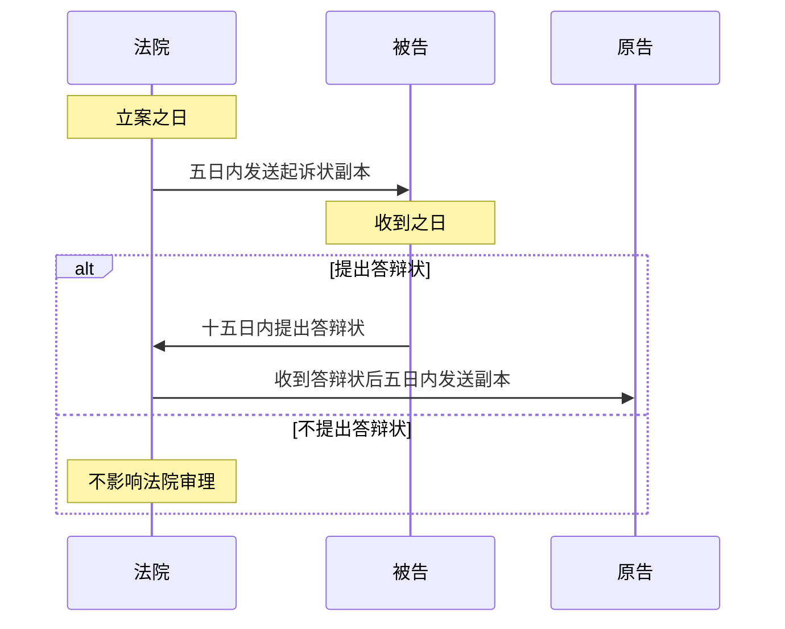

- 法院应在`立案之日`起`五日内`将`起诉状副本`**发送被告**。
	- 被告应在`收到之日`起`十五日内`**提出答辩状**。
		- 法院应在`收到答辩状之日`起`五日内`将`答辩状副本`**发送原告**。
	- 被告**不提出答辩状**，==不影响法院审理==。

## （五）举证时限

### 1. 概念

`举证时限`要求当事人在一定期限内向法院提供证据。其制度功能在于落实`证据适时提出主义`，**保障集中审理**。

### 2. 柔性证据失权

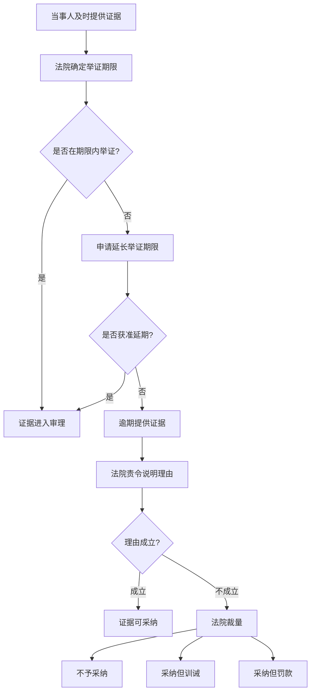

- **当事人应及时提供证据**。
	- 法院根据`当事人主张`和`案件审理情况`确定当事人**应当提供的证据**和**举证期限**。
		- 在举证期限内**提供证据确有困难**的，可以申请`延长期限`。
		- 逾期提供证据的，法院应责令说明理由；
			- 拒不说明或理由不成立的，法院可根据情形：
				- ==不予采纳==，
				- 或者==采纳==但予以**训诫**、**罚款**。

### 3. 具体期限

人民法院应当在`审前准备阶段`确定**当事人的举证期限**。举证期限**可由当事人协商**，并经人民法院**准许。**

- **第一审普通程序案件**的举证期限不得少于`15日`。
- **当事人提供新证据的第二审案件**不得少于`10日`。
- 举证期限届满后：
	- 对`已提供证据`**申请反驳**
	- 或者对`证据来源`、`形式瑕疵`**申请补正的**，
	- 法院可酌情**再次确定期限**，==该期限不受前述限制==。

### 4. 逾期举证后果

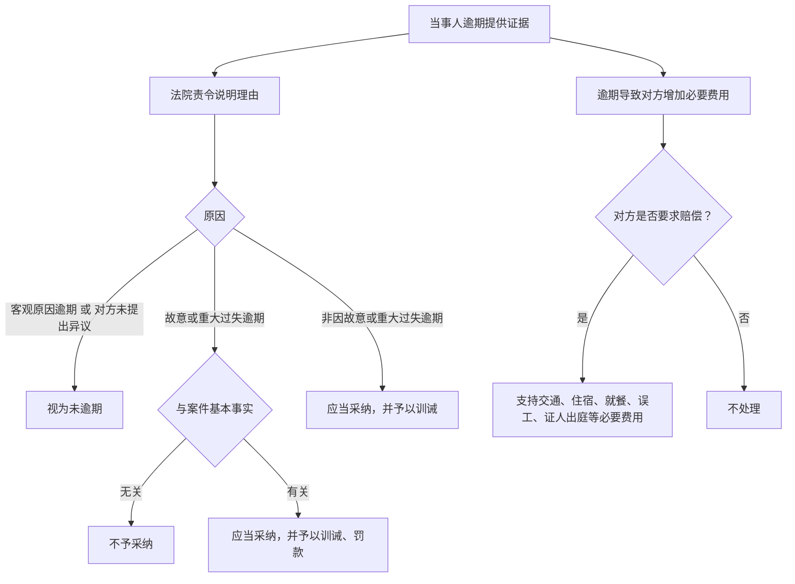

| 逾期原因                         | 处理                                |
| ---------------------------- | --------------------------------- |
| 逾期提供证据                       | 应当责令其说明理由，必要时可要求提供相应证据            |
| ==客观原因逾期==，或对方未提出异议          | 视为未逾期                             |
| ==故意或重大过失逾期==，**且与案件基本事实无关** | 不予采纳                              |
| ==故意或重大过失逾期==，**但与案件基本事实有关** | 应当采纳，并予以训诫、罚款                     |
| ==非因故意或重大过失逾期==              | 应当采纳，并予以训诫                        |
| 逾期导致对方**增加必要费用**             | 对方要求赔偿交通、住宿、就餐、误工、证人出庭等必要费用的，可予支持 |

## （六）交换证据与整理争点

1. 对**需要开庭审理**的案件，法院通过`交换证据`等方式**明确争议焦点**。
2. **证据交换**
	- **时间**：通过`证据交换`进行`审前准备`的，`证据交换之日`**举证期限届满**。
		- **证据交换时间**：可由`当事人协商一致`并`经法院认可`，也可`由法院指定`。
			- **当事人申请延期举证**，经法院准许的，证据交换日相应顺延
	- **内容**：证据交换应由`审判人员`主持。
		- **无异议**的事实、证据：记录在卷；
		- **有异议**的证据：按`需要证明的事实`分类记录在卷，并记载`异议理由`。

---

# 四、开庭审理

## （一）概念与任务

- **开庭审理**，又称**法庭审理**，是法院在当事人和其他诉讼参与人参加下，依照法定程序和形式，在法庭上对案件进行`实体审理`并`作出裁判`的诉讼活动。
- **任务**：在充分保障[[III 民事诉讼法的基本原则#五、辩论原则|辩论权]]的基础上，通过举证、质证、认定证据，查明事实、分清是非、正确适用法律，作出公正裁判。

## （二）开庭审理的形式

| 形式                             | 内容                                                                                 |
| ------------------------------ | ---------------------------------------------------------------------------------- |
| [[IV 民诉法的基本制度#五、公开审判制度\|公开审理]] | 原则公开；例外：【绝对不公开】涉及`国家秘密`、`个人隐私`或者`法律另有规定`的除外；【申请不公开】`离婚案件`、`商业秘密`案件经申请可以不公开         |
| 法庭审理                           | 可在法院法庭进行，也可在当事人住所地、纠纷发生地等临时场所进行；经双方同意[[III 民事诉讼法的基本原则#十一、在线诉讼与线下诉讼效力等同原则\| 可在线审理]] |
| 言词审理                           | 合议庭和诉讼参与人的诉讼行为原则上以**言词方式**进行                                                       |

## （三）开庭审理内容

- 法庭审理应围绕**当事人争议**的`事实`、`证据`和`法律适用`焦点进行（处分原则）。
- 当事人对[[X 第一审普通程序#（六）交换证据与整理争点|审前准备阶段]]**认可**的`事实`和`证据`在`庭审`中提出**不同意见**的（争点确认）：
	- 法院应责令说明理由；
		- 必要时，可以责令其`提供相应证据`。
		- **理由成立的**，**可以**列入`争议焦点`审理。

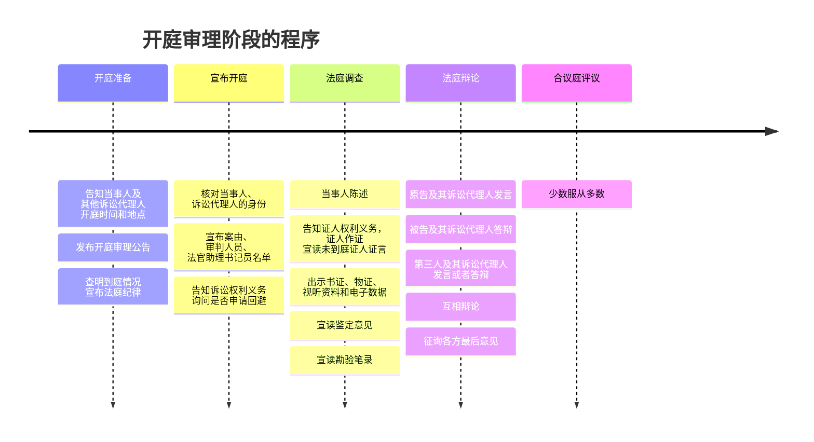

## （四）开庭准备

1. **告知**`当事人`及`其他诉讼参与人`的**开庭时间和地点**，发布**开庭审理公告**
	- 开庭`3日前`通知当事人和其他诉讼参与人；
		- [[IV 民诉法的基本制度#五、公开审判制度|公开审理]]的，**公告**当事人姓名、案由、开庭时间和地点。
	- **普通程序案件**开庭`3日前`用**传票传唤**`当事人`；
	- 对`诉讼代理人`、`证人`、`鉴定人`、`勘验人`、`翻译人员`用**通知书通知**到庭。
	- 当事人或其他诉讼参与人**在外地的**，应留有必要在途时间。
2. 开庭审理前，书记员**查明到庭情况**并**宣布法庭纪律**。

## （五）宣布开庭

- 核对当事人和诉讼代理人身份。
- 宣布案由。
- 宣布审判人员、法官助理、书记员等名单。
- 告知诉讼权利义务，询问是否申请回避。

## （六）法庭调查

### 1. 概念

`法庭调查`是法院依照法定程序，在法庭上向`当事人`和`其他诉讼参与人`**审查核实证据**的活动。

### 2. 法庭调查顺序

1. 当事人陈述。
2. 告知证人权利义务，证人作证，宣读未到庭证人证言。
3. 出示书证、物证、视听资料和电子数据。
4. 宣读鉴定意见。
5. 宣读勘验笔录。

### 3. 当事人陈述顺序

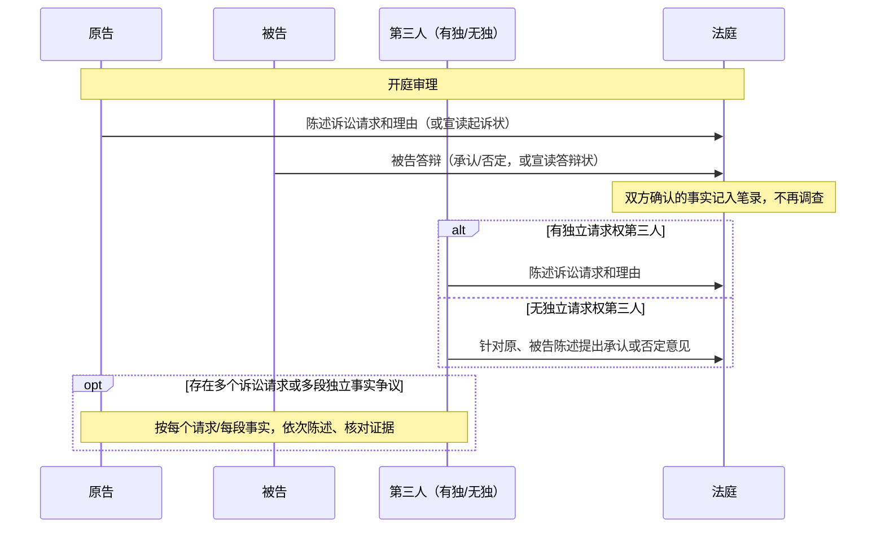

1. **原告陈述**：
	- **原告陈述**`诉讼请求`和`理由`，或者**宣读**`起诉状`。
2. **被告答辩**：
	- 被告针对**起诉**作出`承认`或`否定`**答辩**，或者**宣读**`答辩状`
	- 双方`确认的事实`**记入笔录，法庭无须再调查。**
3. **第三人陈述或者答辩**：
	- **有独三**：陈述其`诉讼请求`和`理由`；
	- **无独三**：针对原、被告`陈述`提出`承认`或`否定`意见。
- 案件存在`多个诉讼请求`或`多段独立事实争议`时
	- 可按`每个请求`或`每段事实争议`**依次陈述**、**核对证据**。

## （七）质证

### 1. 概念

`质证`是在法庭主持下，当事人对出示证据进行询问、辨认、质疑、辩驳、核实等诉讼活动。

### 2. 质证结构

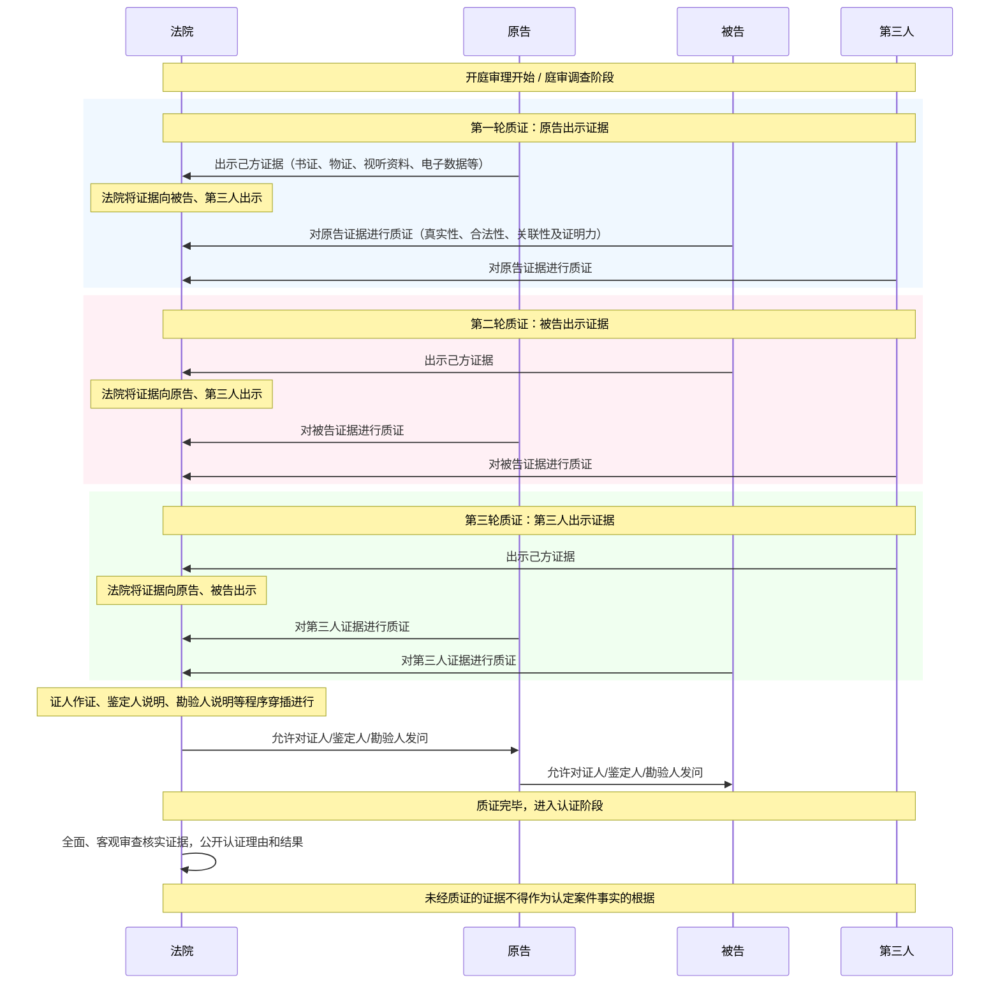

| 项目  | 内容                                                                      |
| --- | ----------------------------------------------------------------------- |
| 主体  | 当事人及其诉讼代理人，包括原告、被告、第三人、诉讼代表人                                            |
| 客体  | 当事人提交的证据和法院调查收集的证据[^3]                                                  |
| 内容  | 真实性、合法性、关联性，以及证明力有无和大小                                                  |
| 顺序  | 1.  **原告出示**，被告/第三人质证； 2. **被告出示**，原告/第三人质证； 3. **第三人出示**，原告/被告质证 |

> [!tip] 法院依职权调查收集的证据
> 1. **根据当事人申请收集的**：
> 	1. 审判人员对调查收集到的证据进行说明
> 	2. 由提出申请的当事人，与对方/第三人质证
> 2. **审判人员**对调查、收集到的证据进行**说明后**，**听取当事人意见**

### 3. 质证的法律效果
 
- 证据应在法庭上出示，由当事人互相质证。
	- ==未经质证的证据，不得作为认定案件事实的根据。==
	- 审前准备阶段认可的证据，经审判人员在庭审中说明后，**视为质证过的证据**。
	- 涉及国家秘密、商业秘密、个人隐私或者法律规定应保密的证据，**不得公开质证**。

## （八）法庭辩论

- **法庭辩论**是在法庭调查基础上，双方围绕争议焦点，就`事实认定`和`法律适用`阐明观点、反驳对方的活动。
- **辩论顺序**：
	1. 原告及其诉讼代理人发言。
	2. 被告及其诉讼代理人答辩。
	3. 第三人及其诉讼代理人发言或者答辩。
	4. 互相辩论。
- **法庭辩论终结后**，`审判长`或`独任审判员`按原告、被告、第三人的顺序**征询最后意见**。

## （九）合议庭评议

- **合议庭评议**围绕`案件性质`、`事实认定`、`法律适用`、`是非责任`和`处理结果`**形成结论**；
- 实行少数服从多数，评议笔录由合议庭成员签名，不同意见如实记入笔录。

---

# 五、宣告判决

## （一）一审普通程序终结方式

| 类型    | 具体方式                                 |
| ----- | ------------------------------------ |
| 判决终结  | 法院对实体争议作出判决                          |
| 非判决终结 | 不予受理、驳回起诉、 撤诉、诉讼和解、法院调解、 诉讼终结等 |

## （二）宣告判决内容

- 公开审理或不公开审理的案件，[[IV 民诉法的基本制度#4. 公开宣告判决|一律公开宣告判决]]。
	- **发给判决书**
		- 当庭宣判的，应在`10日`内发送判决书；
		- 定期宣判的，宣判后**立即**发给判决书。
	- **告知上诉权利**
		- 宣告判决时，必须告知上诉权利、上诉期限和上诉法院。
	- **告知不得立即结婚**
		- 宣告离婚判决时，必须告知当事人在判决发生法律效力前不得另行结婚。
	- **告知领取裁判文书**
		- **当庭宣判的案件**，除当事人当庭要求邮寄发送裁判文书外，法院应告知领取裁判文书的时间、地点和逾期不领取的法律后果，并记入笔录。

---

# 六、诉讼中的特殊情形

## （一）撤诉

### 1. 撤诉：概念

`撤诉`是法院立案后、宣判前，当事人将已经成立之诉撤销的诉讼行为。

撤诉是当事人行使处分权的表现，诉经依法撤销后，法院停止对该诉的审理，已经开始的程序结束。

### 2. 申请撤诉：条件

- **原告向受诉法院提出书面或者口头撤诉申请**。
	- 原告包括有[[VII 多数人诉讼#二、有独立请求权第三人|独立请求权第三人]]、[[II 民事之诉基本理论#（2）反诉|反诉原告]]。
- **撤诉意思表示真实**。
- **撤诉目的正当、合法**。
	- 当事人有违反法律行为需要依法处理的，法院可以不准许撤诉。
	- 按撤诉处理的情况也一样。
- **撤诉应在立案受理后、判决宣告前提出**。
	- 法庭辩论终结后申请撤诉，被告不同意的，法院可以不予准许（没有完全贯彻处分原则）。
- **是否准许，由法院裁定**。

### 3. 按撤诉处理

**按撤诉处理**是==原告==**虽未主动申请撤诉**，但其**怠于参与开庭审理**的行为（=无正当理由拒不到庭 + 未经法庭许可中中途退庭 + 不预缴案件受理费）表明其**不愿继续诉讼**，法院依法按撤诉处理的制度。

1. **原告**：原告（包括有独三）经传票传唤，==无正当理由拒不到庭==，或者==未经法庭许可中途退庭==。
2. **原告**：`无民事行为能力当事人的法定代理人`经传票传唤==无正当理由拒不到庭==，且属于原告方。
3. **有独三**：有独立请求权第三人经法院传票传唤，==无正当理由拒不到庭==，或者==未经法庭许可中途退庭==。
4. **没交钱**：
	1. 原告应预交而未预交案件受理费，经通知仍不预交
	2. 或者减、缓、免申请未获批准后仍不预交。

> [!caution] 不得而知
> 无民事行为能力当事人的法定代理人按撤诉处理规则中，没有“**未经法庭许可中途退庭**”这一情形。

### 4. 撤诉的法律后果

- **原告提起的诉结束**
	- 【**有独三继续**】**有独立请求权第三人参加诉讼后**，原告撤诉获准的：
		- 有独立请求权第三人作为另案原告，原案原告、被告作为另案被告，**诉讼继续进行**。
	- 【**反诉继续**】本诉原告撤诉获准的，反诉继续审理；被告申请撤回反诉的，应予准许。
- **视为原告未起诉**
	- 撤诉或按撤诉处理后，以`同一诉讼请求`再次起诉的，**应予受理**。
		- **例外**：离婚案件撤诉或按撤诉处理后，无新情况、新理由，六个月内又起诉的，不予受理。
- **诉讼费用由原告负担**
	- 【**鼓励调解撤诉**】以调解方式结案或申请撤诉的，**减半交纳案件受理费**。

## （二）延期审理

### 1. 延期审理：概念

**延期审理**是出现`法定特殊情形`，致使**不能**按`已确定日期`进行庭审，法院将庭审**推延到另一期日**的制度。

### 2. 延期审理：情形

- **缺席**：**必须到庭**的`当事人`和`其他诉讼参与人`有==正当理由==**没有到庭**。
- **回避**：当事人临时提出[[IV 民诉法的基本制度#四、回避制度|回避]]申请。
- **新证据**：需要`通知新证人到庭`、`调取新证据`、`重新鉴定勘验`，或者需要`补充调查`。
- **其他**应当延期的情形。

> [!tip]  “必须到庭”通常包括：
> - **被告**：负有`赡养、抚育、扶养义务`且不到庭**无法查清案情**的被告；
> - **原告**：必须到庭才能**查清基本事实**的原告；
> - **被执行人**：必须**接受调查询问**的被执行人、被执行人的法定代表人、负责人或实际控制人

## （三）诉讼中止

### 1. 诉讼中止：概念

**诉讼中止**是法院在审理过程中，因发生`法定情形`使诉讼**无法继续进行而暂时停止**的制度。中止原因消除后，恢复诉讼。

### 2. 中止诉讼：情形

> 3 + 2 + 1

- **死亡/失能**：
	1. **自然人**：一方当事人**死亡**，需要等待`继承人`表明是否参加诉讼。
	2. **法人/非法人**：作为一方当事人的**法人或者其他组织终止**，尚未确定`权利义务承受人`。
	3. **失能**：一方当事人**丧失诉讼行为能力**，尚未确定`法定代理人`。
- **不可抗力缺席**：
	1. 一方当事人因`不可抗拒`事由**不能参加诉讼**。
- **等待戈多**：
	1. 本案必须以`另一案审理结果`为**依据**，而**另一案尚未审结**。[^4]
- **兜底**：其他应当中止诉讼的情形。

中止原因消除后，恢复诉讼。

### 3. 诉讼中止与延期审理

| 维度   | 诉讼中止              | 延期审理        |
| ---- | ----------------- | ----------- |
| 发生阶段 | 裁判作出前任何阶段         | 开庭审理阶段      |
| 停止范围 | 中止期间原则上不得进行案件诉讼活动 | 可进行其他诉讼活动   |
| 恢复时间 | 通常一时难以确定          | 通常可确定下次开庭时间 |
| 效果   | 暂时停止诉讼程序          | 暂时停止诉讼程序    |

## （四）诉讼终结

### 1. 诉讼终结：概念

**诉讼终结**是诉讼进行中因发生`法定情形`，诉讼**无法继续进行**或者**继续进行已无必要**，从而==结束诉讼程序==的制度。

### 2. 诉讼终结：情形

> [!tip] 死亡：诉讼随着当事人一同终结
> 原告死了、被告死了、两类案件的任何一方死了，且：
>> 无人享受权利、无人承担义务

1. **原告死亡**，没有继承人，或者继承人放弃诉讼权利。
2. **被告死亡**，没有遗产，也没有应当承担义务的人。
3. `离婚案件`**一方当事人死亡**。[^1]
4. 追索`赡养费、扶养费、抚养费以及解除收养关系`案件的**一方当事人死亡**。

### 3. 诉讼终结与诉讼中止

| 维度  | 诉讼终结                 | 诉讼中止            |
| --- | -------------------- | --------------- |
| 效果  | 永久结束，不再恢复            | 暂时停止，原因消除后恢复    |
| 原因  | 以特定**死亡**情形为主，法院依法作出 | 原因较多，具有更大自由裁量空间 |

## （五）审理期限与庭审笔录

### 1. 审理期限

- **半年审结**：普通程序案件应在立案之日起`6个月`内审结。
	- 有特殊情况**需要延长的**，经`本院院长`批准，可以延长`6个月`；
		- 还需延长的，报请`上级法院`批准。
- **审限期间**：通常从`立案之日`起至`裁判宣告、调解书送达之日`止。
	- **不计入审限**：`公告期间`、`鉴定期间`、`双方和解期间`、`审理管辖异议`及`处理法院之间管辖争议期间`，不计入审限。

> [!tip] 审理期间
> 6 + 6 + N

### 2. 庭审笔录

- **庭审笔录**是在`开庭审理阶段`由书记员制作，全面、客观、真实反映`庭审活动与过程`的书面记录。
	- **得签名**：庭审活动记入笔录后，由**审判人员**和**书记员**签名。
	- **得阅读**：笔录应`当庭宣读`，也可告知当事人和其他诉讼参与人`当庭`或`5日内阅读`。
		- 当事人和其他诉讼参与人认为对**自己的**`陈述记录`有`遗漏`或`差错`的：
			- **有权申请补正**；
			- 不予补正的，**申请应记录在案**。
		- **读完签字**：当事人和其他诉讼参与人签名或盖章；拒绝签名盖章的，记明情况附卷。

---

# 七、民事诉讼中的裁判

## （一）裁判概念

民事诉讼中的**法院裁判**，是法院在民事诉讼过程`终结之前`或`终结之时`，对`实体争议`、`程序争议`或者`其他特定问题`作出的**判定**。
- 基本类型包括：[[X 第一审普通程序#（二）判决|判决]]、[[X 第一审普通程序#（五）裁定|裁定]]、[[X 第一审普通程序#1. 决定|决定]]和[[X 第一审普通程序#2. 命令|命令]]。

## （二）判决

### 1. 概念与特征

**民事判决**是法院在案件**审理程序终结时**，根据`查明和认定的事实`，适用`法律`对**实体问题**作出的**权威性判定**。

特征：

- **主体**：法院。
- **对象**：案件实体问题。
- 具有**法律权威性**

### 2. 判决种类

| 分类标准  | 类型      | 要点               |
| ----- | ------- | ---------------- |
| 内容和性质 | 给付判决    | 具有给付内容，可产生执行力    |
| 内容和性质 | 确认判决    | 确认民事权利义务关系存在或不存在 |
| 内容和性质 | 形成/变更判决 | 变更当事人现存民事权利义务关系  |

| 分类标准 | 类型   | 要点                                                   |
| ---- | ---- | ---------------------------------------------------- |
| 出庭情况 | 对席判决 | 双方参加庭审后作出                                            |
| 出庭情况 | 缺席判决 | 一方经**传票传唤**，[[X 第一审普通程序#3. 按撤诉处理\|无正当理由不到庭或中途退庭时]]作出 |

> 依法作出的缺席裁判与对席裁判效力相同

| 分类标准   | 类型   | 要点                       |
| ------ | ---- | ------------------------ |
| 判决纠纷范围 | 全部判决 | 对当事人的所有请求事项一并做出的判决       |
| 判决纠纷范围 | 部分判决 | 对当事人部分请求在查清事实的基础上先行作出的判决 |

> 部分判决就`已作出判决的诉讼请求`的审级程序终结
> `没有作出判决的部分请求`的审级程序继续存在直至作出判决
> 对部分判决可独立上诉

| 分类标准  | 类型    | 要点            |
| ----- | ----- | ------------- |
| 是否可上诉 | 确定判决  | 不得通过上诉予以变更或撤销 |
| 是否可上诉 | 未确定判决 | 可通过上诉予以变更或撤销  |

| 分类标准 | 类型     | 要点                        |
| ---- | ------ | ------------------------- |
| 案件性质 | 诉讼案件判决 | 对`民事权利义务关系`或`权利主张`作出的判决   |
| 案件性质 | 非讼案件判决 | **特别程序**中对`法律事实存在与否`作出的判决 |

| 分类标准    | 类型   | 要点                     |
| ------- | ---- | ---------------------- |
| 与先前判决关系 | 原判决  | 对案件审结时**最初作出的判决**      |
| 与先前判决关系 | 补充判决 | 原判决遗漏事项后**依法补充**原判决的判决 |

### 3. 缺席判决的法定情形

**被告方缺席**：

| 缺席者                                                                                | 处理    |
| ---------------------------------------------------------------------------------- | ----- |
| **原告**经传票传唤`无正当理由拒不到庭，或未经法庭许可中途退庭`，可[[X 第一审普通程序#3. 按撤诉处理\|按撤诉处理]]，但是：==被告反诉的==  | 可缺席判决 |
| **被告**经传票传唤`无正当理由拒不到庭，或未经法庭许可中途退庭                                                  | 可缺席判决 |
| `无民事行为能力当事人的法定代理人`**无正当理由拒不到庭**，**属于被告方**                                          | 缺席判决  |

**原告或被告缺席**：

| 缺席者                           | 处理        |
| ----------------------------- | --------- |
| `无民事行为能力人的离婚诉讼`，法定代理人**不能到庭** | 查清事实后依法判决 |

**原告缺席**：

| 缺席者                         | 处理    |
| --------------------------- | ----- |
| 法院裁定不准许撤诉后，原告经传票传唤无正当理由拒不到庭 | 可缺席判决 |

**无独三缺席**：不影响案件审理

### 4. 判决的成立要件

- **谁作出**：判决应由`法定的法院`和`法官`作出。
- **做什么**：判决书是法官表达`审判过程`和`内容`的**正式形式**，须制作`判决原本`，并合法`宣告、送达`。

 不具备成立要件的判决属于「非判决」，==不能产生判决效力==，也不==能终结审级程序==。

### 5. 判决的效力要件

- **处分原则**：本案判决必须是在当事人`起诉`或`上诉`后，且**未撤回**`起诉`或`上诉`的情况下作出。
- **诉讼要件**：本案判决必须以具备[[余论：民事诉讼之要件#三、诉讼要件（实体判决要件）|诉讼要件]]为前提。
- **判决事项**：判决必须具有判决事项，即对实体问题（[[II 民事之诉基本理论#（三）诉讼标的|诉讼标的]]和[[II 民事之诉基本理论#（一）以原告诉讼请求的内容分类|诉讼请求]]）作出判断。

 效力要件不具备的，==属于严重瑕疵==，**自始不产生**[[X 第一审普通程序#3. 既判力|既判力]]、[[X 第一审普通程序#4. 执行力|执行力]]、[[X 第一审普通程序#5. 形成力|形成力]]等判决效力。

## （三）判决效力

![[判决的效力.png]]

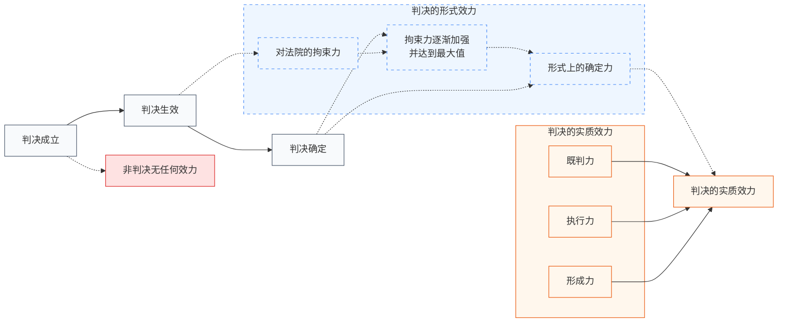

### 判决的形式效力

#### 1. 对法院的拘束力

**拘束力**又称羁束力，是判决首先产生且一切判决均具有的形式效力。作出判决的法院在`同一审级内`**不得**任意==自行撤销==或==变更==**已宣示的判决**。

#### 2. 对当事人形式上的确定力

**形式上的确定力**是判决对当事人的效力，指**判决确定后**，当事人**不得再以**==上诉==之方法请求==废弃或变更==该判决。
- 判决形式上的确定力之发生时间：**判决确定**
	- 不准上诉的判决，自宣告时起发生形式确定力。
	- 不经宣告的判决，自送达时起发生形式确定力。

### 判决的实质效力

#### 3. 既判力

##### （1）概念

**既判力**是`确定终局判决`针对请求所作判断产生的**禁止再争执效力**。

- 确定判决形成后，**当事人**不得`就同一事项`提出`相矛盾`主张，
- **法院**也不得作出`与之矛盾或抵触`的判断。

##### （2）作用

| 侧面   | 内容                                                                                      |
| ---- | --------------------------------------------------------------------------------------- |
| 消极侧面 | 【**当事人**】不得提出违反既判力的`主张`和`证据申请`； 【**法院**】不得接受`违反既判力的主张`，应当驳回`违反既判力的证据申请` 核心效果是禁止再诉 |
| 积极侧面 | 后诉法院必须以`既判力所确定的判断`为前提作出判决。                                                              |

##### （3）与一事不再理

我国[[X 第一审普通程序#1. 重复起诉的法定判断标准|重复起诉规则]]可视为既判力消极作用在程序入口上的体现。

重复起诉同时具备当事人同一、诉讼标的同一、请求同一或实质否定前诉裁判结果时，未受理的裁定不予受理，已受理的裁定驳回起诉。

##### （4）既判力的根据

- 既判力是实现民事诉讼“解决纠纷”目的不可或缺的制度性效力。
- 既判力符合正当程序保障下的自我责任原理。

##### （5）时间范围

- **既判力的标准时**：通常为`本案最后辩论终结之时`，即，若确定判决是：
	- 一审终局判决，以`一审法庭辩论终结时`为标准时；
	- 二审终局判决，以`二审法庭辩论终结时`为标准时。
- 既判力只确定「权利关系在`标准时`上是否存在」，不当然确定`标准时`以前或以后权利关系状态。

> [!example]
> 赡养费、扶养费、抚养费案件裁判生效后，因新情况、新理由要求增加或减少费用的，作为新案受理。
> → 原因在于后诉基础事实发生在`既判力标准时之后`。

##### （6）空间范围

- 我国判决的既判力及于**我国主权空间**（不包括港澳台）。
	- 国际民事诉讼中
		- 外国判决须经我国法院承认后，才在我国具有相应效力；
		- 我国判决也须经相关外国法院承认后，才在该国发生相应效力。
	- 区际民事诉讼中
		- 内地与港澳台地区法院判决原则上仅及于各自法域，除非经其他法域承认。

##### （7）主观范围

- **原则**：既判力只及于**对立的双方当事人**之间，即==既判力具有相对性==。
	- **例外**：既判力主观范围扩张。
		- 即使不是本案当事人，也要受到确定判决既判力拘束
		- 不得就判决已判断事项提起诉讼争执
			- 即使提起诉讼，后诉法院也不得作出与前诉法院相矛盾的判断

|   扩张类型   |                                                                            典型对象                                                                            |
| :------: | :--------------------------------------------------------------------------------------------------------------------------------------------------------: |
| 对特定第三人扩张 | 口头辩论终结后的承继人（一般承继人[^7]+特定承继人[^8]）、 [[VI 当事人和诉讼代理人#1. 诉讼担当的概念\|诉讼担当]]中的**利益归属人**[^6]、 （为当事人利益）持有诉讼请求标的物的人[^9]、 [[VI 当事人和诉讼代理人#2. 特定继受\|退出诉讼的人]][^5] |
| 对一般第三人扩张 |                                                            家事/人事法律关系诉讼、团体法律关系诉讼等具有**对世效**性质的判决                                                             |

##### （8）客观范围

- 原则上限于**判决主文中的判断**。
	- 【**例外**】**抵销抗辩**：虽通常存在于判决理由中，但法律例外赋予其一定既判力效应。
- **争点效**：
	- 前诉中双方`作为主要争点争执`并`经法院审理判断`的事项，在后诉中作为`主要先决问题`出现时
		- **后诉当事人**==不得作相反主张==
		- **法院**也==不得作矛盾判断==。
- **预决/免证效**：
	- 已为法院生效裁判确认的基本事实，当事人无须举证；有相反证据足以推翻的除外。

#### 4. 执行力

具有给付内容的胜诉判决确定后，义务人应自动履行；拒不履行的，法院可**根据执行债权人申请**或**依职权强制执行**。

#### 5. 形成力

形成力又称创设力，是依判决宣告引起法律关系发生、变更或消灭的效力。==形成力以形成判决为限==，**给付判决和确认判决不具有形成力**。

## （四）判决书内容

判决书应写明判决结果和作出判决的理由，包括：

1. 案由、诉讼请求、争议事实和理由。
2. 判决认定的`事实和理由`、`适用法律和理由`。
3. 判决结果和诉讼费用负担。
4. 上诉期间和上诉法院。

判决书由审判人员、书记员署名，加盖法院印章。

## （五）裁定

### 1. 概念

`民事裁定`是法院对**程序问题**进行处理时作出的判定。

### 2. 适用范围

裁定适用于：

- **不予受理。**
- **对管辖权有异议。**
- **驳回起诉。**
- 保全和先予执行。
- 准许或者不准许撤诉。
- 中止或者终结诉讼。
- 补正判决书中的笔误。
- 中止或者终结执行。
- 撤销或者不予执行仲裁裁决。
- 不予执行公证机关赋予强制执行效力的债权文书。
- 其他需要裁定解决的事项。

对`不予受理`、`管辖权异议`、`驳回起诉`三类裁定，可以上诉。
对`保全和先予执行`，可以向本级法院复议

| 对比项      | 判决  | 裁定   |
| :------- | :-- | :--- |
| **上诉期间** | 15日 | 10日  |

### 3. 特点

- 裁定既可以是结案方式，也可以是解决诉讼过程中阶段性程序问题的方式。
- 裁定适用阶段具有全程性，包括诉讼阶段和执行阶段。
- 对裁定不服的**救济途径具有灵活性**：上诉、复议或无救济。
- 上诉期间：允许上诉的裁定，上诉期间为`10日`，短于判决`15日`上诉期间。

### 4. 判决、裁定公众查阅权

- 公众可以查阅发生法律效力的判决书、裁定书，但涉及国家秘密、商业秘密和个人隐私的内容除外。
- 申请查阅应向作出生效裁判的法院提出，并以书面形式提供具体案号或者当事人姓名、名称。
- 已经通过信息网络公开的，引导自行查阅；未公开且申请符合要求的，应提供便捷查阅服务。
- 尚未生效、已失效、非本院作出或者内容涉密的，依法不提供或告知相应处理路径。

## （六）决定与命令

### 1. 决定

`民事决定`是法院在民事诉讼中对某些特殊事项依法作出的裁断。

常见适用范围：

- 是否回避。
- ==是否准许顺延期限==。
- 是否就妨害民事诉讼行为采取强制措施及采取何种强制措施。
- 是否缓交、减交、免交诉讼费用。
- 是否准许当事人重新调查、鉴定或勘验。
- 是否再审。
- 是否暂缓执行及暂缓执行期限。

解决特殊事项的民事决定书，一经送达即发生法律效力。

### 2. 命令

`命令`是法院对程序进行事项或某些无争议事实问题依法发出的指令，具有明显职权色彩。常见类型包括调查证据命令、解除保全命令、支付令、搜查令、报告财产令、限制消费令、执行令等。

---

# 后记

## （一）不予受理、驳回起诉、驳回诉讼请求

| 项目 | 不予受理 | 驳回起诉 | 驳回诉讼请求 |
| --- | --- | --- | --- |
| 问题性质 | 起诉阶段不符合受理条件 | 受理后发现起诉/诉讼要件欠缺 | 实体请求不能成立 |
| 处理形式 | 裁定 | 裁定 | 判决 |
| 发生阶段 | 立案受理前 | 立案受理后 | 实体审理后 |
| 救济 | 可上诉 | 可上诉 | 可上诉 |
| 再起诉 | 符合条件且不属法定禁止的，可再起诉 | 符合条件且不属法定禁止的，可再起诉 | 受既判力限制，通常不得就同一请求再诉 |

## （二）撤诉、诉讼中止、诉讼终结

| 项目 | 撤诉 | 诉讼中止 | 诉讼终结 |
| --- | --- | --- | --- |
| 发生原因 | 原告处分诉或依法按撤诉处理 | 暂时性障碍 | 继续诉讼已不可能或无必要 |
| 程序效果 | 本诉结束，通常视为未起诉 | 暂停，原因消除后恢复 | 永久结束 |
| 典型关联 | 处分原则 | 程序障碍 | 当事人死亡等终局性障碍 |

## （三）判决、裁定、决定

| 项目 | 判决 | 裁定 | 决定 |
| --- | --- | --- | --- |
| 处理对象 | 实体问题为主 | 程序问题为主 | 特殊程序事项或管理性事项 |
| 文书效力 | 可上诉判决经上诉期届满或二审后确定 | 部分裁定可上诉，部分即时生效 | 特殊事项决定书通常送达即生效 |
| 典型例子 | 给付、确认、形成判决 | 不予受理、管辖权异议、驳回起诉、保全、撤诉 | 回避、顺延期限、罚款拘留、诉讼费缓减免 |

[^1]: 此时，身份关系直接结束，不必浪费司法资源裁判。

[^2]: 显然，起诉状中对**被告**身份信息的要求**远远宽于**对**原告的要求**：这是为了减轻原告的压力（原告对被告的信息或许知之甚少，因此只要能够足以确定到此人即可），也是为了解决一个悖论（如果我要告一个被告需要的信息是我得依靠公权力行使职权探知查明的，那么我怎么在公权力干预前获知此信息呢？）

[^3]: 当事人在审前准备阶段或者人民法院调查、询问过程中发表过质证意见的证据，视为质证过的证据。

[^4]: 民间借贷纠纷的基本案件事实必须以刑事案件的审理结果未依据，而该刑事案件尚未审结的，人民法院应当裁定终止诉讼。

[^5]: [[民诉法解释#第二百五十条]]

[^6]: [[民诉法解释#第二百四十九条]]

[^7]: - **一般承继人**：即因当事人死亡或法人合并等原因，概括承受当事人一切实体权利义务的继承人。
	    - **原理**：判决确定的是口头辩论终结时的法状态，当事人死亡后纠纷实体并未终结，其实体权利义务发生法定移转。基于纠纷主体的同一性与承继性，继承实体地位的承继人理应受判决既判力拘束。同时，诉讼承继制度提供了程序保障（如中止诉讼等待承继），若无此程序而直接受拘束，则为既判力主观范围的扩张。

[^8]: **特定承继人**：即在诉讼系属中或辩论终结后，受让系争标的物（特定权利）的第三人。
	
	- **原理**：判决旨在解决原当事人间纠纷，若因诉讼中转让就切断既判力对受让人的拘束，会导致判决成为“空头支票”，债权人需不断对新受让人起诉，损害司法效率。基于纠纷主体地位（实体权利归属）的实质性移转，且受让人可通过申请参加或承受继承获得程序保障，判决既判力应扩张至其主体。

[^9]: 在交付请求诉讼中，若系争标的物持有人仅是为当事人或承继人利益而持有（无固有利益，如受托人、同居人等保管人），则其地位依附于当事人。基于诉讼经济与纠纷统一解决原则，在该交付请求的限度内，持有人在法律上被视为等同于当事人（当事人占有的延伸）。既然视为当事人，既判力自然扩张及于该持有人，防止其于判决后以占有人身份阻碍执行或再起争执。
