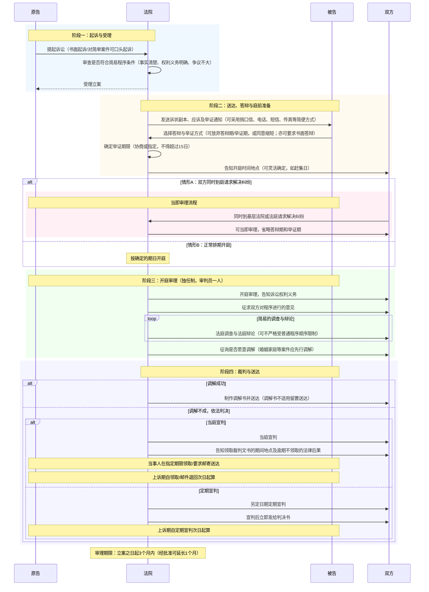

# XI 简易程序与小额诉讼程序

简易程序与小额诉讼程序是第一审程序内部的繁简分流工具。

| 分界   | 简易程序                           | 小额诉讼程序                             |
| ---- | ------------------------------ | ---------------------------------- |
| 程序定位 | 第一审普通程序的简化形态                   | 简易程序中更进一步简化的特殊形态                   |
| 核心功能 | 简单案件便捷审理，同时保留上诉可能              | 小额、简单金钱给付案件快速终局解决                  |
| 审级效果 | 仍适用两审终审原则                      | 实行一审终审                             |
| 适用法院 | 基层人民法院及其派出法庭                   | 基层人民法院及其派出法庭； 海事法院可适用于海事、海商小额案件 |
| 审限   | 立案日起3个月；特殊情况经院长批准延长1个月，累计不超4个月 | 立案日起2个月；特殊情况经院长批准延长1个月             |
| 转化方向 | 不宜继续适用时裁定转为普通程序                | 不宜继续适用时适用简易程序其他规定，或裁定转为普通程序        |

> [!tip]
> 简易程序的考试抓手：`法院层级 + 一审 + 案件简单 + 程序简化 + 可转普通`。
> 小额诉讼的考试抓手：`简单金钱给付 + 标的额门槛 + 一审终审 + 更短期限 + 裁定即时生效`。

---

# 一、繁简分流

## （一）概念

`繁简分流`是根据案件类型、复杂程度和当事人程序选择，在不同案件中配置不同强度的审理程序和司法资源。

- **复杂、重大、争议强的案件**：适用更完整的程序保障，通常进入[[X 第一审普通程序#X 第一审普通程序|普通程序]]。
- **事实清楚、权利义务关系明确、争议不大的简单案件**：适用[[XI 简易程序与小额诉讼程序#二、简易程序|简易程序]]。
- **简单金钱给付且标的额较小的案件**：进一步适用[[XI 简易程序与小额诉讼程序#三、小额诉讼程序|小额诉讼程序]]。

## （二）理念基础

1. `诉讼成本与诉讼收益相适应`：标的额、争议复杂度与程序投入应大体匹配。
2. `保障诉诸司法的权利`：程序简化降低当事人进入法院、参加诉讼和取得裁判的成本。
3. `保护债权和维护交易秩序`：日常、小额、明确的债权纠纷需要更快的终局解决机制。

> [!caution]
> 繁简分流不是单纯压缩当事人程序权利。简化的底线是保留基本程序保障，如陈述意见、合法送达、开庭审理、书记员记录、必要释明等。

---

# 二、简易程序

## （一）概念与制度定位

**简易程序**是`基层人民法院及其派出法庭`审理**简单民事案件**，以及**非简单民事案件**经`当事人双方约定`并`经法院同意后`适用的简便易行的**一审诉讼程序**。

- 法律依据：民事诉讼法第160条至第164条、第170条；民诉法解释第256条至第270条。
- 制度定位：与第一审普通程序并列，属于第一审程序类型；普通程序是完整形态，简易程序是简化形态。
- 审级效果：适用简易程序审结的一审判决，原则上仍可上诉，不是一审终审。

## （二）适用范围

### 1. 适用法院

- 基层人民法院。
- 基层人民法院的派出法庭。

中级人民法院、高级人民法院、最高人民法院审理第一审民事案件，**不适用简易程序**。

### 2. 适用审级

简易程序只适用于**第一审民事案件**。

不适用简易程序的情形：

- 第二审程序
- 审判监督程序
- 发回重审案件

> [!caution]
> 二审中可能出现“独任制”，但这不是“适用简易程序”。中级法院对一审适用简易程序审结或者不服裁定上诉的二审案件，在事实清楚、权利义务关系明确并经双方同意时，可以由审判员一人独任审理；其程序仍是第二审程序。

### 3. 法定适用案件

基层人民法院和其派出法庭审理`事实清楚、权利义务关系明确、争议不大`的简单民事案件，适用简易程序。

| 要件       | 含义                                                   |
| -------- | ---------------------------------------------------- |
| 事实清楚     | 当事人对争议**事实陈述基本一致**， 并能提供相应**证据**，无须法院调查收集证据即可查明事实 |
| 权利义务关系明确 | 能明确区分责任承担者和权利享有者                                     |
| 争议不大     | 当事人对案件`是非`、`责任承担`及`诉讼标的`之争执**没有原则性分歧**               |

### 4. 约定适用案件

基层人民法院和其派出法庭审理前述简单案件以外的民事案件，当事人双方也可以约定适用简易程序。

- **约定适用的对象**：==非简单民事案件==。
- **提出时间**：开庭前。
- **形式**：书面；口头提出的，记入笔录，由双方当事人签名或者捺印确认。
- **生效条件**：经人民法院审查同意。
- **限制**：民诉法解释[[民诉法解释#第二百五十七条|第257条]]列明的不适用简易程序案件，即使当事人约定，法院也不予准许。

### 5. 不适用简易程序的案件

> 多人缺人第三人，重审再审书面审，国益公益不简易

| 类型            | 规则理由                   |
| ------------- | ---------------------- |
| 起诉时被告下落不明     | 简便送达基础不足，且简易程序不适用公告送达  |
| 当事人一方人数众多     | 程序组织复杂，代表人、通知和利益协调负担较重 |
| 发回重审          | 需另行组成合议庭，重审程序保障更强      |
| 适用审判监督程序      | 再审程序独立，不能套用简易程序        |
| 适用特别程序        | 简易程序仍是争讼程序，不能套用非讼程序    |
| 涉及国家利益、社会公共利益 | 利害重大，需更完整审理            |
| 第三人撤销之诉       | 关系生效裁判稳定性，不宜简化         |
| 其他不宜适用简易程序的案件 | 兜底排除                   |

## （三）简易程序“简”在何处

| 简化环节    | 具体规则                                                                             | 底线                                        |
| ------- | -------------------------------------------------------------------------------- | ----------------------------------------- |
| 起诉方式    | 简单案件原告可以口头起诉                                                                     | 法院应准确记录基本信息、联系方式、诉讼请求、事实理由和证据，并由原告核对签名或捺印 |
| 受理与审理衔接 | 双方**可同时**到法院或法庭请求解决纠纷，法院**可当即审理**或另定日期审理                                         | 仍需保障答辩、举证和陈述意见的基本权利                       |
| 传唤与送达   | 可用捎口信、电话、短信、传真、电子邮件等**简便方式**                                                     | 未经当事人确认或无证据证明当事人收到开庭通知的，法院不得缺席判决          |
| 审判组织    | 由`审判员`**一人独任审理**                                                                 | **不能由陪审员独任**；书记员应担任记录                     |
| 审前准备    | 可用简便方式进行                                                                         | 关键事项仍应入卷、记录和告知                            |
| 庭审程序    | 不受[[民事诉讼法#第一百三十九条\|开庭前公告]]、[[民事诉讼法#第一百四十一条\|法庭调查顺序]]、[[民事诉讼法#第一百四十四条\|法庭辩论顺序]]限制 | 仍应开庭审理，不得无依据径行判决                          |
| 审理期限    | 3个月，（本院院长✅）可延长1个月                                                                | 延长后累计不超过4个月（3 + 1 ≤ 4）                    |
| 裁判文书    | 特定情形下可适当简化事实认定或裁判理由                                                              | 判决书、裁定书、调解书必须加盖基层人民法院印章，不得以人民法庭印章代替       |

> [!example] 口头起诉与简便传唤
> 原告请求追索小额货款并能说明交易事实、提供欠条和联系方式，法院可记入口头起诉笔录后，通过电话、短信等方式传唤被告。但若开庭通知没有被告确认，也没有其他证据证明其已经收到，不能据此缺席判决。

## （四）起诉、答辩与送达

> 对比：[[X 第一审普通程序#二、起诉与受理]]

### 1. 起诉

- 对简单民事案件，原告可以**口头起诉**。
- 法院应记录当事人基本信息、联系方式、诉讼请求、事实及理由。
- 证据材料应登记或出具收据。
- 记录内容应向原告宣读或交由核对，确认无误后签名或捺印。

### 2. 答辩

- 双方到庭后：
	- 被告**同意口头答辩**的，法院可以**当即开庭审理**。
	- 被告**要求书面答辩**的，法院应**告知**`提交答辩状期限`和`开庭日期`。
- 法院应说明逾期举证、拒不到庭等法律后果，并由当事人在笔录和送达回证上签名或捺印。

### 3. 送达地址处理

| 情形                                        | 处理                                                             |
| ----------------------------------------- | -------------------------------------------------------------- |
| 原告提供准确送达地址，但法院无法直接送达或留置送达应诉通知书            | 转入普通程序审理                                                       |
| 原告不能提供准确送达地址，法院查证后仍不能确定                   | 可以被告不明确为由裁定驳回起诉                                                |
| ==被告到庭后拒绝提供送达地址和联系方式==                    | 法院告知后仍拒绝的，自然人以`户籍登记住所`或`经常居所`为送达地址； 法人或非法人组织以登记、`备案住所`为送达地址 |
| ==当事人提供地址不准确、送达地址变更未及时告知或拒不提供，导致文书未实际接收== | **邮寄送达**以`邮件回执退回日`视为送达日； **直接送达**以送达人`当场记明情况日`视为送达日         |
| 受领人拒收的                                    | 邀请有关基层组织或所在单位代表见证 →被邀请人不愿到场见证的，诉讼文书留在住所即视为送达                |

## （五）审理前准备

> 对比：[[X 第一审普通程序#三、审理前的准备]]

### 1. 举证期限

- **确定**
	- 简易程序案件举证期限**由法院确定**，也可**由当事人协商一致**并**经法院准许**。
- **举证期限**：不得超过`15日`（对比一审普通程序：不得少于 15 日）
	- 被告要求书面答辩的，法院可在征得其同意基础上合理确定答辩期间。
	- 双方均表示**不需要举证期限、答辩期间的**，==法院可以立即开庭或确定开庭日期==。
- **证人出庭作证申请**应在`举证期限届满前`提出。

### 2. 程序适用异议

当事人就适用简易程序提出异议：

| 审查结论 | 处理 |
| --- | --- |
| 异议成立 | 裁定转为普通程序 |
| 异议不成立 | 裁定驳回；口头裁定的，记入笔录 |

## （六）开庭审理

### 1. 开庭方式

- 当事人可就开庭方式向法院提出申请，由法院决定是否准许。
	- 经双方同意，**可以采用`视听传输技术`等方式开庭**。

### 2. 先行调解案件

适用**简易程序**审理并具备调解可能的案件，以下类型在开庭审理时应当[[VIII 法院调解与诉讼和解#2. 应当先行调解的案件|先行调解]]：

> 亲人邻人合伙人，小钱赔钱血汗钱

1. 婚姻家庭纠纷和继承纠纷。
2. 劳务合同纠纷。
3. 交通事故和工伤事故引起的权利义务关系较为明确的损害赔偿纠纷。
4. 宅基地和相邻关系纠纷。
5. 合伙合同纠纷。
6. 诉讼标的额较小的纠纷。

但根据案件性质和当事人实际情况**不能调解**，或者**显然没有调解必要**的除外。

### 3. 告知与释明

- 对没有委托律师、基层法律服务工作者代理诉讼的当事人，法院可以或应当就回避、自认、举证证明责任等内容作必要解释或说明。
- 开庭前已书面或者口头告知当事人诉讼权利义务，或者当事人各方均委托律师代理诉讼的，审判人员除告知当事人申请回避的权利外，可以不告知当事人其他的诉讼权利义务

### 4. 争点的确定

- 开庭时，审判人员可以根据诉讼请求和答辩意见归纳争议焦点，经当事人确认后围绕焦点举证、质证和辩论。
- 当事人对**案件事实无争议**的，审判人员可以听取`法律适用方面的辩论意见`后**迳行裁判**。

### 5. 庭审次数与笔录

- 简易程序案件==应当一次开庭审结==；
	- 法院认为确有必要的，可以再次开庭。
- 书记员应将全部活动记入笔录：
	- 诉讼权利义务告知、争议焦点概括、证据认定、裁判宣告、
	- 回避、自认、撤诉、和解
	- 当事人当庭陈述的与其诉讼权利直接相关的其他事项等重大事项
- 庭审结束时，审判人员可以根据案件的审理情况对争议焦点和当事人各方举证、质证和辩论的情况进行**简要总结**，并就**是否同意调解**征询当事人的意见

## （七）宣判、送达与裁判文书

### 1. 当庭宣判与送达

- 简易程序案件原则上应当**当庭宣判**。
	- 法院认为不宜当庭宣判的，可以定期宣判。
		- **定期宣判的**，`定期宣判之日`即为**送达之日**；
		- 当事人`无正当理由未到庭`的，**不影响上诉期间计算**。

### 2. 裁判文书简化

有下列情形之一的，判决书、裁定书、调解书的`事实认定`或`裁判理由部分`**可以适当简化**：

> 承认调解，同意涉密

1. 当事人达成调解协议并需要制作民事调解书。
2. 一方当事人明确承认对方全部或部分诉讼请求。
3. 涉及商业秘密、个人隐私，一方要求简化相关内容且法院认为理由正当。
4. 当事人双方同意简化。

> [!caution]
> 裁判文书“可以简化”不等于裁判理由不存在，也不等于庭审可以省略事实审查、质证和法律适用说明。简化的是文书表达成本，不是审判正当性。

## （八）简易程序向普通程序转化

### 1. 转化方式

| 启动方式 | 规则                                                               |
| ---- | ---------------------------------------------------------------- |
| 依申请  | 当事人就适用简易程序提出异议： → 法院审查成立的，裁定转为普通程序。 → 异议不成立的，口头告知当事人并记入笔录。 |
| 依职权  | 法院审理中发现案件不宜适用简易程序的，裁定转为普通程序                                      |

### 2. 转化规则

- 转为普通程序的，法院应将`合议庭组成人员`及`相关事项`**书面通知**双方当事人。
- 转为普通程序前，**双方已确认的事实**，可以`不再举证、质证`。
- 转入普通程序后，审理期限自`人民法院立案之日`起计算。
- 已经按照普通程序审理的案件，开庭后**不得转为简易程序审理**。

> [!tip]
> 简易程序与普通程序不是“前置/后置”关系，而是第一审程序中的并列类型。简易程序可以转为普通程序；普通程序开庭后不得转为简易程序。

---

# 三、小额诉讼程序

## （一）概念与制度定位

**小额诉讼程序**是基层人民法院及其派出法庭审理事实清楚、权利义务关系明确、争议不大的**简单金钱给付**案件，且**标的额符合法定标准时**适用的**一审终审程序**。

- **制度定位**：不是与普通程序、简易程序完全并列的第三种一审程序，而是简易程序中的更简化形态。
- **核心特殊性**：==一审终审==，禁止普通上诉救济。

## （二）设立初衷

小额诉讼程序的基本张力是`效率 VS 司法福利`。

| 价值   | 内容                             |
| ---- | ------------------------------ |
| 效率   | 标的额较小、事实法律关系简单的案件，不宜投入完整两审程序成本 |
| 司法福利 | 降低日常纠纷解决成本，使小额债权更容易获得司法实现      |
| 程序风险 | 一审终审压缩上诉利益，必须通过适用范围限制和程序告知加以平衡 |

## （三）适用范围

![[小额诉讼程序.png]]

### 1. 法定适用案件

基层人民法院和其派出法庭审理以下案件，适用小额诉讼程序，实行一审终审：

1. 【简易程序】事实清楚、权利义务关系明确、争议不大。
2. **简单金钱给付**民事案件。
3. **标的额**为各省、自治区、直辖市`上年度就业人员年平均工资`（社平）50%以下。

海事法院可以适用小额诉讼程序审理海事、海商案件，标的额`以实际受理案件的海事法院或其派出法庭所在地`上一年度就业人员年平均工资（社平）为基数计算。

### 2. 约定适用案件

1. 事实清楚、权利义务关系明确、争议不大
2. **限于金钱给付**
3. 标的额：

基层人民法院和其派出法庭审理前述简单金钱给付案件，标的额**超过**上一年度就业人员年平均工资50%，**但在2倍以下的**，当事人双方**也可以约定适用**小额诉讼程序。

> [!caution]
> 小额诉讼的约定适用不是任意扩张：案件仍须属于简单金钱给付案件，只是标的额从法定强制适用区间扩张至50%以上、2倍以下。

### 3. 不适用小额诉讼程序的案件

| 类型                     | 排除理由                     |
| ---------------------- | ------------------------ |
| 人身关系、财产确权案件            | 争议对象通常不是单纯金钱给付，且权利确认利益较重 |
| 涉外案件                   | 程序复杂度和送达、法律适用问题较多        |
| 需要评估、鉴定，或对诉前评估、鉴定结果有异议 | 事实查明成本较高，不适合快速终局         |
| ==一方当事人下落不明==          | 送达与程序参与保障不足              |
| ==当事人提出反诉==            | 争议结构扩大，可能突破小额案件范围        |
| ==其他不宜适用小额诉讼程序的案件==    | 兜底排除                     |

## （四）小额诉讼程序的特殊规则

### 1. 小额诉讼：审理方式

- 可以==一次开庭审结==并且**当庭宣判**（与简易程序保持一致）
- 当事人到庭后表示不需要举证期限和答辩期间的，法院可以立即开庭审理。
- 小额诉讼没有特别规定的，**适用简易程序其他规定**。

### 2. 小额诉讼：审理期限

> 2 + 1
> 对比：简易程序（3 + 1 ≤4）

- 应当在立案之日起2个月内审结。
- 有特殊情况需要延长的，经本院院长批准，可以延长1个月。

### 3. 小额诉讼：举证期限与答辩期间

| 事项     | 规则                                        |
| ------ | ----------------------------------------- |
| 举证期限   | 法院确定，或当事人协商一致并经法院准许；**一般不超过7日**（简易： 15 日） |
| 书面答辩期间 | 被告要求书面答辩的，法院可在征得其同意基础上合理确定，**但最长不超过15日**  |
| 放弃期间   | 当事人到庭后表示不需要举证期限和答辩期间的，**法院可立即开庭**         |

### 4. 小额诉讼：程序告知

法院受理小额诉讼案件，应告知当事人：

- 审判组织。
- 一审终审。
- 审理期限。
- 诉讼费用交纳标准。
- 其他与小额诉讼程序相关的事项。

### 5. 小额诉讼：管辖权异议与驳回起诉

| 事项    | 规则                                 |
| ----- | ---------------------------------- |
| 管辖权异议 | 法院应作出裁定；**裁定一经作出即生效**              |
| 驳回起诉  | 受理后发现不符合起诉条件的，裁定驳回起诉；**裁定一经作出即生效** |

> [!caution] 简易程序也是争讼程序，也要有最基本的程序保障，但：
> 普通程序、简易程序中的管辖权异议裁定和驳回起诉裁定通常具有上诉可能；小额诉讼程序中这两类裁定一经作出即生效，原因在于其一审终审的制度定位。
>
> 连小额诉讼案件本身的判决都不可能上诉，这两类裁定更不可能

### 6. 小额诉讼：裁判文书

小额诉讼案件的裁判文书可以简化，主要记载：

- 当事人基本信息。
- 诉讼请求。
- 裁判主文。

> [!tip] 小额诉讼文书比简易程序文书更进一步简化
> - `简易程序`是“**事实或理由部分可以适当简化**”
> - `小额诉讼`是“**主要记载当事人、请求和主文**”。

## （五）小额诉讼向简易、普通程序转化

### 1. 转化方式

| 启动方式 | 处理                                             |
| ---- | ---------------------------------------------- |
| 依职权  | 法院发现案件不宜适用小额诉讼程序的， 应适用简易程序的其他规定审理，或裁定转为普通程序 |
| 依申请  | 当事人认为`适用小额诉讼程序违反法律规定的`，**可以提出异议**              |

当事人提出异议后：

- **异议成立**：适用简易程序其他规定审理，或裁定转为普通程序。
- **异议不成立**：裁定驳回。
- 对按照小额诉讼案件审理的异议应**在开庭前提出**。

### 2. 程序特则

- 因`增加或变更诉讼请求`、`提出反诉`、`追加当事人`等，导致**案件不符合小额诉讼条件**的
	- 应适用**简易程序其他规定**审理。
	- 应当适用普通程序审理的，**裁定转为普通程序**。
- 【自认】转入简易程序的其他规定或普通程序前，**双方已确认的事实**，**可以不再举证、质证**。

## （六）小额诉讼的救济

- 小额诉讼裁判实行**一审终审**，不得提起普通上诉。
	- 对小额诉讼案件的判决、裁定，当事人仍可依法**申请再审**。
		- 一般再审事由成立并作出再审判决、裁定的，当事人不得上诉；
		- 以“`不应按小额诉讼案件审理`”为由申请再审且理由成立的，再审判决、裁定可以上诉。

---

# 四、简易程序、小额诉讼程序与普通程序的关系

## （一）普通程序与简易程序

| 问题   | 规则                                                      |
| ---- | ------------------------------------------------------- |
| 适用审级 | 二者均属第一审程序类型，简易程序不是普通程序前置程序                              |
| 适用法院 | 普通程序适用于各级法院的一审案件；简易程序限于基层法院及其派出法庭                       |
| 保障强度 | 普通程序更完整；简易程序更灵活、便捷                                      |
| 审判组织 | 普通程序通常合议，但基层普通程序[[IV 民诉法的基本制度#三、独任制\|可独任]]；简易程序由审判员一人独任 |
| 审限   | 普通程序通常6个月；简易程序通常3个月，可延长1个月                              |
| 转化   | 简易程序可转普通程序；普通程序开庭后不得转简易程序                               |

## （二）简易程序与小额诉讼程序

| 问题     | 简易程序                | 小额诉讼程序               |
| ------ | ------------------- | -------------------- |
| 共同基础   | 简单案件、基层法院或派出法庭、程序简化 | 同左，且限于简单金钱给付并满足标的额标准 |
| 是否一审终审 | 否                   | 是                    |
| 举证期限   | 不超过15日              | 一般不超过7日              |
| 答辩期间   | 可合理确定               | 最长不超过15日             |
| 审限     | 3个月，可延长1个月          | 2个月，可延长1个月           |
| 文书简化   | 特定情形下适当简化事实或理由      | 主要记载主体、请求和主文         |
| 程序补充   | 无特别规定时适用普通程序通则      | 无特别规定时先适用简易程序其他规定    |

> [!tip]
> 判断小额诉讼时先过三关：是否基层或其派出法庭、是否简单金钱给付、是否落入标的额标准。任一关不满足，通常不能进入小额诉讼程序。

---

> [!caution] 常见误区
> - 简易程序不是一审终审，小额诉讼程序才是一审终审。
> - 小额诉讼不是所有小标的案件都适用，还要求简单金钱给付并排除法定不适用类型。
> - 简易程序案件仍须开庭审理，不能因“简易”而省略庭审。
> - 人民法庭制作裁判文书应加盖基层人民法院印章，不得以人民法庭印章替代。
> - 发回重审、审判监督程序案件不得适用简易程序。
