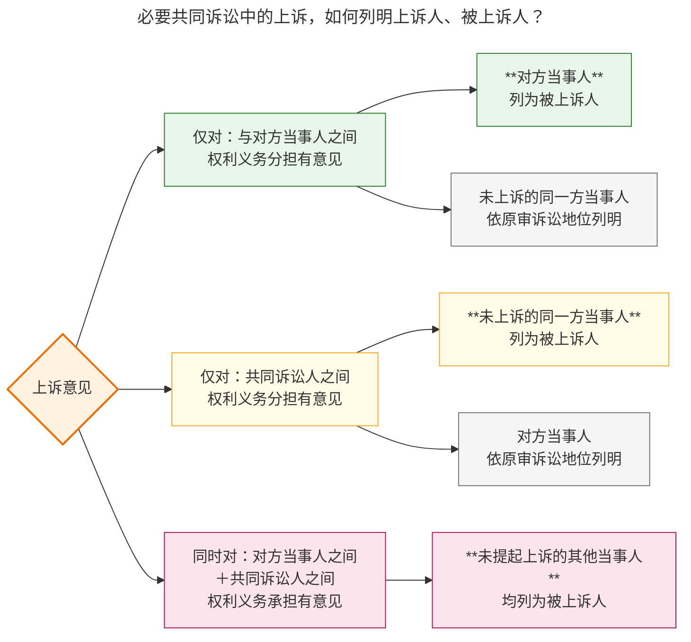
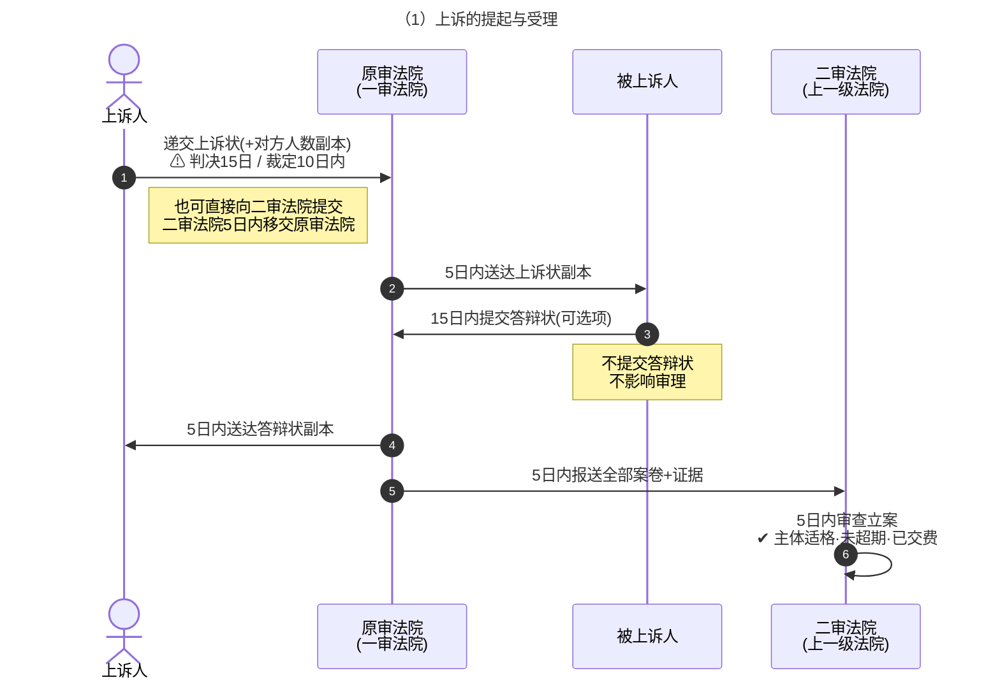
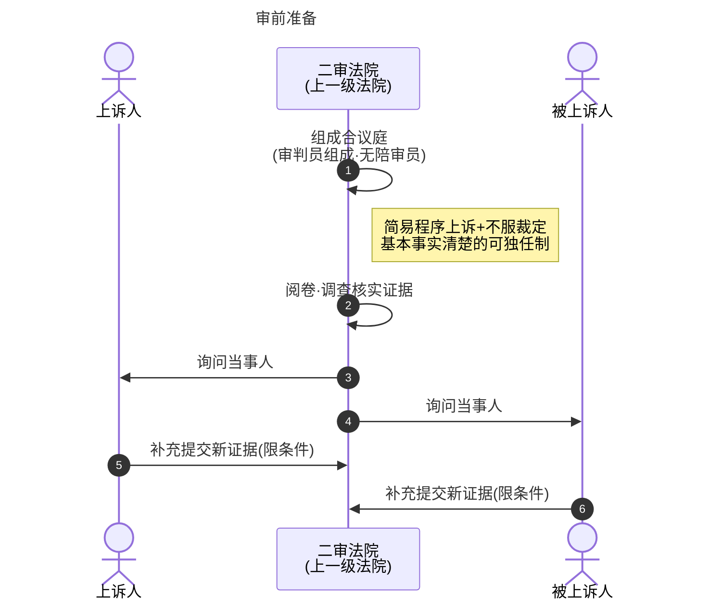
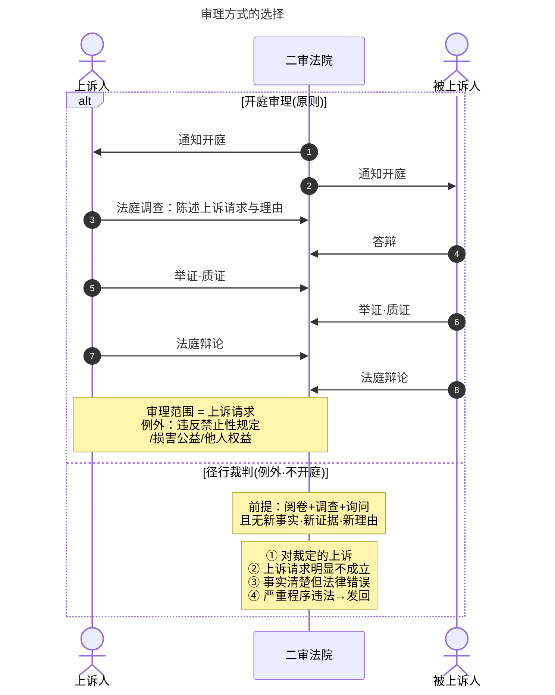
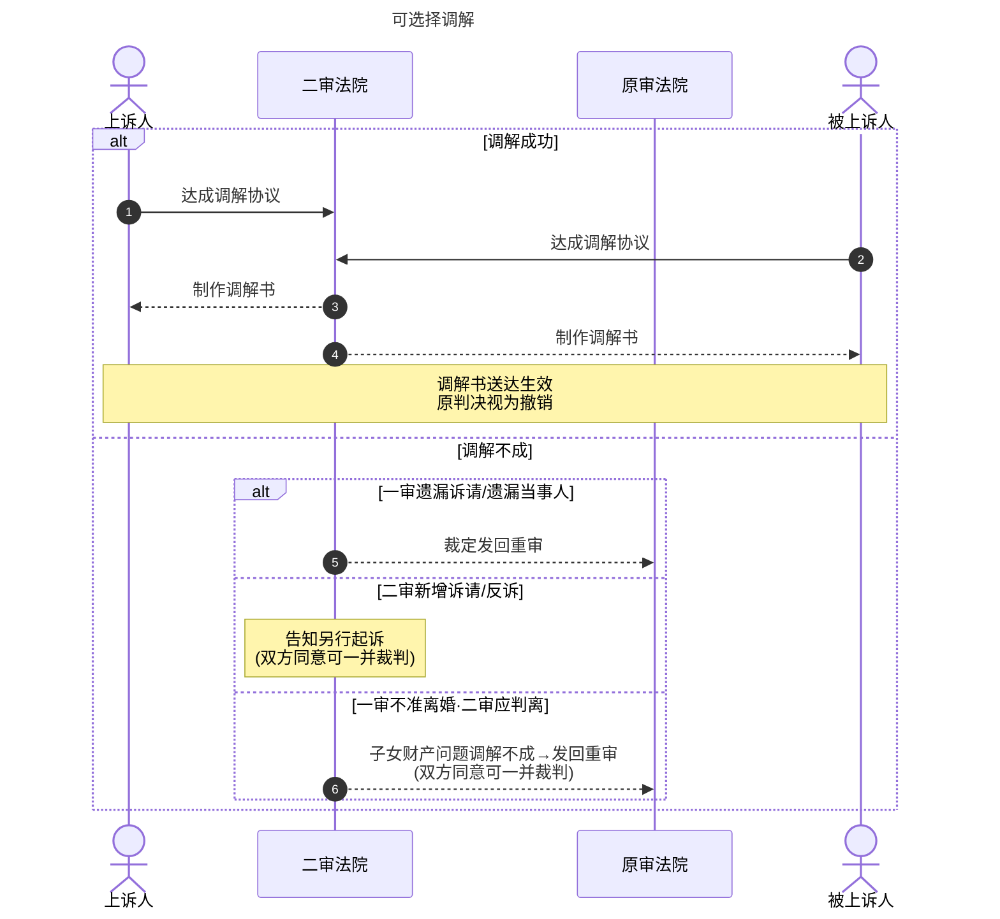
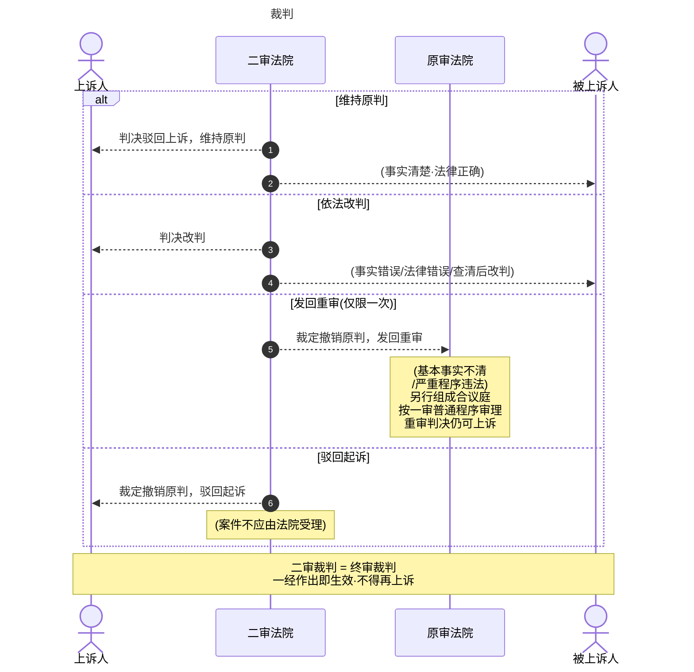

# XII 第二审程序


| 子概念      | 别称    | 核心特征                                                                                                        | 代表法域              |
| -------- | ----- | ----------------------------------------------------------------------------------------------------------- | ----------------- |
| **复审制**  | 覆审制   | 二审完全重新审理，不受一审诉讼资料约束，可自由提出新事实和新证据                                                                            | 我国旧制、中国古代"断狱"     |
| **事后审制** | 事后复审制 | 二审仅审查一审判决有无错误，以一审封闭的诉讼资料为限，不允许提出新事实和新证据                                                                     | 奥地利、美国上诉审、德日第三审   |
| ==续审制==  | 折中制   | 二审是一审的延续，以`一审资料`为基础，但在一定条件下允许`提出新的攻击防御方法`（允许`新的诉讼与证据资料`与一审的相结合）<br>→ 一审诉讼行为在二审仍有拘束力[^1]<br>→ 当事人可以提出新证据[^2] | 德国第二审、日本第二审、我国现行制 |
```
上诉审与一审的关系（上诉审审理模式）
├── 复审制（完全脱离一审，重新来过）
├── 事后审制（完全依赖一审，封闭审查）
└── 续审制（折中：承续一审 + 有条件地允许更新）
```

**第二审程序**是当事人不服**一审未生效裁判**，向**上一级法院**提起上诉，由**上一级法院**进行审理的诉讼程序。复习主线是抓住`上诉启动 -> 受理移送 -> 审理裁判 -> 特殊问题`的递进结构，并与一审普通程序对比把握两审关系。

| 程序节点  | 核心问题       | 复习关键词                                   |
| ----- | ---------- | --------------------------------------- |
| 上诉的提起 | 上诉能否成立     | 实质条件（可上诉的判决/裁定）、形式条件（主体/期间/上诉状）         |
| 上诉的受理 | 案件如何进入二审法院 | 上诉状提交、送达、答辩状、报送原审法院、二审立案                |
| 二审审理  | 二审如何审查一审   | 审判组织（合议庭）、审理范围（上诉范围+例外）、审理方式（开庭为原则）、新证据 |
| 二审裁判  | 二审如何终结程序   | 驳回上诉维持、改判、发回重审、驳回起诉、移送管辖                |
| 特殊问题  | 二审中的特殊程序处理 | 撤回起诉、撤回上诉、禁止不利变更、二审反诉、附带上诉              |

> [!tip]
> 考试权重集中在`上诉条件`和`二审裁判`两端。前者考程序入口（哪些裁判可以上诉、谁可以上诉、上诉期间），后者考程序出口（对判决/裁定的五种处理方式及适用条件）。特殊问题中`禁止不利变更原则`为高频考点。

---

# 一、第二审程序概述

## （一）概念

第二审程序，是当事人不服`一审法院作出的未生效裁判`，依法向`上一级法院`提起上诉，上一级法院据此对案件进行审理所适用的诉讼程序。

| 要素 | 内容 |
| --- | --- |
| 主体 | 当事人（上诉人）+ 上一级法院（二审法院） |
| 对象 | 一审未生效裁判 |
| 启动方式 | 当事人提起上诉 |
| 审理程序 | 二审程序 |
| 行为性质 | 上诉是当事人的诉讼行为，审理是法院的审判行为 |

## （二）意义与目的

| 角度   | 意义                                 |
| ---- | ---------------------------------- |
| 当事人  | 纠正一审错误裁判，维护自身合法权益                  |
| 法院   | 维护国家利益、维护司法权威、统一法律适用、保障当事人权益       |
| 国家   | 监督下级法院审判工作，落实审级制度                  |
| 制度综合 | 纠正错误 + 吸收不满 + 统一法律适用 + 避免讼累 + 落实审级 |

## （三）一审 vs. 二审

| 维度     | 一审            | 二审                   |
| ------ | ------------- | -------------------- |
| 程序性质   | 初审            | 上诉审                  |
| 启动原因不同 | 诉权            | 上诉权                  |
| 启动方式   | 起诉            | 上诉                   |
| 审判组织   | 普通程序可独任制或合议庭  | 必须合议庭，不得独任制          |
| 审理范围   | 诉讼请求范围        | 上诉请求范围（公益例外）         |
| 审理方式   | 开庭审理          | 开庭审理为原则              |
| 裁判种类   | 判决/裁定/决定      | 判决/裁定（驳回上诉、改判、发回重审等） |
| 撤诉效果   | 一般可再起诉        | 撤回起诉后不得再起诉           |
| 裁判效力   | 未确定判决（小额判决除外） | 确定判决                 |

---

# 二、上诉的提起——二审启动

## （一）上诉的概念

**上诉**，是当事人对一审未生效裁判不服，在法定期间内向上一级法院声明不服并要求审理的诉讼行为。上诉权是当事人享有的程序性救济权利，上诉行为是启动二审程序的唯一途径。

## （二）上诉的条件

### 1. 实质条件

#### （1）上诉主体适格

1. **当事人**作为上诉人和被上诉人
	- 当事人有权提起上诉
	- **双方当事人和第三人都提起上诉的**，**均列为上诉人**
		- 法院依职权确定二审中当事人的诉讼地位

2. [[VII 多数人诉讼#二、普通共同诉讼|普通共同诉讼]]中的上诉人和被上诉人
	- [[VII 多数人诉讼#3. 普通共同诉讼人：独立性|诉讼行为独立]]
		- 仅有`一人`或`数人`提起上诉的，`其余人`不属于上诉人**或被上诉人**

3. [[VII 多数人诉讼#三、必要共同诉讼|必要共同诉讼]]中的上诉人和被上诉人
	- 上诉仅对：
		- **与对方当事人之间权利义务分担**有意见，不涉及其他共同诉讼人利益的
			- **被上诉人**：`对方当事人`为被上诉人
			- `未上诉的同一方当事人`依原审诉讼地位列明
		- **共同诉讼人之间权利义务分担**有意见，不涉及对方当事人利益的
			- **被上诉人**：`未上诉的同一方当事人`为被上诉人
			- `对方当事人`依原审诉讼地位列明
		- **对方当事人之间** $\land$ **共同诉讼人之间权利义务承担**有意见
			- **被上诉人**：`未提起上诉的其他当事人`均为被上诉人



4. [[VII 多数人诉讼#二、有独立请求权第三人|有独三]]作为上诉人和被上诉人
	- 有权**作为上诉人**，以本诉的双方或一方为被上诉人
	- 可以**成为被上诉人**

5. [[VII 多数人诉讼#三、无独立请求权第三人|无独三]]作为上诉人和被上诉人
	- **被判决承担责任**的无独三：可以成为**上诉人**
	- **未被判决承担责任**的无独三：可以作为**被上诉人**，但**不能作为上诉人**

6. **无/限行民作为上诉人和被上诉人**
	- 法定代理人代理当事人提起上诉

7. **上诉案件的当事人死亡或终止的
	- 通知权利义务承继者参加，此时[[X 第一审普通程序#2. 中止诉讼：情形|诉讼中止]]

8. **上诉案件作为当事人的法人或其他组织分立、合并的**
	- [[VI 当事人和诉讼代理人#（三） 法人|分立]]：直接将分立后的法人/非法人组织列为**共同诉讼人**
	- 合并：合并后的法人/非法人组织列为**当事人**

#### （2）上诉利益

> [!note] 上诉利益
> 上诉人可以对一审判决申明不服（上诉），当且仅当——**该判决对其造成了不利益**。
>
> 不服申请不具有不利益的场合，上诉将被驳回，因其不具有合法性。

##### 形式不服说（通说）

- **核心观点**：将一审中当事人的申请事项（诉讼请求或防御主张）与判决主文进行比较，若==判决主文所赋予的利益少于其申请事项==，则认定当事人具有上诉利益。
- **判断标准**：以“形式上的不利益”为准，即从判决主文的外观判断是否与申请不一致。
- **优点**：标准清晰、易于操作。
- **例外情形**：形式不服说无法贯彻到底，需承认若干例外，例如：
    - **被告因预备性抵销抗辩获全部胜诉**：形式上无不利，但因牺牲了反对债权，实质上不利益，故肯定上诉利益。
    - **人事诉讼中被告欲提反诉**：如离婚诉讼中，被告即使一审胜诉，为提反诉仍应肯定上诉利益。
    - **部分请求情形**：若否定部分请求另诉可能，原告虽形式上全部胜诉，但对剩余额度仍有上诉利益。
- **局限**：这些例外表明形式标准有时不能反映实质不利益，需其他学说补充。

|  原告诉讼请求   | 原告是否有上诉利益 | 被告是否有上诉利益 |
| :-------: | :-------: | :-------: |
|  全部得到支持   |     ❌     |     ✅     |
|   全部被驳回   |     ✅     |     ❌     |
| 部分支持、部分驳回 |     ✅     |     ✅     |

##### 旧实体法不服说

- **核心观点**：==只要==上诉人==通过上诉审可能获得比原判决实质上更为有利的判决==，即应认定其具有上诉利益。
- **理论依据**：上诉审为**续审制**，为扩张诉讼请求范围应允许上诉。该说侧重于实体结果的改善可能性。
- **缺陷**：几乎无法提供明确、可操作的判断标准。因为通常当事人提起上诉总是期望获得某种有利结果，若以此为标准，几乎所有上诉皆具利益，导致标准虚化。因此，该说如今支持者寥寥。

##### 新实体法不服说

- **核心观点**：应从上诉所获利益与原判决确定后产生的判决效力之间的关系来判断是否具有上诉利益。若==判决效力（如既判力、拘束力等）导致某些请求或主张事后无法通过另诉等方式获得救济，则肯定上诉利益==；反之，若不影响事后救济，则否定上诉利益。

- **理论优势**：能巧妙说明形式不服说难以涵盖的例外情形。例如：
    - 预备性抵销抗辩的胜诉判决，因既判力约束使被告无法另诉主张抵销，故有上诉利益。

    - 离婚反诉受禁止另诉限制，故有上诉利益。

    - 部分请求受既判力等效力限制无法另诉剩余额度，故有上诉利益。

    - 而对于一般的请求追加变更，因不影响另诉可能，故无上诉利益。

- **与形式不服说的关系**：新实体不服说虽具理论优势，但在被告针对驳回诉的判决上诉请求驳回诉讼请求等情形下，单纯依据该说无法说明（因驳回诉的确定判决不禁止另诉）。因此，当前多数见解认为，应**以形式不服说为基础，以新实体不服说为辅助**，兼顾标准的明确性与实质的妥当性。

### 1. 形式条件

#### （1）上诉主体——上诉人与被上诉人

- **上诉人**：提起上诉的当事人，须为一审判决中受有不利益的一方。
- **被上诉人**：上诉人在一审中的对方当事人。
- 必要共同诉讼中，根据上诉请求所指向的对象确定被上诉人；未提起上诉也未被动承受上诉的，按原审地位列明。


#### （2）向上一级法院上诉

- 向一审法院**直接上一级**法院提起（复习：[[V 法院主管和管辖#九、管辖恒定|级别管辖恒定]]）
- 飞跃上诉的除外
	- 最高法知产庭


#### （3）上诉期间

| 裁判类型 | 上诉期间 |
| --- | --- |
| 判决 | 判决书送达之日起15日 |
| 裁定 | 裁定书送达之日起10日 |
文书不能同时送达的，上诉期间从各自收到判决、裁定起计算。

上诉期间为**法定不变期间**，逾期不提起上诉的，一审裁判发生法律效力。

#### （4）上诉状

上诉必须提交上诉状，**口头上诉无效**。上诉状应当通过原审法院提出，也可以直接向二审法院提出。

虽递交上诉状，但**未在指定期限内缴纳上诉费**的，**按自动撤回上诉处理**。

> [!caution]
> 上诉必须提交上诉状，区别于**起诉可以口头提起**。

#### （5）可上诉的判决和裁定

上诉对象为判决和裁定，但并非所有判决和裁定均可上诉。

**（1）可以上诉的判决**

| 类型       | 说明          | 期限   |
| -------- | ----------- | ---- |
| 一审普通程序判决 | 原则上均可上诉     | 15 日 |
| 简易程序判决   | 可上诉，但小额诉讼除外 | 15 日 |

**（2）不得上诉的判决**

| 类型 | 原理 |
| --- | --- |
| 最高人民法院一审判决 | 终审判决，不得上诉 |
| 确认婚姻无效的一审判决 | 身份关系涉及公共利益，不允许当事人合意排除上诉救济 |
| 确认/变更/消灭身份关系的判决 | 双方合意适用二审程序且不损害公共利益的，可适用二审程序审理，但不属于"上诉" |

**（3）可以上诉的裁定**

| 类型 | 上诉期间 |
| --- | --- |
| 不予受理 | 10日 |
| 管辖权异议 | 10日 |
| 驳回起诉 | 10日 |

三类裁定之外的其他裁定，不得上诉。

> [!tldr] 以下案件不得上诉
> - 最高法一审的民事案件
> - 小额诉讼案件
> - 非讼程序案件（特别程序、督促程序、公示催告程序）
> - 调解书结案的案件
> - 一般的裁定书

## （三）上诉的撤回

上诉的撤回，是上诉人在二审法院受理上诉后、作出裁判前，向二审法院申请撤回上诉的诉讼行为。

**不准撤回上诉的情形：**

- 一审判决确有错误
- 当事人之间恶意串通损害国家利益、社会公共利益或他人合法权益

**撤回上诉的法律效果：**

- 二审程序终结
- 一审裁判发生法律效力
- 不得就同一上诉请求再次提起上诉（上诉权已用尽）

---

# 三、上诉的受理——二审前程序



| 步骤       | 内容                                     |
| -------- | -------------------------------------- |
| 1. 提交上诉状 | 当事人**向原审法院**提交上诉状（也**可直接向二审法院**提交[^3]） |
| 2. 送达    | 原审法院将上诉状副本送达被上诉人                       |
| 3. 提交答辩状 | 被上诉人在收到上诉状副本后`15日`内提交答辩状               |
| 4. 报送    | 原审法院将`上诉状、答辩状及全部案卷材料`报送二审法院            |
| 5. 二审立案  | 二审法院收到报送材料后` 5日`内进行立案登记                |

> [!caution] 保全的作出
> - 必须保全措施的，由**一审法院**依当事人申请或者依职权采取。
> - 一审法院**裁定保全**的，应当**及时报送二审法院**

> [!caution] 一审宣判后，原审法院发现判决错误
> - **当事人提出上诉的**：原审法院可以提出`原判决有错误`的意见，报送报送二审法院按照二审程序审理
> - **当事人不上诉的**：按照`审判监督程序`处理

> [!tip]
> 报送和立案标志着案件从一审法院转移到二审法院，二审程序正式开始。


## 上诉的效力

- **遮断效**：阻却一审判决的确定，使一审判决不发生效力
- **上诉不可分**：无论当事人上诉范围如何，一审判决整体上不发生法律效力

---

# 叁、上诉程序概览











---

# 四、第二审案件的审理

## （一）审判组织

| 项目         | 规则                                                                             |
| ---------- | ------------------------------------------------------------------------------ |
| 组织形式       | 【原则】必须组成==合议庭==，不得适用独任制<br>【例外】简易程序审结/不服裁定的上诉（事实清楚、权义明确、争议不大的）经双方当事人同意，可以适用独任制 |
| 人数         | 合议庭由**审判员**组成，人数为奇数（通常三人）                                                      |
| 开庭审        | 原则方式                                                                           |
| 不开庭审（径行裁判） | 例外方式                                                                           |

## （二）审理范围

**原则：** 二审法院围绕**上诉请求**的`有关事实`和`法律适用`进行审查。当事人不告不理。

**例外：** 一审判决违反法律禁止性规定，或者侵害国家利益、社会公共利益、他人合法权益的，==二审法院可超越上诉请求范围进行审查==。

> [!tip]
> 审理范围体现`不告不理`在二审的延伸——上诉请求划定边界，但涉及公益或重大违法时不受此限制。

## （三）审理地点

| 地点 | 说明 |
| --- | --- |
| 本院 | 二审法院法庭，通常方式 |
| 案件发生地 | 便民或便于查清事实 |
| 原审法院所在地 | 兼顾卷宗调阅与当事人参与 |

## （四）审理方式

**原则：** 开庭审理。

**例外——不开庭审理（径行裁判）：** 同时满足：
1. 没有提出新的事实、证据或理由
2. 合议庭认为不需要开庭审理

> [!cite] 二审法院对下列上诉案件，可以不开庭审理：
> 1. **不服裁定**（不予受理、驳回起诉、管辖权异议）
> 2. 当事人提出的**上诉请求明显不能成立**
> 3. 原判决裁定**认定事实清楚**，==但适用法律错误的==
> 4. 原判决**严重违反法定程序**，==需要发回重审的==

> [!caution]
> 径行裁判不等于书面审——合议庭仍需进行阅卷、调查、询问当事人等审理活动，只是不举行正式开庭。

## （五）审理期限

| 审理期限   | 判决        | 裁定        |
| ------ | --------- | --------- |
| 立案之日起  | 3 个月      | 30 日内     |
| 特殊情况延长 | 经本院院长批准+N | 经本院院长批准+N |

> [[X 第一审普通程序#1. 审理期限|普通程序的审理期限]]：6 + 6 + N
> [[XI 简易程序与小额诉讼程序#2. 小额诉讼：审理期限|简易程序]]：简易 3 + 1 ≤ 4；小额 2 + 1
> 二审程序：3 + N；30d + N

## （六）证据——新证据

### 1. 概念

二审新证据，是一审程序终结后、二审程序进行中，当事人向二审法院提交的未在一审中作为裁判基础的证据材料。

### 2. 类型

| 类型       | 情形                          |
| -------- | --------------------------- |
| 新发现的证据   | 一审庭审结束前已存在，一审庭审结束后才发现       |
| 新取得的证据   | 一审庭审结束前已发现，但因客观原因无法在举证期限内提供 |
| 新质证的证据   | 一审中已提供，但一审法院未组织质证且未作为裁判依据   |
| 新形成的证据   | 一审庭审结束后新形成                  |
| 对方未提供的证据 | 一审中对方持有但未提供，且申请法院调取后未调取     |

> [!caution]
> 逾期举证的，法院可责令说明理由；拒不说明或理由不成立的，可不予采纳或采纳但予以训诫、罚款。

---

# 五、上诉案件的调解

## （一）概念

上诉案件的调解，是二审程序中，在法院主持下当事人就争议达成协议以终结诉讼的制度。
- 调解达成协议，**应当制作调解书**

> [!danger] 二审必须制作调解书

## （二）调解书生效

调解书经双方当事人签收后（送达）即发生法律效力，**一审判决视为被撤销**。

## （三）调解结案

二审调解结案不产生上诉审裁判效力；调解书生效后，原审裁判自动失效，当事人不得就同一争议再行上诉。

## （四）二审中调解的情形

1. **遗漏诉讼请求**：自愿调解；调解不成，发回重审。
2. **遗漏必须参加诉讼的当事人、有独三**：自愿调解；调解不成，发回重审。
3. **当事人新增诉讼请求、反诉**：
	1. 就新增诉讼请求或反诉自愿进行调解；调解不成，告知当事人另行起诉
	2. ==双方同意二审一并审理的==，可由二审一并裁判
4. **离婚案件**
	-  一审判决不准离婚的案件，二审认为应当判决离婚的
		- 自愿就子女抚养、财产问题一并调解；调解不成，发回重审
		- ==双方同意二审一并审理的==，可由二审一并裁判
5. **和解协议**
	- 当事人在二审中达成和解协议的，二审法院可根据当事人请求：
		- 对双方达成的和解协议进行审查并制作[[VIII 法院调解与诉讼和解#2. 调解书|调解书]]送达当事人（[[VIII 法院调解与诉讼和解#五、诉讼和解|依申请制作调解书]]）

---

# 六、上诉案件的裁判

## （一）对判决的处理

| 裁判方式       | 适用条件                                            | 裁判形式 |
| ---------- | ----------------------------------------------- | ---- |
| 驳回上诉，维持原判  | 原判决认定事实清楚，适用法律正确；<br>**事实/法律有瑕疵但结果正确的，纠正瑕疵后维持** | 判决   |
| 依法改判、撤销或变更 | 原判决认定**事实错误** ∨ **适用法律错误** ∨ **基本事实不清（查清后改判）**  | 判决   |
| 撤销原判，发回重审  | 基本事实不清 ∨ 严重违反法定程序[^6]                           | 裁定   |
| 撤销原判，驳回起诉  | 案件依法不应由人民法院受理                                   | 裁定   |
| 撤销原判，移送管辖  | 一审受理案件**违反专属管辖规定**                              | 裁定   |

> [!caution] 改判与发回重审的区分
> - **改判：** 二审法院直接纠正——法律适用错误和事实认定错误均可改判。
> - **发回重审：** 原判决基本事实认定不清，或严重违反法定程序[^6]（如遗漏当事人、违法缺席判决等）。
> 	- **发回重审后，二审法院不得再次发回重审**（发回重审禁止反复原则）。
> - 事实不清时，二审法院可自行查清事实后改判，也可发回重审。

## （二）对裁定的处理

对裁定的上诉一律使用裁定：

| 原裁定类型                | 二审处理方式             | 条件         | 裁判形式 |
| -------------------- | ------------------ | ---------- | ---- |
| **不予受理**裁定有错误        | 撤销原裁定，指令一审**立案受理** | 符合起诉条件     | 裁定   |
| **驳回起诉**裁定有错误        | 撤销原裁定，指令一审**审理**   | 符合起诉条件     | 裁定   |
| **管辖权异议**裁定，上诉请求不成立  | 驳回上诉，维持原裁定         | 上诉请求不成立    | 裁定   |
| **管辖权异议**裁定 + 违反专属管辖 | 撤销原裁定，移送有管辖权法院     | 一审违反专属管辖规定 | 裁定   |
| 其他裁定（事实/法律错误）        | 撤销原裁定，依法改判/撤销/变更   | 民诉法§177-2  | 裁定   |

## （三）再次发回重审禁止

一审法院对==发回重审案件==作出判决后，**当事人再次提起上诉的**，**二审法院不得再次发回重审**，应自行作出裁判。

## （四）二审裁判的宣判与效力

二审法院可以自行宣判，也可以委托原审法院或当事人所在地法院代行宣判（中院甚至高院可能离当事人很远）。

1. **不得再行上诉**，只得申请再审
2. **不得重复起诉**
	- 例外：判决不准离婚、调解和好的离婚案件、判决维持收养关系的案件，调解维持收养关系的案件除外。
3. 对于给付之诉：**依法产生强制执行力**

---

# 七、第二审程序的特殊问题

## （一）撤回起诉

**法条依据：** 民诉法解释第336条。

二审程序中，原审原告可申请撤回起诉，须同时满足：

- 其他当事人同意
- 不损害国家利益、社会公共利益、他人合法权益

准许撤诉的，==应当一并裁定撤销一审裁判==。[^7]

撤回起诉后，不得就同一诉讼请求再次起诉。


> [!caution]
> 二审撤回起诉与一审撤诉效果不同：
> - 一审撤诉后可同一请求再起诉（除离婚六个月限制等），
> - ==二审撤回起诉后禁止重复起诉==。

## （二）撤回上诉

**法条依据：** 民诉法第180条。

上诉人撤回上诉的，由二审法院裁定是否准许。撤回上诉后，一审裁判发生法律效力。

> [!note] 撤回上诉的要件
> - [ ] **主体**：上诉人（处分原则）
> - [ ] **对象**：二审法院
> - [ ] **时间**：二审宣判前作出
> - [ ] 是否准许撤诉，**由二审法院裁定**
> 	- 不应准许：法院认为一审裁判确有错误、当事人恶意串通损害国益公益他益的
> 	- 应予准许：因和解申请撤诉，经审查符合撤诉条件。

> [!caution] 撤回上诉 vs 撤回起诉
> - **撤回上诉：** 上诉人放弃上诉，一审裁判生效。
> - **撤回起诉：** 原审原告撤回整个诉，一审裁判被撤销，但不得重复起诉。

**法律效果**

- 当事人在二审程序中撤回上诉时，一审裁判上诉期经过（法定不变期间），一审裁判生效
- 当事人在上诉期内撤回上诉时：
	- 对方当事人在上诉期内上诉[^8]，一审裁判不生效
	- 对方当事人在上诉期内未上诉，上诉期间经过，一审裁判生效。

## （三）不告不理

二审中，当事人没有上诉的部分，二审法院原则上不予审理。上诉请求划定二审审理的边界。

## （四）禁止不利变更原则

**法条依据：** 民诉法解释第329条。

上诉人提起上诉的，二审法院不得作出对上诉人更为不利的裁判。

**适用范围：** 限于对上诉人的不利变更。对方当事人也提起上诉的，不受此限。

> [!tip]
> 禁止不利变更原则保障上诉人不必因担心"越上诉越不利"而放弃上诉救济。
>
> 它是一种相对性原则：特定情况会排除适用（一审违反法律禁止性规定、损害国益公益他益、平衡其他价值,etc.）

## （五）二审反诉

| 项目 | 内容 |
| --- | --- |
| 概念 | 一审判决前未提出反诉，一审判决后在二审程序中提出反诉 |
| 处理方式 | 调解；调解不成，告知另行起诉 |
| 例外 | 当事人同意由二审法院一并审理的，可以一并审理 |

> [!question] 争点
> 二审反诉能否由二审法院一并审理？原则上应调解或告知另行起诉，以保障反诉当事人的审级利益；但双方同意放弃审级利益、由二审法院一并审理的，可以一并审理。

## （六）附带上诉

附带上诉，是被上诉人在二审程序中提出的上诉请求，依附于主上诉而存在。目前我国民事诉讼法未规定附带上诉制度——被上诉人如对一审裁判不服，应在法定上诉期间内自行提起上诉。

---

# 后记


## （二）上诉案件的五种裁判

| 裁判方式          | 适用条件关键词            |
| ------------- | ------------------ |
| 驳回上诉，维持原判/原裁定 | 事实清楚 + 法律正确        |
| 依法改判、撤销或变更    | 事实认定错误或不清 + 法律适用错误 |
| 撤销原判，发回重审     | 基本事实不清 + 严重程序违法    |
| 撤销原判，驳回起诉     | 不应受理 + 释明          |
| 撤销原判，移送管辖     | 不应受理 + 管辖权异议 + 移送  |

## （三）撤回上诉 vs 撤回起诉 vs 一审撤诉

| 项目 | 一审撤诉 | 二审撤回上诉 | 二审撤回起诉 |
| --- | --- | --- | --- |
| 主体 | 原告 | 上诉人 | 原审原告 |
| 效果 | 本诉终结，视为未起诉 | 一审裁判生效 | 撤销一审裁判 |
| 再起诉 | 一般可再起诉 | 上诉权已用尽 | 禁止重复起诉 |
| 条件 | 判决宣告前 | 二审裁判作出前 | 其他当事人同意 + 不损害公益 |

---

[^1]: 当事人推翻其在一审中实施的诉讼行为时，人民法院应当责令其说明理由。理由不成立的，不予支持。

[^2]: 人民法院确定举证期限，**当事人提供新的证据的二审案件**，==举证期限不得少于 10 日==

[^3]: 上诉状应当按照对方当事人或者代表人的人数提出副本。
	直接向二审法院提出的，二审法院应当 5 日内移交原审法院。

[^4]:

[^5]: 原判决、裁定认定事实或者适用法律**虽有瑕疵**，**但裁判结果正确的**，第二审法院可以在判决、裁定中纠正瑕疵后，予以维持。

[^6]: 审判组织组成不合法、应当回避的审判人员未回避、无诉讼行为能力人未经法定代理人代为诉讼的、违法剥夺当事人辩论权利的。

[^7]: 为什么？撤回起诉 = 诉讼系属的溯及一审地消灭

[^8]: 不同时送达的，上诉期间不同时开始
