# 再审程序

## 一、再审程序概述

### （一）概念与本质

**再审程序**，是指**已经确定**（生效）的`判决、裁定和调解书`出现**法定再审事由**时，由人民法院对案件再次进行审理所适用的程序。

再审的本质是对既判案件的再次审判——再审案件是"原诉"，再审是[[X 第一审普通程序#3. 既判力|既判力]]的法定例外——诉讼上[[II 民事之诉基本理论#3. 形成之诉|形成之诉]]

- **再审当事人**：确定判决既判力所约束的当事人及其诉讼承继人；
- **再审诉讼标的**：原审案件的诉讼标的；
- **再审的直接事实**：原审案件的直接事实。

### （二）价值取向

1. 安定、秩序与公正之协调
2. 公正与效率之协调

### （三）特点

1. 再审程序是一种具有**事后补救性质**的非正常的纠错程序
2. 提起主体与方式特殊
3. 提起理由特殊
4. [[XIII 再审程序#（5）时间要件|提起期限特殊]]
5. [[XIII 再审程序#2. 再审审理的管辖法院|审理再审案件的法院特殊]]
6. [[XIII 再审程序#（三）程序阶段：二阶构造|再审适用的程序]]与[[XIII 再审程序#（二）再审之诉的法律性质|作出裁判的效力特殊]]
7. **再审程序的补充性**

> [!caution] 再审的补充性
> 再审相对于上诉、申请复议等救济途径而言，是一种补充性的救济方式。造成裁判错误的事由，有些在第一审程序中就已经存在，对此，当事人完全可以通过上诉、提出异议和请求复议这些常规方式寻求救济，而不应当等到判决生效后再来提起再审之诉。
>
> ==如果当事人明明能够用上诉等方式提出却没有提出==，==则会产生**失权**的效果==，即不允许再以提起再审之诉或者申请再审的方式提出。

### （四）功能

| 功能      | 内容                           |
| ------- | ---------------------------- |
| 救济功能    | 为当事人提供权利救济的途径                |
| 纠错功能    | 纠正已经发生法律效力的裁判中的错误            |
| 监督与保障功能 | 以审判权、检察权，监督、制约审判权与保障当事人的主体地位 |
| 政策形成功能  | 统一裁判尺度、统一法律适用                |

### （五）发动方式

再审程序的发动方式包括：[[XIII 再审程序#二、当事人申请再审|当事人申请再审]]、[[XIII 再审程序#三、案外人申请再审|案外人申请再审]]、[[XIII 再审程序#四、人民法院决定再审|人民法院决定再审]]、[[XIII 再审程序#五、人民检察院发动再审|人民检察院发动再审]]（抗诉/再审检察建议）。

---

## 二、当事人申请再审

### （一）概念

当事人申请再审，是指民事诉讼中的当事人，认为**已经发生法律效力**的`判决、裁定`**确有错误**；或者认为**已经发生法律效力**的`调解书`**违反自愿原则**或者**内容违法**，依法提请`原审人民法院`或者`上一级人民法院`对该案件再行审理的行为。

### （二）再审之诉的法律性质

> [!quote] 再审之诉 = 诉讼上形成之诉
> 再审之诉是当事人要求法院以`新判决`的形式**变更**当事人之间`因生效裁判而确定`的**民事法律关系**，是一种要求变更诉讼法上效果（即变更或撤销原生效裁判）的诉，其本身属于独特的形成之诉，是基于**诉讼法上形成权**而提起的形成之诉。

### （三）程序阶段：二阶构造

> link. [[VII 多数人诉讼#3. 类似必要共同诉讼|类似必要也是二阶构造]]

再审程序分为两个阶段，各阶段有独立的诉讼标的（**再审诉讼标的二元论**）：

- **再审中包含两种诉讼请求**：
	- 撤销确定判决
	- 再次审理案件
- **再审具有两种目的**：
	- 撤销确定判决既判力
	- 对案件再次审理
- **再审具有两个阶段**：

| 阶段                              | 任务                  | 诉讼标的   |
| ------------------------------- | ------------------- | ------ |
| [[XIII 再审程序#（四）再审审查程序\|再审审查程序]] | 审查再审事由是否成立，决定是否启动再审 | 再审事由   |
| [[XIII 再审程序#（五）再审审理程序\|再审审理程序]] | 对再审请求（具体改判请求）依法裁判   | 原审诉讼标的 |

---

### （四）再审审查程序

#### 1. 概念

**再审审查程序**，是指人民法院根据`当事人`、`案外人`的再审申请，对**已经发生法律效力的裁判**进行审查，以确定再审申请**是否具备法律规定的再审事由**，并决定`提起再审`或者`予以驳回`的程序。

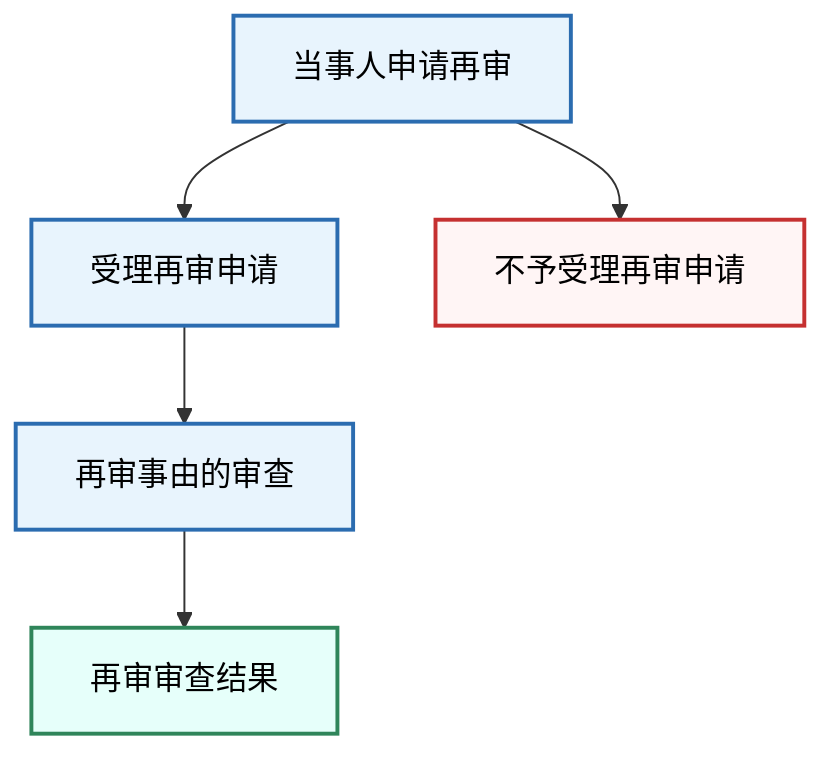

#### 2. 当事人申请再审的要件

##### （1）主体要件

申请再审人需具备再审利益：

| 主体类型                                       | 规则                                                                                                                                                                                           |
| ------------------------------------------ | -------------------------------------------------------------------------------------------------------------------------------------------------------------------------------------------- |
| 原审当事人                                      | 原告、被告、[[XII 第二审程序#（1）上诉主体——上诉人与被上诉人\|上诉人]]、[[XII 第二审程序#（1）上诉主体适格\|被上诉人]]、[[VII 多数人诉讼#三、必要共同诉讼\|必要共同诉讼人]]、[[VII 多数人诉讼#二、有独立请求权第三人\|有独立请求权第三人]]、被判决承担民事责任的[[VII 多数人诉讼#三、无独立请求权第三人\|无独立请求权第三人]] |
| 被遗漏的[[VII 多数人诉讼#固有必要共同诉讼人不适格的处理\|必要共同诉讼人]] | 可自知道或应当知道之日起**6个月**内申请再审[^1]                                                                                                                                                              |
| [[VI 当事人和诉讼代理人#1. 一般继受人\|一般继受人]]           | 当事人死亡或终止的，其权利义务承继者可以申请再审                                                                                                                                                                     |
| [[VI 当事人和诉讼代理人#2. 特定继受\|特定继受人]]（生效后）       | 判决、调解书生效后债权转让，债权受让人申请再审的，**不予受理**                                                                                                                                                            |
| [[VI 当事人和诉讼代理人#2. 特定继受\|特定继受人]]（生效前）       | 诉讼中争议民事权利义务转移的，不影响当事人诉讼主体资格，生效裁判对受让人具有拘束力[^2]                                                                                                                                                |

> [!caution] 再审利益：形式说 + 实体说
> - **无再审利益**：在原审中`全部诉讼请求获得支持`的当事人或`未被判决承担实体权利义务`的当事人，**不具备再审利益**。
> - **再审利益可分**：部分诉讼请求获得支持的当事人，对于`未获支持的部分`**具备再审利益**。
> - 审查中对方当事人也申请再审的，应将其列为申请再审人，对其再审申请一并审查。

>[[XII 第二审程序#（2）上诉利益|上诉利益]]

##### （2）客体要件

**可以申请再审的裁判：**

法律、司法解释允许的：

- 判决、调解书
- 不予受理、驳回起诉的裁定[^3]

**不得申请再审的裁判：**

| 类型        | 具体规则                                                                                                  |
| --------- | ----------------------------------------------------------------------------------------------------- |
| 解除婚姻关系的判决 | 不得申请再审； 但财产分割问题可申请再审（已分割的→审查后裁定再审；未处理的→告知另行起诉）                                                     |
| 非讼程序裁判    | 适用[[XVI 非讼程序#二、特别程序\|特别程序]]、[[XVI 非讼程序#三、督促程序\|督促程序]]、[[XVI 非讼程序#四、公示催告程序\|公示催告程序]]、破产程序等审理的案件，不得申请再审 |
| 仲裁相关裁定    | 撤销仲裁裁决裁定、驳回撤销仲裁裁决申请的裁定、不予执行仲裁裁决裁定[^4]                                                                 |

##### （3）事由要件

民事再审事由，是指《民事诉讼法》规定的启动民事再审审理程序的法定理由或根据。

> [!tip] 理解要点
> - 再审事由是启动再审审理程序的**程序性理由**，是取消`原生效裁判既判力`的理由，而**不必然**是`对案件进行改判的理由`。[^10]
> - 再审事由与一审起诉所要求的诉讼理由不同，再审所要求的理由是再审程序启动的程序性理由。
> - 民事再审事由存在**法定化**的内在要求。

《民事诉讼法》[[民事诉讼法#第二百一十一条|第211条]]规定了13项再审事由，可分为以下四类：

**A. 裁判主体不合法**

（十三）审判人员审理该案件时有[[VIII 贪污贿赂与渎职犯罪#二、贪污罪|贪污]][[VIII 贪污贿赂与渎职犯罪#六、受贿罪|受贿]]，[[VIII 贪污贿赂与渎职犯罪#十、滥用职权罪与玩忽职守罪|徇私舞弊]]，[[VIII 贪污贿赂与渎职犯罪#十一、徇私枉法罪|枉法裁判]]行为的

> 上述行为是指**已经**`由生效刑事法律文书`或者`纪律处分决定`所**确认**的行为。

**B. 裁判根据不合法**

> 1~5 + 6：事实根据；
> 12：法律根据
> 总结：5+1+1（未法盲收集新没假[^11]）

| 事由                                                             | 关键解释                                                                                                                                                                                                                    |
| :------------------------------------------------------------- | ----------------------------------------------------------------------------------------------------------------------------------------------------------------------------------------------------------------------- |
| （一）有**新的证据**，**足以推翻**原判决、裁定的                                   | "**足以推翻**"=**能够证明**原判决、裁定`认定基本事实`或者`裁判结果`错误 →[^12] "**新的证据**"包括：[[XII 第二审程序#（六）证据——新证据\|对比二审中的新证据]] 【**新发现**】原审庭审结束前**已存在**但`客观原因`庭审后才发现【**新取得**】原审已发现但`客观原因`**无法取得**或在规定期限内**无法提供**【**新产生**】原审庭审**结束后形成**，且无法另诉的 |
| （二）原判决、裁定认定的**基本事实**缺乏证据证明的                                    | "**基本事实**"=用以确定当事人`主体资格`、`案件性质`、`民事权利义务`等**对裁判结果有实质性影响**的事实                                                                                                                                                             |
| （三）原判决、裁定认定事实的主要证据是**伪造**的                                     | —                                                                                                                                                                                                                       |
| （四）原判决、裁定认定事实的主要证据**未经质证**的 →[[X 第一审普通程序#3. 质证的法律效果\|未经质证不作准]] | "**未经质证**"专指【正面】`因不可归责于当事人的原因`而未能质证；【反面】当事人在原审中拒绝发表质证意见或质证中未发表意见的，不属于未经质证                                                                                                                                               |
| （五）对审理案件需要的主要证据，当事人因客观原因不能自行**收集**，书面申请人民法院调查收集，人民法院未调查收集的     | **客观原因**包括：证据由国家有关部门保存且无权查阅调取；涉及国家秘密、商业秘密或个人隐私；其他客观原因→ [[III 民事诉讼法的基本原则#（四）辩论原则的补充机制\|这是辩论主义的补充]]                                                                                                                       |
| （十二）据以作出原判决、裁定的**法律文书**被撤销或者变更的                                | "**法律文书**"包括生效`判决书/裁定书/调解书`、生效`仲裁裁决书`、具有`强制执行效力`的`公证债权文书`                                                                                                                                                               |
| （六）原判决、裁定**适用法律**确有错误的                                         | 1. 适用法律与案件性质明显不符； 2. 确定民事责任明显违背当事人约定或法律规定； 3. 适用已失效或尚未施行的法律； 4. 违反法律溯及力规定； 5. 违反法律适用规则； 6. 明显违背立法原意；                                                                                                     |

**C. 裁判程序不合法**

> 无讼不传超漏判，剥夺权利不回避

| 事由                                                                                                                   | 关键解释                                                                                                                               |
| :------------------------------------------------------------------------------------------------------------------- | :--------------------------------------------------------------------------------------------------------------------------------- |
| （七）审判组织的组成不合法或者依法[[IV 民诉法的基本制度#3. 回避的三类情形\|应当回避]]的审判人员没有回避的                                                          | [[XII 第二审程序#（一）审判组织]]                                                                                                              |
| （八）[[VI 当事人和诉讼代理人#三、诉讼能力\|无诉讼行为能力人]]未经法定代理人代为诉讼或者应当参加诉讼的当事人，因不能归责于本人或者其[[VI 当事人和诉讼代理人#（一） 诉讼代理人概述\|诉讼代理人]]的事由，未参加诉讼的 | —                                                                                                                                  |
| （九）违反法律规定，剥夺当事人[[III 民事诉讼法的基本原则#（二）辩论原则的内容\|辩论权利]]的                                                                  | 包括：【1】不允许发表**辩论意见**；【2】应[[X 第一审普通程序#四、开庭审理\|开庭]]而[[XII 第二审程序#（四）审理方式\|未开庭]]；【3】违反法律规定**送达**起诉状/上诉状副本致使当事人无法行使辩论权；【4】`其他违法剥夺辩论权的情形` |
| （十）未经传票传唤，缺席判决的[^5]                                                                                            | [[XI 简易程序与小额诉讼程序#（三）简易程序“简”在何处\|简易程序]]中以捎口信、电话、传真、电子邮件等**非传票传唤方式**发送开庭通知，经当事人**确认**或有其他证据足以证明**当事人已收到**的，可据此缺席判决（反面推论）             |
| （十一）原判决、裁定遗漏或者超出[[III 民事诉讼法的基本原则#（一）处分原则的概念\|诉讼请求]]的                                                                 | 诉讼请求包括一审诉讼请求、二审上诉请求，但当事人未对一审遗漏或超出诉讼请求提起上诉的除外                                                                                       |

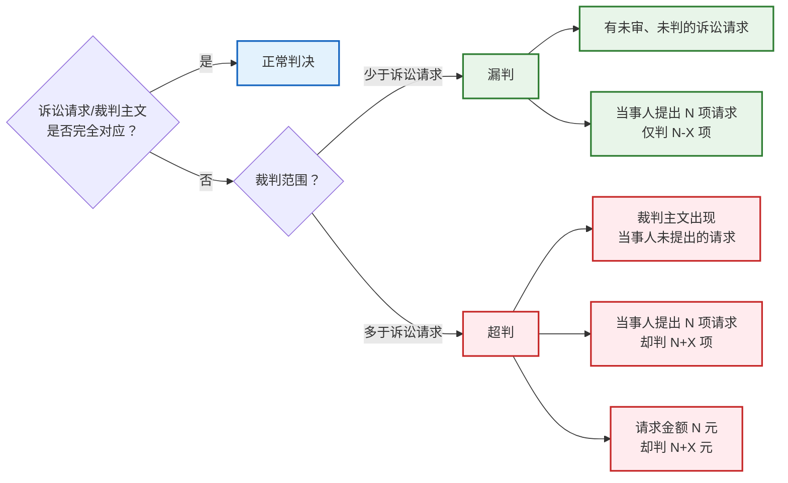

**D. 特殊再审事由**

| 类型                                    | 规则                                                                                   |
| ------------------------------------- | ------------------------------------------------------------------------------------ |
| [[XI 简易程序与小额诉讼程序#（六）小额诉讼的救济\|小额诉讼案件]] | ①以[[民事诉讼法#第二百一十一条\|第211条]]事由向原审法院申请再审的，应当受理； ②以**不应**`按小额诉讼案件审理`为由向原审法院申请再审的，应当受理 |
| [[VIII 法院调解与诉讼和解#（四）原则\|调解案件]]        | 提出证据证明调解`违反自愿原则`或者调解协议的`内容违反法律`（合法原则）的，可以申请再审                                        |

##### （4）管辖要件

| 情形                            | 管辖法院                         |
| ----------------------------- | ---------------------------- |
| 一般规则                          | 向**上一级**人民法院申请再审             |
| 当事人一方人数众多**或**当事人双方为公民[^6]    | 也可以向**原审**人民法院申请再审           |
| 人数众多或双方为公民，分别向原审和上一级申请且不能协商一致 | 由**原审**人民法院受理                |
| 小额诉讼案件                        | 向**原审**人民法院申请再审（**不区分再审事由**） |

##### （5）时间要件

> 对比：[[XII 第二审程序#（3）上诉期间]]

| 情形                                                    | 期限                   |
| ----------------------------------------------------- | -------------------- |
| 一般规则                                                  | 判决、裁定发生法律效力后**6个月**内 |
| 四种特殊情形（新证据、主要证据伪造、据以裁判的法律文书被撤销或变更、审判人员贪污受贿/徇私舞弊/枉法裁判） | 自**知道或者应当知道**之日起6个月内 |
| 调解书                                                   | 调解书发生法律效力后6个月内       |
| 被遗漏的必要共同诉讼人                                           | 自知道或者应当知道之日起6个月内     |

> [!caution] 申请再审期间不适用中止、中断和延长的规定（诉讼法上的**法定不变期间**）。

##### （6）形式要件

> 和二审一样，都要求[[XII 第二审程序#（4）上诉状|书面]]

当事人申请再审，应当提交**再审申请书等材料**。再审申请书应当记明：
- 再审申请人与被申请人及原审其他当事人的基本信息
- 原审人民法院的名称、原审裁判文书案号
- 具体的再审请求
- 申请再审的法定情形及具体事实、理由
- 明确申请再审的人民法院，并由再审申请人签名、捺印或者盖章

#### 3. 再审申请的受理

人民法院应当自收到符合条件的再审申请书等材料之日起**5日内**向再审申请人发送受理通知书，并向被申请人及原审其他当事人发送应诉通知书、再审申请书副本等材料。

> [!caution] 不予受理的情形
> 1. 再审申请被驳回后再次提出申请的
> 2. 对再审判决、裁定提出申请的
> 3. 在人民检察院对当事人的申请作出`不予提出再审检察建议`或者`抗诉决定`后又提出申请的
>
> 前款第一、二项情形，人民法院应告知当事人**可向检察院**申请`再审检察建议`或`抗诉`（但，因检察院提出再审检察建议或抗诉而再审，进而作出的判决、裁定除外）。
>>[!tldr] 当事人申请再审仅有一次机会

#### 4. 再审申请的审查

| 审查维度 | 规则                                                                                                                                                     |
| ---- | ------------------------------------------------------------------------------------------------------------------------------------------------------ |
| 审判组织 | 受理后组成**合议庭**审查                                                                                                                                         |
| 审查范围 | 围绕**再审事由是否成立**进行； 审查中认为`事由不成立但发现生效裁判确有错误`的，法院可[[XIII 再审程序#四、人民法院决定再审\|依职权启动再审]]                                                                     |
| 审查标准 | 属于**初步审查判断**                                                                                                                                           |
| 审查方式 | ①审查`再审申请书`等书面材料（事由成立→径行裁定再审；[[XIII 再审程序#（5）时间要件\|超期]]或[[XIII 再审程序#（3）事由要件\|超出事由范围]]→裁定驳回）； ②审阅`原审卷宗`（只审查材料还难以裁定时）； ③询问`当事人`（新证据可能推翻原裁判时**应当**询问） |

> [!tip] 多个再审申请人的处理
> 审查再审申请期间，被申请人及原审其他当事人依法提出再审申请的，应将其列为再审申请人，对其再审事由一并审查，审查期限**重新计算**。其中一方事由成立的，裁定再审；各方事由均不成立的，一并裁定驳回。

#### 5. 再审审查结果

| 结果类型             | 规则                                                                                                                                                                                                                  |
| ---------------- | ------------------------------------------------------------------------------------------------------------------------------------------------------------------------------------------------------------------- |
| **裁定再审**         | 事由成立且符合申请再审条件的，应当`裁定再审`（收到再审申请书之日起**3个月**内审查）； 效力：【1】停止原判决[[X 第一审普通程序#3. 既判力\|既判力]]；【2】原判决[[X 第一审普通程序#4. 执行力\|执行力]]继续存在但原则上应中止执行（追索赡养费/扶养费/抚养费/抚恤金/医疗费用/劳动报酬等案件可不中止[^13]）；【3】启动本案[[XIII 再审程序#（五）再审审理程序\|再审审理程序]] |
| **裁定驳回再审申请**     | 【驳回原因】事由不成立、[[XIII 再审程序#（5）时间要件\|超期]]、[[XIII 再审程序#（3）事由要件\|超出事由范围]]等；调解书自愿无违法； 【驳回生效】驳回再审申请的裁定一经送达即发生法律效力                                                                                                        |
| **裁定准许撤回/按撤回处理** | 撤回后再申请不予受理[^14] （四种特殊情形除外：`新证据、伪证、原判决裁定被撤销变更、原审审判人员违规`）                                                                                                                                                          |
| **裁定终结审查**       | 【1.1无权利继受人】 申请人死亡或终止且无承继者或承继者放弃； 【1.2无义务继受人】被申请人死亡或终止且无可供执行财产； 【2和解】和解协议已履行完毕（但声明不放弃的除外）； 【3 冒名诉讼】他人未经授权申请； 【4】已裁定再审； 【5】被驳回后再申请； 【6】对再审裁判申请； 【7】检察院决定后再申请                                     |

#### 6. 再审审查期限

- 人民法院应当自收到再审申请书之日起**3个月**内审查。
- 涉外民事案件的审查期间，不受3个月规定的限制。

---

### （五）再审审理程序

#### 1. 再审审查程序 与 再审审理程序的区别

| 区别维度 | 再审审查程序           | 再审审理程序                 |
| ---- | ---------------- | ---------------------- |
| 任务   | 审查`再审事由`是否符合法律规定 | 对`再审请求`（具体改判请求）依法裁判    |
| 顺序   | 在先               | 在后（不经过审查程序过滤，不能进入审理程序） |
| 适用条件 | 再审事由审查           | 以审查程序作出`裁定再审`结论为前提     |
| 适用标准 | 初步判断，不必然约束审理法官   | 最终判断                   |
| 适用程序 | 不同于审理程序的程序法律规范   | —                      |

#### 2. 再审审理的管辖法院

**（1）提审为原则**

上一级人民法院经审查认为申请再审事由成立的，一般由**本院提审**（意味着最低是中院受理）

**（2）指令再审**

> 「指令」在语义上带有训诫的意味

可以指令原审人民法院再审的情形：
1. 依据[[民事诉讼法#第二百一十一条|第211条]]第（四）（五）（九）项裁定再审的
2. 生效裁判由第一审法院作出的[^7]
3. 当事人一方人数众多或双方为公民的
4. 经审判委员会讨论决定的其他情形

也可以指令与原审法院同级的其他法院再审。

**（3）应当提审（不得指令原审法院再审）**

- 业务水平低
	1. 原裁判系经`原审法院再审审理后`作出的
	2. 原裁判系经`原审法院`[[IV 民诉法的基本制度#4. 审判委员会与专业法官会议|审判委员会]]讨论作出的
- 职业道德低
	1. 原审审判人员有贪污受贿、徇私舞弊、枉法裁判行为的
- 无再审管辖权
	1. 原审法院对该案无再审管辖权的（？）
- 其他
	1. 需要统一法律适用或裁量权行使标准的
	2. 其他不宜指令原审法院再审的情形

**（4）原则上由中级以上法院审理**

> 因当事人申请裁定再审的案件由中级人民法院以上的人民法院审理，但当事人选择向基层人民法院申请再审的除外。

#### 3. 再审审理的当事人

- 民事再审案件的当事人应为**原审案件的当事人**。
	- [[VI 当事人和诉讼代理人#1. 一般继受人|诉讼承继]]：原审当事人死亡/终止的，其权利义务承受人可以申请再审并参加再审诉讼。
- 被遗漏的[[VII 多数人诉讼#固有必要共同诉讼人不适格的处理|必要共同诉讼人]]申请再审的：
	- **按一审程序再审** → 追加其为当事人，作出新裁判；
	- **按二审程序再审** → 调解不成 → 撤销原裁判，发回重审，重审时应追加其为当事人。

#### 4. 再审审理：另行组成合议庭

人民法院审理再审案件，应当**另行组成合议庭**。

#### 5. 再审审理的范围

**（1）围绕再审请求进行**

当事人的**再审请求超出原审诉讼请求**的，不予审理；符合另案诉讼条件的，告知可另行起诉。

**（2）审理范围的扩大**

| 情形                                       | 处理                                                                                              |
| ---------------------------------------- | ----------------------------------------------------------------------------------------------- |
| 被申请人及原审其他当事人在庭审辩论结束前**提出再审请求**           | 符合法定条件的，**一并审理**                                                                                |
| 发现生效裁判损害**国家利益、社会公共利益、他人合法权益**[^8]       | **应当**一并审理                                                                                      |
| **撤销**原裁判发回重审的案件，当事人申请`变更/增加诉讼请求`或提出`反诉` | 符合四种情形的应当准许：【1】原审未合法传唤缺席判决[^15]；【2】追加新诉讼当事人[^16]；【3】诉讼标的物灭失或变化致使原诉讼请求无法实现[^17]；【4】无法通过另诉解决[^18] |

#### 6. 再审审理的方式

人民法院审理再审案件应当组成合议庭**开庭审理**。

但**按照第二审程序审理**，有特殊情况或双方当事人已通过其他方式**充分表达意见**且**书面同意不开庭审理**的除外。

#### 7. 再审审理的程序

**（1）一般规则**

| 原裁判作出法院                            | 适用程序                 | 裁判效力      |
| ---------------------------------- | -------------------- | --------- |
| 第一审法院                              | [[X 第一审普通程序\|第一审程序]] | 当事人可以上诉   |
| 第二审法院                              | [[XII 第二审程序\|第二审程序]] | 发生法律效力的裁判 |
| 上级法院[[XIII 再审程序#2. 再审审理的管辖法院\|提审]] | [[XII 第二审程序\|第二审程序]] | 发生法律效力的裁判 |

**（2）小额诉讼再审审理的程序**

| 申请理由                          | 审理程序         | 裁判效力        |
| ----------------------------- | ------------ | ----------- |
| 以[[民事诉讼法#第二百一十一条\|第211条]]事由申请 | 裁定再审后组成合议庭审理 | 当事人**不得**上诉 |
| 以不应按小额诉讼案件审理为由申请              | 裁定再审后组成合议庭审理 | 当事人**可以**上诉 |
> 既然要组庭审理，说明适用简易或者一审程序。

**（3）开庭审理的具体程序**

1. **因当事人申请再审**：
	- 再审申请人陈述再审请求及理由 → 被申请人答辩 → 其他原审当事人发表意见
2. **因抗诉再审**：
	- 抗诉机关宣读抗诉书 → 申请抗诉的当事人陈述 → 被申请人答辩 → 其他原审当事人发表意见
3. **法院依职权再审**（有申诉人）：
	- 申诉人陈述再审请求及理由 → 被申诉人答辩 → 其他原审当事人发表意见
4. **法院依职权再审**（无申诉人）：
	- 原审原告或原审上诉人陈述 → 原审其他当事人发表意见

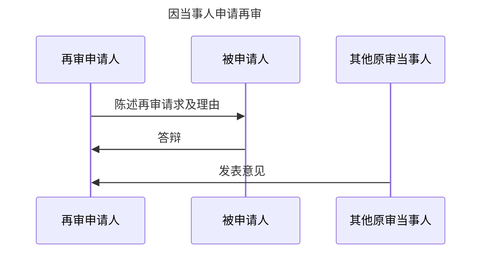
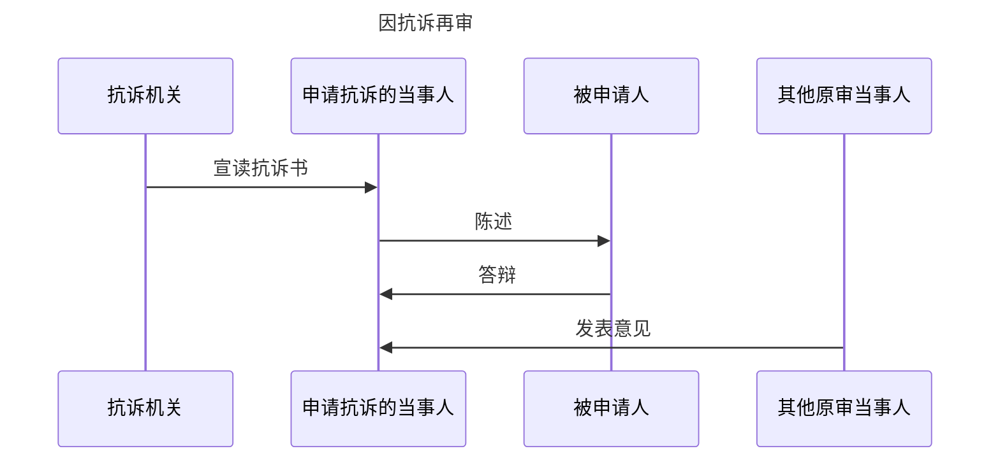

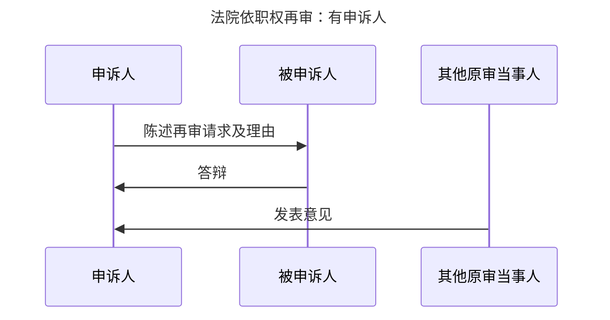

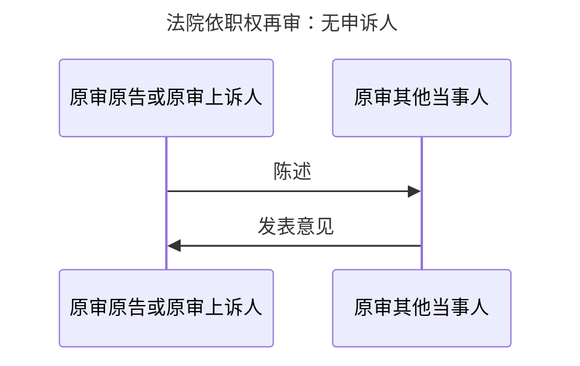

#### 8. 再审审理的结果

| 结果类型                | 适用情形                                                                                                                                                                              |
| ------------------- | --------------------------------------------------------------------------------------------------------------------------------------------------------------------------------- |
| **维持原裁判**           | 认定**事实清楚、适用法律正确**；或认定事实/适用法律**虽有瑕疵但裁判结果正确**的（应在再审裁判中纠正瑕疵后维持）                                                                                                                      |
| **裁定撤销原判决，发回重审**    | ①按照**二审程序**再审，原审法院**未对基本事实进行过审理**的（认定事实错误不得以`基本事实不清`为由发回）； ②**严重违反法定程序**（遗漏必须参加诉讼的当事人、无诉讼行为能力人未经法定代理人、未经合法传唤缺席判决或剥夺辩论权、审判组织不合法或应回避未回避、遗漏诉讼请求→[[XIII 再审程序#（3）事由要件\|C.裁判程序不合法]]） |
| **依法改判、撤销或变更**      | 原裁判**认定事实**、**适用法律错误**，**导致裁判结果错误的**；因[[XIII 再审程序#（3）事由要件\|新证据]]改判且再审申请人有过错未能及时举证的，应补偿被申请人增加的`交通/住宿/就餐/误工等必要费用`                                                                   |
| **裁定驳回再审申请**        | 对调解书裁定再审后，调解`违反自愿原则的事由`不成立且`内容不违反法律强制性规定`                                                                                                                                         |
| **裁定准许撤回起诉**        | 一审原告在再审审理程序中申请撤回起诉，**经其他当事人同意**且**不损害国益/公益/他人权益**的，应一并撤销原判决；**撤回起诉后重复起诉的，不予受理**                                                                                                   |
| **裁定撤销一、二审判决，驳回起诉** | **按照二审程序再审**，经审理认为不符合[[X 第一审普通程序#（三）起诉条件\|起诉条件]]或符合[[X 第一审普通程序#（四）不予受理的案件\|不予受理情形]]                                                                                               |
| **裁定终结再审程序**        | ①申请人撤回再审请求；②申请人经传票传唤无正当理由拒不到庭或中途退庭；③检察院撤回抗诉； ④申请人死亡/终止无承继者或承继者放弃；⑤被申请人死亡/终止无可供执行财产；→[[X 第一审普通程序#2. 诉讼终结：情形\|诉讼终结]] ⑥和解协议已履行完毕（声明不放弃的除外）；⑦他人未经授权申请[^9]                       |
| **达成调解协议**          | **应当制作再审调解书**[^19]，经**各方签收后**具有法律效力，原裁判视为被撤销                                                                                                                                      |

> [!tip] 再审程序终结后，人民法院裁定[[XIII 再审程序#5. 再审审查结果|中止执行的原生效判决]]**自动恢复执行**。

---

## 三、案外人申请再审

执行过程中，案外人对执行标的提出书面异议的，人民法院应当自收到书面异议之日起**15日内**审查。
- 理由成立的，裁定`中止对该标的的执行`；
- 理由不成立的，裁定`驳回`。
- 案外人、当事人对裁定不服，认为原判决、裁定错误的，依照`审判监督程序办理`；
- **案外人执行异议之诉**：与原判决、裁定无关的，可以自裁定送达之日起**15日内**向人民法院`提起诉讼`。

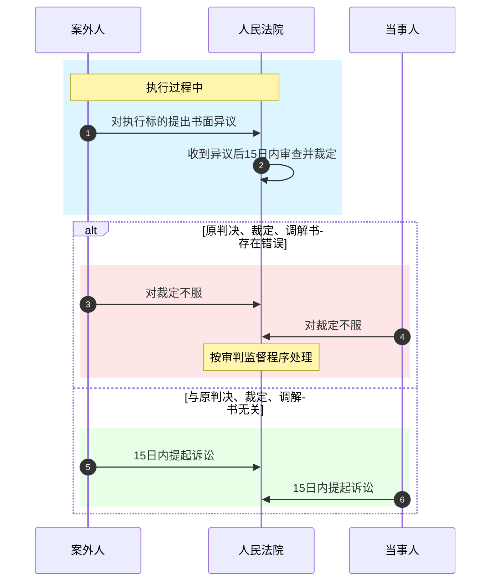

### （一）案外人申请再审的条件

1. **先议**：==案外人的执行异议申请已经被人民法院**裁定驳回**==
2. **事由**：案外人对驳回其执行异议的裁定不服，认为原判决、裁定、调解书**内容错误**
3. **利益**：原判决、裁定、调解书内容**损害了案外人的民事权益**
4. **时间**：可以自`执行异议裁定`送达之日起**6个月**内申请再审
5. **对象**：应当向**作出原判决、裁定、调解书的人民法院**申请再审

### （二）特殊规则

案外人不是必要的共同诉讼当事人的，人民法院**仅**审理`原裁判对其民事权益造成损害`的内容。经审理：
- 再审请求成立的，撤销或者改变原裁判；
- 再审请求不成立的，维持原裁判。

### （三）理论批评

> [!question] 案外人申请再审制度的理论争议
> 1. 有违**既判力的相对性**理论
> 2. 案外人在再审程序中的**诉讼地位**难以界定
> 3. 再审程序难以满足案外人寻求执行救济的需要——再审之诉是一种**裁量性救济程序**，而非权利性救济程序，其启动受诸多因素限制，而案外人寻求执行救济时需要的是**常态性救济**

---

## 四、人民法院决定再审

### （一）法律依据

各级人民法院`院长`对`本院`已经发生法律效力的判决、裁定、调解书，发现**确有错误**，认为需要再审的，**应当提交**[[IV 民诉法的基本制度#4. 审判委员会与专业法官会议|审判委员会]]**讨论决定**。

最高人民法院对地方各级人民法院、上级人民法院对下级人民法院已经发生法律效力的裁判，发现**确有错误**的，有权**提审**或者**指令下级人民法院再审**。

当事人未申请再审、人民检察院未抗诉的案件，人民法院发现原裁判有`损害国家利益`、`社会公共利益`等确有错误情形的，应当依职权提起再审。

### （二）条件

1. 判决、裁定、调解书**已经发生法律效力**
2. 生效裁判**确有错误**（包括损害国家利益、社会公共利益等）
3. 必须由**法定主体**提起：本级人民法院院长和审判委员会，上级人民法院和最高人民法院

### （三）程序

| 发动主体   | 程序                                            |
| ------ | --------------------------------------------- |
| 各级法院院长 | 发现本院已生效裁判确有错误 → 提交审判委员会讨论 → 审委会决定是否再审         |
| 最高人民法院 | 发现地方法院已生效裁判确有错误 → 提审或指令下级法院再审（提审时应在裁定中写明中止执行） |
| 上级人民法院 | 发现下级法院已生效裁判确有错误 → 提审或指令再审                     |

### （四）是否取消法院决定再审？（理论争议）

> [!question] 批评观点
> 1. 不符合民事诉讼中的**处分原则**
> 2. 不符合**诉审分离**原则
> 3. 违背**判决效力**理论
> 4. 不利于**民事法律关系**的稳定
> 5. 为当事人反复申诉、缠讼不休提供了制度基础
> 6. 审判权过度扩张，造成当事人申请再审权利的虚化和旁落

---

## 五、人民检察院发动再审

### （一）发动方式

**1. 抗诉**

抗诉是指人民检察院对人民法院作出的生效判决、裁定，认为**确有错误**，或者发现调解书**损害国家利益、社会公共利益**时，依法向人民法院提出`重新审理要求`的诉讼活动。

抗诉是对生效法律文书既判力的挑战和颠覆。

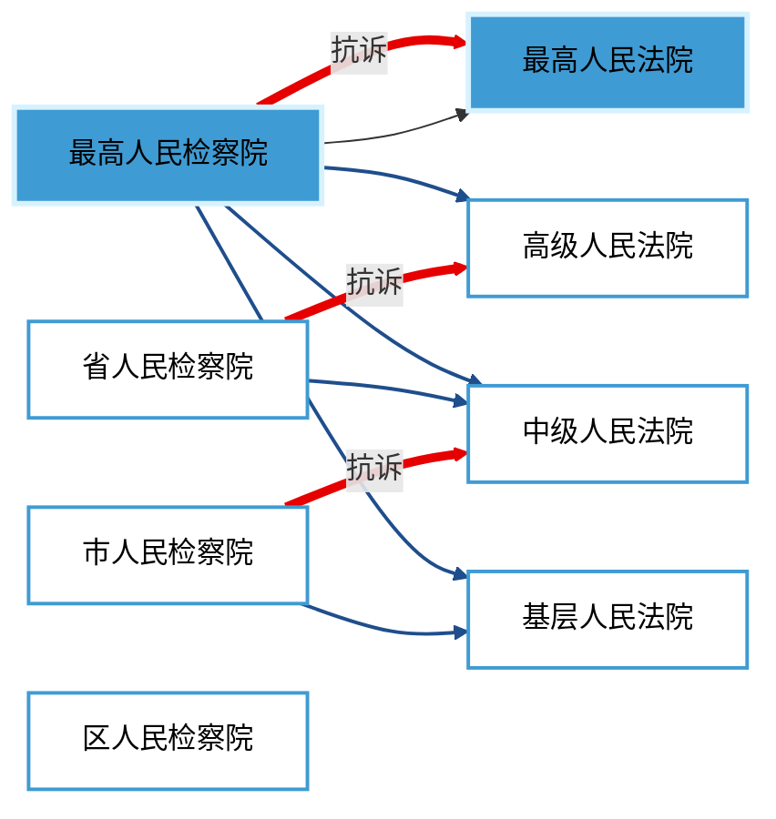

**2. 再审检察建议**

再审检察建议是指人民检察院对一些民事申诉案件，不采取抗诉方式启动再审程序，而是向人民法院提出检察建议，由[[XIII 再审程序#四、人民法院决定再审|人民法院自行启动再审程序]]进行重新审理。

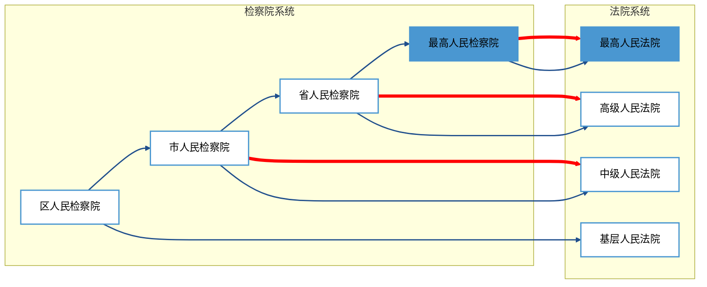

| 对比维度 | 抗诉                      | 再审检察建议                         |
| ---- | ----------------------- | ------------------------------ |
| 提出主体 | 上级检察院向同级法院 上抗下，向同级提出 | 地方各级检察院向同级法院 同级建议同级，报请上级    |
| 效力   | 法院应在30日内裁定再审            | 法院审查后决定是否再审（3个月内）              |
| 适用   | 刚性监督                    | 柔性监督，适用范围更广泛 （还可针对诉中法院违法行为） |

### （二）发动条件

**1. 谦抑性原则——当事人申请再审优先**

有下列情形之一的，当事人**可以**向检察院申请检察建议或者抗诉：
1. 人民法院驳回再审申请的
2. 人民法院逾期未对再审申请作出裁定的
3. 再审判决、裁定有明显错误的

检察院对当事人的申请应当在**3个月**内审查，作出决定。==当事人不得再次向检察院申请检察建议或者抗诉。==

**2. 程序要件**

- 裁判已经生效
- 发现生效裁判有[[民事诉讼法#第二百一十一条|第211条]]规定的再审事由
- 调解书损害国家利益、社会公共利益的

> [!caution] 注意区分
> 对于调解书，当事人申请再审的事由是"**调解违反自愿原则或内容违法**"，
> 
> 而检察院发动再审的事由是"**调解书损害国家利益**、**社会公共利益**"，二者不一致。

### （三）发动程序

**1. 案件来源**

- **当事人**向人民检察院申请监督
- **当事人以外**的自然人、法人和非法人组织向人民检察院控告
- **人民检察院**在履行职责中发现

> [!caution] 检察院不予受理的当事人监督申请
> 1. 未向人民法院申请再审的
> 2. 申请再审超过法定期限的（不可归责于其自身原因的除外）
> 3. 人民法院正在法定期限内审查再审申请的
> 4. 人民法院已裁定再审且尚未审结的
> 5. **判决、调解解除婚姻关系的**（财产分割部分除外）
> 6. 检察院已审查终结作出决定的
> 7. 裁判是法院根据检察院抗诉或再审检察建议再审后作出的
> 8. 申请监督超过期限的
> 9. 其他不应受理的情形

**2. 检察院依职权启动监督程序（不受当事人是否申请再审的限制）**

- 损害国家利益或社会公共利益的
- 审判、执行人员有贪污受贿、徇私舞弊、枉法裁判等违法行为的
- 当事人存在虚假诉讼等妨害司法秩序行为的
- [[XIV 民事公益诉讼|民事公益诉讼]]裁判确有错误，或审判/执行活动存在违法情形的
- 需要跟进监督的
- 具有重大社会影响等确有必要进行监督的情形

**3. 检察院的审查与调查核实**

- 审查申请
	- 应当围绕申请**当事人监督请求**、**争议焦点**、**规则三十七条情形**[^20]进行全面审查
	- 可通过听取当事人意见、听证、调查核实、专家咨询论证等方式
	- 可以调阅法院诉讼卷宗
	- 3 个月内审查完毕（和法院再审审限一致）
- 调查核实
	- 调查核实措施包括：查询/调取/复制证据、**询问当事人或案外人**、咨询专业人员、委托鉴定/评估/审计、勘验物证/现场等
	- **不得**采取限制人身自由和查封、扣押、冻结财产等强制性措施

4.**抗诉书、通知书、提请抗诉抗诉报告书与检察建议书**

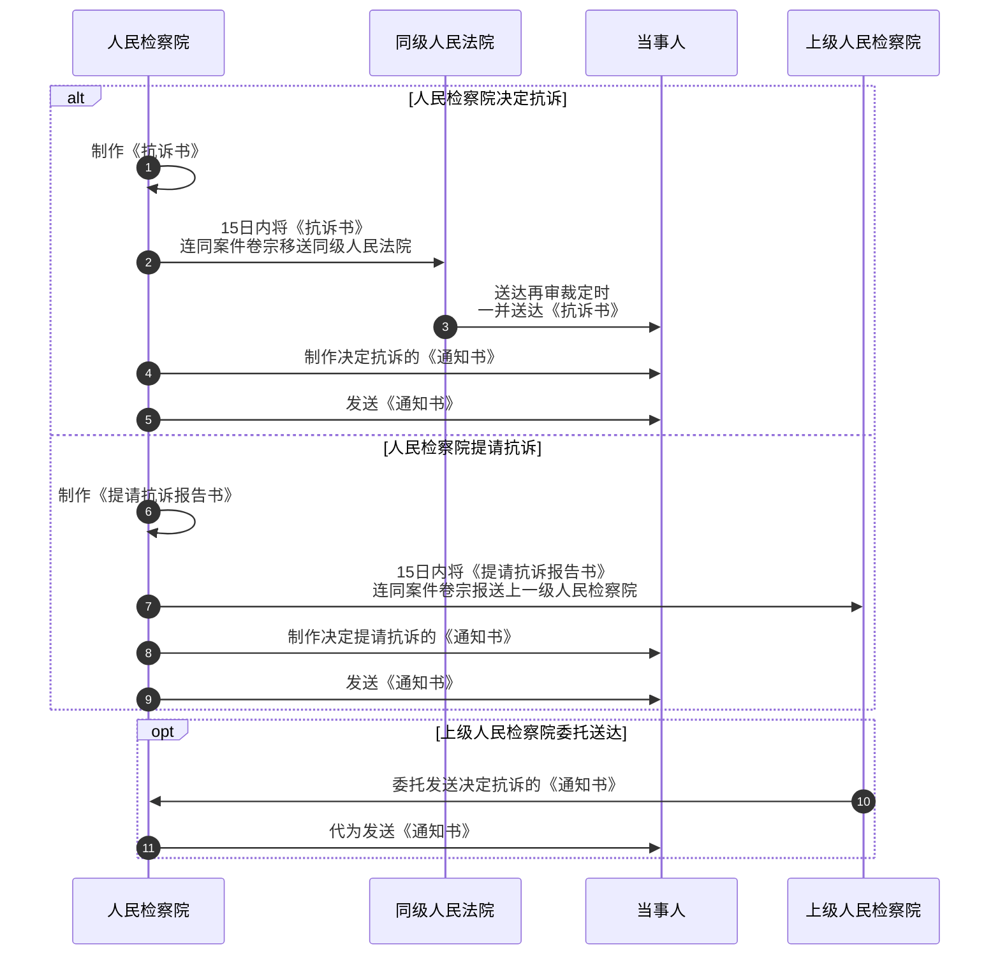

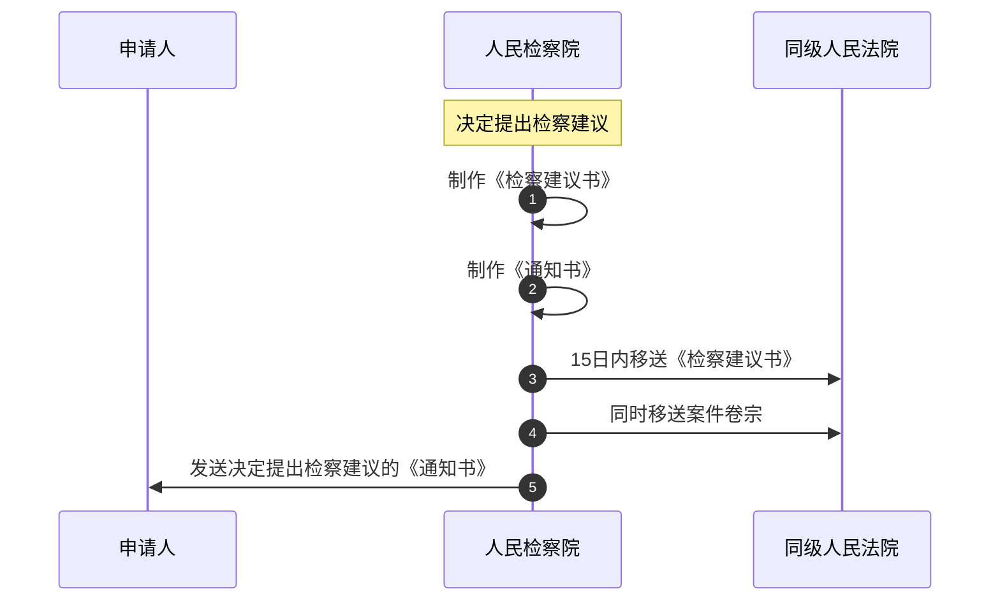

**5. 对抗诉的审查与裁定再审**

检察院提出抗诉的案件，接受抗诉的人民法院应当**自收到抗诉书之日**起**30日内**作出再审的裁定。有[[民事诉讼法#第二百一十一条|第211条第一项至第五项]]规定情形之一的，可以交下一级人民法院再审（但经该下一级人民法院再审的除外）。

**6. 法院对再审检察建议的审查**

人民法院收到再审检察建议后，**应组成合议庭**，在**3个月**内审查。发现原裁判确有错误、需要再审的，裁定再审并通知当事人；决定不予再审的，应书面回复检察院。

> [!note] 因抗诉裁定再审的人民法院
> 接受抗诉的法院再审（相当于提审）受理抗诉的法院可以交由下一级法院再审（如果抗诉事由符合[[民事诉讼法#第二百一十一条]]第一至五项）

**7. 因抗诉裁定再审的审理范围**

- 应围绕**抗诉内容**进行审理。
	- ==抗诉内容与当事人申请再审理由不一致的，原则上以检察机关的抗诉书为准。==
- 法院审查再审申请期间检察院提出抗诉的，法院应裁定再审，申请再审人提出的具体再审请求应纳入审理范围。

**8. 检察人员出席再审法庭**

- 检察院提出抗诉的案件，法院再审时，检察院应当派员出席法庭。
- 检察人员出席再审法庭的任务：①宣读抗诉书；②对检察院调查取得的证据予以出示和说明；③庭审结束时经审判长许可发表法律监督意见；④对法庭审理中违反诉讼程序的情况予以记录。
- 检察院调查核实的情况，应当向法庭提交并予以说明，由双方当事人进行**质证**。

> [!danger] 法院审理因检察院抗诉或检察建议裁定再审的案件，**不受**此前已作出的驳回当事人再审申请裁定的影响。

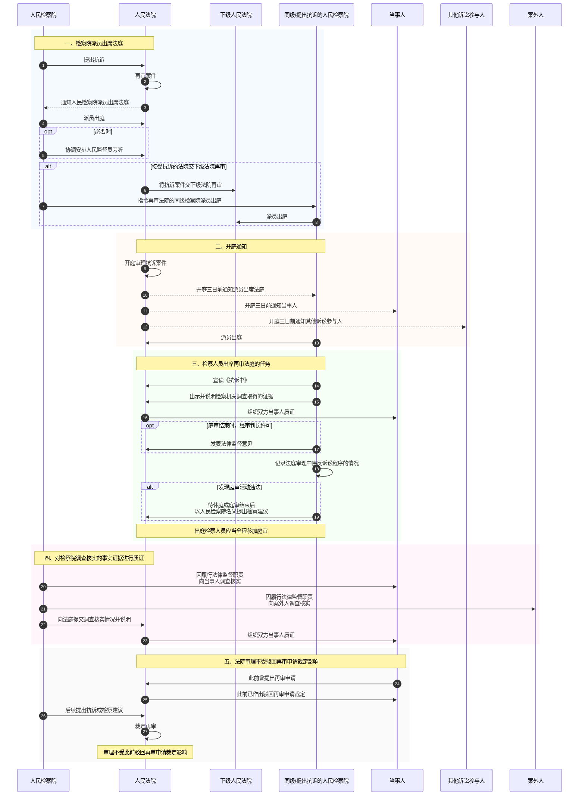

---

[^1]: 前提：不能归责于本人或者其诉讼代理人的事由

[^2]: 经法院准许，也可替代原当事人承担诉讼，此时发生当事人变更。

[^3]: 没有管辖权异议：原本法律有所规定，但为防止滥讼缠讼被排除。link.三种可以被上诉的裁定：管辖权异议、不予受理、驳回起诉

[^4]: 它们本身都是纠正仲裁错误的纠错程序，再审也是纠错程序，二者应各司其职，不应重合。

[^5]: 这里指的是普通程序，普通程序可以缺席判决，[[X 第一审普通程序#3. 缺席判决的法定情形|当且仅当]]，对于简易程序【见右】

[^6]: 在这种情况下，矛盾一般比较激烈，因此用原审法院有利于化解矛盾、查清事实

[^7]: 一审的裁判还可以上诉，放权后还能收回。

[^8]: [[III 民事诉讼法的基本原则#（五）职权干预主义|职权干预主义]]

[^9]: 4、5、6、7同时也是[[XIII 再审程序#5. 再审审查结果|再审审查终结事由]]

[^10]: - **程序性功能**：再审事由是法律预设的、用于挑战既判力正当性的法定理由，其成立仅导致程序重启和原裁判效力暂停，是“破”的依据。
	- **实体性结果**：是否改判取决于重新审理后对案件事实与法律的判断，可能“立”新裁判，也可能“修”瑕疵后“守”原结论，是“立”的考量。

[^11]: 谐音：为法盲调查新美甲💅。未：未经质证、法盲：适用法律错误、收集：法院未调查收集、新：新证据（3 新）、没：认定事实缺乏证据、假：伪证。

[^12]: 对于符合前款规定的证据，人民法院应当责令当事人说明逾期提交证据的原因，拒不说明或者理由不成立的，依照[[X 第一审普通程序#2. 柔性证据失权|逾期提交证据的规定]]处理。
	
	再审申请人在原审中已经提供的证据，原审法院未组织质证且未作为裁判根据的，视为逾期提供证据的理由成立。但是原审法院依照逾期提供证据的规定不予采纳的除外。

[^13]: 为什么：再审审查虽然意味着原判决可能存在错误，但在“当事人可能的生存危机”与“被执行人可能多付财产的损失”之间，法律作出了明确的价值选择：**生存利益优先**。即便原判决最终被改判，被执行人多支付的财产通常是有能力返还或赔偿的；但对于权利人而言，断绝生活或医疗来源的损害往往是不可逆的。因此，法律优先保障弱势群体的生存权，豁免了这些案件的中止执行。

[^14]: 这四类事由在再审期间方面同样具有特殊性：从知道或应当知道之日起 6 个月

[^15]: 如果原审未合法传唤被告即缺席判决，意味着被告在原审中完全丧失了陈述、答辩、举证、辩论的机会，其诉讼权利被严重剥夺。发回重审是给被告第一次实质参与诉讼的机会，此时若不允许被告提出反诉或变更诉讼请求，等于强迫其只能在一个“被动防守”的框架内维权，无法形成完整的攻击防御体系。**准许其提出反诉，是弥补原程序瑕疵、恢复当事人武器对等的必然要求。**

[^16]: 新当事人的加入（如遗漏的必要共同诉讼人、有独立请求权的第三人），意味着原有诉讼结构被打破，法律关系发生了扩展。新加入的当事人必然带有自己的独立诉求或抗辩理由，若不允许现有当事人据此变更请求或提出反诉，将无法一次性解决所有关联纠纷，违背了诉讼经济原则，也可能导致前后裁判矛盾。**例如，在公司增资纠纷中，若原审遗漏了参与增资的股东，重审追加其参加后，必然涉及股权如何重新分配的新请求。**

[^17]: 原诉讼请求（如返还原物、交付特定货物）建立在特定标的物存在的基础上。如果在再审发回期间该物灭失（如房屋烧毁、货物腐坏），原有的“给付之诉”在物理上已不可能实现。此时如果不允许原告将诉讼请求变更为“损害赔偿”或“折价补偿”，原告将面临完全败诉且无处求偿的境地。**这属于客观情况变化迫使当事人必须调整请求，否则实体权利将落空。**

[^18]: 当“另诉”这条常规出路被堵死时，若再不准许在重审中合并审理，当事人的合法权益将永远无法获得司法救济。此时，**在重审程序中吸收新请求，是实现纠纷一次性解决的最后兜底手段。**

[^19]: [[XII 第二审程序#五、上诉案件的调解|二审也必须制作调解书]]

[^20]: 第三十七条  人民检察院在履行职责中发现民事案件有下列情形之一的，应当依职权启动监督程序：
	
	（一）损害国家利益或者社会公共利益的；
	
	（二）审判、执行人员有贪污受贿，徇私舞弊，枉法裁判等违法行为的；
	
	（三）当事人存在虚假诉讼等妨害司法秩序行为的；
	
	（四）人民法院作出的已经发生法律效力的民事公益诉讼判决、裁定、调解书确有错误，审判程序中审判人员存在违法行为，或者执行活动存在违法情形的；
	
	（五）依照有关规定需要人民检察院跟进监督的；
	
	（六）具有重大社会影响等确有必要进行监督的情形。
