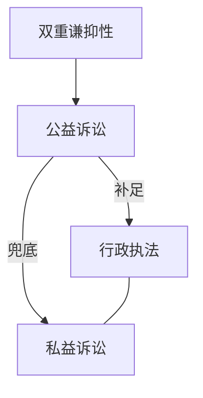
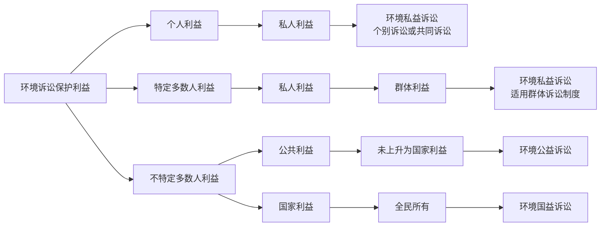

# 民事公益诉讼

> [!abstract]
> 民事公益诉讼的主线是公共利益保护的程序担当：原告不是自身私益受害人，而是法律规定的机关和有关组织；法院对起诉、请求、和解、调解、撤诉、自认、执行均有较强职权控制。复习时重点抓住三组关系：`公益诉讼与行政执法/私益诉讼`、`公益诉讼与国益诉讼`、`检察公益诉讼的特别规则`。

---

## 一、民事公益诉讼概述

### （一）概念

公益诉讼，是指以保护社会公共利益为目的的诉讼。

社会公共利益一般指“不特定多数人的利益”。民事公益诉讼的典型功能，是由法定主体以诉讼方式保护个体受害人难以单独充分维护的公共利益。

### （二）社会公共利益的范围

1. 生态环境和资源保护。
2. 食品药品安全领域消费者合法权益。
3. 未成年人合法权益。
4. 军人荣誉。
5. 安全生产。
6. 个人信息保护。
7. 英雄烈士名誉。
8. 生物多样性保护。
9. 文物古迹保护。
10. 妇女合法权益。

### （三）民事公益诉讼的双重谦抑性

- **相对于行政执法**：公益诉讼通常不是行政监管的替代品，而是行政执法不足时的司法补足。
- **相对于私益诉讼**：公益诉讼不当然替代具体受害人的私益诉讼，而是在公共利益层面提供兜底性保护。
- 因此，民事公益诉讼的启动条件比普通私益诉讼更强调`主体法定`、`公共利益受损`和`程序节制`。

---

## 二、民事公益诉讼的起诉条件

### （一）一般条件与特殊条件

环境保护法、消费者权益保护法等法律规定的机关和有关组织，对污染环境、侵害众多消费者合法权益等损害社会公共利益的行为，根据《民事诉讼法》第58条提起公益诉讼，符合下列条件的，人民法院应当受理：

1. 有明确的被告。
2. 有具体的诉讼请求。
3. 有社会公共利益受到损害的初步证据。
4. 属于人民法院受理民事诉讼的范围和受诉人民法院管辖。

> [!tip] 与私益诉讼起诉条件的差异
> 相较普通私益诉讼，公益诉讼**不要求**“原告是与本案**有直接利害关系**的公民、法人和其他组织”；但增加“有社会公共利益受到损害的初步证据”。

### （二）起诉条件结构

| 维度    | 私益诉讼        | 公益诉讼                      |
| ----- | ----------- | ------------------------- |
| 原告资格  | 与本案有直接利害关系  | 法律规定的机关和有关组织，特定情形下包括人民检察院 |
| 请求    | 有具体诉讼请求     | 有具体诉讼请求                   |
| 被告    | 明确被告        | 明确被告                      |
| 证据门槛  | 通常围绕自身权益受损  | 须有社会公共利益受到损害的初步证据         |
| 受案与管辖 | 属于法院受案范围和管辖 | 属于法院受案范围和管辖               |

---

## 三、民事公益诉讼的原告

### （一）原告性质

民事公益诉讼的原告是**法律规定的机关和有关组织**，其诉讼地位可概括为法定诉讼担当人。

### （二）“机关”的范围

- 人民检察院。

人民检察院并非无条件优先起诉主体。其通常在没有前款规定的机关和组织，或者前款规定的机关和组织不提起诉讼的情况下，向人民法院提起公益诉讼；机关或者组织已经起诉的，人民检察院可以支持起诉。

### （三）“有关组织”的范围

#### 1. 环保组织

对污染环境、破坏生态，损害社会公共利益的行为，符合下列条件的社会组织可以向人民法院提起诉讼：

1. 依法在设区的市级以上人民政府民政部门登记。
2. 专门从事环境保护公益活动连续5年以上且无违法记录。

提起诉讼的社会组织不得通过诉讼牟取经济利益。

#### 2. 消费者协会

对侵害众多消费者合法权益的行为，中国消费者协会以及在省、自治区、直辖市设立的消费者协会，可以向人民法院提起诉讼。

### （四）起诉主体竞合

| 情形 | 处理 |
|------|------|
| 法律规定的机关或组织已经提起诉讼 | 人民检察院可以支持起诉 |
| 没有前述机关、组织，或其不提起诉讼 | 人民检察院可以向人民法院提起诉讼 |
| 法院已受理公益诉讼，其他依法可起诉主体申请参加 | 开庭前申请，法院准许的，列为共同原告 |

---

## 四、公益诉讼的诉讼请求

### （一）环境公益诉讼请求

对污染环境、破坏生态，已经损害社会公共利益或者具有损害社会公共利益重大风险的行为，原告可以请求被告承担：

- 停止侵害；
- 排除妨碍；
- 消除危险；
- 修复生态环境；
- 赔偿损失；
- 赔礼道歉等民事责任。

为防止生态环境损害的发生和扩大，原告请求停止侵害、排除妨碍、消除危险的，人民法院可以依法支持。原告为停止侵害、排除妨碍、消除危险采取合理预防、处置措施而发生的费用，请求被告承担的，人民法院可以依法支持。

国家规定的机关或者法律规定的组织作为被侵权人代表，请求判令侵权人`承担惩罚性赔偿责任`的，人民法院可以参照相关规则处理；惩罚性赔偿金数额的确定，以`生态环境服务功能丧失损失、永久性损害损失等`为计算基数。

### （二）消费公益诉讼请求

消费民事公益诉讼中，**原告可以请求被告承担**：

- 停止侵害；
- 排除妨碍；
- 消除危险；
- 赔礼道歉等民事责任。

经营者利用格式条款或者通知、声明、店堂告示等，排除或限制消费者权利、减轻或免除经营者责任、加重消费者责任，原告主张对消费者不公平、不合理而无效的，人民法院应依法支持。

---

## 五、民事公益诉讼的特殊程序规则

### （一）管辖

| 类型         | 规则                                                                     |
| ---------- | ---------------------------------------------------------------------- |
| 级别管辖       | 公益诉讼案件由`中级人民法院管辖`，但法律、司法解释另有规定的除外                                      |
| 海洋环境污染     | 由`污染发生地`、`损害结果地`或者`采取预防污染措施地`**海事法院**管辖                                |
| 环境公益诉讼地域管辖 | `侵权行为地`或`被告住所地人民法院`管辖； 侵权行为地包括`行为发生地`、`损害结果地`，海洋环境污染中还包括`采取预防污染措施地` |
| 共同管辖       | 同一侵权行为分别向两个以上有管辖权法院起诉的，由`最先立案的法院`管辖，必要时由共同上级法院指定管辖                     |
| 跨行政区划集中管辖  | 经最高人民法院批准，高级人民法院可以根据本辖区实际情况确定`部分中级法院`**集中受理**第一审环境或消费民事公益诉讼案件          |

### （二）法院的通知义务

人民法院受理公益诉讼案件后，应当在**10日内**书面告知相关行政主管部门。

### （三）处分原则的限制适用

公益诉讼中，处分原则受到较强限制，表现为**职权干预主义**。

#### 1. 诉讼请求释明

人民法院认为原告提出的诉讼请求**不足以保护社会公共利益**的，可以向其`释明变更`或者增加`停止侵害、修复生态环境`等诉讼请求。

#### 2. 和解、调解限制

| 阶段   | 规则                                                      |
| ---- | ------------------------------------------------------- |
| 是否允许 | 当事人可以和解，人民法院可以调解                                        |
| 公告   | 达成和解或调解协议后，人民法院应公告，公告期间不少于30日                           |
| 审查   | 公告期满后，经审查不违反社会公共利益的，出具调解书； 违反社会公共利益的，不予出具调解书，继续审理并裁判 |
| 撤诉限制 | 当事人以`达成和解协议`为由申请**撤诉**的，**不予准许**                        |

#### 3. 撤诉和反诉限制

- 公益诉讼案件的**原告**在`法庭辩论终结后`申请**撤诉**的，人民法院**不予准许**。
	- 例外：负有`环境资源保护监督管理职责的部门`依法履行**监管职责**而使**原告**`诉讼请求全部实现`，原告**申请撤诉的**，人民法院**应予准许**。
- 民事公益诉讼案件审理过程中，被告以[[II 民事之诉基本理论#（2）反诉|反诉方式]]提出诉讼请求的，人民法院**不予受理**。

### （四）辩论原则的限制适用

公益诉讼中，辩论原则受到限制，表现为**职权探知主义**。

| 事项       | 规则                                                 |
| -------- | -------------------------------------------------- |
| 法院调查收集证据 | 审理环境民事公益诉讼案件需要的证据，法院认为必要的，应当调查收集                   |
| 原告举证责任   | 原告应证明被告实施污染环境或破坏生态行为且违反国家规定； 生态环境受到损害或有遭受损害重大风险 |
| 自认限制     | 原告承认对己方不利事实，法院认为`损害社会公共利益的`，不予确认[^1]               |

### （五）公益诉讼裁判的既判力

#### 1. 原则：一事不再理

公益诉讼案件的裁判发生法律效力后，其他`依法具有原告资格`的机关和有关组织就**同一侵权行为**另行提起公益诉讼的，人民法院裁定**不予受理**，但法律、司法解释另有规定的除外。

#### 2. 环境公益诉讼的例外

环境民事公益诉讼裁判生效后，其他有权主体就同一污染环境、破坏生态行为另行起诉，有下列情形之一的，人民法院应予受理：

1. 前案原告的起诉被**裁定驳回**。
2. 前案原告**申请撤诉**被裁定准许
	- 但依法履行监管职责使诉讼请求全部实现而撤诉的情形除外。
3. 有证据证明存在`前案审理时未发现的损害`。

### （六）公益诉讼裁判的执行

- 人民检察院提起公益诉讼案件的判决、裁定发生法律效力，被告不履行的，人民法院应当移送执行。
- 发生法律效力的环境民事公益诉讼案件裁判，需要采取强制执行措施的，应当移送执行。

### （七）激励机制

| 机制 | 内容 |
|------|------|
| 诉讼费用缓交、减交、免交 | 原告交纳诉讼费用确有困难并依法申请缓交的，法院应予准许；败诉或部分败诉后申请减免的，法院视经济状况和审理情况决定 |
| 司法救助 | 生态环境修复费用、服务功能损失、永久性损害损失等款项应用于修复生态环境；其他必要费用可酌情从上述款项支付 |
| 加重被告成本负担 | 原告请求生态环境损害调查、鉴定评估、清除污染、防止损害扩大、律师费及其他合理诉讼支出，法院可以依法支持 |
| 保全无须担保 | 人民检察院提起的公益诉讼涉及损害赔偿，财产保全可不要求提供担保 |

---

## 六、环境诉讼保护利益三分论

### （一）国益诉讼

具有下列情形之一，省级、市地级人民政府及其指定的相关部门、机构，或者受国务院委托行使全民所有自然资源资产所有权的部门，因与造成生态环境损害的自然人、法人或者其他组织经磋商未达成一致或者无法进行磋商的，可以作为原告提起生态环境损害赔偿诉讼：

1. 发生较大、重大、特别重大突发环境事件。
2. 在国家和省级主体功能区规划中划定的重点生态功能区、禁止开发区发生环境污染、生态破坏事件。
3. 发生其他严重影响生态环境后果。

前述市地级人民政府包括设区的市、自治州、盟、地区、不设区的地级市、直辖市的区、县人民政府。

### （二）国益诉讼与公益诉讼

| 情形 | 处理 |
|------|------|
| 生态环境损害赔偿诉讼审理中，同一损害生态环境行为又被提起民事公益诉讼 | 符合起诉条件的，由受理生态环境损害赔偿诉讼案件的法院受理，并由同一审判组织审理 |
| 同一行为同时产生生态环境损害赔偿诉讼和民事公益诉讼 | 先中止民事公益诉讼审理；生态环境损害赔偿诉讼审理完毕后，就民事公益诉讼未被涵盖的诉讼请求作出裁判 |
| 国益诉讼裁判生效后发现前案审理时未发现的损害 | 有权提起民事公益诉讼的主体可以就同一损害生态环境行为另行提起民事公益诉讼 |
| 公益诉讼裁判生效后发现前案审理时未发现的损害 | 有权提起生态环境损害赔偿诉讼的主体可以就同一损害生态环境行为另行提起生态环境损害赔偿诉讼 |

### （三）公益诉讼与私益诉讼

#### 1. 在后的私益诉讼独立于在先的公益诉讼

- 人民法院受理公益诉讼案件，不影响同一侵权行为的受害人提起私益诉讼。
- 消费民事公益诉讼案件受理后，同一侵权行为受害消费者请求中止私益诉讼的，人民法院可以准许。

#### 2. 公益诉讼裁判对私益诉讼的事实预决效力

| 类型                       | 规则                                                                                          |
| ------------------------ | ------------------------------------------------------------------------------------------- |
| 环境公益诉讼                   | 已为环境民事公益诉讼生效裁判认定的事实，同一污染环境、破坏生态行为引发的私益诉讼中，**原告、被告均无需举证证明**； 但原告有异议且有相反证据足以推翻的除外          |
| 环境公益诉讼中的责任认定（预决效单向适用于原告） | 对被告`免责、减责、因果关系、责任大小`等认定，**私益诉讼原告主张适用的**，法院应予支持； 被告有相反证据足以推翻的除外。被告主张直接适用对其有利认定的，不予支持，仍应举证 |
| 消费公益诉讼                   | 已为消费民事公益诉讼生效裁判认定的事实，同一侵权行为引发的私益诉讼中，原告、被告均无需举证证明；有相反证据足以推翻的除外                                |
| 消费公益诉讼中的不法行为认定           | 生效裁判认定经营者存在不法行为，私益诉讼原告主张适用的，法院可予支持；被告有相反证据足以推翻的除外。被告主张直接适用有利认定的，仍应举证                        |

#### 3. 私益诉讼原告受偿顺位优先

被告因污染环境、破坏生态在环境民事公益诉讼和其他民事诉讼中均承担责任，其财产不足以履行全部义务的，应当先履行其他民事诉讼生效裁判所确定的义务，但法律另有规定的除外。

> [!tip] 关系口诀
> 公益不排私益；公益诉讼事实可预决但有反证例外；赔偿不足时私益原告优先受偿。

---

## 七、检察机关提起公益诉讼的特别规定

### （一）诉讼地位

人民检察院以**公益诉讼起诉人**身份提起公益诉讼，依照民事诉讼法、行政诉讼法享有相应诉讼权利，履行相应诉讼义务；法律、司法解释另有规定的除外。

### （二）诉前公告

人民检察院在履行职责中发现破坏生态环境和资源保护、食品药品安全领域侵害众多消费者合法权益、侵害英雄烈士等的姓名、肖像、名誉、荣誉等损害社会公共利益的行为，拟提起公益诉讼的，应依法公告，公告期间为**30日**。

公告期满后，法律规定的机关和有关组织、英雄烈士等的近亲属不提起诉讼的，人民检察院可以向人民法院提起诉讼。

### （三）调查取证权

人民检察院办理公益诉讼案件，可以向有关行政机关以及其他组织、公民调查收集证据材料；有关行政机关以及其他组织、公民应当配合。需要采取证据保全措施的，依照民事诉讼法、行政诉讼法相关规定办理。

### （四）人民陪审制

人民法院审理人民检察院提起的第一审公益诉讼案件，适用人民陪审制。

### （五）上诉

- 人民检察院不服人民法院第一审判决、裁定的，可以向上一级人民法院提起上诉。
- 人民法院审理第二审案件，由提起公益诉讼的人民检察院派员出庭，上一级人民检察院也可以派员参加。

### （六）刑事附带民事公益诉讼

人民检察院对破坏生态环境和资源保护、食品药品安全领域侵害众多消费者合法权益、侵害英雄烈士等权益的犯罪行为提起刑事公诉时，可以向人民法院一并提起附带民事公益诉讼，由人民法院同一审判组织审理。

人民检察院提起的刑事附带民事公益诉讼案件，由审理刑事案件的人民法院管辖。

---

## 课后练习

### 名词解释

| 题目 | 重要程度 |
|------|----------|
| 公益诉讼 | ★★★ |
| 环境公益诉讼 | ★★★ |
| 消费者公益诉讼 | ★★★ |

### 简答

| 题目 | 重要程度 | 真题提示 |
|------|----------|----------|
| 公益诉讼的原告资格 | ★★★★ | 2020-民商院-复试；2022-806初试 |
| 公益诉讼的起诉条件 | ★★★ | — |
| 公益诉讼与私益诉讼的关系 | ★★★ | 2020-民商院-复试 |

### 论述

| 题目 | 重要程度 | 真题提示 |
|------|----------|----------|
| 公益诉讼程序的特别规定 | ★★★★ | 2019-法综701；2021-民商院-复试 |
| 检察公益诉讼的特别规定 | ★★ | — |

[^1]: 【防止“猫鼠同眠”】在涉及公共利益的案件中，原被告之间往往存在合谋的空间。*例如，污染企业可能通过私下给原告好处，让原告在诉讼中承认对其不利（但实际上对公众更不利）的事实，或者承认不存在污染，从而达到以“合法”判决确认非法行为的目的。*
	如果不限制自认，这种“猫鼠同眠”的虚假诉讼将轻易得逞。因此，法律规定法院不予确认损害社会公共利益的自认，是为了切断双方当事人通过“合谋”侵害公众利益的路径。
	同时，法院依职权探知，不受自认限制。
