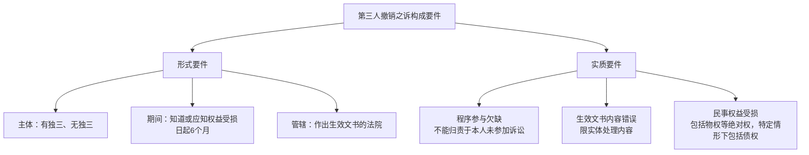
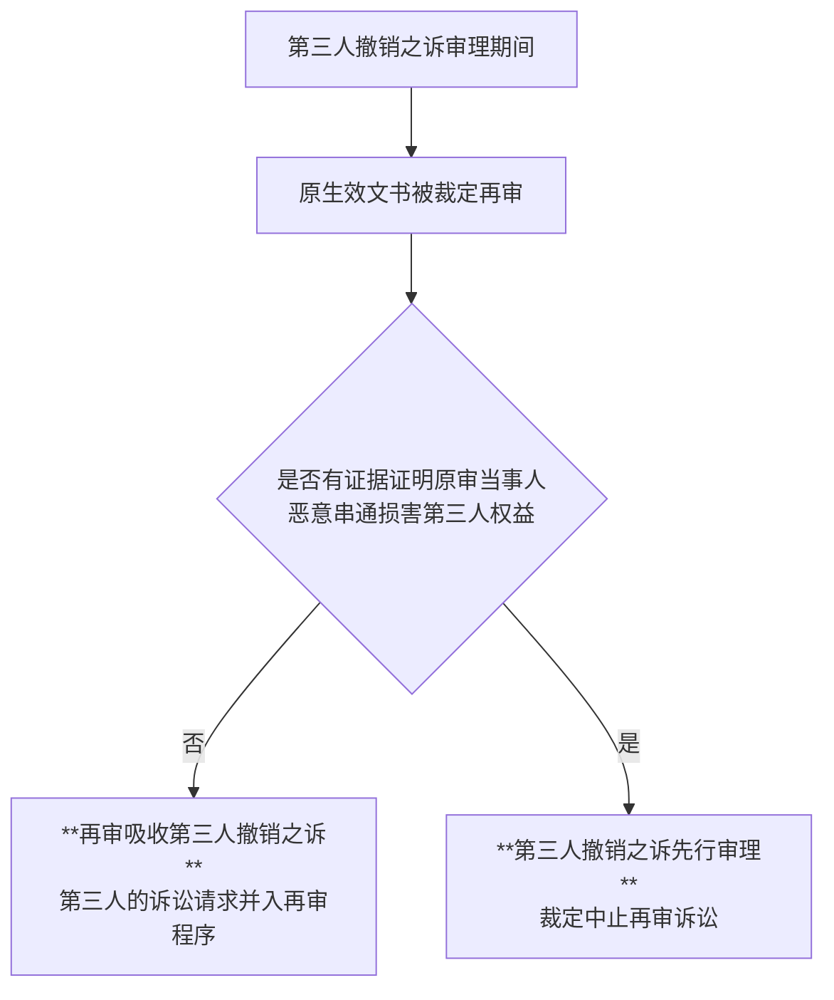
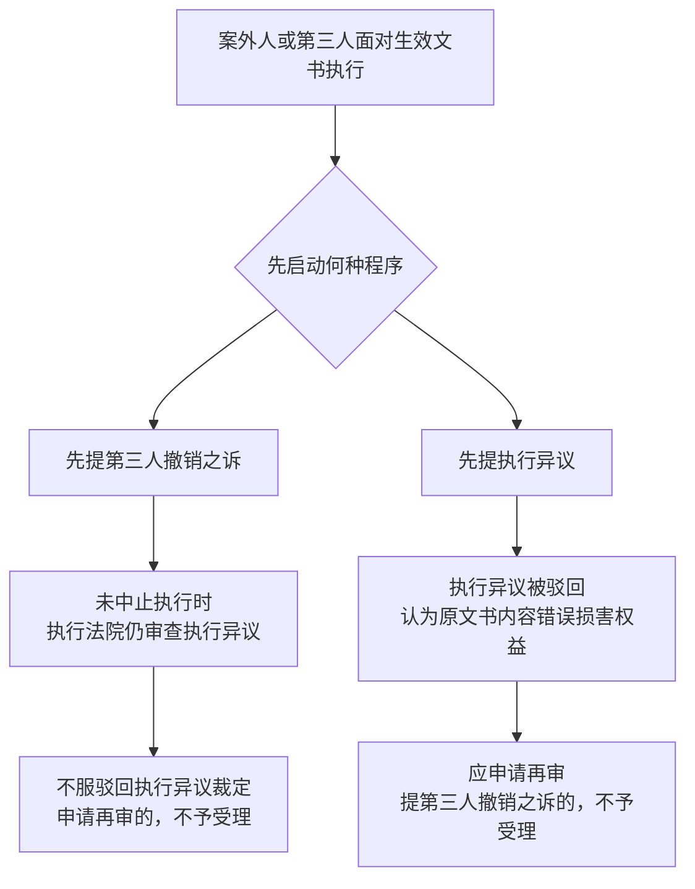

# 第三人撤销之诉

> [!abstract]
> 第三人撤销之诉的中心问题是：未进入原诉程序的第三人，能否以独立起诉方式撤销已经生效的判决、裁定、调解书。复习主线可压缩为四组判断：`主体限第三人`、`客体限生效裁判和调解书`、`错误限实体处理内容`、`程序选择一经启动即受限制`。

---

## 一、第三人撤销之诉概述

### （一）概念

第三人撤销之诉，是指由于不可归责于本人的事由而未能参加诉讼的第三人，针对法院所作出的存在错误并损害自己利益的判决、裁定、调解书，将生效司法文书中的双方当事人作为被告，以提起诉讼的方式，请求法院撤销已经发生法律效力的司法文书的诉讼。

法律依据的核心是《民事诉讼法》[[民事诉讼法#第五十九条-第3款|第59条第3款]]和《民诉法解释》[[民事诉讼法#第二百九十条|第290条]]以下。

### （二）制度目的

- **直接目的**：打击恶意诉讼、虚假诉讼、冒名诉讼。
- **深层问题**：[[X 第一审普通程序#3. 既判力|既判力]]的相对性与第三人权利保障之间的紧张关系。
- **制度定位**：在原诉未能吸纳第三人时，以事后独立救济弥补程序参与欠缺。

### （三）性质与特征

| 特征        | 内容                                                      |
| --------- | ------------------------------------------------------- |
| 诉讼法上的形成之诉 | 诉讼内容是撤销或改变他人之间的生效判决、裁定、调解书，诉讼标的是诉讼法上的形成权                |
| 特殊救济程序    | 针对已经发生法律效力的司法文书，性质上接近再审程序[^1]                           |
| 事后救济程序    | 有独立请求权第三人、无独立请求权第三人制度属于事前程序保障； 第三人撤销之诉以裁判生效为界，属于事后补救 |

---

## 二、第三人撤销之诉的构成要件

### （一）当事人

1. **原告**：第三人。
   - 有独立请求权第三人。
   - （被判决承担责任的）无独立请求权第三人。
2. **被告**：生效判决、裁定、调解书的当事人。
3. **第三人**：生效判决、裁定、调解书中**没有承担责任**的无独立请求权第三人。

> [!caution] 当事人列明
> 第三人提起撤销之诉，人民法院应当将该第三人列为原告，生效文书的当事人列为被告；但生效文书中没有承担责任的无独立请求权第三人列为第三人。

### （二）除斥期间

- 第三人可以自知道或者应当知道其民事权益受到损害之日起**6个月内**提起诉讼。
	- 该期间服务于生效裁判稳定性，复习时应与案外人申请再审的6个月期间并列记忆。

### （三）管辖法院

- 向作出该`判决、裁定、调解书`的人民法院提起诉讼。
- 管辖设计体现对原生效文书的集中审查。

### （四）程序参与欠缺

第三人**因不能归责于本人的事由**未参加诉讼，是指没有被列为生效判决、裁定、调解书当事人，且无过错或者无明显过错。

典型情形：

1. 不知道诉讼而未参加。
2. 申请参加未获准许。
3. 知道诉讼，但因客观原因无法参加。
4. 其他不能归责于本人的事由。

### （五）生效裁判和调解书内容错误

第三人须有证据证明发生法律效力的`判决、裁定、调解书`的部分或者全部内容错误。

#### 1. 错误类型限于实体处理内容

- 内容错误以实体权利义务关系的判断为准。
	- 主要包括`事实认定错误`和`法律适用错误`。
- 不包括程序内容错误。

> [!tip] 与再审的区别
> 再审可以围绕程序错误展开；第三人撤销之诉中的“内容错误”限于生效文书的实体处理内容。

#### 2. 错误范围限于主文和调解结果

- 判决、裁定的“内容”指裁判主文。
- 调解书的“内容”指处理当事人民事权利义务的结果。
- 裁判理由中的判断通常不是撤销之诉直接攻击对象。

#### 3. 不予受理的排除范围

| 排除类型 | 规则 |
|----------|------|
| 非讼程序 | 适用特别程序、督促程序、公示催告程序、破产程序等非讼程序处理的案件 |
| 身份关系 | 婚姻无效、撤销或者解除婚姻关系等文书中涉及身份关系的内容 |
| 代表人诉讼 | 未参加登记的权利人对代表人诉讼案件的生效裁判 |
| 公益诉讼 | 损害社会公共利益行为的受害人对公益诉讼案件的生效裁判 |

### （六）第三人民事权益受损

第三人撤销之诉保护的“民事权益”包括：

- 物权等绝对权；
- 特定情形下的债权。

> [!quote] 债权人的第三人撤销之诉
> 《全国法院民商事审判工作会议纪要》第120条认为，第三人撤销之诉中的第三人一般不包括债权人；但在特定情形下，债权人可以提起第三人撤销之诉。
>>[!note] 债权人可提起第三人撤销之诉的典型情形：
>> 
>> 1. **法律**明确给予**特殊保护的债权**，如`建设工程价款优先受偿权`、`船舶优先权`。
>> 2. 因生效裁判确定债务人与他人的权利义务，导致债权人本可行使**撤销权而不能行使**。
>> 3. 债权人`有证据`证明`裁判文书主文`确定的**债权内容**部分或者全部**虚假**。

---

## 三、客体与审理程序

### （一）客体

第三人撤销之诉的客体是已经发生法律效力的：

- 判决；
- 裁定；
- 调解书。

### （二）第三人提起诉讼

第三人应当提交起诉状。起诉状及材料通常应包括：

1. 诉讼当事人及其代理人。
2. 请求改变或撤销的判决书、裁定书、调解书。
3. 改变或撤销生效文书内容的诉讼请求。
4. 不能归责于本人未参加诉讼、原生效文书内容错误、第三人民事权益受损的证据材料。
5. 起诉符合法定期限的声明和证据。

人民法院应当在收到起诉状和证据材料之日起**5日内**送交对方当事人；对方当事人可以自收到起诉状之日起**10日内**提出书面意见。

### （三）立案审查与受理

| 阶段   | 规则                                 |
| ---- | ---------------------------------- |
| 审查方式 | 审查起诉状、证据材料和对方当事人的书面意见；必要时可以询问双方当事人 |
| 受理期限 | 符合起诉条件的，自收到起诉状之日起**30日内**立案        |
| 不予受理 | 不符合起诉条件的，自收到起诉状之日起**30日内**裁定不予受理   |
| 中止执行 | 受理后，原告提供相应担保并请求中止执行的，人民法院可以准许[^2]  |

### （四）审理方式

- 人民法院对第三人撤销之诉案件，应当组成合议庭开庭审理。
- 第三人撤销之诉的审理，适用[[X 第一审普通程序|一审普通程序]]。
- 因关系生效裁判稳定性，**不适用**简易程序、小额诉讼程序。

### （五）裁判方式

| 审理结果                           | 裁判方式                |
| ------------------------------ | ------------------- |
| 诉讼请求成立，且确认其民事权利的主张全部或部分成立      | 改变原判决、裁定、调解书内容的错误部分 |
| 诉讼请求成立，但确认其民事权利的主张不成立，或未提出确认请求 | 撤销原判决、裁定、调解书内容的错误部分 |
| 诉讼请求不成立                        | 驳回诉讼请求              |

第三人撤销之诉裁判的效力：

1. 当事人可以上诉。
2. 被改变或者撤销的部分，对原当事人和第三人无效。
3. 未改变或者未撤销的部分继续有效。

---

## 四、对虚假诉讼原案当事人的制裁

第三人根据民事诉讼法规定提起撤销之诉，经审查，原案当事人之间恶意串通进行虚假诉讼的，适用民事诉讼法关于妨害民事诉讼的相关规定处理。

---

## 五、第三人撤销之诉与当事人申请再审

### （一）并行时的处理规则

**原则**：==再审吸收第三人撤销之诉==。第三人撤销之诉案件审理期间，人民法院对生效判决、裁定、调解书**裁定再审**的，受理第三人撤销之诉的人民法院应当裁定`将第三人的诉讼请求并入再审程序`。

**例外**：有证据证明原审当事人之间恶意串通损害第三人合法权益的，第三人撤销之诉先行审理，裁定`中止再审诉讼`。

### （二）并入再审程序后的处理

| 再审适用程序 | 处理 |
|--------------|------|
| 按第一审程序审理 | 人民法院应当对第三人的诉讼请求一并审理，所作判决可以上诉 |
| 按第二审程序审理 | 人民法院可以调解；调解不成的，应裁定撤销原判决、裁定、调解书，发回一审法院重审，重审时列明第三人 |

---

## 六、第三人撤销之诉与案外人申请再审

### （一）制度对比

| 维度          | 第三人撤销之诉                               | 案外人申请再审                                         |
| ----------- | ------------------------------------- | ----------------------------------------------- |
| 制度目的        | 打击恶意诉讼、虚假诉讼、冒名诉讼                      | 打击恶意诉讼、虚假诉讼、冒名诉讼                                |
| 理论基础        | 辩论主义和处分权主义的不足，既判力的扩张                  | 辩论主义和处分权主义的不足，既判力的扩张                            |
| 针对对象        | 已经发生法律效力的判决、裁定、调解书                    | 已经发生法律效力的判决、裁定、调解书                              |
| 提出主体        | 第三人                                   | 案外人                                             |
| 管辖法院        | 作出生效判决、裁定、调解书的人民法院                    | 作出生效判决、裁定、调解书的人民法院                              |
| 提出时间        | 知道或者应当知道其民事权益受到损害之日起6个月内              | 执行异议裁定送达之日起6个月内                                 |
| 提起条件        | 因不能归责于本人的事由未参加诉讼；生效文书内容错误；错误内容损害其民事权益 | 案外人的执行异议申请被人民法院裁定驳回；案外人、当事人对裁定不服，认为原判决、裁定错误     |
| 当事人结构       | 原告为第三人；被告为生效文书当事人；未承担责任的无独三列为第三人      | 申请人为案外人；被申请人为再审申请针对的人；原审其他当事人按原审地位列明            |
| 审理程序        | 普通程序                                  | 按第一审程序或第二审程序审理                                  |
| 立案或审查期限     | 收到起诉状之日起30日内决定是否立案                    | 收到再审申请书之日起3个月内审查，特殊情况可延长                        |
| 原生效文书是否中止执行 | 受理后原告提供相应担保并请求中止执行的，法院可以准许            | 决定再审后裁定中止执行；追索赡养费、扶养费、抚养费、抚恤金、医疗费用、劳动报酬等案件可以不中止 |
| 裁判结果        | 改变、撤销、驳回                              | 维持、撤销、改变                                        |
| 能否上诉        | 可以上诉                                  | 按二审程序审理的不能再上诉；按一审程序审理的可以上诉                      |

### （二）执行程序中的选择限制

> [!caution] 程序启动后不享有程序选择权
> 案外人申请再审与第三人撤销之诉功能相近。民诉法司法解释采取限制态度：按启动程序先后确定救济路径，避免案外人在两个程序之间反复切换。

---

## 课后练习

### 名词解释

- 第三人撤销之诉 ★★★★

### 简答

| 题目 | 重要程度 |
|------|----------|
| 提起第三人撤销之诉的条件 | ★★★★ |
| 第三人撤销之诉与当事人申请再审 | ★★★ |
| 第三人撤销之诉与执行异议 | ★★★ |
| 第三人撤销之诉的程序 | ★★★ |

### 论述

| 题目 | 重要程度 | 真题提示 |
|------|----------|----------|
| 第三人撤销之诉和案外人申请再审制度的目的、内容及其联系与区别 | ★★★★★ | 2021-法综701 |
| 第三人撤销之诉的制度价值及主要内容 | ★★★★ | 2019-民诉与仲裁806 |

[^1]: 但是与之不同的是，三撤之诉是一阶构造。

[^2]: 由于没有审查程序，所以原则上不中止，而再审则原则上中止执行。
