# XVI 非讼程序

非讼程序处理的是`非争议事项`，目的不是解决民事纠纷，而是从法律上确认申请人是否享有某项民事权益，或者确认某项民事法律事实是否存在。其基本结构是：没有典型的原告、被告对抗，法院职权调查和程序控制更强，裁判多以确认、形成或执行依据为功能中心。

| 程序类型 | 核心功能 | 裁判形式 | 复习关键词 |
| --- | --- | --- | --- |
| 特别程序 | 确认身份、状态、财产归属或非争议权益 | 判决 / 裁定 | 一审终审、独任为主、权益争议即终结 |
| 督促程序 | 以支付令催促清偿金钱或有价证券债务 | 支付令 | 15日异议、支付令失效、转入诉讼 |
| 公示催告程序 | 保护丧失票据的最后持有人，消灭丧失票据效力 | 除权判决 | 止付、公告、申报权利、除权判决 |

> [!tip]
> 本讲考试权重集中在四组：`司法确认`、`实现担保物权`、`支付令/支付令异议`、`公示催告/除权判决`。特别程序中的选民资格、宣告失踪死亡、认定行为能力、认定财产无主更适合用表格掌握条件和期间。

---

# 一、非讼程序总论

## （一）非讼程序的概念

- `民事非讼程序`是处理民事非讼案件的程序。
- 非讼程序处理`非争议事项`：
  - 主要不是解决当事人之间已经形成的民事纠纷；
  - 主要是确认某项民事权益、民事法律事实、法律状态或执行依据。
- 非讼程序通常不存在对立的双方当事人，或者不存在明确的双方当事人对立状态。

## （二）非讼程序的类型

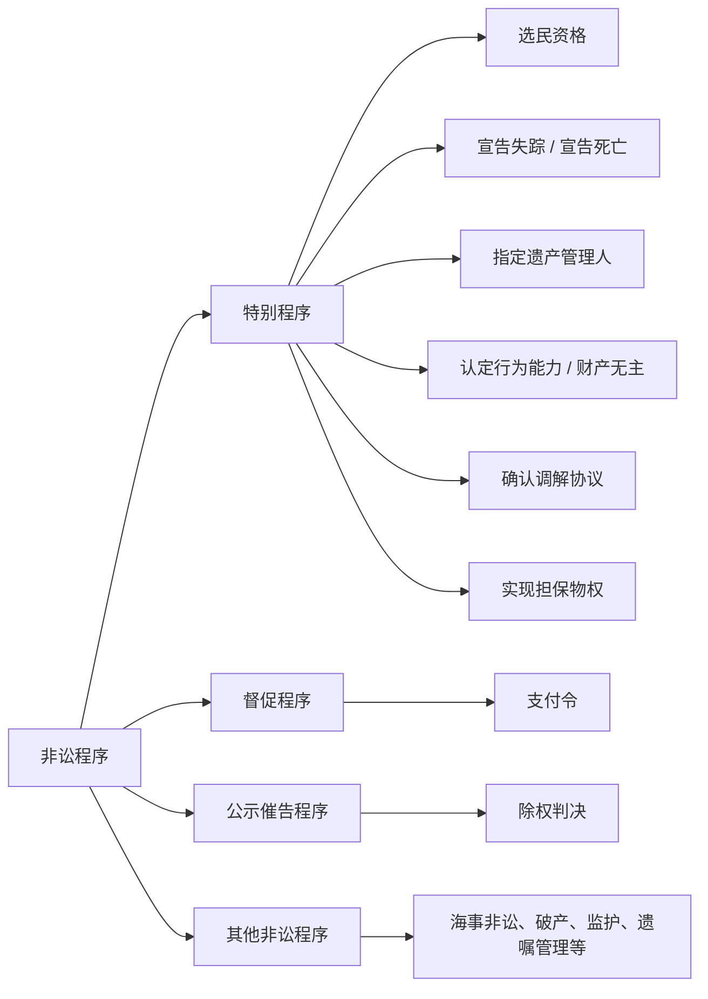

1. 《民事诉讼法》规定的非讼程序：
   - 特别程序：选民资格、宣告失踪或死亡、指定遗产管理人、认定无/限制民事行为能力、认定财产无主、确认调解协议、实现担保物权。
   - 督促程序：作出支付令。
   - 公示催告程序：作出除权判决。
2. 《海事诉讼特别程序法》规定的海商事非讼程序：
   - 海商事督促程序和公示催告程序；
   - 设立海事赔偿责任限制基金程序；
   - 债权登记与受偿程序；
   - 船舶优先权催告程序。
3. 其他法律规定的非讼程序：
   - 破产清算、破产和解、破产重整；
   - 合伙企业、农民专业合作社清算相关申请；
   - 指定或撤销监护、指定失踪人财产代管人、指定遗嘱管理人、宣告婚姻无效等。

## （三）非讼程序的基本法理

| 法理 | 含义 |
| --- | --- |
| 职权主义为主 | 限制当事人主义，法院可依职权干预、探知和推进程序 |
| 书面审理主义为主 | 程序审查通常不以完整对席辩论和开庭审理为中心 |
| 不公开审理主义为主 | 与诉讼程序的公开审判原则不同 |
| 自由证明 | 证明方式更灵活，不完全受严格证明规则拘束 |

职权主义在非讼程序中的表现：

1. `职权干预主义`：法院可以变更或超出申请人请求的内容和范围作出裁判。
2. `职权探知主义`：法院依职权主动收集证据和调查事实。
3. `职权进行主义`：程序虽因申请开始，申请人也可依法撤回申请，但非讼事项更多由法院决定。

> [!caution]
> 非讼程序不是“简化版诉讼程序”。其关键分界在于是否存在实质性民事权益争议；一旦争议显现，非讼程序通常应退出，转由普通争讼程序处理。

---

# 二、特别程序

## （一）共同规则

依据《民事诉讼法》第184至187条，特别程序的共同规则可压缩为六项：

| 规则     | 内容                                                                                | 复习抓手               |
| ------ | --------------------------------------------------------------------------------- | ------------------ |
| 一审终审   | 依特别程序审理的案件实行一审终审                                                                  | 不得上诉               |
| 审判组织   | 原则上[[IV 民诉法的基本制度#三、独任制\|独任]]；选民资格或重大、疑难案件由审判员组成[[IV 民诉法的基本制度#3. 不得适用独任制的案件\|合议庭]] | 独任为主、合议为例外         |
| 审限     | 立案之日起30日内，或公告期满后30日内审结；特殊情况由本院院长批准                                                | 选民资格除外             |
| 权益争议处理 | 发现属于民事权益争议，裁定终结特别程序，告知另行起诉                                                        | 非讼转争讼              |
| 诉讼费用   | 不交纳案件受理费                                                                          | 与普通诉讼区分            |
| 特殊救济   | 判决、裁定有错误，可向作出法院提出异议                                                               | 异议成立则作出新判决/裁定撤销或改变 |

> [!caution]
> 特别程序的救济不是上诉，也不是通常意义上的再审。讲义特别提示：确认调解协议、准许实现担保物权等裁定，不得上诉、申请再审或提起第三人撤销之诉。

## （二）特别程序各案型速查

|            案型            |          申请/起诉主体           |                            管辖                            |                           关键期间或条件                            |                 裁判/效果                 |
| :----------------------: | :------------------------: | :------------------------------------------------------: | :----------------------------------------------------------: | :-----------------------------------: |
|           选民资格           | 公民；可为选民本人或其他公民，不能是法人或其他组织  |                   选区所在地基层法院（**合议庭审理**）                   |   先向选举委员会申诉； 选举日5日前起诉； 选举日前审结 起诉人、选委会代表和有关公民必须参加    |    **判决书**选举日前送达选举委员会和起诉人，并通知有关公民     |
| [[1. 自然人#（一）宣告失踪\|宣告失踪]] |           利害关系人            |                     **下落不明人**住所地基层法院                     |             下落不明满2年； 利害关系人提出书面申请 公告3个月              | **判决**宣告失踪或驳回申请；宣告失踪时清理财产，指定**财产代管人** |
| [[1. 自然人#（二）宣告死亡\|宣告死亡]] |           利害关系人            |                     **下落不明人**住所地基层法院                     |        一般满4年；意外事件满2年；意外且证明不可能生存可不受2年限制；公告通常1年，特殊意外3个月        |            婚姻关系自然消灭，财产依法继承            |
|         指定遗产管理人          |           利害关系人            | **被继承人**[[V 法院主管和管辖#2. 国内专属管辖的典型范围\|死亡时住所地或主要遗产所在地基层法院]] | 对遗产管理人的确定有争议 →确定之后，遗产管理人死亡的可以换掉[^1] →严重违法管理职责的可以换掉[^2] |          按**有利于遗产管理原则**判决指定           |
|       认定无/限制民事行为能力       | 利害关系人或有关组织（不能作为被认定人的诉讼代理人） |                        该公民住所地基层法院                        |                必要时鉴定；确定诉讼代理人时，本人健康情况许可的询问本人意见                |      判决认定或驳回； 原因消除后可新判决撤销原判决       |
|          认定财产无主          |         公民、法人或其他组织         |                        财产所在地基层法院                         |                          公告满1年无人认领                           |          判决认定财产无主，收归国家或集体所有           |
|        ==确认调解协议==        |         双方当事人共同申请          |              依先行调解法院、住所地、标的物所在地、调解组织所在地等确定               |                        调解协议生效之日起30日内                         |            裁定调解协议有效，可申请执行             |
|        ==实现担保物权==        |    担保物权人及其他有权请求实现担保物权的人    |                   担保财产所在地或担保物权登记地基层法院                    |                         条件成就且无实质性争议                          |           裁定准许拍卖、变卖；可作为执行依据           |

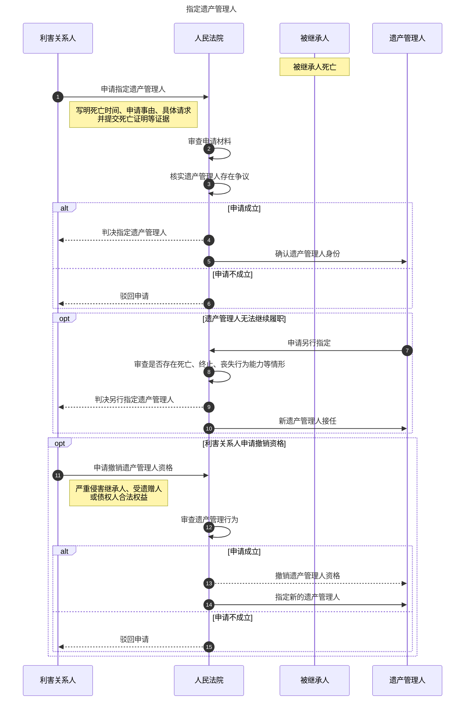

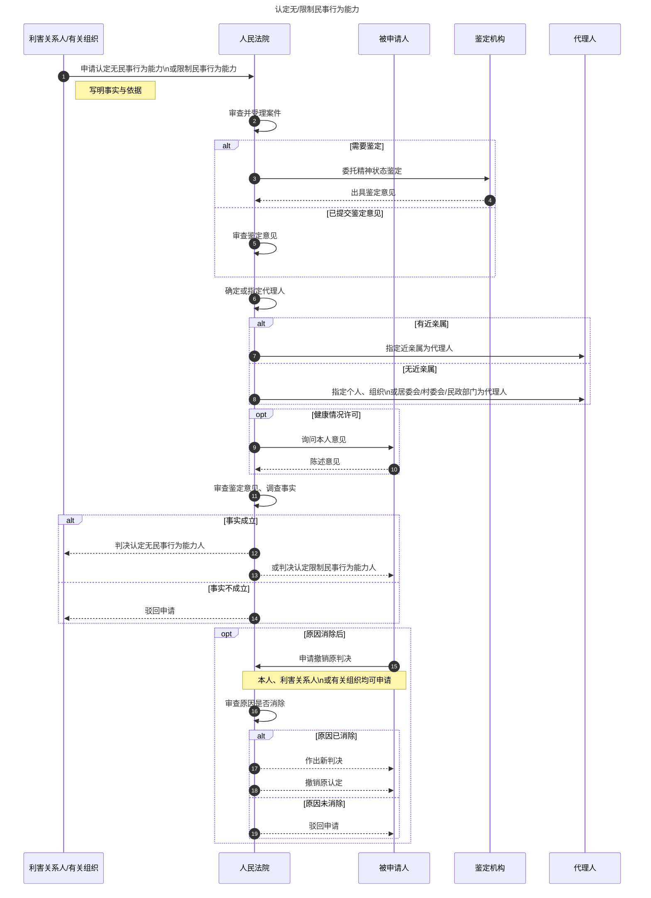

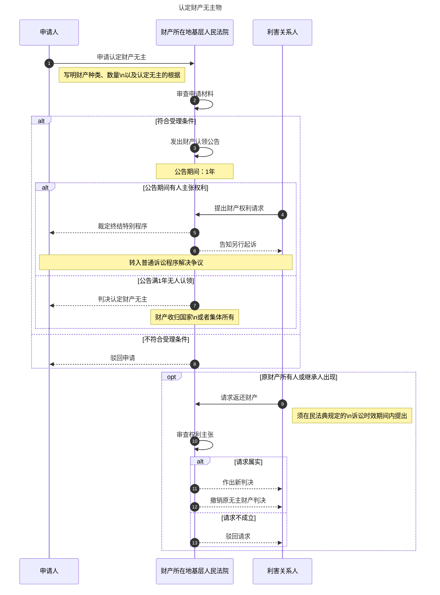

## （三）宣告失踪与宣告死亡的差异

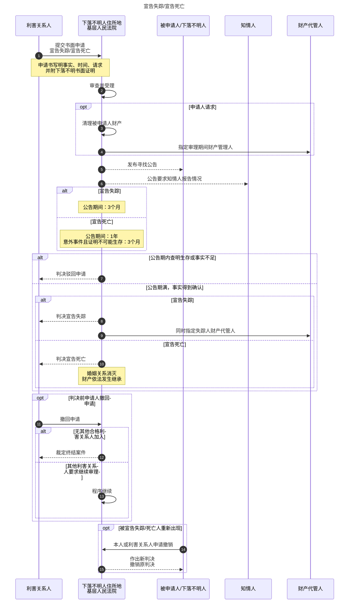

| 比较点    | 宣告失踪                      | 宣告死亡                              |
| ------ | ------------------------- | --------------------------------- |
| 下落不明期间 | 满2年                       | 一般满4年；意外事件满2年；意外事件且证明不可能生存时适用特别规则 |
| 公告期间   | 3个月                       | 1年；意外事件且证明不可能生存的为3个月              |
| 核心效果   | 指定财产代管人；婚姻关系仍存在；民事权利能力不丧失 | 婚姻关系自然消灭；财产可依法继承                  |
| 重新出现   | 本人或利害关系人申请，法院作出新判决撤销原判决   | 同样可由新判决撤销原判决                      |

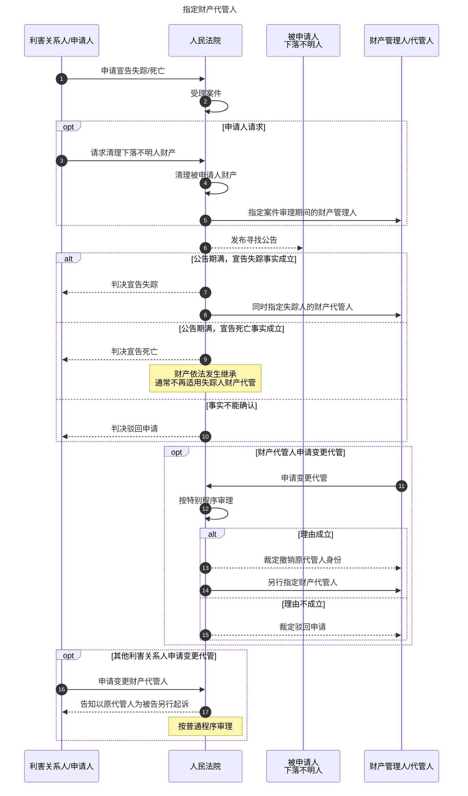

> [!tip]
> 宣告失踪解决“财产管理”问题，宣告死亡解决“法律人格后果”问题。二者均以公告寻找为核心程序保障。

## （四）确认调解协议程序

### 1. 概念与性质

`确认调解协议程序`，又称`司法确认程序`，是法院根据双方当事人的共同申请，对经依法设立的调解组织调解达成的调解协议进行审查，并确认其具有强制执行效力的程序。其性质属于非讼程序。

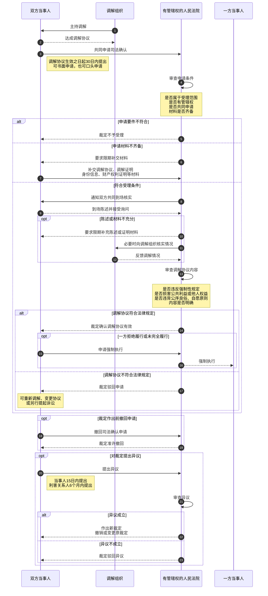

### 2. 申请条件

| 条件    | 规则                                                                                                                                              |
| ----- | ----------------------------------------------------------------------------------------------------------------------------------------------- |
| 案件范围  | 必须是经依法设立的**调解组织**调解达成的调解协议                                                                                                                      |
| 主体    | 双方当事人共同申请；本人或符合民诉法规定的代理人提出                                                                                                                      |
| 期限    | 自**调解协议生效之日**起`30日`内                                                                                                                            |
| 管辖    | **先行调解的**，向`作出邀请的法院`提出； **自行调解的**，向`当事人住所地、标的物所在地、调解组织所在地基层法院`提出； **应由中院管辖的**，向相应`中院`提出 **两个调解组织同时申请**，[[V 法院主管和管辖#七、共同管辖与选择管辖\|共同管辖]] |
| 形式与材料 | 可书面或口头申请；提交调解协议、调解组织主持调解证明、财产权利证明及身份住所联系方式等材料                                                                                                   |

不予受理的典型情形：

1. 不属于人民法院受理范围。
2. 不属于收到申请的法院管辖。
3. ==申请确认婚姻关系、亲子关系、收养关系等身份关系**无效、有效或解除**。==
4. ==调解协议内容涉及物权、知识产权确权。==
5. 涉及适用其他[[XVI 非讼程序#二、特别程序|特别程序]]、[[XVI 非讼程序#四、公示催告程序|公示催告程序]]、破产程序审理。

### 3. 审查与处理

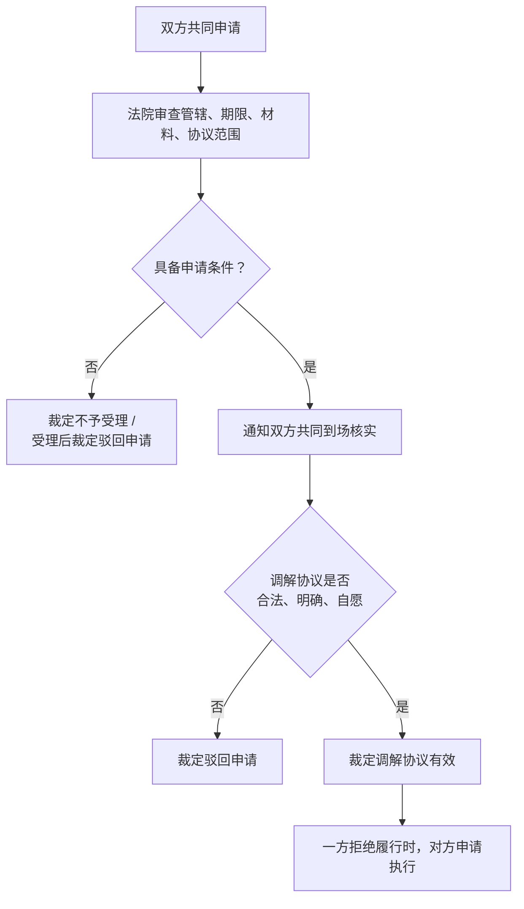

应裁定驳回申请的情形：

- 违反合法原则
	- **违反法律强制性规定**。
	- **损害国家利益、社会公共利益、他人合法权益。**
	- **违背公序良俗**。
- **违反自愿原则**。
- 不具有可执行性
	- **内容不明确**。
- 其他不能进行司法确认的情形。

### 4. 终结与救济

- 裁定作出前，当事人撤回申请的，法院可以裁定准许。
- 无正当理由未在限期内补充陈述、补充证明材料，或拒不接受询问的，可按撤回申请处理。
- 裁定确认调解协议有效后，一方拒绝履行或未全部履行的，对方可申请执行。
- 异议
	- 当事人对确认调解协议裁定有异议的，自收到裁定之日起15日内提出；
	- 利害关系人有异议的，自知道或应当知道其权益受到侵害之日起6个月内提出。

## （五）实现担保物权程序

### 1. 概念与制度定位

**实现担保物权案件**，是担保物权人在债务人不履行到期债务，或者发生当事人约定的实现担保物权情形时，担保物权人与债务人、担保人不能自行实现，经申请由法院作出实现担保物权的裁定，并强制拍卖、变卖担保财产的案件。

实现担保物权有两条路径：

| 路径   | 结构                 | 特点               |
| ---- | ------------------ | ---------------- |
| 自力救济 | 抵押权人与抵押人协议折价、拍卖、变卖 | 协议不得损害其他债权人利益    |
| 公力救济 | 请求法院拍卖、变卖担保财产      | 可分为诉讼裁判模式与非讼裁判模式 |

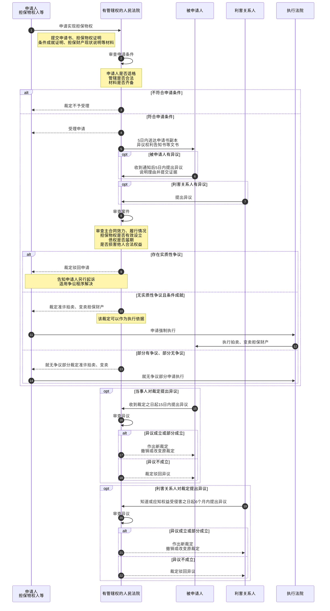

依据讲义“实现担保物权程序”：申请、受理、5日内送达、异议、审查、裁定拍卖变卖、执行与异议救济。

### 2. 申请条件

| 条件     | 内容                                                                |
| ------ | ----------------------------------------------------------------- |
| 申请人适格  | 抵押权人、质权人、留置权人；抵押人、出质人、财产被留置的**债务人**或**所有权人**等其他有权请求实现担保物权的人       |
| 管辖合法   | 担保财产所在地或担保物权登记地基层法院； 有权利凭证的权利质权案件，可以有权利凭证持有人住所地法院管辖、 海事专门管辖 |
| 材料合法   | 申请书、证明担保物权存在的材料、实现条件成就材料、担保财产现状说明及法院认为需要的其他材料                     |
| 无实质性争议 | 对主债权效力、担保物权成立、范围、实现条件等无实质性争议，或仅存在部分争议                             |

> [!caution]
> 被担保债权既有物保又有人保，且[[VII 担保物权#（三）混合担保与多重担保|当事人对实现顺序有约定的]]，申请违反该约定时，法院裁定不予受理；没有约定或约定不明的，应予受理。

### 3. 审查与裁判

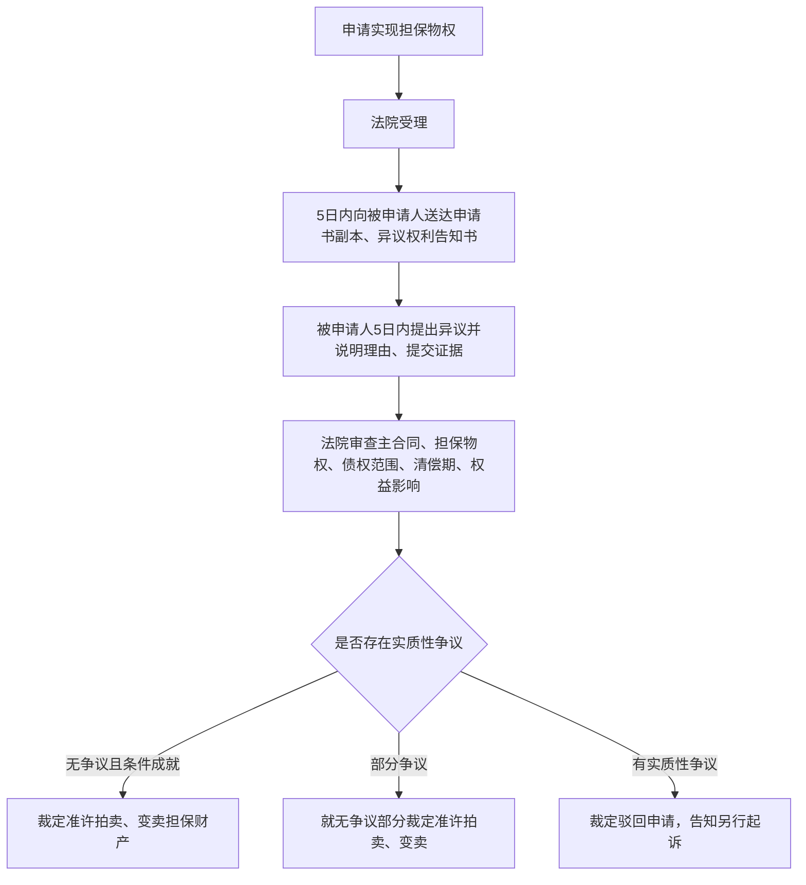

审判组织：

- 原则上可由审判员一人独任审查。
- 担保财产标的额超过基层法院管辖范围的，应组成合议庭审查。

裁定效果：

- 准许拍卖、变卖担保财产的裁定，是执行依据或执行名义。
- 当事人可在申请执行时效期间内，向作出裁定的法院或与其同级的被执行财产所在地法院申请执行。

### 4. 救济

- 适用特别程序作出的判决、裁定有错误的，当事人、利害关系人可向作出法院提出异议。
- 对准许实现担保物权裁定：
  - 当事人异议期间：收到裁定之日起15日；
  - 利害关系人异议期间：知道或应当知道权益受侵害之日起6个月。

---

# 三、督促程序

## （一）概念

**督促程序**，又称`支付令程序`，是法院根据债权人的申请，向债务人发出支付令，责令债务人限期履行给付金钱或有价证券义务；债务人在法定期间内不提出异议，或异议被驳回的，支付令发生执行力。

制度功能在于：对债权债务关系明确、争议尚未显现或争议可能性较低的债务清偿事项，以低成本的略式程序替代完整诉讼；一旦债务人提出有效异议，再退出或转入诉讼程序。

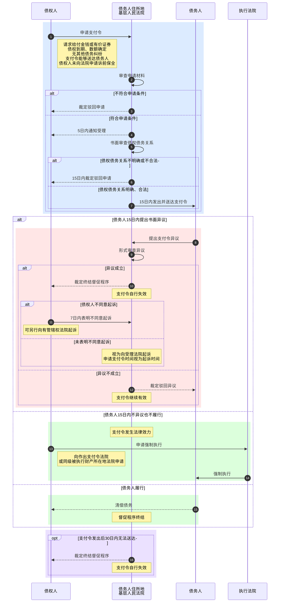

## （二）支付令申请条件

| 条件   | 规则                                          |
| ---- | ------------------------------------------- |
| 给付范围 | 金钱；汇票、本票、支票、股票、债券、国库券、可转让存款单等有价证券           |
| 债权状态 | 已到期、数额确定，并写明事实和证据                           |
| 债务关系 | 债权人与债务人没有其他债务纠纷；债权人没有对待给付义务                 |
| 送达条件 | 债务人在我国境内且未下落不明；支付令能够送达                      |
| 管辖   | 债务人住所地基层法院；两个以上法院均有管辖权的，可择一申请；多个申请由最先立案法院管辖 |
| 保全限制 | 债权人未向人民法院申请诉前保全                             |
| 申请形式 | 书面申请，写明给付数量和所根据的事实、证据                       |

> [!caution]
> 支付令不能公告送达。能够送达通常指直接送达或留置送达可以实际送达债务人。

## （三）法院受理与审查

- 债权人提出申请后，法院应在5日内通知是否受理。
- 申请书不符合要求的，可通知限期补正；法院自收到补正材料之日起5日内通知是否受理。
- 受理后由审判员一人审查，审查方式以书面审查为主，必要时可询问债权人和证人。
- 受理后发现不符合申请或受理条件的，应在受理之日起15日内裁定驳回申请。
- 债权债务关系明确、合法的，应在受理之日起15日内向债务人发出支付令。

裁定驳回申请的典型情形：**不能有争议**

1. 申请人不具备当事人资格。
2. 证明文件没有约定逾期给付利息、违约金、赔偿金，债权人坚持要求给付。
3. 要求给付的金钱或有价证券属于违法所得。
4. 要求给付的金钱或有价证券尚未到期或数额不确定。

## （四）支付令的效力

| 效力 | 含义 |
| --- | --- |
| 羁束力 | 支付令一经宣告，法院原则上不得任意撤销或变更 |
| 督促力 | 促使债务人在法定期间清偿债务或提出异议 |
| 形式确定力 | 支付令不得上诉 |
| 附条件的既判力和执行力 | 债务人收到支付令15日内不提出书面异议或异议被驳回时，支付令发生确定效力和执行力 |

## （五）支付令异议

### 1. 异议成立条件

| 条件 | 规则 |
| --- | --- |
| 主体 | 债务人 |
| 期间 | 收到支付令之日起15日内 |
| 形式 | 书面提出；口头异议无效 |
| 对象 | 针对债务本身或债权人的债权提出 |
| 法院 | 向作出支付令的法院提出 |

不构成有效异议的典型情形：

- 债务人未在法定期间内提出书面异议，而向其他法院起诉。
- 超过法定期间提出异议。
- 仅主张缺乏清偿能力、延缓清偿期限、变更清偿方式等，不否认债务本身。

### 2. 异议审查与效果

经形式审查，存在以下情形之一的，应认定异议成立，裁定终结督促程序，支付令自行失效：

1. 存在不予受理支付令申请的情形。
2. 存在裁定驳回支付令申请的情形。
3. 存在应当裁定终结督促程序的情形。
4. 法院对是否符合发出支付令条件产生合理怀疑。

特殊效果：

- 同一申请中有多项支付请求，债务人仅对部分请求提出异议的，不影响其他请求效力。
- 就可分之债向多个债务人提出支付请求，部分债务人提出异议的，不影响其他请求效力。

## （六）支付令失效

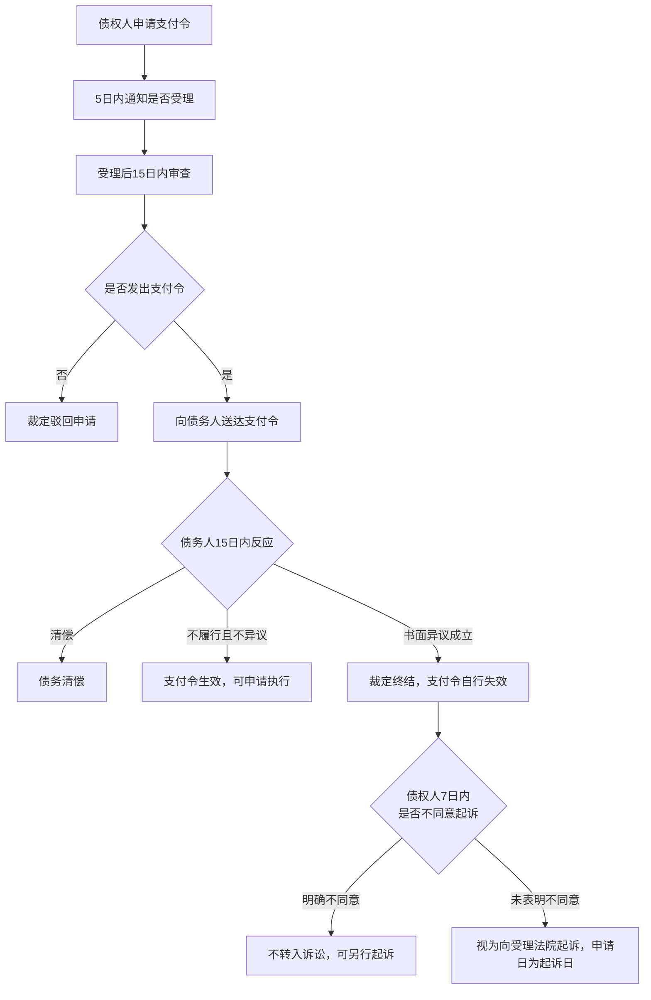

支付令失效的主要情形：

- 法院受理支付令申请后，债权人就同一债权债务关系又提起诉讼。
- 法院发出支付令之日起30日内无法送达债务人。
- 债务人收到支付令前，债权人撤回申请。
- 债务人书面异议成立。
- 生效支付令确有错误，经院长提交审判委员会讨论决定后撤销。
- 对设有担保的债务向主债务人发出支付令后，债权人就担保关系单独起诉的，支付令自法院受理该诉之日起失效。

支付令失效的，自动转入诉讼程序，除非申请人不同意

## （七）支付令终结

支付令终结

（1） 支付令申请因不具备申请条件或受理条件，人民法院裁定不予受理或者被裁定驳回的；

（2） 支付令申请因不具备发出支付令的要件，被人民法院裁定驳回的；

（3）在发出支付令前，债权人撤回申请的；（人民法院作出终结督促程序或者驳回异议裁定前，债务人请求撤回异议的，应当裁定准许。债务人对撤回异议反悔的，人民法院不予支持。）（4） 支付令失效的；

（5）支付令发生法律效力的。

> [!tip]
> 督促程序的主线是“单方申请 -> 法院略式审查 -> 债务人15日选择 -> 生效执行或异议失效”。异议制度是支付令程序的程序保障核心。

---

# 四、公示催告程序

## （一）概念与特点

公示催告程序，是法院依据申请人的申请，将申请的票据以公示方式催告不明利害关系人在公告期间申报权利；逾期无人申报或申报被驳回的，依申请作出除权判决，宣告票据失权的一种非讼程序。

| 特点 | 内容 |
| --- | --- |
| 申请人限定 | 只能是丧失票据前的最后持有人 |
| 范围有限 | 适用于可背书转让票据被盗、遗失、灭失，以及法律规定可申请公示催告的其他事项 |
| 非讼性 | 只有申请人，没有被申请人；不存在民事权益争议 |
| 审理特殊 | 先以公告查明利害关系人是否存在；除权判决须由申请人另行申请 |
| 审判组织特殊 | 公示催告阶段可独任；除权判决阶段应组成合议庭 |

## （二）适用范围与申请条件

适用范围：

1. **按照规定可以背书转让的票据**，包括汇票、本票、支票。
2. **依照法律规定可以申请公示催告的其他事项**，如提单、仓单、股票等。

申请条件：

| 条件  | 规则                                      |
| --- | --------------------------------------- |
| 主体  | 票据被盗、遗失或灭失前的**最后持有人**                   |
| 对象  | 可以背书转让的票据或其他法定事项                        |
| 事由  | 票据被盗、遗失或灭失                              |
| 形式  | 递交申请书，写明票面金额、发票人、持票人、背书人等票据主要内容和申请理由、事实 |
| 管辖  | **票据支付地基层法院**                           |

## （三）审查受理、止付与公告

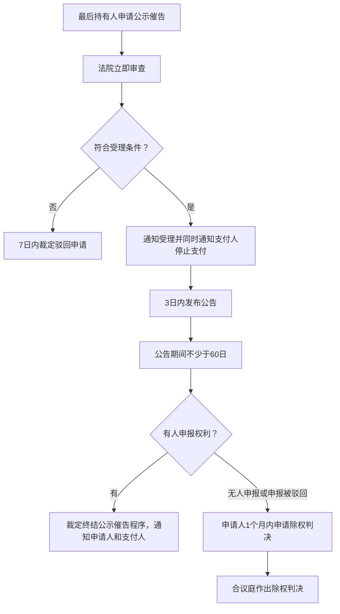

止付通知：

- 法院决定受理申请时，应同时通知支付人停止支付。
- 支付人收到停止支付通知后，应停止支付至公示催告程序终结。
- 公示催告期间，转让票据权利的行为无效。
- 支付人拒不止付的，除可能被采取强制措施外，在判决后仍应承担付款义务。

公告规则：

- 法院决定受理后3日内发出公告。
- **公告期间**：不得少于`60日`，且届满日不得早于`票据付款日`后`15日`。
- 公告应在有关报纸或其他媒体刊登，并同日公布于法院公告栏；法院所在地有证券交易所的，还应同日在交易所公布。

## （四）申报权利

- 利害关系人应在公示催告期间向法院申报。
- 申报期届满后、除权判决作出前申报的，也按申报权利处理。
- 法院收到申报后，应裁定终结公示催告程序，并通知申请人和支付人；申请人或申报人可以起诉。
- 法院应通知申报人出示票据，并通知申请人在指定期间查看。
- 申请公示催告的票据与申报人出示的票据不一致的，裁定驳回申报。

> [!caution]
> 公示催告中法院只作形式审查。出现实质性权利争议时，非讼程序终结，争议交由诉讼程序处理。

## （五）除权判决

### 1. 概念与作出条件

`除权判决`，是在公示催告期间无人申报权利，或申报被驳回后，法院依申请人的申请作出的宣告票据无效的判决。

作出条件：

1. 申报权利期间无人申报，或者申报被驳回。
2. 申请人在公示催告期间届满之日起1个月内申请作出除权判决。
3. 判决宣告票据无效的，应组成合议庭审理。

> [!tip]
> 除权判决必须依申请作出；公告期届满并不自动产生除权判决。申请人逾期1个月不申请的，法院裁定终结公示催告程序。

### 2. 除权判决的效力

| 效力 | 内容 |
| --- | --- |
| 票据失效 | 申请公示催告的票据失效，不再具有票据上的权利 |
| 请求支付 | 自判决公告之日起，申请人有权依据判决向付款人请求支付 |
| 程序终结 | 除权判决作出后，公示催告程序终结 |
| 相对救济 | 利害关系人因正当理由不能在判决前申报的，自知道或应当知道判决公告之日起1年内，可向作出判决的法院起诉 |

正当理由包括：

- 因意外事件或不可抗力无法知道公告事实。
- 被限制人身自由，无法知道公告事实，或虽知道但无法自己或委托他人申报。
- 不属于法定申请公示催告情形。
- 未予公告或未按法定方式公告。
- 其他导致判决作出前未能申报权利的客观事由。

## （六）公示催告程序的终结

后果

## （七）公示催告程序

---

# 后记

## （一）非讼程序与诉讼程序

| 维度 | 非讼程序 | 诉讼程序 |
| --- | --- | --- |
| 事项性质 | 非争议事项、状态确认、执行依据形成 | 民事权益争议 |
| 当事人结构 | 通常无明确双方对抗 | 原告与被告对抗 |
| 程序原则 | 职权主义、书面审理、不公开审理、自由证明为主 | 辩论主义、处分原则、公开审判、严格证明更突出 |
| 争议出现后的处理 | 终结非讼程序，告知起诉或转入诉讼 | 继续以争讼程序解决 |
| 救济 | 多为异议、新判决/裁定、另诉等特殊救济 | 上诉、再审、第三人撤销之诉等依规则适用 |

## （二）特别程序、督促程序、公示催告程序

| 程序 | 启动主体 | 处理对象 | 关键裁判 | 争议出现后的处理 |
| --- | --- | --- | --- | --- |
| 特别程序 | 申请人或起诉人 | 身份、状态、财产归属、协议效力、担保物权实现等 | 判决或裁定 | 裁定终结，告知另行起诉 |
| 督促程序 | 债权人 | 金钱或有价证券给付 | 支付令 | 异议成立则支付令失效，可转入诉讼 |
| 公示催告程序 | 丧失票据前最后持有人 | 可背书转让票据及法定事项 | 除权判决 | 有人申报权利则终结，申请人或申报人另诉 |

## （三）高频期间表

| 事项 | 期间 |
| --- | --- |
| 选民资格案件起诉 | 选举日5日前 |
| 选民资格案件审结 | 选举日前 |
| 特别程序一般审限 | 立案之日起30日内或公告期满后30日内 |
| 宣告失踪公告 | 3个月 |
| 宣告死亡公告 | 一般1年；特殊意外3个月 |
| 认定财产无主公告 | 1年 |
| 申请司法确认调解协议 | 调解协议生效之日起30日内 |
| 实现担保物权中被申请人提出异议 | 收到通知后5日内 |
| 支付令申请受理通知 | 5日内 |
| 支付令发出 | 受理后15日内 |
| 支付令异议/清偿 | 收到支付令之日起15日内 |
| 支付令无法送达失效 | 发出之日起30日内无法送达 |
| 支付令失效后不同意起诉的表示 | 收到终结裁定之日起7日内 |
| 公示催告公告 | 3日内发出；期间不少于60日 |
| 申请除权判决 | 公示催告期间届满之日起1个月内 |
| 利害关系人撤销除权判决之诉 | 知道或应当知道判决公告之日起1年内 |

[^1]: 被指定的遗产管理人死亡、终止、丧失民事行为能力或者存在其他无法继续履行遗产管理职责情形的，人民法院可以根据利害关系人或者本人的申请另行指定遗产管理人。

[^2]: 遗产管理人违反遗产管理职责，严重侵害继承人、受遗赠人或者债权人合法权益的，人民法院可以根据利害关系人的申请，撤销其遗产管理人资格，并依法指定新的遗产管理人。
