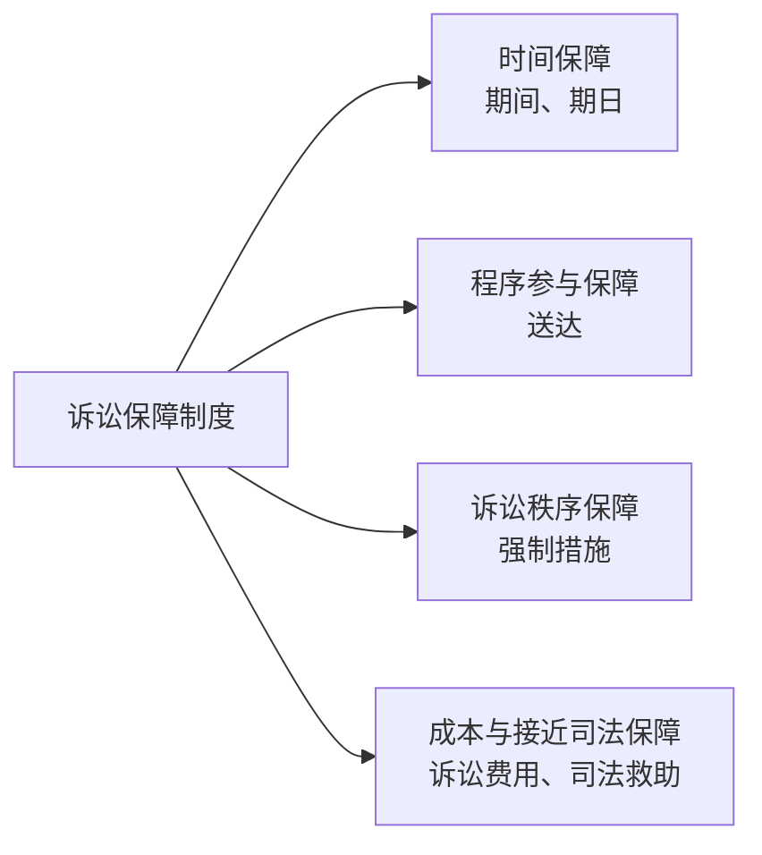
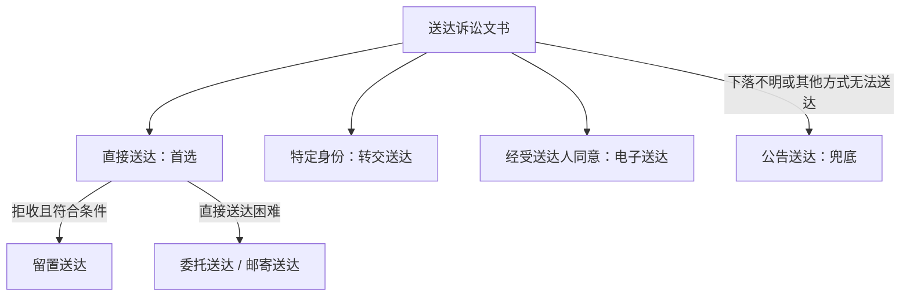

# 第十三讲 诉讼保障制度

诉讼保障制度通过时间控制、程序告知、秩序维护、费用分配与困难救助，保障民事诉讼能够合法、连续、有效地进行。

| 制度 | 核心功能 | 复习关键词 | 讲义权重 |
| --- | --- | --- | --- |
| 期间 | 限定完成诉讼行为的时限 | 起算、届满、剔除、顺延 | ★★ |
| 期日 | 确定法院与诉讼参与人会合实施行为的时点 | 耽误期日、重新指定、程序后果 | ★★ |
| 送达 | 将诉讼文书依法交付受送达人 | 七种方式、送达日期、送达效力 | ★★★ |
| 强制措施 | 排除妨害、维护诉讼秩序 | 拘传、训诫、退出法庭、罚款、拘留、限制出境 | ★★ |
| 诉讼费用 | 分配利用司法程序产生的成本 | 预交、负担、减半、复核 | ★★ |
| 司法救助 | 保障经济困难主体接近司法和实现权利 | 免交、减交、缓交、执行救助 | ★ |

---

# 一、期间 ★★

## （一）概念与功能

`期间`是人民法院、当事人或者其他诉讼参与人各自完成某项诉讼行为的一段时限。

- 促使诉讼主体及时完成诉讼行为，推动纠纷解决。
- 保护当事人及其他诉讼参与人的程序权益。
- 维护诉讼程序的严肃性与稳定性。

## （二）期间的分类

### 1. 法定期间、指定期间与约定期间

| 类型 | 确定主体 | 典型例子 | 可否变更 |
| --- | --- | --- | --- |
| 法定期间 | 法律直接规定 | 立案、答辩、管辖权异议、上诉、申请再审期间 | 原则上不得变更；法律另有规定的除外 |
| 指定期间 | 法院依职权指定 | 法院根据案件情况指定的举证期限等 | 原则上属于可变期间 |
| 约定期间 | 当事人协商一致并经法院认可 | 举证期限、证据交换时间 | 经法院认可后发生程序效力 |

> [!caution] 约定期间不是当事人可以任意决定程序进度
> 约定期间须有法律或司法解释依据，并经人民法院认可。

### 2. 不变期间与可变期间

| 类型 | 核心规则 | 典型例子 |
| --- | --- | --- |
| 不变期间 | 非有法定情形，任何人不得延长或缩短；逾期行为原则上不发生相应效力 | 上诉期间、申请再审的特定期间 |
| 可变期间 | 情况变化时，法院可依申请或依职权调整 | 指定期间；可依法延长的审限 |

- 指定期间通常属于可变期间。
- 法定期间通常较为刚性，但并非全部属于不变期间。
- 《民诉法解释》第127条列明的六个月、一年等属于不变期间，不适用诉讼时效中止、中断、延长规则。

## （三）期间的计算

依据 [[民事诉讼法#第八十五条|民事诉讼法第85条]]：

1. 期间以`时、日、月、年`计算。
2. 期间开始的时和日不计算在内：
   - 以时起算：从`次时`起算；
   - 以日、月、年计算：从`次日`起算。
3. 届满月或届满年没有对应日的，以该月最后一日为届满日。
4. 最后一日为法定休假日的，以休假日后的第一日为届满日。
5. 期间中间经过法定休假日的，休假日不予扣除。
6. 期间不包括在途时间；诉讼文书在期满前交邮的，不算过期。

> [!tip] 计算抓手
> `始期不算 + 中间假日照算 + 末日假日顺延 + 期满前交邮不逾期`。

## （四）期间的剔除

`期间剔除`是将诉讼进行中用于特定事项、难以精确控制的时间排除在审理或执行期限之外，避免期间被无效消耗。

典型不计入审理、执行期限的时间：

- 公告、鉴定期间；
- 管辖权异议审理及法院之间管辖争议处理期间；
- 审计、评估、资产清理期间；
- 中止诉讼、审理或执行至恢复的期间；
- 执行和解、执行担保后决定暂缓执行的期间；
- 执行中拍卖、变卖被查封、扣押财产的期间。

### 期间剔除与期间顺延

| 比较点 | 期间剔除 | 期间顺延 |
| --- | --- | --- |
| 发生原因 | 特定活动所耗时间依法不计入原期限 | 当事人因客观障碍耽误期限 |
| 制度效果 | 原期限计算时扣除特定时间 | 允许逾期主体补做诉讼行为 |
| 关注对象 | 审理、执行期限的有效利用 | 当事人的程序权利救济 |

## （五）期间的耽误与顺延

`期间耽误`是诉讼主体未在法定、指定或约定期间内实施或完成诉讼行为。一般后果是发生`失权`，例如未在上诉期内提起上诉即丧失上诉权。

依据 [[民事诉讼法#第八十六条|民事诉讼法第86条]]，申请顺延期限须满足：

1. 因`不可抗拒的事由`或者`其他正当理由`耽误期限；
2. 在障碍消除后的`10日内`提出申请；
3. 是否准许，由人民法院决定。

---

# 二、期日 ★★

## （一）期日的概念

`期日`是当事人及其他诉讼参与人与法院会合进行诉讼行为的时间，包括审前准备期日、调解期日、开庭审理期日、宣判期日等。

### 期间与期日

| 比较点 | 期间 | 期日 |
| --- | --- | --- |
| 时间形态 | 一段时限 | 特定日期和时刻 |
| 行为方式 | 诉讼主体可在期限内自行完成行为 | 法院与诉讼参与人须在指定时间会合实施行为 |
| 典型例子 | 上诉期间、答辩期间 | 开庭期日、调解期日、宣判期日 |

## （二）期日的耽误

1. 有正当理由耽误期日：法院应重新指定期日。
2. 无正当理由耽误期日：根据期日类型和法律规定承担相应后果。
   - 原告经传票传唤，无正当理由不到庭：可按撤诉处理。
   - 必须到庭的被告经两次传票传唤，无正当理由拒不到庭：可拘传。
   - 非必须到庭的被告无正当理由不到庭：可缺席判决。
   - 耽误调解期日：法律未规定当然败诉等不利后果。

> [!caution] 期日耽误不当然产生同一后果
> 判断顺序是：`有无正当理由` -> `耽误何种期日` -> `法律规定何种程序后果`。

---

# 三、送达 ★★★

## （一）概念、特征与效力基础

`送达`是人民法院依照法定程序和方式，将诉讼文书送交当事人或者其他诉讼参与人的行为。

- 主体：人民法院。
- 对象：当事人或者其他诉讼参与人。
- 内容：诉讼文书。
- 要求：必须依照法定程序和方式进行。

送达既是程序推进的纽带，也是保障知情权、程序参与权与裁判正当性的基础。违法送达可能使当事人无法有效行使辩论权，并影响后续诉讼行为和裁判效力。

## （二）七种送达方式总览

| 方式 | 适用前提 | 送达完成或送达日期 | 特别限制 |
| --- | --- | --- | --- |
| 直接送达 | 原则上的首选方式 | 本人或法定代收主体签收日 | 可在法院领取或住所外直接送达；拒签并依法记录可视为送达 |
| 留置送达 | 受送达人或同住成年家属拒收 | 文书留在住所并完成法定记录时 | 调解书不适用 |
| 委托送达 | 直接送达困难 | 受送达人在送达回证上的签收日 | 委托其他人民法院；受委托法院原则上10日内送达 |
| 邮寄送达 | 直接送达困难 | 回执注明的收件日 | 与委托送达为平行选择关系 |
| 转交送达 | 受送达人具有军人、被监禁等特定身份 | 送达回证签收日 | 转交主体限法定机关、单位 |
| 公告送达 | 下落不明，或穷尽其他方式仍无法送达 | 发出公告之日起经过30日 | 简易程序、支付令不适用 |
| 电子送达 | 经受送达人同意，且能够确认其收悉 | 信息到达特定系统之日 | 需要纸质判决书、裁定书、调解书的，法院应提供 |

## （三）直接送达

### 1. 签收主体

依据 [[民事诉讼法#第八十八条|民事诉讼法第88条]]：

| 受送达人 | 可签收主体 |
| --- | --- |
| 公民 | 本人；本人不在时，其同住成年家属 |
| 法人或其他组织 | 法定代表人、主要负责人或负责收件的人 |
| 有诉讼代理人 | 诉讼代理人 |
| 已指定代收人 | 代收人 |

上述法定主体在送达回证上的签收日为送达日期。

### 2. 视为直接送达

- 通知当事人到法院领取文书，当事人到达后拒签：在送达回证记明并签名，视为送达。
- 在当事人住所地以外直接送达，当事人拒签：采用拍照、录像等记录送达过程，视为送达。
- 定期宣判时，当事人拒不签收判决书、裁定书：在宣判笔录记明，视为送达。

## （四）留置送达

`留置送达`是受送达人拒绝签收时，送达人依法将诉讼文书留在受送达人住所，即视为完成送达。

两种方式：

1. 邀请有关基层组织或所在单位代表到场，在送达回证上记明拒收事由和日期，由送达人、见证人签名或盖章。
2. 将诉讼文书留在住所，并以拍照、录像等方式记录送达过程。

> [!caution] 留置送达的高频限制
> - 见证人到场已不是必要条件，可改用拍照、录像记录。
> - 法人或其他组织的负责收件人拒绝签收、盖章，可适用留置送达。
> - `调解书应直接送达当事人本人，不适用留置送达`；本人不能签收的，可由其指定的代收人签收。依据 [[民诉法解释#第一百三十三条|民诉法解释第133条]]。

## （五）委托、邮寄与转交送达

### 1. 委托送达与邮寄送达

- 共同前提：受诉法院直接送达诉讼文书有困难。
- 二者属于平行选择关系。
- 委托送达：委托其他人民法院代为送达。
- 邮寄送达：以回执注明的收件日期为送达日期。

### 2. 转交送达

| 受送达人 | 转交主体 |
| --- | --- |
| 军人 | 所在部队团以上单位的政治机关 |
| 被监禁的人 | 所在监所 |
| 被采取强制性教育措施的人 | 所在强制性教育机构 |

## （六）公告送达

`公告送达`是在受送达人下落不明，或者穷尽其他法定送达方式仍无法送达时，通过公告告知送达内容，经过法定期间即视为送达的兜底方式。

- **生效时间**：自发出公告之日起经过`30日`。
- **发出公告日期**：以最后张贴或刊登日期为准。
- **方式**：法院公告栏、受送达人住所地张贴、报纸、信息网络等媒体。
- 在住所地张贴公告的，应采取拍照、录像等方式记录。
- 案卷中应记明公告送达的原因和经过。

> [!caution] 公告送达的两项排除
> - [[XI 简易程序与小额诉讼程序#二、简易程序|简易程序]]不适用公告送达。
> - [[XVI 非讼程序#三、督促程序|支付令]]必须能够送达债务人，不适用公告送达。

## （七）电子送达

电子送达可采用传真、电子邮件、移动通信等能够即时收悉的特定系统。

1. **前提**：经`受送达人同意`，并在送达地址确认书中确认。
2. **范围**：包括判决书、裁定书、调解书；受送达人提出需要纸质文书的，法院应提供。
3. **送达日期**：原则上为法院对应系统显示发送成功的日期；受送达人证明实际到达日期不一致的，以其证明的日期为准。

## （八）送达效力与送达回证

送达可能产生以下效力：

- 确定诉讼行为、诉讼权利与诉讼义务的起始时间。
- 使受送达人在不实施特定行为时承担相应程序后果。
- 引起特定诉讼法律关系的产生或消灭。
- 构成部分诉讼文书发生法律效力的要件，例如**调解书原则上经双方签收生效**。

`送达回证`是证明受送达人已收到诉讼文书的书面凭证。原则上，受送达人在回证上的签收日期为送达日期。

---

# 四、对妨害民事诉讼的强制措施 ★★

## （一）概念与适用基础

`强制措施`是人民法院为排除干扰、维护正常诉讼秩序，对实施妨害民事诉讼行为的人采取的具有制裁性质的强制手段。

妨害民事诉讼行为的一般构成要件：

1. 实施了妨害民事诉讼的行为；
2. 主观上出于故意；
3. 行为人具有行为能力；
4. 行为发生在诉讼过程中；
5. 尚未构成犯罪。

## （二）妨害民事诉讼行为的主要类型

1. 必须到庭的主体，经依法传唤无正当理由拒不到庭或拒不到场。
2. 诉讼参与人或其他人违反法庭规则。
3. 妨害证据收集、调查，或者阻拦、干扰诉讼进行。
4. 拒不履行已经发生法律效力的判决、裁定。
5. 诉讼欺诈与规避执行行为。
6. 有义务协助调查、执行的单位拒不履行协助义务。
7. 非法拘禁他人或非法私自扣押他人财产追索债务。

> [!caution] 决定主体
> 对妨害民事诉讼采取强制措施必须由人民法院决定。任何单位和个人不得以非法拘禁、私自扣押财产等方式追索债务。

## （三）拘传

`拘传`是人民法院在法定情形下，派出司法警察强制有关人员到庭或到场的措施。

| 主体 | 法定范围 | 条件 |
| --- | --- | --- |
| 被告 | 负有赡养、抚育、扶养义务且不到庭无法查清案情的被告 | 必须到庭 + 两次传票传唤 + 无正当理由拒不到庭 |
| 原告 | 必须到庭才能查清案件基本事实的原告 | 必须到庭 + 两次传票传唤 + 无正当理由拒不到庭 |
| 被执行相关人员 | 被执行人、法定代表人、负责人或实际控制人 | 必须接受调查询问 + 依法传唤 + 无正当理由拒不到场 |

拘传须经院长批准并发拘传票。对被执行相关人员的调查询问一般不得超过`8小时`；情况复杂且依法可能拘留的，不得超过`24小时`。

## （四）强制措施比较

| 措施 | 核心内容 | 决定或批准 | 文书与救济 |
| --- | --- | --- | --- |
| 拘传 | 强制法定人员到庭、到场 | 经院长批准 | 发拘传票 |
| 训诫 | 批评、教育，指出违法并责令改正 | 合议庭或独任审判员决定 | 内容记入庭审笔录 |
| 责令退出法庭 | 命令违反法庭规则者离开法庭 | 合议庭或独任审判员决定 | 违法事实记入庭审笔录 |
| 罚款 | 强令缴纳一定数额金钱 | 经院长批准 | 制作决定书；可申请复议一次 |
| 拘留 | 一定期间内限制人身自由 | 经院长批准 | 制作决定书；可申请复议一次 |
| 限制出境 | 限制未履行生效法律文书义务者出境 | 执行法院依法采取 | 通常以申请执行人申请为前提 |

### 罚款与拘留的关键规则

- 罚款金额：
  - 个人：人民币`10万元以下`；
  - 单位：人民币`5万元以上100万元以下`。
- 拘留期限：`15日以下`。
- 对同一妨害民事诉讼行为，罚款、拘留不得连续适用；发生新的妨害行为，可以重新适用。
- 民事诉讼法第113条至第116条规定的罚款、拘留，可以单独适用，也可以合并适用。
- 被拘留人承认并改正错误的，人民法院可以决定提前解除拘留。

### 罚款、拘留的救济

1. 自收到决定书之日起`3日内`向上一级法院申请复议一次。
2. 复议期间不停止执行。
3. 上级法院应在收到复议申请后`5日内`作出决定。

> [!tip] 数字记忆
> `罚拘复议：3日申请、5日决定；拘留最长15日；个人罚10万以下，单位罚5万至100万。`

## （五）限制出境

`限制出境`是执行法院对未履行生效法律文书确定义务的被执行人或其法定代表人、负责人采取的不准出境措施。

- 一般以申请执行人提出申请为前提。
- 须存在被执行人未履行生效法律文书确定义务的事实。
- 与征信记录、媒体公布不履行义务信息等共同构成执行威慑措施。

---

# 五、诉讼费用 ★★

## （一）概念与功能

`诉讼费用`是当事人在人民法院进行民事诉讼时，依法向人民法院交纳或支付的费用。其制度基础主要是`受益者分担`，同时发挥补充司法财政、防止滥用诉权等作用。

## （二）诉讼费用的种类

| 类型 | 内容 |
| --- | --- |
| 案件受理费 | 法院决定受理案件后，依法向当事人收取的国家规费 |
| 申请费 | 申请执行、保全、支付令、公示催告等事项时交纳的费用 |
| 其他费用 | 证人、鉴定人、翻译人员、理算人员依法出庭发生的交通、住宿、生活费和误工补贴等 |

> [!caution] 直接支付的诉讼相关支出
> 鉴定、公告、勘验、翻译、评估、拍卖、变卖、仓储、保管、运输等费用，原则上由当事人依“谁主张，谁负担”直接支付给有关机构或单位，法院不得代收代付。

## （三）案件受理费

### 1. 财产案件与非财产案件

| 类型 | 征收方式 |
| --- | --- |
| 非财产案件 | 原则上按件计征 |
| 财产案件 | 按诉讼请求金额或价额分段累计交纳 |

### 2. 财产案件受理费分段速查

| 诉讼请求金额或价额 | 对相应部分的交纳标准 |
| --- | --- |
| 不超过1万元 | 每件50元 |
| 1万元至10万元 | 2.5% |
| 10万元至20万元 | 2% |
| 20万元至50万元 | 1.5% |
| 50万元至100万元 | 1% |
| 100万元至200万元 | 0.9% |
| 200万元至500万元 | 0.8% |
| 500万元至1000万元 | 0.7% |
| 1000万元至2000万元 | 0.6% |
| 超过2000万元 | 0.5% |

### 3. 案件受理费的特殊规则

- 调解结案或申请撤诉：减半交纳。
- 适用简易程序审理：减半交纳。
- 财产案件上诉：按不服一审判决部分的上诉请求数额交纳。
- 反诉、有独立请求权第三人的请求与本诉合并审理：分别减半交纳。
- 需要交费的再审案件：按不服原判决部分的再审请求数额交纳。
- 简易程序转为普通程序：原告在接到通知后`7日内`补交。
- 人民法院决定减半收取案件受理费的，只能减半一次。

## （四）申请费

申请费主要适用于：

1. 申请执行生效法律文书、仲裁裁决和具有强制执行效力的公证债权文书，申请承认和执行外国法院裁判或外国仲裁裁决；
2. 申请保全措施；
3. 申请支付令；
4. 申请公示催告；
5. 申请撤销仲裁裁决或确认仲裁协议效力；
6. 海事案件中的特定申请；
7. 实现担保物权裁定作出后的强制执行；
8. 破产案件。

## （五）诉讼费用的预交

`预交`是由当事人一方预先垫付诉讼费用，预交人不等于最终负担人。

| 费用 | 原则上的预交主体与时间 |
| --- | --- |
| 一审案件受理费 | 原告、有独立请求权第三人预交；原告接到通知次日起7日内交纳 |
| 反诉受理费 | 提起反诉的被告自提起反诉次日起7日内交纳 |
| 上诉案件受理费 | 上诉人预交；双方上诉的分别预交；未预交的，法院通知其7日内预交 |
| 需要交费的再审案件 | 申请再审的当事人预交；双方申请的分别预交 |
| 一般申请费 | 申请人在提出申请时或法院指定期限内预交 |
| 执行申请费、破产申请费 | 不由申请人预交；执行后或清算后交纳 |

- 追索劳动报酬案件可以不预交案件受理费。
- 当事人在法庭调查终结前减少诉讼请求数额，按减少后的数额计算退还。
- 第二审法院发回重审，应退还上诉人预交的二审案件受理费。
- 一审裁定不予受理或驳回起诉，应退还已交案件受理费。
- 中止诉讼或中止执行的，已交费用不退；恢复后不再交纳。

## （六）诉讼费用的负担

| 情形 | 负担规则 |
| --- | --- |
| 败诉 | 原则上由败诉方负担；部分胜诉、部分败诉由法院决定各自负担数额 |
| 撤诉 | 经准许撤诉的，由原告或上诉人负担 |
| 调解、离婚、执行和解 | 双方协商；协商不成由法院决定 |
| 自身原因增加费用 | 由造成费用增加的当事人自行负担 |
| 督促程序提出异议而终结 | 申请费由申请人负担 |
| 二审驳回上诉、维持原判 | 二审费用由上诉人负担；双方上诉的由双方负担 |
| 二审改判 | 二审法院确定二审费用并相应变更一审费用负担 |
| 二审发回重审 | 退还上诉人预交的二审案件受理费 |

## （七）对诉讼费用决定不服的救济

- 当事人不得单独就诉讼费用决定提起上诉。
- 可向作出决定的人民法院院长申请`复核`。
- 复核决定应自收到申请之日起`15日内`作出。
- 诉讼费用计算确有错误的，作出决定的法院应予更正。

> [!caution] 区分两类救济
> 罚款、拘留决定：向上一级法院申请`复议`；诉讼费用决定：向作出决定法院的院长申请`复核`。

---

# 六、司法救助 ★

## （一）概念

`司法救助`包括两类：

1. 对有充分理由证明合法权益受侵害、但经济确有困难的当事人，缓交、减交或免交诉讼费用；
2. 在执行案件中，被执行人确无或暂时无履行能力时，向无经济来源、生活极度困难且需要救助的申请执行人发放救急资助。

## （二）诉讼费用救助

| 形式 | 核心含义 | 典型情形 |
| --- | --- | --- |
| 免交 | 不再交纳诉讼费用 | 残疾人无固定生活来源；追索赡养费、扶养费、抚育费、抚恤金；低保等无其他收入人员 |
| 减交 | 减少交纳诉讼费用 | 因自然灾害等生活困难；优抚、安置对象；社会福利机构和救助管理站 |
| 缓交 | 推迟交纳诉讼费用 | 追索社会保险金、经济补偿金；人身伤害事故受害人请求赔偿；正在接受法律援助 |

- 人民法院准予减交诉讼费用的，减交比例不得低于`30%`。

> [!tip] 区分抓手
> `免交 = 不交；减交 = 少交；缓交 = 晚交。`

## （三）执行救助基金

执行救助基金面向执行案件中无经济来源、生活极度困难且需要救助的申请执行人（自然人）。在被执行人暂无或确无财产可供执行时，其功能是提供紧急生活救助、缓解执行不能引发的社会矛盾，而非代替被执行人履行全部债务。

---

# 七、高频数字与易混点

## （一）数字速查

| 事项 | 期间或数额 |
| --- | --- |
| 申请顺延期限 | 障碍消除后10日内 |
| 公告送达 | 发出公告之日起经过30日视为送达 |
| 委托送达 | 受委托法院原则上收到材料后10日内代为送达 |
| 被执行相关人员拘传后的调查询问 | 一般不超过8小时；复杂且可能拘留的不超过24小时 |
| 个人罚款 | 10万元以下 |
| 单位罚款 | 5万元以上100万元以下 |
| 拘留期限 | 15日以下 |
| 罚款、拘留复议 | 收到决定书后3日内申请；上级法院5日内决定 |
| 一审受理费预交 | 接到通知次日起7日内 |
| 诉讼费用复核 | 收到申请之日起15日内作出决定 |
| 减交诉讼费用 | 减交比例不得低于30% |

## （二）易混点

1. `期间`是一段时限；`期日`是特定日期和时刻。
2. `期间剔除`是特定时间不计入期限；`期间顺延`是允许因客观障碍逾期者补做诉讼行为。
3. `直接送达`是首选；`公告送达`是兜底。
4. 调解书不适用留置送达；简易程序和支付令不适用公告送达。
5. 电子送达须经受送达人同意，但判决书、裁定书、调解书并未被排除在电子送达范围之外。
6. 拘传须满足严格的法定主体和条件，不能仅因普通当事人不到庭即适用。
7. 训诫、责令退出法庭由合议庭或独任审判员决定；拘传、罚款、拘留须经院长批准。
8. 对罚款、拘留决定不服是`复议`；对诉讼费用决定不服是`复核`。
9. 预交诉讼费用者不一定是最终负担者。
10. 司法救助中的诉讼费用救助与执行救助基金功能不同。
