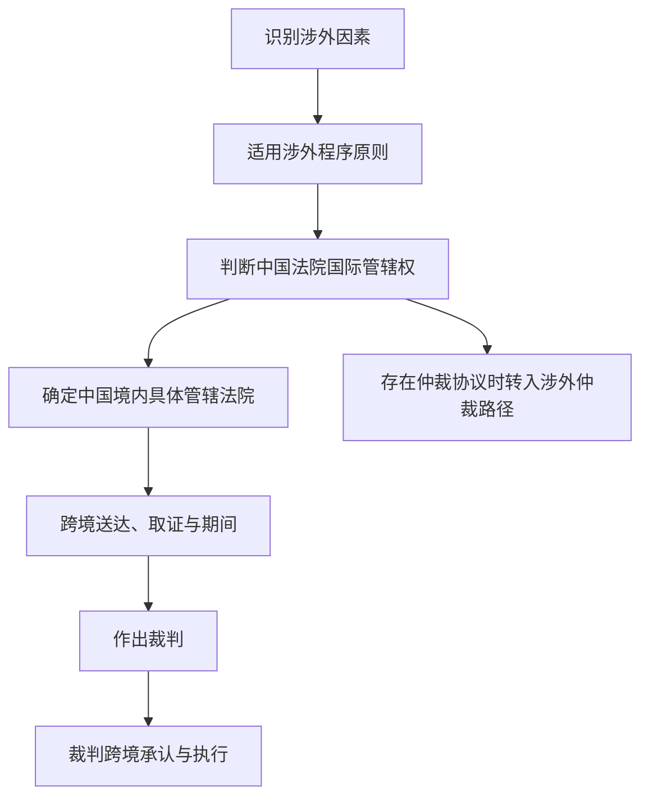
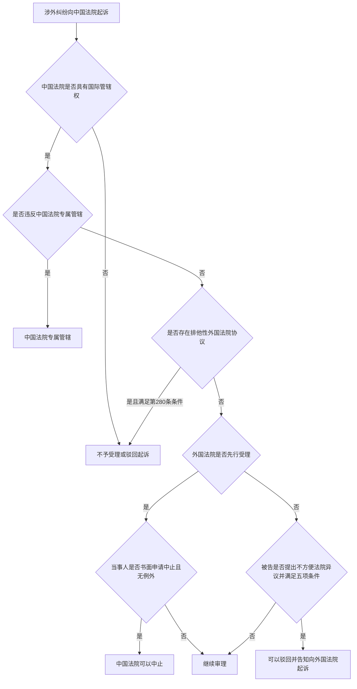
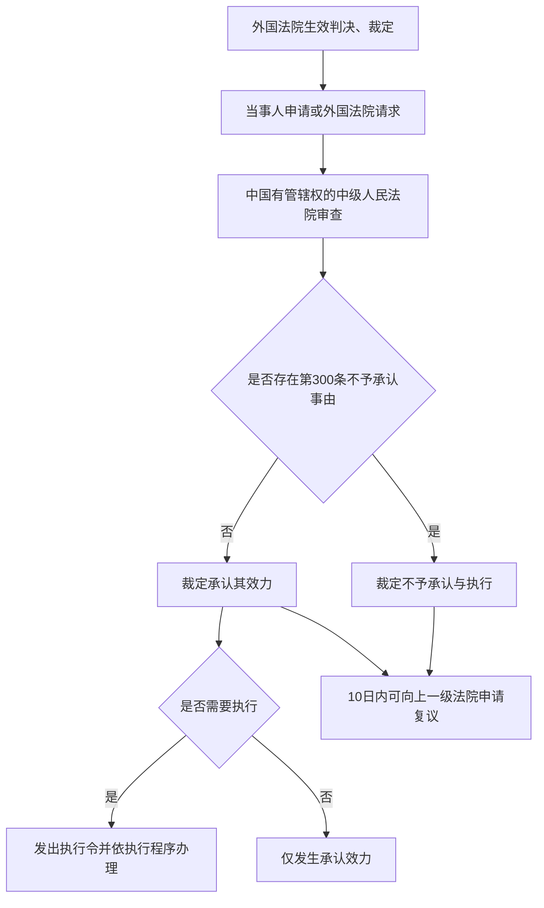

# 第二十一讲 涉外民事诉讼程序

## 一、复习地图

> [!summary] 本讲主线
> 涉外民事诉讼程序解决的是：**案件与外国存在联系时，中国法院能否审、如何跨境推进程序，以及裁判如何跨境发生效力。**

| 模块 | 核心问题 | 复习权重 |
|---|---|---|
| 涉外民事诉讼概述 | 如何识别涉外民事案件 | ★ |
| 程序原则 | 涉外案件适用何种程序规范 | ★★★ |
| 涉外民事诉讼管辖 | 中国法院能否行使国际管辖权 | ★★★ |
| 涉外期间 | 无住所当事人的期限有何特殊规则 | ★★★ |
| 国际民事司法协助 | 如何跨境送达、取证及承认执行裁判 | ★★★ |
| 涉外仲裁 | 仲裁协议、保全与裁决执行如何处理 | ★★ |

> [!important] 三条高频主线
> 1. **国际管辖权**：中国法院能不能审。
> 2. **跨境程序行为**：文书怎样送达、证据怎样取得、期限怎样计算。
> 3. **裁判跨境效力**：外国裁判能否在中国获得承认与执行，中国裁判能否在外国执行。

---

## 二、涉外民事诉讼概述 ★

### （一）概念与特征

涉外民事诉讼，是指人民法院审理具有涉外因素的民事案件所进行的诉讼活动。

其特殊性主要表现为：

1. 案件具有跨境联系，需要先判断**国际管辖权**；
2. 程序行为可能需要在境外实施，涉及国家主权与国际司法协助；
3. 裁判可能需要在外国获得承认与执行；
4. 国内程序法、国际条约与互惠原则可能同时发生作用。

### （二）涉外民事案件的识别

根据《民诉法解释》第520条，具有下列情形之一的，可以认定为涉外民事案件：

| 涉外因素 | 典型情形 |
|---|---|
| 主体涉外 | 一方或者双方当事人是外国人、无国籍人、外国企业或者组织 |
| 经常居所涉外 | 一方或者双方当事人的经常居所地在中国领域外 |
| 标的物涉外 | 诉讼标的物在中国领域外 |
| 法律事实涉外 | 产生、变更或者消灭民事关系的法律事实发生在中国领域外 |
| 其他涉外联系 | 可以认定为涉外民事案件的其他情形 |

> [!tip] 判断方法
> 从“**主体、经常居所、标的物、法律事实、其他联系**”五个入口寻找涉外因素。案件适用外国法，并不当然等于案件属于涉外民事诉讼；仍应以是否存在涉外联系为判断起点。

---

## 三、涉外民事诉讼程序原则 ★★★

### （一）国际条约优先适用原则

中国缔结或者参加的国际条约同《民事诉讼法》有不同规定的，适用国际条约的规定，但中国声明保留的条款除外。参见 [[民事诉讼法#第二百七十一条|民事诉讼法第271条]]。

适用顺序可概括为：

1. 优先适用中国参加的国际条约；
2. 中国对相关条款作出保留的，不适用该条款；
3. 国际条约没有规定的，适用《民事诉讼法》涉外编；
4. 涉外编没有规定的，适用《民事诉讼法》其他规定。

### （二）同等原则与对等原则

- **同等原则**：外国人、无国籍人、外国企业和组织在中国法院起诉、应诉，同中国公民、法人和其他组织有同等的诉讼权利义务。
- **对等原则**：外国法院对中国主体的民事诉讼权利加以限制的，中国法院可对该国主体的民事诉讼权利实行相应限制。

> [!note] 区分
> 同等原则是常态保障；对等原则是针对外国歧视性限制的回应措施。

### （三）司法豁免原则

对享有外交特权与豁免的外国人、外国组织或者国际组织提起民事诉讼，应依照中国有关法律以及中国缔结或者参加的国际条约办理。参见 [[民事诉讼法#第二百七十二条|民事诉讼法第272条]]。

涉外国国家的民事诉讼，优先适用《中华人民共和国外国国家豁免法》。参见 [[民事诉讼法#第三百零五条|民事诉讼法第305条]]。

### （四）适用中国民事诉讼法原则

在中国领域内进行涉外民事诉讼，原则上适用中国民事诉讼法，即适用**法院地法**。参见 [[民事诉讼法#第二百七十条|民事诉讼法第270条]]。

> [!warning] 不要混淆
> 实体争议可能适用外国法，但在中国法院进行诉讼时，送达、举证、开庭、裁判等程序事项原则上适用中国程序法。

### （五）使用中国通用语言文字原则

人民法院审理涉外民事案件，应使用中国通用的语言、文字；当事人要求提供翻译的，可以提供，费用由当事人承担。参见 [[民事诉讼法#第二百七十三条|民事诉讼法第273条]]。

### （六）委托中国律师代理诉讼原则

外国人、无国籍人、外国企业和组织在中国法院起诉、应诉，需要委托律师代理诉讼的，必须委托中国律师。参见 [[民事诉讼法#第二百七十四条|民事诉讼法第274条]]。

但该规则仅禁止外国律师以**律师身份**担任诉讼代理人，并不当然禁止外国人或者外国律师以非律师身份依法担任代理人。

境外寄交或者托交的授权委托书，还应依法履行公证、认证或者国际条约规定的证明手续。参见 [[民事诉讼法#第二百七十五条|民事诉讼法第275条]]。

---

## 四、涉外民事诉讼管辖 ★★★

### （一）国际管辖权与国内管辖权

| 概念 | 所回答的问题 |
|---|---|
| 国际管辖权 | 某国法院整体上能否审理该涉外案件 |
| 国内管辖权 | 确定由该国境内哪一级、哪一地区的法院审理 |

判断顺序应当是：**先国际、后国内**。只有确认中国法院具有国际管辖权后，才依据 [[V 法院主管和管辖]] 中的级别管辖、地域管辖等规则确定具体法院。

### （二）规范适用顺序

判断中国法院是否具有涉外民事诉讼管辖权时，一般依次考察：

1. 中国缔结或者参加的国际条约；
2. 《民事诉讼法》涉外编的特别规定；
3. 涉外编没有规定时，《民事诉讼法》关于管辖的一般规定及有关司法解释。

### （三）一般与特别国际管辖

对在中国领域内没有住所的被告提起的、身份关系以外的涉外民事纠纷，符合下列连接点之一的，中国法院可以管辖：

1. 合同签订地在中国领域内；
2. 合同履行地在中国领域内；
3. 诉讼标的物在中国领域内；
4. 可供扣押的财产在中国领域内；
5. 侵权行为地在中国领域内；
6. 代表机构住所地在中国领域内；
7. 具有与中国存在其他适当联系的情形。

参见 [[民事诉讼法#第二百七十六条|民事诉讼法第276条]]。

> [!important] 2023年修法要点
> 第276条在列举连接点之外增加“**其他适当联系**”兜底条款，扩展了中国法院行使涉外民事诉讼管辖权的规范空间。

### （四）协议管辖与应诉管辖

#### 1. 选择中国法院

涉外民事纠纷的当事人书面协议选择中国法院管辖的，中国法院可以管辖。现行 [[民事诉讼法#第二百七十七条|民事诉讼法第277条]] 未明文要求争议与中国具有实际联系。

#### 2. 选择外国法院

《民诉法解释》第529条规定，涉外合同或者其他财产权益纠纷的当事人协议选择外国法院管辖，应当与争议具有实际联系；属于中国法院专属管辖的，不得协议选择外国法院管辖。

#### 3. 应诉管辖

当事人未提出管辖异议，并应诉答辩或者提出反诉的，视为中国法院有管辖权。参见 [[民事诉讼法#第二百七十八条|民事诉讼法第278条]]。

| 类型 | 成立方式 | 核心限制 |
|---|---|---|
| 明示选择中国法院 | 书面协议 | 不得违反中国法院专属管辖 |
| 明示选择外国法院 | 书面协议 | 司法解释要求实际联系；不得排除中国法院专属管辖 |
| 默示接受中国法院 | 未提管辖异议并应诉答辩或反诉 | 通过诉讼行为成立 |

### （五）专属管辖

下列民事案件由中国法院专属管辖：

| 专属管辖事项 | 规则要点 |
|---|---|
| 中国设立的法人或其他组织的设立、解散、清算，以及决议效力等纠纷 | 组织法事项专属中国法院 |
| 在中国审查授予的知识产权有效性纠纷 | 知识产权授权国具有专属管辖权 |
| 在中国履行的中外合资经营企业、中外合作经营企业、中外合作勘探开发自然资源合同纠纷 | 特定合作合同专属中国法院 |

参见 [[民事诉讼法#第二百七十九条|民事诉讼法第279条]]。

> [!warning] 专属管辖的效力
> 当事人不能通过选择外国法院排除中国法院专属管辖；外国法院违反中国专属管辖作出的裁判，也可能因此不获中国法院承认。

### （六）平行诉讼

平行诉讼，是指同一纠纷同时在不同国家法院进行诉讼。

#### 1. 中国法院受理的一般规则

同一纠纷已经在外国法院诉讼，一方当事人又向中国法院起诉的，或者一方当事人向外国法院起诉，另一方当事人向中国法院起诉的，中国法院有管辖权的，可以受理。参见 [[民事诉讼法#第二百八十条|民事诉讼法第280条]]。

但当事人订立排他性管辖协议选择外国法院管辖，且不涉及中国法院专属管辖，也不涉及中国主权、安全或者社会公共利益的，中国法院可以裁定不予受理；已经受理的，裁定驳回起诉。

#### 2. 因外国法院先行受理而中止

外国法院先于中国法院受理，当事人书面申请中国法院中止诉讼的，中国法院可以裁定中止，但有下列情形之一的除外：

1. 当事人协议选择中国法院管辖；
2. 纠纷属于中国法院专属管辖；
3. 中国法院审理案件明显更为方便。

外国法院未采取必要措施审理案件，或者未在合理期限内审结，中国法院应当根据当事人的书面申请恢复诉讼。参见 [[民事诉讼法#第二百八十一条|民事诉讼法第281条]]。

### （七）不方便法院原则

中国法院已经受理涉外民事案件，被告提出管辖异议，并且同时符合下列条件的，可以裁定驳回起诉，告知原告向更方便的外国法院起诉：

1. 争议的基本事实不是发生在中国领域内，中国法院审理和当事人参加诉讼均明显不方便；
2. 当事人之间不存在选择中国法院管辖的协议；
3. 案件不属于中国法院专属管辖；
4. 案件不涉及中国主权、安全或者社会公共利益；
5. 外国法院审理案件更为方便。

外国法院拒绝行使管辖权、未采取必要措施审理案件或者未在合理期限内审结，当事人又向中国法院起诉的，中国法院应当受理。参见 [[民事诉讼法#第二百八十二条|民事诉讼法第282条]]。

> [!warning] 现行法校准
> 关于平行诉讼与不方便法院原则，应以2023年修正后的《民事诉讼法》第280—282条为主要依据。较早司法解释中的规则，需要在与现行法一致的范围内理解适用。

### （八）平行诉讼与不方便法院原则对比

| 比较项 | 平行诉讼中止 | 不方便法院原则 |
|---|---|---|
| 外国法院状态 | 外国法院已先行受理 | 不以外国法院已受理为必要 |
| 提出主体 | 当事人书面申请中止 | 被告提出管辖异议 |
| 中国法院处理 | 可以裁定中止 | 可以裁定驳回起诉 |
| 后续救济 | 外国法院消极审理时申请恢复 | 外国法院拒绝或消极审理时重新起诉，中国法院应受理 |
| 核心目的 | 协调重复诉讼 | 将案件交由明显更方便的外国法院审理 |

---

## 五、涉外民事诉讼期间 ★★★

### （一）适用对象

涉外案件中的当事人在中国领域内有住所的，原则上适用普通期间规则；特殊期间主要适用于在中国领域内**没有住所**的当事人。

### （二）法定期间

| 程序行为 | 中国领域内无住所的当事人 | 是否可以申请延长 |
|---|---:|---|
| 被告提出答辩状 | 收到起诉状副本后30日内 | 可以 |
| 不服一审判决提起上诉 | 判决书送达之日起30日内 | 可以 |
| 不服一审裁定提起上诉 | 裁定书送达之日起30日内 | 可以 |
| 被上诉人提出答辩状 | 收到上诉状副本后30日内 | 可以 |

参见 [[民事诉讼法#第二百八十五条|民事诉讼法第285条]]、[[民事诉讼法#第二百八十六条|民事诉讼法第286条]]。

### （三）审理期限

人民法院审理涉外民事案件的期间，不受普通一审、二审审限规定的限制。参见 [[民事诉讼法#第二百八十七条|民事诉讼法第287条]]。

> [!tip] 数字记忆
> 无住所当事人的答辩、判决上诉、裁定上诉以及上诉答辩，均以“**30日，可申请延长**”为核心。

---

## 六、国际民事司法协助 ★★★

### （一）概念与分类

国际民事司法协助，是指不同国家的法院或者其他主管机关，根据国际条约或者互惠原则，在民事诉讼中相互代为实施一定司法行为，或者承认与执行对方法院裁判、仲裁裁决的制度。

| 类型 | 主要内容 |
|---|---|
| 一般司法协助 | 送达文书、调查取证、提供法律资料等程序辅助行为 |
| 特殊司法协助 | 承认与执行外国法院裁判、外国仲裁裁决 |

### （二）司法协助的依据与限制

中国法院与外国法院请求或者提供司法协助，应当依照中国缔结或者参加的国际条约，或者按照互惠原则进行。

外国法院请求协助的事项有损中国主权、安全或者社会公共利益的，中国法院不予执行。参见 [[民事诉讼法#第二百九十三条|民事诉讼法第293条]]。

### （三）一般国际民事司法协助

#### 1. 请求途径

司法协助请求一般通过下列途径提出：

1. 国际条约规定的途径；
2. 没有条约关系的，通过外交途径；
3. 外国驻华使领馆可以向其本国公民送达文书和调查取证，但不得违反中国法律，不得采取强制措施。

除上述情形外，未经中国主管机关准许，任何外国机关或者个人不得在中国领域内送达文书、调查取证。参见 [[民事诉讼法#第二百九十四条|民事诉讼法第294条]]。

> [!important] 主权边界
> 在中国境内实施送达、调查取证，属于国家司法主权的行使。外国机关或者个人不能自行在中国实施这些程序行为。

#### 2. 向中国领域外送达

对在中国领域内没有住所的当事人，可以采用下列方式送达：

| 送达路径 | 适用要点 |
|---|---|
| 条约方式 | 依受送达人所在国与中国缔结或共同参加的国际条约 |
| 外交方式 | 通过外交途径送达 |
| 使领馆方式 | 对中国籍受送达人，可委托中国驻外使领馆代为送达 |
| 诉讼代理人 | 向有权代收文书的诉讼代理人送达 |
| 境内机构 | 向受送达人在中国设立的独资企业、代表机构、分支机构或有权代收的业务代办人送达 |
| 关联主体 | 向符合现行法条件的境内法定代表人、主要负责人或者共同被告送达 |
| 邮寄 | 受送达人所在国法律允许邮寄送达时适用 |
| 电子方式 | 采用能够确认收悉的电子方式，但受送达人所在国法律禁止的除外 |
| 当事人约定 | 采用双方同意的其他方式，但受送达人所在国法律禁止的除外 |
| 公告 | 不能采用其他方式时公告送达 |

邮寄送达自邮寄之日起满3个月，送达回证未退回，但根据各种情况足以认定已经送达的，视为期间届满之日送达；公告送达自发出公告之日起满60日，视为送达。参见 [[民事诉讼法#第二百八十三条|民事诉讼法第283条]]。

> [!important] 2023年修法要点
> 域外送达方式显著扩展，增加了向符合条件的境内关联主体送达、电子送达以及双方同意的其他送达方式；公告送达期间由旧规则的3个月缩短为60日。

#### 3. 在中国领域外调查取证

中国法院在境外调查取证，可以依照国际条约规定的方式，或者通过外交途径进行。

所在国法律不禁止的，还可以采用：

1. 委托中国驻外使领馆对中国籍当事人、证人调查取证，但不得采取强制措施；
2. 经双方当事人同意，通过即时通讯工具调查取证；
3. 以双方当事人同意的其他方式调查取证。

参见 [[民事诉讼法#第二百八十四条|民事诉讼法第284条]]。

#### 4. 司法协助文书与程序

- 外国法院请求中国法院提供司法协助的请求书及附件，应附中文译本或者国际条约规定的其他文字译本；
- 中国法院提供司法协助，依照中国法律规定的程序进行；
- 外国法院请求采用特殊方式的，可以按照其请求采用，但不得违反中国法律。

参见 [[民事诉讼法#第二百九十五条|民事诉讼法第295条]]、[[民事诉讼法#第二百九十六条|民事诉讼法第296条]]。

### （四）外国法院裁判的承认与执行

#### 1. 启动方式

外国法院作出的发生法律效力的判决、裁定，需要中国法院承认与执行的，可以：

1. 由当事人直接向有管辖权的中国中级人民法院申请；
2. 由外国法院依照国际条约或者互惠原则请求中国法院承认与执行。

参见 [[民事诉讼法#第二百九十八条|民事诉讼法第298条]]。

#### 2. 承认与执行的关系

- **承认**：确认外国裁判在中国具有法律效力；
- **执行**：由中国法院运用国家强制力实现外国裁判确定的给付义务。

外国法院裁判经审查后，符合条件的，中国法院裁定承认其效力；需要执行的，发出执行令，依照《民事诉讼法》执行编办理。参见 [[民事诉讼法#第二百九十九条|民事诉讼法第299条]]。

#### 3. 不予承认与执行的法定事由

经审查，有下列情形之一的，中国法院应当裁定不予承认与执行：

| 审查事项 | 不予承认与执行的情形 |
|---|---|
| 外国法院管辖权 | 外国法院对案件无管辖权 |
| 程序保障 | 被申请人未获合法传唤或未获合理陈述、辩论机会；无诉讼行为能力的当事人未获适当代理 |
| 裁判真实性 | 裁判通过欺诈方式取得 |
| 裁判冲突 | 中国法院已经作出裁判，或者已经承认第三国法院对同一纠纷作出的裁判 |
| 公共秩序 | 违反中国法律基本原则，或者损害中国主权、安全、社会公共利益 |

参见 [[民事诉讼法#第三百条|民事诉讼法第300条]]。

外国法院存在下列情形之一的，应认定其对案件无管辖权：

1. 依外国法院所在地法律，外国法院无管辖权；或者虽有管辖权，但争议与该国无适当联系；
2. 违反中国法院专属管辖规定；
3. 违反当事人排他性选择法院管辖协议。

参见 [[民事诉讼法#第三百零一条|民事诉讼法第301条]]。

#### 4. 与中国境内诉讼的协调

当事人就同一纠纷向中国法院起诉后，又申请承认和执行外国法院裁判的，中国法院可以裁定中止诉讼。

- 外国裁判获承认：裁定驳回中国境内诉讼；
- 外国裁判不获承认：恢复中国境内诉讼。

参见 [[民事诉讼法#第三百零二条|民事诉讼法第302条]]。

#### 5. 救济

当事人对承认和执行或者不予承认和执行的裁定不服，可以自裁定送达之日起10日内向上一级人民法院申请复议。参见 [[民事诉讼法#第三百零三条|民事诉讼法第303条]]。

### （五）中国法院裁判在外国的承认与执行

中国法院作出的发生法律效力的判决、裁定，需要外国法院承认和执行的，可以：

1. 由当事人直接向有管辖权的外国法院申请；
2. 由中国法院依照国际条约或者按照互惠原则，请求外国法院承认和执行。

参见 [[民事诉讼法#第二百九十七条|民事诉讼法第297条]]。

在中国领域内依法作出的发生法律效力的仲裁裁决，被执行人或者其财产不在中国领域内的，当事人也可以直接向有管辖权的外国法院申请承认和执行。

### （六）外国仲裁裁决的承认与执行

外国仲裁机构作出的裁决，需要中国法院承认和执行的，由当事人向下列地点的中级人民法院申请：

1. 被申请人住所地；
2. 被申请人财产所在地；
3. 被申请人住所地、财产所在地均不在中国领域内的，申请人住所地或者与裁决争议有适当联系的地点。

中国法院依照中国缔结或者参加的国际条约，或者按照互惠原则办理。参见 [[民事诉讼法#第三百零四条|民事诉讼法第304条]]。

对适用《承认及执行外国仲裁裁决公约》的外国仲裁裁决，不予承认与执行的事由主要包括：

1. 仲裁协议无效；
2. 被申请人未获适当通知或者未能陈述意见；
3. 裁决超出仲裁协议范围；
4. 仲裁庭组成或者仲裁程序不符合约定或仲裁地法；
5. 裁决尚未对当事人发生拘束力，或者已被撤销、停止执行；
6. 争议事项依中国法不能通过仲裁解决；
7. 承认与执行违反中国公共政策。

### （七）外国法院裁判与外国仲裁裁决对比

| 比较项 | 外国法院裁判 | 外国仲裁裁决 |
|---|---|---|
| 规范基础 | 国际条约或互惠原则；《民事诉讼法》第298—303条 | 国际条约或互惠原则；《民事诉讼法》第304条 |
| 申请法院 | 有管辖权的中级人民法院 | 被申请人住所地、财产所在地等地的中级人民法院 |
| 主要审查重点 | 外国法院管辖权、程序保障、欺诈、裁判冲突、公共秩序 | 仲裁协议、通知和陈述权、裁决范围、仲裁程序、裁决效力、可仲裁性、公共政策 |
| 效力逻辑 | 先承认法律效力，必要时再执行 | 审查是否承认并执行仲裁裁决 |

---

## 七、涉外仲裁 ★★

### （一）仲裁与诉讼的关系

涉外经济贸易、运输和海事中发生的纠纷，当事人在合同中订有仲裁条款或者事后达成书面仲裁协议，提交中国涉外仲裁机构或者其他仲裁机构仲裁的，当事人不得向中国法院起诉。

当事人没有订立仲裁条款或者书面仲裁协议的，可以向中国法院起诉。参见 [[民事诉讼法#第二百八十八条|民事诉讼法第288条]]。

### （二）涉外仲裁中的保全

当事人申请保全的，涉外仲裁机构应当将申请提交被申请人住所地或者财产所在地的中级人民法院裁定。参见 [[民事诉讼法#第二百八十九条|民事诉讼法第289条]]。

### （三）涉外仲裁裁决的执行

中国涉外仲裁机构作出的发生法律效力的仲裁裁决，当事人不履行的，对方当事人可以向被申请人住所地或者财产所在地的中级人民法院申请执行。参见 [[民事诉讼法#第二百九十条|民事诉讼法第290条]]。

被申请人提出证据证明存在法定情形的，中国法院经组成合议庭审查核实，可以裁定不予执行。主要事由包括：

1. 仲裁协议无效或者不存在；
2. 被申请人未获指定仲裁员或者参加仲裁程序的通知，或者因其他非归责于自身的原因未能陈述意见；
3. 仲裁庭组成或者仲裁程序与仲裁规则不符；
4. 裁决事项不属于仲裁协议范围或者仲裁机构无权仲裁；
5. 执行裁决违背社会公共利益。

参见 [[民事诉讼法#第二百九十一条|民事诉讼法第291条]]。

仲裁裁决被裁定不予执行的，当事人可以根据双方达成的书面仲裁协议重新申请仲裁，也可以向中国法院起诉。参见 [[民事诉讼法#第二百九十二条|民事诉讼法第292条]]。

---

## 八、易混规则对照

### （一）国际管辖权与国内管辖权

| 国际管辖权 | 国内管辖权 |
|---|---|
| 判断中国法院整体能否审理 | 判断中国境内哪一个法院审理 |
| 涉及国家司法主权边界 | 涉及级别、地域、专门管辖分工 |
| 先判断 | 后判断 |

### （二）一般司法协助与特殊司法协助

| 一般司法协助 | 特殊司法协助 |
|---|---|
| 为诉讼推进提供程序帮助 | 使外国裁判、仲裁裁决跨境发生效力 |
| 送达、取证、提供法律资料 | 承认与执行 |
| 不直接确认实体权利义务 | 关系到既有裁判结果能否在本国实现 |

### （三）承认与执行

| 承认 | 执行 |
|---|---|
| 确认外国裁判在中国具有法律效力 | 运用国家强制力实现给付内容 |
| 确认性裁判可能只需承认 | 给付性裁判通常还需执行 |
| 是执行的逻辑前提 | 是承认后的进一步程序 |

### （四）核心数字

| 数字 | 对应规则 |
|---:|---|
| 30日 | 无住所被告答辩；无住所当事人对判决、裁定上诉；被上诉人答辩 |
| 3个月 | 邮寄域外送达后，在符合条件时推定送达的期间 |
| 60日 | 域外公告送达的期间 |
| 10日 | 对外国法院裁判承认与执行相关裁定申请复议的期间 |

---

## 九、主观题答题框架

### （一）简述涉外民事诉讼程序原则

1. 涉外民事诉讼原则上适用中国民事诉讼法；
2. 中国参加的国际条约与国内法规定不同时，除保留条款外优先适用国际条约；
3. 外国主体在中国诉讼中享有同等诉讼权利义务，并适用对等原则；
4. 对享有外交特权与豁免的主体，依法及依国际条约处理；
5. 诉讼使用中国通用语言文字；
6. 外国主体需要委托律师代理诉讼的，应委托中国律师。

### （二）论述外国法院裁判在中国的承认与执行

答题顺序：

1. **启动依据**：国际条约或者互惠原则；
2. **启动主体与法院**：当事人申请或外国法院请求，由有管辖权的中级人民法院审查；
3. **审查对象**：外国裁判是否已经发生法律效力；
4. **消极条件**：逐项审查第300条规定的不予承认与执行事由；
5. **管辖审查**：依据第301条判断外国法院是否无管辖权；
6. **处理结果**：符合条件的，裁定承认；需要执行的，发出执行令；
7. **程序协调与救济**：处理与中国境内诉讼的关系，并说明10日复议规则。

### （三）分析涉外管辖案例

答题顺序：

1. 识别案件是否具有涉外因素；
2. 判断是否存在国际条约；
3. 判断中国法院是否存在第276条连接点；
4. 审查协议管辖、应诉管辖与专属管辖；
5. 存在外国诉讼时，审查平行诉讼及中止规则；
6. 被告提出异议时，审查不方便法院原则的五项条件；
7. 最后确定中国境内具体管辖法院。

---

## 十、自测问题

1. 涉外民事案件的五类识别因素是什么？
2. 为什么“实体法适用外国法”不等于“程序法也适用外国法”？
3. 选择中国法院与选择外国法院的协议管辖规则有何差异？
4. 中国法院专属管辖包括哪三类事项？
5. 平行诉讼中止与不方便法院原则在前提和处理结果上有何不同？
6. 域外送达的邮寄推定期间与公告期间分别是多少？
7. 外国法院裁判不予承认与执行的法定事由有哪些？
8. 外国法院无管辖权的三种法定情形是什么？
9. 外国法院裁判与外国仲裁裁决的审查重点有何差异？
10. 涉外仲裁裁决被裁定不予执行后，当事人有哪些后续路径？

---

## 十一、关联笔记

- [[V 法院主管和管辖]]
- [[XVII 诉讼保障制度]]
- [[民事诉讼法]]
- [[民诉法解释]]
