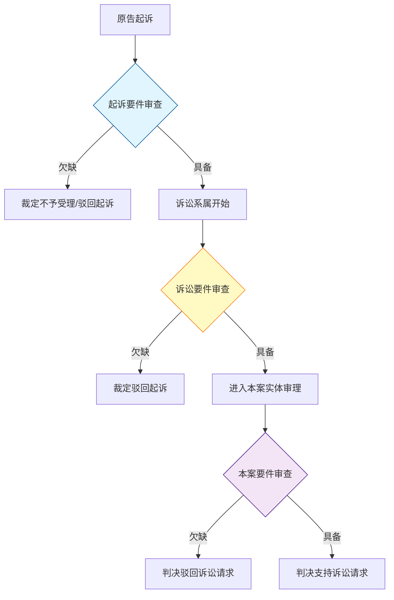
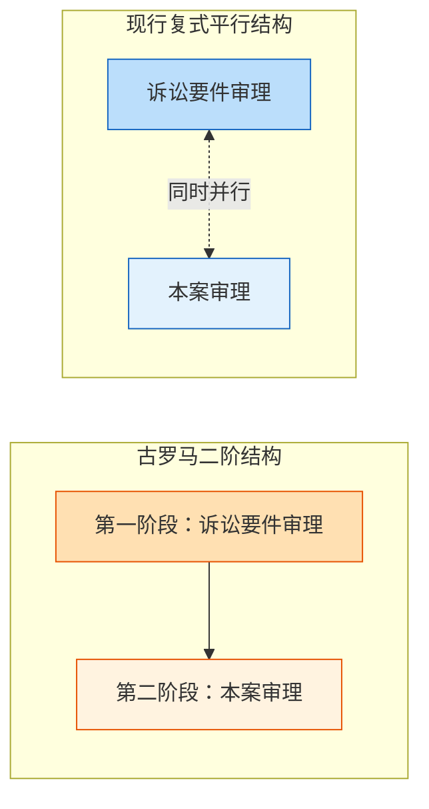
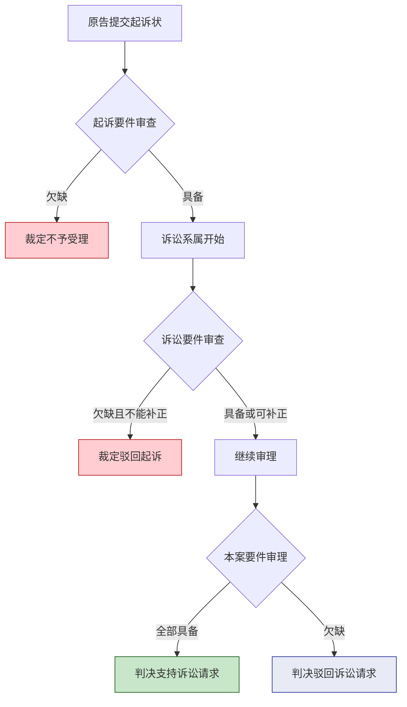

---
aliases:
author: DeepSeek V4 Pro
tags:
  - 民事诉讼法
  - 学习/法学/民商法/民事诉讼法
---
# 民事诉讼之要件

## 一、概念总览：三个层次的「要件」

民事诉讼中存在三个容易混淆、但功能截然不同的「要件」概念，它们构成递进审查的结构：

| 序号  | 要件类型             | 核心功能          | 审查阶段          | 欠缺后果        |
| :-: | ---------------- | ------------- | ------------- | ----------- |
|  ①  | **起诉要件**         | 诉讼能否成立、能否开始   | 起诉时           | 不予受理 / 驳回起诉 |
|  ②  | **诉讼要件**（实体判决要件） | 法院能否对本案作出实体判决 | 诉讼系属后，与本案审理并行 | 驳回起诉        |
|  ③  | **本案要件**（权利保护要件） | 原告的诉讼请求本身是否成立 | 实体审理中         | 判决驳回诉讼请求    |

> [!tip] 三者的递进逻辑
> ① 是“门能不能进”→② 是“进了门能不能判（程序合法性）”→③ 是“判了能不能赢（实体正当性）”。

---

## 二、起诉要件

起诉要件是**诉讼成立的要件**，即原告的起诉行为在程序法上发生诉讼系属效果所必须具备的条件。

根据《民事诉讼法》第122条，起诉必须符合下列条件：
1. 原告是与本案有直接利害关系的公民、法人和其他组织；
2. 有明确的被告；
3. 有具体的诉讼请求和事实、理由；
4. 属于人民法院受理民事诉讼的范围和受诉人民法院管辖。

> [!warning] 我国起诉条件的“高阶化”问题
> 张卫平教授指出，我国现行《民事诉讼法》实际上**将诉讼要件（实体判决要件）植入了起诉条件之中**[^1]，导致起诉的门槛被人为抬高，即所谓“起诉高阶化”，这也是我国民事诉讼“起诉难”的制度根源。

---

## 三、诉讼要件（实体判决要件）

### （一）定义与历史沿革

诉讼要件，又称**实体判决要件**，是指受诉法院对案件的实体争议**有权作出本案判决的前提条件**[^1]。张卫平教授建议使用“实体判决要件”的表述，因为“诉讼要件”的说法容易让人误以为是诉讼成立所需的要件，其实不然——即使欠缺诉讼要件，也不妨碍诉讼的成立和审理的开始[^2]。

> [!faq] 诉讼要件 ≠ 诉讼成立要件
> 诉讼要件并不是案件能否进入程序的判断标准，而是法院在审理过程中判断**能否对本案作出实体判决**的标准。欠缺诉讼要件时，法院是“不能判本案”（驳回起诉），而非“不能收案”。

**历史演变**：在古罗马民事诉讼中，诉讼分为两个截然分开的阶段——第一阶段审查诉是否具备审理要件（类似今日的诉讼要件），第二阶段进行本案审理。这一构造被称为“单层阶段诉讼”。此后，为追求审理效率，对诉讼要件的审理逐渐与本案审理同时并行，形成了现行法上的**复式平行诉讼**结构[^2]。

### （二）诉讼要件的种类

现行法律对诉讼要件并无统一规定，而是分散在不同法条之中。一般公认的诉讼要件包括以下内容[^2][^1]：

| 分类 | 诉讼要件 | 举例 / 说明 |
|:---:|---------|-----------|
| 法院方面 | 1. 国际裁判管辖权 | 我国法院对案件具有国际裁判管辖权 |
| 法院方面 | 2. 法院管辖权 | 受理案件的法院对案件有管辖权（此项具有特殊性） |
| 法院方面 | 3. 属于法院裁判权范围 | 案件不属于仲裁协议或行政权排他处理的范围 |
| 当事人方面 | 4. 当事人实际存在 | 原告、被告须为现实存在的主体 |
| 当事人方面 | 5. 具有当事人能力 | 能够作为民事诉讼当事人的资格 |
| 当事人方面 | 6. 当事人适格 | 是本案的正当原告或被告，与判决拘束力对应 |
| 当事人方面 | 7. 当事人实施起诉行为且行为有效 | 包括具备诉讼能力、起诉意思表示真实等 |
| 程序方面 | 8. 实施了有效送达 | 起诉状副本等已依法有效送达 |
| 程序方面 | 9. 不属于重复诉讼 | 同一案件未在另一法院同时审理中 |
| 程序方面 | 10. 不存在仲裁协议 | 当事人之间没有就同一纠纷订立的有效仲裁协议 |
| 程序方面 | 11. 提供诉讼费用担保 | 法律规定须提供担保的，已提供 |
| 目的方面 | 12. 具有诉的利益 | 请求有通过判决解决的必要性和实效性 |

### （三）诉讼要件的分类视角

**1. 积极要件 vs 消极要件**[^2]
- **积极要件**：该要件**存在**时，才能作出本案判决。如：国际裁判管辖权、当事人能力、诉的利益。
- **消极要件**（诉讼妨害）：该要件**不存在**时，才能作出本案判决。如：存在仲裁协议、构成重复起诉。

**2. 职权调查事项 vs 抗辩事项**[^2]
- **职权调查事项**：即使当事人未提出异议，法院也必须主动审查。大多数诉讼要件均属此类。
- **抗辩事项**：只有被告主动主张时，法院才会审查。如：存在仲裁协议、诉讼费用担保。

### （四）欠缺诉讼要件的处理

| 情形 | 处理方式 | 说明 |
|------|---------|------|
| 认定欠缺诉讼要件 | 裁定**驳回起诉** | 不再继续进行本案审理[^2] |
| 对是否欠缺有疑问 | 无需停止本案审理 | 复式平行诉讼中，法院可自由裁量审理顺序[^2] |
| 存在明显补正治愈可能 | 允许补正 | 待补正后继续审理 |

---

## 四、本案要件（权利保护要件）

本案要件是指**原告诉讼请求在本案实体上成立的构成要件**。这些要件本质上是实体法规范所要求的法律效果发生的前提条件。

> [!example] 邹碧华《要件审判九步法》示例
> 原告请求撤销债务人以明显不合理低价转让财产的行为，根据《合同法》第74条第1款，其构成要件有三[^3]：
> 
> | 要件 | 内容 |
> |:---:|------|
> | 要件一 | 债务人以明显不合理的低价转让财产 |
> | 要件二 | 对债权人造成损害 |
> | 要件三 | 受让人知道该情形 |
> 
> 只要三个要件有一个不能认定，就不能支持原告的诉讼请求（判决驳回诉讼请求）[^3]。

### 诉讼要件 vs 本案要件

| 对比维度 | 诉讼要件 | 本案要件 |
|---------|---------|---------|
| 法律性质 | 程序法要件 | 实体法要件 |
| 审查目的 | 能否作出本案判决 | 诉讼请求是否成立 |
| 法律依据 | 民事诉讼法 | 民法、合同法等实体法 |
| 欠缺后果 | 裁定**驳回起诉** | 判决**驳回诉讼请求** |
| 既判力 | 不影响再次起诉 | 有既判力，不得再次起诉 |

---

## 五、三要件体系关系总图

> [!important] 体系核心要义
> - **起诉要件**解决的是“法院能不能收案”的问题（程序入口）。
> - **诉讼要件**解决的是“收案后能不能判”的问题（程序的合法推进）。
> - **本案要件**解决的是“判了能不能赢”的问题（实体权利的最终实现）。

---

## 六、我国法的特殊构造

我国现行《民事诉讼法》的一个显著特征是**将诉讼要件（实体判决要件）前置为起诉条件**[^1]，这导致了：

- 起诉的门槛较高（“高阶化”），当事人在立案阶段就须满足部分本应在审理阶段审查的要件（如“原告与本案有直接利害关系”）。
- “起诉难”的制度性根源即在于此。
- 实践中，对于欠缺实体判决要件的案件，若在立案后发现，法院仍应裁定**驳回起诉**[^1]。

> [!note] 拓展阅读
> 如需进一步了解诉讼要件的细节，可参阅以下笔记：
> - [[〔日〕高桥宏志：《重点讲义民事诉讼法》，张卫平、许可译，法律出版社2007年版#第一讲 诉讼要件]]（定义、种类、审理顺序、效果）
> - [[张卫平：《民事诉讼法》，法律出版社2023年版]]（实体判决要件的中国法语境分析）
> - [[VI 当事人和诉讼代理人]]（起诉要件与适格的关联、当事人能力与诉讼能力）

# Reference

[^1]: [[张卫平：《民事诉讼法》，法律出版社2023年版]]
[^2]: [[〔日〕高桥宏志：《重点讲义民事诉讼法》，张卫平、许可译，法律出版社2007年版]]
[^3]: [[邹碧华：《要件审判九步法》，人民法院出版社2021年版]]
[^4]: [[VI 当事人和诉讼代理人]]