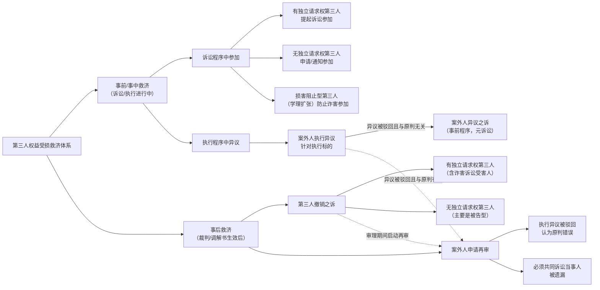

## 第三人权益救济

```mermaid
graph LR
    A[第三人权益受损救济体系] --> B[事前/事中救济<br>（诉讼/执行进行中）]
    A --> C[事后救济<br>（裁判/调解书生效后）]

    %% 事前/事中救济
    B --> B1[诉讼程序中参加]
    B1 --> B1_1[有独立请求权第三人<br>提起诉讼参加]
    B1 --> B1_2[无独立请求权第三人<br>申请/通知参加]
    B1 --> B1_3[损害阻止型第三人<br>（学理扩张）防止诈害参加]

    B --> B2[执行程序中异议]
    B2 --> B2_1[案外人执行异议<br>针对执行标的]
    B2_1 -->|异议被驳回且与原判无关| B2_2[案外人异议之诉<br>（事前程序，元诉讼）]

    %% 事后救济
    C --> C1[第三人撤销之诉]
    C1 --> C1_1[有独立请求权第三人<br>（含诈害诉讼受害人）]
    C1 --> C1_2[无独立请求权第三人<br>（主要是被告型）]

    C --> C2[案外人申请再审]
    C2 --> C2_1[执行异议被驳回<br>认为原判错误]
    C2 --> C2_2[必须共同诉讼当事人<br>被遗漏]

    %% 连接与衔接
    C1 -.->|审理期间启动再审| C2
    B2_1 -.->|异议被驳回且与原判有关| C2
```
