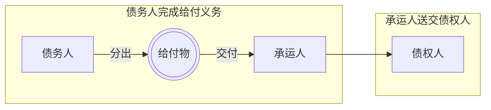

# I. 依债的发生原因分类

## 一、意定之债

1. 概念
	- 发生、内容均由行为人意思表示确定的债，因法律行为而生之债
		- [[Chap1. 债法总论#二、合同（契约）|合同之债]]
		- 单方允诺之债

2. 规范基础：[[民法典#第三编 合同]]

## 二、法定之债

1. **概念**
	- 发生、内容均来自法律规定之债， 因法律行为以外之原因（基于法律之规定而生）之债
		- [[民法典#第一百一十八条-第2款|举例]]
			- [[Chap1. 债法总论#五、侵权行为|侵权行为之债]]
			- [[Chap1. 债法总论#三、无因管理|无因管理]]、[[Chap1. 债法总论#四、不当得利|不当得利]]
			- 其他基于法律规定所生之债

2. **解释**
	- 债的发生直接由法律规定，不考虑当事人是否有产生债权债务关系的意思
		- *如《民法典》第506条规定，合同中约定的造成对方人身损害的免责条款无效。当行为人侵害他人人身健康时，当事人的侵权行为直接产生法定的侵权之债。*
	- 债的内容直接由法律规定
		- *如《民法典》第1169条第I款规定，教唆、帮助他人实施侵权行为的，应当与行为人承担连带责任。*

---
# II. 依给付标的分类

> [!tip] 说明
>所谓“给付标的”，可指债权债务关系指向的具体对象及内容，如债务关系指向一笔金钱的支付或一动产的交付等

## 一、实物之债

- 给付标的：**有体物之交付**

> [!caution] 特定物/种类物之债
>按照标的物在**债之关系成立时是否特定化**，实物之债可进一步划分为种类物之债与特定物之债。
>区分种类物之债与特定物之债的意义在于二者在所有权转移、风险负担及履行不能等方面的适用规则不同。

### （一）特定物之债

1. **定义**：
	- 在债主关系成立时，以特定物（具有个性，区别于他物）为给付标的
		- eg. *一件艺术品的交付义务*

2. **法律特征与意义**
	1. 从债之成立来看
		- 标的物在债成立时即已确定，具有不可替代性，双方当事人原则上不能变更给付物
	2. 从债之消灭来看
		- 债务人只有履行该特定的给付才能构成债务的清偿
			- 若以类似之物取代，需适用代物清偿的规则
	3. 从标的物对债之关系来看
		- 特定物毁损、灭失的，债之关系陷于“给付不能”

### （二）种类（物）之债

 >[!question] 为何需要「种类之债」的概念？
 > - 种类之债有特定之债所不具有的特殊问题，需要债法提供特别规范
 > 	- 我国法未设规范，但学理层面上仍形成了“通说”

1. **定义**：
	- 依种类而对给付标的加以确定的债之关系
		- eg.*如交付阳澄湖大闸蟹10千克、某出版社出版的袖珍《民法典》10册*

> [!note] 种类物与特定物的区分标准
>- 应采主观标准，如以一万元价格购买某书法家任一幅字的交易
>- 在此意义上，“种类物”应做“可替代物”解

> [!cite] 《德国》民法典第243条 
>给付仅依种类指示者，应给付中等品质之物。
>债务人已为给付其物之必要行为者，债之关系限定于该物。

> [!cite] 台湾地区“民法”第200条
给付物仅以种类指示者，依法律行为之性质或当事人之意思不能定其品质时，债务人应给以中等品质之物。前项情形，债务人交付其物之必要行为完结后，或经债权人之同意指定其应交付之物时，其物即为特定给付物。

2. **特点**
	- 从「履行不能」看
		- 由于种类物可以相互替代，种类物之债通常不发生履行不能，除非该种类物全部灭失。
	- 从履行来看
		- 种类物之债只有**标的物特定**之后才能履行，即作为履行标的的部分种类物必须从全部种类物中分离出来。

3. **限制的种类之债**（==库存之债==）
	- 在一般的种类之债，债务人有购置义务
	- ==库存之债==则否
		- 库存之债：双方虽约定的是“种类物”，但又特别限定必须从债务人“现有库存”中给付。因此，履行范围受到限制：债务人不再负有购置义务，而仅以其库存作为履行的来源。
	- link.[[Chap2. 债的类型（标的）#2. 特定化的意义（效力）]]

> [!example] 例1：种类之债
> `商人甲与乙约定，甲向其提供市场紧俏某款玩具1000件，每件售价100元；次日，甲之仓库失火，库存玩具全损；甲询价会得知，其再先后厂家等渠道拿货，每件涨价至110元。甲遂库存货物已全部毁损无力履行为由，拒绝乙的履约请求`
> - 合同中约定的是“某款玩具1000件”，并未限制“仅从甲库存中交付”。
> - 属于**一般种类之债**。
> - 法律效果：甲必须承担**购置义务**，即使自己仓库货物烧毁，也应想办法从市场采购交付。    
> - 仓库失火对履行义务无影响，甲不能以此为免除履行的理由。

> [!example] 例2：库存之债
> `甲系玩具生产商，其停产某款玩具后尚有一定库存；甲与乙达成如下协议，“甲公司自现有库存中销售某款玩具1000件于乙，每件1000元”；次日，仓库失火，库存全毁`
> - 合同中特别限定“自现有库存中”履行。
> - 这属于**库存之债**（限制的种类之债）。    
> - 履行义务范围被限定在库存范围内，甲并无“购置义务”。
> - **结论**：
> 	- 仓库失火导致库存灭失，构成**给付不能**。
> 	- 甲在无过失的情况下，可以主张免责，不再负履行义务。
> 	- 如果甲对失火存在过失（如管理疏忽），则需承担赔偿责任。

### （三）特定化

1. **定义**：**限定**用于清偿之具体物。
	- 种类之债一经特定化，即成为特定之债

2. **特定化的一般标准**：
	- 债务人方面实施了为完成**给付**所需的一切**必要行为**
		- 特定化的**最低要求**是将标的物**选出与分开**，但其具体构成与（根据给付地点确定的）债务的类型相关

#### 1. 特定化的方式：根据履行地的不同分类

##### （1） 往取之债
-  债权人至债务人处受领清偿（清偿地在债务人所在地）
	- 所谓“买方自提”
- 我国民法上的债务
	- 原则上（无约定时）是往取之债（[[民法典#第五百一十一条|511条]]）；
	- 不过，电子商务合同所产生的债务属于“赴偿之债”（[[民法典#第五百一十二条|512]]）
- 往取之债的特定化：
	- 债务人将给付物区分开来，**并通知到债权人**

##### （2）赴偿之债
- 债务人于债权人住所地为债务清偿
	- 债权人住所地为清偿地，所谓“送货上门”
- 特定化：
	- 债务人将给付物送至债权人住所地，使后者随时可受领给付

##### （3）送付之债（“寄送之债”）
- 一般指将给付物交付给承运人，由后者送交债权人
	- 如出卖人负责运送至码头（可借助国际贸易中的FOB条款加以说明）
	- 债务人**给付行为地**与**给付效果发生地**不同
	- 债务人将**给付标的物交承运人**的，已完成**给付义务**所要求的所有行为
- 特定化：
	- 将物分出并交付于承运人时，发生特定化

### 2. 特定化的意义：给付风险转移

- 特定化的意义是将==**给付风险**移转于**债权人==**

1. **给付风险是什么？**
	- 既然是种类之债，则在==准备用于清偿之物灭失==时，债务人是否有义务“再来一次”？
		- 即，债权人是否有权要求债务人**就其他同等之物继续履行**？

2. **给付风险转移给债权人意味着什么**？
	- **给付风险**由**债务人**承担（在移转前，须“再来一次”）
	- 在发生特定化时，风险转移给**债权人**
		- 意味着，发生**给付不能**，债权人==不得要求债务人另行给付==

3. **给付风险$\neq$对待给付风险**（价金风险）
	- 何为“**价金风险**”：买受人是否需要支付价金（[[民法典#第六百零四条|604条]]）
		- 出卖人（债务人）承受风险者，无权买受人支付价款；
		- 买受人（债权人）承担风险者，即使物已灭失，仍负价款支付义务
	- 存在：**给付风险**已转移，但**价金风险**未转移的可能

> [!example] 例子
>`甲经销某品牌挖掘机，乙订购一台，约定“买方自提”。9月1日，甲通知乙已准备完毕，可随时提货；次日，甲之仓库遭遇泥石流灾害，包括该挖机在内的库存全损。`问：
> （1）乙能否要求甲继续供货？
>  不能，已完成特定化
> （2）甲可否要求乙支付价款？
> 不用付钱

### 3. 种类之债：其他法律问题

- 债务人可选择给付客体，但涉及品质确定的问题
	- 依法律行为的性质
		- eg.*消费借贷的借贷人应返还相同品质的物*
	- 依当事人的意思，无须为明示，习惯亦可
		- 德国和台湾地区民法上的“中等品质”
		- 《民法典》第511条第一项的“通常标准”或可解释为“中等品质”

> [!cite] [[民法典#第五百一十一条]]
>当事人就有关合同内容约定不明确，依据前条规定仍不能确定的，适用下列规定：
（一）质量要求不明确的，按照强制性国家标准履行；没有强制性国家标准的，按照推荐性国家标准履行；没有推荐性国家标准的，按照行业标准履行；没有国家标准、行业标准的，按照**通常标准**或者符合合同目的的特定标准履行。

- 标的物灭失的情形与种类之债有很大差异
	- 在给付风险转移前，一般不会造成履行不能（“种类物不灭”）
	- 即使对准备用于交付的物的灭失无过失，亦不免除交付同种类物的的义务（购置义务）

> [!cite] [[民法典#第六百零七条]]
出卖人按照约定将标的物运送至买受人指定地点并交付给承运人后，标的物毁损、灭失的风险由买受人承担。
当事人没有约定交付地点或者约定不明确，依据本法第六百零三条第二款第一项的规定标的物需要运输的，出卖人将标的物交付给第一承运人后，标的物毁损、灭失的风险由买受人承担。

## 二、货币之债

1. **定义**
	- 以给付一定金额的货币为内容的债之关系

2. **金钱之债的普遍性与重要性**
	- 其它类型的债均有可能转化为货币之债（损害赔偿）
	- 我国法上，保理与债权质押都限于“应收账款”债权（货币债权的一个类型）
	- 在金钱之上，很难成立物上请求权（货币同质化），金钱的给付通常**立刻**发生所有权移转的效果
		- 请求金钱给付的，其请求权原则上为债权请求权
			- ==金钱：占有即所有==

3. **特殊效力**
	- 仅可能发生给付迟延，**不发生履行不能问题**
	- 货币贬值问题
		- 原则上，币值变化不影响给付数额
		- 币值短期内剧烈波动的，可能有情势变更原则（[[民法典#第五百三十三条|第533条]]）之适用
	- 金钱之债的偿付：现金主义？
		- 以现金之外的方式清偿金钱债务者，必要时，应以“新债清偿”论（见后）

> [!example] 例子
>甲公司应向乙公司支付100万货款；付款期届至，甲公司向乙公司开具以自己为付款人的商业承兑汇票，乙公司接受；汇票到期后，甲公司无力付款

>[[民法典#第四百四十条]]

## 三、劳务之债

1. **定义**
	- 以债务人提供一定劳务为标的的债

2. 有些劳务有对劳务结果的要求（如承揽合同），有些没有此要求（如委托合同）
	- 据此确定不同有名合同的类型

3. **法律意义**
	- 第三人清偿的限制（==亲为义务==）
		- 《民法典》在[[民法典#第七百七十二条-第1款|承揽合同]]、[[民法典#第七百九十一条|建设工程合同]]、[[民法典#第九百二十三条|委托合同]]、[[民法典#第八百九十四条|保管合同]]等均有债务人亲为的要求
	- 直接强制执行的不能
		- 劳务之债属于「**债务的标的不适于强制履行**」（[[民法典#第五百八十条|580]]）的类型
			- 不履行的，通常须转化为金钱损害赔偿
		- **间接执行**（[[民法典#第五百八十一条|581]]）

---
# III. 依债的标的可否选择分类

## 一、简单之债

- 标的自始确定在一宗单一的给付之上，不存在选择的余地

## 二、选择之债

### 1. 选择之债：概念及其成立

1. **概念**
	- 指在数宗给付（两项以上标的）中，得选定其一 而为 给付之债 的关系

> [!example] 字画花瓶二择一案
> 甲收藏有A字画与B青花瓷，乙以10万元之价格求购其中一件，甲对出售哪件犹豫不决，遂与乙商定：即刻订立买卖合同，但由甲在缔约后一周内通知乙决定出售字画或青花
^calligraphyporcelaincase

2. **成立**：两宗以上**内容相异的给付**存在、备选
	- 种类之物、特定之物、作为或不作为的任意组合；
	- 同一给付对象的时间、方式等不同也可以成立选择之债

> [!cite] [[民法典#第五百一十五条]]
>标的有多项而债务人只需履行其中一项的，债务人享有选择权；但是，法律另有规定、当事人另有约定或者另有交易习惯的除外。
享有选择权的当事人在约定期限内或者履行期限届满未作选择，经催告后在合理期限内仍未选择的，选择权转移至对方。

> [!cite] [[民法典#第五百一十六条]]
> 当事人行使选择权应当及时通知对方，通知到达对方时，标的确定。标的确定后不得变更，但是经对方同意的除外。
可选择的标的发生不能履行情形的，享有选择权的当事人不得选择不能履行的标的，**但是该不能履行的情形是由对方造成的除外。**

### 2. 选择之债的发生

- **选择之债的发生原因**
	 
	1. **依法律行为发生**——[[Chap2. 债的类型（标的）#一、意定之债|意定之债]]
		- 更好地实践[[3. 民法的基本原则#（三）自愿原则|意思自治]]
	
	2. **因法律的直接规定而发生**——[[Chap2. 债的类型（标的）#二、法定之债|法定之债]]
		- 举例
			- [[民法典#第一百七十一条-第3款|171.3]]：【无权代理】善意相对人请求行为人履行义务或赔偿由此遭受的损失
			- 以物抵债中，债权人的选择权（[[合同编通则解释#第二十七条-第2款|《合同编通则解释》第27条]]，「选择」）
			- [[民法典#第五百八十二条|582：]]如在买卖标的物有质量问题时，要求修理、更换或减价等
				- 不过，该条存在受损害方可以“合理选择”的限制

### 3. 选择之债的特定（标的之确定）

1. **方式**
	- **合意**：当事人**约定**选择之债特定的方法
		- eg,*以抽签决定*

2. **[[民法典#第五百一十六条|选择权的行使]]**
	
	1. **选择权的性质**
		- [[2. 权利的分类#（四）形成权|形成权]]，对相对人为意思表示，**到达对方**时发生效力
		
	2. **选择权的归属**
		- 当事人在设立选择之债时确定
		- 无约定的，归属于==债务人==
			- 债法往往作对债务人有利之解释（衡平法则）
			- 新近之发展
				- 尤其是在涉及消费者的交易中，==债权人==有选择权成为交易惯例
					- 兑换券选择套餐
		
	3. **选择权的转移**
		- 选择权人怠于行使选择权的，选择权移转于对方当事人。第三人拥有选择权且怠于行使的，移转于债务人。
		
	4. **选择权溯及**
		- 选择权行使的，溯及到**选择之债发生时**产生效力
		- 详见后例
		- 嗣后不能

3. **给付不能**
	- 备选的给付**仅余一宗履行可能的**，选择之债可因此在该宗给付上确定

> [!faq] 仅一宗给付可能时，是否必然使选择之债特定？
>>[!cite] [[民法典#第五百一十六条-第2款]]
>> 可选择的标的发生不能履行情形的，享有选择权的当事人不得选择不能履行的标的，**但是该不能履行的情形是由对方造成的除外。**
>
> >[!cite] 台湾地区“民法”
> >第211条 数宗给付中，有自始不能或嗣后不能给付者，债之关系仅存在于余存之给付。**但其不能之事由，应由无选择权之当事人负责者，不在此限。**
> 1. [[#^calligraphyporcelaincase|前例]]中，假定选择权在卖方甲：
>- （1）如果由于甲的保管不善，导致瓷器毁损灭失，其结果如何？
>	- 选择权在卖方甲处，在瓷器毁损灭失时只有字画可选。
>	- 甲不可以返还 10 万，因为如是会打破买方预期。
>- （2）如果由于买方乙在查看瓷器时不慎摔碎，结果应如何？该买卖关系是否确定地就字画确定？
>	- 卖方甲仍然可以选择瓷器或者字画。卖方的选择权没有被买方的过错侵蚀。
>	- 由于选择权具有溯及力，甲此时也可选择瓷器，此时，溯及未打破前时，乙应当赔偿瓷器，若瓷器价值 10 万，可不用再行支付。
>- （3）第三人丙在甲家中做客时，将瓷器打碎，结果如何。
>	- 甲作为物的所有人，承担控制瓷器灭失的风险，同第（1）种情况一样
> 2.  假定选择权在买方：买方做出选择前，卖方不慎摔碎瓷器，结果如何？
> 	- 卖方仍然可选择瓷器。选择权之行使溯及选择之债发生之时，也就是未打碎前。
> 	- 假设实际上该瓷器价值 20 万，乙转卖可获 10 万价差。
> 		- 买方可主张不再支付价款，因为[[民法典#第六百零四条|交付前给付风险由卖方承担]]。并且可主张甲支付应得而未得的 10 万元利益。

4. **特定化的效果**
	- 选择之债$\to$[[Chap2. 债的类型（标的）#一、简单之债|简单之债]]

> [!tip] 延伸：所谓「任意之债」
> >[!example] 例子
> >1. 甲向乙借款10万元，借期1年；因**预见**未来资金紧张，甲提出，“到期可用自产蔬菜（按收购价）结算抵偿，乙同意”。
> >2. 甲在某商场购买冰箱，价格4500元；根据国家促进消费政策（纳入合同中），甲**可**（甲在下单时可以不特意说明）以用家中旧冰箱折抵500元。
> - **任意之债**
> 	- 债之标的**自始确定**，但一方当事人可依约定的他种给付替代原定给付之债的关系
> - **与选择之债的区别**：给付**自始确定**，无需选择
> - **与简单之债的区别**：存在「==替代权==」
> 	- 权利人行使替代权后，若代用给付陷入给付不能，则债务人**仍对原定给付负责**

---
# IV. 依债的给付方式分类

## 一、一时性之债

- 总的给付从一开始确定，一次行为即可完成给付的债。
	- 如*买卖、互易、赠与产生的债*

> [!faq] 问题
> - 分期交付之债属于一时性之债抑或是继续性之债？继续性供给合同（如鲜奶每日配送）所生之债呢？
> 	- 分期付款，总的给付从一开始确定但是分割，仍是一时性。
> 	- 后者有继续性之债的性质，因为[[Chap2. 债的类型（标的）#二、货币之债|金钱]]和实物不一样，并不能从一开始就确定总的订奶量（可以随时退订 TD）。

## 二、继续性之债

- 不是通过一次给付实现，而是给付在时间上呈持续性的债
	- 如*租赁、借款、保管、委托、雇佣*

## 三、分类的意义

> [!cite] [[民法典#第五百六十三条-第2款]]
>以持续履行的债务为内容的不定期合同，当事人可以随时解除合同，但是应当在合理期限之前通知对方。
>>[!example] [[民法典#第七百三十条]]
>> 当事人对租赁期限没有约定或者约定不明确，依据本法第五百一十条的规定仍不能确定的，视为不定期租赁；当事人可以随时解除合同，但是应当在合理期限之前通知对方。

1. **债的履行方式**
	- 一时性之债通过一次性给付实现债权
	- 后者受时间的约束

2. **亲为义务**
	- 继续性之债往往体现更多的人身信赖，故在债务是否需亲为，能否任意解除方面有别于一时性之债
		- 转租限制（[[民法典#第七百一十六条|716]]）
		- 保管人（[[民法典#第八百九十四条|894]]）、受托人（[[民法典#第九百二十三条|923]]）等的亲为义务
		- 比较法上继续性合同“因重大理由而终止”的立法例

3. **合同权利义务终止时的效力**
	- **一时性之债**：==解除==，具有溯及力
	- **继续性之债**：==终止==，效力面向将来
		已经发生，不退回

> [!faq] 问题
>「**买卖合同解除**」与「**五年租赁合同于第三年时解除**」，清算效果有何不同？
>前者：清算要回到交易前的状态，例如卖方退回价款，买房退货。
>后者：不会清算前两年交易，不用退回合同缔结之前的状态，没有因为解除影响已经发生的效果

---
# V. 依债的执行力（效力完整性）分类

## 一、有执行力之债（完全债权）

1. **概念**
	- 受法律的强制执行力保护的债的关系
	
2. **有执行力**
	- 通常之债均为具有执行力之债

## 二、自然之债（不完全债权）
	几乎是学理概念或者域外法概念

1. **执行力不完全**
	- 虽为法律认可的债的类型，但其执行不受法律之保护
	
2. **实际法律效果**
	- 可以作为财产取得的<u>正当原因</u>，从而不构成[[Chap1. 债法总论#四、不当得利|不当得利]]
	
3. **类型**
	- *传统民法上，表现为赌债、婚姻中介报酬等*

> [!faq] 我国现行法上是否存在自然之债？
> - 时效期间届满之债是否为自然之债？
> 	- 假如是自然之债，法院不予立案。
> 	- 我国法采抗辩权发生说（法院不得依职权“不予保护”），并非能够以自然之债解释
>
>> [!cite] [[民法典#第一千一百六十一条|1161.1]]
>>  继承人以所得遗产实际价值为限清偿被继承人依法应当缴纳的税款和债务。超过遗产实际价值部分，继承人自愿偿还的不在此限。
> 
>- 超过遗产实际价值部分的债务？
>	- 不存在法院径直不予保护之问题，不应以自然之债解释
> 
> - 原《民间借贷解释》对年化24%-36%部分利息约定的处理
>>[!cite] 原《民间借贷解释》第26条
>>借贷双方约定的利率未超过年利率24%，出借人请求借款人按照约定的利率支付利息的，人民法院应予支持。借贷双方约定的利率超过年利率36%，超过部分的利息约定无效。借款人请求出借人返还已支付的超过年利率36%部分的利息的，人民法院应予支持。
> 
>>[!faq] 24%-36%之间何种效力？——可以自然之债解释
>>- 2020年最高院修改《民间借贷解释》，删去了该条规定，该采单一保护上限（LPR4倍）规则
> 
---

> [!summary] 自然之债的关键点
> 不是产生债务人的[[2. 权利的分类#（三）抗辩权|抗辩权]]，而是不产生[[2. 权利的分类#（二）请求权|请求权]]。在诉讼上，法院可以（不值保护为由）直接驳回自然之债债权人的诉讼请求。

---
# VI. 损害赔偿之债

## 一、基本范畴

1. **损害赔偿之债的概念**
	- 以回复或填补权利人所受损害为标的之债

2. **渊源**
	- 德民、台湾地区民法等对损害赔偿设有专门的规定
	- 我国《民法典》未设损害赔偿的一般规则，而是分别于合同编与侵权责任编规定有关违约和侵权情形下的损害赔偿问题
		- 《民法典》侵权责任编第二章“[[民法典#第二章 损害赔偿|损害赔偿]]”
		- 违约损害赔偿，如[[民法典#第五百九十二条-第2款|第592条2款]]的过失相抵

[[民法典#第七编 侵权责任]]
[[民法典#第五百条]]  
##  二、损害

### （一）损害的概念

1. **损害**：指财产或其他法益所遭受的不利益（减损）
	- 「损害」与「费用」的区分：前者是非自愿的利益减损；后者是自愿的牺牲（涉及费用偿还问题，如无因管理中管理费用的偿还）

2. **损害的计算**
	- 损害的“**差额说**”构成$$损害=没有发生损害情形下当事人的财产状况-现实的财产状况$$
		- 以总资产计算差额
	- **差额说的缺陷**
		- 例：甲遭遇乙之侵害后住院治疗，获亲友大量馈赠；绝症患者因侵权而死亡
	- **差额说的修正**
		- 组织说（考虑损害的客观性，按照“直接损害”“间接损害”等确定损害）
		- **规范损害说**：损害的确定涉及法律评价

### （二）财产损害与非财产损害（精神损害）
	将损害划分为财产损害与非财产损害更为周延

1. **财产损害**
	- 可直接以金钱计量的损害

2. **非财产上损害**
	`我国法上习称为“精神损害”，对应与“物质损害”或“财产损害”`
	- 对于生命、身体、名誉等财产以外的法益所加之损害

3. **规范**
	- 《民法典》第[[民法典#第一千一百八十三条|1183]]、[[民法典#第九百九十六条|996]]条等
	- 《最高人民法院关于确定民事侵权精神损害赔偿责任若干问题的解释》

### （三）积极损害与消极损害

1. **积极损害**（所受损害）：既存利益的减少
	- 「直接损失」，如《民法典》[[民法典#第九百三十三条|第933条]]，不包括预期利益的落空

2. **消极损害**（所失利益）：妨害利益的增加（应得而未得）

> [!example] 例子
> 身体遭受伤害后，支出的医疗费用为“积极损害”（直接损失），因住院治疗导致无法工作的损失为消极损害

- 相对而言，消极损害较难确定，实践中也较难得到支持（损害人举证责任重）

> [!cite] [[民法典#第五百八十四条]]
>当事人一方不履行合同义务或者履行合同义务不符合约定，造成对方损失的，损失赔偿额应当相当于因违约所造成的损失，包括合同履行后可以获得的利益；但是，**不得超过违约一方订立合同时预见到或者应当预见到的因违约可能造成的损失。**

## 三、利益

### （一）履行利益
	对照：积极利益、履行损害

1. **概念**
	- 合同有效成立，债权人就其债务履行所能够获得的利益（包含「所失利益」）

2. **按差额法计算**$$损害=合同得到履行后的利益状态-未得到履行状态的差额$$
### （二）信赖利益
	消极利益，信赖损害

1. **概念**
	- 信赖无效之合同为有效所受的损害
		- eg.*订立合同的费用、履行费用、机会丧失的损失*

2. **按差额法计算**$$损害=假如受害人未从事交易的利益状态-实际的利益状态$$
- “违约责任”损害赔偿通常指向“履行利益”；“缔约过失责任”指向“信赖利益”

### 四、损害赔偿的方法

1. “**赔偿损失**”与“**损害赔偿**”之区别
	- 我国法上的“**赔偿损失**”基本指金钱赔偿
	- “**恢复原状**”是独立的责任形态（《民法典》[[民法典#第一百七十九条|第179条]]），指通过修理等手段使受损的财产恢复到损害发生前的一种责任方式
	- 不妨将一些“恢复原状”的请求权，界定为损害赔偿请求权

> [!cite] [[民法典#第一千一百八十四条]]
>侵害他人财产的，财产损失按照损失发生时的市场价格或者其他合理方式计算。

2. **回复原状主义与金钱赔偿主义**

- **回复原状主义**：应首先回复到受损害之前的状态；回复不能或有其他法定情形时，以金钱赔偿填补损害。德民、台湾地区“民法”

- **金钱赔偿主义**：直接以金钱赔偿填补损害。罗马法、英美法

- 我国现行法未采回复原状主义，==似更贴近金钱赔偿主义==，如《民法典》第1184条

### 五、过失相抵与损益相抵

1. **过失相抵**
	- 就损害的发生与扩大，受害人（债权人）与有过失的，应减轻赔偿金额
		- 约损害赔偿方面
			- 过失相抵仅适用于损害**发生上的**与有过失（[[民法典#第五百九十二条|592]]）
			- 损害**扩大上**的赔偿减轻，受“减损规则”（[[民法典#第五百九十一条|591]]）调整
		- 侵权损害赔偿方面
			- 过失相抵适用于**损害的发生与扩大**（[[民法典#第一千一百七十三条|1173]]）
	- “过失”：债权人违反了对自身利益的维护义务

2. **损益相抵**
	- 赔偿权利人基于==与受损害之同一赔偿原因受有利益者，应在扣除此利益后而为赔偿==$$赔偿=受损害之赔偿-受损害之利益$$
	- 并非所有获益均需扣除，而是需要满足以下两方面的考虑
		- **因果关系**：所获利益与损害事件间具有相当因果关系
			- *甲被乙推下悬崖，摔断了腿，却在山崖下发现藏宝箱*
		- **法律评价**，尤其是不应使债务人被不合理地优待
			- *甲遭遇乙侵害受伤，以下利益是否扣减：亲友馈赠；因享受公费医疗（或社保）而无需支付住院费用*

- 《民法典》未设损益相抵的一般规则，目前规范仅见于
> [!cite] 《买卖合同解释》第23条
买卖合同当事人一方因对方违约而获有利益，违约方主张从损失赔偿额中扣除该部分利益的，人民法院应予支持。