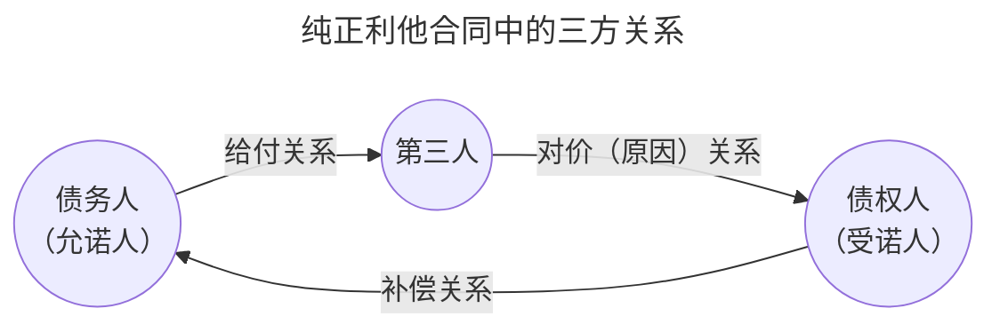

# I.合同的概念

>[!cite] [[民法典#第四百六十四条]]
>合同是民事主体之间设立、变更、终止民事法律关系的==协议==。
>
>婚姻、收养、监护等有关身份关系的协议，适用有关该身份关系的法律规定；没有规定的，可以根据其性质参照适用本编规定。

## 概念解析

### （一）合同是“协议”

- “协议”一词系日常生活用语，其法律意义不精准，应解释为“合意”（意思表示的合一）或“[[2. 法律行为的分类#（1）**双方行为**|双方法律行为]]”取代
	- 双方意思表示的存在与合致
	- 民法典体系内部更应该做概念的整合，将“合同”定义为双方法律行为，可确立合同编（尤其是第二、三章）与总则编第六章之间的关联

- 将合同定位于“法律行为”符合民法体系化的方法——总则编的法律行为制度对“合同”的适用性

### （二）合同是否专属于“债”的范畴？

- 罗马法上的“合同”仅指债权合同
	- 继受罗马法的《法国民法典》也指债权合同
- 《德国民法典》中“契约”的位置
	- 规定在总则编“法律行为”章，因为契约可引发各种私法后果

- 《合同法》立法过程观察
	- 1998年9月的《合同法》草案（征求意见稿）使用“债权债务关系”表；通过时修改为“民事权利义务关系”，另设第2款
- 《民法典》的立场解读
	- 延续《合同法》基本界定，第2款增设身份协议“参照适用”的规定

>[!tldr] 小结
> - 《民法典》合同编基本仅适用于债权合同
> 	- 透过468条，合同通则可作为债法总则
> - 某些规定（如合同订立）对于其他合同有适用余地
> 	- 若承认物权合同的独立存在，则亦须有物权合同成立的规则
> - 调整身份关系的合同原则上适用特别法，但也有准用合同编的问题
> - 可将我国法上的“合同”做狭义和广义的理解
> 	- 狭义合同：仅指产生债权债务关系的合同
> 	- 广义合同：产生其他法律效果的双方法律行为（常使用“协议”表达）

[[民法典#第五百九十七条]]

---
# II. 合同法的基本理念

## 一、合同的性质

- 既属法律事实（法律行为），又具有法律规范的属性
- 这种“规范”效力原则上仅在合同当事人间具有意义（相对性问题）

>[!faq] 问题
>是否均须具备“一般性”，方可成为“法律规范”？公法规范与私法规范是否应区分对待《民法典》合同编的法律条款与一份合同的条款之间的关系为何？

- 《法国民法典》第1134条 依法成立的契约，对缔结该契约的人而言，有相当于法律的效力。
	- 不仅约束双方当事人（当事人间的“行为规范”），而且也应约束法官（裁判规范）
	- 彰显契约自治
	- 裁判规范的属性，最能体现“私法自治”的精神

- 关于合同拘束力的实证法
>[!cite] 
>《合同法》第8条：依法成立的合同，对当事人具有法律约束力。
>《民法典》第465条：依法成立的合同，受法律保护。 依法成立的合同，==仅==对当事人具有法律约束力,但是法律另有规定的除外。

- 司法实践的立场悄然转变
	- 我国过去司法实践中普遍存在的宣告合同无效的做法。
	- 近年来司法实践（尤其体现在最高法院相关司法解释）越来越强调尊重当事人的自治。
		- 围绕“违法合同”（[[民法典#第一百五十三条-第1款|第153条第1款]]）效力的理论与实务争论

## 二、合同法的规范性质

>[!faq] 问题
>既然“契约自由”“合同当事人可以为自己立法”，为什么还需要《合同法》？其基本功能为何？合同法属于典型的任意法，而非强行法

- 合同仅在缔约当事人之间产生效力，且须基于双方当事人意思方可形成合同关系。这一点尤其决定了合同法的任意法规范属性
	- 物权法的强行性规范色彩要浓厚得多，如物权法定是物权法的基本原则

- 从合同实践看合同法规范：人们如何缔结合同？
	- 合同当事人或者由于欠缺经验或者仅是为了便利（节约交易成本），通常仅在最必要事项上形成合意。其余，托付于交易惯例与合同法规范
	- 合同法众多任意性规范的价值：填补当事人意思的空白
	- 即使是汇聚无数人智慧的法典仍有诸多法律漏洞，需要法律续造；具体交易中的当事人利用自治机会穷尽一切纠纷解决预案是不可能的

- 合同立法当然也可体现立法者的意志，但真正与当事人“对着干”（否定合同约定效力）的强行法规范仅占很小的比例
	- 由格式合同等引发的“契约正义”思想的兴起，或许也正在悄悄地改变着合同法
	- 基于特别保护立场的特别合同法（消费者合同、劳动合同、住房租赁合同等）的发展

## 三、合同法的基本理念

### （一）契约自由
### （二）契约正义

---
# III. 合同的分类

## 一、典型合同（有名合同）/非典型合同（无名合同）

>[!example] 例子
>【例1】甲乙约定，甲每天为乙的子女辅导功课2小时，乙则提供住宅一套给甲居住；甲居住之房屋水管爆裂，请求乙维修，甲认为应由乙自费维修，拒绝。怎么处理？
>- 不是租赁合同，根据[[民法典#第七百零三条|703]]，承租人没有支付租金，是混合合同，
>- 但本案争议核心是[[民法典#第七百一十二条|712]]规定的出租人对租赁物的维修义务，可以根据[[民法典#第四百六十七条|467]]参照适用
>
>【例2】甲公司开发的某商业项目滞销，遂推出“售后回租”方案；乙认为有稳定回报，买下一处商铺；后，甲公司拒绝依约承租商铺（或迟延支付租金），问，乙可如何寻求救济？甲乙间存在一个还是两个合同关系？
> - 一个合同，两个联立合同。

- **区分标准**
	- 有无专门的法律规范——法律（不仅限于民法典）是否对某种合同类型作出规定
	- 典型$\neq$常见，日常生活中的借用合同没有被列入典型合同

- **合同的类型任意主义**
	- 即使未为法律专门规范，仍不影响合同的效力；
	- 但纠纷发生时，如何适用法律会成为一个问题

### （一）典型合同

1. **内涵**
	- **有名合同**：法律规定其内容并赋予一定名称的合同。

2. **外延**
	- 《民法典》合同编第二分编“[[民法典#第二分编 典型合同|典型合同]]”
		- eg.*买卖、租赁、保管、借款、承揽、保理、合伙等*
	- 其他法律中规定的合同类型
		- eg.*《旅游法》中的旅游合同、《保险法》中的保险合同*
	- 某些常见合同未被典型化（未被专门调整），如借用合同

3. **有名合同的类型识别及法律适用并非易事**
	- 涉及如何将具体案件事实与某种抽象规范模式相关联的问题
	- “目光往返流连与案件事实与法律规范之间”
	- “李杏英诉上海大润发超市存包损害赔偿案”的启发

### （二）非典型合同

1. **内涵**
	- 无名合同：法律未规定其内容与名称的合同

2. **外延**
	- 非典型交易，eg.*物与劳务的交换*

- 无名合同的再分类
	- 混合合同
	- 合同联立
	- 纯粹无名合同

### （三）区分意义

 - 合同为当事人意思自治的产物，但当事人未必事无巨细均加以明确约定，在当事人对一些事项未作出约定时，有名合同可直接适用法律的任意性规定（范式）

- 主要的问题是从个案法律事实中识别契约的类型（识别“主给付义务”概念的重要性）

- 无名合同的法律适用
	- 适用民法总则、合同编通则，并[[民法典#第四百六十七条|参照最相类似]]的典型合同
	- 在内容确定方面，《民法典》[[民法典#第五百一十条|第510]]、[[民法典#第五百一十一条|511条]]的重要性

- 无名合同有必要类型化

## 二、单务合同/双务合同

1. **分类依据**
	- 依当事人双方是否负互==对待[[Chap1. 债法总论#（一）债的概念（给付）|给付义务]]==进行分类
		- 考虑到对分类意义的探寻，应强调当事人在合同中所负的义务是否具有“对待性”“交换性”“牵连性”

### （一）单务合同

1. **概念**
	- 仅有一方当事人负有义务，他方不负义务的合同

2. **外延**
	- eg.赠与合同（[[民法典#第六百五十七条|657]]）、无偿的保管合同（[[民法典#第八百八十八条|888]]）

### （二）双务合同

1. **概念**
	- 双方互负债务的合同，且两债务**对待存在**（存在对待给付义务）

2. **外延**
	- 买卖（[[民法典#第五百九十七条|597]]）、租赁（[[民法典#第七百零三条|703]]）、承揽（[[民法典#第七百七十条|770]]）等
 
>[!note] 真正意义上的双务合同，需给付之间具有对待（交换）性
> 
> 【问题1】有利息的[[2. 法律行为的分类#四、诺成行为与要物行为|诺成性]]（非自然人之间）借款合同是否为双务合同？
> - 不是，借款合同不具有交换性。
> - 假设今年银行拨付 100 万，明年借款人需还 105 万，假设这样的合同具有交换性，假如借款人不还这 105 万，那银行就可以说不拨付这 100 万，这听起来就很荒谬。
> 
> 【问题2】附义务赠与（661）是否为双务合同？
> - 不是，[[民法典#第六百六十一条|附义务的赠予]]，受赠方要完成的义务不是给付，受赠方未完成义务赠与方只能[[民法典#第六百六十三条|撤销赠与]]
> 
> 【问题3】无偿委托合同，委托人负费用偿还义务，这是否意味着该合同属于双务合同？何谓“不真正（不完全）双务合同”？提出此概念的意义何在？
> - 不意味着，因为本身不具有交换性，[[民法典#第九百二十八条|928]]，[[民法典#第九百二十一条|921]]

2. **区分意义**：双务合同具有特殊效力

- 从当事人的
	- 基于双务合同中双方所负义务的对待性，当事人享有同时履行抗辩权（[[民法典#第五百二十五条|525]]）、顺序履行抗辩权（[[民法典#第五百二十六条|526]]）和不安抗辩权（[[民法典#第五百二十七条|527]]）；单务合同无此问题

- 从对待给付风险来看
	- 双务合同存在对待给付的风险负担问题（一方给付不能的，他方可否据此免除对待给付义务？）；单务合同无此问题

- 从合同解除来看
	- [[民法典#第五百六十三条|合同解除]]权通常发生在双务合同之中，双务合同当事人解除义务原因之一是同时解除自己的义务
	- 单务合同的法定解除，意义有限

## 三、有偿合同/无偿合同

1. **分类依据**
	- 依当事人取得合同权利是否须支付代价，或负担义务是否受有代价为标准进行分类

### （一）无偿合同

1. **概念**：
	- 当事人一方只为给付（负担义务）而无报偿的合同

2. **外延**：
	- eg.*赠与、无偿保管、无偿委托、借用合同*

### （二）有偿合同

1. **概念**
	-  当事人各因给付而取得报偿的合同

2. **外延**
	- eg.*买卖、租赁、承揽、仓储、运输、行纪（？）*

### （三）区分意义

- 债务人是否负瑕疵担保义务不同（[[民法典#第六百一十七条|617]]，对比[[民法典#第六百六十二条|662]]）

- 当事人所负注意义务不同

- 当事人不履行合同时的归责性以及债不履行的后果产生影响

- 无偿债务人往往仅对故意或重大过失负责（[[民法典#第九百二十九条|929]]）

## 四、要式合同/不要式合同
>link.[[2. 法律行为的分类#三、 要式行为与不要式行为]]

1. **分类依据**
	- 以合同是否需要具备特定形式进行分类

2. **合同以不要式为原则**
	- 形式自由系合同自由的一个方面
		- 口头合同，甚至是默示的合同，均具有效力
		- 证据方面的考虑不应影响实体法规则

### 要式合同
依法须具备书面、公证等形式的合同

- 通说认为，其目的在于促请当事人认清有关行为经济意义或固有的风险，敦促他们认真考虑并尽量表达得准确
	- 体现“法律父爱主义”：给予（未以书面形式）冲动决定者反悔的机会
	- 反对者以“倡导性规范”等解释方法消解，但如此便不是”要式“而是”倡导式“了

>[!note] ”履行治愈（形式瑕疵）“规则
>- 形式瑕疵的补正
>	- 《民法典》[[民法典#第四百九十条-第2款|第490条第2款]]
>	- 理由：书面形式主要保护当事人**不因欠考虑的冲动**承担义务，既然合同已经履行，该目的已经不再存在
>- [[民法典#第四百九十条|第490条]]的反面解释
>	- 不具备特定形式，且未被履行治愈者，要式合同不成立

## 五、诺成合同/要物（实践性）合同
>[[2. 法律行为的分类#四、诺成行为与要物行为]]

>[!example] 
>【例1】一日，甲答应无偿借给乙1万元（无息），双方说好一星期后由甲将钱交给乙。后甲反悔，不愿交付金钱。则乙能否诉请强制执行？
>
>【例2】甲乙订立房屋买卖合同，合同约定，买方乙向卖方甲支付10万元定金；乙并未实际支付；后甲违约未履行合同，乙要求甲按照“双倍返还”的实际效果向其支付10万元。是否应支持？

1. **分类标准**
	- 依合同在合意外是否尚须标的物的交付而成立分类
		- 单独提出这一个分类标准，完全无法令人理解

### （一）诺成合同
双方意思表示一致即可成立的合同

- 诺成性是合同的一般属性

### （二）要物合同（实践性合同）
除意思表示外，还需要标的物的交付方可成立（一说“生效”）的合同

- 《民法典》对规定的几种要物合同统一采“成立”

赠与人的任意撤销权[[民法典#第六百五十八条]]

## 六、涉他合同

1. **约束性**
	- 合同原则上仅能约束参与缔约的当事人

2. **分类**
	- 利益第三人合同（利他合同）
	- 第三人负担合同（由第三人给付的合同）

### 由第三人给付的合同

- 通过合同，债务人（允诺人）允诺，将由第三人向债权人（受诺人）履行特定债务
- 例如，某品牌水泥经销商甲公司与乙公司订立买卖合同，约定，货物将由水泥生产商丙公司直接交付于买方乙公司
- 第三人不因此负有义务，有是否履行的自由（其与债务人之间的内部关系及约定不影响此判断）
- 第三人未履行的，债务人须承担债务不履行的责任

### 利益第三人合同

1. **分类**
	- 根据**第三人是否对债务人享有直接的履行请求权**，可进一步区分为纯正（真正）利他合同与非纯正（非真正）利他合同

#### 非纯正利他合同
- 第三人对债务人无直接的履行请求权
	- 《合同法》仅规定了第三人不产生直接请求权的“非纯正利他合同；该类型利他合同仍保留在《民法典》[[民法典#第五百二十二条|第522条第1款]]
- 债务人依约对第三人履行的，构成债务清偿
- 债务人不对第三人履行的，仍由作为合同当事人的债权人（受诺人）主张违约责任；第三人无直接请求权

#### 纯正利他合同
- 第三人对债务人有直接的履行请求权
- 《民法典》[[民法典#第五百二十二条-第2款|第522条第2款]]增设了纯正的利他合同

- 第三人直接请求权的基础：法律规定或当事人约定
- 债权人与债务人间的（补偿）关系是利他合同的基础
	- 若债权人与债务人间的合同无效，不产生第三人的请求权
	- 第三人即使享有直接的给付请求权，也不享有撤销权、解除权等动摇合同效力的权利
- 债权人与第三人之间的原因（对价）关系
	- 解释为什么债权人会让债务人向第三人履行
	- 原因可以是赠与、代物清偿等；若不存在此原因，则第三人受领后，债权人可向其主张不当得利
- 债务人与第三人间的关系
	- 债务人不履行的，第三人可主张履行或损害赔偿，但不得主张合同解除
	- 债务人可向第三人主张补偿关系上的抗辩

>[!cite] 《合同编通则解释》第二十九条
> 
> 民法典第五百二十二条第二款规定的第三人请求债务人向自己履行债务的，人民法院应予支持；请求行使撤销权、解除权等民事权利的，人民法院不予支持，但是法律另有规定的除外。
> 
> 合同依法被撤销或者被解除，债务人请求债权人返还财产的，人民法院应予支持。
> 
> 债务人按照约定向第三人履行债务，第三人拒绝受领，债权人请求债务人向自己履行债务的，人民法院应予支持，但是债务人已经采取提存等方式消灭债务的除外。第三人拒绝受领或者受领迟延，债务人请求债权人赔偿因此造成的损失的，人民法院依法予以支持。

利他合同原理在婚姻家庭编领域的应用

>[!example] 例
>甲、乙在离婚协议中约定，共有房产A归甲所有，但甲应在二人婚生子丙18岁时移转登记给丙；丙18岁时，甲拒绝将房产登记给丙。如何救济？

>[!cite] 《婚姻家庭编解释（二）》第二十条 
>离婚协议约定将部分或者全部夫妻共同财产给予子女，离婚后，一方在财产权利转移之前请求撤销该约定的，人民法院不予支持，但另一方同意的除外。
> 
> 一方不履行前款离婚协议约定的义务，另一方请求其承担继续履行或者因无法履行而赔偿损失等民事责任的，人民法院依法予以支持。
> 
> 双方在离婚协议中明确约定子女可以就本条第一款中的相关财产直接主张权利，一方不履行离婚协议约定的义务，子女请求参照适用民法典第五百二十二条第二款规定，由该方承担继续履行或者因无法履行而赔偿损失等民事责任的，人民法院依法予以支持。

## 七、射幸合同

- 射幸合同（射悻合同）：以未来不确定事件（偶然机会）而决定是否给付的合同

- 属于生效的合同，通常一方已负有（且履行）给付义务，而对方是否负有给付义务取决于约定的事实是否出现

- 类型：保险合同、搏彩合同等
	- 前者为合法合同，不过同样受管制
	- 后者，仅有政府批准的搏彩才具有合法性

- 私人间的赌博，通常仅产生[[Chap2. 债的类型（标的）#二、自然之债（不完全债权）|自然之债]]的效果，或完全不被承认私法效果

## 八、预约（合同）与本约（合同）

- **预约**：预定将来订立合同（本约）的合同

- 自“阶段式缔约”思想看预约
	- 系当事人决定受合同拘束的手段
	- 类似工具：框架协议等

>[!cite] [[民法典#第四百九十五条|第四百九十五条]] 
>当事人约定在将来一定期限内订立合同的认购书、订购书、预订书等，构成预约合同。
>当事人一方不履行预约合同约定的订立合同义务的，对方可以请求其承担预约合同的违约责任。

- 预约的认定
	- 重点在于识别当事人有将来订立本约的意思，并受此意思拘束
	- 对于实质性交易（本约意义上的交易），预约应具有“中间成熟度”
		- 仅有交易意向，不足以成立预约
		- 若以“认购书”等名义出现的合约已经具备了交易成立的要素，且当事人无阶段缔约的意思，则不应再将此“认购书”认定为预约

>[!cite] [[合同编通则解释#第六十七条-第2款]]
>当事人约定以交付定金作为订立合同的担保，一方拒绝订立合同或者在磋商订立合同时违背诚信原则导致未能订立合同，对方主张适用民法典[[民法典#第五百八十七条|第五百八十七条]]规定的定金罚则的，人民法院应予支持。

>[!cite] [[合同编通则解释#第六条]]
>当事人以认购书、订购书、预订书等形式约定在将来一定期限内订立合同，或者为担保在将来一定期限内订立合同交付了定金，能够确定将来所要订立合同的主体、标的等内容的，人民法院应当认定预约合同成立。
> 
> 当事人通过签订意向书或者备忘录等方式，仅表达交易的意向，未约定在将来一定期限内订立合同，或者虽然有约定但是难以确定将来所要订立合同的主体、标的等内容，一方主张预约合同成立的，人民法院不予支持。
> 
> 当事人订立的认购书、订购书、预订书等已就合同标的、数量、价款或者报酬等主要内容达成合意，符合本解释第三条第一款规定的合同成立条件，未明确约定在将来一定期限内另行订立合同，或者虽然有约定但是当事人一方已实施履行行为且对方接受的，人民法院应当认定本约合同成立。

- 预约的效力
	- 一般意义上，预约双方当事人均负有缔结本约的义务
		- 但是，这是否意味着，只要本约未订立，即应认定存在预约的违反？
	- “必须缔约说” V. “诚信磋商说”
		- 应结合预约的认定标准，结合个案中当事人的意思解释，具体确定采“必须缔约”（结果债务）或“诚信磋商”（手段债务）的立场

>[!cite] 《合同编通则解释》第七条 
>预约合同生效后，当事人一方拒绝订立本约合同或者在磋商订立本约合同时违背诚信原则导致未能订立本约合同的，人民法院应当认定该当事人不履行预约合同约定的义务。
> 
> 人民法院认定当事人一方在磋商订立本约合同时是否违背诚信原则，应当综合考虑该当事人在磋商时提出的条件是否明显背离预约合同约定的内容以及是否已尽合理努力进行协商等因素。

- 违反预约的后果（责任）
	- 存在预约义务违反的，当事人须按照违约的一般原理（577条之下的规定）承担违约责任
	- 问题是，相对方可如何主张其请求权？焦点在于，是否可诉请“实际履行”，即主张判令订立本约合同？
		- 目前通说：仅能主张损害赔偿，不得要求实际履行（[[民法典#第五百八十条|580]]）
			- 若主张违反预约的损害赔偿，则在确定赔偿金额方面将会面临困难

>[!cite] [[合同编通则解释#第八条]]
>预约合同生效后，当事人一方不履行订立本约合同的义务，对方请求其赔偿因此造成的损失的，人民法院依法予以支持。
>
>前款规定的损失赔偿，当事人有约定的，按照约定；没有约定的，人民法院应当综合考虑预约合同在内容上的完备程度以及订立本约合同的条件的成就程度等因素酌定。

