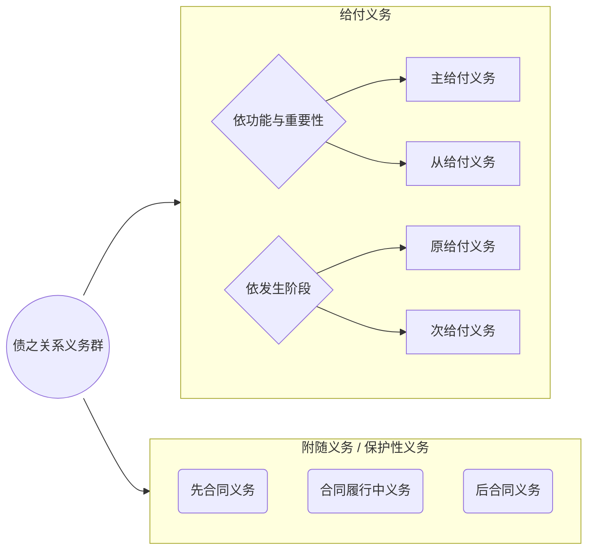
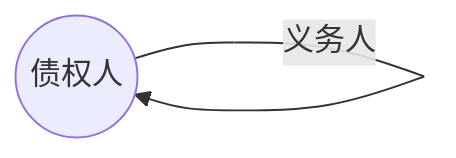

# I 债之关系上的义务群

广义的债之关系是一个由众多义务组成的复杂、动态的有机组织。它不仅包含决定合同类型的核心给付义务，还衍生出其他辅助性和保护性的义务。

> [!cite] 梅迪库斯:《德国债法总论》
> 
> “广义的债务关系是一个极其复杂的架构……它不是静态地僵固于一个一成不变的状态之中，而是随时间变化不断地以多种形态发生变动……”

这些义务群的基础是==诚实信用原则==，主要针对合同之债（但其他债务关系也存在多层次关系）。

>[!cite] [[民法典#第五百零九条]]
>当事人应当按照约定**全面履行**自己的义务。
>当事人应当**遵循诚信原则**，根据合同的性质、目的和交易习惯履行通知、协助、保密等义务。
>当事人在履行合同过程中，应当避免浪费资源、污染环境和破坏生态。

## 一、给付义务

给付义务是债之关系的核心，旨在满足债权人的特定利益。 

### （一）给付行为与给付效果

> [!question] 思考
> 
> 1. 医生尽力手术但未能治愈患者，是否违约？ 
> 2. 律师代理案件但败诉，是否违约？ 
> 3. 锁匠配制的钥匙无法开锁，是否有权拒付报酬？ 

这涉及到对“给付”含义的区分：

>[!note] 给付的两重含义
>- **给付行为**：仅评价给付行为的妥当性，而不要求给付达致特定效果
>- **给付结果**：所实施的给付行为须达致特定效果，否则为债务的不适当给付
>
>给付以满足债权为宗旨，故给付的内容必须与特定的债权目的相关联

#### 1.  **方式债务（给付行为之债）** 

- **定义**: 债务人仅需以专业、审慎的方式实施特定行为，不保证必然达成某种结果。 
	
- **举例**: 医疗服务合同、律师代理合同。 
	
- **违约认定**: 考察行为过程本身是否妥当、是否尽到应有的注意义务。
	
- **归责原则**: 通常适用==过错责任原则==。 

#### 2. **结果债务（给付效果之债）**

- **定义**: 债务人的履行行为必须达到约定的特定效果。 
	
- **举例**: 承揽合同（如修配钥匙）、买卖合同。 
	
- **违约认定**: 只要结果未达成，即构成违约，除非有免责事由。
	
- **归责原则**: 通常适用==严格责任原则==。

>[!tip] 区分给付行为与给付效果：意义
>1. 这样的区分是确定「[[民法典#第五百七十七条|债务不履行]]」「义务违反」「违约」的基础
>2. 对于「违约责任的归责原则」问题的意义（？？？）
>3. 瑕疵担保等主要针对给付效果之债

### （二）主给付义务与从给付义务

#### 1. **主给付义务（主要义务）**

> [!cite] 《民法典》[[民法典#第五百六十三条|第 563 条]]
> 有下列情形之一的，当事人可以**解除合同**：
> （二）在履行期限届满前，当事人一方明确表示或者以自己的行为表明**不履行主要债务**；
> （三）当事人一方**迟延履行主要债务**，经催告后在合理期限内仍未履行；
> （四）当事人一方**迟延履行债务**或者有其他违约行为**致使不能实现合同目的**；

- **定义**: 决定债之关系类型的、固有且必备的**义务**。 
	
- **识别**:
	
	- 《民法典》[[民法典#第五百九十五条|第595条]] (买卖合同): 出卖人==转移所有权==，买受人==支付价款==。 
		
	- 《民法典》[[民法典#第七百零三条|第703条]] (租赁合同): 出租人==交付租赁物供使用收益==，承租人==支付租金==。 
		
- **法律意义**:
	
	- **合同定性**: 确定合同类型，从而适用相应的法律规范。 
		
	- **合同解除**: 不履行主要债务是导致合同解除的重要事由。 
		
	- **履行抗辩**: 双务合同中的主给付义务互为对待给付，是行使同时履行、顺序履行等抗辩权的基础。 

>[!cite] [[民法典#第五百九十八条]]
>（主给付义务）出卖人应当履行向买受人交付标的物或者交付提取标的物的单证，并转移标的物所有权的义务。

>[!cite] [[民法典#第五百七十八条]]
>当事人一方明确表示或者以自己的行为表明不履行合同义务的，对方可以在履行期限届满前请求其承担违约责任。
#### 2. **从给付义务 (非主要义务)**

- **定义**: 辅助主给付义务，使债权人利益得到更圆满满足的义务。 

>[!tip] 识别
>债务人付出很小的成本能为债权人带来重大的利益或者避免重大的损失。

- **来源**:
	
	- **法律规定**: 如《民法典》[[民法典#第五百九十九条|第599条]]规定的交付相关单证和资料的义务。 
		
	- **当事人约定**: 如竞业禁止约定。 
		
	- **诚信原则**: 如交付名马时附随交付血统证明书。 
		
- **法律意义**:
	
	- 可独立诉请履行。 
		
	- 原则上，不履行从给付义务不产生解除权，但若==致使合同目的不能实现==，则例外。 

> [!cite] 司法解释：《[[合同编通则解释#第二十六条|合同编通则解释]]》
> **第二十六条** 当事人一方未根据法律规定或者合同约定履行开具发票、提供证明文件等**非主要债务**，对方请求继续履行该债务并赔偿因怠于履行该债务造成的损失的，人民法院依法予以支持；对方请求解除合同的，人民法院不予支持，但是**不履行该债务致使不能实现合同目的**或者当事人另有约定的除外。

>[!cite] [[民法典#第三十一条]]
> **第三十一条** 当事人互负债务，一方以对方没有履行**非主要债务**为由拒绝履行自己的主要债务的，人民法院不予支持。但是，对方不履行非主要债务致使**不能实现合同目的**或者当事人另有约定的除外。 

### （三）原给付义务与次给付义务
	动态性

#### 1. 原给付义务 (第一次义务)
    
- **定义**: 债之关系中原有的、固有的义务，包括主给付义务和从给付义务。 

#### 2. 次给付义务 (第二次义务)
    
- **定义**: 原给付义务因特定事由（主要是违约）演变而来的义务。 
	
- **类型**:
	
	- **损害赔偿义务**:
		
		- 替代原给付的赔偿（履行不能）。
			
		- 与原给付并存的赔偿（迟延履行）。
			
	- **恢复原状、费用返还等义务**:
		
		- 合同解除后的返还义务。
			
		- 标的物瑕疵时的减价、退货义务。
			
- **理论意义 (债之关系的同一性)**:
	
	- 将违约责任理解为次给付义务，强调了其根植于原合同关系，从而使得原合同关系中的抗辩（如时效抗辩）、担保等效力可以延续至次给付义务。 
		
	- **解释合同解除的后果**: 解除仅消灭了“原给付义务”，但产生了具有同一性的“次给付义务”（如恢复原状、损害赔偿），因此担保责任等可以继续存在。 

 > [!cite] 法条依据：《民法典》[[民法典#第五百六十六条|第 566 条]]
>合同解除后，尚未履行的，终止履行；已经履行的，根据履行情况和合同性质，当事人可以请求恢复原状或者采取其他补救措施，并有权请求赔偿损失。
>
>合同**因违约解除的**，解除权人**可以请求违约方承担违约责任**，但是当事人另有约定的除外。
>
>**主合同解除后**，**担保人对债务人应当承担的民事责任仍应当承担担保责任**，但是担保合同另有约定的除外。

## 二、附随义务 （保护性义务）

- **定义**: 基于诚信原则，在给付义务（主/从给付）之外，为保护对方当事人的人身或财产利益而产生的义务。 

>[!cite] [[民法典#第五百零九条-第2款]]
>当事人应当遵循诚信原则，根据合同的性质、目的和交易习惯履行通知、协助、保密等义务。

- **典型类型**: 通知、协助、保密、保护等。

>[!note] 与[[Chap5. 债之关系的内容与履行#2. **从给付义务 (非主要义务)**|从给付义务]]的区别
> - **目的**: 附随义务旨在保护对方人身、财产利益；从给付义务旨在辅助主给付，使给付利益更圆满。
> - **诉请履行**: 附随义务==不能独立诉请履行==（在法理构造上，若考虑保护性义务则该问题有学理争议）；从给付义务可以。
	
- **违反后果**: 构成债务不履行 / 违约 / 义务违反，从而适用债务不履行（==损害赔偿==）的后果。 
	- 由于附随义务不能诉请实际履行，故债权人可就相关损失向债务人主张基于违约的损害赔偿（584）

## 三、先合同义务与后合同义务

基于诚信原则产生的保护性义务贯穿于合同关系的始终。

### 1. **先合同义务**

- **阶段**: 缔约磋商阶段。 
	
- **内容**: 说明、告知、保密、保护等。 
	
- **违反后果**: 承担==缔约过失责任==（法定损害赔偿之债）。 

### 2. **后合同义务**

- **发生原因**：
	- 在合同之债消灭后，给付的效果要得以维持，时常需要使当事人继续负有一定的作为及不作为义务。
	
- **阶段**: 合同权利义务终止后。 
	
- **内容**: 通知、协助、保密、旧物回收等。 

>[!note] 对于某些后合同义务，债权人也可以请求履行
>如住院病人在治愈出院后可请求医院出具医疗证明。债务人违反后合同义务的，应视同为对合同义务的不履行，从而应依违约责任的有关规定负其责任。 

- **违反后果**: 视为对合同义务的不履行，承担==违约责任==。 

> [!cite] 法条依据：《民法典》[[民法典#第五百八十八条|第 558 条]] 
> 
> 债权债务终止后，当事人应当遵循诚信等原则，根据交易习惯履行通知、协助、保密、旧物回收等义务。

## 四、不真正义务

- **定义**: 并非对他人的义务，而是对自己设定的负担。违反它不会导致对方请求履行或赔偿，但会使自己丧失或减损权利。 
    
- **义务人**: 通常是==权利人==（债权人）。 
    
- **典型例子**:
    
    - **减损规则**: 违约发生后，非违约方的防止损失扩大“义务”。 
        
    - **检验通知**: 买受人的检验和通知“义务”。 

> [!cite] 法条依据：《民法典》第 591 条 
> 
> 当事人一方违约后，对方应当采取适当措施防止损失的扩大；没有采取适当措施致使损失扩大的，**不得就扩大的损失要求赔偿**。

# II. 债之内容的确定及履行细节

## 一、债之内容的确定

1. **法定之债**: 依法律规定确定（如侵权、无因管理、不当得利）。 
	- **侵权行为之债**：所致损害的赔偿（*《民法典》侵权责任编第2章*）
	- **无因管理之债**：费用偿还、损害补偿、报告等（*979-983*）
	- **不当得利**：利得的返还（*985-988*）
    
2. **意定之债 (合同之债)**:
    
    - **首先**: 依当事人约定（契约原则）。 
	    - 当事人约定存在由一方约定或第三方决定的情况。
        
    - **其次**: 约定不明时，可协议补充。 
        
    - **再次**: 不能达成补充协议的，按合同相关条款或交易习惯确定。 
    
    - **最后**: 仍不能确定的，适用法律的补充规则。 

> [!cite] 法条依据：《民法典》[[民法典#第五百一十一条|第 511 条]]（有改动） 
> 当事人就有关合同内容约定不明确，依据前条规定仍不能确定的，适用下列规定：
> - **(一) 质量要求不明确的**: 按国家标准、行业标准、通常标准或符合合同目的的特定标准。
>     
> - **(二) 价款不明确的**： 按订立合同时履行地的市场价。
>     
> - **(三) 履行地点不明确**：[[Chap2. 债的类型（标的）#（一）特定物之债|review.特定化]]
>     
>     - 给付货币：在==接受货币一方==所在地（债务人负担风险与费用）
>         
>     - 交付不动产：在==不动产==所在地。
>         
>     - 其他标的：在==履行义务一方==所在地（即“往取债务”）。
>         
> - **(四) 履行期限不明确的**：债务人可随时履行，债权人也可随时请求，但应给对方必要准备时间。*（债权人主张履行，合理准备时间过去债务人仍未履行的，构成给付迟延；反之，将构成债权人受领迟延）*
> >[!note] 「履行期届至」与「履行期届满」
> >>[!example] 3月1日订立买卖合同，约定交货期为4月1日-4月30日
> >- **履行期届至**（4.1），债务人可以提出给付，债权人有义务受领；不及时受领的，构成债权人受领迟延；**履行期未届至**，债权人不得要求债务人给付，债务人原则上也不得提前给付
> >- **履行期届满**（4.30），债权人可要求债务人履行；债务人不及时履行，构成给付迟延
> 
>     
> - **(五) 履行方式不明确的**：按有利于实现合同目的的方式。
>     
> - **(六) 履行费用不明确的**：由履行义务一方负担。因债权人原因增加的履行费用，由债权人负担。
>     

## 二、提前履行与部分履行

### 1. **提前履行**
    
- **规则**: 
	- 债权人不得要求债务人提前履行
	- 债务人原则上也不得提前履行债务
		- 债权人==可以拒绝==债务人提前履行，但提前履行不损害其利益的除外。 
	
- **费用**: 因此增加的费用由==债务人==负担。 

> [!cite]  [[民法典#第五百三十条]]  
> 债权人可以拒绝债务人提前履行债务，但是提前履行不损害债权人利益的除外。
> 债务人提前履行债务给债权人增加的费用，由债务人负担。

### 2. **部分履行**
    
- **规则**: 债权人==可以拒绝==，但部分履行不损害其利益的除外。 
	- 原因：债权人通常对于一次性受领全部给付具有利益
	
- **费用**: 债权人接受债务人部分给付的，因此增加的费用由==债务人==负担。 

>[!cite] [[民法典#第五百三十一条]]
>债权人可以拒绝债务人部分履行债务，但是部分履行不损害债权人利益的除外。
债务人部分履行债务给债权人增加的费用，由债务人负担。

# 第三节 双务合同履行抗辩权

履行抗辩权是双务合同牵连性的体现，旨在确保对待给付的公平实现。 

>[!note] 双务合同中的对待给付
>主合同义务，构成对待给付，具有牵连性
>从合同义务，依其是否影响合同目的之实现，决定是否构成对待给付。

## 一、同时履行抗辩权

> [!cite] 《民法典》[[民法典#第五百二十五条|第 525 条]] 
> 
> 当事人互负债务，没有先后履行顺序的，应当同时履行。**一方在对方履行之前有权拒绝其履行请求**。一方在对方履行债务不符合约定时，有权拒绝其相应的履行请求。

- **定义**: 在没有先后履行顺序的双务合同中，一方在对方未为对待给付前，有权拒绝自己给付的权利。 
	
- **原理**：保护任何一方不背强使先为给付，因先给付一方将承担对方不为对待给付的风险。
    
- **成立要件**:
    
    1. 双方因==同一双务合同==互负债务。
        
    2. 双方债务==没有先后履行顺序==。
        
    3. 相对人未为给付或或未提出给付。
        
- **法律效果**:
    
    - 行使抗辩权不构成违约（一时性、阻碍性抗辩）。 
    
    - 抗辩权只有经抗辩权人行使才发生阻却请求权的效力，若在相对人提出给付请求时，债务人未援引该抗辩，而为给付，则事后不得主张给付的返还
    
    - 诉讼中，若抗辩成立，法院应作出“[[合同编通则解释#第三十一条-第2款|同时给付判决]]”。 

## 二、顺序履行抗辩权 （先履行抗辩权）

> [!cite] 法条依据：《民法典》[[民法典#第五百二十六条|第 526 条]] 
> 
> 当事人互负债务，有先后履行顺序，应当先履行债务一方未履行的，后履行一方有权拒绝其履行请求。先履行一方履行债务不符合约定的，后履行一方有权拒绝其相应的履行请求。

- **定义**: 在有先后履行顺序的双务合同中，==后履行一方==在先履行一方未履行或履行不符合约定时，有权拒绝自己给付的权利。 
    
- **适用前提**:
    
    1. 双方因同一双务合同互负债务。
        
    2. 合同约定了==先后履行顺序==。
        
    3. 应先履行的一方未履行或履行不当。
        
- **法律效果**:
    
    - [[合同编通则解释#第三十一条-第3款|诉讼中]]，若抗辩成立，法院应==驳回原告的诉讼请求==。 

## 三、不安抗辩权

- **定义**: ==先履行一方==有确切证据证明后履行一方财产状况恶化、丧失商业信誉等，可能难以获得对待给付时，有权==中止履行==的权利。 
    
- **构成要件**:
    
    1. 须为负有==先给付义务==的一方。
        
    2. 对方当事人（后给付方）存在难为对待给付的情形

- **行使程序与法律效果**:
    
    1. **中止履行**，并==及时通知==对方。
        
    2. 若对方在合理期限内提供了==适当担保==或恢复了履行能力，应当恢复履行。
        
    3. 若对方未提供担保且未恢复履行能力，中止履行的一方可以==解除合同==并请求其承担违约责任。

> [!cite] 民法典
> [[民法典#第五百二十七条|527]]  应当先履行债务的当事人，有确切证据证明对方有下列情形之一的，可以中止履行：  
（一）经营状况严重恶化；  
（二）转移财产、抽逃资金，以逃避债务；  
（三）丧失商业信誉；  
（四）有丧失或者可能丧失履行债务能力的其他情形。  
当事人没有确切证据中止履行的，应当承担违约责任。
>
>[[民法典#第五百二十八条|528]]  当事人依据前条规定中止履行的，应当及时通知对方。对方提供适当担保的，应当恢复履行。中止履行后，对方在合理期限内未恢复履行能力且未提供适当担保的，[[民法典#第五百七十八条|视为以自己的行为表明不履行主要债务]]，中止履行的一方可以解除合同并可以请求对方承担违约责任。

# 第四节 情势变更

>[!cite] [[民法典#第五百三十三条]]
>合同成立后，合同的基础条件发生了当事人在订立合同时无法预见的、不属于商业风险的重大变化，继续履行合同对于当事人一方明显不公平的，受不利影响的当事人可以与对方重新协商；在合理期限内协商不成的，当事人可以请求人民法院或者仲裁机构变更或者解除合同。
>
>人民法院或者仲裁机构应当结合案件的实际情况，根据公平原则变更或者解除合同。

- **理论基础**: 契约严守原则的例外，源于“契约基础丧失”理论。 
	- “交易基础丧失”比“情势变更”有更丰富的内涵，它不仅包括合同订立后的情势变化，而且也包括合同自始即存在与当事人认知不符的情形（[[4. 法律行为的生效与效力障碍#2. 意思与表示不一致：==无意==不一致（==重大误解==/==错误==）|共同错误]]）
    
- **定义**：
	- 合同成立后，作为合同基础的客观条件发生了当事人订立合同时无法预见的、不属于商业风险的重大变化，继续履行对一方明显不公平时，允许当事人变更或解除合同的制度。 
    
- **构成要件**: 
	1. 合同成立并生效
	2. 存在“合同的基础条件”
		- 双方当事人共同的想法，或一方主观想法而对方知晓并无异议
	3. 发生基础条件的重大变化，对该种变化当事人不可预见
	4. 导致信守合同不可被期待

- **情势变更的类型**
	- 等值障碍（价格大幅波动）
	- 目的障碍

- **法律效果**: 
    
    1. 受不利影响的当事人可以与对方==重新协商==。
        
    2. 协商不成的，可以请求法院或仲裁机构==变更或解除合同==。

> [!cite] 司法解释：《合同编通则解释》
> 
> [[合同编通则解释#第三十二条|第三十二条]] ……因政策调整或者市场供求关系异常变动等原因导致价格发生当事人在订立合同时无法预见的、不属于商业风险的涨跌，继续履行合同对于当事人一方明显不公平的，人民法院应当认定……发生了……“重大变化”。……当事人事先约定排除民法典第五百三十三条适用的，人民法院应当认定该约定无效。 

